# 【GPU精粹与Shader编程】《GPU Gems 1》全书核心内容提炼总结

 

题图背景来自《战神4》。

 

本文的知乎专栏版本：

上篇：
[https://zhuanlan.zhihu.com/p/35974789](https://zhuanlan.zhihu.com/p/35974789)

下篇：
[https://zhuanlan.zhihu.com/p/36499291](https://zhuanlan.zhihu.com/p/36499291)

 # 快捷导航目录
 
 **PS: 等待网页加载完成后即可顺利进行快速导航跳转。**

<!-- TOC -->

- [【GPU精粹与Shader编程】《GPU Gems 1》全书核心内容提炼总结](#%E3%80%90gpu%E7%B2%BE%E7%B2%B9%E4%B8%8Eshader%E7%BC%96%E7%A8%8B%E3%80%91%E3%80%8Agpu-gems-1%E3%80%8B%E5%85%A8%E4%B9%A6%E6%A0%B8%E5%BF%83%E5%86%85%E5%AE%B9%E6%8F%90%E7%82%BC%E6%80%BB%E7%BB%93)
- [快捷导航目录](#%E5%BF%AB%E6%8D%B7%E5%AF%BC%E8%88%AA%E7%9B%AE%E5%BD%95)
- [系列文章前言](#%E7%B3%BB%E5%88%97%E6%96%87%E7%AB%A0%E5%89%8D%E8%A8%80)
- [目录 · 核心内容Highlight](#%E7%9B%AE%E5%BD%95-%C2%B7-%E6%A0%B8%E5%BF%83%E5%86%85%E5%AE%B9highlight)
- [《GPU Gems 1》其书](#%E3%80%8Agpu-gems-1%E3%80%8B%E5%85%B6%E4%B9%A6)
- [书本配套资源与源代码下载](#%E4%B9%A6%E6%9C%AC%E9%85%8D%E5%A5%97%E8%B5%84%E6%BA%90%E4%B8%8E%E6%BA%90%E4%BB%A3%E7%A0%81%E4%B8%8B%E8%BD%BD)
- [系列文章风格说明](#%E7%B3%BB%E5%88%97%E6%96%87%E7%AB%A0%E9%A3%8E%E6%A0%BC%E8%AF%B4%E6%98%8E)
- [上篇 · 主核心内容提炼总结](#%E4%B8%8A%E7%AF%87-%C2%B7-%E4%B8%BB%E6%A0%B8%E5%BF%83%E5%86%85%E5%AE%B9%E6%8F%90%E7%82%BC%E6%80%BB%E7%BB%93)
- [一、 用物理模型进行高效的水模拟（Effective Water Simulation from Physical Models）](#%E4%B8%80%E3%80%81-%E7%94%A8%E7%89%A9%E7%90%86%E6%A8%A1%E5%9E%8B%E8%BF%9B%E8%A1%8C%E9%AB%98%E6%95%88%E7%9A%84%E6%B0%B4%E6%A8%A1%E6%8B%9F%EF%BC%88effective-water-simulation-from-physical-models%EF%BC%89)
    - [【内容概览】](#%E3%80%90%E5%86%85%E5%AE%B9%E6%A6%82%E8%A7%88%E3%80%91)
    - [【核心内容提炼】](#%E3%80%90%E6%A0%B8%E5%BF%83%E5%86%85%E5%AE%B9%E6%8F%90%E7%82%BC%E3%80%91)
        - [1.1 背景与范围](#11-%E8%83%8C%E6%99%AF%E4%B8%8E%E8%8C%83%E5%9B%B4)
        - [1.2 水体渲染的思路](#12-%E6%B0%B4%E4%BD%93%E6%B8%B2%E6%9F%93%E7%9A%84%E6%80%9D%E8%B7%AF)
            - [1.2.1 波的选择](#121-%E6%B3%A2%E7%9A%84%E9%80%89%E6%8B%A9)
            - [1.2.2 法线与切线](#122-%E6%B3%95%E7%BA%BF%E4%B8%8E%E5%88%87%E7%BA%BF)
        - [1.3 波的几何特征](#13-%E6%B3%A2%E7%9A%84%E5%87%A0%E4%BD%95%E7%89%B9%E5%BE%81)
            - [1.3.2 Gerstner波](#132-gerstner%E6%B3%A2)
            - [1.3.3 波长等参数的选择](#133-%E6%B3%A2%E9%95%BF%E7%AD%89%E5%8F%82%E6%95%B0%E7%9A%84%E9%80%89%E6%8B%A9)
        - [1.4 波的纹理特征](#14-%E6%B3%A2%E7%9A%84%E7%BA%B9%E7%90%86%E7%89%B9%E5%BE%81)
        - [1.5 关于深度](#15-%E5%85%B3%E4%BA%8E%E6%B7%B1%E5%BA%A6)
    - [【核心要点总结】](#%E3%80%90%E6%A0%B8%E5%BF%83%E8%A6%81%E7%82%B9%E6%80%BB%E7%BB%93%E3%80%91)
    - [【关键词提炼】](#%E3%80%90%E5%85%B3%E9%94%AE%E8%AF%8D%E6%8F%90%E7%82%BC%E3%80%91)
- [二、Dawn Demo中的皮肤渲染（Skin in the Dawn Demo）](#%E4%BA%8C%E3%80%81dawn-demo%E4%B8%AD%E7%9A%84%E7%9A%AE%E8%82%A4%E6%B8%B2%E6%9F%93%EF%BC%88skin-in-the-dawn-demo%EF%BC%89)
    - [十年技术变迁： NVIDIA Dawn Demo](#%E5%8D%81%E5%B9%B4%E6%8A%80%E6%9C%AF%E5%8F%98%E8%BF%81%EF%BC%9A-nvidia-dawn-demo)
    - [【章节概览】](#%E3%80%90%E7%AB%A0%E8%8A%82%E6%A6%82%E8%A7%88%E3%80%91)
    - [【核心内容提炼】](#%E3%80%90%E6%A0%B8%E5%BF%83%E5%86%85%E5%AE%B9%E6%8F%90%E7%82%BC%E3%80%91)
        - [2.1 关于皮肤着色](#21-%E5%85%B3%E4%BA%8E%E7%9A%AE%E8%82%A4%E7%9D%80%E8%89%B2)
        - [2.2 皮肤如何对光进行响应](#22-%E7%9A%AE%E8%82%A4%E5%A6%82%E4%BD%95%E5%AF%B9%E5%85%89%E8%BF%9B%E8%A1%8C%E5%93%8D%E5%BA%94)
        - [2.3 场景的照明](#23-%E5%9C%BA%E6%99%AF%E7%9A%84%E7%85%A7%E6%98%8E)
        - [2.4 实现](#24-%E5%AE%9E%E7%8E%B0)
    - [【核心要点总结】](#%E3%80%90%E6%A0%B8%E5%BF%83%E8%A6%81%E7%82%B9%E6%80%BB%E7%BB%93%E3%80%91)
    - [【本章配套源代码汇总表】](#%E3%80%90%E6%9C%AC%E7%AB%A0%E9%85%8D%E5%A5%97%E6%BA%90%E4%BB%A3%E7%A0%81%E6%B1%87%E6%80%BB%E8%A1%A8%E3%80%91)
    - [【关键词提炼】](#%E3%80%90%E5%85%B3%E9%94%AE%E8%AF%8D%E6%8F%90%E7%82%BC%E3%80%91)
- [三、无尽波动的草地叶片的渲染（Rendering Countless Blades of Waving Grass）](#%E4%B8%89%E3%80%81%E6%97%A0%E5%B0%BD%E6%B3%A2%E5%8A%A8%E7%9A%84%E8%8D%89%E5%9C%B0%E5%8F%B6%E7%89%87%E7%9A%84%E6%B8%B2%E6%9F%93%EF%BC%88rendering-countless-blades-of-waving-grass%EF%BC%89)
    - [【章节概览】](#%E3%80%90%E7%AB%A0%E8%8A%82%E6%A6%82%E8%A7%88%E3%80%91)
    - [【核心内容提炼】](#%E3%80%90%E6%A0%B8%E5%BF%83%E5%86%85%E5%AE%B9%E6%8F%90%E7%82%BC%E3%80%91)
        - [3.1 概述](#31-%E6%A6%82%E8%BF%B0)
        - [3.2 草的纹理](#32-%E8%8D%89%E7%9A%84%E7%BA%B9%E7%90%86)
        - [3.3 草体](#33-%E8%8D%89%E4%BD%93)
        - [3.4 草地动画](#34-%E8%8D%89%E5%9C%B0%E5%8A%A8%E7%94%BB)
    - [【核心要点总结】](#%E3%80%90%E6%A0%B8%E5%BF%83%E8%A6%81%E7%82%B9%E6%80%BB%E7%BB%93%E3%80%91)
    - [【本章配套源代码汇总表】](#%E3%80%90%E6%9C%AC%E7%AB%A0%E9%85%8D%E5%A5%97%E6%BA%90%E4%BB%A3%E7%A0%81%E6%B1%87%E6%80%BB%E8%A1%A8%E3%80%91)
    - [【关键词提炼】](#%E3%80%90%E5%85%B3%E9%94%AE%E8%AF%8D%E6%8F%90%E7%82%BC%E3%80%91)
- [四、次表面散射的实时近似（Real-Time Approximations to Subsurface Scattering）](#%E5%9B%9B%E3%80%81%E6%AC%A1%E8%A1%A8%E9%9D%A2%E6%95%A3%E5%B0%84%E7%9A%84%E5%AE%9E%E6%97%B6%E8%BF%91%E4%BC%BC%EF%BC%88real-time-approximations-to-subsurface-scattering%EF%BC%89)
    - [【章节概览】](#%E3%80%90%E7%AB%A0%E8%8A%82%E6%A6%82%E8%A7%88%E3%80%91)
    - [【核心内容提炼】](#%E3%80%90%E6%A0%B8%E5%BF%83%E5%86%85%E5%AE%B9%E6%8F%90%E7%82%BC%E3%80%91)
        - [4.1 次表面散射的视觉特性（The Visual Effects of Subsurface Scattering）](#41-%E6%AC%A1%E8%A1%A8%E9%9D%A2%E6%95%A3%E5%B0%84%E7%9A%84%E8%A7%86%E8%A7%89%E7%89%B9%E6%80%A7%EF%BC%88the-visual-effects-of-subsurface-scattering%EF%BC%89)
        - [4.2 简单的散射近似（Simple Scattering Approximations）](#42-%E7%AE%80%E5%8D%95%E7%9A%84%E6%95%A3%E5%B0%84%E8%BF%91%E4%BC%BC%EF%BC%88simple-scattering-approximations%EF%BC%89)
        - [4.3 使用深度贴图模拟吸收（Simulating Absorption Using Depth Maps）](#43-%E4%BD%BF%E7%94%A8%E6%B7%B1%E5%BA%A6%E8%B4%B4%E5%9B%BE%E6%A8%A1%E6%8B%9F%E5%90%B8%E6%94%B6%EF%BC%88simulating-absorption-using-depth-maps%EF%BC%89)
        - [4.4 纹理空间的漫反射（Texture-Space Diffusion）](#44-%E7%BA%B9%E7%90%86%E7%A9%BA%E9%97%B4%E7%9A%84%E6%BC%AB%E5%8F%8D%E5%B0%84%EF%BC%88texture-space-diffusion%EF%BC%89)
    - [【核心要点总结】](#%E3%80%90%E6%A0%B8%E5%BF%83%E8%A6%81%E7%82%B9%E6%80%BB%E7%BB%93%E3%80%91)
    - [【本章配套源代码汇总表】](#%E3%80%90%E6%9C%AC%E7%AB%A0%E9%85%8D%E5%A5%97%E6%BA%90%E4%BB%A3%E7%A0%81%E6%B1%87%E6%80%BB%E8%A1%A8%E3%80%91)
    - [【关键词提炼】](#%E3%80%90%E5%85%B3%E9%94%AE%E8%AF%8D%E6%8F%90%E7%82%BC%E3%80%91)
- [五、环境光遮蔽（Ambient Occlusion）](#%E4%BA%94%E3%80%81%E7%8E%AF%E5%A2%83%E5%85%89%E9%81%AE%E8%94%BD%EF%BC%88ambient-occlusion%EF%BC%89)
    - [【章节概览】](#%E3%80%90%E7%AB%A0%E8%8A%82%E6%A6%82%E8%A7%88%E3%80%91)
    - [【核心内容提炼】](#%E3%80%90%E6%A0%B8%E5%BF%83%E5%86%85%E5%AE%B9%E6%8F%90%E7%82%BC%E3%80%91)
        - [5.3 使用环境光遮蔽贴图进行渲染（Rendering with Ambient Occlusion Maps）](#53-%E4%BD%BF%E7%94%A8%E7%8E%AF%E5%A2%83%E5%85%89%E9%81%AE%E8%94%BD%E8%B4%B4%E5%9B%BE%E8%BF%9B%E8%A1%8C%E6%B8%B2%E6%9F%93%EF%BC%88rendering-with-ambient-occlusion-maps%EF%BC%89)
    - [【核心要点总结】](#%E3%80%90%E6%A0%B8%E5%BF%83%E8%A6%81%E7%82%B9%E6%80%BB%E7%BB%93%E3%80%91)
    - [【本章配套源代码汇总表】](#%E3%80%90%E6%9C%AC%E7%AB%A0%E9%85%8D%E5%A5%97%E6%BA%90%E4%BB%A3%E7%A0%81%E6%B1%87%E6%80%BB%E8%A1%A8%E3%80%91)
    - [【关键词提炼】](#%E3%80%90%E5%85%B3%E9%94%AE%E8%AF%8D%E6%8F%90%E7%82%BC%E3%80%91)
- [六、实时辉光（Real-Time Glow）](#%E5%85%AD%E3%80%81%E5%AE%9E%E6%97%B6%E8%BE%89%E5%85%89%EF%BC%88real-time-glow%EF%BC%89)
    - [【章节概览】](#%E3%80%90%E7%AB%A0%E8%8A%82%E6%A6%82%E8%A7%88%E3%80%91)
    - [【核心内容提炼】](#%E3%80%90%E6%A0%B8%E5%BF%83%E5%86%85%E5%AE%B9%E6%8F%90%E7%82%BC%E3%80%91)
    - [【核心要点总结】](#%E3%80%90%E6%A0%B8%E5%BF%83%E8%A6%81%E7%82%B9%E6%80%BB%E7%BB%93%E3%80%91)
    - [【本章配套源代码汇总表】](#%E3%80%90%E6%9C%AC%E7%AB%A0%E9%85%8D%E5%A5%97%E6%BA%90%E4%BB%A3%E7%A0%81%E6%B1%87%E6%80%BB%E8%A1%A8%E3%80%91)
    - [【关键词提炼】](#%E3%80%90%E5%85%B3%E9%94%AE%E8%AF%8D%E6%8F%90%E7%82%BC%E3%80%91)
- [下篇 · 次核心内容提炼总结](#%E4%B8%8B%E7%AF%87-%C2%B7-%E6%AC%A1%E6%A0%B8%E5%BF%83%E5%86%85%E5%AE%B9%E6%8F%90%E7%82%BC%E6%80%BB%E7%BB%93)
- [七、水焦散的渲染 （Rendering Water Caustics）](#%E4%B8%83%E3%80%81%E6%B0%B4%E7%84%A6%E6%95%A3%E7%9A%84%E6%B8%B2%E6%9F%93-%EF%BC%88rendering-water-caustics%EF%BC%89)
    - [【章节概览】](#%E3%80%90%E7%AB%A0%E8%8A%82%E6%A6%82%E8%A7%88%E3%80%91)
    - [【核心要点】](#%E3%80%90%E6%A0%B8%E5%BF%83%E8%A6%81%E7%82%B9%E3%80%91)
    - [【本章配套源代码汇总表】](#%E3%80%90%E6%9C%AC%E7%AB%A0%E9%85%8D%E5%A5%97%E6%BA%90%E4%BB%A3%E7%A0%81%E6%B1%87%E6%80%BB%E8%A1%A8%E3%80%91)
    - [【关键词提炼】](#%E3%80%90%E5%85%B3%E9%94%AE%E8%AF%8D%E6%8F%90%E7%82%BC%E3%80%91)
- [八、 Dawn Demo中的动画（Animation in the "Dawn" Demo）](#%E5%85%AB%E3%80%81-dawn-demo%E4%B8%AD%E7%9A%84%E5%8A%A8%E7%94%BB%EF%BC%88animation-in-the-dawn-demo%EF%BC%89)
    - [【章节概览】](#%E3%80%90%E7%AB%A0%E8%8A%82%E6%A6%82%E8%A7%88%E3%80%91)
    - [【核心要点】](#%E3%80%90%E6%A0%B8%E5%BF%83%E8%A6%81%E7%82%B9%E3%80%91)
    - [【本章配套源代码汇总表】](#%E3%80%90%E6%9C%AC%E7%AB%A0%E9%85%8D%E5%A5%97%E6%BA%90%E4%BB%A3%E7%A0%81%E6%B1%87%E6%80%BB%E8%A1%A8%E3%80%91)
    - [【关键词提炼】](#%E3%80%90%E5%85%B3%E9%94%AE%E8%AF%8D%E6%8F%90%E7%82%BC%E3%80%91)
- [九、 改良的Perlin噪声实现（Implementing Improved Perlin Noise）](#%E4%B9%9D%E3%80%81-%E6%94%B9%E8%89%AF%E7%9A%84perlin%E5%99%AA%E5%A3%B0%E5%AE%9E%E7%8E%B0%EF%BC%88implementing-improved-perlin-noise%EF%BC%89)
    - [【章节概览】](#%E3%80%90%E7%AB%A0%E8%8A%82%E6%A6%82%E8%A7%88%E3%80%91)
    - [【核心要点】](#%E3%80%90%E6%A0%B8%E5%BF%83%E8%A6%81%E7%82%B9%E3%80%91)
    - [【本章配套源代码汇总表】](#%E3%80%90%E6%9C%AC%E7%AB%A0%E9%85%8D%E5%A5%97%E6%BA%90%E4%BB%A3%E7%A0%81%E6%B1%87%E6%80%BB%E8%A1%A8%E3%80%91)
    - [【关键词提炼】](#%E3%80%90%E5%85%B3%E9%94%AE%E8%AF%8D%E6%8F%90%E7%82%BC%E3%80%91)
- [十、Vulcan Demo中的火焰渲染（Fire in the "Vulcan" Demo）](#%E5%8D%81%E3%80%81vulcan-demo%E4%B8%AD%E7%9A%84%E7%81%AB%E7%84%B0%E6%B8%B2%E6%9F%93%EF%BC%88fire-in-the-vulcan-demo%EF%BC%89)
    - [【章节概览】](#%E3%80%90%E7%AB%A0%E8%8A%82%E6%A6%82%E8%A7%88%E3%80%91)
    - [【核心要点】](#%E3%80%90%E6%A0%B8%E5%BF%83%E8%A6%81%E7%82%B9%E3%80%91)
    - [【本章配套源代码汇总表】](#%E3%80%90%E6%9C%AC%E7%AB%A0%E9%85%8D%E5%A5%97%E6%BA%90%E4%BB%A3%E7%A0%81%E6%B1%87%E6%80%BB%E8%A1%A8%E3%80%91)
    - [【关键词提炼】](#%E3%80%90%E5%85%B3%E9%94%AE%E8%AF%8D%E6%8F%90%E7%82%BC%E3%80%91)
- [十一、衍射的模拟（Simulating Diffraction）](#%E5%8D%81%E4%B8%80%E3%80%81%E8%A1%8D%E5%B0%84%E7%9A%84%E6%A8%A1%E6%8B%9F%EF%BC%88simulating-diffraction%EF%BC%89)
    - [【章节概览】](#%E3%80%90%E7%AB%A0%E8%8A%82%E6%A6%82%E8%A7%88%E3%80%91)
    - [【核心要点】](#%E3%80%90%E6%A0%B8%E5%BF%83%E8%A6%81%E7%82%B9%E3%80%91)
    - [【本章配套源代码汇总表】](#%E3%80%90%E6%9C%AC%E7%AB%A0%E9%85%8D%E5%A5%97%E6%BA%90%E4%BB%A3%E7%A0%81%E6%B1%87%E6%80%BB%E8%A1%A8%E3%80%91)
    - [【关键词提炼】](#%E3%80%90%E5%85%B3%E9%94%AE%E8%AF%8D%E6%8F%90%E7%82%BC%E3%80%91)
- [十二、高效的阴影体渲染（Efficient Shadow Volume Rendering）](#%E5%8D%81%E4%BA%8C%E3%80%81%E9%AB%98%E6%95%88%E7%9A%84%E9%98%B4%E5%BD%B1%E4%BD%93%E6%B8%B2%E6%9F%93%EF%BC%88efficient-shadow-volume-rendering%EF%BC%89)
    - [【章节概览】](#%E3%80%90%E7%AB%A0%E8%8A%82%E6%A6%82%E8%A7%88%E3%80%91)
    - [【核心要点】](#%E3%80%90%E6%A0%B8%E5%BF%83%E8%A6%81%E7%82%B9%E3%80%91)
    - [【本章配套源代码汇总表】](#%E3%80%90%E6%9C%AC%E7%AB%A0%E9%85%8D%E5%A5%97%E6%BA%90%E4%BB%A3%E7%A0%81%E6%B1%87%E6%80%BB%E8%A1%A8%E3%80%91)
    - [【关键词提炼】](#%E3%80%90%E5%85%B3%E9%94%AE%E8%AF%8D%E6%8F%90%E7%82%BC%E3%80%91)
- [十三、电影级光照（Cinematic Lighting）](#%E5%8D%81%E4%B8%89%E3%80%81%E7%94%B5%E5%BD%B1%E7%BA%A7%E5%85%89%E7%85%A7%EF%BC%88cinematic-lighting%EF%BC%89)
    - [【章节概览】](#%E3%80%90%E7%AB%A0%E8%8A%82%E6%A6%82%E8%A7%88%E3%80%91)
    - [【核心要点】](#%E3%80%90%E6%A0%B8%E5%BF%83%E8%A6%81%E7%82%B9%E3%80%91)
    - [【本章配套源代码汇总表】](#%E3%80%90%E6%9C%AC%E7%AB%A0%E9%85%8D%E5%A5%97%E6%BA%90%E4%BB%A3%E7%A0%81%E6%B1%87%E6%80%BB%E8%A1%A8%E3%80%91)
    - [【关键词提炼】](#%E3%80%90%E5%85%B3%E9%94%AE%E8%AF%8D%E6%8F%90%E7%82%BC%E3%80%91)
- [十四、阴影贴图抗锯齿（Shadow Map Antialiasing）](#%E5%8D%81%E5%9B%9B%E3%80%81%E9%98%B4%E5%BD%B1%E8%B4%B4%E5%9B%BE%E6%8A%97%E9%94%AF%E9%BD%BF%EF%BC%88shadow-map-antialiasing%EF%BC%89)
    - [【章节概览】](#%E3%80%90%E7%AB%A0%E8%8A%82%E6%A6%82%E8%A7%88%E3%80%91)
    - [【核心要点】](#%E3%80%90%E6%A0%B8%E5%BF%83%E8%A6%81%E7%82%B9%E3%80%91)
    - [【本章配套源代码汇总表】](#%E3%80%90%E6%9C%AC%E7%AB%A0%E9%85%8D%E5%A5%97%E6%BA%90%E4%BB%A3%E7%A0%81%E6%B1%87%E6%80%BB%E8%A1%A8%E3%80%91)
    - [【关键词提炼】](#%E3%80%90%E5%85%B3%E9%94%AE%E8%AF%8D%E6%8F%90%E7%82%BC%E3%80%91)
- [十五、全方位阴影贴图（Omnidirectional Shadow Mapping）](#%E5%8D%81%E4%BA%94%E3%80%81%E5%85%A8%E6%96%B9%E4%BD%8D%E9%98%B4%E5%BD%B1%E8%B4%B4%E5%9B%BE%EF%BC%88omnidirectional-shadow-mapping%EF%BC%89)
    - [【章节概览】](#%E3%80%90%E7%AB%A0%E8%8A%82%E6%A6%82%E8%A7%88%E3%80%91)
    - [【核心要点】](#%E3%80%90%E6%A0%B8%E5%BF%83%E8%A6%81%E7%82%B9%E3%80%91)
    - [【本章配套源代码汇总表】](#%E3%80%90%E6%9C%AC%E7%AB%A0%E9%85%8D%E5%A5%97%E6%BA%90%E4%BB%A3%E7%A0%81%E6%B1%87%E6%80%BB%E8%A1%A8%E3%80%91)
    - [【关键词提炼】](#%E3%80%90%E5%85%B3%E9%94%AE%E8%AF%8D%E6%8F%90%E7%82%BC%E3%80%91)
- [十六、使用遮挡区间映射产生模糊的阴影（Generating Soft Shadows Using Occlusion Interval Maps）](#%E5%8D%81%E5%85%AD%E3%80%81%E4%BD%BF%E7%94%A8%E9%81%AE%E6%8C%A1%E5%8C%BA%E9%97%B4%E6%98%A0%E5%B0%84%E4%BA%A7%E7%94%9F%E6%A8%A1%E7%B3%8A%E7%9A%84%E9%98%B4%E5%BD%B1%EF%BC%88generating-soft-shadows-using-occlusion-interval-maps%EF%BC%89)
    - [【章节概览】](#%E3%80%90%E7%AB%A0%E8%8A%82%E6%A6%82%E8%A7%88%E3%80%91)
    - [【核心要点】](#%E3%80%90%E6%A0%B8%E5%BF%83%E8%A6%81%E7%82%B9%E3%80%91)
    - [【本章配套源代码汇总表】](#%E3%80%90%E6%9C%AC%E7%AB%A0%E9%85%8D%E5%A5%97%E6%BA%90%E4%BB%A3%E7%A0%81%E6%B1%87%E6%80%BB%E8%A1%A8%E3%80%91)
    - [【关键词提炼】](#%E3%80%90%E5%85%B3%E9%94%AE%E8%AF%8D%E6%8F%90%E7%82%BC%E3%80%91)
- [十七、透视阴影贴图（Perspective Shadow Maps: Care and Feeding）](#%E5%8D%81%E4%B8%83%E3%80%81%E9%80%8F%E8%A7%86%E9%98%B4%E5%BD%B1%E8%B4%B4%E5%9B%BE%EF%BC%88perspective-shadow-maps-care-and-feeding%EF%BC%89)
    - [【章节概览】](#%E3%80%90%E7%AB%A0%E8%8A%82%E6%A6%82%E8%A7%88%E3%80%91)
    - [【核心要点】](#%E3%80%90%E6%A0%B8%E5%BF%83%E8%A6%81%E7%82%B9%E3%80%91)
    - [【本章配套源代码汇总表】](#%E3%80%90%E6%9C%AC%E7%AB%A0%E9%85%8D%E5%A5%97%E6%BA%90%E4%BB%A3%E7%A0%81%E6%B1%87%E6%80%BB%E8%A1%A8%E3%80%91)
    - [【关键词提炼】](#%E3%80%90%E5%85%B3%E9%94%AE%E8%AF%8D%E6%8F%90%E7%82%BC%E3%80%91)
- [十八、逐像素光照的可见性管理（Managing Visibility for Per-Pixel Lighting）](#%E5%8D%81%E5%85%AB%E3%80%81%E9%80%90%E5%83%8F%E7%B4%A0%E5%85%89%E7%85%A7%E7%9A%84%E5%8F%AF%E8%A7%81%E6%80%A7%E7%AE%A1%E7%90%86%EF%BC%88managing-visibility-for-per-pixel-lighting%EF%BC%89)
    - [【章节概览】](#%E3%80%90%E7%AB%A0%E8%8A%82%E6%A6%82%E8%A7%88%E3%80%91)
    - [【核心要点】](#%E3%80%90%E6%A0%B8%E5%BF%83%E8%A6%81%E7%82%B9%E3%80%91)
    - [【本章配套源代码汇总表】](#%E3%80%90%E6%9C%AC%E7%AB%A0%E9%85%8D%E5%A5%97%E6%BA%90%E4%BB%A3%E7%A0%81%E6%B1%87%E6%80%BB%E8%A1%A8%E3%80%91)
    - [【关键词提炼】](#%E3%80%90%E5%85%B3%E9%94%AE%E8%AF%8D%E6%8F%90%E7%82%BC%E3%80%91)
- [十九、空间BRDF（Spatial BRDFs）](#%E5%8D%81%E4%B9%9D%E3%80%81%E7%A9%BA%E9%97%B4brdf%EF%BC%88spatial-brdfs%EF%BC%89)
    - [【章节概览】](#%E3%80%90%E7%AB%A0%E8%8A%82%E6%A6%82%E8%A7%88%E3%80%91)
    - [【核心要点】](#%E3%80%90%E6%A0%B8%E5%BF%83%E8%A6%81%E7%82%B9%E3%80%91)
    - [【本章配套源代码汇总表】](#%E3%80%90%E6%9C%AC%E7%AB%A0%E9%85%8D%E5%A5%97%E6%BA%90%E4%BB%A3%E7%A0%81%E6%B1%87%E6%80%BB%E8%A1%A8%E3%80%91)
    - [【关键词提炼】](#%E3%80%90%E5%85%B3%E9%94%AE%E8%AF%8D%E6%8F%90%E7%82%BC%E3%80%91)
- [二十、基于图像的光照（Image-Based Lighting）](#%E4%BA%8C%E5%8D%81%E3%80%81%E5%9F%BA%E4%BA%8E%E5%9B%BE%E5%83%8F%E7%9A%84%E5%85%89%E7%85%A7%EF%BC%88image-based-lighting%EF%BC%89)
        - [【章节概览】](#%E3%80%90%E7%AB%A0%E8%8A%82%E6%A6%82%E8%A7%88%E3%80%91)
        - [【核心要点】](#%E3%80%90%E6%A0%B8%E5%BF%83%E8%A6%81%E7%82%B9%E3%80%91)
    - [【本章配套源代码汇总表】](#%E3%80%90%E6%9C%AC%E7%AB%A0%E9%85%8D%E5%A5%97%E6%BA%90%E4%BB%A3%E7%A0%81%E6%B1%87%E6%80%BB%E8%A1%A8%E3%80%91)
    - [【关键词提炼】](#%E3%80%90%E5%85%B3%E9%94%AE%E8%AF%8D%E6%8F%90%E7%82%BC%E3%80%91)
- [二十一、纹理爆炸（Texture Bombing）](#%E4%BA%8C%E5%8D%81%E4%B8%80%E3%80%81%E7%BA%B9%E7%90%86%E7%88%86%E7%82%B8%EF%BC%88texture-bombing%EF%BC%89)
    - [【章节概览】](#%E3%80%90%E7%AB%A0%E8%8A%82%E6%A6%82%E8%A7%88%E3%80%91)
    - [【核心要点】](#%E3%80%90%E6%A0%B8%E5%BF%83%E8%A6%81%E7%82%B9%E3%80%91)
    - [【本章配套源代码汇总表】](#%E3%80%90%E6%9C%AC%E7%AB%A0%E9%85%8D%E5%A5%97%E6%BA%90%E4%BB%A3%E7%A0%81%E6%B1%87%E6%80%BB%E8%A1%A8%E3%80%91)
    - [【关键词提炼】](#%E3%80%90%E5%85%B3%E9%94%AE%E8%AF%8D%E6%8F%90%E7%82%BC%E3%80%91)
- [二十二、颜色控制（Color Controls）](#%E4%BA%8C%E5%8D%81%E4%BA%8C%E3%80%81%E9%A2%9C%E8%89%B2%E6%8E%A7%E5%88%B6%EF%BC%88color-controls%EF%BC%89)
    - [【章节概览】](#%E3%80%90%E7%AB%A0%E8%8A%82%E6%A6%82%E8%A7%88%E3%80%91)
    - [【核心要点】](#%E3%80%90%E6%A0%B8%E5%BF%83%E8%A6%81%E7%82%B9%E3%80%91)
    - [【本章配套源代码汇总表】](#%E3%80%90%E6%9C%AC%E7%AB%A0%E9%85%8D%E5%A5%97%E6%BA%90%E4%BB%A3%E7%A0%81%E6%B1%87%E6%80%BB%E8%A1%A8%E3%80%91)
    - [【关键词提炼】](#%E3%80%90%E5%85%B3%E9%94%AE%E8%AF%8D%E6%8F%90%E7%82%BC%E3%80%91)
- [二十三、景深 （Depth of Field）](#%E4%BA%8C%E5%8D%81%E4%B8%89%E3%80%81%E6%99%AF%E6%B7%B1-%EF%BC%88depth-of-field%EF%BC%89)
    - [【章节概览】](#%E3%80%90%E7%AB%A0%E8%8A%82%E6%A6%82%E8%A7%88%E3%80%91)
    - [【核心要点】](#%E3%80%90%E6%A0%B8%E5%BF%83%E8%A6%81%E7%82%B9%E3%80%91)
    - [【本章配套源代码汇总表】](#%E3%80%90%E6%9C%AC%E7%AB%A0%E9%85%8D%E5%A5%97%E6%BA%90%E4%BB%A3%E7%A0%81%E6%B1%87%E6%80%BB%E8%A1%A8%E3%80%91)
    - [【关键词提炼】](#%E3%80%90%E5%85%B3%E9%94%AE%E8%AF%8D%E6%8F%90%E7%82%BC%E3%80%91)
- [二十四、高品质的图像滤波（High-Quality Filtering）](#%E4%BA%8C%E5%8D%81%E5%9B%9B%E3%80%81%E9%AB%98%E5%93%81%E8%B4%A8%E7%9A%84%E5%9B%BE%E5%83%8F%E6%BB%A4%E6%B3%A2%EF%BC%88high-quality-filtering%EF%BC%89)
    - [【章节概览】](#%E3%80%90%E7%AB%A0%E8%8A%82%E6%A6%82%E8%A7%88%E3%80%91)
    - [【核心要点】](#%E3%80%90%E6%A0%B8%E5%BF%83%E8%A6%81%E7%82%B9%E3%80%91)
    - [【本章配套源代码汇总表】](#%E3%80%90%E6%9C%AC%E7%AB%A0%E9%85%8D%E5%A5%97%E6%BA%90%E4%BB%A3%E7%A0%81%E6%B1%87%E6%80%BB%E8%A1%A8%E3%80%91)
    - [【关键词提炼】](#%E3%80%90%E5%85%B3%E9%94%AE%E8%AF%8D%E6%8F%90%E7%82%BC%E3%80%91)
- [二十五、用纹理贴图进行快速滤波宽度的计算（Fast Filter-Width Estimates with Texture Maps）](#%E4%BA%8C%E5%8D%81%E4%BA%94%E3%80%81%E7%94%A8%E7%BA%B9%E7%90%86%E8%B4%B4%E5%9B%BE%E8%BF%9B%E8%A1%8C%E5%BF%AB%E9%80%9F%E6%BB%A4%E6%B3%A2%E5%AE%BD%E5%BA%A6%E7%9A%84%E8%AE%A1%E7%AE%97%EF%BC%88fast-filter-width-estimates-with-texture-maps%EF%BC%89)
    - [【章节概览】](#%E3%80%90%E7%AB%A0%E8%8A%82%E6%A6%82%E8%A7%88%E3%80%91)
    - [【核心要点】](#%E3%80%90%E6%A0%B8%E5%BF%83%E8%A6%81%E7%82%B9%E3%80%91)
    - [【本章配套源代码汇总表】](#%E3%80%90%E6%9C%AC%E7%AB%A0%E9%85%8D%E5%A5%97%E6%BA%90%E4%BB%A3%E7%A0%81%E6%B1%87%E6%80%BB%E8%A1%A8%E3%80%91)
    - [【关键词提炼】](#%E3%80%90%E5%85%B3%E9%94%AE%E8%AF%8D%E6%8F%90%E7%82%BC%E3%80%91)
- [二十六、OpenEXR图像文件格式（The OpenEXR Image File Format）](#%E4%BA%8C%E5%8D%81%E5%85%AD%E3%80%81openexr%E5%9B%BE%E5%83%8F%E6%96%87%E4%BB%B6%E6%A0%BC%E5%BC%8F%EF%BC%88the-openexr-image-file-format%EF%BC%89)
    - [【章节概览】](#%E3%80%90%E7%AB%A0%E8%8A%82%E6%A6%82%E8%A7%88%E3%80%91)
    - [【核心要点】](#%E3%80%90%E6%A0%B8%E5%BF%83%E8%A6%81%E7%82%B9%E3%80%91)
    - [【本章配套源代码汇总表】](#%E3%80%90%E6%9C%AC%E7%AB%A0%E9%85%8D%E5%A5%97%E6%BA%90%E4%BB%A3%E7%A0%81%E6%B1%87%E6%80%BB%E8%A1%A8%E3%80%91)
    - [【关键词提炼】](#%E3%80%90%E5%85%B3%E9%94%AE%E8%AF%8D%E6%8F%90%E7%82%BC%E3%80%91)
- [Reference](#reference)

<!-- /TOC -->

 

系列文章前言
============

我们知道，《GPU Gems》1 ~ 3  、 《GPU Pro》1 ~ 7  以及《GPU Zen》组成的GPU精粹系列书籍，共11本书，合称“GPU精粹三部曲“，是游戏开发、计算机图形学和渲染领域的业界顶尖大牛们一线经验的精华荟萃，是江湖各大门派武林绝学经典招式的饕餮盛宴，是了解业界各种高阶知识和技法Trick，将自己的游戏开发、图形学与渲染能力提升到下一个高度的捷径。

本文将总结提炼“GPU精粹三部曲“11本书中的第一本《GPU Gems
1》全书的核心内容，是【GPU精粹与Shader编程】系列文章正篇的第一篇，全文共2万9千余字。

核心内容关键词：

-   真实感水体渲染

-   真实感皮肤渲染

-   无尽草地的渲染

-   次表面散射

-   环境光遮蔽的实现

 

目录 · 核心内容Highlight
============================

本文将进行重点提炼总结的主核心内容有：

-   一、用物理模型进行高效的水模拟（Effective Water Simulation from Physical Models）

-   二、Dawn Demo中的皮肤渲染（Skin in the Dawn Demo）

-   三、无尽波动的草地叶片的渲染（Rendering Countless Blades of Waving Grass）

-   四、次表面散射的实时近似（Real-Time Approximations to Subsurface Scattering）

-   五、环境光遮蔽（Ambient Occlusion）

-   六、实时辉光（Real-Time Glow）

 

本文将进行提炼总结的次核心内容有：

- 七、水焦散的渲染 （Rendering Water Caustics）

- 八、 Dawn Demo中的动画（Animation in the "Dawn" Demo）

- 九、 改良的Perlin噪声实现（Implementing Improved Perlin Noise）

- 十、Vulcan Demo中的火焰渲染（Fire in the "Vulcan" Demo）

- 十一、衍射的模拟（Simulating Diffraction）

- 十二、高效的阴影体渲染（Efficient Shadow Volume Rendering）

- 十三、电影级光照（Cinematic Lighting）

- 十四、阴影贴图抗锯齿（Shadow Map Antialiasing）

- 十五、全方位阴影映射（Omnidirectional Shadow Mapping）

- 十六、使用遮挡区间映射产生模糊的阴影（Generating Soft Shadows Using Occlusion
Interval Maps）

- 十七、透视阴影贴图（Perspective Shadow Maps: Care and Feeding）

- 十八、逐像素光照的可见性管理（Managing Visibility for Per-Pixel Lighting）

- 十九、空间BRDF（Spatial BRDFs）

- 二十、基于图像的光照（Image-Based Lighting）

- 二十一、纹理爆炸（Texture Bombing）

- 二十二、颜色控制（Color Controls）

- 二十三、景深 （Depth of Field）

- 二十四、高品质的图像滤波（High-Quality Filtering）

- 二十五、用纹理贴图进行快速滤波宽度的计算（Fast Filter-Width Estimates with
Texture Maps）

- 二十六、OpenEXR图像文件格式（The OpenEXR Image File Format）

 

《GPU Gems 1》其书
==================

《GPU Gems
1》英文原版出版于2004年4月，中文版《GPU精粹1》出版于2006年1月。需要说明的是，书中很多内容放到今天，并不过时，仍然很有研究、学习、运用、实践的价值。尤其是水体渲染，皮肤渲染，次表面散射、阴影渲染、后处理相关的章节。

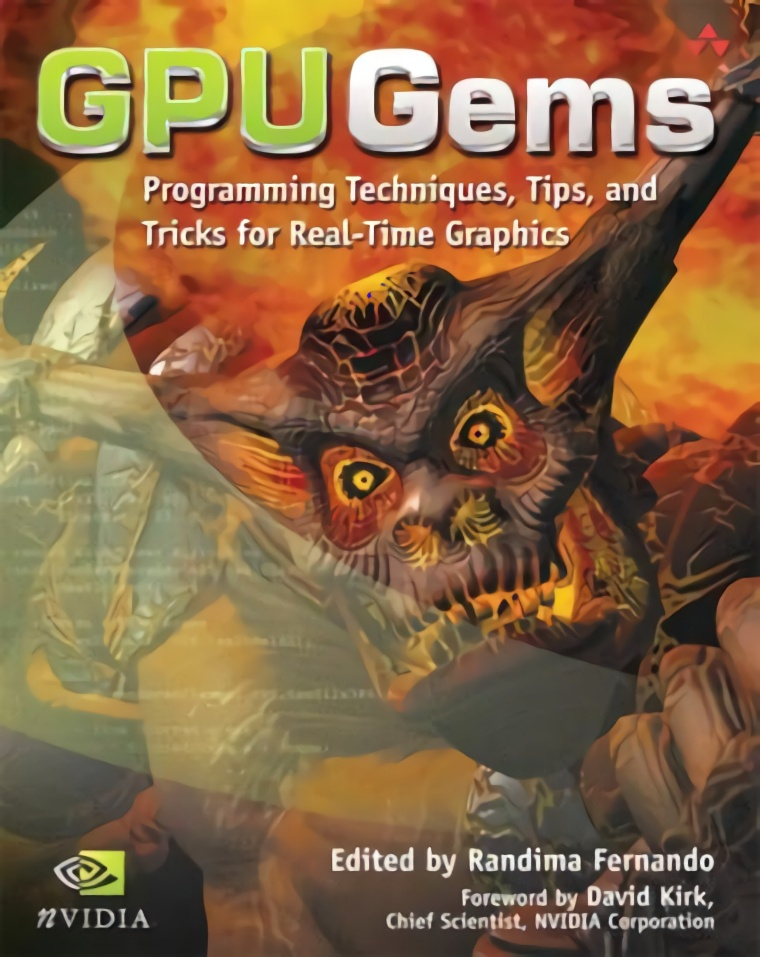

图 《GPU Gems 1》封面

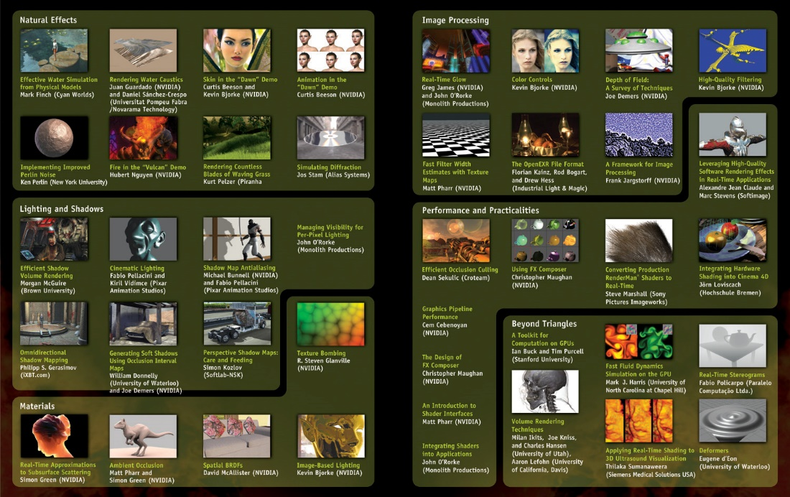

图 全书内容概览图

 

书本配套资源与源代码下载
========================

这里提供了一些，《GPU Gems 1》书本的配套资源，以及源代码的下载地点。

PS:配套的不少工程中不仅包含完整的源码，也直接包含经过编译后的exe执行文件，可以直接运行后查看效果。

-   原书全文的Web版本：

    <https://developer.nvidia.com/gpugems/GPUGems/gpugems_pref01.html>

-   原书配套源代码、工程与资源下载：

    <http://http.download.nvidia.com/developer/GPU_Gems/CD_Image/Index.html>

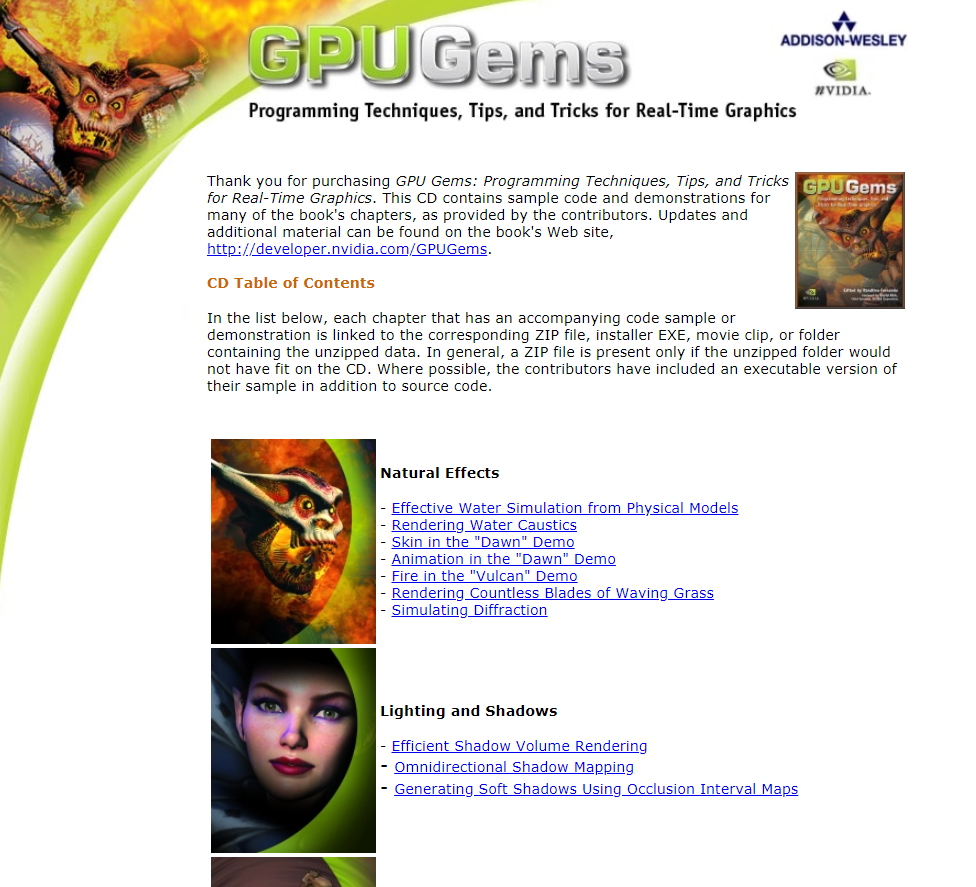

-   也维护了的一个名为“GPU-Gems-CD-Content”的GitHub仓库，以备份这些珍贵的资源：

    <https://github.com/QianMo/GPU-Gems-CD-Content>

 

系列文章风格说明
================

为了让每篇文章的干货更足，内容更加详实，本文与后续文章的的写作风格与文章结构，将在系列文章开篇中的规划的写作风格的基础上，做一些微调。

具体是将每篇需要提炼的章节内容分为两大部分：

-   主核心内容

-   次核心内容

其中，主核心内容，将选取大家最感兴趣、最有提炼价值的渲染相关的内容，会用更加详细的篇幅进行提炼总结。每章主核心内容将包含五个部分：

-   【章节概览】

-   【核心内容提炼】

-   【核心要点总结】

-   【本章配套源代码汇总表】

-   【关键词提炼】

而次核心内容，则会用更加精炼的篇幅进行总结。每部分将包含：

-   【章节概览】

-   【核心要点】

-   【本章配套源代码汇总表】

-   【关键词提炼】

 

# 上篇 · 主核心内容提炼总结

 

# 一、 用物理模型进行高效的水模拟（Effective Water Simulation from Physical Models）

## 【内容概览】

本章介绍了在GPU中模拟和渲染大型水体的一些方法，并且提出了改进反射的一些有用技巧。

文章由计算简单的正弦函数之和来对水面进行近似模拟开始，逐步扩展到更复杂的函数如Gerstner波，也扩展到像素着色器。主要思路是使用周期波的加和，来创建动态的平铺（tiling）凹凸贴图，从而获得优质的水面细节。

这章也集中解释了水体渲染与模拟系统中常用参数的物理意义，说明了用正弦波之和等方法来近似水面的要点。

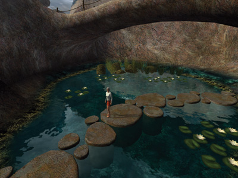

图 基于文中水体技术渲染的Uru:Ages Beyond Myst中的场景

## 【核心内容提炼】

### 1.1 背景与范围

《GPU Gems
1》出版于2004年，在这几年间，实时渲染技术渐渐从离线渲染领域中分离，自成一派。

而《GPU Gems 1》中收录的这篇文章问世期间时，快速傅里叶变换（Fast Fourier
Transform，FFT）库已经能用于顶点和像素着色器中。同时，运行于GPU上的水体模拟的模型也得到了改进。Isidoro等人在2002年提出了在一个顶点着色器中加和4个正弦波以计算水面的高度和方位的思路。另外，Laeuchi在2002年也发表了一个使用3个Gerstner波计算水面高度的着色器。

图 基于快速傅里叶变换的水体渲染

### 1.2 水体渲染的思路

文中对水体渲染的思路，运行了两个表面模拟：一个用于表面网格的几何波动，另一个是网格上法线图的扰动。这两个模拟本质上是相同的。而水面高度由简单的周期波叠加表示。

正弦函数叠加后得到了一个连续的函数，这个函数描述了水面上所有点的高度和方向。在处理顶点时，基于每个顶点的水平位置对函数取样，使得网格细分形成连续水面。在几何分辨率之下，将该技术继续应用于纹理空间。通过对近似正弦叠加的法线取样，用简单像素着色器渲染到渲染目标纹理（render
target
texture），从而产生表面的法线图。对每帧渲染法线图，允许有限数量的正弦波组相互独立地运动，这大大提高了渲染的逼真度。

而直接叠加正弦波产生的波浪有太多的“簸荡（roll）”，而真实的波峰比较尖，波谷比较宽。事实证明，正弦函数有一个简单的变体，可以很好地控制这个效果。

#### 1.2.1 波的选择

对于每个波的组成，有如下几个参数需要选择：

-   波长Wavelength (L)：世界空间中波峰到波峰之间的距离。波长L与角频率ω的关系为
    ω=2π/L。

-   振幅Amplitude (A)：从水平面到波峰的高度。

-   速度Speed (S)：每秒种波峰移动的距离。为了方便，把速度表示成相位常数 φ=S x
    2π/L。

-   方向Direction (D)：垂直于波峰沿波前进方向的水平矢量。

波的状态定义为水平位置（x，y）和时间（t）的函数：

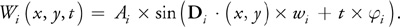

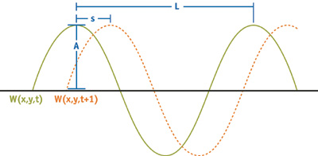

图 单个波函数的参数

而包括所有的波i的总表面是：

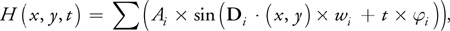

为了提供场景动力学的变量，我们将在约束中随机产生这些波的参数，随着时间的变化，我们会不断将某个波淡出，然后再以一组不同的参数将其淡入。且此过程的这些参数是相关联的，必须仔细地产生一套完整的参数组，才能使各个波以可信的方式进行组合。

#### 1.2.2 法线与切线

因为我们的表面有定义明确的函数，所以可以直接计算任意给定点处的曲面方向，而不是依赖于有限差分技术。

副法线（Binormal）B和正切矢量T分别是x和y方向上的偏导数。
对于2D水平面中的任意点（x，y），表面上的三维位置P为：

求副法线（Binormal）B方向，即对上式对x方向求偏导。而求正切矢量T方向，即对上式对y方向求偏导。

而法线N由副法线B和切线T的叉积给出：

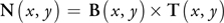

### 1.3 波的几何特征

首先文中将几何波限制为4个，因为添加更多的波并不能增加新的概念，只不过增加更多相同的顶点Shader处理指令和常数而已。

**1.3.1 方向波或圆形波的选择**

需要对下图所示的方向波或圆形波进行选择。

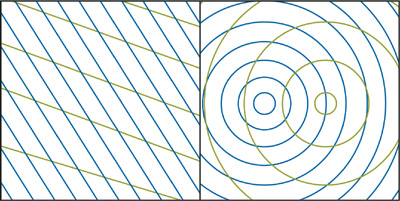

图 方向波和圆形波

对于两种类型的波，视觉特性和复杂性都是由干涉条纹引起的。

方向波需要的顶点shader处理指令较少，但是究竟选择何种波需要取决于模拟的场景。对于大的水体，方向波往往更好，因为它们是风吹动产生的波较好的模型。对于较小的池塘的水，产生波的原因不是由于风，而是诸如例如瀑布，水中的鱼，圆形波则更好一些。对于方向波，波的方向是在风向的一定范围内任意绘制的；对于圆形波，波中心是在某些限定的范围内任意绘制的。

####  1.3.2 Gerstner波

正弦波看起来圆滑，用于渲染平静的，田园诗般的池塘很合适。而对于粗犷的海洋，需要形成较尖的浪头和较宽的浪槽，则可以选择Gerstner波。

Gerstner波早在计算机图形学出现之前就已经被研发了出来，用于物理学基础上为海水建模。Gerstner波可以提供一些表面的微妙运动，虽然不是很明显但是却很可信（具体可以见[Tessendorf
2001]）。

另外，Gerstner波有一种经常被忽略的性质：它将顶点朝着每个浪头顶部移动，从而形成更尖锐的波峰。因为波峰是我们水表面上最锐利的（即最高频率，最主要）特征，所以我们正希望顶点可以集中在此处。

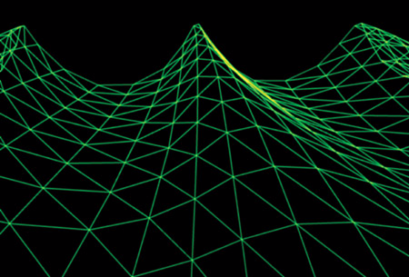

图 Gerstner波

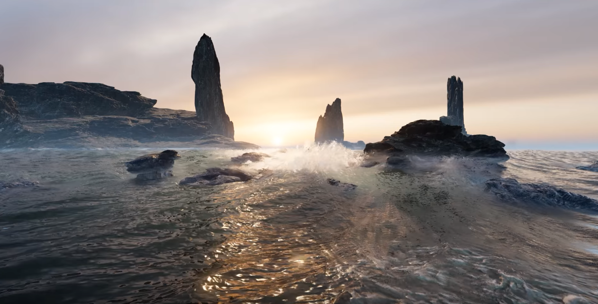

图 基于Gerstner渲染出的水面 @Unreal Engine 4

####  1.3.3 波长等参数的选择

波长等参数的选择方法：

-   波长的选择，要点是不要追求波在真实世界中的分布，而是要使用现在的少数几个波达到最大效果。对波长相似的波进行叠加可以突显水面的活力。于是文中选择中等的波长，然后从它的1/2至两倍之间产生任意波长。

-   波的速度，通过波长，基于公式即可计算得出。

-   振幅方面，主要是在Shader中指定一个系数，由美术同学对波长指定对应的合适振幅。

-   波的方向，运动方向与其他参数完全独立，因此可以自由选择。

### 1.4 波的纹理特征

加和到纹理中的波也像上文说到的顶点一样需要参数化，但是其具有不同的约束条件。首先，在纹理中得到宽频谱更为重要。其次，在纹理中更容易形成不像天然波纹的图案。第三，对给定波长只有某些波方向能保证全部纹理的平铺（tiling）。也就是说，不像在世界空间中仅仅需要注意距离，在纹素（texel）中要注意所有的量。

文中的思路是在2到4个通道中，使用15个频率和方位不同的波进行处理。虽然4个通道听起来有点多，但是它们是进行256
x
256分辨率的渲染目标纹理的处理，而不是处理主帧的帧缓冲。实际上，生成法线贴图的填充率所造成的影响小到可以忽略不计。

### 1.5 关于深度

首先，把在顶点上的水深度作为一个输入参数，这样，在着色器碰到岸边这样的微妙区域时，便可以自动进行校正。

因为水的高度需要计算，所以顶点位置的z分量就没什么用了。虽然我们可以利用这点来压缩顶点的数据量，但是选择把水深度编码在z分量中，是一个更好的选择。

更确切地说，就是把水体底部的高度放在顶点的z分量中，作为常数带入水的高度表中，这样通过相减，即可得到水深度。而同样，这里假定了一个恒定高度的水位表（constant-height
water table）。

我们也使用水深度来控制水的不透明度、反射强度和几何波振幅。简单来说，即水浅的地方颜色浅，水深的地方颜色深。有了适当的水深度，也就可以去光的传播效果进行更完善的建模。

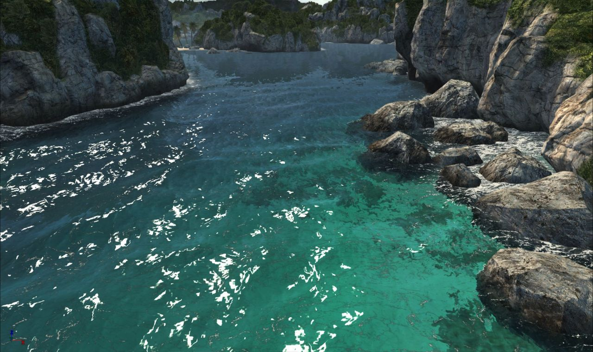

图 真实感水体渲染效果图 @Unreal Engine 4

## 【核心要点总结】

文中提出的水体渲染方法，总结起来有三个要点：

1）使用周期波（正弦波、Gerstner波）的加和

2）创建动态的平铺（tiling）贴图

3）使用凹凸环境映射（Bump-Environment Mapping）

【本章配套源代码汇总表】

文中并没有贴图相关代码，但原书配套CD提供了完整的源代码和项目工程，具体代码和工程可以查看：

[https://github.com/QianMo/GPU-Gems-Book-Source-Code/tree/master/GPU-Gems-1-CD-Content/Natural_Effects/Water_Simulation](https://github.com/QianMo/GPU-Gems-Book-Source-Code/tree/master/GPU-Gems-1-CD-Content/Natural_Effects/Water_Simulation)

## 【关键词提炼】

水的模拟（Water Simulation）

水的渲染（Water Rendering）

正弦函数近似加和（Sum of Sines Approximation）

Gerstner波（Gerstner Waves）

凹凸环境映射（Bump Environment Mapping）

 

# 二、Dawn Demo中的皮肤渲染（Skin in the Dawn Demo）

## 十年技术变迁： NVIDIA Dawn Demo

最初的Dawn Demo由NVIDIA于2002年发布，而十年之后的2012年，NVIDIA新发布了“A New
Dawn”技术Demo。

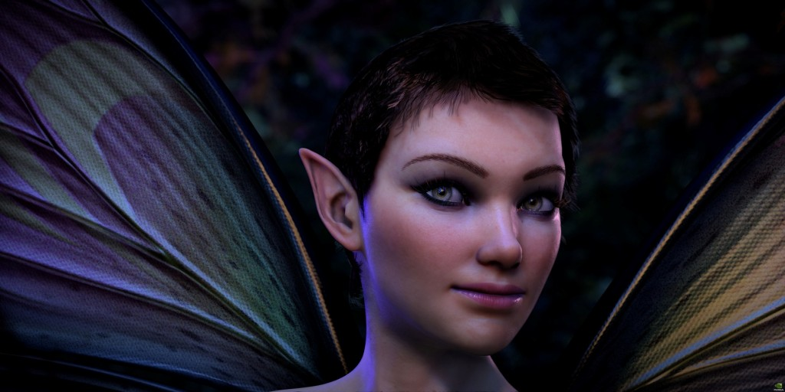

图 A New Dawn Demo截图

以下是一张新老Demo的对比效果图。

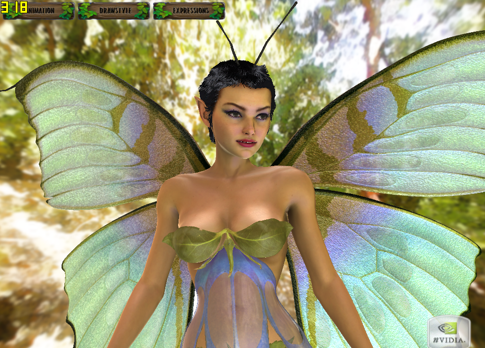

图 Dawn Demo (2002年)

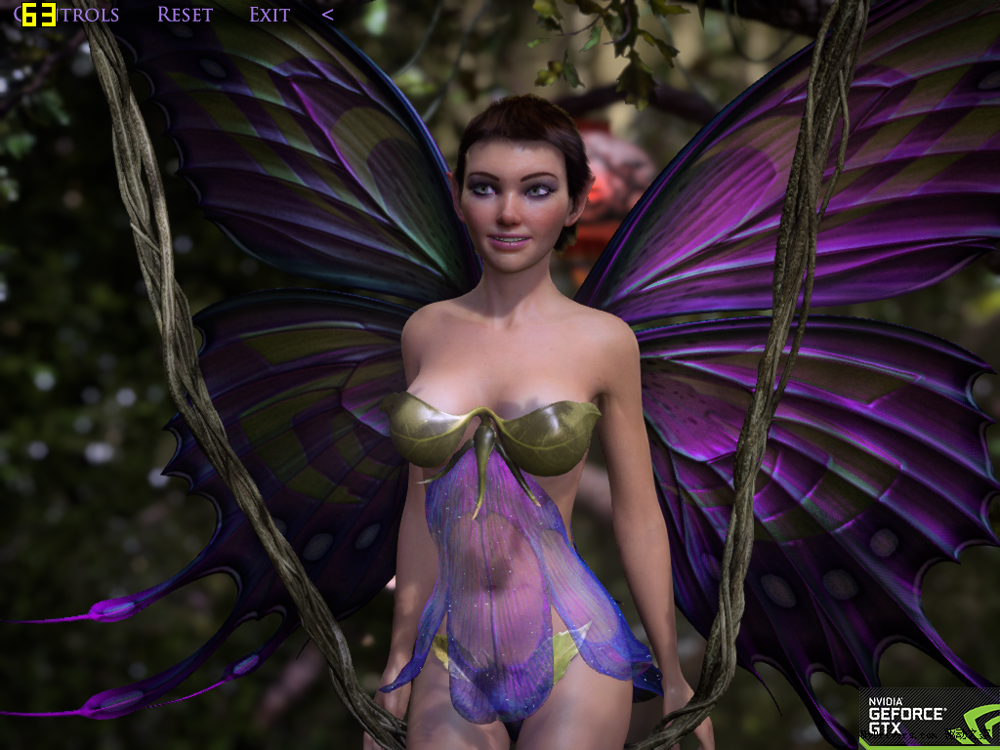

图 A New Dawn Demo （2012年）

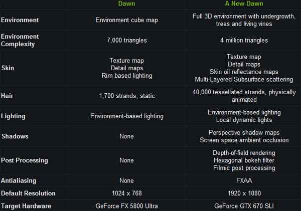

图 技术指标的对比

## 【章节概览】

这章详细介绍了NVIDIA出品的Dawn
Dmoe中对精灵人物的着色技术，主要是皮肤的着色技巧。在当时（2002年）NVIDIA创造的此demo的品质，已经成为照片级真实感渲染和实时渲染的代表。

图 Dawn Demo截图

## 【核心内容提炼】

### 2.1 关于皮肤着色

基于多种原因，在计算机图形中模拟皮肤十分困难。在当时，即使是在电影中用高端产品模拟出来的仿真角色，通常也经不起近距离的观察。因为，人类可以从中获得大量非语言来表达的信息，如重心的移动，走动的特别习惯，面部的表情，甚至有些人的皮肤泛红等等。

虽然很少有人能理解像“次表面散射（Subsurface Scattering）”、“轮廓照明（Rim
Lighting）”这些词汇，但是当把它们渲染错了的时候，几乎任何人都可以指出来。而且除了着色问题外，有时人们会因为皮肤渲染的问题，说皮肤看起来像是塑料做的。

### 2.2 皮肤如何对光进行响应

皮肤不像大多数在计算机渲染中建模的表面，因为它是由半透明的表皮、真皮和皮下组织等数层构成的。这可以用次表面散射来模拟。这种现象很普遍，当在太阳面前向上举起手，就能看到穿过皮肤的桔红色的光。

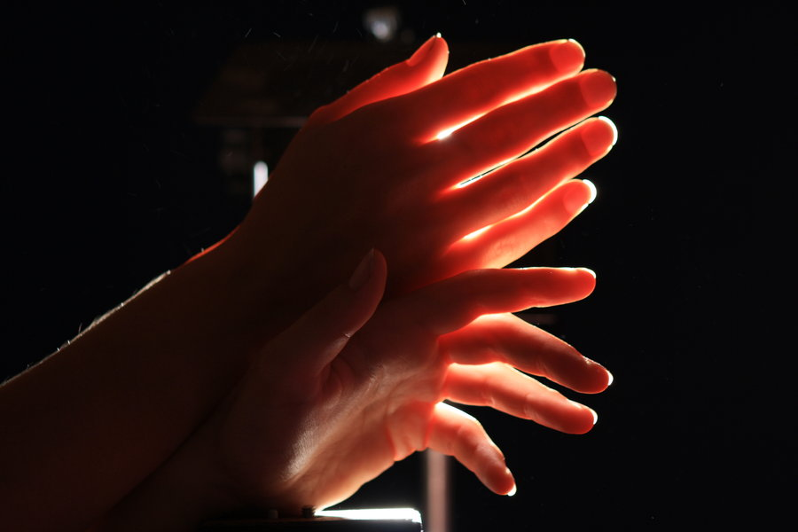

  
图 次表面散射-穿过皮肤的桔红色的光

皮肤下的散射在所有的角度上显现皮肤形态，使它具有了柔软的、与众不同的特征。

在这之前有一些小组尝试使用多层纹理贴图来模仿皮肤的复杂性，但一般而言，这个方法比较难管理，美术同学很难通过预想，混合出最终符合预期的效果。

相反，文中使用单张彩色贴图，通过着色程序来增加色彩的变化。

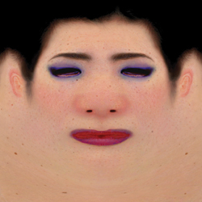

图 Dawn头部的前半边的漫反射贴图

另外，皮肤具有一些极细微的变化，会影响其反射特性。这对皮肤外观有微妙的影响，特别是当光线直接与相机位置相反时，皮肤的表现则是存在边缘（Edge）与轮廓光照（Rim
Lighting）,这时，需要皮肤轮廓边缘的光照，或给皮肤边缘加上光晕。

真正的皮肤具有一些细微的特征，比如汗毛和毛孔能捕捉光线。尽管这些细节用于显式地建模是太不明显了，但我们还是希望得到一个合适、整体更逼真的皮肤渲染外观。在特写时，可以增加凹凸贴图，提供一些额外的细节，特别是一些小的皱纹。但需要注意，我们想要的是柔软的皮肤外观，而不是光闪闪的油腻的塑料。另外，凹凸贴图通常只需静距离特写时才可见。

我们可以通过建模来近似这两个着色属性，建模可以是基于表面法线的简单公式，或者是基于光线或视线矢量的简单公式。

通过认识，我们可以将上述两种渲染特性（次表面散射和边缘光照），建模为基于表面法线和照明或观察向量的简单公式，从而近似出两种着色属性。尤其是沿着Dawn的轮廓边缘，对她身后的光线取样，按照观察向量的索引，让“穿过”Dawn的光与她的基础皮肤色调混合，从而创建次表面散射和边缘光照的着色效果。尤其是背景图中更加明亮的区域。如下图。

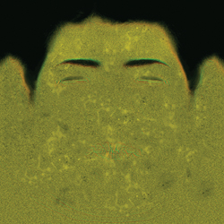

图 Dawn的头部前面的切线空间法线贴图（凹凸贴图）

### 2.3 场景的照明

Dawn Demo中场景的照明使用了基于图像的光照（Image Based Lighting ,
IBL），创建高动态范围(High-Dynamic
Range，HDR）)的全景，使用环境映射贴图（Environment Maps）进行场景的照明。

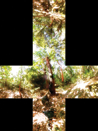

图 立方体环境反射贴图

漫反射环境贴图（Diffuse Environment
Map）也是一个立方体映射贴图，它使用网格表面的法线作为索引。每个像素存储了相应法线与入射光夹角的余弦加权平均值。

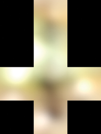

图 漫反射环境贴图（Diffuse Environment Map）

镜面高光环境贴图（specular environment
map）同样也是一个立方体映射贴图，使用反射矢量作为索引（类似于立方体映射）。把此镜面高光环境贴图基于粗糙因子进行模糊，目的是模拟对任何表面任何给定点上的法线的改变。

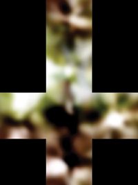

图 镜面高光环境贴图（Specular Environment Map）

存在的问题是，漫反射环境贴图（Diffuse Environment
Map）和镜面高光环境贴图（Specular Environment
Map）考虑了来自环境的入射光，但不包含由物体引起的阴影。

要解决这个问题，可以生成一个遮挡项，用来近似表达在每个顶点上半球辐射光中，有多大比率场景中其他物体所遮挡。

### 2.4 实现

Dawn
Demo中，毫无悬念地使用顶点着色器和像素着色器进行光照处理，顶点shader的主要功能是将坐标转换到投影空间，并执行那些不能在像素着色器中执行的数学运算。

采用单通道（one-pass）的光照解决方案，不需要另外其他的通道渲染，或alpha混合来创建皮肤表面。

文中提供了完整的顶点Shader和像素Shader的源代码，这里因为篇幅原因不再赘述，具体可以参考原文（PS:上文有贴出Web版的英文全书原文的链接）。

## 【核心要点总结】

文中采用的皮肤渲染方法，总结起来有三个要点：

1）基于图像的光照（Image Based Lighting
,IBL），采用高动态范围（High-Dynamic-Range , HDR）光照环境映射贴图

2）次表面散射（Subsurface Scattering）

3）对皮肤边缘加上光晕，即轮廓照明/边缘光照（Rim Lighting）

## 【本章配套源代码汇总表】

Example 3-1. 从CPU应用程序接收的每个顶点数据示例代码（The Per-Vertex Data
Received from the CPU Application）

Example 3-2. 输出顶点的数据结构示例代码（The Data Structure of the Output
Vertices）

Example 3-3. Dawn脸部的皮肤渲染顶点着色器示例代码（A Sample Vertex Shader for
Dawn's Face）

Example 3-4. Dawn脸部的皮肤渲染片元着色器代码（The Fragment Shader for Dawn's
Face）

## 【关键词提炼】

皮肤渲染（Skin Rendering）

次表面散射（Subsurface Scattering）

轮廓照明（Rim Lighting）

基于图像的光照（Image Based Lighting ,IBL）

高动态范围（High-Dynamic-Range, HDR）

环境映射贴图（Environment Maps）

 

# 三、无尽波动的草地叶片的渲染（Rendering Countless Blades of Waving Grass）

 

## 【章节概览】

这章关于巨量自然元素的渲染，特别是对于无尽波动的草地叶片的渲染。作者对Codecreatures
demo中首次成形的技术进行了扩展，使其能够高性能的渲染，以更好地适应游戏引擎的需要。

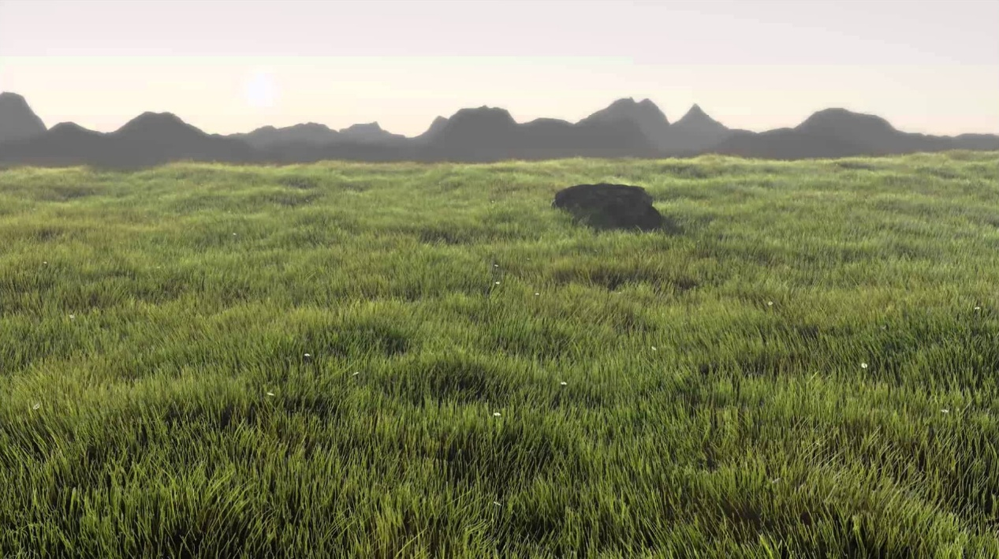

图 Realistic Grass Field @Giovanni Baer

## 【核心内容提炼】

### 3.1 概述

首先，需要意识到，对单个草叶的细节建模意义不大，因为那样大片草地需要的多边形数目会太多。

所以，我们必须建立一个符合以下条件的简单而有用的替代方案：

-   许多草的叶片必须由少数多边形表示。

-   草地必须从不同的视线看起来显得密集。

而要做到让场景不依赖于摄像机的位置和方向，可以把一些草叶组合起来，表示在一个纹理中，并将多个纹理组合起来，且在结果中单个的多边形不应该引起注意。当观察者四处活动时，通过将草体加入混合操作或者移除混合操作，以在距离范围内增加或删去草体，来保证整个草地的渲染效果具有稳定的视觉质量。

### 3.2 草的纹理

草的纹理，应该是一些一簇一簇聚集丛生的草，否则，会出现大片的透明区域。

需在透明的alpha通道上画实体草茎。在彩色通道中，用深浅不同的绿色和黄色，来较好地区别各个单独的叶片，也应该模拟不同情况的草叶：长得好的和长得差的、老的和嫩的，甚至区别叶片的前面与后面。

下图是一个草地纹理的示例。

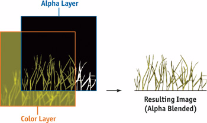

图 草地纹理的示意图

### 3.3 草体

这一部分将探讨总结如何对多边形进行组合，并用上文提到的草地纹理进行映射，以模拟出茂密的草地，并且不凸显个别多边形。此技术也保证了单个多边形不可见。

因为用户能自由地在场景中游玩，下图所示的结构便不能产生令人信服的效果。

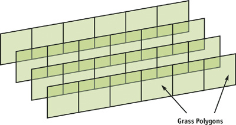

图 线性排布

对于线性排布，如果从垂直于多边形的方向观看场景，就会立刻穿帮，看出草地多边形的结构是线性排布的。另外这种情况下草地会看起来非常稀疏。只有在摄像机自动导航，或者渲染无法到达的远距离草地时，才会考虑这样的排布。

为了保证独立于当前视线的良好视觉质量，我们必须交叉地排布草地多边形。已证明，使用星型结构是非常好的。下图给出了“草体”可能的两种变体。

他们由3个相交的方块构成。我们必须禁用背面剔除来渲染多边形，以保证双面都可见。为了得到合适的照明度，应该让所有顶点的法线方向与多边形的垂直边平行。这保证了位于斜坡上的所有草体都可以得到正确的光照，不会因为地形的亮度而出现差异。

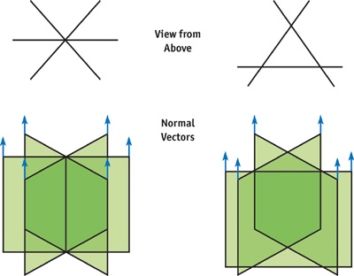

图 草体的交叉排布

如果把这些草地物体彼此相当靠近地设置在一个大的区域里，如下图。在运行期间把它们从后向前进行排序，使用alpha混合，并启用Draw
Call中的z-testing/writing，那么就会得到自然而茂密的草地渲染效果。

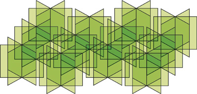

图 草地的扩展

### 3.4 草地动画

关于草地的动画，基本思想是以三角函数（尤其是正弦和余弦）为基础进行计算，且计算应该考虑到移动的位置和当前时间、风向和强度。

以基本思想为基础，实现起来有几种方法：

1、每草丛草体的动画（Animation per Cluster of Grass Objects）

2、每顶点的动画（Animation per Vertex）

3、每草体的动画（Animation per Grass Object）

三种方法各有优缺点，而文中都给出了具体算法步骤和实现的Shader源码，这里因为篇幅原因，便不展开分析了。

最终可以实现的渲染效果。

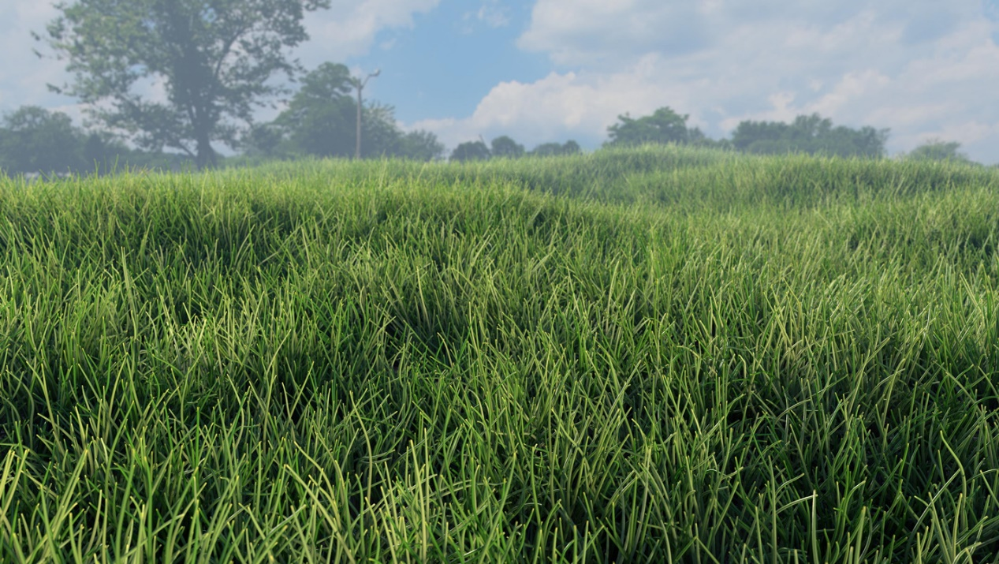

图 Realistic Grass

## 【核心要点总结】

1）草的纹理，应选取一簇一簇聚集丛生的草。在透明的alpha通道上画实体草茎。在彩色通道中，用深浅不同的绿色和黄色，区别各个单独的叶片。

2）草体的渲染，适合进行交叉排布，从后向前进行排序，使用alpha混合，并启用Draw
Call中的z-testing/writing，便能得到自然而茂密的草地渲染效果。

3）草地的动画，以三角函数（尤其是正弦和余弦）为基础，且应该考虑到移动的位置和当前时间、风向和强度。实现起来有三种方法：

>   1、每草丛草体的动画（Animation per Cluster of Grass Objects）

>   2、每顶点的动画（Animation per Vertex）

>   3、每草体的动画（Animation per Grass Object）

## 【本章配套源代码汇总表】

Example 7-1. 顶点着色器框架（Framework in the Vertex Shader）

Example 7-2. 对每草丛草体的动画的实现Shader代码（Code for Animation per Cluster
of Grass Objects）

Example 7-3. 每顶点动画实现Shader代码（Code for Animation per Vertex）

Example 7-4. 每草体的动画实现Shader代码（Code for Animation per Grass Object）

## 【关键词提炼】

草地渲染（Grass Rendering）

草地动画（Grass Animation）

草体（Grass Objects）

 

# 四、次表面散射的实时近似（Real-Time Approximations to Subsurface Scattering）

## 【章节概览】

次表面散射（Subsurface Scattering），简称SSS，或3S，是光射入非金属材质后在内部发生散射，最后射出物体并进入视野中产生的现象，即光从表面进入物体经过内部散射，然后又通过物体表面的其他顶点出射的光线传递过程。

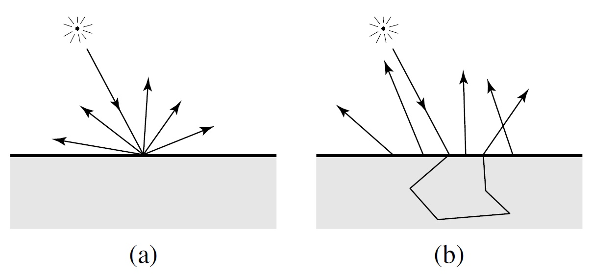

图 次表面散射原理图示

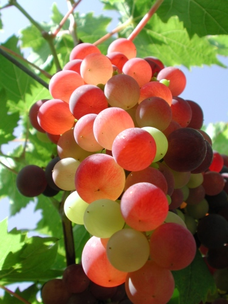

图 真实环境中的次表面散射

要产生使人信服的皮肤和其他半透明材质的渲染效果，次表面散射（Subsurface Scattering）的渲染效果十分重要。

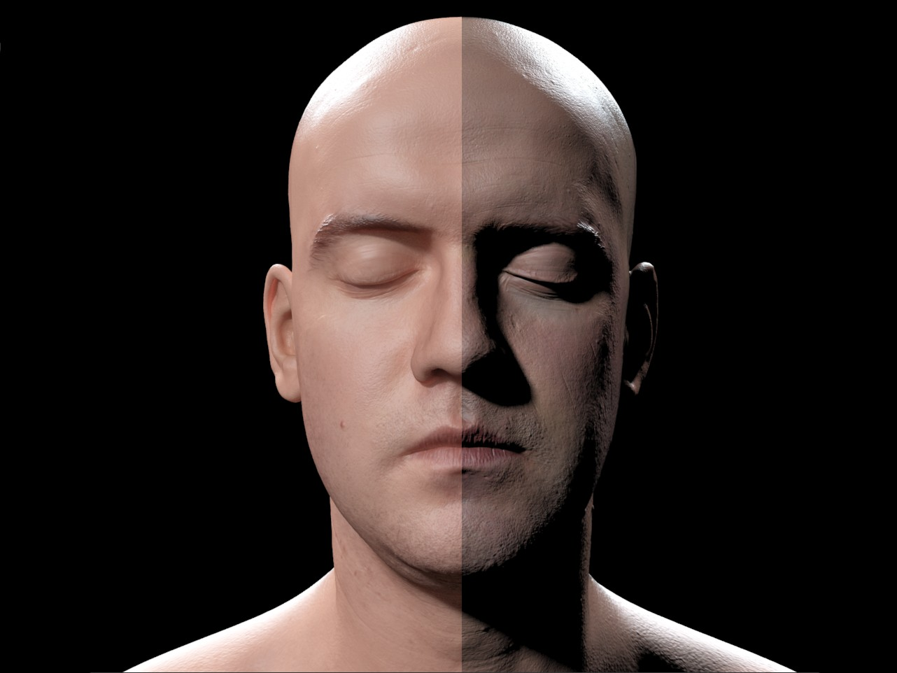

图 有无次表面散射的渲染对比图（左图：使用次表面散射 \| 右图：无次表面散射）

另外需要提出，在《神秘海域4》中皮肤的渲染效果，很令人惊艳。当然，《神秘海域4》中令人惊艳的，远远不止皮肤的渲染。

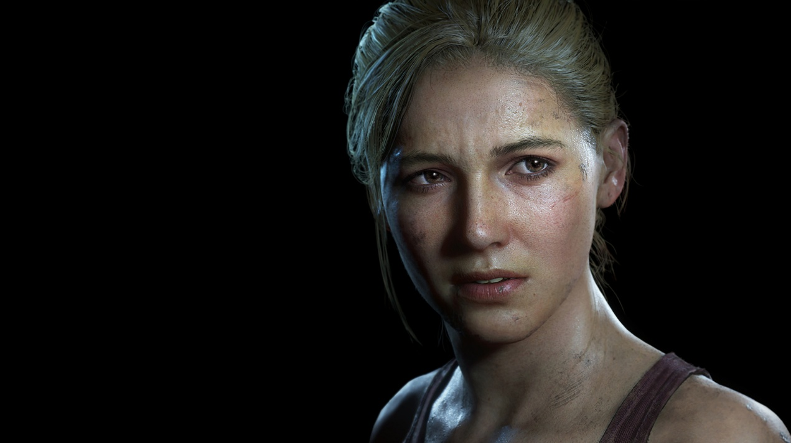

图 基于次表面散射的皮肤渲染 @《神秘海域4》

本章即描述了次表面散射的几种实时近似方法，关于皮肤的渲染，也关于近似地去模拟透明材质的几种不同方法。

## 【核心内容提炼】

### 4.1 次表面散射的视觉特性（The Visual Effects of Subsurface Scattering）

要重现出任何视觉效果，经常的做法是考察这种效果的图像，并把可视的外观分解为其组成要素。在观察半透明物体的相片和图像时，能注意到如下几点，即次表面散射（Subsurface
Scattering）的视觉特性：

1、首先，次表面散射往往使照明的整体效果变得柔和。

2、一个区域的光线往往渗透到表面的周围区域，而小的表面细节变得看不清了。

3、光线传入物体越深，就衰减和散射得越严重。

4、对于皮肤来说，在照亮区到阴影区的衔接处，散射往往会引起微弱的倾向于红色的颜色偏移。这是由于光线照亮表皮并进入皮肤，接着被皮下血管和组织散射和吸收，然后从阴影部分离开。且散射在皮肤薄的部位更加明显，比如鼻孔和耳朵周围。

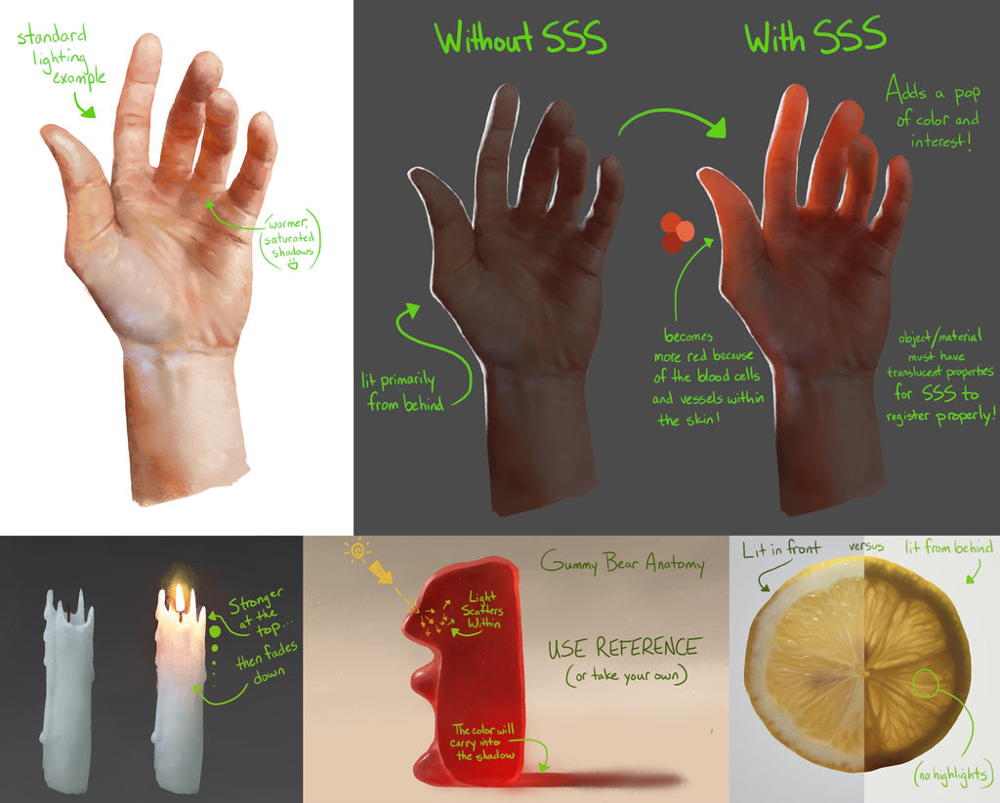

图 次表面散射原理图示

### 4.2 简单的散射近似（Simple Scattering Approximations）

近似散射的比较简单技巧是环绕照明（Wrap
Lighting）。正常情况下，当表面的法线对于光源方向垂直的时候，Lambert漫反射提供的照明度是0。而环绕光照修改漫反射函数，使得光照环绕在物体的周围，越过那些正常时会变黑变暗的点。这减少了漫反射光照明的对比度，从而减少了环境光和所要求的填充光的量。环绕光照是对Oren-Nayar光照模型的一个粗糙的近似。原模型力图更精确地模拟粗糙的不光滑表面（Nayar
and Oren 1995）。

下图和代码片段显示了如何将漫反射光照函数进行改造，使其包含环绕效果。

其中，wrap变量为环绕值，是一个范围为0到1之间的浮点数，用于控制光照环绕物体周围距离。

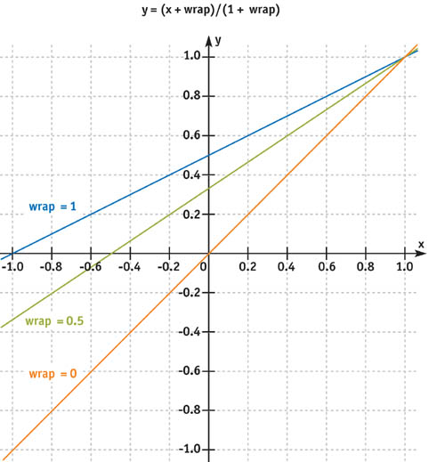

图 环绕光照函数的图表

    float diffuse = max(0, dot(L, N));

    float wrap_diffuse = max(0, (dot(L, N) + wrap) / (1 + wrap));

为了在片元函数程序中的计算可以更加高效，上述函数可以直接编码到纹理中，用光线矢量和法线的点积为索引。

而在照明度接近0时，可以显示出那种倾向于红的微小颜色漂移，这是模拟皮肤散射的一种廉价方法。而这种偏向于红色的微小颜色漂移，也可以直接加入到此纹理中。

另外也可以在此纹理的alpha通道中加入镜面反射高光光照的功率（power）函数。可以在示例代码Example
16-1中的FX代码展示了如何使用这种技术。对比的图示如下。

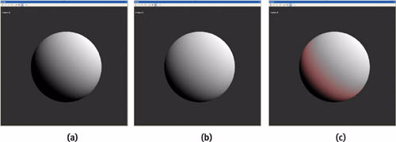

图 （a）没有环绕光照的球体 （b）有环绕光照明的球体 （c）有环绕光照明和颜色漂移的球体

Example 16-1 摘录纳入了环绕照明的皮肤Shader效果的代码（Excerpt from the Skin
Shader Effect Incorporating Wrap Lighting）

	// 为皮肤着色生成2D查找表（Generate 2D lookup table for skin shading）
    
    float4 GenerateSkinLUT(float2 P : POSITION) : COLOR

    {

	    float wrap = 0.2;
	
	    float scatterWidth = 0.3;
	
	    float4 scatterColor = float4(0.15, 0.0, 0.0, 1.0);
	
	    float shininess = 40.0;
	
	    float NdotL = P.x * 2 - 1; // remap from [0, 1] to [-1, 1]
	
	    float NdotH = P.y * 2 - 1;
	
	    float NdotL_wrap = (NdotL + wrap) / (1 + wrap); // wrap lighting
	
	    float diffuse = max(NdotL_wrap, 0.0);
	
	    // 在从明到暗的转换中添加颜色色调（add color tint at transition from light to
		dark）
	
	    float scatter = smoothstep(0.0, scatterWidth, NdotL_wrap) *
	
	    smoothstep(scatterWidth * 2.0, scatterWidth,
	
	         NdotL_wrap);
	
	    float specular = pow(NdotH, shininess);
	
	    if (NdotL_wrap <= 0) specular = 0;
	
	    float4 C;
	
	    C.rgb = diffuse + scatter * scatterColor;
	
	    C.a = specular;
	
	    return C;
	
	}

	// 使用查找表着色皮肤（Shade skin using lookup table）
	
	half3 ShadeSkin(sampler2D skinLUT,
		
		half3 N,
		
		half3 L,
		
		half3 H,
		
		half3 diffuseColor,
		
		half3 specularColor) : COLOR
	
	{
		
		half2 s;
		
		s.x = dot(N, L);
		
		s.y = dot(N, H);
		
		half4 light = tex2D(skinLUT, s * 0.5 + 0.5);
		
		return diffuseColor * light.rgb + specularColor * light.a;
	
	}

### 4.3 使用深度贴图模拟吸收（Simulating Absorption Using Depth Maps）

吸收（Absorption）是模拟半透明材质的最重要特性之一。光线在物质中传播得越远，它被散射和吸收得就越厉害。为了模拟这种效果，我们需要测量光在物质中传播的距离。而估算这个距离可以使用深度贴图（Depth
Maps）技术[Hery 2002]，此技术非常类似于阴影贴图(Shadow
Mapping)，而且可用于实时渲染。

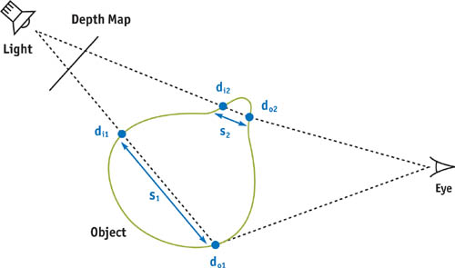

图 使用深度贴图计算光在物体中的传播的距离

深度贴图（Depth Maps）技术的思路是：

在第一个通道（first
pass）中，我们从光源的视点处渲染场景，存储从光源到某个纹理的距离。然后使用标准的投射纹理贴图（standard
projective texture mapping），将该图像投射回场景。在渲染通道（rendering
pass）中，给定一个需要着色的点，我们可以查询这个纹理，来获得从光线进入表面的点（d_i）到光源间距离，通过从光线到光线离开表面的距离（d_o）里减去这个值，我们便可以获得光线转过物体内部距离长度的一个估计值（S）。如上图。

原文中详细分析了此方法的实现过程，也附带了完整的Shader源码，具体细节可以查看原文，这里因为篇幅原因就不展开了。

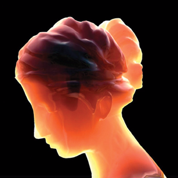

图 使用深度贴图去近似散射，物体上薄的部位传输更多的光

也有一些更高端的模型试图更精确地模拟介质内散射的累积效应。

一种模型是单次散射近似（Single Scattering
Approximation），其假设光在材质中只反弹一次，沿着材质内的折射光线，可以计算有多少光子会朝向摄像机散射。当光击中一个粒子的时候，光散射方向的分布用相位函数来描述。而考虑入射点和出射点的菲涅尔效应也很重要。

另一种模型，是近似漫反射（Diffusion
Approximation），其用来模拟高散射介质（如皮肤）的多次散射效果。

### 4.4 纹理空间的漫反射（Texture-Space Diffusion）

次表面散射最明显的视觉特征之一是模糊的光照效果。其实，3D美术时常在屏幕空间中效仿这个现象，通过在Photoshop中执行Gaussian模糊，然后把模糊图像少量地覆盖在原始图像上，这种“辉光”技术使光照变得柔和。

而在纹理空间中模拟漫反射[Borshukov and Lewis
2003]，即纹理空间漫反射（Texture-Space
Diffusion）是可能的，我们可以用顶点程序展开物体的网格，程序使用纹理坐标UV作为顶点的屏幕位置。程序简单地把[0，1]范围的纹理坐标重映射为[-1，1]的规范化的坐标。

另外，为了模拟吸收和散射与波长的相关的事实，可以对每个彩色通道分为地改变滤波权重。

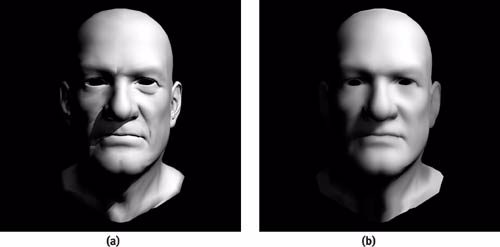

图 （a）原始模型 （b）应用了纹理空间漫反射照明的模型，光照变得柔和

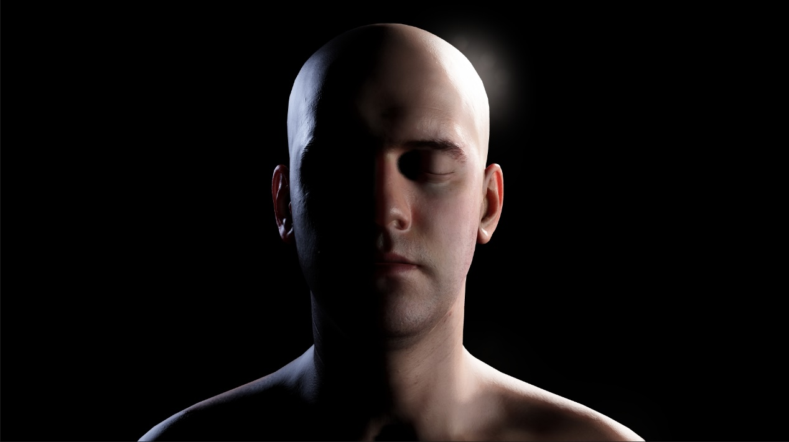

图 基于纹理空间漫反射照明的效果

同样，原文中详细分析了此方法的实现过程，也附带了完整的Shader源码，具体细节可以查看原文，这里因为篇幅原因就不展开了。

再附几张基于次表面散射的皮肤渲染效果图，结束这一节。

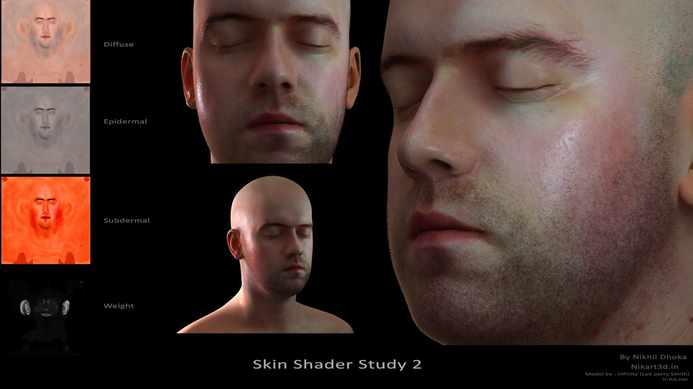

图 基于次表面散射的皮肤渲染

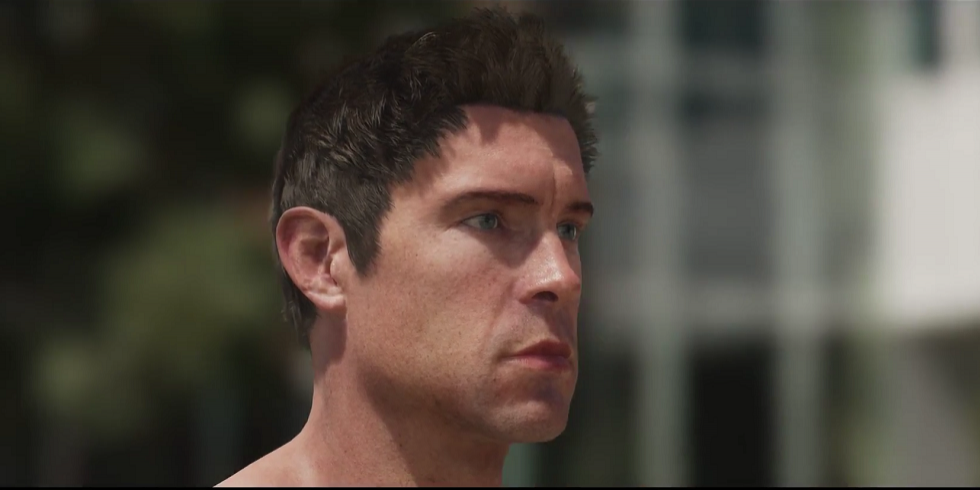

图 基于次表面散射的皮肤渲染 @Unreal Engine 4

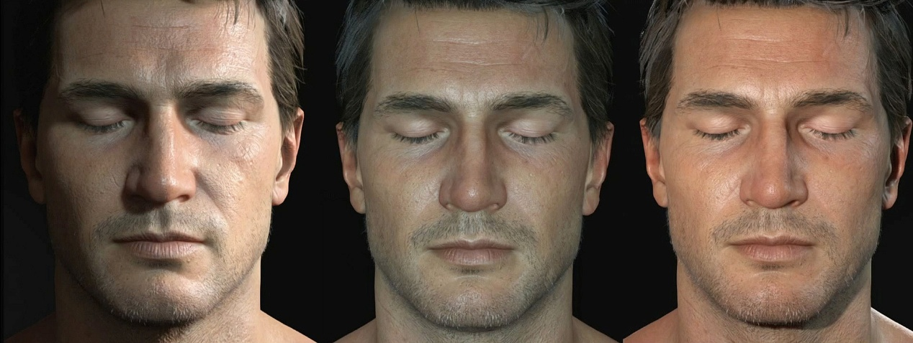

图 基于次表面散射的皮肤渲染 @《神秘海域4》

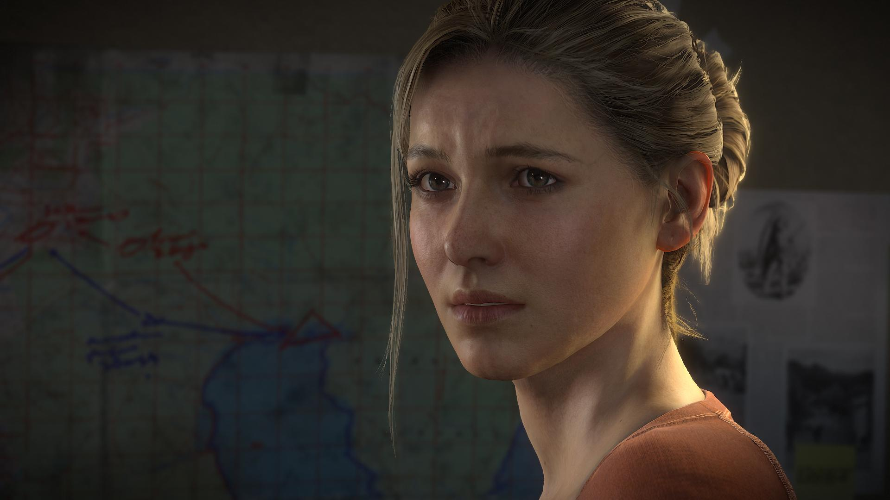

图 基于次表面散射的皮肤渲染 @《神秘海域4》

## 【核心要点总结】

文中提出的次表面散射的实时近似方法，总结起来有三个要点：

1） 基于环绕照明（Wrap Lighting）的简单散射近似，Oren-Nayar光照模型。

2） 使用深度贴图来模拟半透明材质的最重要特性之一——吸收（Absorption）。

3）基于纹理空间中的漫反射模拟（Texture-Space
Diffusion），来模拟次表面散射最明显的视觉特征之一——模糊的光照效果。

## 【本章配套源代码汇总表】

Example 16-1 摘录纳入了环绕照明的皮肤Shader效果的代码（Excerpt from the Skin
Shader Effect Incorporating Wrap Lighting）

Example 16-2 深度Pass的顶点Shader代码（The Vertex Program for the Depth Pass）

Example 16-3　深度Pass的片元Shader代码（The Fragment Program for the Depth
Pass）

Example 16-4　使用深度贴图来计算穿透深度的片元Shader代码（The Fragment Program
Function for Calculating Penetration Depth Using Depth Map）

Example 16-5　用于展开模型和执行漫反射光照的顶点Shader代码（A Vertex Program to
Unwrap a Model and Perform Diffuse Lighting）

Example 16-6 用于漫反射模糊的顶点Shader代码（The Vertex Program for Diffusion
Blur）

Example 16-7 用于漫反射模糊的片元Shader代码（The Fragment Program for Diffusion
Blur）

## 【关键词提炼】

皮肤渲染（Skin Rendering）

次表面散射（Subsurface Scattering）

纹理空间漫反射（Texture-Space Diffusion）

环绕照明（Wrap Lighting）

深度映射（Depth Maps）

# 五、环境光遮蔽（Ambient Occlusion）

## 【章节概览】

在某种意义上，这篇文章属于环境光遮蔽的启蒙式文章。

环境光遮蔽（Ambient
Occlusion），简称AO，是一种用于计算场景中每个点对环境光照的曝光程度的一种着色渲染技术。

本章讲到了如何使用有效的实时环境光遮蔽技术，对物体遮蔽信息及环境进行预处理，综合这些因素给物体创建逼真的光照和阴影。

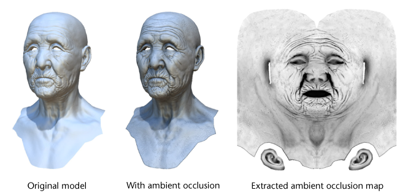

图 有无环境光遮蔽的对比

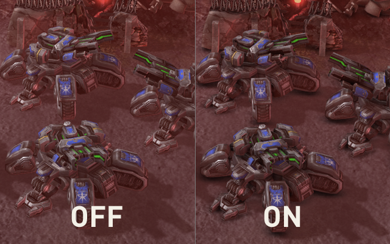

图 有无环境光遮蔽的对比

## 【核心内容提炼】

5.1 概述

首先，本文中讲到，环境光遮蔽（Ambient Occlusion）一般而言有两种理解：

1）将环境光遮蔽视为“智能”的环境光项，其在模型表面的变化取决于在每点可见多少外部环境。

2）将环境光遮蔽视为一个漫反射项，其能有效地支持复杂分布的入射光线。

文中将考虑上述的第二种解释。

其基本思路是，假如预处理一个模型，计算它上面每个点可以看到多少外部环境，可以相反地计算有多少环境被模型的其他部分遮挡，然后在渲染时使用这个信息计算漫反射着色项的值。其结果是模型上的裂缝变暗，而模型的暴露部分会接收更多的光线，因此更明亮。这种效果实质上比使用标准的着色模型更逼真。

另外，这个方法可以扩展为使用环境光作为照明源，用代表各个方向入射光的环境贴图没来决定物体上每个点光的颜色。为了这个特性，除了记录在点上可以看到多少外部环境之外，也记录大部分可以光从哪个方向到达。这两个量有效地定义了从外面进入场景的未被遮挡的方向圆锥体，可以一起用来做为来自环境贴图的极端模糊的查询，模拟着色点上来自感兴趣的方向圆锥体的全部入射照度。

5.2 预处理步骤（The Preprocessing Step）

给定一个任意的着色模型，环境光遮蔽算法需要知道模型上每点的两个信息：

（1）该点的“可到达度（accessibility）”-
即该点上方半球的哪一部分未被模型的其他部分遮挡;

（2）未被遮挡的入射光的平均方向。

通过下图在平面上说明这两个概念。给定在表面上的点P，其法线为N，
P点上半球的2/3被场景中其他几何体遮挡，半球另外的1/3不被遮挡。入射光的平均方向用B表示，其在法线N的右侧。大致来说，在P点的入射光的平均颜色，可以通过求围绕B矢量的未遮挡入射光的圆锥体的平均值得到。

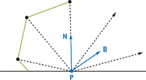

图 可到达度和平均方向的计算

下面贴出的伪代码显示了我们的基本方法。在每个三角形的中心，我们产生一组以表面法线为中心的半球形光线，跟踪每道光线进入场景，记录哪些光线与模型相交，标志不能从环境接收的光线，以及不被遮挡的光线。接着我们计算不被遮挡的光线的平均方向，这给出了入射光平均方向的近似值。（当然，我们计算的方向实际上可能会被遮挡，但我们选择忽略不计这个问题。）

Example 17-1 计算环境光遮蔽量的基本算法伪代码 （Basic Algorithm for Computing
Ambient Occlusion Quantities）

	For each triangle {
	
		Compute center of triangle
		
		Generate set of rays over the hemisphere there
		
		Vector avgUnoccluded = Vector(0, 0, 0);
		
		int numUnoccluded = 0;
		
		For each ray {
		
			If (ray doesn't intersect anything) {
			
				avgUnoccluded += ray.direction;
				
				++numUnoccluded;
			
			}
	
		}
	
		avgUnoccluded = normalize(avgUnoccluded);
		
		accessibility = numUnoccluded / numRays;
	
	}

生成这些光线的简单方法是使用拒绝采样法（rejection
sampling）：检测在x，y和z为-1到1区间的3D立方体中随机生成的光线，并拒绝不在单位半球中与法线相关的光线。

能通过这次检测的光线方向可视分布理想的光线方向。列表17-2的伪代码表示出了此方法的实现思路。

当然，也可以用更复杂的蒙特卡洛（Monte Carlo）采样法来得到更好的样本方向的分布。

Example 17-2 使用拒绝采样法计算随机方向的算法伪代码（Algorithm for Computing
Random Directions with Rejection Sampling）

	while (true) {
	
		x = RandomFloat(-1, 1); // random float between -1 and 1
		
		y = RandomFloat(-1, 1);
		
		z = RandomFloat(-1, 1);
		
		if (x * x + y * y + z * z > 1) continue; // ignore ones outside unit
		
		// sphere
		
		if (dot(Vector(x, y, z), N) < 0) continue; // ignore "down" dirs
		
		return normalize(Vector(x, y, z)); // success!
	
	}

另外，用图形硬件代替光线追踪软件，有可能加速遮挡信息的计算。

### 5.3 使用环境光遮蔽贴图进行渲染（Rendering with Ambient Occlusion Maps）

使用环境光遮蔽贴图进行着色的基本思想是：
可以直接在着色点处使用之前已计算好的，有多少光线能到达表面的，优质的近似值信息。

影响这个数值的两个因素是：

（1）在此点上方半球的哪个部分不被点和环境贴图之间的几何体遮挡。

（2）沿着这些方向的入射光是什么。

下图显示了两种不同的情况。在左图中，只能看到着色点上面的一小部分分享，由方向矢量B和围绕它的方向圆锥体所表示，该点的可到达度非常低。而在右图中，沿着更大范围的方向有更多的光线到达给定点。

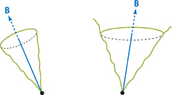

图 不同量的可见度的近似（左图：由于附近的几何体的遮挡比较严重，这点得到的照度较小；右图：沿着更宽方向的圆锥体，更大量的光能到达这点，照度较左图更大）

在预处理中计算的可访问性值告诉我们哪一部分半球可以看到环境贴图，而可见方向的平均值给出一个近似方向，围绕它计算入射光。虽然这个方向可能指向一个实际被遮挡的方向（例如，如果半球的两个独立区域未被遮挡，但其余的部分被遮挡，平均方向可能在这两者之间），但在实践中其通常运行良好。

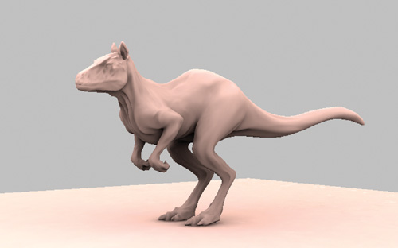

图 使用可到达度信息和环境贴图渲染的光照场景

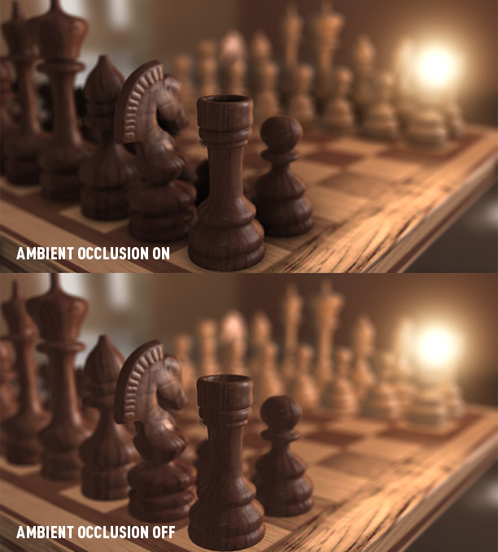

图 基于此项技术渲染出的对比图

另外需要注意，实时环境光遮蔽的常用廉价方案是预先计算网格表面几个位置的平均可见性值，存储于贴图中，然后将这些值在运行时与图形硬件提供的未遮挡光照相乘。

## 【核心要点总结】

给定一个任意的着色模型，环境光遮蔽算法需要知道模型上每点的两个信息：

1）该点的可到达度（accessibility）。

2）未被遮挡的入射光的平均方向。

文中提出的环境光遮蔽方法，总结起来有三个要点：

-   采用了多种在实践中运行良好的近似方法。

-   主要为预处理操作，将相对昂贵的计算事先准备好，且仅计算在渲染时进行快速着色所需的正确信息。

-   预处理不依赖于光照环境贴图，因此可以轻松使用场景中的动态照明。

## 【本章配套源代码汇总表】

Example 17-1 计算环境光遮蔽量的基本算法伪代码（Basic Algorithm for Computing
Ambient Occlusion Quantities）

Example 17-2 使用拒绝采样法计算随机方向的算法伪代码（Algorithm for Computing
Random Directions with Rejection Sampling）

Example 17-3 使用可到达度和环境映射进行着色的片元Shader（Fragment Shader for
Shading with Accessibility Values and an Environment Map）

Example 17-4 latlong( )函数的定义（The latlong() Function Definition）

Example 17-5 computeBlur( )函数的定义（The computeBlur() Function Definition）

## 【关键词提炼】

环境光遮蔽（Ambient Occlusion）

拒绝采样（Rejection Sampling）

环境光遮蔽贴图（Ambient Occlusion Maps）

# 六、实时辉光（Real-Time Glow）

## 【章节概览】

这章讲到2D光照效果中的辉光（Glow）和光晕（Halo），展示了如何通过图像处理方法完全地改善画面及3D人物的渲染感官。

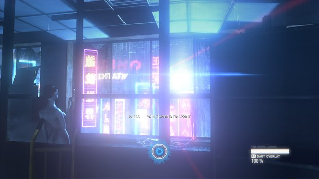

图 游戏中的Glow结合Bloom，得到出色的画面效果

图 Unreal Engine的logo，即是采用了Glow效果

## 【核心内容提炼】

光源的辉光（Glow）和光晕（Halo）是自然界导出可见的现象，他们提供了亮度和气氛强烈的视觉信息。

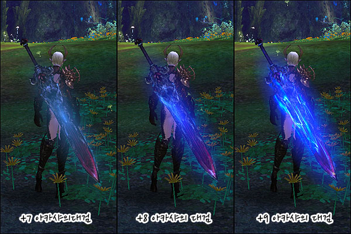

图 给强化后的武器加上Glow效果，该武器显得更加强力 @TERA

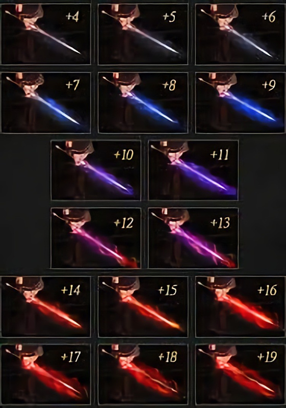

图 强化武器的Glow效果的演变 @Lineage II

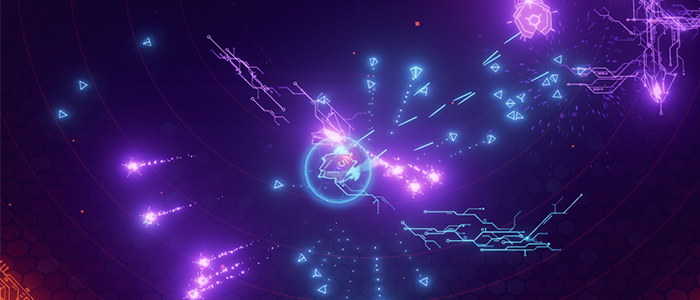

图 Glow效果 @Unreal Engine 4

在观看计算机图形、胶片和印刷品时，到达眼睛的光强度是有限的，因此，辨别光源强度的唯一方法是通过它们周围产生的辉光（Glow）和光晕（Halo），具体可以参考[Nakamae
et al.
1990]。这些辉光可以再现强烈光线的视觉效果，并使观察者感知非常明亮的光源。即使物体周围的微妙光晕也会让人觉得它比没有光辉的物体更亮。

在日常生活中，这些发光和光晕是由大气中或我们眼中的光散射引起的（Spencer 1995）。
使用现代图形硬件，可以通过几个简单的渲染操作来再现这些效果。
这使得我们可以使用明亮而有趣的物体来填满实时渲染的场景，物体会显得更为逼真或更具表现力，并且这是克服图形渲染中传统的低动态范围图形过于平庸的优雅手段之一。

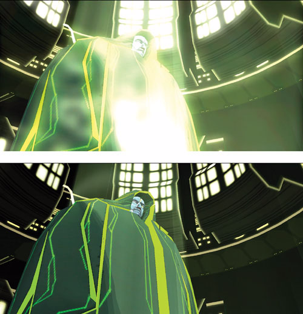

图 有辉光和没有辉光的一个Tron 2.0中的角色对比

有几种方法可以创建场景中的辉光。对于小的类似的点，可以把一个平滑的“辉光”纹理应用到公告牌几何体上，而让公告板几何体在屏幕范围内跟随物体运动。

对于大的辉光源或复杂的辉光形状，要创建辉光，最好对2D场景的渲染进行后处理。这章重点讲到了后处理的实时辉光处理方法。如下图。

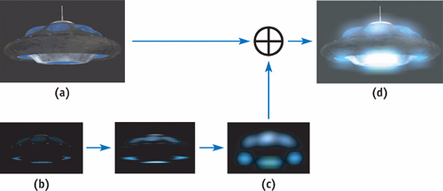

图 场景实时辉光的步骤

（a）正常地渲染场景
（b）涂抹所渲染的辉光源，以产生（c）中的一个辉光纹理，将其加到正常的场景画面中，以产生（d）中最终的辉光效果。

渲染后处理辉光的步骤：

Step 1、辉光的指定和渲染（Specifying and Rendering the Sources of Glow）

Step 2、模糊辉光源（Blurring the Glow Sources）

Step 3、适配分步卷积（Adapting the Separable Convolution）

Step 4、在GPU上进行卷积（Convolution on the GPU）

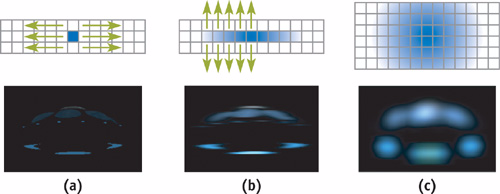

图 有效地创建模糊的两步分解法

上图展示了如何有效地创建模糊的两步分解法：首先，在一根轴上模糊于（a）中的辉光源的点，产生（b）中所示的中间结果，然后在另一个轴上模糊这个结果，产生显示在（c）中的最终模糊。

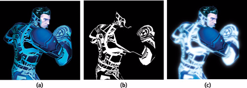

图 有辉光和无辉光的Tron 2.0中的英雄 Jet

（a）用标准方法渲染3D模型
（b）为一个由美术同学创建的辉光源纹理的渲染，目的是指定辉光面积的图案和强度（c）为将辉光应用到标准的渲染结果后，得到的富有表现力的英雄角色效果。

另外，在辉光中使用的这个卷积和模糊方法还可以用于多种其他效果。它能用来计算景深效果的不同聚焦度，景深的信息可以用来控制模糊度。它也能用来模糊投影的纹理阴影的边缘，并且累积深度阴影映射的接近百分比过滤（percentage-closer
filtering ）结果。

而大面积的卷积能被应用于一个环境映射，以创建一个近似的辐照度映射，从而得到更逼真的场景照明（Ramamoorthi和Hanrahan
2001有相关论述）。用大面积的卷积也可以实现许多非真实感渲染技术和其他的特别效果。其中包括镀着霜的玻璃、模拟衍射的透镜摇曳，以及渲染皮肤时用的近似次表面散射。

大片的模糊和卷积能有效地在多种图像硬件上实时地计算，而处理和创建这些效果的代码可以容易地封装成几个C++类或一个小库。

总之，屏幕辉光是一种很赞的效果，能够容易地扩展到几乎每一种情形，并且变化多端，通过其还够延伸创建出很多其他的效果。最终的效果虽然细微但却有张力，值得在各种游戏中采用。

图 Glow效果 @Unreal Engine 4

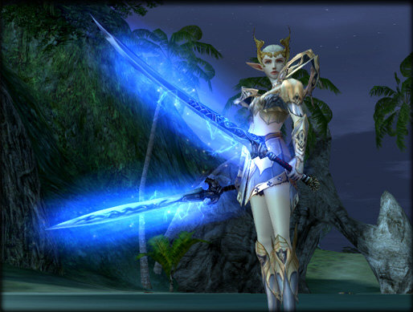

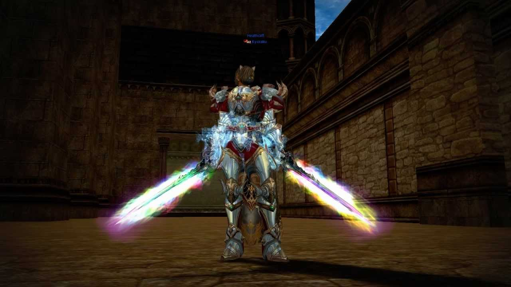

图 有了Glow效果的武器，显得更强力

## 【核心要点总结】

渲染后处理辉光的步骤：

Step 1、辉光的指定和渲染（Specifying and Rendering the Sources of Glow）

Step 2、模糊辉光源（Blurring the Glow Sources）

Step 3、适配分步卷积（Adapting the Separable Convolution）

Step 4、在GPU上进行卷积（Convolution on the GPU）

## 【本章配套源代码汇总表】

Example 21-1.设置抽样八个邻居的纹理坐标的Direct3D顶点着色器代码（Direct3D Vertex
Shader to Set Texture Coordinates for Sampling Eight Neighbors）

Example 21-2. 相加八个加权纹理样本的Direct3D像素着色器代码（Direct3D Pixel
Shader to Sum Eight Weighted Texture Samples）

Example 21-3. 建立邻域采样的Direct3D顶点着色器代码（Direct3D Vertex Shader
Program to Establish Neighbor Sampling）

Example 21-4. 建立邻域采样的Direct3D像素着色器代码（Direct3D Pixel Shader
Program to Sum Four Weighted Texture Samples）

## 【关键词提炼】

实时辉光（Real-Time Glow）

光晕（Halo）

后处理（Post-Processing）

图像处理（Image Processing）

# 下篇 · 次核心内容提炼总结

 

# 七、水焦散的渲染 （Rendering Water Caustics）

## 【章节概览】

这一章介绍了一种从美学角度出发（aesthetics-driven）来实时渲染水中焦散的方法。

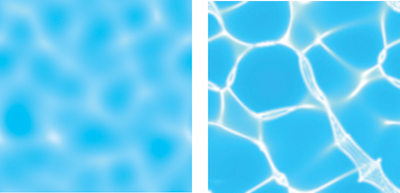

图 水的焦散效果

## 【核心要点】

水的焦散（Water Caustics）的定义：光从弯曲的表面反射或者折射，只聚焦在受光面的某些区域，于是就是产生焦散的现象。

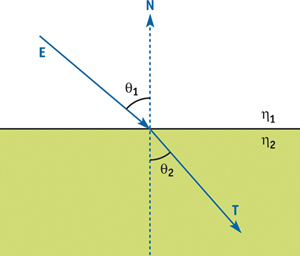

图 折射的计算（入射光线（E）从介质η_1进入介质η_2，发生折射，产生折射光线（T））

首先，从模拟的观点出发，焦散其实可以通过正向或逆向光线追踪计算。

正向光线追踪中，要追踪从光线射出并穿过场景的光线，累计其在不断地区的贡献。

而逆向光线追踪，则以相反的过程工作，从海底开始，按照与入射相反的顺序逆向根据光线，计算给定点的所有入射光线总和。

而该文章中，前一节介绍了逆向蒙特卡洛光线追踪的一个简化，并大胆假设一些光线对焦散有贡献，并只计算到达海底光线的一个子集，因此，该方法计算消耗非常少，却产生了尽管在物理上不正确但是非常逼真的焦散图样和效果。由于整个效果看起来非常令人信服，尤其是图像质量，使得这个方法非常值得实现。文中用HLSL和OpenGL都进行了实现，并按照惯例，提供了源码。

该算法的伪代码如下：

	1.  Paint the ocean floor.
	
	2.  For each vertex in the fine mesh:
	
	    1.  Send a vertical ray.
	
	    2.  Collide the ray with the ocean's mesh.
	
	    3.  Compute the refracted ray using Snell's Law in reverse.
	
	    4.  Use the refracted ray to compute texture coordinates for the "Sun" map.
	
	    5.  Apply texture coordinates to vertices in the finer mesh.
	
	3.  Render the ocean surface.

## 【本章配套源代码汇总表】

Example 2-1. 关于波函数、波函数的梯度以及线平面截距方程的代码示例，（Code Sample
for the Wave Function, the Gradient of the Wave Function, and the Line-Plane
Intercept Equation）

Example 2-2. 最终渲染通道代码示例，展示了依赖纹理读取操作 （Code Sample for the
Final Render Pass, Showing the Dependent Texture Read Operations）

## 【关键词提炼】

水焦散渲染（Rendering Water Caustics）

逆向蒙特卡洛光线追踪（backward Monte Carlo ray tracing）

折射（Refraction）

# 八、 Dawn Demo中的动画（Animation in the "Dawn" Demo）

## 【章节概览】

这章主要讲到编程人员如何帮助美术同学对混合形状实行控制，从而创建不同的表情。主要是使用顶点Shader通过索引的蒙皮和变形网格对象（morph
target）来使一个高分辨率网格变形，实现角色表情和动画等效果。也讨论了为实现实时动画而考虑的各种折中方案。

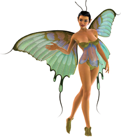

图 Dawn Demo的实时屏幕截图

## 【核心要点】

使用变形目标（Morph Target）是表现复杂网格变形的常用方法。NVIDIA
Demo团队使用此技术创建的Zoltar等Demo从每秒插值30个网格开始，然后基于累计误差方案（Accumulated
Error
Scheme）去除关键帧。使得我们能够缩小文件并减少存储空间，最多可以将三分之二的原始关键帧，同时几乎不会出现可见的失真。在这种类型的网格插值中，任何给定时间中只有两个插值关键帧处于激活状态，而且他们是连续地执行的。另外，变形目标可以并行使用。

原文也中对变形目标（Morph Target）的具体实现进行了论述。

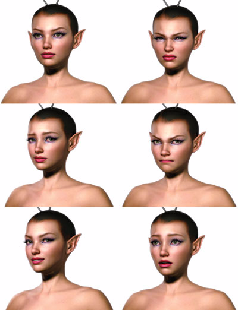

图 表情的混合对象（混合形状）

而蒙皮（Skinning）是一种网格变形方法，对网格中的每个顶点指定一组带有权重的矩阵（权重最大可增加到1.0）。权重指明矩阵应该如何约束顶点。

为一个网格蒙皮做准备，通常要为网格创建一个中间状态，叫做绑定姿势（Bind
Pose），这个姿势保持胳膊和腿略微分开，并且尽可能避免弯曲。

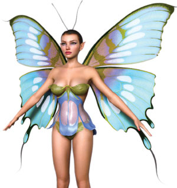

图 Dawn的绑定姿势（Bind Pose）

## 【本章配套源代码汇总表】

Example 4-1 以线性或连续样式运用到变形目标的示例代码（Applying morph targets in
a linear or serial fashion sample code）

Example 4-2 单个"multiply-add"用于每个变形目标的示例代码（Single "multiply-add"
instruction for each morph target sample code）

Example 4-3 变形目标的实现示例代码（Morph Target Implementation sample code）

Example 4-4 使用四根骨头蒙皮的示例代码（Application of four-bone skinning sample
code）

## 【关键词提炼】

面部表情模拟（Facial Expression Simulation）

网格动画（Mesh Animation）

变形目标（Morph Target）

蒙皮（Skinning）

# 九、 改良的Perlin噪声实现（Implementing Improved Perlin Noise）

## 【章节概览】

这章的作者是奥斯卡得主Ken Perlin。他提出的噪声算法（Perlin
Noise）已在实时和离线计算机图形学中得到多方面运用。这篇文章详细阐述了最新进展，纠正了最初的两个缺陷，也提供了有效及稳定的框架结构，用于在现代可编程硬件上执行噪声运算。

## 【核心要点】

首先，噪声函数的目的，是在三维空间中提供一种可以有效率地实现、可重复，伪随机的信号。其信号的能带有限（band-limited），大部分能量集中在一个空间频率附近，而视觉上是各向同性（isotropic）的，统计上不随旋转变化。

一般的想法是创建某种信号，类似于一个完全的随机信号（即白噪声），通过低通滤波后，滤除了所有的空间高频率而变得模糊。有如沙丘你缓慢上升的山包和下落的低谷。

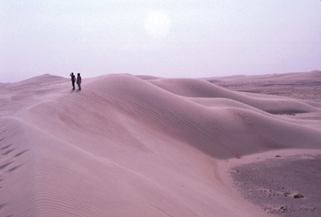

图 沙丘与噪声

最初的噪声在1983年实现，1985 (Perlin 1985)发表，思想是使用埃尔米特-样条（Hermite
spline）插值法等方法实现，原文中对此方法的步骤进行了描述。

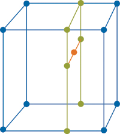

图 使用使用埃尔米特-样条（Hermite spline）插值法，从常规3D格点的八个样本中插值

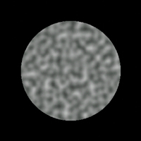

图 通过噪声函数产生的一个切片样条

这篇文章从两个方面对最初的噪声方法的不足进行了改进：

插值的特性以及伪随机斜率场（field of pseudo-random gradients）的特性。

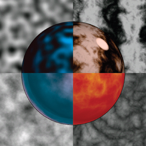

图 四种基于噪声生成的纹理

而另外一个关于噪声的思路是，用体积噪声制造程序式纹理（Procedural texturing using volumetric noise），这样可以不创建显式的纹理图像，来得到自然的材质。这种方法在当年的大片《指环王》中，已经有了广泛应用。

## 【本章配套源代码汇总表】

5-1 假设模型是单位半径球体，实现凹凸模式的示例代码（Assuming the model is a unit-radius sphere, the expressions that implement these bump patterns sample Code）

## 【关键词提炼】

Perlin噪声（Perlin Noise）

噪声函数（Noise function）

伪随机斜率场（Field of Pseudo-Random Gradients）

体积噪声( volumetric noise）

埃尔米特样条（Hermite spline）

 

# 十、Vulcan Demo中的火焰渲染（Fire in the "Vulcan" Demo）

## 【章节概览】

这章讲述了GeForce FX 5900上市时的Demo
“Vulcan”中的火焰渲染技术。其中的技术并非真正的物理模拟，而是对当时的工业标准电影《指环王》的离线技术的跟进。通过文中改进，突破了光栅化大量粒子时操作性能的限制，产生了真实可信的火焰图像。

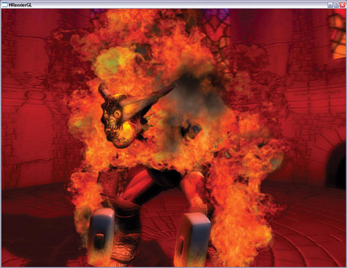

图 基于本章方法实现的"Vulcan" Demo的截图

## 【核心要点】

首先文章尝试了两个方案：

完全程序化的火焰（ fully procedural
flames）和屏幕空间基于变形的二维火焰（screen-space 2D distortion-based
flames.），经过试验都未达预期。

于是改采用视频纹理精灵（video-textured
sprites ），最终达到预期，并实现出了逼真的火焰，且占用很少的GPU资源。

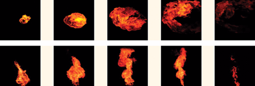

图 用于创建火焰效果的连续镜头

其中，烟的生成使用粒子系统创建一个烟雾生成器。而所需的光照可以采用不同的技术达到，如光线投射。

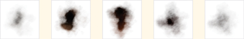

  
图 程序式地产生烟

而火焰和烟的混合，比较常规地使用相加混合（additive blending）。

关于使火焰增加多样性，文中使用了水平和垂直翻转（沿着u和v轴）。而使用任意旋转可以更加具表现力。

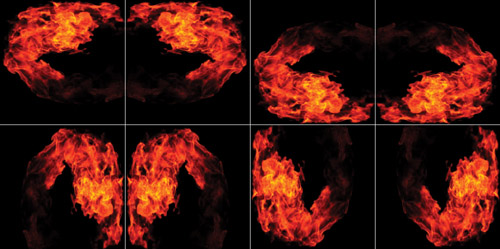

图 由自定义纹理坐标生成的变体

## 【本章配套源代码汇总表】

Example 6-1. 最终的实现Shader代码（The Final Shader）

## 【关键词提炼】

火焰渲染（Fire Rndering）

完全程序化的火焰（fully procedural flames）

屏幕空间基于变形的二维火焰（screen-space 2D distortion-based flames）

视频纹理精灵（video-textured sprites ）

# 十一、衍射的模拟（Simulating Diffraction）

## 【章节概览】

这章讲述了简化的Jos衍射光照模型（最初在SIGGRAPH
1999上发表），此模型以光的物理性质为基础，将光当做波来进行建模，从而创建出多彩的干涉条纹。

## 【核心要点】

什么是衍射（Diffraction）？小尺度的表面细节引起反射波彼此干扰，这个现象就是衍射。

首先，计算机绘图的大多数表面反射模型都忽略自然光的波动效果。当表面的细节比光的波长（约1um）大许多时，不存在问题。但对于小尺寸的细节，例如一个光盘的表面，波效应就不能忽略了。所以，对于小尺度的表面细节引起反射波彼此干扰的现象，即为衍射。

衍射使这些表面的反射光呈现五彩缤纷的图案，由光盘的精细反射可以看到这一现象。

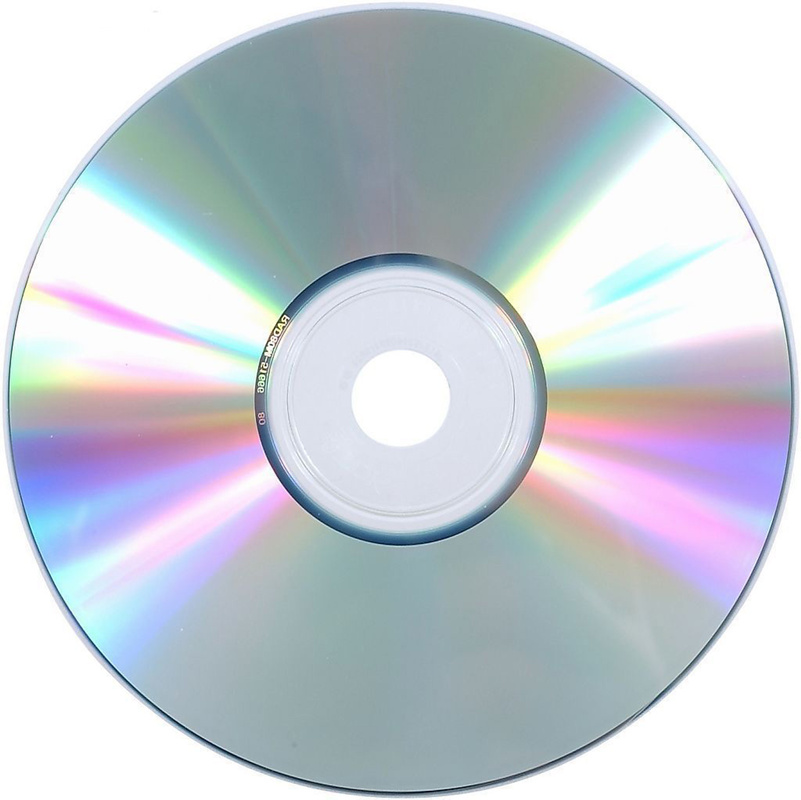

图 光盘的衍射

衍射的实现，可以在Shader的顶点着色器上，也可以在片元着色器上，且实现可以在任何网格上进行，只需提供一个“切线向量”，和每顶点的法线及位置。而切线向量提供表面上窄条带的局部方向。对于一个光盘，其为轨道的方向，如下图。

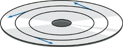

图 光盘的切线向量

对应给定衍射波长的颜色，可以使用简单近似的彩虹贴图。贴图从紫到红排列，而且提供彩虹的大部分颜色，用三个理想凹凸函数（峰值分别在蓝、绿和红的区域）简单混合而成。

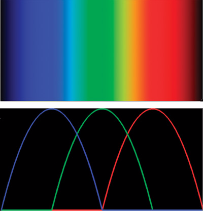

图 用于shader的彩虹彩色贴图

而最终的衍射颜色是彩色的衍射图案和各项异性高光的简单相加的和。

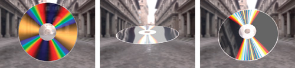

图 光盘衍射实时的3个快照

图 用纹理映射各项异性主要方向表面的3个快照

## 【本章配套源代码汇总表】

Example 8-1. 衍射的顶点着色器代码（The Diffraction Shader Vertex Program）

## 【关键词提炼】

衍射模拟（Simulating Diffraction）

各项异性（Anisotropy）

# 十二、高效的阴影体渲染（Efficient Shadow Volume Rendering）

## 【章节概览】

这章全面讲述了用于实时阴影渲染中常见两种流派之一的阴影体（Shadow
Volumes）技术，又称模板阴影（Stencil
Shadows）技术，重点是得到正确的角度的情形，减少几何图形和填充率的消耗。

## 【核心要点】

当时id software的《Doom 3》就是采用阴影体（Shadow
Volumes）技术来对阴影进行的渲染。具体思想是在模板（stencil）缓冲标记阴影的像素，把像素分为阴影或照明两种类型，接着调节负责光照的像素程序，使阴影像素的照明贡献度为0。

阴影体技术可以为点光源、聚光灯和方向光源创建清晰的、逐像素进度的阴影。单个物体可以被多个光源照亮，而且光有任意颜色和衰减度。阴影从三角形网格投射到深度缓冲区上。这意味着被遮挡的物体，可以是带有深度缓冲区的网格、公告板、粒子系统或预先渲染的场景。

较其他运算相比，阴影体可以更好地处理许多制作困难的阴影场景，如一个插在万圣节南瓜灯内部的光源。

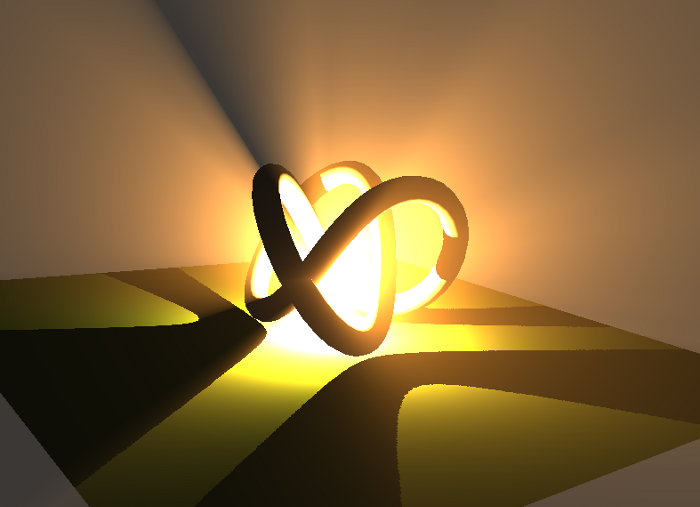

图 阴影体技术可以很好胜任的渲染场景

阴影体的缺点是对那些没能正确表达自身形状的网格的阴影表达效果并不理想。如一些带透明区域的公告板，粒子系统，或带alpha粗糙度的纹理网格（如一片树叶）。这些投影体基于他们的真实网格产生阴影，阴影与物体的真实形状并不匹配。而阴影体的另一个缺点是对带裂缝的网格支持不太好。文中也表示，当时阴影体运行的理想场景是顶部俯视。

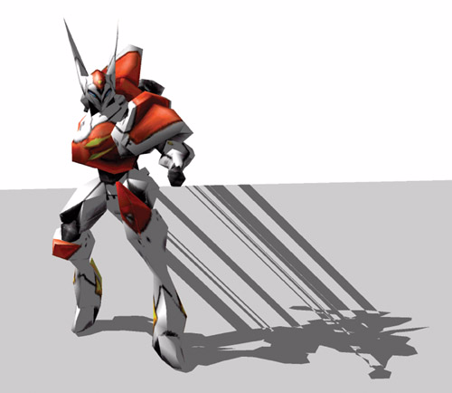

图 模型上的裂缝会让影子穿过空气漏出来

总之，这篇文章对McGuire等人2003年提出的方法进行了很好的描述、分析与实践。而在这篇文章发出之后的若干年，阴影体技术得到了各种进一步地优化与改进。

## 【本章配套源代码汇总表】

Example 9-1 程序结构伪代码（Program Structure Pseudocode）

Example 9-2 glFrustum风格的无限投影矩阵（An Infinite Projection Matrix in the
Style of glFrustum）

Example 9-3 用于从示例光源中“挤”出 w＝0顶点的顶点着色器代码（A Vertex Shader for
Extruding w = 0 Vertices Away from the Example Light）

Example 9-4 （The markShadows Method）

Example 9-5 findBackfaces方法（The findBackfaces Method）

Example 9-6 renderShadowCaps方法（The renderShadowCaps Method）

Example 9-7 renderShadowSides方法（The renderShadowSides Method）

## 【关键词提炼】

阴影渲染（Shadow Rendering）

阴影体（Shadow Volume）/ 模板阴影（Stencil Shadows）

多通道渲染（Multipass Rendering）

# 十三、电影级光照（Cinematic Lighting）

## 【章节概览】

本章中介绍了一个的简化的uberlight（可理解为“全能光照”）实现，此光照shader根据Ronen
Barzel(1997,1999)提出的照明模型编写而成。而该模型的超集已由Pixar动画开发，并应用于《玩具总动员》、《怪物公司》、《海底总动员》等一系列的迪士尼电影中。

本章所对该光照模型的尝试，旨在提供一套全面的光照控制参数，以涵盖灯光美术师日常使用的大部分效果。

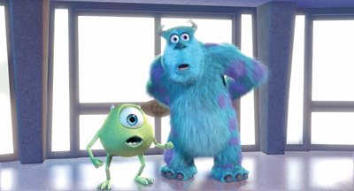

图 《怪物公司》 中cookies对窗户效果的贡献

## 【核心要点】

首先，该章中呈现的Shader只模拟光照场景光源的形成和控制，不包括如何模拟表面细节和光反射行为的复杂性。

大体上，用于电影产品的照明模型会进行两种操作，类似于显示在这里的伪代码：

	color illuminationModel()

	{

	    Computer the surface characteristic

	    For each light

	    {

			Evaluate the light source （评估光源）

			Compute the surface response（计算表面响应）

	    }

	}

首先，通过这些方式计算表面着色信息：运行各种纹理查找（texture
lookups），在网格上插值（interpolating values over the
mesh），计算程序模式（computing procedural
patterns）等。然后在照明物体的每个光源上循环，计算出它的贡献。我们通过对每个光线计算光的颜色，然后计算表面对照明的响应来进行上述操作。

原文中给出了一个Shader源代码，该Shader用于计算塑料（plastic）材质在只有一个光源贡献的反射模型。，可以很容易将它扩展为更通用的多光源和更多表面的解决方案。

该Shader为美术师提供了各个方面的照明控制：选择（指定物体是否响应接受光照），颜色，形状，阴影和纹理，而阴影选项中包括明暗度、色调、反射、阴影贴图、阴影模糊等参数。

下面两幅图说明了uberlight 的使用效果。照明来自Pixar短片“Geri's
Game”中的人物头部。

图 （a）Geri
由一个光源照明；（b）改变光的权重，修改反射高光对比度；（c）改变阴影颜色，加强阴影；（d）改变谷仓形状（类似窗户一样的遮挡物），创建更戏剧化的姿态；（e）使用一块模糊的纹理cookie，丰富图像；（f）夸大透射的cookie的对比，创建像外星人一样的效果

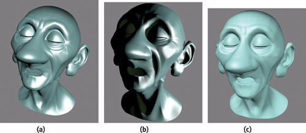

（a）常态 （b）黑色电影（noir）的高反差 （c）柔和的光线

## 【本章配套源代码汇总表】

10-1. The Vertex Program for an Uberlight-Like Shader

10-2. The Fragment Program for an Uberlight-Like Shader

## 【关键词提炼】

电影级光照（Cinematic Lighting）

全能型光照（Uberlight）

照明模型（Lighting Model）

储存于本地的光照数据（Light Cookies）

# 十四、阴影贴图抗锯齿（Shadow Map Antialiasing）

## 【章节概览】

这章介绍了如何通过邻近百分比过滤方法（Percentage-Closer Filtering ,
PCF）有效减少阴影贴图的反走样。

## 【核心要点】

阴影贴图（Shadow
Map，又译作阴影映射）是渲染阴影的常见方法，也是渲染阴影领域的两大流派之一，但是它存在走样的问题。通常使用高分率的阴影贴图和增加阴影贴图的分辨率来反走样，也就是使用Stamminger和Drettakis
2002年提出的“透视阴影贴图（ perspective shadow
maps）”技术。但是，当光与表面接近于平行的时候，使用“透视阴影贴图”技术和增加阴影贴图分辨率就不起作用了，因为放大的倍数接近于无穷大。

高端渲染软件使用“临近的百分比过滤（Percentage-Closer
Filtering,PCF）”技术解决走样问题。最初的PCF算法由Reeves等人1987年提出。其计算的是靠近光源表面的百分比，而不是在阴影中表面的百分比，具体是多次比较阴影贴图的每个像素，求其平均值。

且文中对传统的PCF算法做了改进，不再计算阴影贴图空间中被遮挡的区域，只是简单地在各处使用一个
4 x
4个texel（纹素）的样本块。这个块应该大到能够有效地减少走样，但是不能达到要求大量样本和随机取样的程度。如下图。

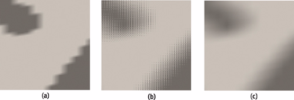

图 （a）每像素取1个样本  （b）每像素取4个样本  （c）每像素取16个样本

可以看到3幅图中的显示效果区别很明显，图（c）中每像素取16个样本，效果最为出色，达到了反走样的预期。

## 【本章配套源代码汇总表】

PS:原文中没有对代码片段进行编号，这里的编号为附加。

Example 11-1 暴风(Brute Force)算法16采样版本的片元程序实现代码

Example 11-2 阴影贴图反走样的4采样实现版本代码

## 【关键词提炼】

反走样/抗锯齿（Antialiasing）

邻近百分比过滤（Percentage-Closer Filtering , PCF）

透视阴影贴图（ perspective shadow maps）

 

# 十五、全方位阴影贴图（Omnidirectional Shadow Mapping）

## 【章节概览】

在这章中，把阴影贴图的思路扩展到正确处理全方位的（点）光源中，其中包括了实现细节，也涉及到基本硬件能力不足时的低效运行策略。

## 【核心要点】

首先，这篇文章也谈到了在实时计算机图形学中产生可见阴影的两个流行方法是：

-   模板阴影（stencil shadows）/ 阴影体(Shadow Volume)

-   阴影贴图（shadow mapping）

模板阴影（Stencil Shadows，也被称Shadow Volume，阴影体）作在《Doom 3》中有所应用，优点是得到大量的GPU支持、独立于光源的种类、产生的阴影质量很高。但缺点是严重依赖于CPU，只能产生清晰的影子，需要很高的填充率，而且不能与硬件（hardware-tessellated）的表面一起使用。

阴影贴图（Shadow Mapping,也译作阴影映射）由Lance Williams于1978年引入计算机图形学，文章发布当时多数好莱坞电影都在使用这个方法，包括计算机渲染和特效。为了计算阴影，阴影映射在场景几何体上投射特殊的动态创建的纹理。它可以渲染清晰和模糊的影子，以及由不同类型的光源产生的阴影，它还可以与硬件镶嵌的表面以及GPU动画的网格（例如蒙皮网格）一起使用。

该文章主要介绍了全方位阴影贴图（Omnidirectional Shadow
Mapping）方法，该方法有两个主要步骤：

-   创建阴影贴图

-   进行阴影投射

在创建阶段，对所有把阴影投射到阴影贴图纹理上的物体，渲染它们到光源的距离的平方。而在投射结算，渲染所有接受阴影的物体，并比较所渲染的像素到光源的距离的平方。以下为全方位阴影映射算法的伪代码：

	for (iLight = 0; iLight < NumberOfLights; iLight++) 
	
	{
	
	  // Fill the shadow map.
	
	  for (iObject = 0; iObject < NumberOfObjects; iObject++)
	
	 {
	
	    RenderObjectToShadowMap(iLight, iObject);
	
	  }
	
	  // Lighting and shadow mapping.
	
	  for (iObject = 0; iObject < NumberOfObjects; iObject++) 
	
	  {
	
	    LightAndShadeObject (iLight, iObject);
	
	  }
	
	}

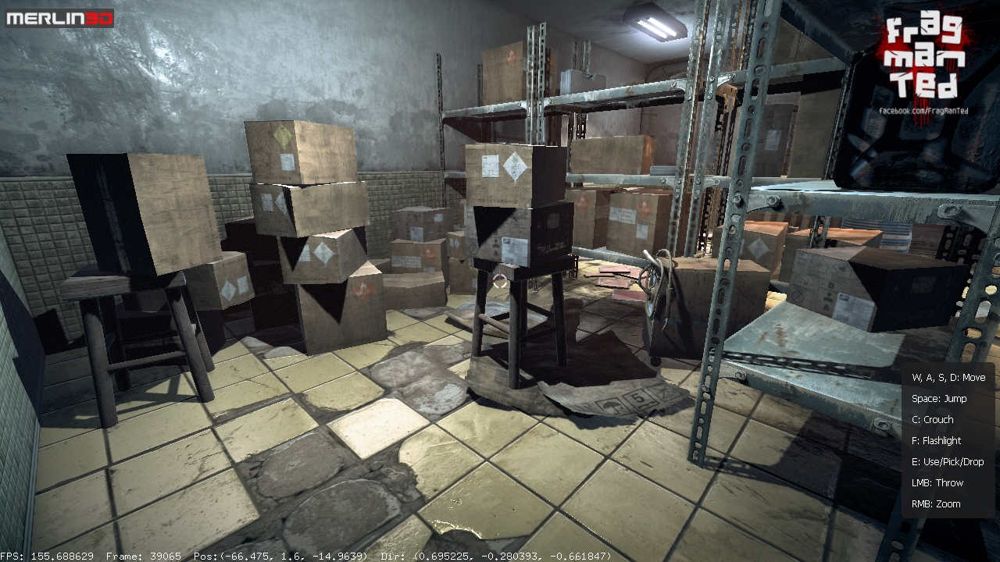

图 Omnidirectional Shadow Mapping @Merlin3d

## 【本章配套源代码汇总表】

Example 12-1 全方位阴影映射算法的伪代码（Pseudocode for the Omnidirectional
Shadow-Mapping Algorithm）

Example 12-2 仅渲染深度（Depth-Only Rendering）

Example 12-3 产生一个软阴影（Making a Softer Shadow）

## 【关键词提炼】

阴影渲染（Shadow Rendering）

阴影贴图（Shadow Mapping）

模板阴影（stencil shadows）/ 阴影体（Shadow volume）

全方位阴影映射（Omnidirectional Shadow Mapping）

 

# 十六、使用遮挡区间映射产生模糊的阴影（Generating Soft Shadows Using Occlusion Interval Maps）

## 【章节概览】

这章介绍了一种渲染软阴影的技术，称为遮挡区间映射（Occlusion Interval
Maps），能够正确地在静态场景中渲染出光源沿着预定路径移动时产生的模糊阴影。之所以叫遮挡区间映射，是因为此算法使用纹理贴图来存储这种光源可见、而本身被遮挡的区间。

## 【核心要点】

对于需现实的加油站的Demo，文章一开始本打算使用一种预计算的可见度技术，例如球谐光照（Spherical
Harmonic Lighting [Sloan et al.
2002]）来实现，但可惜的是无法达到目的，因为球谐光照适用的是非常低频的光照，不适用于像太阳那样小面积的光源。所以后来才开发出遮挡区间映射这种新的预计算可见度的技术，它能够支持实时太阳照射的软阴影。通过把问题简化为在固定轨道上的线性光源来达到目的。

需要注意，遮挡区间映射（Occlusion Interval
Maps）技术有一些局限性，只对沿固定轨道传播的单条光线的静态场景适用。这意味着它对人物和其他动态物体的阴影无效。但是其适用于静态户外场景中的阴影渲染。并且此技术因为遮挡区间映射对每个通道需要8位的进度，纹理压缩将导致视觉效果失真。因此，必须禁用纹理压缩，从而增加了纹理用量。

使用遮挡区间映射（Occlusion Interval
Maps）技术，通过损失一定运行性能来获得在静态场景上实时运行的软阴影算法。遮挡区间映射（Occlusion
Interval
Maps）可以用作静态光照贴图的替代品，从而实现动态效果，可以得到从日出到日落光照明变化的动态效果。如下图。

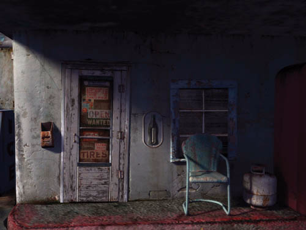

图 加油站入口

注意加油站墙上的阴影在图形的左上方有清楚的边界，但是它朝着右下方变得模糊而柔软。这种相联系的清晰和模糊的变化是真实感软阴影的重要性质，而这是由遮挡区间映射得到的。

图 汽车上方的木板在篷布上形成的阴影

上图中汽车篷布上的木板形成了复杂的阴影。这对算法来说是最坏的情况。这些木头条使得篷布上的遮挡区间映射必须存储在5个不同的纹理中，对于场景中的大多数物体，4个纹理就足以取得所有的阴影。

## 【本章配套源代码汇总表】

Example 13-1使用遮挡区间映射计算软阴影的实现函数（Function for Computing Soft
Shadows Using Occlusion Interval Maps）

## 【关键词提炼】

阴影渲染（Shadow Rendering）

软阴影（Soft Shadows ）

遮挡区间映射（Occlusion Interval Maps）

 

# 十七、透视阴影贴图（Perspective Shadow Maps: Care and Feeding）

## 【章节概览】

透视阴影贴图（Perspective Shadow Maps, PSMs）是由Stamminger和Drettakis在SIGGRAPH
2002上提出的一种阴影贴图（Shadow Maps）流派的方法。

透视投影贴图方法的基本思想是，为了减少或消除阴影贴图的失真走样，对投射到大像素区域的物体取最大的阴影贴图纹素密度。

这章提出了一种优化透视阴影贴图（Perspective Shadow
Maps）方法的新思路，对其三种缺陷都一一进行了改进。

## 【核心要点】

这章首先讲到动态阴影的创建，目前主要有两个算法流派：

-   阴影体（shadow volumes）/模板阴影（stencil shadows）

-   阴影贴图（Shadow Maps）

阴影体和阴影贴图算法之间的不同之处在于，是涉及到物体空间（object
space）还是图像空间（image space）。

-   阴影体（Shadow Volumes）是物体空间（Object Space）的阴影算法，通过创建表示阴影遮挡的多边形结构来工作，这意味着我们始终具像素精确但较“硬”的阴影。此方法无法处理没有多边形结构的对象，比如经过alpha测试修改的几何图形或经过位移映射的几何体（displacement
mapped geometry）。此外，绘制阴影体需要大量的填充率，这使得很难将它们用于密集场景中的每个对象上，特别是在存在多个灯光时。

-   阴影贴图（Shadow Maps）是图像空间（Image Space）的阴影算法，它可以处理任何物体（如果能够渲染一个物体，就能得到它的阴影），但是存在走样（aliasing，锯齿）的问题。走样时常发生在有较宽或全方位光源的大场景中。问题在于阴影映射中使用的投影变换会改变阴影贴图像素的大小，因此摄像机附近的纹理像素变得非常大。因此，我们必须使用巨大的阴影贴图（四倍于屏幕分辨率或更高）来实现更高的质量。尽管如此，阴影贴图在复杂场景中却比阴影体要快得多。

透视阴影贴图（Perspective Shadow Maps, PSMs）是由Stamminger和Drettakis在SIGGRAPH
2002上提出的一种阴影贴图（Shadow Maps）流派的方法，通过使用在投射后空间（post-projective space）中的阴影贴图来去除其中的走样，而在投射后空间中，所有近处的物体都比远处的大。不幸的是，使用原始算法很困难，因为只有要某些情况下才能正常工作。

以下是透视阴影映射算法的三个主要问题和解决方案：

1、当光源在摄像机后面的时候，有一个虚拟的摄像机锥体。若在锥体内保持所有潜在的阴影投射体，阴影质量就会变得很差。

解决方案：是对光源矩阵使用特别的投射变换，因为投射后空间可以使用某些在通常空的世界空间中不能做的投射技巧。它使我们可以建立特殊的投射矩阵，可以看做“比无限远更远”。

2、光源在摄像机空间中的位置对阴影质量影响很大，对于垂直的方向光，完全没有走样问题，但是当光源朝向摄像机并迎面靠近它时，阴影映射走样就很严重。

解决方案：把整个单位立方体保持在一个阴影贴图纹理中，对于遇到的问题，有两个办法，每个办法仅解决问题的一部分：单位立方体裁剪法，把光源摄像机对准单位立方体的必要部分；立方体映射法，使用多个纹理来存储深度信息。

3、最初的文章没有讨论过偏置（bias）问题。偏置是随透视阴影贴图而带来的问题，因为纹素的面积以不均匀方式分布，这意味着偏置不再是常量，而是与纹素的位置有关。

解决方案：使用在世界空间中的偏置（而且不再分析双投射矩阵的结果），然后把这个世界空间偏置转换到投射后空间。

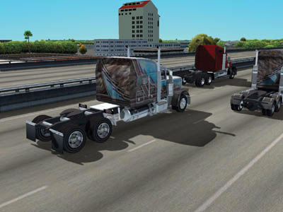

图 得到的阴影实时渲染结果（多边形10w ~ 50w个，分辨率1600x1200）。

## 【本章配套源代码汇总表】

Example 14-1计算立方体阴影纹理坐标（Shader Code for Computing Cube Map Texture
Coordinates）

Example 14-2在顶点Shader中计算偏置（Calculating Bias in a Vertex Shader）

Example 14-3 紧邻百分比过滤的顶点Shader伪代码（Vertex Shader Pseudocode for
PCF）

Example 14-4 用于紧邻百分比过滤的像素Shader伪代码（Pixel Shader Pseudocode for
PCF）

## 【关键词提炼】

阴影渲染（Shadow Rendering）

阴影贴图（Shadow Maps）

透视阴影映射（Perspective Shadow Maps，PSMs）

紧邻百分比过滤（percentage-closer filtering ，PCF）

单位立方体裁剪法（Unit Cube Clipping）

 

# 十八、逐像素光照的可见性管理（Managing Visibility for Per-Pixel Lighting）

## 【章节概览】

这章讲到了可见性在逐像素渲染光照场景中的作用，也考虑如何使用可见性减少必须渲染的批次数量，从而改善性能。

## 【核心要点】

如下伪代码说明在一个场景中必须渲染的批次数：

	For each visible object
	
	  For each pass in the ambient shader
	
	    For each visible batch in the object
	
	      Render batch
	
	For each visible light
	
	  For each visible shadow caster
	
	    For each pass in the shadow shader
	
	      For each shadow batch in the object
	
	        Render batch
	
	  For each lit visible object
	
	    For each pass in the light shader
	
	      For each visible batch in the object
	
	        Render batch

正如伪代码所述，为了减少批次数，可以进行一些与非可见性相关的优化。最应该优化的是渲染每个光照所必须的通道数。批次数随通道数线性增加，因此，我们应该最小化受限于CPU的游戏通道数。

我们可以使用可见性来减少批数。其中，为了减少批次，各个部分（可见部分、光源部分、光照部分、阴影部分）的集合分开讨论并生成。

可见性不仅能有效改善CPU的性能，也同样可以改善GPU的性能。对模板体执行逐像素光照时，填充率的消耗（模板体的填充或多次渲染大的物体）很快就变成了瓶颈，但可以使用剪切矩形（scissor
rectangle）限制显卡渲染的面积，解决此问题。

逐像素的照明需要大量的批次数和极高的填充率，所以要减少渲染的物体数和它们影响的屏幕面积。而使用这章中介绍的标准可见性算法和技术，可以充分改善运行性能。

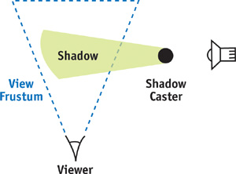

图 不在可见集合中的对象可能会影响渲染场景

## 【本章配套源代码汇总表】

Example 15-1 说明一个场景中必须渲染的批次数量的伪代码（pseudocode illustrates
the number of batches that must be rendered in a scene）.

Example 15-2：快速生成凸包的伪代码（pseudocode for quickly generate the convex
hull）

## 【关键词提炼】

逐像素光照（Per-Pixel Lighting）

可见性管理（Managing Visib1ility）

性能优化（Performance Optimization）

批次（Batch）

# 十九、空间BRDF（Spatial BRDFs）

## 【章节概览】

这章主要先聊到了空间双向反射分布函数（SBRDF），接着文章讨论了压缩SBRDF表达式，以及由离散光或环境贴图所照明的SBRDF的渲染方法。

## 【核心要点】

SBRDF是纹理贴图和双向反射分布函数（BRDF）的组合。纹理贴图存储了反射或其他的属性，它们沿着2D表面上的空间变化，而BRDF存储的是表面上单个点的反射，包括从入射角到出射角的全部分布。

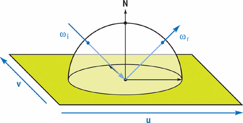

图 SBRDF的定义域

SBRDF对标准点光源或方向光源照明的SBRDF表面，文中直接贴图了Shader源码，具体可以参考原文。

SBRDF除了可以用点光源或方向光源照明之外，还可以用环境贴图中所有方向的入射光进行照明。关键是在渲染前用BRDF的一部分卷积环境贴图。对于大多数的BRDF表达式，必须分别处理各个不同的BRDF。但因为一个SBRDF可能有上百万个不同的BRDF，所以这样做不可能。这篇文章采取的的做法是，简单地用一个Phong叶片卷积环境贴图，叶片可以选择不同的镜面指数，如n=0、1、4、16、64、256、这些贴图能存储在不同级别的立方体mipmap中。随后，SBRDF纹素的n值就指细节层次(LOD)，用于在立方体贴图中采样适当mipmap级别。

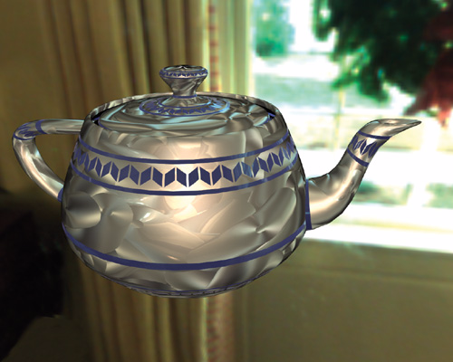

图 用蓝色的油漆和铝BRDF得到的SBRDF渲染效果

## 【本章配套源代码汇总表】

Example 18-1. 用于离散光源的SBRDF片元Shader（An SBRDF Fragment Shader for
Discrete Lights）

Example 18-2. 使用Phong Lobe来描述环境地图的伪代码（Pseudocode for Convolving an
Environment Map with a Phong Lobe）

Example 18-3. 用于环境贴图的SBRDF片元Shader（An SBRDF Fragment Shader for
Environment Maps）

## 【关键词提炼】

双向反射分布函数（BRDF）

空间双向反射分布函数（SBRDF）

离散光（Discrete Lights）

环境贴图（Environment Maps）

# 二十、基于图像的光照（Image-Based Lighting）

### 【章节概览】

这篇文章打破了当时立方体贴图环境（Cube-Map Environment）用法的桎梏，深入研究了更多可能的逼真光照效果。文章主要研究了基于图像的光照（Image-Based Lighting，IBL），包括局部化的立方体映射，类似于使用基于图像的局部光照（Localizing
Image-Based Lighting），然后介绍了如何把哪些重要的技巧用于着色模型，包括逼真的反射、阴影和漫反射/环境项。

### 【核心要点】

立方体贴图通常用于创建无限远环境的反射效果。但是使用少量Shader算法，我们可以将物体放置在特定大小和位置的反射环境中，从而提供高质量的基于图像的光照（Image-Based
Lighting，IBL）。

在室内环境移动模型时，最好是使用近距离的立方体贴图，距离的大小与当前的房间类似。当模型在房间移动时，根据模型在房间中的位置，适当地放大或缩小放射。这种方法得到的模拟效果使人感到更为可靠和逼真。尤其在包含窗户，屏幕和其他可识别光源的环境中。而只要加入很少的Shader数学就能将反射局部化。具体可以看原文贴出的Shader源码。

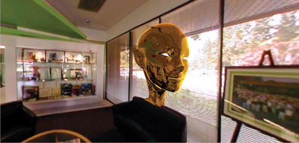

图 不同位置上的局部反射

另外，我们可以将3D几何体做成立方体贴图，并且在正常地渲染环境的时候，把贴图应用到该环境的物体上。也可以使用贴图作为环境，把它投射到较简单的几何体上。

立方体贴图也能用来决定漫反射光照。Debevec的HDRShop程序能够从映射立方体光照环境积分出全部的漫反射贡献度，那么通过把表面法线带入预先卷积的立方体贴图，能够简单地查询漫反射贡献。

基于图像的光照为复杂的光照计算提供了综合而廉价的替代品，将一点数学加入纹理方法，可以大大拓宽“简单”IBL效果，给3D图像提供更强的的方位感。

## 【本章配套源代码汇总表】

Example 19-1生成世界空间和光照空间坐标的顶点着色器代码（Vertex Shader to
Generate World-Space and Lighting-Space Coordinates）

Example 19-2 本地化反射像素着色器代码（Localized-Reflection Pixel Shader）

Example 19-3 用于背景立方体对象的顶点着色器代码（Vertex Shader for Background
Cube Object）

Example 19-4 用于背景立方体对象的像素着色器代码（Pixel Shader for Background
Cube Object）

## 【关键词提炼】

基于图像的光照（Image-Based Lighting，IBL）

立方体贴图环境（Cube-Map Environment ）

基于图像的局部光照（Localizing Image-Based Lighting）

# 二十一、纹理爆炸（Texture Bombing）

## 【章节概览】

这章介绍了纹理爆炸（Texture
Bombing）和相关的细胞技术，它们能在Shader中增加视觉的丰富性，图像的多样性，并减少大块纹理图案的重复性。

## 【核心要点】

纹理爆炸（Texture
bombing）是一种程序化技术，它把小块图像以不规则的间隔放置。有助于减少团案的失真。

纹理爆炸的基本思想是把UV空间分为规则的单元栅格。然后使用噪声或者伪随机函数，把一个图像放在任意位置上的各个单元中。最终的结果是在背景上对这些图像的合成。

由于要组合数以百计的图像，因此实际上这种合成（composite）图像的方法效率并不高。而程序化（Procedural
）计算图像虽好，但是又不适合合成。这篇文章主要讲了图像合成和程序化生成这两种方法，可以发现他们各有优劣。

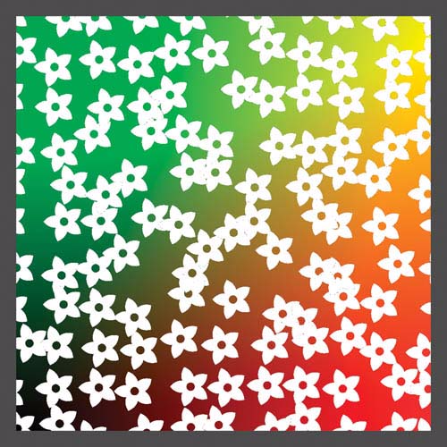

图 纹理爆炸效果图

很显然，纹理爆炸也可以扩展到3D中，即3D程序化爆炸（Procedural 3D Bombing）

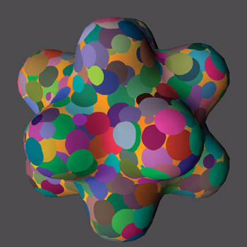

图 程序化的3D纹理爆炸效果

纹理爆炸有一种有趣的变化是在平面上画Voronoi区域。简言之，给定一个平面和那个平面上的一系列的点，接近那个点的面积就是点的Voronoi区域。Voronoi图案类似于树叶和皮肤上的单元形状、龟裂的泥土或爬虫类的皮。如下图。

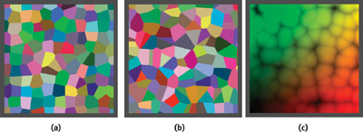

图 Voronoi区域

总之，纹理爆炸和相关的细胞技术可以给Shader增加视觉的多样性。使用存储在纹理中的伪随机数表和一个小程序，可以增大一个图像或一组图像的变化，并减少大块纹理区域的重复。

## 【本章配套源代码汇总表】

Example 20-1 将采样扩展到四个单元格（Extending the Sampling to Four Cells）

Example 20-2 添加图像优先级（Adding Image Priority）

Example 20-3 使用程序化生成圆（Using a Procedurally Generated Circle）

Example 20-4 每个单元采样多个圆减少网格状图案（Sampling Multiple Circles per
Cell Reduces Grid-Like Patterns）

Example 20-5 3D程序化爆炸（Procedural 3D Bombing）

Example 20-6 程序化3D纹理程序（The Procedural 3D Texture Program）

Example 20-7 计算Voronoi区域（Computing Voronoi Regions）

## 【关键词提炼】

纹理爆炸（Texture Bombing）

3D程序化爆炸（Procedural 3D Bombing）

Voronoi区域（Voronoi Region）

 

# 二十二、颜色控制（Color Controls）

## 【章节概览】

这章将在游戏中图像处理的讨论，扩展到技术和艺术上控制颜色的方法和应用，包括将图像从一些的色彩空间中移入移出，以及快速地给任何2D或3D场景加上精美的色调。

## 【核心要点】

色彩校正（Color Correction）是几乎所有印刷和胶片成像应用的一部分。
色彩校正可用于将彩色图像从一个色彩空间移动到另一个色彩空间。

我们在电视、杂志和电影中剪刀的大部分图像，都经过了非常小心的彩色校正和控制。对于这个过程的理解，可以帮助开发者在实时应用程序中得到同样华美的视觉效果。

色彩校正通常有两种做法：一是各个通道的校正，分别是改变红色、绿色和蓝色各成分；二是混色操作，基于红、绿、蓝各个成分的同时操作，得到每个通道的输出值。

色彩校正的机理可以简洁而容易地在一个shader中描述。重要的是，美术和程序员使用的普通工具就能有效地控制他们。在这章中，运用Photoshop创建控制资源，然后通过像素shader应用到实时程序中。

在Photoshop中提供了一些基于通道校正的工具。如级别（levels）和曲线（Curves）工具。

其中曲线是仿制了化学中的交叉处理（cross-processing）外观，确切地说，就是在C41化合物中处理E6叫绝所产生的假颜色外观。这样的处理已在印刷、电影和电视领域使用多年。

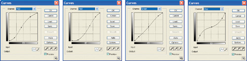

图 重新创建交叉处理效果的Photoshop曲线

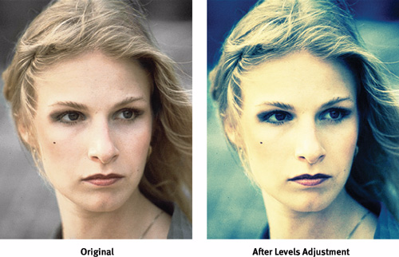

图 伪交叉处理 

（a）原始图 （b）曲线调节之后

可以使用下面几行shader代码运用于输出颜色，使用色彩校正纹理映射，可以随意地用曲线工具重新创建任何色彩变化：

float3 InColor = tex2D(inSampler, IN.UV).xyz;

float3 OutColor;

OutColor.r = tex1D(ColorCorrMap, InColor.r).r;

OutColor.g = tex1D(ColorCorrMap, InColor.g).g;

OutColor.b = tex1D(ColorCorrMap, InColor.b).b;

也就是说，使用每个原始的红、绿和蓝像素的灰度值，确定在梯度纹理中我们寻找的相关位置，然后由梯度纹理本身定义对新颜色的重映射，即由复杂曲线调节所定义的新颜色，如下图。

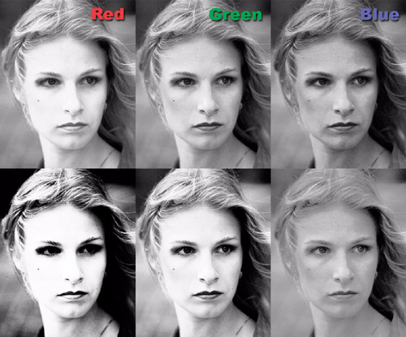

图 对红、绿、蓝通道重映射结果

## 【本章配套源代码汇总表】

原文仅存在无编号的代码片段若干，具体详见原文。

## 【关键词提炼】

颜色控制（Color Controls）

色彩校正（Color Correction）

基于通道的颜色校正（Channel-Based Color Correction）

灰度变换（Grayscale Conversion）

色彩空间变换（Color-Space Conversions）

图像处理（Image Processing）

 

# 二十三、景深 （Depth of Field）

## 【章节概览】

本章主要介绍如何使用GPU创建实时的景深（Depth of Field）效果。

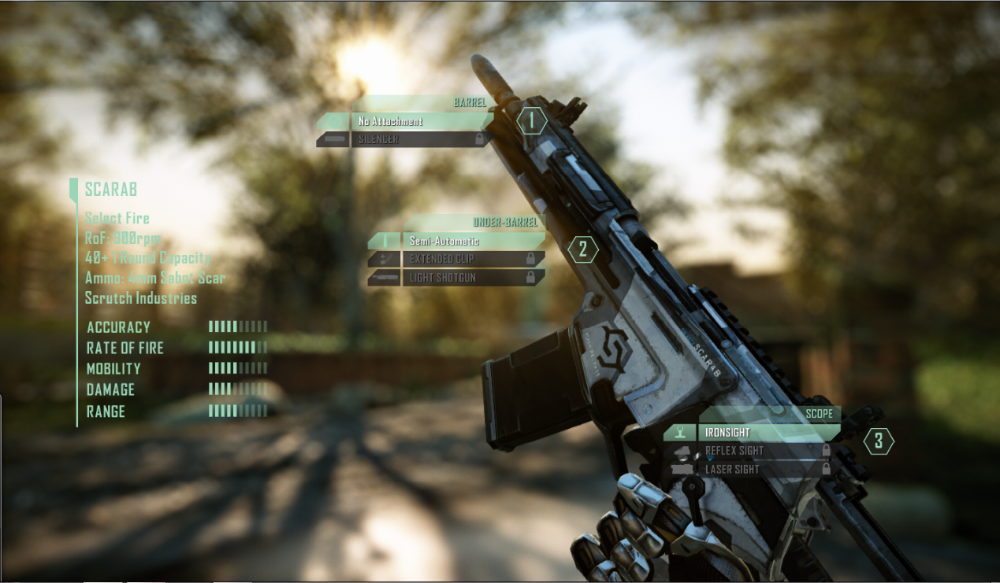

图 实时景深效果 @Crysis 2

## 【核心要点】

物体在距离镜头的一个范围之内能够清晰成像（经过聚焦），在那个范围之外（或近或远）则成像模糊，这种效果就是景深。在相机业和电影业中，景深经常用来指示对场景的注意范围，并且提供场景深度的感觉。在本章中，把这个聚焦范围远的区域称为背景（background），在这个范围前的区域称为前景（foreground），而在范围外的面积称为中景（midground）。

景深效果由透镜的物理性质产生。若要穿过摄像机透镜（或人眼镜的晶体）的光辉聚到胶片（或人的视网膜）上的一个点，光源必须与透镜有着特定的距离。在这个距离上的平面称为焦平面（plane
in
focus）。不在这个精确距离上的任何东西，投影到胶片上的区域（而不是一个点）称为模糊圈（circle
of
confusion，CoC）。Coc的直径与透镜尺寸和偏离焦平面的距离成正比。偏离距离小到一定程度，CoC会变得比胶片的分辨率更小，摄影师和摄影师称这个距离为聚焦（in
focus），而在这个范围之外的任何东西都是没有对准聚点的（out of
focus，模糊的）。如下图。

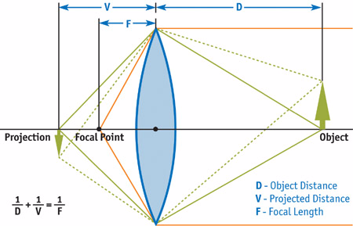

图 薄的透镜

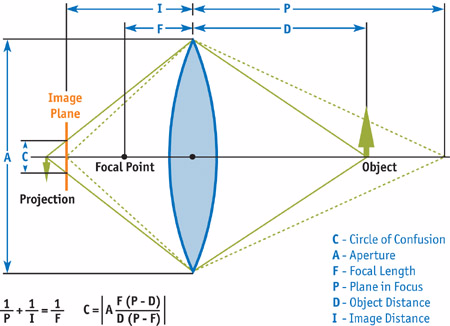

图 模糊圈（circle of confusion）

这章中主要综述了5种近似景深效果的技术。

1、基于光线追踪的景深（Ray-Traced Depth of Field）[Cook et al. 1984]

2、基于累积缓冲的景深（Accumulation-Buffer Depth of Field）[Haeberli and Akeley
1990]

3、分层景深（Layered Depth of Field）[Scofield 1994]

4、前向映射的Z缓冲景深（Forward-Mapped Z-Buffer Depth of Field） [Potmesil and
Chakravarty 1981]

5、反向映射的Z缓冲景深（Reverse-Mapped Z-Buffer Depth of Field）[ Arce and Wloka
2002, Demers 2003]

## 【本章配套源代码汇总表】

原文仅存在无编号的代码片段若干，具体详见原文。

## 【关键词提炼】

景深（Depth of Field）

基于光线追踪的景深（Ray-Traced Depth of Field）

基于累积缓冲的景深（Accumulation-Buffer Depth of Field）

分层景深（Layered Depth of Field）

前向映射的Z缓冲景深（Forward-Mapped Z-Buffer Depth of Field）

反向映射的Z缓冲景深（Reverse-Mapped Z-Buffer Depth of Field）

图像处理（Image Processing）

 

# 二十四、高品质的图像滤波（High-Quality Filtering）

## 【章节概览】

这章描述了图像滤波和可以用于任意尺寸图像的效果，并将各种不同的滤波器核心（kernel），在分析计算后应用于各式2D和3D反走样问题中。

## 【核心要点】

GPU可以提供一些快速滤波的访问纹理的方法，但是仅限于几种类型的纹理过滤，并不是对每种纹素格式都适用。若我们自己建立自己的图像滤波方法，可以得到更好的质量和灵活性，但需要了解硬件和程序滤波之间存在的质量和速率的矛盾。

对滤波图像所考虑的内容也同样适用于3D渲染，尤其是把模型纹理化（光栅化）的时候，即把3D数据（和潜在的纹理信息）转换为一个新的2D图像的时候。

而混合过滤方法（Hybrid filtering
approaches）可以提供一个最佳的中间路径，即借助硬件纹理单元解析的着色。

GPU着色程序不同于CPU的主要之处在于：一般来说，CPU数学操作比纹理访问更快。在像RenderMan这样的着色语言中，texture()是最费时的操作之一，而在GPU中的情形恰恰相反。

图像滤波（ image
filtering）的目的很简单：对于给定的输入图像A，我们想要创建新的图像B，把源图像A变换到目标图像B的操作就是图像滤波。最一般的变换是调整图像的大小、锐化、变化颜色，以及模糊图像等操作。

源像素的模式，以及它们对图像B像素的相对共享，就称为滤波的核心（filter
kernel）。而把核心御用到源图像的过程叫做卷积（convolution）：即使用特殊的核心卷积源图像A的像素，创建新图像B的像素。

如果核心只是把像素简单地进行平均，我们称这个模型为盒式滤波器（box
filter），因为模型是一个简单的长方形（所有像素都在盒中）。每个采样的纹素（即，从纹理来的一个像素）的权重相等。盒式滤波器很容易构造，运行速度快，是GPU中硬件驱动过的一种滤波核心。

如果我们正好使用小的核心，可以把它作为参数直接代入Shader，下图显示的样本代码执行
3 x
3的滤波运算，对编入索引的纹素和其临近单元，赋予W00到W22的加权值，先求加权和，然后除以预计算的总和值（Sum）把它们重规范化。

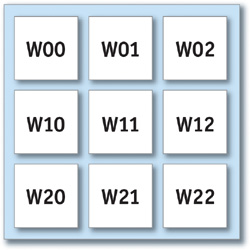

图 中心在W11的3x3滤波核心的像素布局

我们可以自己定义各种核心，如可以基于两个常数的3 x
3核心做边缘检测，后文也接着讲到了双线性滤波核心（Bilinear Kernel），双立方滤波核心（Bicubic
Filter Kernel），屏幕对齐的核心（Screen-Aligned Kernels）等内容。

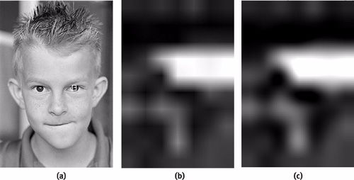

双线性和双立方滤波的效果。（题外话：不知道为什么，看这个小男孩，莫名觉得长得像冠希哥……）

(a)原始图像，注意眼睛上方的长方形。(b)用线性滤波把矩形的子图像区域放大32倍；(c)用双立方滤波把相同的区域放大32倍。

## 【本章配套源代码汇总表】

Example 24-1. 读取九个纹素来计算一个加权和的着色器代码（Reading Nine Texels to
Calculate a Weighted Sum）

Example 24-2. 将九个纹素减少到三个的着色器代码（Nine Texel Accesses Reduced to
Three）

Example 24-3. 使用点积，紧凑书写示例24-2中的代码（As in Listing 24-2, Compactly
Written Using Dot Products）

Example 24-4. 最紧凑的形式，使用预先合并的float4权重（The Most Compact Form,
Using Pre-Coalesced float4 Weights）

Example 24-5. 边缘检测像素着色器代码（Edge Detection Pixel Shader）

Example 24-6. 使用灰度辅助纹理的边缘检测着色器代码（The Edge Detection Shader
Written to Use Grayscale Helper Textures）

Example 24-7. 用于生成浮点内核纹理的OpenGL C ++代码（OpenGL C++ Code for
Generating a Floating-Point Kernel Texture）

Example 24-8. 使用内核纹理作为Cg函数（Using the Kernel Texture as a Cg
Function）

Example 24-9. 过滤四行纹素，然后将结果过滤为列（Filtering Four Texel Rows, Then
Filtering the Results as a Column）

Example 24-10. 原生条纹函数（Naive Stripe Function）

Example 24-11. 基于条纹覆盖量返回灰度值的条纹函数（Stripe Function that Returns
Grayscale Values Based on the Amount of Stripe Coverage）

Example 24-12. 简单的像素着色器来应用我们的滤波条纹函数（Simple Pixel Shader to
Apply Our Filtered Stripe Function）

Example 24-13. 使用条纹纹理进行简单的条带化（Using a Stripe Texture for Simple
Striping）

Example 24-14. 用亮度控制条纹函数的平衡（Using Luminance to Control the Balance
of the Stripe Function）

Example 24-15 HLSL .fx指令产生变条纹纹理（HLSL .fx Instructions to Generate
Variable Stripe Texture）

Example 24-16 在像素着色器中应用可变条纹纹理（Applying Variable Stripe Texture
in a Pixel Shader）

## 【关键词提炼】

高品质图像滤波（High-Quality Filtering）

边缘检测（Edge Detection）

双线性滤波（Bilinear Filtering）

双三次滤波（Bicubic Filtering）

三次滤波（Cubic Filtering）

 

# 二十五、用纹理贴图进行快速滤波宽度的计算（Fast Filter-Width Estimates with Texture Maps）

## 【章节概览】

这章描述基于纹理映射在2D空间中进行快速过滤宽度计算（Fast Filter-Width
Estimates）的方法。即使硬件profile对复杂函数的局部偏导函数不提供直接支持，基于本文提出的纹理操作技巧，也可以得到结果。

## 【核心要点】

Cg标准库提供了ddx()和ddy()函数，计算任意量关于x和y像素的导数。换言之，调用ddx(v)，可以求出变量v在x方向的当前像素与下一个像素之间的变化量，调用ddy(v)同样也可以求出y方向的情况。

那么，下面贴出的这个filterwidth()函数，可以很容易地计算任何值在像素之间变化的速率，以及程序纹理说需要过滤的面积。
	
	float filterwidth(float2 v)
	
	{
	
	  float2 fw = max(abs(ddx(v)), abs(ddy(v)));
	
	  return max(fw.x, fw.y);
	
	}

上述filterwidth()函数，仅在支持ddx()和ddy()函数的profile下工作，但可惜的是一些硬件profile不支持这两两个函数。而本文提出的这个trick，可以使用纹理映射硬件，进行与filterwidth()函数本质上相同的运算。

而这个技巧的关键在于，用函数tex2D()所做的纹理贴图查询，可以自动地对纹理查询进行反走样，而不考虑所代入的纹理坐标。也就是说，基于在相邻像素上所计算的纹理坐标，硬件可以为每个查询决定要过滤的纹理面积。

纹理映射的这个性质，可以用来替代滤波宽度函数filterwidth()，而无需调用ddx()和ddy()。我们以这样的一种方式执行纹理查询：通过它可以推测所过滤的纹理贴图面积，这里是推测需要过滤的程序化棋盘格纹理面积。这种解法分为两步：（1）为特定的纹理坐标选择mipmap级别；（2）利用上述技巧来决定过滤宽度。

最终，这个trick可以在很多情况下很好的计算滤波宽度，运行性能几乎与基于求导的计算滤波宽度函数filterwidth()相同。

## 【本章配套源代码汇总表】

Example 25-1 抗锯齿棋盘函数（Antialiased Checkerboard Function）

Example 25-2使用估算滤波宽度的值来加载Mipmap级别的代码（Code to Load Mipmap
Levels with Values Used for Estimating Filter Widths）

Example 25-3 使用示例25-2中的Mipmap来计算滤波器宽度的函数（Function to Compute
Filter Widths Using Mipmaps from Listing 25-2）

Example 25-4 滤波器宽度函数不容易走样滤波器宽度（Filter-Width Function That Is
Less Prone to Under-Aliasing Filter Widths）

## 【关键词提炼】

快速滤波宽度估算（Fast Filter-Width Estimates）

在着色器中求导（Derivatives in Shaders）

用纹理计算过滤宽度（Computing Filter Width with Textures）

 

# 二十六、OpenEXR图像文件格式（The OpenEXR Image File Format）

## 【章节概览】

这章中，大名鼎鼎的工业光魔公司的Florian Kainz、Rod Bogart和Drwe
Hess介绍了OpenEXR标准，这是一种当时新的高动态范围图像（HDRI）格式，在计算机成像的顶级电影中正在快速推广。对于基于图像照明的开发者而言，OpenEXR是关键的工具。

## 【核心要点】

OpenEXR是由工业光魔（ Industrial Light & Magic
，ILM ）公司开发的高动态范围图像（ high-dynamic-range image
，HDRI）文件格式。OpenEXR网站是 www.openexr.org ，上面有关于此格式的全部细节。

下图是一个例子，说明了需要HDR存在的原因。

如下图是一张显示相当高的动态范围的场景，场景中左边的油灯的火焰比中间小盘子下的阴影大约亮100000倍。

图 高动态范围场景

图像曝光的方式导致了一些区域的亮度超过了1.0，在计算机显示屏上，这些区域被裁剪（clipped）掉，并显示为白色或不自然的饱和桔色色调。

我们可以通过把图像变暗来校正白色和橘色区域，但是如果把原始图像存储在低动态范围文件格式中，如JPEG格式，把它变暗就会产生相当难看的图像。如下图。

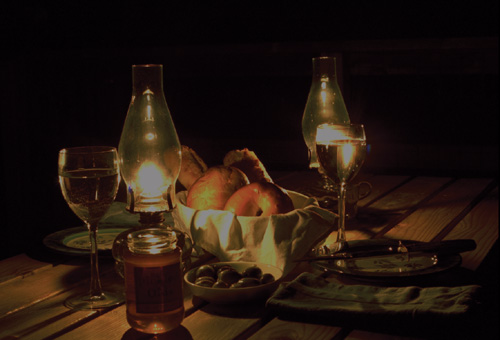

图
普通文件格式导致明亮的像素值被不可逆地裁剪，使得明亮的区域变灰，并且细节丢失，得到极不自然的效果

而如果原始图像存储在高动态范围文件格式中，如OpenEXR，保存明亮的像素值，而不是把他们裁剪到1.0，然后把图像变暗，就可以产生依旧自然的效果。如下图。

图
上述变暗的图的高动态范围版本。在明亮的区域中显示出了其他细节，颜色看起来很自然

文章随后还讲到了OpenEXR的文件结构、数据压缩、使用、线性像素值、创建和使用HDR图像相关的内容。

## 【本章配套源代码汇总表】

Example 26-1 读取OpenEXR图像文件（Reading an OpenEXR Image File）

Example 26-2 将图像绑定到纹理（Binding an Image to a Texture）

Example 26-3 合成两个图像并写入OpenEXR文件（Compositing Two Images and Writing
an OpenEXR File）

Example 26-4 合成一个Pbuffer（Compositing into a Pbuffer）

Example 26-5 Cg Shader进行“Over”操作（Cg Shader for an "Over" Operation）

Example 26-6 Cg Shader进行“In”操作（Cg Shader for an "In" Operation）

Example 26-7 Cg Shader进行“Out”操作（Cg Shader for an "Out" Operation）

Example 26-8. 伽马校正一张图像并显示（Gamma-Correcting an Image for Display）

Example 26-9 调整调整图像的曝光（Adjusting an Image's Exposure）

Example 26-10 使用查找表来模拟摄影胶片的外观（Using a Lookup Table to Simulate
the Look of Photographic Film）

## 【关键词提炼】

高动态范围（High-Dynamic-Range , HDR）

高动态范围图像（High-Dynamic-Range Image，HDRI）

OpenEXR

# Reference

[1]
<https://cgcookie.deviantart.com/art/Subsurface-Scattering-Tutorial-658412208>

[2] <https://zhuanlan.zhihu.com/p/21247702?refer=graphics>

[3] <https://renderman.pixar.com/resources/RenderMan_20/subsurface.html>

[4] <https://www.davidmiranda.me/unity-skin/>

[5] <https://www.youtube.com/watch?v=OQ3D0Q5BlOs>

[6] <https://www.geforce.com/games-applications/pc-applications/a-new-dawn>

[7]
<https://www.shroudoftheavatar.com/forum/index.php?threads/on-video-game-graphics.54435/>

[8]
<https://support.solidangle.com/display/AFMUG/Guide+to+Rendering+Realistic+Skin>

[9] <http://forums.cgsociety.org/showthread.php?p=8310370>

[10]
<https://www.dualshockers.com/uncharted-4-dev-explains-how-drakes-incredible-shaders-were-made-shows-direct-feed-wip-screenshots/>

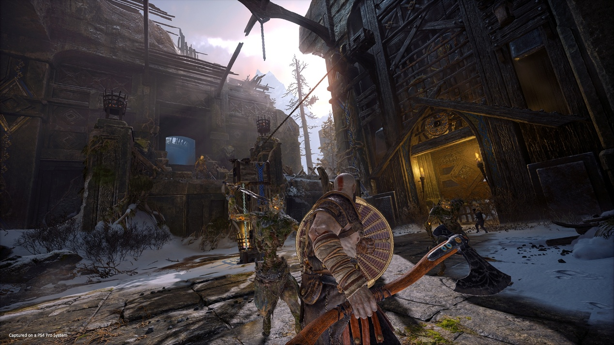

全文完。

With best wishes.
