# 【GPU精粹与Shader编程】 《GPU Gems 2》全书核心内容提炼总结 · 上篇

本文的知乎专栏版本：
https://zhuanlan.zhihu.com/p/38411575

 

# 目录 · 本文核心内容Highlight

<!-- TOC -->

- [【GPU精粹与Shader编程】 《GPU Gems 2》全书核心内容提炼总结 · 上篇](#gpu精粹与shader编程-gpu-gems-2全书核心内容提炼总结-·-上篇)
- [目录 · 本文核心内容Highlight](#目录-·-本文核心内容highlight)
- [前言](#前言)
- [I、核心章节提炼篇](#i核心章节提炼篇)
- [一、实现照片级真实感的虚拟植物（Toward Photorealism in Virtual Botany）](#一实现照片级真实感的虚拟植物toward-photorealism-in-virtual-botany)
    - [【内容概览】](#内容概览)
    - [【核心内容提炼】](#核心内容提炼)
        - [1.1 场景管理（Scene Management）](#11-场景管理scene-management)
            - [1.1.1 种植栅格（The Planting Grid）](#111-种植栅格the-planting-grid)
            - [1.1.2 种植策略（Planting Strategy）](#112-种植策略planting-strategy)
            - [1.1.3 实时优化（Real-Time Optimization）](#113-实时优化real-time-optimization)
        - [1.2 草地层（The Grass Layer）](#12-草地层the-grass-layer)
            - [1.2.1 通过溶解模拟Alpha透明（Simulating Alpha Transparency via Dissolve）](#121-通过溶解模拟alpha透明simulating-alpha-transparency-via-dissolve)
            - [1.2.2 变化](#122-变化)
            - [1.2.3 光照](#123-光照)
            - [1.2.4 风](#124-风)
        - [1.3 地面杂物层（The Ground Clutter Layer）](#13-地面杂物层the-ground-clutter-layer)
        - [1.4 树和灌木层（The Tree and Shrub Layers）](#14-树和灌木层the-tree-and-shrub-layers)
        - [1.5 阴影（Shadowing）](#15-阴影shadowing)
        - [1.6 后处理（Post-Processing）](#16-后处理post-processing)
        - [1.7 业界领先的植物渲染解决方案SpeedTree](#17-业界领先的植物渲染解决方案speedtree)
    - [【核心要点总结】](#核心要点总结)
    - [【关键词提炼】](#关键词提炼)
- [二、GPU通用计算：流式编程与存储体系（General-Purpose Computation on GPU）](#二gpu通用计算流式编程与存储体系general-purpose-computation-on-gpu)
    - [【内容概览】](#内容概览-1)
    - [【核心内容提炼】](#核心内容提炼-1)
        - [2.1 流式计算（Stream Computation）](#21-流式计算stream-computation)
            - [2.2.1 流式编程模型](#221-流式编程模型)
        - [2.2 GPU存储器模型](#22-gpu存储器模型)
            - [2.2.1 存储器体系结构](#221-存储器体系结构)
            - [2.3.2 GPU与CPU元素类比](#232-gpu与cpu元素类比)
            - [2.2.3 GPU流类型](#223-gpu流类型)
                - [1.顶点流（Vertex Streams）](#1顶点流vertex-streams)
                - [2.片段流（Fragment Streams）](#2片段流fragment-streams)
                - [3.帧缓冲区流（Frame-Buffer Streams）](#3帧缓冲区流frame-buffer-streams)
                - [4.纹理流（Texture Streams）](#4纹理流texture-streams)
            - [2.2.4 GPU核的存储器访问](#224-gpu核的存储器访问)
- [II、次核心章节提炼篇](#ii次核心章节提炼篇)
- [三、使用基于GPU几何体裁剪图的地形渲染（Terrain Rendering Using GPU-Based Geometry Clipmaps）](#三使用基于gpu几何体裁剪图的地形渲染terrain-rendering-using-gpu-based-geometry-clipmaps)
    - [【章节概览】](#章节概览)
    - [【核心要点】](#核心要点)
    - [【关键词】](#关键词)
- [四、几何体实例化的内幕（Inside Geometry Instancing）](#四几何体实例化的内幕inside-geometry-instancing)
    - [【章节概览】](#章节概览-1)
    - [【核心要点】](#核心要点-1)
    - [【关键词】](#关键词-1)
- [五、分段缓冲（Segment Buffering）](#五分段缓冲segment-buffering)
    - [【章节概览】](#章节概览-2)
    - [【核心要点】](#核心要点-2)
    - [【关键词】](#关键词-2)
- [六、用多流来优化资源管理（Optimizing Resource Management with Multistreaming）](#六用多流来优化资源管理optimizing-resource-management-with-multistreaming)
    - [【章节概览】](#章节概览-3)
    - [【核心要点】](#核心要点-3)
    - [【关键词】](#关键词-3)
- [七、让硬件遮挡查询发挥作用（Hardware Occlusion Queries Made Useful）](#七让硬件遮挡查询发挥作用hardware-occlusion-queries-made-useful)
    - [【章节概览】](#章节概览-4)
    - [【核心要点】](#核心要点-4)
    - [【关键词】](#关键词-4)
- [八、带位移映射的细分表面自适应镶嵌（Adaptive Tessellation of Subdivision Surfaces with Displacement Mapping）](#八带位移映射的细分表面自适应镶嵌adaptive-tessellation-of-subdivision-surfaces-with-displacement-mapping)
    - [【章节概览】](#章节概览-5)
    - [【核心要点】](#核心要点-5)
    - [【关键词】](#关键词-5)
- [九、使用距离函数的逐像素位移贴图（Per-Pixel Displacement Mapping with Distance Functions）](#九使用距离函数的逐像素位移贴图per-pixel-displacement-mapping-with-distance-functions)
    - [【章节概览】](#章节概览-6)
    - [【核心要点】](#核心要点-6)
    - [【关键词】](#关键词-6)
- [十、S.T.A.L.K.E.R.中的延迟着色（Deferred Shading in S.T.A.L.K.E.R.）](#十stalker中的延迟着色deferred-shading-in-stalker)
    - [【章节概览】](#章节概览-7)
    - [【核心要点】](#核心要点-7)
    - [【关键词】](#关键词-7)
- [十一、动态辐照度环境映射实时计算（Real-Time Computation of Dynamic Irradiance Environment Maps）](#十一动态辐照度环境映射实时计算real-time-computation-of-dynamic-irradiance-environment-maps)
    - [【章节概览】](#章节概览-8)
    - [【核心要点】](#核心要点-8)
    - [【关键词】](#关键词-8)
- [十二、近似的双向纹理函数（Approximate Bidirectional Texture Functions）](#十二近似的双向纹理函数approximate-bidirectional-texture-functions)
    - [【章节概览】](#章节概览-9)
    - [【核心要点】](#核心要点-9)
    - [【关键词】](#关键词-9)
- [十三、基于贴面的纹理映射（Tile-Based Texture Mapping）](#十三基于贴面的纹理映射tile-based-texture-mapping)
    - [【章节概览】](#章节概览-10)
    - [【核心要点】](#核心要点-10)
    - [【关键词】](#关键词-10)
- [十四、动态环境光遮蔽与间接光照（Dynamic Ambient Occlusion and Indirect Lighting）](#十四动态环境光遮蔽与间接光照dynamic-ambient-occlusion-and-indirect-lighting)
    - [【章节概览】](#章节概览-11)
    - [【核心要点】](#核心要点-11)
    - [【关键词】](#关键词-11)
- [十五、精确的大气散射（Accurate Atmospheric Scattering）](#十五精确的大气散射accurate-atmospheric-scattering)
    - [【章节概览】](#章节概览-12)
    - [【核心要点】](#核心要点-12)
    - [【关键词】](#关键词-12)
- [附录：配套资源与源代码下载](#附录配套资源与源代码下载)

<!-- /TOC -->

# 前言

《GPU Gems 2》这本书除了丰富的内容之外，还有两个特点。

- 虚幻引擎之父Tim Sweeney为《GPU Gems 2》作序。作为Epic Games的创始人，Unreal Engine早期主要开发者，Tim也在序中展示了《GPU Gems 2》出版伊始（2005年3月）时开发完成的Unreal Engine 3。UE3可谓是开创了一个时代。随后包括《新鬼泣》在内的100+款大作（2005年~2015年），都是基于UE3开发。具体列表可见：https://en.wikipedia.org/wiki/List_of_Unreal_Engine_games

- 《GPU Gems 2》的中文版是龚大2005年开始翻译的，距今已13年。13年前龚大就已经是图形学业界一线大牛，实在是让人佩服不已。

另外，虽然本书出版于2005年，但可以不夸张地说，书中介绍的很多方法技巧trick，哪怕是放到现在，依然非常值得学习和借鉴。

ok，篇幅原因，开场话就不多说了，放一张本文的核心内容，真实感植物渲染的图，我们就直接开始正题。
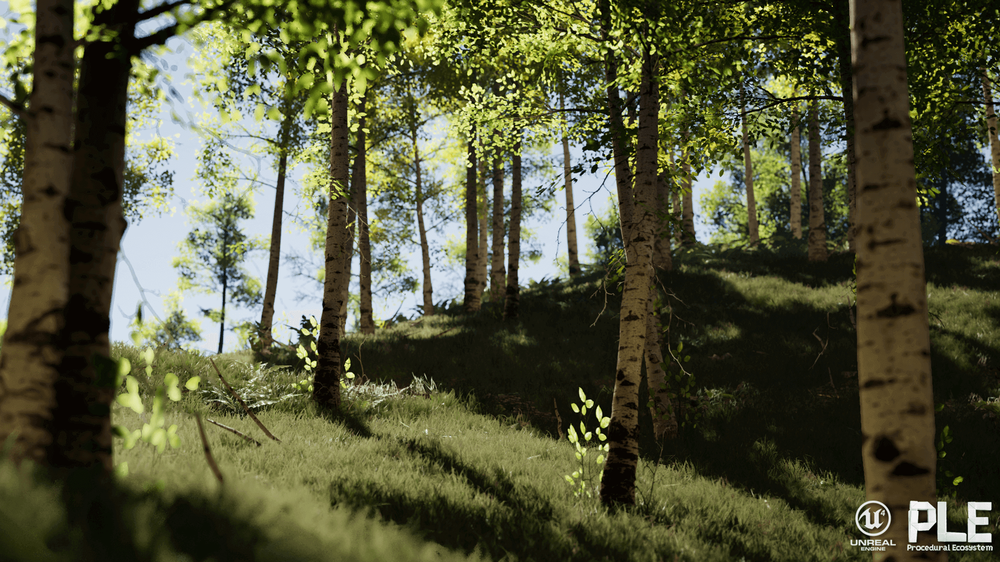

图 真实感植物渲染 @UE4

 

# I、核心章节提炼篇

 

# 一、实现照片级真实感的虚拟植物（Toward Photorealism in Virtual Botany）

## 【内容概览】

众所周知，植物的渲染需要很多的视觉深度和细节才能令人信服。

本章即关于渲染逼真自然场景的技术，描述了对实时游戏引擎友好的、用于渲染更真实的自然场景的策略。讲述了在不需要大量CPU或GPU占用的前提下渲染出包含大量植物和树组成的绿色植物场景。

内容安排方面，这章从管理大型户外环境场景数据这一基础开始描述。然后，提供一些细节，例如关于如何最大化GPU吞吐量，以便可以看到密集的草丛。接下来扩展这些技术，增加地面杂物和大型植物，如树，将阴影和环境影响组合进去。

一些真实感植物渲染的效果图：

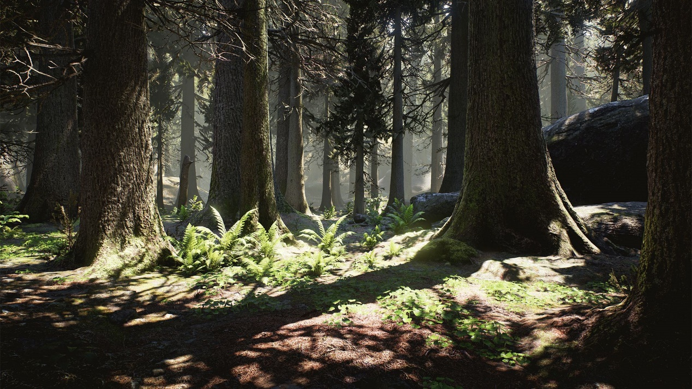

图 真实感植物渲染 @UE4

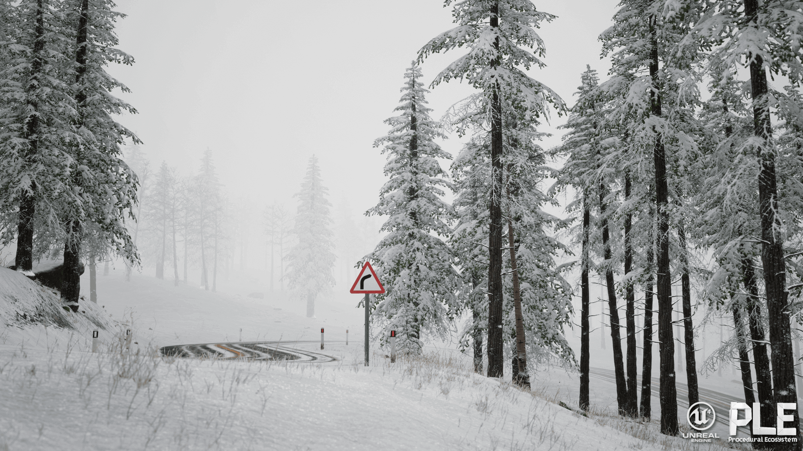

图 真实感植物渲染 @UE4

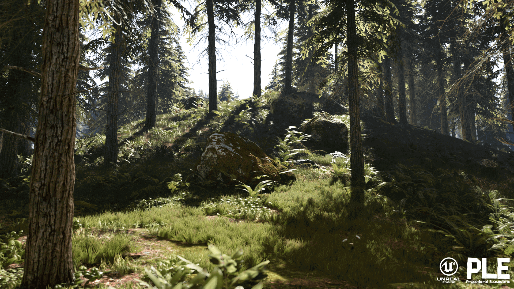

图 真实感植物渲染@UE4

## 【核心内容提炼】

### 1.1 场景管理（Scene Management）

任何3D游戏引擎都应该有环境相关渲染技术的管理和组织。

游戏引擎必须管理其渲染技术，以适合于它们希望看到的环境范围。以自然场景为主的游戏由上千棵树，灌木和可能上百万片草叶组成。直接分开渲染会出现数据管理问题，只有解决了这一问题才能以交互的帧率实时渲染。

我们的目标是在一个逼真的室外场景中大范围地移动游戏相机，而不需要在任务管理上花费过多的存储器资源。

#### 1.1.1 种植栅格（The Planting Grid）

场景管理方面，首先是使用了虚拟栅格的思路。

我们在相机周围建立一个世界空间固定的栅格，来管理每一层的植物和其他自然物体的种植数据。每个栅格单元包含渲染它所在物理空间层的所有数据。特别是，单元数据结构存储了对应的顶点、索引缓冲区和材质信息来再现需要绘制的内容。

对植物的每个层，建立相机到层的距离，层需要用它来产生视觉效果，这决定了虚拟栅格的大小。相机移动，虚拟栅格也随之移动。当一个栅格单元不再在虚拟栅格中时，丢弃它，并在需要维护完整栅格结构的地方添加新的单元。在添加每个单元格时，用一种种植算法把渲染所需的数据填充到层。如下图。

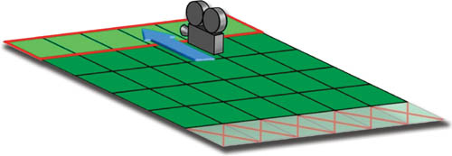

图 一个虚拟栅格

图注：每层有一个世界空间对齐的固定大小的栅格。深绿的单元表现为活动单元。当相机向前移动时，丢弃标记为X的单元，添加新的单元（显示为亮绿色）以维持虚拟栅格的大小，实现过程中有用的改进是使用栅格单元池且循环使用，因为当一个旧单元被丢弃时，总会增加一个新单元。

#### 1.1.2 种植策略（Planting Strategy）

对于充满自然物体的每个单元，需要在地面上选择要放置物体的适当位置。采用试探的方法根据被放置对象的类型来选择这些点。通常，需要的密度随机选点，然后看地面上的对应点是否适合于要种植的东西。而地面多边形的材质决定了一个层是否适用。

最显然的方式是在单元体中随机发射光线，直达地面，每当击中一个多边形，检查它是否适合种植（判断：草能种在这里吗？斜度会不会太大？），如果成功，那么就得到了一个种植点，继续这个过程，直到到达合适的密度。

这种方法不能处理重叠地形，且在少数栅格单元中，可能会花费过多的CPU时间。

比较好的方法是，选择所有与单元相交的多边形，丢弃所有不合适种植的多边形，然后扫描并转换它们来寻找合适的种植点。这与渲染管线中的光栅化一个多边形类似。

#### 1.1.3 实时优化（Real-Time Optimization）

实时优化种植策略的方法包括，选择一个栅格单元中的多边形可以通过使用AABB树或类似的数据结构来快速完成。而由于相机的连续运动，许多单元可能要突然种植，所以它也可以高效地让这个任务排队，使任务在每帧中只占用相对固定的CPU资源。而通过扩大栅格，可以确保在单元的内容进入视野之前，所有的种植就已完成。

### 1.2 草地层（The Grass Layer）

实时渲染出无边的草地需要GPU技术和算法的细心平衡，主要的挑战是在相对低的计算和渲染开销下产生高度复杂的视觉外观。

这章的这一节中介绍了一种和[ Pelzer 2004
]“渲染无数波动的草叶”相似的技术，且这章的技术以更低的GPU和CPU负载产生更高质量和更稳定的结果。

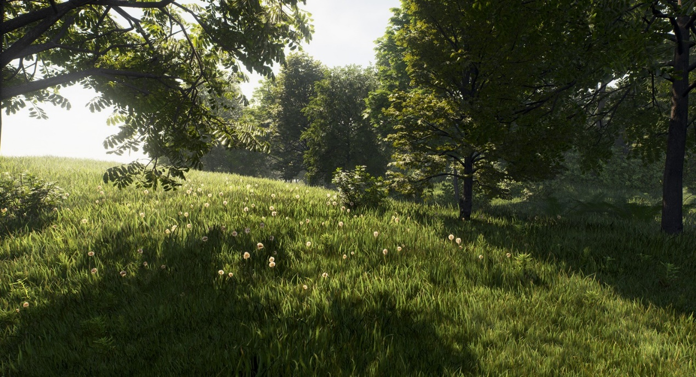

图 真实感草地渲染

首先，需要保证批次的最大化。该技术的目标是如何用相对较少的渲染API调用来绘制出尽可能多的草地，合理的方式是基于公告板。但其实更好的方式是在一次绘制调用中渲染尽可能多的内容（即一次draw
call渲染多个公告板）。

为实现这个目的，草的每一层（即使用相同纹理和其他参数的所有草）的每个栅格单元由一个顶点和一个索引缓冲区对表现。如下图。

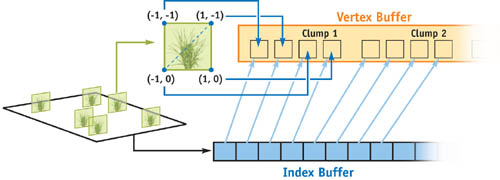

图：绘制每个栅格的单元结构

对种植的每个草丛（或公告板），将其位置写入顶点缓冲区并更新对应的索引缓冲区。每个公告板需要4个顶点和6个索引。对每个顶点，将位置设置为已经种植草丛的点。

一旦顶点缓冲区建立并发送到显存，就可以用单次调用画出每个栅格单元的植物。

与Pelzer的方法不同的是，这里使用面向相机的公告板代替每丛3个方形，而且其方法没有进行屏幕对齐。面向屏幕的公告板在所有的视角下（即便向下看）创建一个固定的深度。而相机越是由上往下看草丛，3个方形丛的方法就越会失效。所以本文提到的方法，更加灵活，适用更多相机角度的情况。

#### 1.2.1 通过溶解模拟Alpha透明（Simulating Alpha Transparency via Dissolve）

在渲染草的时候，想要使用透明来改善视觉混合和在接近虚拟栅格边界时的淡出。然而，基于Alpha的透明并不理想，因为它需要排序且速度很慢。虽然可以利用草较为杂乱的性质最小化一些排序技术，但实际上可以完全忽略这种做法。

为此，采取溶解效应（dissolve effect），也称纱门效应（screen-door
effect）的方法，代替Alpha混合来模拟透明。首先，用一个噪音纹理调制草纹理的Alpha通道，然后使用Alpha测试从渲染中去除像素，通过从0到1调节Alpha测试数值，纹理表现出溶解的现象。这一过程如下图所示。

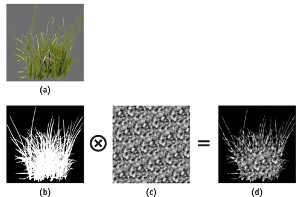

图 草纹理的构成

（a）漫反射纹理； （b）美工创建的alpha通道； （c）Perlin噪音纹理；
（d）Perlin噪音与Alpha相乘的结果。这可以在像素着色器，或固定的Alpha测试值产生淡出。

这项技术的有点是Alpha测试的速度快而且与顺序无关。我们不再需要排序，草依然可以在远处淡出。虽然溶解在正常的情况下看起来不像真实的Alpha透明那么好，但可以利用自然的分形属性来完全掩饰任何溶解技术的视觉失真。

而实验表明，使用Perlin噪音纹理（Perlin
2002）代替随机的噪音纹理，则溶解效应与环境的适配程度几乎与Alpha透明一样好。

#### 1.2.2 变化

为增加真实感，需引入一些变化。一种方式是使用多种草的图像，但分批方法限制我们在每个绘制调用中只能用一张纹理。好在可以使用大纹理，把多种草排布在上面，在建立顶点的时候，可以调整UV坐标以旋转纹理的不同子区域（即可以建立一个纹理图集）。

每个公告板也能带有颜色信息。如果在种植时也为每个草丛建立一种颜色，那么对渲染灰度纹理或在顶点着色器中做细微的颜色偏移非常有用。Perlin噪声在这里也可以使用，而且很容易，例如，草可以从健康的颜色过渡到垂死的褐色染色，以获得宽广的颜色变化并减少草的重复性。

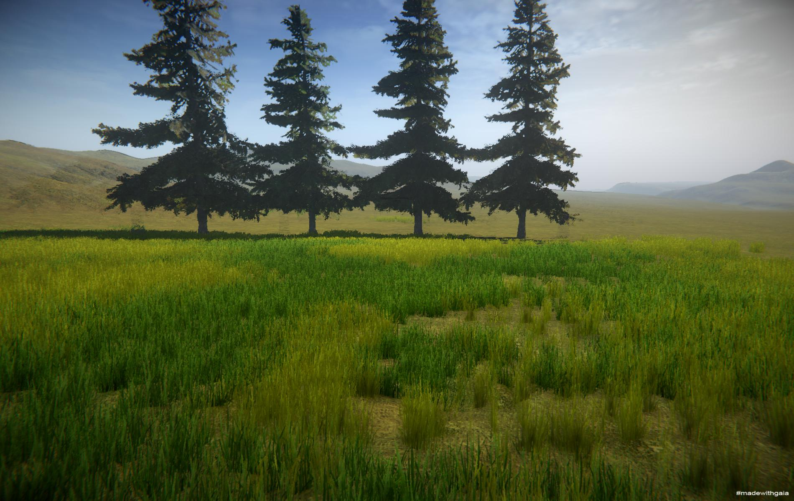

图 使用RGB信息来增加草地的真实感 @ GeNa @Unity5

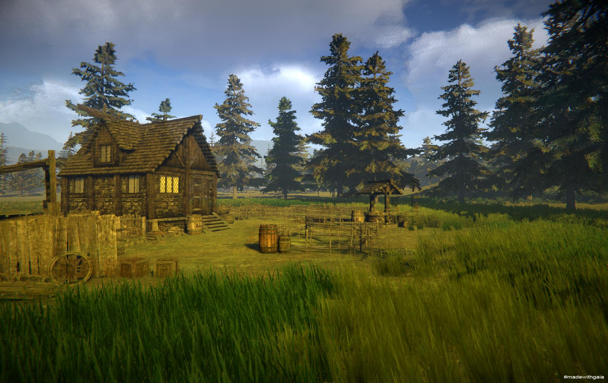

图 使用RGB信息来增加草地的真实 @ GeNa @Unity5

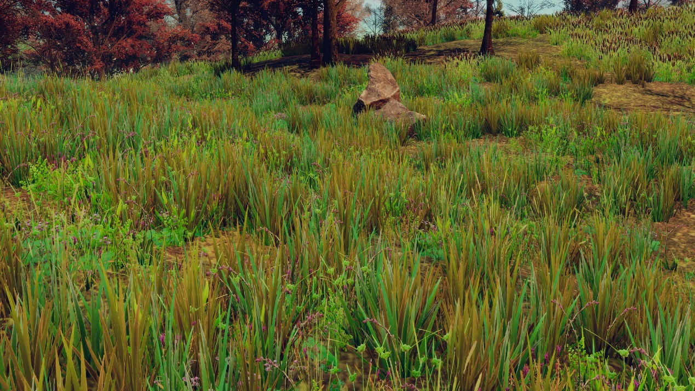

图 使用RGB信息来增加草地的真实感 @ GAIA @Unity 5

【注：每颗草的顶点中都包含RGB的信息。在此场景中，颜色值来自Perlin噪声函数，模拟了比较绿的草，并修补了不太健康的褐色】

#### 1.2.3 光照

光照在草的外观上扮演了重要的角色。对于公告板草，要确保草和下面的地面一样受光。而地面自然起伏，并因此获得了不同角度的光照。我们需要通过减弱草的亮度来模拟这点，因此，需要知道草所在的地面角度，一个简单方法是在顶点定义中通过另一个向量传递这一信息。

在种植的时候，确定正在种植的草的多边形法线并把它带入公告板定义中。通过这种方式，顶点着色器就可以进行和草下多边形一样的光照计算、从而减弱它的彩色。在多丘陵的地形上，这会导致草和地面一样也有细微的到光的角度信息变化。

遗憾的是，这种方式导致草有一面一面的着色现象，即使地面的多边形是几乎平滑着色（如Gouraud着色）。为了避免这个问题，在种植处理期间必须平滑地插值通过顶点着色器的法线。

而如果太阳的角度是动态的，可以假设地面法线都大致向上，然后基于此法线和光的角度来计算光照。这样，就不一定要将地面的多边形法线带入顶点的定义和后续计算。这是一个画质的权衡，但这种方式对于应用程序来说已经完全足够。

#### 1.2.4 风

当风吹过，草地泛起涟漪，草变得鲜活起来了。

通过每一帧偏移草方形顶部的两个顶点，可以使方形在风中摇摆。可以使用一个正弦近似的和计算这个偏移，类似计算水表面的波动[Finch
2004]。这个技巧是在顶点定义中带一个混合权重，草方形的顶部两个顶点被设为1，底部两个顶点为0，然后把这一数值乘以风的缩放系数，底部的顶点仍然牢牢地依附在地上。

对于另外的变化，可以在种植期间略微随机变换顶部的两个顶点权重。这模拟了草的软硬区别。

在风中摇曳的时候，草叶时常改变其对光的方向，导致它们变亮或变暗，我们可以使用专门的风项来增加光照变化，以模拟这一现象。这极大地改善了风的视觉效果，甚至也能改善远处草丛的效果，虽然那里的物理摇摆变形以及变成子像素大小了。

然而，不允许风系数使草方形变形太多，否则产生的形变将会显得滑稽而不真实。谨记细微是关键。

### 1.3 地面杂物层（The Ground Clutter Layer）

地面不仅只有随风摆动的草，细枝、小植物、岩石和其他碎片共同组成了具有自然复杂性的效果。其中，一些杂物和草一样可以当做公告板表现。

而但当我们混入混合各种几何对象物体时，环境的复杂度也就增加了。

和处理草公告板的方法一样，对于每个栅格元素，可以把3D网格数据解开到顶点和索引缓冲区中，以使它们可以在单次调用中绘制。我们必须把地面杂物分组为使用相同的纹理和着色器的层。可以像选择种植点那样，应用随机变换来改变它们的大小和方向，但是变换必须依据网格的特性，例如岩石是可以颠倒过来的，但是灌木颠倒就不行了。对于另外的变化，如同处理草多边形一样，可以通过传递RGB信息来给物体染色。

另外，用于处理顺序无关透明特效的溶解技术在3D网格和公告板上工作起来完全一样。把perlin噪声纹理调制到纹理的alpha通道，并使用到相机的衰减距离，然后alpha测试溶解3D网格，类似处理草公告板。

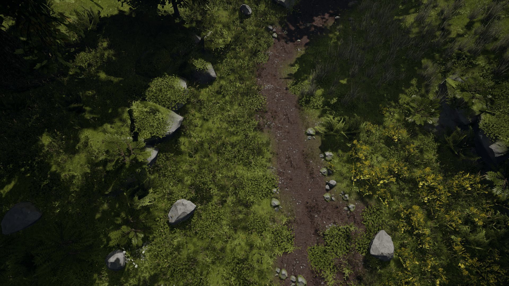

图 使用地面杂物来增加密集的细节\@UE4 \@Landscape Auto Material

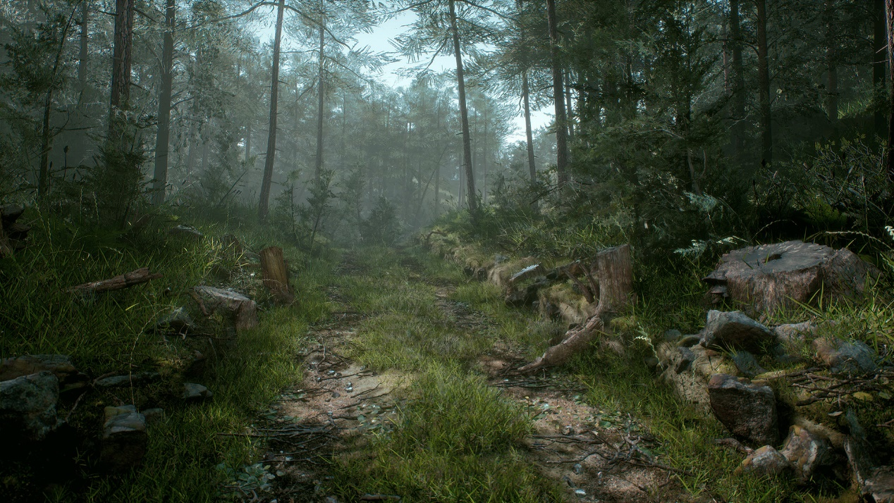

图 使用地面杂物来增加密集的细节\@UE4

### 1.4 树和灌木层（The Tree and Shrub Layers）

树的树干和主要的树枝应该建模成3D网格。次级树枝可以用公告板来模拟，以增加视觉的复杂性。因为树的枝叶繁茂，所以可以用类似于草的技术，用面向相机的公告板建立树叶丛。

因为树需要在长距离上维护它们的基本体积，但高细节渲染又很昂贵，所以必须使用层次细节（LOD）策略。当树退到一定距离后，可以使用较大但较少的叶丛公告板。对于较大的公告板，使用带有较多但较小树叶的纹理。

而在一个适当的距离之外，最后想要用一个面向相机的公告板表现一颗树。当树的轮廓不对称时，会相对困难。为了避免这个问题，可以为公告板产生树在各种不同角度的图片，然后根据树和相机的角度混合它们。

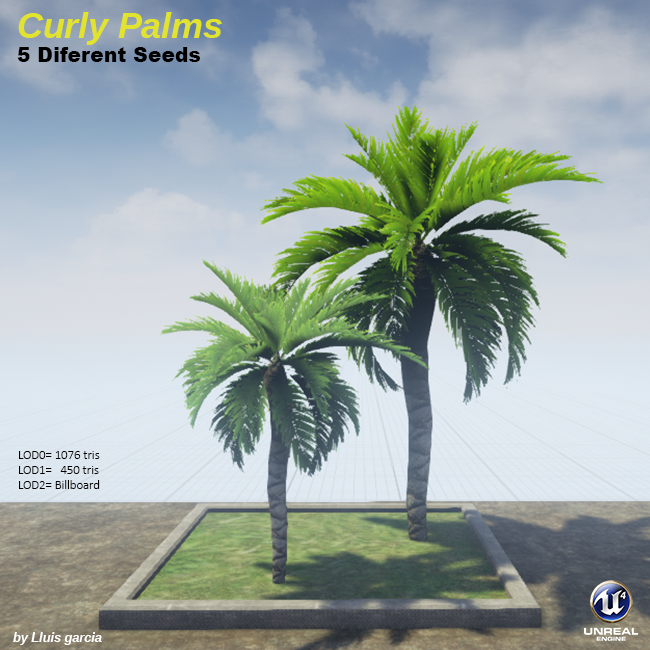

图 树的多级LOD与公告板 \@UE4

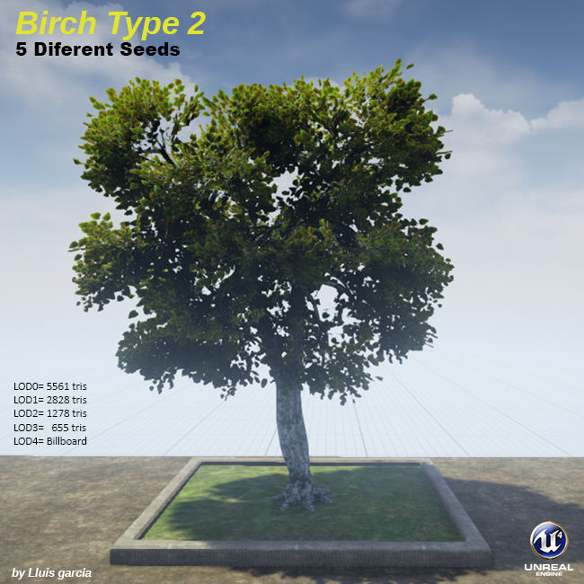

图 树的多级LOD与公告板 \@UE4

灌木和叶片可作为另一种类型的树，和普通的树使用相同的技术。例如，一个茂盛的灌木可以看做一棵树干很小，或者不存在树干的树。此外，我们可以翻转一棵树，去掉树叶，并获得一个精心制作的暴露的根系，去嫁接上一棵正常的树。

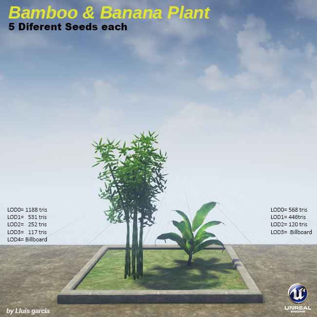

图 灌木LOD与billboard \@UE4

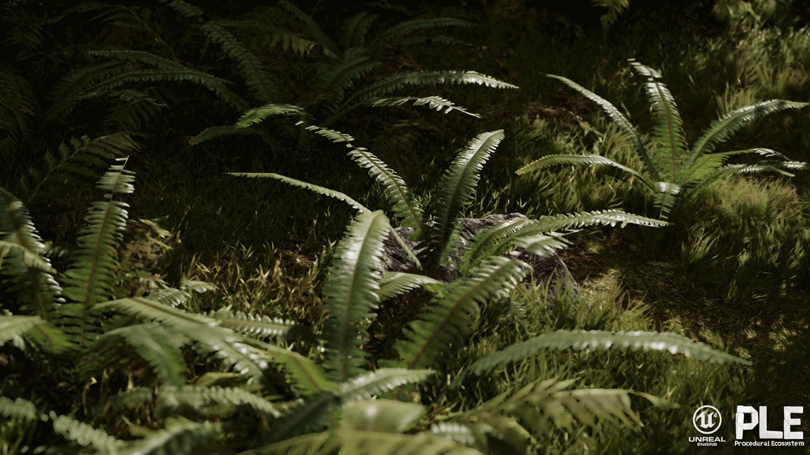

图 灌木的渲染 \@UE4

### 1.5 阴影（Shadowing）

因为传递了草和地面杂物的RGB颜色，所以可以为阴影的区域选择较暗的颜色。这需要知道植物是否在阴影中。为了在自然环境中有效，这种阴影只需要非常接近正确的阴影即可。

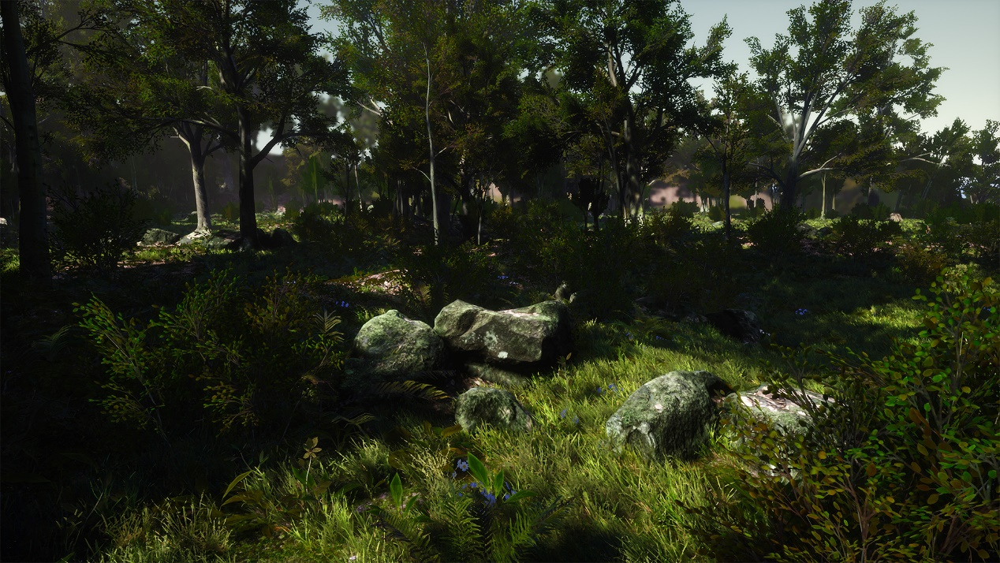

图 草在树产生的阴影中 \@UE4

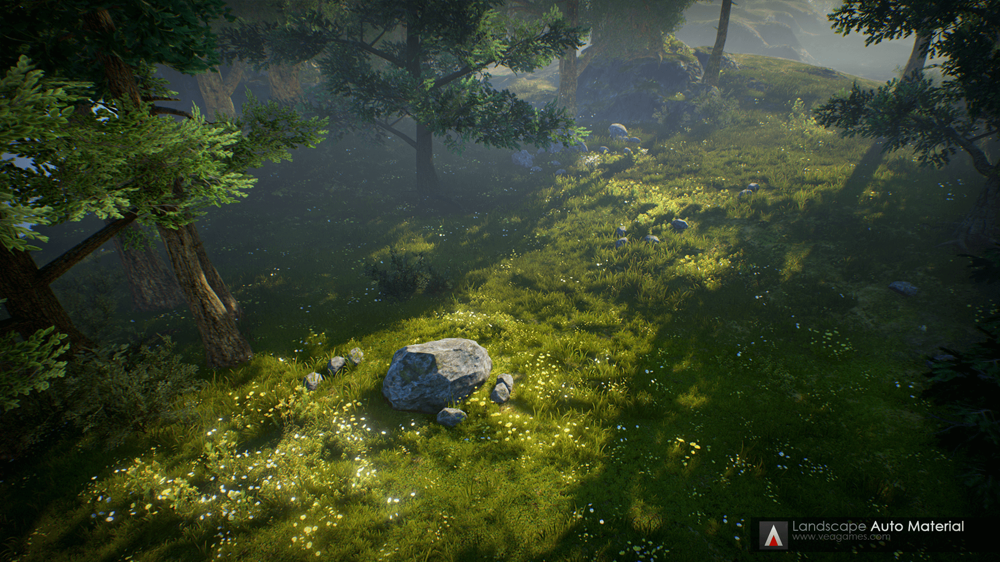

图 草在树产生的阴影中 \@UE4 \@Landscape Auto Material

一种方法是在种植时确定阴影。只需从植物位置向主要光源（太阳）投射一道阴影试探光线（shadow
feeler
ray），看看是否有相交。如果有，根据周围场景的环境颜色调整RGB值。记住投射阴影试探光线只考虑是否有相交（不只是最近的），所以其可以比标准的碰撞光线投射高效得多。

软阴影（Soft shadows）,在上下文中叫抗锯齿阴影（antialiased
shadows）其实更合适，可以通过投射一个以上的阴影试探（shadow
feeler）来实现。下图演示了这一方法，通过细微地偏移每道光线的开始位置，在一个给定点上可以进行3\~5次光线投射。击中的部分用来在漫反射太阳光的和场景的环境光之间减弱光照。偏移越宽，阴影就越模糊。

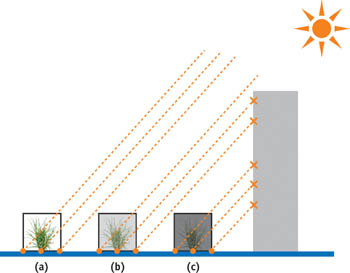

图 使用光线投射的可见性测试

图注：从种植点向光源（在这个例子中是方向光）投射阴影试探光线。几乎发生的任何碰撞都可以表明这个点是在阴影中。为得到一个模糊阴影，需要投射另外的偏移阴影试探光线，并使用击中的部分决定多少环境光的颜色。需要注意的是，不要让阴影试探光线立刻与种植点的地平面相交吗，否则这次试探就没有意义了。

这些阴影不是动态的，但是对于移动缓慢的光源来说，可以很快地在间隔中重新计算（如太阳的移动）。一般来说，它们提供了充分的视觉信息，把风景变得更栩栩如生。

当投过树的大部分时，可以使用树叶茂密部分的球体或树干的圆柱体碰撞。对于树叶茂密部分，使用一个基于树叶茂密的随机函数来确定光线是否相交。虽然这种阴影技术是粗糙的，但和正确的解决方案没有明显的差别。

如果种植是作为离线处理预计算的，那么可以极大地提高阴影逼真度。一种可能比阴影试探光线方法更好的方法是获取光照图（light
map）的纹素来确定阴影。如果光照图不在系统内存中，在实时处理方面可能有困难。

### 1.6 后处理（Post-Processing）

后处理方面，辉光（glow）和泛光（bloom
），以及用高斯（Gaussian）模糊实现自然柔和的效果，都是比较合适进行照片级真实感植物渲染的后处理效果。

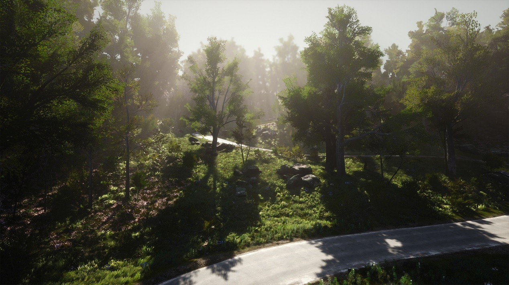

图 使用了多种后处理效果的渲染图 @UE4

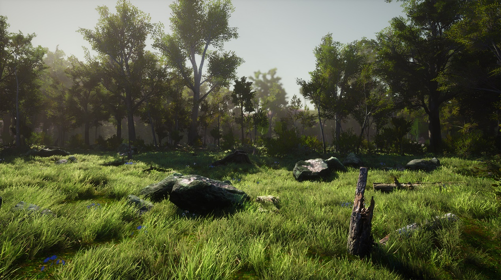

图 使用了多种后处理效果的渲染图 @UE4

图 使用了多种后处理效果的渲染图 @UE4

### 1.7 业界领先的植物渲染解决方案SpeedTree

也需要提到的是，SpeedTree是很优秀的树与灌木层的中间件，是植物渲染方面业界领先的解决方案。自2008年以来的各种一线3A游戏，如《蝙蝠侠》、《使命召唤》、《神秘海域》系列，包括近期的《彩虹六号》、《孤岛惊魂5》、《地平线：黎明》、《絶地求生》、《最终幻想15》等游戏，都使用了SpeedTree作为树木植物相关渲染的解决方案。

电影方面，包括最近的《复仇者联盟3》、《黑豹》在内的好莱坞大片，以及早一些的《速度与激情8》《魔兽》《星球大战：原力觉醒》等大片，也都使用了SpeedTree作为树木植物相关渲染的解决方案。

SpeedTree官网：https://store.speedtree.com/

图 SpeedTree · CINEMA的宣传图

图 SpeedTree · GAME的宣传图

图 电影《星球大战 原力觉醒》中的speed tree @https://www.speedtree.com/starwars.php

## 【核心要点总结】

【场景管理方面】

采用虚拟栅格的思路，实时优化种植的策略是使用AABB树类似的数据结构来选择一个栅格单元中的多边形。

【草地渲染方面】

基于公告板进行渲染，保证渲染批次的最大化、通过溶解模拟Alpha透明。

调整UV坐标以旋转纹理、使用RGB信息等方法来减少重复，增加真实感

草地的光照：多边形法线并把它带入公告板定义中，参与光照计算。滑地插值通过顶点着色器的法线，来解决草有一面一面的着色的现象。也可以假设地面法线都大致向上，然后基于此法线和光的角度来计算光照。

草地与风的交互：使用一个正弦近似的和计算这个偏移，类似计算水表面的波动[Finch
2004]，也可以使用专门的风项来模拟草地因风而出现的光照变化。

【地面杂物层方面】

3D网格结合公告板的渲染、通过溶解模拟Alpha透明。

【阴影方面】

基于阴影试探光线（shadow feeler
ray）、基于树叶茂密的随机函数来确定光线是否相交、基于光照图（light
map）的纹素来确定阴影。

【树与灌木层】

树干和主要树枝建模成3D网格，次级树枝用公告板。LOD。多个角度的公告板混合。

【后处理】

辉光（glow）、泛光（bloom ）、高斯（Gaussian）模糊

最后再上几张渲染图，都来自虚幻4引擎的渲染：

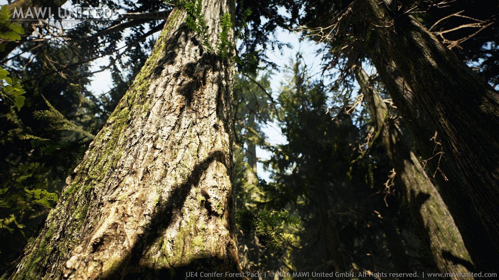

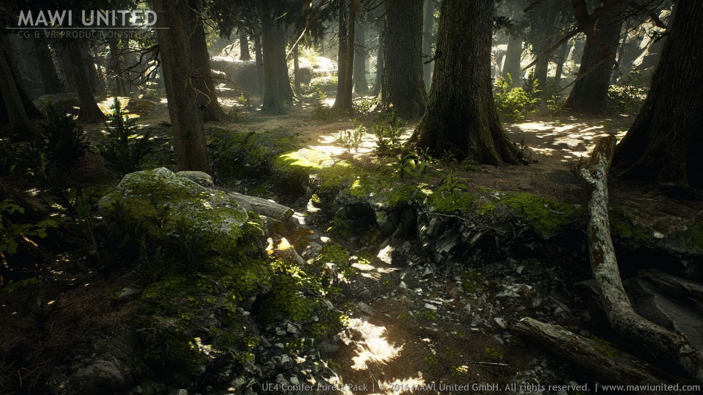

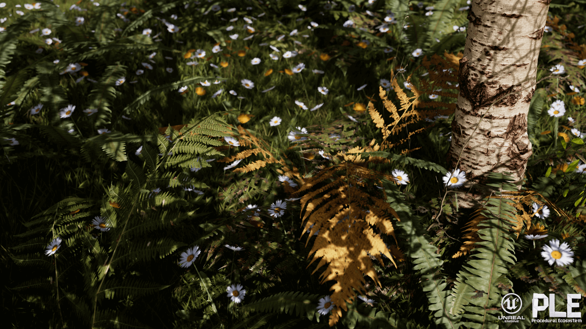

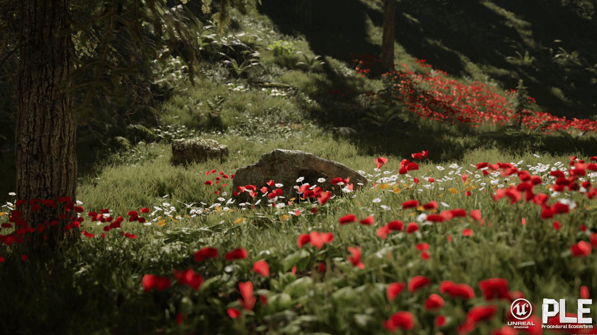

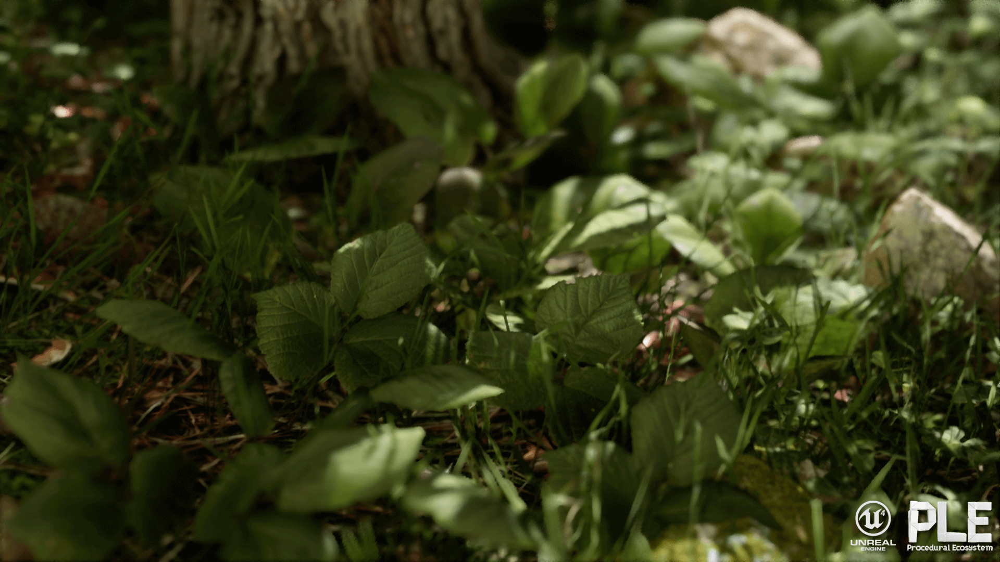

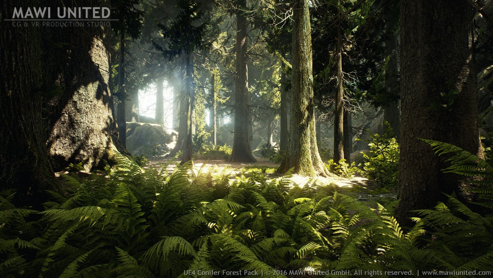

## 【关键词提炼】

真实感植物渲染（Photorealistic Botany Rendering）

场景管理（Scene Management）

 

# 二、GPU通用计算：流式编程与存储体系（General-Purpose Computation on GPU）

## 【内容概览】

本节是原书中第IV部分”Part IV: General-Purpose Computation on GPUS: A
Primer”的精华提炼版。

## 【核心内容提炼】

### 2.1 流式计算（Stream Computation）

首先，CPU不适合用于许多高性能应用程序的部分原因是其采用了串行编程模型(serial
programming
model)，无法在应用程序中利用并行性（parallelism）和通信模式（communication
patterns）。而GPU采用了流式编程模型（stream programming
model），本节中将讲到该模式允许高效计算和通信的方式来构造程序[Kapasi et al.
2003]，且它是今天GPU编程的基础。

#### 2.2.1 流式编程模型

在流式编程模型中，所有数据都表现为流（stream）。我们把流定义为具有相同数据类型的数据有序集。数据类型可以是简单的（整数或浮点数流）或复杂的（点或三角形或变换矩阵流）。流可以是任意长度，如果流很长（流中有上百或者更多的元素），那么流上的操作效率将很高。流上允许的操作包括复制，从中导出子流，用一个单独的索引流索引入，以及用核在其上执行计算。

**核（kernel）**操作整个流，获取一个或多个流作为输入并产生一个或多个流作为输出。核的定义特征是它操作多个流上所有元素而不是单个元素。对核最典型的用途是对输入流的每个元素用函数进行求值（“映射（map）”操作）。例如，变换核可以将一个点组成的流（a
stream of
points）中的每个元素投影到一个不同的坐标系中。其他常见的核操作，包括扩展expansions（为每个输入元件产生一个以上的输出元素），缩减reductions（把一个以下元素合并为单个输出元素）以及过滤filters（输出元素的一个子集）。

**核的输出**仅可能是该核输入的函数，并且在核之内，对流元素的计算从不依赖于在其他元素上的计算。这些制约有两个主要好处。首先，当写核（或编译）时，核执行所需要的数据完全已知。因此，当他们的输入元素和中间计算数据储存在局部或是仔细控制的全局引用时，核可以非常高效。其次，在一个核之内对不同的流元素需要独立计算，这运行把看起来像串行核计算的内容映射到数据并行的硬件。

在流式编程模型中，通过把多个核串联在一起来构建应用程序。例如，在流式编程模型中实现图形流水线需要写一个顶点程序核、三角形汇编核、剪切核等，然后把一个核的输出连接到下一个核的输入。下图显示了整个图形流水线是怎样映射到流式模型的。这个模型明确了核之间的通信，利用了图形流水线固有的核之间的数据局部性。

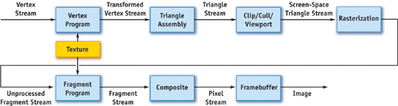

图 将图形流水线映射成流式模型（Stream Model）
【图形流水线的流式化，把所有数据表达成流（由箭头表明），所有计算表达成核（由框表明）。图形流水线中的用户可以编程和不可编程阶段都可以表达成核。】

图形流水线在几方面都很好地匹配了流式模型。图形流水线传统上被构造为多个计算阶段，由阶段之间的数据流连接。这个结构近似于流式编程模型的流和核的抽象。图形流水线中阶段之间的数据流是高度局部化的，一个阶段产生的数据立刻被下一个阶段所消耗；在流式编程模型中，流在核之间的穿行也显现出相似的行为。而且在流水线的各个阶段所调用的计算在不同的图元之间一般是一致的，使这些阶段很容易映射成核。

### 2.2 GPU存储器模型

#### 2.2.1 存储器体系结构

下图演示了CPU和GPU的存储器体系结构。GPU的存储器系统结构。GPU的存取器建立了现代计算机存储器体系结构的一个分支。GPU与CPU类似，有它自己的cache和寄存器来加速计算中的数据访问。然而，GPU自己的主存储器也有它自己的存储器空间——这意味着在程序运行之间，程序员必须明确地把数据复制入GPU存储器。这个输入传统上是许多应用程序的一个瓶颈，但是新的PCI
Express总线标准可能使存储器在CPU和GPU之间共享在不远的将来变得更为可行。

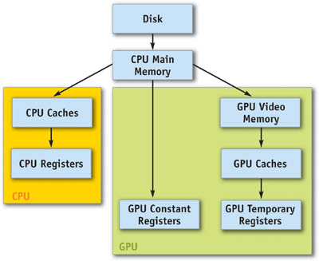

图 CPU和GPU的存储器体系结构

#### 2.3.2 GPU与CPU元素类比

这一小节将传统的CPU计算概念和它们对应的GPU概念上做一些非常简单的类比总结，以方便更好的理解GPU的概念：

-   流：GPU纹理 = CPU数组 (Streams: GPU Textures = CPU Arrays)

-   核：GPU片段程序 = CPU“内循环” (Kernels: GPU Fragment Programs = CPU "Inner Loops")

-   渲染到纹理 = 反馈 (Render-to-Texture = Feedback)

-   几何体光栅化 = 计算的调用 ( Geometry Rasterization = Computation Invocation)

-   纹理坐标 = 计算的域 (Texture Coordinates = Computational Domain)

-   顶点坐标 = 计算的范围 (Vertex Coordinates = Computational Range)

#### 2.2.3 GPU流类型

与CPU存储器不同，GPU的存储器有一些用法的限制，而且只能通过抽象的图形编程接口来访问。每个这样的抽象可以想象成不同的流类型，各个流类型有它自己的访问规则集。GPU程序员可以看到这样的3种流类型是顶点流、帧缓冲区流和纹理流。第四种流类型是片段流，在GPU里产生并非完全消耗，下图演示了一个现代GPU的流水线，3个用户可以访问的流，以及在流水线中它们可以被用到的地点。

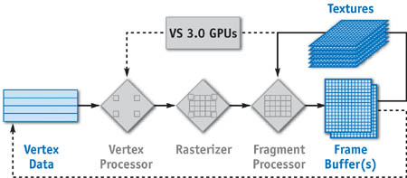

图
现代GPU中的流【GPU程序员可以直接访问顶点、帧缓冲和纹理。片段流由光栅器产生，并被片段处理器消耗。它们为片段程序的输入流，但完全是在GPU内部建立和消耗的，所以对程序员来说是不能直接访问的。】

##### 1.顶点流（Vertex Streams）

顶点流通过图形API的顶点缓冲区指定。这些流保存了顶点位置和多种逐顶点属性。这些属性传统上用作纹理坐标、颜色、法线等，但它们可以用于顶点程序的任意输入流数据。

在一开始，顶点程序不允许随机索引它们的输入顶点。在《GPU Gems
2》出版的时候，顶点流的更新还只能通过把数据从CPU传到GPU来完成。GPU不允许写入顶点流。而当时的的API增强已经使GPU可以对顶点流进行写入。这是通过“复制到顶点缓冲区”或“渲染到顶点缓冲区”来完成的。其中，在前一种技术，“复制到顶点缓冲区”中，渲染结果将从帧缓冲区被复制到顶点缓冲区；而在后一种技术“渲染到顶点缓冲区”中，渲染结果直接写入顶点缓冲区。而当时增加的GPU可写顶点流技术，使GPU首次可以把来自流水线末端的结果，直接接入流水线的起始。

##### 2.片段流（Fragment Streams）

片段流由光栅器产生，并被片段处理器消耗。它们是片段程序的输入流，但是因为它们完全是在图形处理器内部建立和消耗，所以它们对程序员来说是不能直接访问的。片段流的值包括来自顶点处理器的所有插值输出：位置、颜色、纹理坐标等。因为有了逐顶点的流属性，传统上使用纹理坐标的逐片段值现在可以使用任何片段程序需要的流值。

需要注意的是，片段程序不能随机访问片段流。因为允许对片段流随机访问，会在片段流之间产生依赖，因此打破了编程模型的数据并行保证。而如果某算法有对片段流进行随机访问的要求，这个流必须首先被保存到存储器，并转换为一个纹理流（texture
stream）。

##### 3.帧缓冲区流（Frame-Buffer Streams）

帧缓冲区的流由片段处理器写入。其传统上被用作容纳要显示到屏幕的像素。然而，流式GPU计算帧缓冲区来容纳中间计算阶段的结果。除此之外，现代的GPU可以同时写入多个帧缓冲区表面（即多个RGBA缓冲区）。

片段或顶点程序都不能随机地访问帧缓冲区的流。然而，CPU通过图形API可以直接对其进行读写。通过允许渲染pass直接写入任意一种类型的流，当时的API已经开始模糊帧缓冲区、顶点缓冲区和纹理的区别。

##### 4.纹理流（Texture Streams）

纹理是唯一一种可以被片段程序和Vertex Shader 3.0
GPU顶点程序随机访问的GPU存储器。如果程序员需要随意地索引入一个顶点、片段或帧缓冲区流，其必须首先将它转换成一个纹理。纹理可以被CPU或GPU读取和写入。GPU通过直接渲染到纹理而非帧缓冲区，或把数据从帧缓冲区复制到纹理存储器来写入纹理。

纹理被声明为1D、2D或3D流，并分别为1D、2D或3D地址寻址。一个纹理也可以声明为一个立方图（cubemap），可以被看做6个2D纹理的数组。

#### 2.2.4 GPU核的存储器访问

顶点和片段程序是现代GPU的两架马车。

顶点程序在顶点流（vertex stream）元素上操作，并将输出送到光栅器（rasterizer）。

片段程序在片段流（fragment streams）上操作，并把输出写入帧缓冲区（frame
buffers）。

这些程序的能力由它们能执行的运算操作和它们能访问的存储器所定义。GPU核中可用的多种运算操作接近于在CPU上可用的操作，然而有很多的存储器访问限制。如同先前描述的，大部分这些限制是为了保证GPU必须的并行性以维持它们的速度优势。然而，其他的限制是进化中的GPU体系结构造成的，有不少已经在目前得到解决。

另一个访问模式是：指针流（pointer streams）[Purcell et al.
2002]。指针流源于可以使用任意输入流作为纹理读取地址的能力。下图演示了指针流是简单的流，其值是内存地址。如果从纹理读取指针流，则这种能力称为依赖纹理（dependent
texturing）。

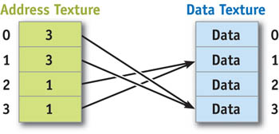

图 用纹理实现指针流

 

# II、次核心章节提炼篇

 

# 三、使用基于GPU几何体裁剪图的地形渲染（Terrain Rendering Using GPU-Based Geometry Clipmaps）

## 【章节概览】

本章描述了一种通过顶点纹理实现的，基于GPU的几何体裁剪图（Geometry
Clipmaps）技术。通过把地形几何体当做一组图像来处理，可以在GPU上执行几乎所有的计算，因此可以减少CPU的负载。且该技术较为容易实现。

## 【核心要点】

几何裁剪图（Geometry Clipmap）是Losasso 和
Hoppe在2004年提出的，一种新的用于渲染地形层次细节的数据结构。其将地形几何体缓存在一组嵌套规则栅格中，而栅格随着视点的移动而递增。

需要注意，裁剪图以非常特别而有限的方式使用顶点纹理：纹素基本上以光栅扫描的顺序存取，而且与顶点一一对应。

随着视点的移动，裁剪图窗口也会进行移动，并用新的数据更新。为了保证高效的递增更新，每层的裁剪图窗口都以环形方式被访问，即通过2D环绕寻址（2D
Wraparound Addressing）。

文中对此技术在GPU上的实现框架细节进行了详细的交代。

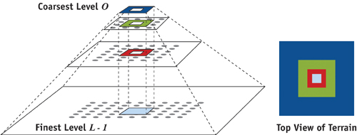

图
几何体裁剪图的原理。给定一个L层的过滤地形棱锥，几何体剪切图在每个分辨率层缓存一个方形的窗口，从这些窗口提取了一组以视点为中心，具有L个嵌套的“环（ring）”，且最精细的层环是实心的。

图
使用粗粒度几何体裁剪图的地形渲染。（n=31，L=10）。每层环由不同的剪切图层构成。

## 【关键词】

地形渲染（Terrain Rendering）

裁剪图（Clipmap）

几何裁剪图（Geometry Clipmap）

环绕寻址（Wraparound Addressing）

   

# 四、几何体实例化的内幕（Inside Geometry Instancing）

## 【章节概览】

本章讨论了在Direct3D中渲染一个几何体的许多独特实例（Instance）的技术细节问题，对几何体实例（Geometry
Instancing）的技术内幕进行了分析。

## 【核心要点】

使用几何体实例（Geometry
Instancing）的优势在于可以对渲染性能进行优化（最小化花费在提交渲染批次上的CPU时间）。

想要使用应用程序最小化状态和纹理变化次数，并在一次Direct3D调用中把统一批次中的同一个三角形渲染多次。这样就能最小化花费在提交批次上的CPU时间。

这章描述了4种不同的技术来实现Geometry Batch：

-   静态批次（Static
    batching）。最快的实例化几何体的方法。每个实例一旦转换到世界空间，则应用它的属性，然后每一帧把已经转换的数据发送给GPU。虽然简单，但静态批次是最不具灵活性的技术。

-   动态批次（Dynamic
    batching）。最慢的实例化几何体的方法。每个实例在每帧都流向GPU存储器，已经转换并应用了属性。动态批次无缝地支持蒙皮并提供了最灵活的实现。

-   顶点常量实例（Vertex constants
    instancing）。每个实例的几何体有多份副本一次复制到GPU存储器中的混合实现。然后实例属性在每一帧通过顶点常量设置，而由于顶点着色器完成几何体的实例化。

-   通过几何体实例化API的批次（Batching with Geometry Instancing
    API）。使用DirectX等图形API提供并支持的几何体实例化，此实现提供了灵活快速的几何体实例化解决方案。与其他方法不同的是，这不需要在Direct3D顶点流中复制几何体包

高效地渲染相同的几何体（静态批次、动态批次、顶点常量实例化，通过几何体实例化API的批次），他们各有优劣，根据应用和渲染的物体类型分别选取。一些建议：

-   有相同几何体的许多静态实例的室内场景，很少或从不移动的实例（比如墙壁或家具），采用静态批次较为理想。

-   有许多动画物体实例的一个室外景物，如策略游戏中有上百个士兵的大战场，在这种情况下，动态批次或许是最好的解决方案。

-   有许多植被和树以及许多粒子系统的室外场景，其中有很多经常需要修改的属性（例如，树和草随风摇摆），几何体实例API可能是最好的解决方案。

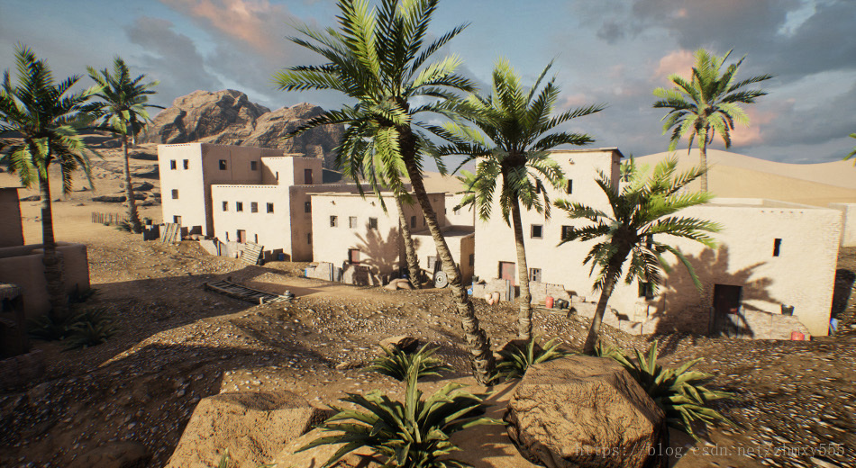

图 在真实场景中将静态批次和几何体实例化结合起来

## 【关键词】

几何体实例（Geometry Instancing）

静态批次（Static batching）

动态批次（Dynamic batching）

顶点常量实例（Vertex constants instancing）

通过几何体实例化API的批次（Batching with Geometry Instancing API）

   

# 五、分段缓冲（Segment Buffering）

## 【章节概览】

本章介绍了一项可以明显减少一个显示帧中渲染的批次数目的技术——分段缓冲（segment
buffering），以及其改进。

## 【核心要点】

分段缓冲（segment
buffering）技术汇集了在场景中彼此靠近的多个实例，把它们合并到“超级实例（über-instances）”中，这样减少了批次的数目，而且提供了解决批次瓶颈问题的一个简单优化的方案。

分段缓冲（segment
buffering）技术自动合并相似的实例，同时保持呈现单独实例的大部分优势。分段缓冲的主要好处在于非重复的外观，以及无需重新绘制原始的实例，就像这部分实例从可见集合中被删除了一样，所以可以明显减少一个显示帧中渲染的批次的数目。而其具体步骤分为三步，原书中有进一步地说明。

而关于分段缓冲（Segment
Buffering）的改进，文章提出了结合自动纹理图集生成（automatic texture-atlas
generation [NVIDIA 2004]）的相关思路。

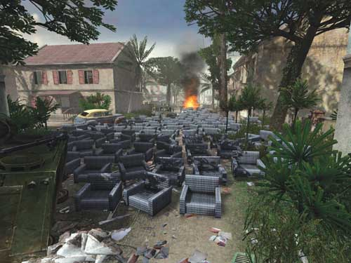

图 包含同一个物体的多个实例的场景

## 【关键词】

实例化（instance）

批次（batch）

分段缓冲（segment buffering）

超级实例（über-instances）

自动纹理图集生成（automatic texture-atlas generation）

   

# 六、用多流来优化资源管理（Optimizing Resource Management with Multistreaming）

## 【章节概览】

现代实时图形应用程序最困难的问题之一是必须处理庞大的数据。复杂的场景结合多通道的渲染，渲染起来往往会较为昂贵。

首先，多流（Multistreaming）技术由微软在DirectX
8.0中引入。而这章介绍了一种用多流来优化资源管理的解决方案，可以用来处理庞大的数据，且在每个通道中只传输当前需要的顶点分量。

## 【核心要点】

这章介绍了当前的应用程序如何克服由于场景中几何体数据的增加所引起的问题。文中的讨论基于一个使应用程序对数据有更多控制的灵活模型—多流（Multistreaming），

这个方案联合了两项强大的技术，已经在名为Gothic
III的引擎中实现：一些顶点缓冲区通过多流联合，而且所有顶点缓冲区都由一个优化的资源管理器控制。

此方法的好处是：带宽有时可能受限于系统内存和GPU之间的总线，因为传输了重复或多余的数据，而现在此方法为数据有效地控制了带宽。

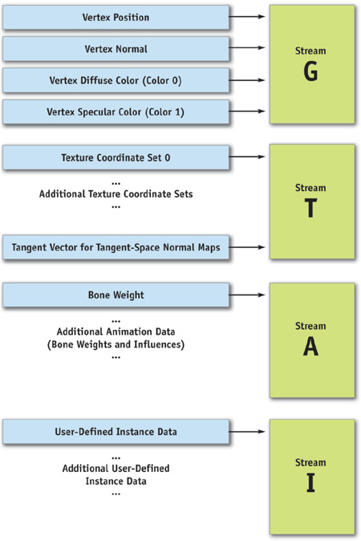

图 顶点流的四种类型

G – 用于几何体数据的顶点流。包含顶点位置、法线和(多个)顶点颜色。

T –
用于纹理映射数据顶点流。包含纹理坐标系和附加数据，如正切空间法线映射的正切向量。

A – 用于动画数据的顶点流。包含动画数据，如骨骼权重和相关因素。

I – 用于实例数据的顶点流。 包含顶点流频率实例数据。

而这四种流的子集结合起来可以处理不同的任务，如下图。

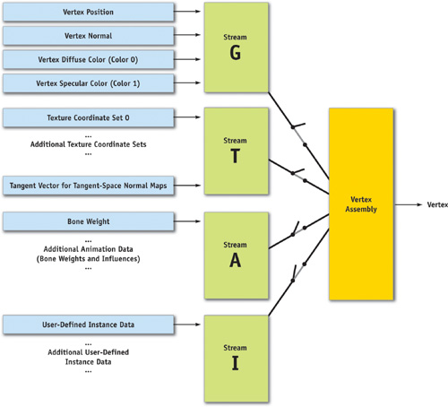

图 组合当前需要的流

-   渲染没有动画的网格

可能的流组合： G或者G+T

-   渲染有动画的网格

可能的流组合： G+A或者G+T+A

-   渲染实例的网格（可选包含动画）

可能的流组合：G+I或G+T+I（可选：G+A+I或G+T+A+I）

-   渲染纯的Z通道(可选有或者没有实例，可选有或没有动画)

可能的流组合 G（可选 ：G+A 或 G+I 或 G+A+I）

原文中对上述的思路用DirectX 9.0c进行了实现。

## 【关键词】

资源管理（Resource Management）

多流（Multistreaming）

顶点流（Vertex stream）

   

#  七、让硬件遮挡查询发挥作用（Hardware Occlusion Queries Made Useful）

## 【章节概览】

这章探究了如何最好地应用硬件遮挡查询（Hardware Occlusion
Queries）的思路，介绍了一个简单但强大的算法，其最小化了调用查询的次数，而且减少了由查询结果延迟造成的停滞影响。

## 【核心要点】

遮挡查询作为一个GPU特性，反馈的延迟很高，可以确定一个物体在被渲染之后是否看得见，不像早期的遮挡查询裁剪技术，Michael等人的算法是像素完美的，即此算法没有引入渲染走样，并产生一组最合适的可见物体来渲染，没有把不必要的负载放到GPU上，而且CPU的开销最小。

文中介绍的算法可以解决这些问题。
该算法用前一帧的遮挡查询结果来初始化和调度当前帧的查询，利用了可见性的空间和时间相关性。这通过把场景存储在一个层的数据结构来完成（比如k-d树或八叉树），以从前到后的顺序处理层的节点，渲染某些先前可见的节点来交叉地遮挡查询。

也就是说，该算法几乎可以节省任何在CPU和GPU上等待遮挡查询结果的时间。这是利用时间一致性（temporal
coherence）来实现的，假设正在先前帧可见的物体在当前帧仍保持可见。算法使用层结构来在单次测试中裁剪掉大块被遮挡的区域，减少了遮挡查询的数量，同事也避免了大部分其他内节点的遮挡测试。

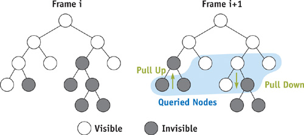

图 两个连续帧中层次结构节点的可见性

## 【关键词】

硬件遮挡查询（Hardware Occlusion Queries）

时间一致性（temporal coherence）

一致性层裁剪（Coherent Hierarchical Culling）

   

# 八、带位移映射的细分表面自适应镶嵌（Adaptive Tessellation of Subdivision Surfaces with Displacement Mapping）

## 【章节概览】

这章介绍了如何使用可选的位移贴图（Displacement
Mapping）执行Catmull-Clark细分曲面（Catmull-Clark Subdivision
Surfaces）的视图相关的自适应镶嵌（Adaptive
Tessellation）。使用GPU进行镶嵌计算，这可以节省图形总线带宽，并且比使用CPU快许多倍。

## 【核心要点】

文中通过重复细分（repeated
subdivision）的方法来实现镶嵌，通过渲染到2D纹理来实现。细分，平坦度测试（（Flatness
Test））和最终顶点属性计算使用片元着色器（也称像素着色器）完成。该方法假设细分曲面控制网格的顶点数据存储在纹理贴图中。中间结果也渲染到纹理贴图并从纹理贴图读取，并且最终的镶嵌结果（位置，法线等）被渲染到一个顶点数组中，以被渲染图元（render-primitives）如glDrawElements()函数使用。

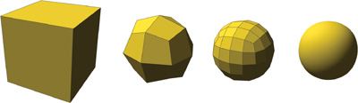

图 对立方体的Catmull-Clark细分

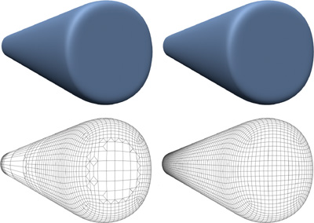

图 自适应镶嵌（Adaptive Tessellation） vs. 均匀镶嵌（Uniform Tessellation）

总之，这章介绍了一个结合使用广度优先递归（breadth-first recursion
algorithm）细分算法在GPU上镶嵌细分表面的方法。文中描述了执行平坦度测试、实现细分和计算极限表面属性所需的着色器。而且解释了如何修改着色器来添加位移映射的支持，以增加细分表面模型的几何细节。

## 【关键词】

Catmull-Clark细分 （Catmull-Clark subdivision）

位移贴图（Displacement Mapping）

平坦度测试（Flatness Test）

GPU镶嵌（GPU Tessellation ）

自适应镶嵌（Adaptive Tessellation）

   

# 九、使用距离函数的逐像素位移贴图（Per-Pixel Displacement Mapping with Distance Functions）

## 【章节概览】

距离贴图（distance
map）是一种在像素着色器中给对象添加小范围位移映射的技术。这章中详细介绍了使用距离函数的逐像素位移贴图（Per-Pixel
Displacement Mapping with Distance Functions）技术。

## 【核心要点】

这章中提出了距离贴图（Distance Mapping）/距离函数（Distance
Functions）的概念，是一种基于隐式曲面光线追踪的位移映射快速迭代技术（a fast
iterative technique for displacement mapping based on ray tracing of implicit
surfaces）。实际表明，距离函数中包含的信息，允许我们在光线远离表面时前进更大的距离，并保证不会跨得太远以至于在渲染的几何体上产生缝隙。实现的结果非常高效：会在很少的迭代次数内收敛。

文中将位移贴图（Displacement
Mapping）作为光线追踪问题来处理，首先从基础表面上的纹理坐标开始，然后计算观察光线与移动表面相交处的纹理坐标。
为此，文中预先计算了一个三维距离贴图，该贴图给出了空间点和位移表面之间距离的度量。距离贴图为我们提供了与光线快速相交所需的所有信息。
最终，算法在保持实时性能的同时显着增加了场景的感知几何复杂度。

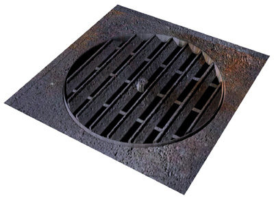

图 使用文中所讨论的位移贴图方法渲染出的滤栅。

## 【关键词】

距离贴图（Distance Mapping）

距离函数（Distance Functions）

位移贴图（Displacement Mapping）

   

# 十、S.T.A.L.K.E.R.中的延迟着色（Deferred Shading in S.T.A.L.K.E.R.）

## 【章节概览】

本章是对《S.T.A.L.K.E.R.》中所用渲染器的几乎两年的研究和开发的事后剖析。该渲染器完全基于延迟着色（Derred
Shading）和100%动态光照，目标是高端GPU，因为没有任何一个解决方案可以适合所有需求，所以这章并不是延迟着色的全面指南，但是可以作为一个很好的参考。

## 【核心要点】

延迟着色（Deferred
Shading），虽然并不适合每个游戏，但是确是《S.T.A.L.K.E.R》中的优秀渲染架构。它提供了一个渲染引擎，权衡了现代GPU，比传统的前向着色架构有更低的几何体处理需求，更低的像素处理需求及更低的CPU开销。场景管理器也更干净更简单。一旦避开了延迟着色固有的不足，如多材质系统的潜在限制和缺乏反失真功能，产生的架构既灵活又快速，允许区域很广的效果。

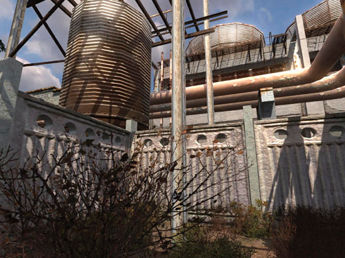

图 基于延迟着色实现的渲染效果 @2005年

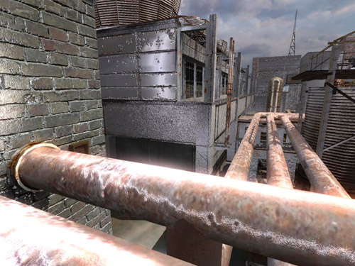

图 基于延迟着色实现的渲染效果 \@2005年

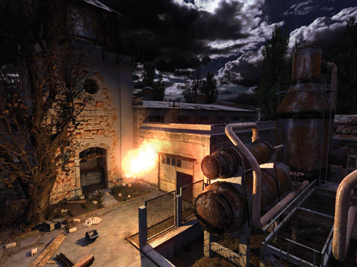

图 基于延迟着色实现的渲染效果 @2005年

## 【关键词】

延迟着色（Deferred Shading）

几何缓冲区（G-buffer）

反走样（Antialiasing）

   

# 十一、动态辐照度环境映射实时计算（Real-Time Computation of Dynamic Irradiance Environment Maps）

## 【章节概览】

环境映射（Environment
Maps）是常用的基于图像的渲染技术，用来表现以空间上不变的球面函数。本章描述了一种完全GPU加速的方法，来生成一个环境映射在图形上特别有趣的类型——辐照度环境映射（Irradiance
Environment maps）。

## 【核心要点】

本技术使应用程序可以在动态环境下（如来自动态关和动态对象的辐射度）快速地模拟复杂的全局光照效果。

辐照度环境映射的渲染非常高效，漫反射只用一次，漫反射+镜面反射只用两次。

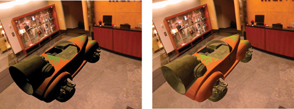

图 一个由单个方向光（左）和实时辐照度环境映射（右）照亮的物体

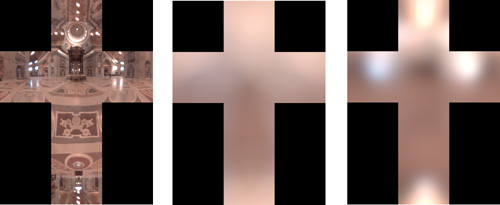

图 辐照度环境映射

（a）一个圣彼得教堂的立方体映射；（b）漫反射结果；（c）镜面映射结果。圣彼得教堂的光照探测。

而通过片元着色和浮点纹理，可以把球面调和卷积映射到GPU上变成简单的两个通道的操作：第一个pass中把光照换行转换成它的球面调和表示，另一个pass把它和反射函数进行卷积并把它转换为空域。且让环境映射的每个面有一个独立的查找表(Lookup
Table)。

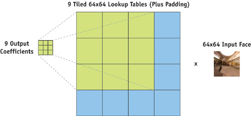

图 10-3 将输出系数映射到一个面的分块输入查找表上

## 【关键词】

环境映射（Environment Maps）

动态辐照度环境映射（Dynamic Irradiance Environment Maps）

球面调和卷积(Spherical Harmonic Convolution)

   

# 十二、近似的双向纹理函数（Approximate Bidirectional Texture Functions）

## 【章节概览】

本章介绍的内容关于如何较容易地采集和渲染的真实材质，如布料、羊毛和皮革等的技术。这些材质难以用早先的技术渲染，它们基本来与兼得的纹理映射。本章的目标是在采集上花费少量的努力，在渲染上花费少量的技术，但是仍然达到真实的外观。

## 【核心要点】

本章介绍了一种可以只用少量图像就进行采集和渲染空间变化的复杂材质的方法。这种经验的方法并不是采集真实的BRDF，而是仅仅展示了细微表面的结构如何引起照明的改变：且BRDF在随后使用。而使用这项技术的实时渲染可以容易地实现。

本文的方法以Kautz等在2004年的工作为基础。根据观测，在某种情况下，表面的材质可以通过少许图像采集，产生的结果类似于完整的双向纹理函数（Bidirectional
Texture
Functions,BTF）所达到的。用这个近似的BTF渲染总共只需1对一个简单的着色模型求值，并执行一个对体纹理的查询即可。渲染在图形硬件上很容易达到实时的帧速率，并在多种材质上都达到了引人注目的结果。

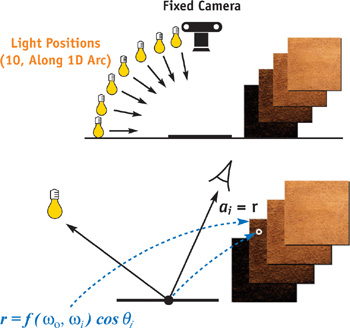

图 采集的方法概览。上图：裁剪光的方向不同，视点固定正交的图像，产生一些着色图。下图：对于每张图像，计算平均反射出的辐出度（即平均亮度）。在渲染时，通过一些用户定义的照明模型计算（如Phong）计算r值，并使用该值根据平均亮度，逐片段地查找进入图像栈。最后，用光源的亮度缩放这个值。

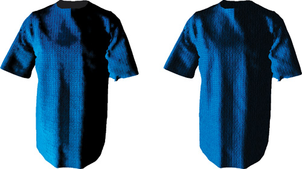

图 羊毛毛衣（a）基于完整的BTF完成（b）基于本文方法。

（a）图是用完整的BTF完成的（6500个图像，用主元分析（Principle Components
Analysis,
PCA）压缩成16个成分）。右图是用本章的技术做的。看得出来主要的差别在一些入射角上。

## 【关键词】

服饰的渲染（Clothing Rendering）

双向纹理函数（Bidirectional Texture Functions，BTF）

   

# 十三、基于贴面的纹理映射（Tile-Based Texture Mapping）

## 【章节概览】

这章介绍了一个基于贴面的纹理映射（Tile-Based Texture
Mapping）系统，用来从一组贴面生成一个大的虚拟纹理。

## 【核心要点】

使用纹理贴面（Texture
Tiling）可以解决纹理过大来带的磁盘空间、系统存储。图像存储瓶颈等各种问题。

如下图，如果有重复的贴面组成的大墙壁或地板，显然不需要存储所有的贴面。相反，可以只存储一个贴面，然后在墙上重复它。对于更复杂的模式，可以把墙壁或地板切成较小的多边形，并对每个多边形应用不同的纹理贴片或纹理坐标变换。这种方法的有点是在理论上可以达到无限的压缩率，因为可以从少量贴面产生出一个任意打的输出。缺点是，应用程序代码和数据比较复杂。

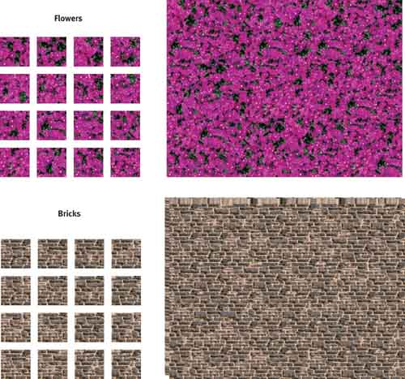

图
基于贴面的纹理。左图：给定以小组输入纹理贴图（左），系统在不需要存储整个纹理的情况下可以提供大的虚拟纹理图（右），这种方法支持本地硬件纹理过滤，而且不需要修改应用程序的几何体或纹理坐标。

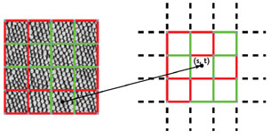

图
基于贴图的纹理映射的概览。左图：打包的输入贴面。右：输入的虚拟纹理。给定一个纹理请求（s，t），先确定请求的是哪个贴面，然后算法从输入贴面中获取相应的纹素。

## 【关键词】

纹理映射（Texture Mapping）

基于贴面的纹理映射（Tile-Based Texture Mapping）

纹理贴面（Texture Tiling）

   

# 十四、动态环境光遮蔽与间接光照（Dynamic Ambient Occlusion and Indirect Lighting）

## 【章节概览】

这章在讲大家很熟知的环境光遮蔽（Ambient Occlusion , AO）。

文中的描述是，介绍了一种用于计算散射光传递的新技术，并演示如何用它来计算运动场景中的全局光照。主要是一种用GPU加速环境光遮蔽计算的技术，并将此算法变成了实时的解决方案。

## 【核心要点】

这章介绍的这项技术效率很高，可以实现在渲染每帧时即时计算环境光遮蔽和间接光照数据。其并没有预计算辐射传递（Precomputed
Radiance Transfer ，PRT）或预计算环境光遮蔽技术存在的限制。

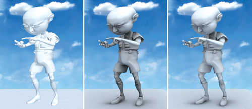

图 通过环境光遮蔽和间接光照增加真实感

图注：左边的场景只用环境光，看起来很平面化。中间的场景用环境光遮蔽加模糊阴影，右边的场景增加的间接光照，感觉格外真实。

这章的技术通过把多边形网格看做一些可以发出、传播或反射光的元素，并且可以互相产生阴影的表面元素集合来工作。此方法效率很高，因为它不需要计算一个元素到另一个元素的可见性，而是用一种更简单而且更快的技术——基于近似投影的方法——来处理遮挡的几何体。

## 【关键词】

环境光遮蔽（Ambient Occlusion, AO）

间接光照（Indirect Lighting）

   

# 十五、精确的大气散射（Accurate Atmospheric Scattering）

## 【章节概览】

生成真实大气散射的效果一直是计算机图形学领域的难题。描述大气的散射方程式非常复杂，以至于可以用整本书去解决这个课题。计算机图形模型通常使用简化的方程，这些模型中只有少数可以以交互速率运行。

这章介绍如何实现一个完全运行在GPU上的大气散射实时算法（原始算法由Nishita等人在1993年提出），并提供了实现此算法的全部CG和GLSL源代码。

## 【核心要点】

这章解释了如何在GPU着色器中实现Nishita等人在1993年提出的散射方程，并以可交互的速率运行。这些方程能更加精确地对大气建模，保证当高度降低的同时密度也呈指数级降低。且可以在不需要牺牲图像质量同时省略查找表，着色器代码足够小而快，可以在一个GPU着色器中实现整个算法。

一个重要的细节是怎样模拟大气中一个点的散射（Scattering）。最常见的两种大气散射形式是瑞利散射（Rayleigh
Scattering）和米氏散射（Mie Scattering）。

瑞利散射（Rayleigh
Scattering）是由空气中的小分子引起的，而且它对波长端的光散射更强（最先是蓝色，然后是绿色和红色）。

米氏散射（Mie
Scattering）由空气中更大一些的粒子引起，这些粒子被称为浮尘（aerosols），如灰尘（dust）或污染物（pollution）。

章节构成方面，这章一开始用一定的篇幅进行了散射方程的求解和简化，最终得到的实现在原本的大气散射模型上进行了不少简化，以至于最终的实现可以在对硬件要求不高的前提下，达到交互的速率进行渲染。并且采用了高范围动态（HDR）渲染，得到了更好的大气散射效果。

图 散射Demo的截图

## 【关键词】

大气散射（Atmospheric Scattering）

瑞利散射（Rayleigh Scattering）

米氏散射（Mie Scattering）

高范围动态渲染（High-Dynamic-Range Rendering）

   

# 附录：配套资源与源代码下载

这里提供了一些，《GPU Gems 2》书本的配套资源，以及源代码的下载地点。

PS:配套的不少工程中不仅包含完整的源码，也直接包含经过编译后的exe执行文件，可以直接运行后查看效果。

-   《GPU Gems 2》全文的Web版本：https://developer.nvidia.com/gpugems/GPUGems2/gpugems2_inside_front_cover.html

-   我维护的一个名为“GPU-Gems-Book-Source-Code”的GitHub仓库，以备份《GPU
    Gems》系列书籍相关的珍贵资源，《GPU Gems
    2》的随书CD和源代码可以在这里下载到：
https://github.com/QianMo/GPU-Gems-Book-Source-Code

 - 本文的知乎专栏版本：https://zhuanlan.zhihu.com/p/38411575

