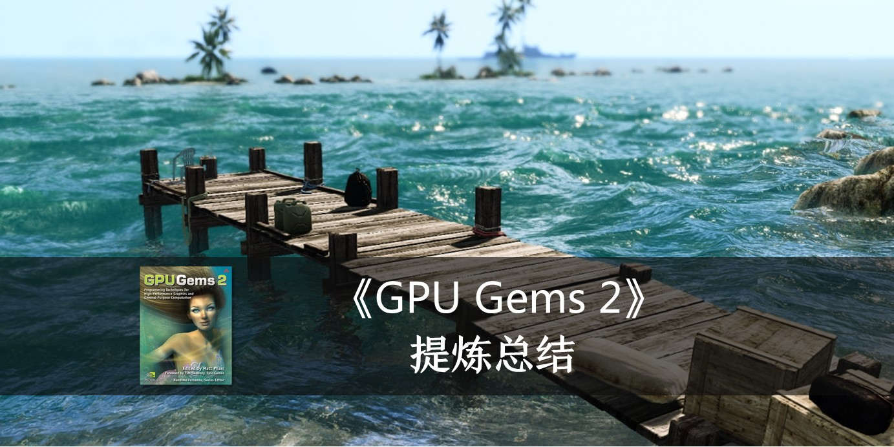

# 【GPU精粹与Shader编程】《GPU Gems 2》全书核心内容提炼总结 · 下篇

本文的知乎专栏版本：
https://zhuanlan.zhihu.com/p/40288273

本文核心内容为《GPU Gems 2》中讲到的真实感水体渲染，以及真实感头发渲染、通用的折射模拟、改进的Perlin噪声等次核心内容。

# 快捷导航目录
<!-- TOC -->

- [【GPU精粹与Shader编程】《GPU Gems 2》全书核心内容提炼总结 · 下篇](#gpu精粹与shader编程gpu-gems-2全书核心内容提炼总结-·-下篇)
- [快捷导航目录](#快捷导航目录)
- [前言](#前言)
- [I、核心章节提炼篇](#i核心章节提炼篇)
- [一、将顶点纹理位移用于水的真实感渲染（Using Vertex Texture Displacement for Realistic Water Rendering）](#一将顶点纹理位移用于水的真实感渲染using-vertex-texture-displacement-for-realistic-water-rendering)
    - [【章节概览】](#章节概览)
    - [【核心要点】](#核心要点)
        - [1.1 水体渲染模型的分析](#11-水体渲染模型的分析)
        - [1.2 实现思路概览](#12-实现思路概览)
        - [1.3 水体的表面模拟](#13-水体的表面模拟)
        - [1.4 实现细节概述](#14-实现细节概述)
        - [1.5 对高度图采样](#15-对高度图采样)
        - [1.6 提高渲染质量与优化性能的一些方案](#16-提高渲染质量与优化性能的一些方案)
            - [1.6.1 为双线性过滤打包高度值](#161-为双线性过滤打包高度值)
            - [1.6.2 使用分支避免不需要的工作](#162-使用分支避免不需要的工作)
            - [1.6.3 使用渲染到纹理策略（Render-to-Texture）](#163-使用渲染到纹理策略render-to-texture)
            - [1.6.4 处理波浪的背面](#164-处理波浪的背面)
        - [1.7 渲染局部扰动的策略](#17-渲染局部扰动的策略)
            - [1.7.1 解析型形变模型（Analytical Deformation Model）](#171-解析型形变模型analytical-deformation-model)
            - [1.7.2 动态位移贴图（Dynamic Displacement Mapping）](#172-动态位移贴图dynamic-displacement-mapping)
            - [1.7.3 泡沫的生成（Foam Generation）](#173-泡沫的生成foam-generation)
    - [【核心要点总结】](#核心要点总结)
        - [1.提高渲染质量与优化性能的方案](#1提高渲染质量与优化性能的方案)
        - [2.渲染局部扰动的策略](#2渲染局部扰动的策略)
    - [【配套源代码】](#配套源代码)
- [【关键词】](#关键词)
- [II、次核心章节提炼篇](#ii次核心章节提炼篇)
- [二、利用像素着色器分支的高效模糊边缘阴影（Efficient Soft-Edged Shadows Using](#二利用像素着色器分支的高效模糊边缘阴影efficient-soft-edged-shadows-using)
    - [【章节概览】](#章节概览-1)
    - [【核心要点】](#核心要点-1)
    - [【关键词】](#关键词-1)
- [三、通用的折射模拟（Generic Refraction）](#三通用的折射模拟generic-refraction)
    - [【章节概览】](#章节概览-2)
    - [【核心要点】](#核心要点-2)
    - [【关键词】](#关键词-2)
- [四、快速三阶纹理过滤（Fast Third-Order Texture Filtering）](#四快速三阶纹理过滤fast-third-order-texture-filtering)
    - [【章节概览】](#章节概览-3)
    - [【核心要点】](#核心要点-3)
    - [【关键词】](#关键词-3)
- [五、高质量反走样的光栅化（High-Quality Antialiased Rasterization）](#五高质量反走样的光栅化high-quality-antialiased-rasterization)
    - [【章节概览】](#章节概览-4)
    - [【核心要点】](#核心要点-4)
    - [【关键词】](#关键词-4)
- [六、快速预过滤线条（Fast Prefiltered Lines）](#六快速预过滤线条fast-prefiltered-lines)
    - [【核心要点】](#核心要点-5)
    - [【关键词】](#关键词-5)
- [七、Nalu Demo中的头发动画与渲染（Hair Animation and Rendering in the Nalu Demo）](#七nalu-demo中的头发动画与渲染hair-animation-and-rendering-in-the-nalu-demo)
    - [【章节概览】](#章节概览-5)
    - [【核心要点】](#核心要点-6)
    - [【关键词】](#关键词-6)
- [八、使用查找表加速颜色变换（Using Lookup Tables to Accelerate Color](#八使用查找表加速颜色变换using-lookup-tables-to-accelerate-color)
    - [【章节概览】](#章节概览-6)
    - [【核心要点】](#核心要点-7)
    - [【关键词】](#关键词-7)
- [九、实现改进的Perlin噪声（Implementing Improved Perlin Noise）](#九实现改进的perlin噪声implementing-improved-perlin-noise)
    - [【章节概览】](#章节概览-7)
    - [【核心要点】](#核心要点-8)
    - [【关键词】](#关键词-8)
- [十、高级高质量过滤（Advanced High-Quality Filtering）](#十高级高质量过滤advanced-high-quality-filtering)
    - [【章节概览】](#章节概览-8)
    - [【核心要点】](#核心要点-9)
    - [【关键词】](#关键词-9)
- [十一、Mipmap层级测定（Mipmap-Level Measurement）](#十一mipmap层级测定mipmap-level-measurement)
    - [【章节概览】](#章节概览-9)
    - [【核心要点】](#核心要点-10)
- [【关键词】](#关键词-10)
- [附录：配套资源与源代码下载](#附录配套资源与源代码下载)

<!-- /TOC -->

# 前言

之前和同事们讨论水体渲染时，大家说到目前业界水体实时渲染效果领先的游戏引擎，是Cry
Engine。Cry
Engine中的水体渲染可谓目前水体渲染方案中的集大成者，汲取了图形业界近几十年水体渲染各种思路的精华。以下是Cry
Engine 中的水体渲染实时画面：

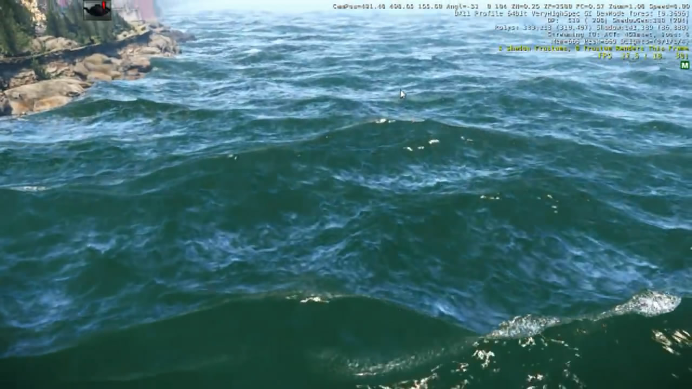

视频链接：<https://www.youtube.com/watch?v=tZthI6M07iM>

注意这是6年前Cry Engine 3的水体渲染实时画面，很多人感觉其效果已经近乎真实。

而目前的Cry Engine 5，渲染质量还会更胜一筹。

值得开心的是，Cry Engine 5已经开源，其水体渲染的具体shader实现代码可以在Cry Engine源码中找到，以下是其中Water.cfx源码传送门，感兴趣的朋友不妨了解一下：

<https://github.com/CRYTEK/CRYENGINE/blob/26524289c15a660965a447dcb22628643917c820/Engine/Shaders/HWScripts/CryFX/Water.cfx>

值得注意的是，本文中提到的一些渲染水体的策略与思路，在Cry Engine 5实现水体渲染中，也有所体现。

OK，下面开始正题。

# I、核心章节提炼篇

# 一、将顶点纹理位移用于水的真实感渲染（Using Vertex Texture Displacement for Realistic Water Rendering）

## 【章节概览】

真实地表现水的质感是一个困难的问题，因为水表面的运动具有高度的视觉复杂性，且水的光影效果也很复杂。而这章中，介绍了为游戏《太平洋战机》开发的对海水的真实感渲染技术。

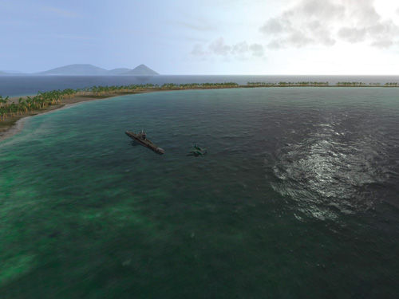

图 《太平洋战机》中的海水渲染

## 【核心要点】

### 1.1 水体渲染模型的分析

Gems2中这篇文章问世期间（2005年），当时最真实的水体渲染实现方法是基于流体动力学和快速傅里叶变换（FFT）（[Tessendorf
2001]）,但遗憾的是这种方法需要大量的计算，不适用于交互应用程序。

大多数游戏当时使用的是很简单的水模型，而其中的大多数采用了法线贴图来生成视觉细节，优点是计算量小，缺点是很多时候不能提供足够的真实感，并且不能真实重现水面的波浪。

而本文中介绍了一种能达到简单法线贴图方法的速度，但渲染质量类似于FFT方法的水面渲染技术。

### 1.2 实现思路概览

本文的水体渲染主要实现思路是基于法线贴图计算光照的渲染算法。因为法线图在高频的波浪中能够真实地产生精细的细节，所以将它用于光照的计算。除此之外，还对水模型的几何表面做了大振幅低频波浪的扰动。

### 1.3 水体的表面模拟

水体表面的模型是基于几张高度图（Height maps）的叠加，这些高度图在空间和时间上不断重复。每张纹理表示一个“谐波（harmonic）”或“倍频（octave）”频谱，然后这些纹理被叠加到一起，类似傅里叶分析中的做法。

而这些纹理之所以称为高度图，因为其中每个值代表了对应点相对于水平面的高度值。高度图对于美术同学来说创建非常容易，与创建和渲染灰度图一样简单。利用高度图，水的动画参数规约成一些独立的波，美术同学只要绘出它们的形状就可以很容易地控制水的动画。高度图也对顶点纹理有用：因为可以很容易地对顶点进行竖直方向的位移。

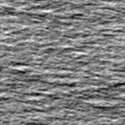

图18-2 一张用于水面位移的高度图

通过用不同的空间和时间范围来结合若干高度图，可以得到视觉上非常复杂的动画：

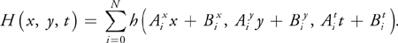

系数A和B以及求和的项数是由经验决定的，以求达到美学角度上最好的结果，同时减少重复图案的痕迹。在《太平洋战机》中，叠加4张高度图用于计算光照，其中最大范围的两张用于位移贴图。这对模拟动态的海洋表面来说已经足够了，可选范围为10cm到40km（10厘米到40千米）之高。

### 1.4 实现细节概述

可以把所有需要实现的计算分为两部分：

-   几何位移计算

-   光照计算

因为水面细分得很精细，所以可以只在片段程序级实现光照计算，而把位移映射的工作移交给顶点级，以减轻片段的负担。需要注意，如果在顶点级实现光照计算可能产生明显的走样，尤其是远处的物体。

### 1.5 对高度图采样

文中的实现是在每个顶点上对高度图进行采样，并且在顶点程序中计算应该取的位移值。为了计算采样，使用了一个中心在相机位置的径向栅格（radial
grid）。这个栅格的细分特点是离视点越近则提供越多的细节，如下图所示

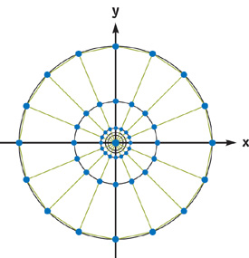

下面的方程表示了径向栅格上的顶点位置的计算方法：

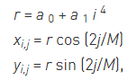

其中，i=[0..N - 1], j = [0..M - 1]。选择a0，a1，使

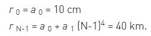

使用这种方法，可以得到根据距离细分的栅格，也体现了一个简单的层次细节LOD策略。其他方案，如ROAM或SOAR地形渲染算法，也可以用于此处，但是它们需要在CPU上进行大量计算，会减弱使用顶点纹理的优势。而我们也可以尝试在GPU中渲染自适应镶嵌栅格的高度域。

下面的代码列出了着色器的实现细节，用一个径向栅格对单张高度图进行采样。

    float4 main(float4 position : POSITION,
    uniform sampler2D tex0,
    uniform float4x4 ModelViewProj,
    uniform float4 DMParameters, // displacement map parameters
    uniform float4 VOfs) : POSITION
    {
        // Read vertex packed as (cos(), sin(), j)
        float4 INP = position;

        // Transform to radial grid vertex
        INP.xy = INP.xy * (pow(INP.z, 4) * VOfs.z);

        // Find displacement map texture coordinates
        // VOfs.xy, DMParameters.x - Height texture offset and scale
        float2 t = (INP.xy + VOfs.xy) * DMParameters.x;

        // Fetch displacement value from texture (lod 0)
        float vDisp = tex2D(tex0, t).x;

        // Scale fetched value from 0..1:
        // DMParameters.y - water level
        // DMParameters.z - wavy amplitude
        INP.z = DMParameters.y + (vDisp - 0.5) * DMParameters.z;

        // Displace current position with water height
        // and project it

        return mul(ModelViewProj, INP);
    }

### 1.6 提高渲染质量与优化性能的一些方案

#### 1.6.1 为双线性过滤打包高度值

访问顶点纹理的代价十分昂贵，在旧的GeForce 6系列的硬件上，一个顶点纹理的访问会在顶点程序中产生明显的延迟。所以比较合适的策略是把顶点程序中访问纹理的次数降到最低。另一方面，过滤纹理值非常必要，否则图像质量就会显著降低。

为了减小插值时纹理访问的次数，可以用一种特别的方法创建纹理，这样使每个纹理包含了一次双线性纹理查找必需的所有数据。因为高度图本质上是单通道的纹理，可以把四个高度值打包到一张四通道纹理的一个纹素内，以实现优化。

#### 1.6.2 使用分支避免不需要的工作

即使使用了优化的纹理过滤，渲染水体时，访问纹理的次数仍然很高，这会严重影响性能。一种方法是减少渲染的顶点数，但是这将全面地降低视觉上的细节并且增加失真度。

需要渲染的水体含有大量的几何数据，但其中有些三角面完全在屏幕之外。对这样的三角形，顶点程序仍然要进行处理，这其实是一种浪费。如果能跳过在相机视野之外三角形的相关计算，就可以在每个顶点上节约大量的工作。

以下的伪代码表达了这个方法的实现：

    float4 ClipPos = mul(ModelViewProj, INP);
    float3 b0 = abs(ClipPos.xyz) < (ClipPos.www * C0 + C1);
    if (all(b0))
    {
        // Vertex belongs to visible triangle,
        // Perform texture sampling and displace vertex accordingly
    }

在上面的代码中，使用了裁剪空间的顶点位置来确定当前的顶点是否位于视野之中，然后只对需要的顶点进行复杂运算即可。

#### 1.6.3 使用渲染到纹理策略（Render-to-Texture）

仍然可以使用上文提到的，用一张浮点纹理来压缩存储高度纹理的方法，先将其作为单独的pass来执行，以提高运行速度。而在顶点着色器里面实现多次昂贵的插值操作就变得没有太多必要。另外，可以用一个更紧凑的16位浮点纹理格式来存储原始的高度图。也可以存储一系列高度图序列帧作为三维纹理的切片，以使动画更加流畅。

经过上述优化，我们的渲染循环变成了如下两个pass：

（1）通过使用将单个四边形渲染为32位浮点纹理的特殊像素着色器，来组合高度贴图。而此纹理中的各个纹素映射到径向栅格的各个顶点。

（2）使用生成的高度贴图作为顶点纹理来平移径向栅格顶点。

#### 1.6.4 处理波浪的背面

大量的光照计算是在像素着色器中实现的。其假设了水面是水平的，而这个假设在某些情况下可能导致视觉效果的走样。

在下图所示的情况下，我们看到了波浪的背面，它在平面上是能被看见的，但是因为几何位移的关系它会背向观察者，所以在现实世界中并不应该出现。而这样的错误会在波浪的顶部产生奇怪的过亮区域。

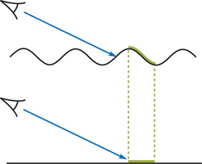

图 渲染走样的产生

图注：波浪（绿色）的背面也可能被渲染出来，尽管它并不应该出现。调整计算光照的法线将大大减少这种错误。

为了尽量减少这种错误，可以将计算光照时使用的法线稍微做调整，将他们朝向观察者方向“倾斜”一些，这样他们会更接近于波浪的正向面。

### 1.7 渲染局部扰动的策略

有时渲染渲染因为浮起物或者掉入水中的物体引起的波浪局部的起伏。这对游戏来说尤为重要，因为游戏需要产生类似于爆炸，船的行进痕迹等效果。因为很难继承物理上正确的方法将其用于这个基于高度图的水面模型中来，所以这里只根据经验讨论一些简单的方法。

#### 1.7.1 解析型形变模型（Analytical Deformation Model）

造成局部波浪起伏最简单的方法是把顶点的位移值做成一个解析上的扰动，把扰动和顶点着色器中计算好的顶点位置结合起来。

实现局部波浪起伏最简单的方法是通过将顶点位移与顶点着色器中计算的顶点位置相结合，来解析地扰动位移的顶点位置。对爆炸而言，可以用下面的公式：

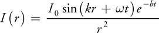

其中，r是水平面上该点到爆炸中心的距离，b是一个常数，I_0，ω和k的值根据一个给定的爆炸及其参数决定。

在渲染时，可以使用和普通水体渲染时相同的径向栅格，尤其是在爆炸点。

#### 1.7.2 动态位移贴图（Dynamic Displacement Mapping）

另一个选择是将所有的局部创建的位移量直接渲染到顶点纹理，本质上是和GPU通用编程（GPGPU）类似的方法。这样，在第一个pass中生成顶点纹理，而在后续pass中，用此纹理来进行实际的水体渲染。另一个好处是，通过在像素着色器中过滤基础高度图和累加倍频程（octaves），可以把一些工作从顶点着色器转移到像素着色器中。

为了计算位移量，既可以采用前面提到的解析型模型，也可以用自动控制单元（cellular-automata）的方法，将局部位移进行逐帧衍变。也可以考虑风的效果，对纹理沿着适当的方向进行模糊。

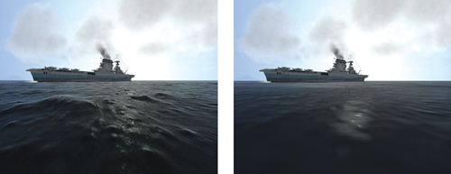

图 用位移贴图渲染的水表面（左）和不用位移图渲染的水表面（右）对比

#### 1.7.3 泡沫的生成（Foam Generation）

在波浪足够强时，可以通过制造泡沫来加强真实感。最简单的方法是把一个预先创建的泡沫纹理在高于某一高度H0的顶点上进行混合。泡沫纹理的透明度根据以下公式进行计算：

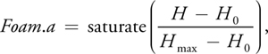

其中，H_max是泡沫最大时的高度，H_0是基准高度，H是当前高度。

泡沫纹理可以做成动画来表示泡沫的产生和消失的进化过程。这个动画序列既可以由美术同学制作，也可以由程序生成。

## 【核心要点总结】

本文的水体渲染实现思路是基于法线贴图计算光照的渲染算法，水体表面的模型为基于几张高度图（Height maps）的叠加。在每个顶点上对高度图进行采样，并且在顶点程序中计算应该取的位移值。计算采样方面，使用了一个中心在相机位置的径向栅格（radial grid），以及结合了一些优化的思路。

### 1.提高渲染质量与优化性能的方案

1.为双线性过滤打包高度值:
因为高度图本质上是单通道的纹理，可以把四个高度值打包到一张四通道纹理的一个纹素内，以实现优化。

2.使用分支避免不需要的工作：使用裁剪空间的顶点位置来确定当前的顶点是否位于视野之中，然后只对需要的顶点进行复杂运算即可。

3.使用渲染到纹理策略（Render-to-Texture）

4.处理波浪背面：将计算光照时使用的法线稍微做调整，将他们朝向观察者方向“倾斜”一些，这样他们会更接近于波浪的正向面。

### 2.渲染局部扰动的策略

1.解析型形变模型（Analytical Deformation Model）

2.动态位移贴图（Dynamic Displacement Mapping）

3.泡沫的生成：预先创建的泡沫纹理在高于某一高度H0的顶点上进行混合，其中泡沫纹理的透明度根据公式进行计算。

## 【配套源代码】

<https://github.com/QianMo/GPU-Gems-Book-Source-Code/tree/master/GPU-Gems-2-CD-Content/Shading_Lighting_and_Shadows/Ch_18_Using_Vertex_Texture_Displacement_for_Realistic_Water_Rendering>

具体shader代码位于fpWaterDM.cg，vpWaterDM.cg两个文件中。其中也提供了可运行的demo
exe，其运行效果如下：

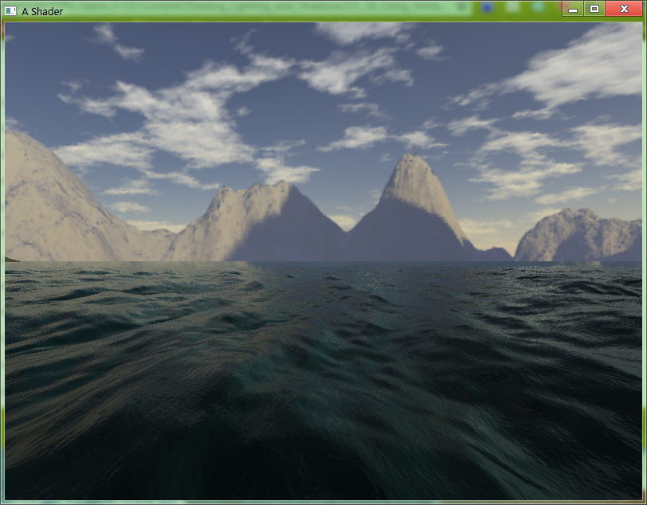

# 【关键词】

水渲染（Water Rendering）

顶点纹理位移（Vertex Texture Displacement）

高度贴图（Height Mapping）

双线性过滤（Bilinear Filtering）

# II、次核心章节提炼篇

# 二、利用像素着色器分支的高效模糊边缘阴影（Efficient Soft-Edged Shadows Using
Pixel Shader Branching）

## 【章节概览】

在计算机图形学中，渲染真实的阴影一直是难题之一，尤其是软阴影（soft
shadow）的渲染。且阴影是一种非常重要的视觉信息，它们有助于确立场景中物体的空间相对关系。

这章介绍了一种通过片段着色器中的PCF技术达到的实时渲染模糊（软）边界阴影的快速方法。

## 【核心要点】

文中首先讲到阴影渲染技术中最常见的两种流派模板阴影/阴影体（Stencil Shadow
/Shadow volume）和阴影贴图（Shadow Map）。

两种方法都各有其优缺点。且提到了这两种方法都不能直接用于“超出框”的模糊边界阴影。

随后这章介绍了一种以交互速率渲染模糊阴影的方法，其能高质量地模拟真实的模糊阴影。该方法使用了百分比邻近过滤（Percentage-Loser
Filtering,
PCF）技术，在片段着色器中不断对阴影图自适应地多次采样。这章自适应的采样方法与采样方法与采样数固定的方法相比，能在保证高性能的同时提高画面质量。

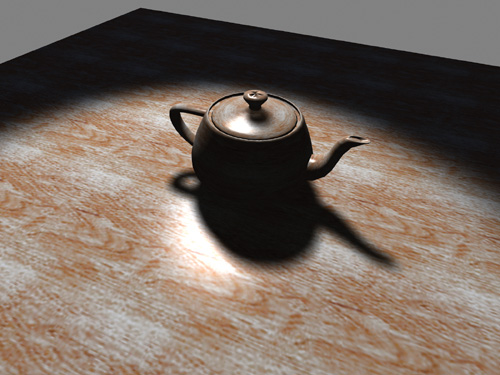

图 基于文中方法实时渲染出的模糊边缘阴影

## 【关键词】

软阴影（Soft Shadows）

模糊边缘阴影（Soft-Edged Shadows）

模板阴影/阴影体（Stencil Shadow /Shadow volume）

阴影贴图（Shadow Map）。

百分比邻近过滤（Percentage-Loser Filtering, PCF）

# 三、通用的折射模拟（Generic Refraction）

## 【章节概览】

本章介绍了一种折射的实现方案，思路是对场景中非折射的物体生成一幅图像，把该图像当做纹理，然后对查找该纹理的坐标进行扰动来达到模拟折射的目的。这种技术效率很高，而且很多情况下都有效。

## 【核心要点】

折射（Refraction）是当光从一种媒介穿到另一种折射率不同的媒介（如从空气到水，从空气到玻璃等）时产生的弯曲现象。

要模拟折射有很多种方法：其中一些方法是先预计算环境映射，然后在运行时使用；而其他方法是直接在运行时计算环境映射。这些技术的缺点是耗费大量的纹理存储空间并损失运行效率，尤其是当场景中有很多折射表面时，需要不同的环境映射。

而目前的水折射模拟技术的另一个问题是他们需要渲染两遍：第一个pass通过水面上的几何信息来生成折射图，另一个pass渲染水面。这种方案的性能很低，尤其对复杂的场景而言。

本章介绍了一种简单的技术来克服这些问题。从介绍基本想法开始，把现有的后台缓存当做一个折射贴图来用，并且通过对纹理坐标进行位移来模拟折射的效果。最基本的实现可能导致走样，因此文中讨论了如何将几何图形从折射图贴图中标注出来。最后演示了一些用该方法渲染真实的水和玻璃的通用技术。

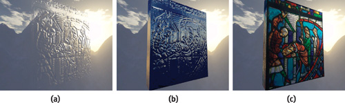

图 彩色玻璃的渲染步骤（a）折射 （b）环境凹凸映射 （c）最终的合成

这章给出的模拟折射的方法，虽然不是基于物理的，但是能得到质量很好的结果，且速度非常快。

但此方法的缺陷是，当应用到不同颜色的折射表面上时，在表面重叠的地方会得到不正确的结果。只要折射表面的颜色相近，结果看上去就是正确的。一个正确的解决方案就是，对折射网格从后到前进行排序，然后每次渲染一个折射网格时都更新一次折射图。或者用另一个不够准确的方案，对折射网格从后到前进行排序，在用alpha混合来渲染它们。

## 【关键词】

折射（Refraction）

水的渲染（Water Rendering）

玻璃的渲染（Glass Rendering）

# 四、快速三阶纹理过滤（Fast Third-Order Texture Filtering）

## 【章节概览】

对可编程图形硬件可以在使用片段着色器上使用通用的卷积过滤器来实现高质量的纹理过滤，如立方（cubic）过滤器（Bjorke
2004）。这些方法通常有许多缺点：它们需要进行多次纹理采样，而且无法对mipmap的纹理进行反失真处理。

而在本章中，介绍了一种能有效减少三阶纹理过滤需要输入的纹理数量的方法，使用了1D、2D及3D空间中的三次B样条（B-spline）曲线的卷积核和它的一阶、二阶导数来解决这些过滤问题。

## 【核心要点】

高阶纹理过滤的主要性能瓶颈是需要大量的纹理采样作为输入。通常是通过对输入纹理进行重复最近邻近（Repeated
Nearest-Neighbor）采样实现。为了减少采样的次数，基于线性采样来建立过滤器，这种方法能大量减少纹理采样的次数，尤其是2D和3D过滤。特别是能通过8次三线性纹理采样来完成一个需要64次累加操作的三立方（tricubic，也译作三重三次）过滤器。

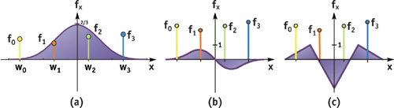

Figure 20-1三次B样条（Cubic B-Spline）和其导数

（a）f_1和过滤器权重w_i（x）的卷积
（b）三次样条曲线的一阶导数；（c）三次样条曲线的二阶导数

总而言之，本章介绍了一个能有效减少高阶纹理过滤需要的对输入纹理进行采样的次数。而前提是假设一个线性采样操作和一个最邻近采样一样快（至少不慢太多）。对三阶过滤器核（如三次B样条）曲线过滤器进行了优化，让它只需要非常少的线性纹理采样次数。

而事实上，片元着色器里的代码更像一个手工写的线性插值程序，而不是一个立方过滤器。

## 【关键词】

纹理过滤（Texture Filtering）

高阶过滤（Higher-Order Filtering）

B样条过滤（ B-Spline Filtering）

三次B样条（Cubic B-Spline）

快速递归三次卷积（Fast Recursive Cubic Convolution）

# 五、高质量反走样的光栅化（High-Quality Antialiased Rasterization）

## 【章节概览】

这章介绍了一种分块的超采样（supersampling）技术，使用任意宽度和高采样率的自定义过滤器，可以用来渲染任意分辨率的图像，以实现高质量的反走样光栅化。

## 【核心要点】

如上所言，文中介绍了一种分块的超采样（supersampling）技术，描述了如何把一个图像分成块（tiles，也称为buckers），用高分辨率渲染每一块，然后降采样（downsample，即收缩）每一块以达到最终分辨率，在即使构造的片元程序中使用分离式的降采样。文中也介绍了如何在图像分块之间进行正确的重叠和延伸的细节问题。文中提供的代码可以很轻易地集成到现有的渲染系统中，而不需要对现有的代码进行大的改动。

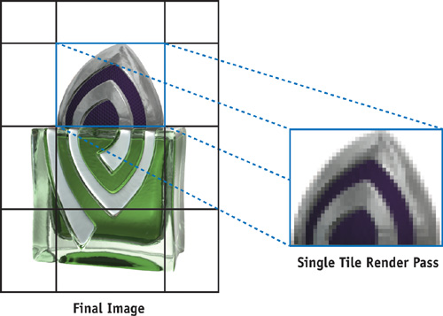

图 将图像分解成tiles

对于最终图像的每一个分块，总体算法如下：

（1）把图像块渲染到一个大的离屏缓冲区中，调整投影矩阵，以现有的渲染代码把3D几何体用高采样率的分辨率渲染出来。

（2）把高分辨率的图像块用一个分离式的过滤器核进行降采样，通过使用实时生成的片元程序在屏幕上渲染两个全屏的四边形来实现。

（3）把低分辨率的图像块累加到最终图像中，或通过把图像块的数据读回到CPU中，或使用另外一个片元程序把图像块加入到最终图像中。

## 【关键词】

反走样光栅化（Antialiased Rasterization）

分块超采样（tiled supersampling）

降采样（downsample）

# 六、快速预过滤线条（Fast Prefiltered Lines）

【章节概览】

这章介绍了一种简单有效的绘制反走样（抗锯齿）的线条的方法。

## 【核心要点】

本章提到的预过滤（Prefiltered）方法最早由McNamara, McCormack, 和 Jouppi
在2000年提出，其有诸多优点。首先该方法能使对称的过滤器在运行时提供固定的开销；其次，和一般硬件支持的过滤器不同，本方法不仅仅对只处于像素内的点进行采样，它能支持更大范围的过滤器，反走样的结果是硬件无关的，这保证了在不同GPU上能得到相同的反走样结果。

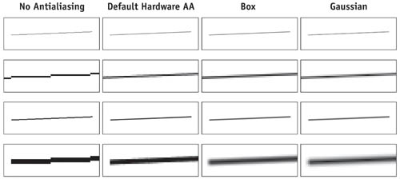

图 比较细线和粗线的反走样效果

总之，通过对从中心到边界不同距离处，把直线和过滤器的卷积结果进行卷积，并将结果存储在一个查找表中来预过滤线条。

该方法允许相同的运行时开销开使用任意的对称过滤器。而且，该算法只需要很少的CPU和GPU运算、带宽及存储空间开销。这些特性使这种算法对大部分的实时渲染程序都有实用价值，如绘制围栏、电线以及游戏中其他细长的物体。

## 【关键词】

预过滤线条（Prefiltered Lines）

反走样/抗锯齿（Antialiasing ）

线条的反走样（Antialiasing Lines）

# 七、Nalu Demo中的头发动画与渲染（Hair Animation and Rendering in the Nalu Demo）

## 【章节概览】

这章讲到了NVIDIA公司的Nalu Demo中的头发动画和渲染技术。

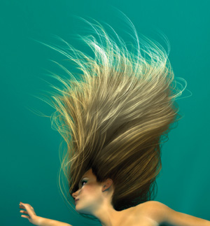

图 Nalu的头发

## 【核心要点】

NVIDIA的Nalu demo中，要达到的目标是渲染在水中飘动的金色长发。这章将介绍用于实时达到这个目标所用的技术。这种技术包含一个模拟头发运动系统，一个计算头发自阴影的阴影生成算法，还有一个通过每一串头发来模拟光线散射的发射模型。把这些结合起来，就能实时创建出极其真实的头发渲染效果。

在Nalu头发的后台着色处理中，有一个在每帧里生成头发几何和控制动感与碰撞的系统。基本上分成两部分：几何生成器和动感/碰撞的计算。

这些头发是由4095条用直线图元来渲染的独立发丝组成。仅仅在渲染头发上就使用了123000个顶点。让所有这些顶点通过动力学和碰撞检测就将慢得无法接受，因此使用受控发丝（control hair）：尽管需要渲染成千次，但Nalu的发型能通过一组每组几百根发丝来描述和控制。所有开销大的动态计算都运用于这些受控发丝。

头发的实时反射模型方面，选用了Marschner反射模型（2003）。而在渲染头发的阴影方面，采用了一种针对渲染头发阴影设计的近似阴影——非透明阴影图（Opacity
shadow maps）(Kim and Neumann 2001)。

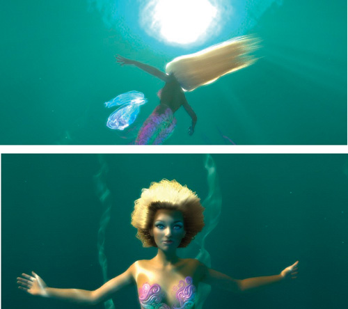

图 基于Marschner反射模型的头发渲染

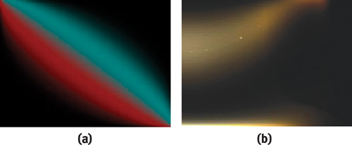

图 Marschner反射模型的查找纹理（Lookup Textures）

## 【关键词】

头发渲染（Hair Rendering）

头发动画（Hair Animation）

Marschner反射模型（Marschner Reflectance Model）

非透明阴影图（Opacity Shadow Maps）

# 八、使用查找表加速颜色变换（Using Lookup Tables to Accelerate Color
Transformations）

## 【章节概览】

这章中，介绍了一种利用三维查找表的算法来实时处理高分辨率图像的方法。

## 【核心要点】

在函数的计算开销很大，但是把计算结果缓存起来的开销比较小时，用查找表（Lookup
Table，简称LUT）优化这种函数的计算是一种非常好的方法。通过预先把一些常见输入的对应结果计算出来，花费不多的查找操作就能代替开销较大的运行时计算。如果查找比开头开始计算结果（或者有不断重复的相同输入）要快，那么使用查找表就能提高程序性能。

这章中，介绍了一种利用三维查找表的算法来实时处理高分辨率图像的方法。这种方法有非常出色的性能，它与执行颜色操作的数量无关，与颜色操作的复杂度也无关，即能独立于颜色运算的数量和颜色变换的复杂度。涉及到的主要实现有，把查找表映射到GPU、着色器的实现、系统集成以及把三维查找表扩展到高动态范围图像等步骤。

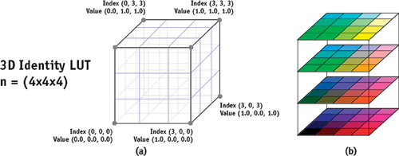

图 一个三维的查找表

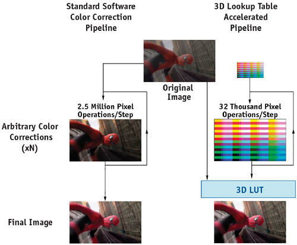

图
颜色校正流水线的比较。左图为传统的颜色校正流水线，通过发送低分辨率的图像来用作硬件加速的基础。右图为基于三维查找表的加速流水线。

## 【关键词】

查找表（Lookup Table， LUT）

颜色变换（Color Transformations）

 

# 九、实现改进的Perlin噪声（Implementing Improved Perlin Noise）

## 【章节概览】

这章上接《GPU Gems 1》中奥斯卡得主大牛Ken Perlin撰写的第五章[Perlin 2004]，《GPU Gems 1》中Ken
Perlin的章节讨论了该如何使用3D纹理实现过程噪声的快速近似，在这里描述一个改进噪声算法的GPU实现，其也完全符合用CPU进行实现。

## 【核心要点】

Perlin算法由两个主要阶段组成。

第一阶段在3D空间的每个整数（x，y，z）位置产生一个可重复的伪随机值。这可以以多种方式思想，但是Perlin的算法是使用一个散列函数。散列函数基于一个包含以随机顺序0\~255的整数排列的表（这张表可以在实现之间进行标准化，以便它们产生相同结果）。首先，这张表是基于位置的x坐标索引，然后将y坐标添加到表中该位置的值中，并使用结果再次在表中查一次表。然后为z坐标重复一次此过程。对z坐标重复此过程后，结果为每个可能的（x，y，z）位置的伪随机整数。

在算法中的第二阶段，将上述伪随机整数用于索引入一个3D梯度向量的表中。在“改良的”算法中，只用8个不同的梯度。这个梯度和噪声空间中的小数位置求点积可以得到一个标量值。最后的值通过空间中相邻8个点的噪声值插值获得。

Perlin改良的噪声算法是将CPU实现的排列表和梯度表存储在数组中。由于像素着色器当时不支持索引入常量存储器中，所以将这些表存储在纹理中，并使用纹理查找来访问它们。纹理寻址设为环绕（或重复）模式，因此不必考虑扩充表以避免索引越过数组结尾，如同在CPU实现中一样。

本章介绍了对像素着色器中的程序化噪声的实现。程序化噪声是丰富渲染外观一个重要的部分，而且它可以用于凹凸贴图和其他效果。

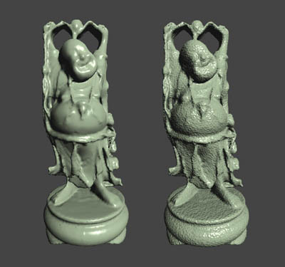

图 基于过程凹凸贴图的pixel着色器噪声

## 【关键词】

Perlin噪声（Improved Perlin Noise）

改进的Perlin噪声（Improved Perlin Noise）

# 十、高级高质量过滤（Advanced High-Quality Filtering）

## 【章节概览】

这章提供了一个基于GPU纹理过滤的实现细节和解决方案，其中重点放在纹理插值和反走样问题。

## 【核心要点】

本章阐述了一系列用于渲染纹理表面的高质量纹理过滤方法。这些技术可以用来执行许多常见的图像任务，如缩放、扭曲、锐化等。除此之外，用这些方法渲染简单的带纹理的3D场景时，还可以提供比图形硬件上的标准过滤器更好的渲染效果。

这章提到的技术是为质量最优的渲染而设计的，对高帧率的实时交互的程序和游戏来说依然显得昂贵，它更适合哪些渲染质量比速度更重要的程序，如医疗和科学图像、照片和电影编辑、图片合成、视频格式转换、专业3D渲染等。它也能用于游戏中与分辨率无关的纹理准备（预处理）当中。

另外，文中还介绍了一种适合用于增强重建图像的锐化过滤方法——冲击过滤冲击过滤（Shock Filtering），其能把纹理插值平滑地变换成陡峭的变换。

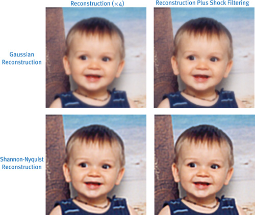

图 冲击过滤（Shock Filtering）方法

##【关键词】

GPU纹理过滤（GPU-based texture-filter）

纹理插值（ texture interpolation）

反走样/抗锯齿（antialiasing ）

冲击过滤（Shock Filtering）

# 十一、Mipmap层级测定（Mipmap-Level Measurement）

## 【章节概览】

这章讲到了使用“伪着色”（false-colored）的mipmap来代替原来的多级纹理进行场景渲染的方法。这样的mipmap每层都有不同的比对色。且这章展示了如何用GPU来自动化伪着色的整个过程。

## 【核心要点】

伪着色（false-colored）的mipmap，结合基于GPU的方法，可以高效地运用在游戏引擎中，可见的mip层次将被动态地反馈入引擎的纹理管理程序以减少内存消耗量。而所节省的内存可以用来增加别处的纹理分辨率，改进场景的华丽程度。Climax在Leviathan引擎中对地形场景使用了这项技术，使纹理空间节约了80%的内存，并没有任何可察觉的视觉质量损失。

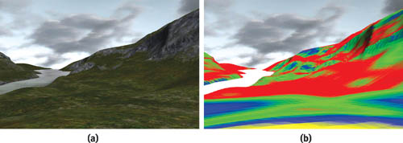

图 对地形场景应用伪着色mipmap方法

图（a）地形场景适用Climax的Leviathan引擎渲染（b）通过下图“定标纹理”，将原纹理替换成伪着色的mipmap后的效果。可以看到最高的层（黄颜色）几乎不可见。

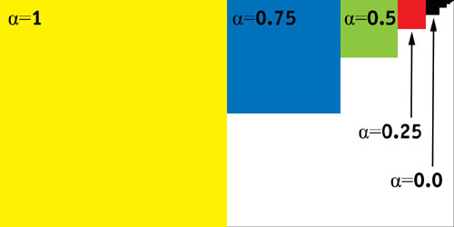

图 定标纹理

# 【关键词】

纹理管理（texture management）

伪着色（false-colored）

Mipmap层级（Mipmap-Level）

# 附录：配套资源与源代码下载

这里提供了一些，《GPU Gems 2》书本的配套资源以及源代码的下载地点。

PS:配套的不少工程中不仅包含完整的源码，也直接包含经过编译后的exe执行文件，可以直接运行后查看效果。

《GPU Gems 2》全文的Web版本：

<https://developer.nvidia.com/gpugems/GPUGems2/gpugems2_inside_front_cover.html>

也有维护一个名为“GPU-Gems-Book-Source-Code”的GitHub仓库，以备份《GPU
Gems》系列书籍相关的珍贵资源，《GPU Gems 2》的随书CD和源代码可以在这里下载到：

<https://github.com/QianMo/GPU-Gems-Book-Source-Code>

以上。

​
