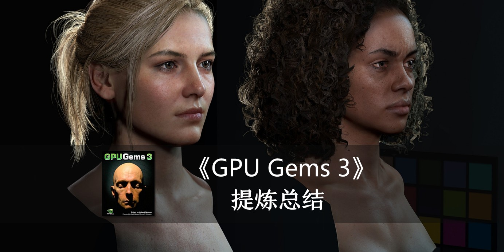

# 《GPU Gems 3》：真实感皮肤渲染技术总结

本文的知乎专栏版本：
https://zhuanlan.zhihu.com/p/42433792

《GPU Gems 3》中的“Chapter 14. Advanced Techniques for Realistic Real-Time Skin Rendering”一文，自其问世以来，都是皮肤渲染领域经常会被参考到的主要文章，可谓皮肤渲染技术的集大成者，奠基之作。

本文正好借着系列文章对《GPU Gems 3》中此章节进行提炼总结的机会，对真实感皮肤渲染技术，进行一个系统的总结和提炼。

除了对《GPU Gems 3》中该篇文章本身内容的提炼，本文也会在其基础上，结合这些年真实感皮肤渲染技术的发展，聊一些更多的东西。希望能对当前业界真实感皮肤渲染技术的现状与发展，做一个较为全面系统的总结与提炼。

 

# 快捷导航目录

<!-- TOC -->

- [《GPU Gems 3》：真实感皮肤渲染技术总结](#gpu-gems-3真实感皮肤渲染技术总结)
- [快捷导航目录](#快捷导航目录)
- [一、总览：皮肤渲染技术发展史](#一总览皮肤渲染技术发展史)
- [二、近年游戏与渲染业界中的真实感皮肤渲染画面](#二近年游戏与渲染业界中的真实感皮肤渲染画面)
- [三、皮肤渲染基础理论](#三皮肤渲染基础理论)
    - [3.1 镜面反射（specular reflection）](#31-镜面反射specular-reflection)
    - [3.2 次表面散射（Subsurface Scattering）](#32-次表面散射subsurface-scattering)
        - [3.2.1 半透明材质与次表面散射（Translucent and Subsurface Scattering）](#321-半透明材质与次表面散射translucent-and-subsurface-scattering)
        - [3.2.2 BRDF与BSSRDF](#322-brdf与bssrdf)
        - [3.2.3 BTDF与透射（Transmittance）](#323-btdf与透射transmittance)
        - [3.2.4 关于BRDF、BSSRDF、BTDF、BSDF的关系](#324-关于brdfbssrdfbtdfbsdf的关系)
- [四、扩散剖面（Diffusion Profile）](#四扩散剖面diffusion-profile)
        - [4.1 多级子（Multipole）方法](#41-多级子multipole方法)
    - [4.2 高斯和的扩散剖面（Sum-of-Gaussians Diffusion Profile）](#42-高斯和的扩散剖面sum-of-gaussians-diffusion-profile)
    - [4.3 对皮肤的扩散剖面高斯和拟合（A Sum-of-Gaussians Fit for Skin）](#43-对皮肤的扩散剖面高斯和拟合a-sum-of-gaussians-fit-for-skin)
- [五、常规基于模糊的次表面散射方法](#五常规基于模糊的次表面散射方法)
    - [5.1 纹理空间模糊（Texture Space Blur）](#51-纹理空间模糊texture-space-blur)
    - [5.2 屏幕空间模糊（Screen Space Blur）[2009]](#52-屏幕空间模糊screen-space-blur2009)
- [六、其他皮肤渲染技术](#六其他皮肤渲染技术)
    - [6.1 半透明阴影贴图（Translucent Shadow Maps，TSMs）](#61-半透明阴影贴图translucent-shadow-mapstsms)
    - [6.2 预积分的皮肤渲染（Pre-Integrated Skin Rendering）](#62-预积分的皮肤渲染pre-integrated-skin-rendering)
    - [6.3 SSSS,可分离的次表面散射（Separable Subsurface Scattering）](#63-ssss可分离的次表面散射separable-subsurface-scattering)
    - [6.4 路径追踪次表面散射（Path-Traced Subsurface Scattering）与光线步进（Ray Marching）](#64-路径追踪次表面散射path-traced-subsurface-scattering与光线步进ray-marching)
    - [6.5 Deferred Single Scattering](#65-deferred-single-scattering)
- [七、本文内容总结](#七本文内容总结)
    - [1. 皮肤渲染建模](#1-皮肤渲染建模)
    - [2. 镜面反射部分](#2-镜面反射部分)
    - [3. 次表面散射部分](#3-次表面散射部分)
        - [3.1 扩散剖面（Diffusion Profile）](#31-扩散剖面diffusion-profile)
        - [3.2 其他皮肤渲染技术](#32-其他皮肤渲染技术)
    - [4. 皮肤渲染技术发展史](#4-皮肤渲染技术发展史)
- [八、参考文献](#八参考文献)

<!-- /TOC -->

# 一、总览：皮肤渲染技术发展史

按时间分布，近20年皮肤主流渲染技术的发展可以总结列举如下：

-   次表面光照传输模型（Subsurface Light Transport, SSLT）[2001]

-   扩散剖面（Diffusion Profile） [2001]

-   偶极子（dipole） [2001]

-   纹理空间模糊（Texture Space Blur）[2003]

-   多极子（multipole） [2005]

-   屏幕空间模糊（Screen Space Blur）或屏幕空间次表面散射（SSSSS,Screen Space SubSurface Scattering）[2009]

-   路径追踪次表面散射（Path-Traced Subsurface Scattering）与光线步进（Ray Marching）[2009]

-   预积分的皮肤着色（Pre-Integrated Skin Shading）[2010]

-   可分离的次表面散射（SSSS,Separable Subsurface Scattering）[2015]

-   等

需要注意的是，上面列出的时间点，可能并不是严格意义上的该技术提出的时间点，而是该技术在论文或会议上被提出，被大众熟知，被引入到皮肤渲染技术中的时间点。

接下来，先看一些近年游戏中的真实感皮肤渲染画面，然后让我们从皮肤渲染的基础理论开始讲起，接着对上面列出的近20年皮肤主流渲染技术，按流派和内容分别进行介绍。

 

# 二、近年游戏与渲染业界中的真实感皮肤渲染画面

首先是一个《孤岛惊魂5》中的演示视频（预渲染），有不少人觉得渲染出的画面已经和真人出演的美剧非常相似，主要注意视频中人物的皮肤渲染表现：

<https://www.youtube.com/watch?v=4W450G_UR1Q>

接着，看一些近几年，游戏中真实感皮肤渲染的典型效果图。

从《孤岛惊魂5》开始：

图《孤岛惊魂5》中的皮肤渲染

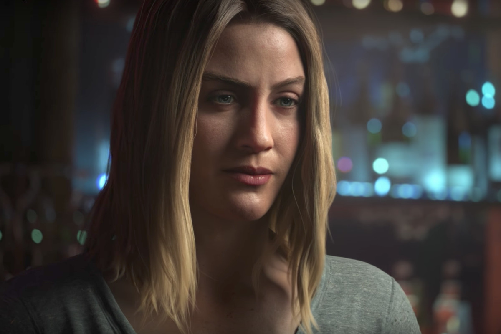

图《孤岛惊魂5》中的皮肤渲染

《神秘海域4》：

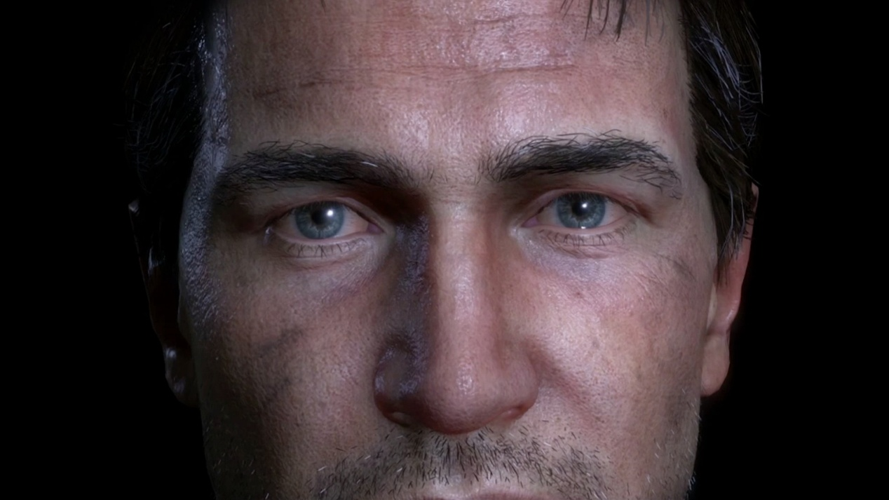

图 《神秘海域4》中的皮肤渲染

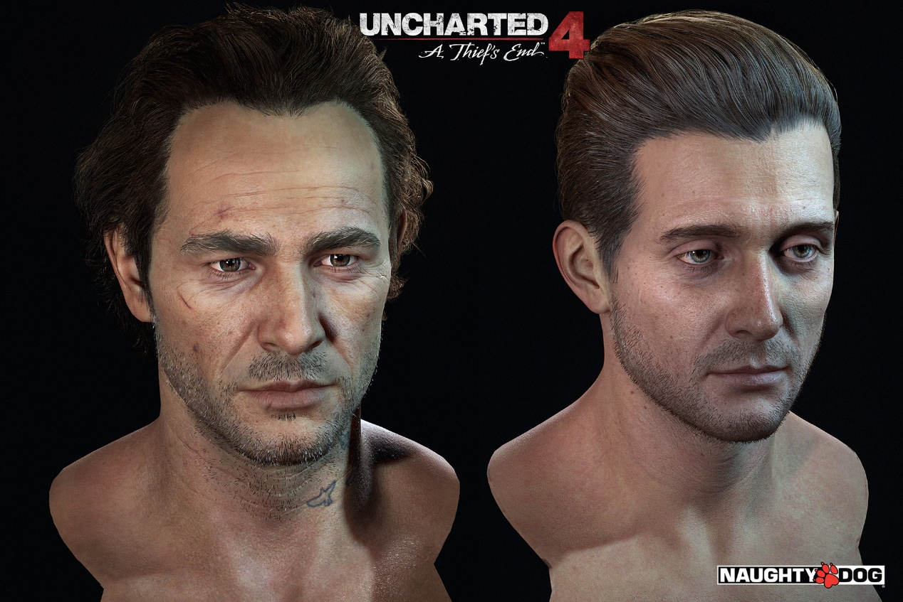

图 《神秘海域4》中的皮肤渲染

《底特律：变人》：

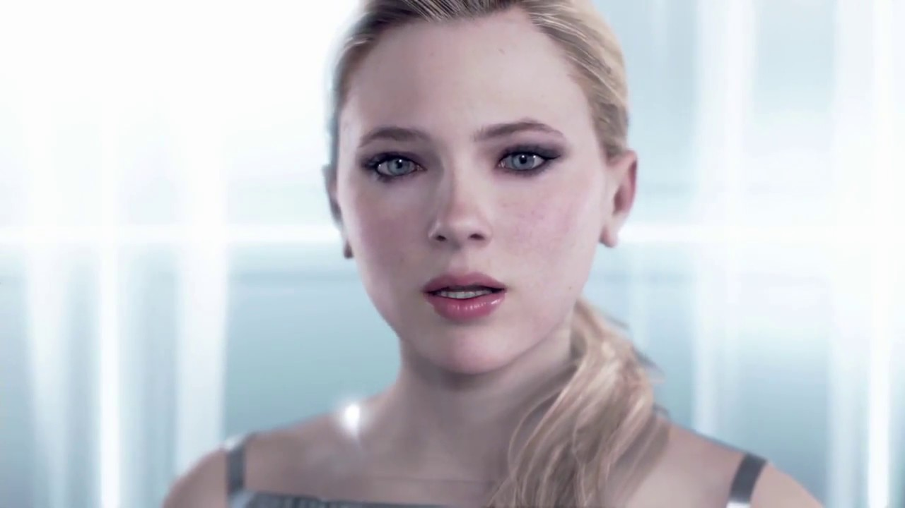

图 《底特律：变人》中的皮肤渲染

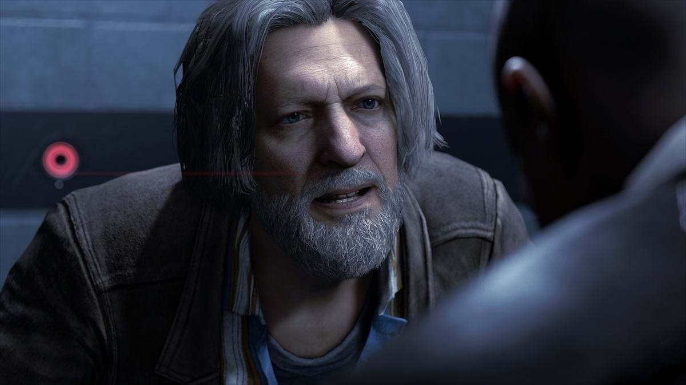

图 《底特律：变人》中的皮肤渲染

当然，怎么都不能少了今年的热门 UE4的Siren：

图 数字人Siren的皮肤渲染 @UE4

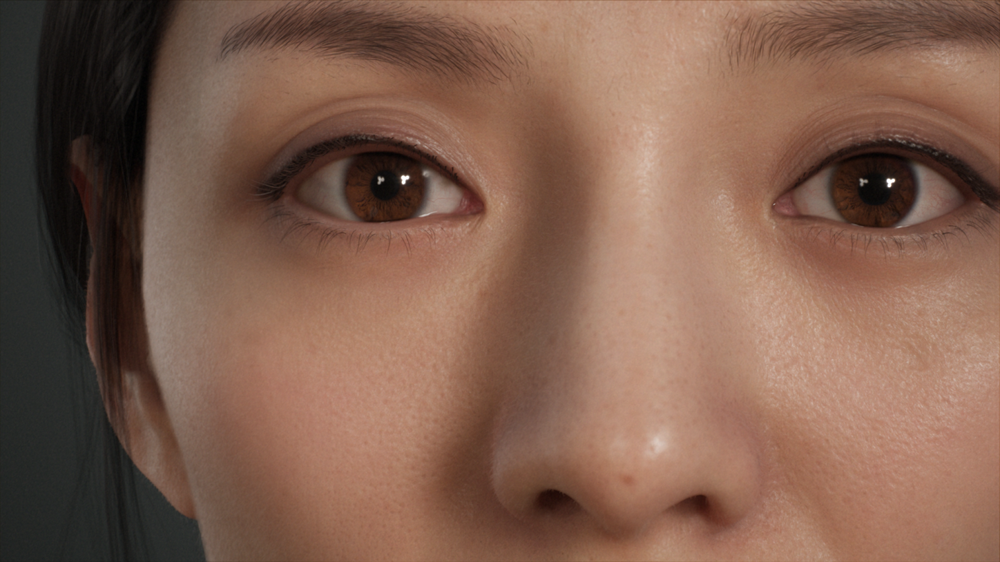

图 数字人Siren的皮肤渲染 @UE4

 

# 三、皮肤渲染基础理论

皮肤的渲染一直是渲染领域的难点之一：皮肤具有许多微妙的视觉特征，而观察者对皮肤的外观，特别是脸部的外观会非常敏感。皮肤的真实感渲染模型须包括皱纹，毛孔，雀斑，毛囊，疤痕等细节的模拟，而真实还原人体皮肤上的这些细节则是一个较大的挑战。

皮肤作为一种属性复杂的材质，其物理结构由多层结构组成，其表面油脂层主要贡献了皮肤光照的反射部分，而油脂层下面的表皮层和真皮层则主要贡献了的次表面散射部分。实验测试表明，光线接触到皮肤时，有大约94%被皮肤各层散射，只有大约6%被反射。

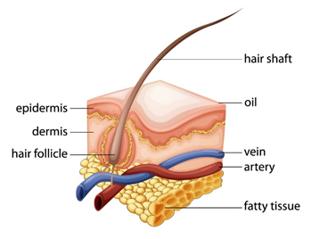

图 多层皮肤结构

对于皮肤而言，图形学研究学者们已经制作了使用多达五个独立层[Krishnaswamy and Baranoski 2004]的非常细致的模型，用于描述皮肤中的光学散射现象，而真正的皮肤则更加复杂。在医学上，仅皮肤表皮（epidermis）即被认为包含五个不同的层[Poirer 2004]。在这种复杂性下对散射进行模拟可能是过度和没有必要的，但是真实的渲染需要在油质层下面建模至少两个不同的层，因为至少有一个层要用于镜面反射（specular）项。Donner和Jensen[Donner and Jensen 2005]在2005年证明了单层模型不足以对真实感皮肤进行渲染，并展示了使用三层建模的改进方案。

图 多层皮肤模型

因为其具有半透明属性光线会在皮肤的表层进行多次散射，散射根据其通过的路径衰减，简单来说就是光线会扩散到周围，这对于表现皮肤的质感起到很大作用。

一般的材质采用BRDF(bidirectional reflectance distribution function)可以很好的表达，但皮肤往往需要更加复杂的建模，如BSSDF。

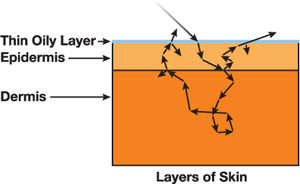

图 多层皮肤对光的散射和吸收

经验表明，皮肤渲染的渲染过程可由两个分量组成：

-   镜面反射（specular reflection）

-   次表面散射（subsurface scattering）

下文将对上述两个分量分别进行说明。

## 3.1 镜面反射（specular reflection）

镜面反射项（specular reflection）相对而言很简单，Gems 3中推荐Kelemen and
Szirmay-Kalos specular BRDF用于皮肤镜面反射项的计算。因为Kelemen and
Szirmay-Kalos specular
BRDF在实现和Torrance-Sparrow模型一样的渲染效果时，计算量要小得多。而现阶段基于物理的一些其他高光模型或改进方案也应该会得到不错的效果。

## 3.2 次表面散射（Subsurface Scattering）

### 3.2.1 半透明材质与次表面散射（Translucent and Subsurface Scattering）

首先，半透明材质在生活中无处不在：树叶、纸、蜡烛、牛奶、布料、生物的皮肤、贝壳、玛瑙等。事实上，几乎所有非金属物体都存在一定程度的次表面光传输(Subsurface Light Transport,SSLT)现象[Pharr 2010]，皮肤犹是如此。

上文提到，皮肤是一个多层结构，其表面油脂层主要贡献了皮肤光照的反射部分（约占入射光中的6%），而油脂层下面的表皮层和真皮层则主要贡献了次表面散射部分（约占入射光中的94%）。任何没有直接从皮肤表面反射出去的光，都会直接进入次表面层。这种占主要主导因素的次表面散射属性，决定了皮肤半透明的特征以及柔软的视觉外观。

入射光与皮肤进行交互的过程中，被部分吸收（获取颜色）并经过多次散射，返回并从进入点周围的3D邻域处表面离开。而有时光线会完全穿过像耳朵这样的薄薄区域，形成透射（Transmittance）。

图 多层皮肤对光的散射和吸收

对于次表面散射而言，Jensen在2001年的论文《A Practical Model for Subsurface Light Transport》是次表面材质建模最重要的一篇论文，推导了许多重要的物理公式，计算模型，渲染时的参数转换，以及测量了许多生活中常见材质的散射系数等等。大部分后来的论文都是在基于这篇文章中的理论的一些提升。

### 3.2.2 BRDF与BSSRDF

模拟半透明物体的方法有很多，例如Volumetric Path Tracing，Volumetric Photon Mapping和BSSRDF。

其中，BSSRDF（Bidirectional Surface Scattering Reflectance Distribution Function，双向表面散射反射分布函数）是目前的主流技术。

简单来说，传统的 BRDF 模型是 BSSRDF的一种简化。BSSRDF和BRDF的不同之处在于，BSSRDF可以指定不同的光线入射位置和出射的位置。

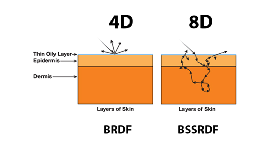

图： BRDF和BSSRDF与皮肤交互，光散射的对比

对于BRDF模型来说，一次反射光照的计算是在光线交点的法线半球上的球面积分。而对于BSSRDF来说，每一次反射在物体表面上每一个位置都要做一次半球面积分，是一个嵌套积分。

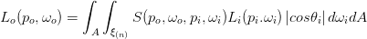

其中BSSRDF的定义是：

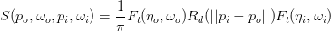

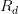只接受一个标量参数，这个参数的意义是光线入射位置和初设位置的曼哈顿距离。直观的理解就是，BSSRDF尝试将光线在物体表面内部中数千次的散射后所剩余的能量用一个基于入射点和出射点之间距离的函数去近似只接受一个标量参数，这个参数的意义是光线入射位置和初设位置的距离。也就是说，BSSRDF尝试将光线在物体表面内部中数千次的散射后所剩余的能量用一个基于入射点和出射点之间距离的函数去近似。这个近似则是基于几个假设:

1.    次表面散射的物体是一个曲率为零的平面

2.    这个平面的厚度，大小都是无限

3.    平面内部的介质参数是均匀的

4.    光线永远是从垂直的方向入射表面。

正因为有这些假设，所以很容易把出射光的强度与出射点和入射点之间的距离用一个函数去近似。而真实的模型往往比理想中要复杂的多，光线也有可能从各个角度入射，因此通过BSSRDF渲染的结果会有一定误差。

的求解非常复杂，通过近似可以得到：

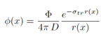

，有了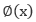可以得到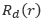

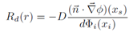

其中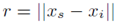，可以看出和自然指数是有关系的。

 

### 3.2.3 BTDF与透射（Transmittance）

有时光线会完全穿过像耳朵这样的薄薄区域。这是因为，光线经过一部分次表面后，最终没有在入射侧进行出射，而是从入射侧另一侧透出来，形成透射（Transmittance）。透过光的手会产生桔红色视觉外观同理。

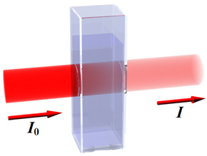

图 透射（Transmittance）的图示

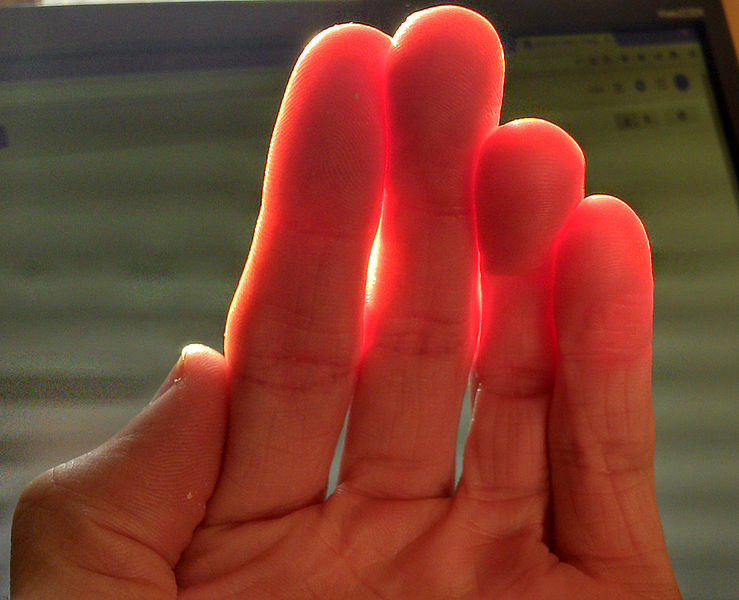

图 透过光的手会产生桔红色视觉外观

透射一般可以通过BTDF（双向透射分布函数， Bidirectional Transmittance Distribution Function）来描述。

这里先对几种分布函数的全称进行列举：

-   BRDF（双向反射分布函数，Bidirectional Reflectance Distribution Function）

-   BSSRDF（双向表面散射反射分布函数, Bidirectional Surface Scattering
    Reflectance Distribution Function）

-   BTDF（双向透射分布函数， Bidirectional Transmittance Distribution Function）

-   BSDF（双向散射分布函数，Bidirectional Scattering Distribution Function）

作为讲解内容，之前有一篇文章（<https://zhuanlan.zhihu.com/p/27014447>）关于BRDF、BTDF、BSDF的描述非常精炼，这边直接引用到本文中来。

当光线从一种介质射向另外一种介质时，根据其行进路线，可以被分为两个部分：

-   一部分光线在介质交界处发生了反射， 并未进入另外一种介质。

-   另外一部分光线则进入了另一种介质。

其中：

-   BRDF：反射部分的光照的辐射亮度（radiance）和入射光照的辐射照度（irradiance）的比例是一个和入射角度、出射角度相关的函数，这个函数就被称之为双向反射分布函数（BRDF）。

-   BTDF：相应的，穿越介质的那部分光照的辐射亮度和辐射照度的比例就被称之为双向透射分布函数（BTDF）。

-   BSDF：上述两部分出射光的辐射亮度总和和入射光的辐射照度的比例就被叫做双向散射分布函数（BSDF），即BSDF = BRDF + BTDF。

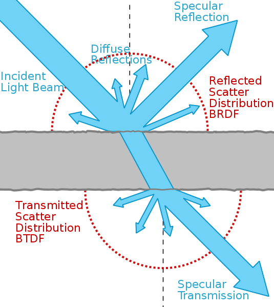

图 BSDF = BRDF + BTDF

透射的实现思路比较直观，可以分为三步：

（1）计算光照在进入半透明介质时的强度

（2）计算光线在介质中经过的路径长度

（3）根据路径长度和BTDF来计算出射光照的强度，这里BTDF可以简化为一个只和光线路径长度相关的函数

另外，《GPU Gems 3》中，有提到通过改进半透明阴影贴图（Translucent Shadow Maps，TSMs）来实现皮肤渲染中透射效果的模拟，下文中也有一些更详细的简略说明。

### 3.2.4 关于BRDF、BSSRDF、BTDF、BSDF的关系

另外，下面的这张PPT，能很好地解释BRDF、BSSRDF、BTDF、BSDF的关系。

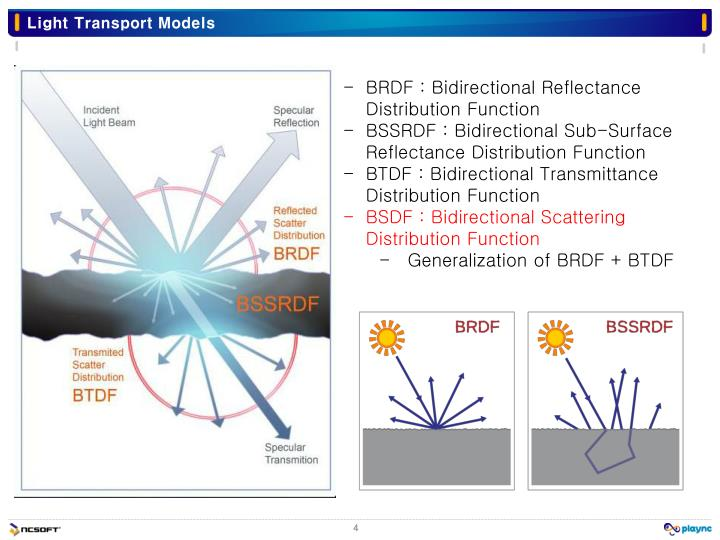

图 BRDF、BSSRDF、BTDF、BSDF的关系

下面用一些补充说明，理清几者的关系。

如上图，光线从一种介质射向另外一种介质时，有反射，次表面散射、透射三种交互形态：

-   其普通反射的行为用BRDF描述

-   其次表现散射的行为用 BSSRDF描述

-   其透射的行为用BTDF描述

四者的联系：

-   总体来说，BRDF 为 BSSRDF 的一种简化

-   BSDF可分为反射和透射分量两部分，即BSDF = BRDF + BTDF

# 四、扩散剖面（Diffusion Profile）

扩散剖面（Diffusion Profile），是早年间渲染次表面散射比较热门的大方向。

首先，需要说明一下关于Diffusion Profiles这个词翻译相关的问题。按Diffusion Profiles其含义，可被译作扩散剖面，也可以被译作漫散射剖面、漫射剖面。（Diffusion Profiles目前还没有比较公认和共识的翻译，大多数文章中都直接使用英文原词组，上述翻译仅供参考。文章后文尽量会统一使用“扩散剖面”作为Diffusion Profiles的翻译）另外，有些文献中会将Diffusion 写作Diffuse Scattering，他们都是表示漫散射，或一种光线在材质内部扩散的现象。

简而言之，扩散剖面（diffusion profile）是描述光线如何在半透明物体中进行扩散和分布的函数。

扩散剖面（diffusion profile），相当于一个记录次表面散射细节的“地图”。你可以将其理解为一个LUT，一个记录了答案的索引，或者一张标记高度的“高度图”，他会告诉你什么地方的像素，应该进行什么程度的模糊。

也有文章指出，可以简单理解扩散剖面为一张权重查找表，不同的皮肤渲染方法，通常就是对扩散剖面的不同近似。

需要说明的是，与扩散剖面（diffusion profile）的概念往往一起出现的偶极子（Dipole）方法，多级子（Multipole）方法，高斯和（Sum-of-Gaussians）方法，都是更好地描述出扩散剖面（Diffusion Profiles）的一些策略。

对于一个平面来说当激光垂直照射它时会发现光扩散到周围，形成以照射点为中心的光晕，如果物体的材质各项均匀其散射行为和角度无关，我们就可以用一个一维函数来描述，对于不同的材质RGB根据距离衰减的行为是不一样的。扩散剖面（diffusion profile）就是用来描述光在物体内部的扩散(散射)行为。

具体来说，扩散剖面（diffusion profile）提供了光在高度散射的半透明材质表面下散射方式的近似。具体而言，它描述了以下简单实验的结果。

在暗室中使用非常薄的白色激光束照亮一个平坦的表面。我们将看到激光束照射到表面的中心点周围的光晕，因为一些光线在表面下方并在附近返回，如下(a)所示。

扩散剖面（diffusion profile）告诉我们有多少光作为角度和激光中心距离的函数出现。
如果我们只考虑均匀材质，则散射在所有方向上都是相同的，即散射行为和角度无关。

而每种颜色都有自己的剖面，我们可以将其绘制成一维曲线，如下图(b)所示。

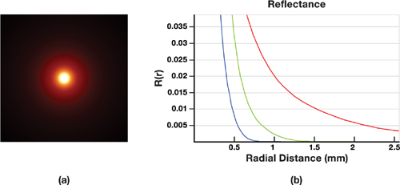

图 可视化扩散剖面（diffusion profile）

另外值得注意的是，RGB扩散的范围是不一样的，即扩散剖面具有很强的颜色相关性：红光比绿色和蓝色散射得更远。而正因为红色扩散得更远一些，所以耳朵和鼻子的部位通常会更有红彤彤的感觉。

时间方面，在2001年，Jensen 等人提出的散射模型[Jensen et al.2001]基于几种材质属性引入了扩散剖面，奠定了此流派的基础。并提出了使用偶极子（dipole）方程计算出扩散剖面的思想。

该方法简单地使用表面上两点之间的空间距离r来评估扩散剖面。其决定了任何两个位置之间的漫散射的描述问题，且无论两者之间的几何形状如何，如下图所示。

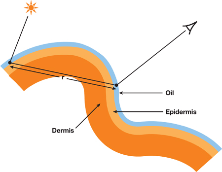

图 用r进行曲面中漫散射（diffusion）的有效估算

给定几种属性，可以使用偶极子（dipole）方程计算出扩散剖面。而偶极子（dipole）也是较为常见的评估扩散剖面的方法。而有些文献中提到的偶极子剖面（Dipole
Profiles），即是用偶极子（dipole）来表示的扩散剖面（diffusion profile）。

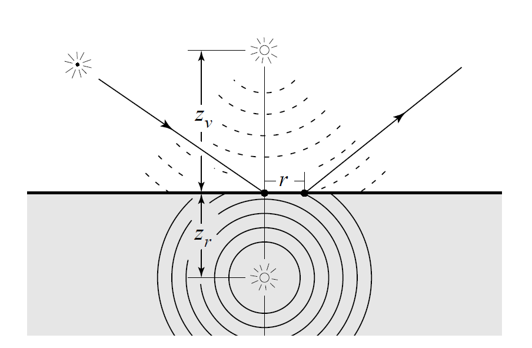

图 将入射光线转换为偶极子源以进行漫散射的近似[Jensen 2001]

我们可以将扩散剖面用R(r)表示。一般而言，所有材质都存在次表面散射现象，区别只在于其密度分布函数R(r)的集中程度，可分为两种情况：

（1）如果该函数的绝大部分能量都集中在入射点附近（r=0），就表示附近像素对当前像素的光照贡献不明显，次表面散射现象不明显，可以忽略，则在渲染时我们就用漫反射代替。

（2）如果该函数分布比较均匀，附近像素对当前像素的光照贡献明显，次表面散射现象明显，则需要单独计算次表面散射。

据此次表面散射的计算可以分为两个部分：

（1）对每个像素进行一般的漫反射计算。

（2）根据扩散剖面（diffusion profile）和（1）中的漫反射结果，加权计算周围若干个像素对当前像素的次表面散射贡献。

### 4.1 多级子（Multipole）方法

上文提到，与扩散剖面（diffusion
profile）概念往往一起出现的偶极子（Dipole），多级子（Multipole），高斯和（Sum-of-Gaussians），都是更好地描述出扩散剖面（Diffusion Profiles）的一些方案。

2005年，Donner and Jensen通过论文《Light Diffusion in Multi-Layered Translucent Materials》[Donner and Jensen 2005]将多极子（multipole）引入扩散剖面（diffusion profiles），来解决多层半透明材质中的次表面散射的渲染问题。

需要知道的是，多极子是偶极子概念的推广。在物理学中，对于含有2\^n个大小相等的点电荷，其中正负各半数，排列成有规律的点阵。n=0时，称为点电荷；n=1，称为偶极子（Dipole）；n=2，称为四极子；n≥2，统称为多极子（Multipole）。

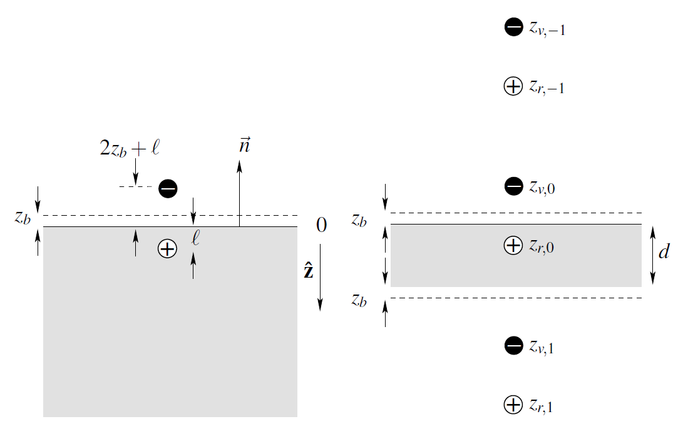

图 半无限几何图形的偶极子配置（左）和薄材质的多极子配置（右）[Donner 2005]

关于多极子拟合扩散剖面（diffusion profile）的具体方法，可见论文《Light Diffusion in Multi-Layered Translucent Materials》。<http://jbit.net/~sparky/layered.pdf>

 

## 4.2 高斯和的扩散剖面（Sum-of-Gaussians Diffusion Profile）

不难发现，对扩散剖面绘制的轮廓线类似于众所周知的高斯函数e^-r2，如下图。虽然单个高斯分布不能精确地拟合任何扩散分布，但实践表明多个高斯分布在一起可以对扩散剖面提供极好的近似。因此我们可以通过高斯函数来拟合扩散剖面（diffusion profile）。

图 可视化扩散剖面（diffusion profile）

高斯函数表达式具有一些很好的特性，在当我们将扩散剖面表示为高斯和时，可以让我们非常有效地求解次表面散射。高斯函数是独特的，因为它们同时是可分离的和径向对称的，并且它们可以相互卷积来产生新的高斯函数。

这需要从偶极子或基于多极子的扩散剖面映射到高斯和。

对于每个扩散分布R(r)，我们找到具有权重w i和方差v i的k个高斯函数：

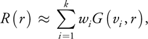

我们为高斯函数的方差v选择以下定义：

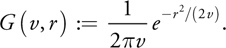

选择常数1/（2v）使得G（v，r）在用于径向2D模糊时不会使输入图像变暗或变亮（其具有单位脉冲响应（unit impulse response））。

下图显示了扩散剖面（diffusion profile）（用于大理石中绿光的散射）和使用两级和四级高斯和的近似剖面。

我们使用[Jensen et al. 2001]中提出的散射参数：

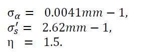

图 用多个高斯和拟合偶极子剖面（Dipole Profile）

从上图可以看出2个高斯函数和的Profile的误差较大，而4个高斯和已可以可以很好的逼近Profile。上述的四级高斯和为：

R(r) = 0.070G(0.036, r) + 0.18G(0.14, r) + 0.21G(0.91, r) + 0.29G(7.0, r)

那么，如何确定这几个高斯函数的权重和方差？

这是一个很经典的问题，即给定一条曲线，如何用多项式或者三角函数去拟合。

自己求解是十分费事的事情，对于经典的问题往往有现成的工具可以直接运用，不用重复造轮子。文章（<http://gad.qq.com/article/detail/33372>）提到，Matlab有一个曲线拟合功能即可满足我们的要求,详见<https://cn.mathworks.com/help/curvefit/gaussian.html>

Matlab通过高斯函数拟合最多可以支持8个高斯函数下图1，而下图2和图3是用2个高斯函数进行拟合的例子。

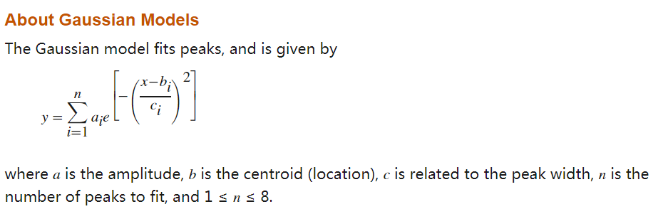

图 Matlab中多个高斯拟合

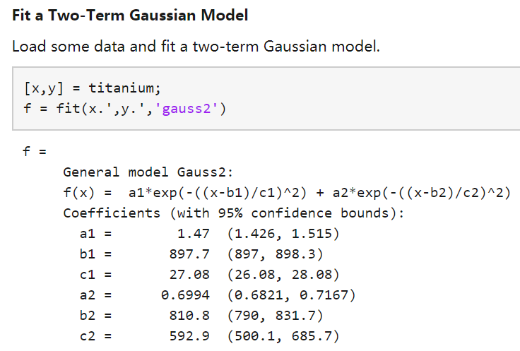

图 Matlab中多个高斯拟合

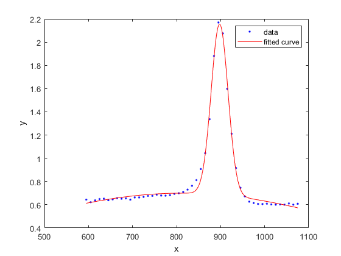

图 通过2个高斯函数拟合曲线的例子

 

## 4.3 对皮肤的扩散剖面高斯和拟合（A Sum-of-Gaussians Fit for Skin）

上一节讲到了高斯和的扩散剖面（Sum-of-Gaussians Diffusion Profile），并没有将其运用于皮肤渲染。本节将讲到适于皮肤的高斯和扩散剖面拟合。

对于大部分透明物体像牛奶，大理石一个偶极子剖面（Dipole Profile）足以，但是对于皮肤的这样多层结构的材质，用一个偶极子剖面（Dipole Profile）不能达到理想的效果。以一层材质配置一个偶极子（Dipole）的思路，通过3个偶极子（Dipole）即可模拟三层皮肤材质。实践表明，3个偶极子（Dipole）确实可以接近Jensen论文中的根据测量得出的皮肤Profile数据。

而3个偶极子剖面（Dipole Profile）通过前面描述的，对应于单个剖面的4个高斯函数不能得到很好的逼近结果。实践表明，通过6个高斯函数可以得到很不错的结果。

同样地，可以用前面提到的Matlab的拟合功能求解。下图是通过6个高斯拟合皮肤3层Dipole Profile的RGB对应的衰减，可以看出在红色比绿色和蓝色扩散的远得多。而得到的扩散曲线如下图所示。

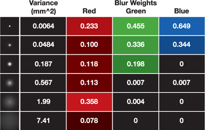

图 三层皮肤模型的高斯和参数

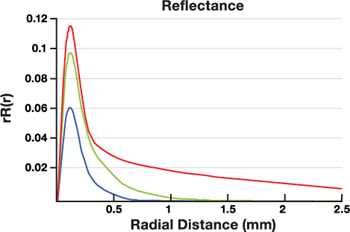

图 适用于三层皮肤模型的高斯和拟合

这里需要注意的是，对于每个剖面，高斯项的权重和为1.0。这是由于我们是用一个漫反射颜色贴图来定义皮肤的颜色，而不是用一个与之相符的漫反射剖面。通过对这些剖面进行归一化来得到白色的漫反射颜色，确保在散射入射光之后，平均结果能保持白色。然后，将此结果乘以基于图像的颜色贴图以获得肤色的色调即可。

 

# 五、常规基于模糊的次表面散射方法

 
上文提到，扩散剖面（diffusion profile）是描述光线如何在半透明物体中进行扩散和分布的函数。

得到扩散剖面（diffusion profile），即光线是如何在半透明物体中进行扩散和分布之后，接下来就可以对附近的像素进行加权求和，以模拟次表面散射的效果。

这个求和的过程其实是根据扩散剖面（diffusion profile）的指导，对周围像素进行模糊操作。按操作空间划分，比较常规的思路有两种：

-   纹理空间模糊（Texture Space Blur）

-   屏幕空间模糊（Screen Space Blur）

下面分别对其进行说明。

 

## 5.1 纹理空间模糊（Texture Space Blur）

纹理空间漫散射（Texture-Space Diffusion），也常被称作Texture Space Blur（纹理空间模糊）方法，由[Borshukov and Lewis 2003]提出，首次用于进行《黑客帝国》续集中的面部渲染技术，可用于精确模拟次表面散射（subsurface scattering）。

其言简意赅的思路是利用皮肤中散射的局部特性，通过使用纹理坐标作为渲染坐标展开3D网格，在2D纹理中有效地对其进行模拟。

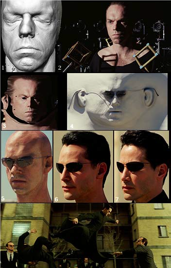

图 用于进行《黑客帝国》续集中的纹理空间模糊（Texture Space Blur）面部渲染方法

GDC 2007有一场来自NVIDIA的talk “Advanced Skin Rendering”（<http://developer.download.nvidia.com/presentations/2007/gdc/Advanced_Skin.pdf>.）中，其采用Texture Space Blur的技术即为Gems 3中所描述的方案。
该技术在纹理空间做了6次高斯模糊，每一次高斯模糊即为偶极子（Dipole）近似所采用的高斯模糊的参数，如下图。Texture Space Blur有一个很严重的问题，需要较高的纹理分辨率，这导致每做一次高斯模糊都是很费的操作，更不要说6次高斯模糊。虽然当年这个技术取得的效果很不错，但是因为计算量等原因，很少有人实际去采用。

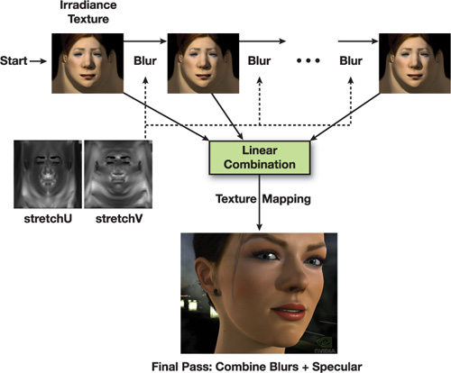

图 《GPU Gems 3》中改进的纹理空间模糊（Texture Space Blur）算法综述

纹理空间模糊（Texture Space Blur）进行Combining blurs操作的相关shader源码如下：

    float3 diffuseLight= nonBlur* E1 * pow( diffuseCol, 0.5 );
    float3 blur2tap = f3tex2D( blur2Tex, v2f.c_texCoord.xy );
    float3 blur4tap = f3tex2D( blur4Tex, v2f.c_texCoord.xy );
    float3 blur8tap = f3tex2D( blur8Tex, v2f.c_texCoord.xy );
    float3 blur16tap = f3tex2D( blur16Tex, v2f.c_texCoord.xy );
    float3 blur32tap = f3tex2D( blur32Tex, v2f.c_texCoord.xy );
    diffuseLight+= blur2 * blur2tap.xyz;
    diffuseLight+= blur4 * blur4tap.xyz;
    diffuseLight+= blur8 * blur8tap.xyz;
    diffuseLight+= blur16 * blur16tap.xyz;
    diffuseLight+= blur32 * blur32tap.xyz;
    // renormalize weights so they sum to 1.0
    float3 norm2 = nonBlur+ blur2 + blur4 + blur8 + blur16 + blur32;
    diffuseLight/= norm2;
    diffuseLight*= pow( diffuseCol, 0.5 );

 

## 5.2 屏幕空间模糊（Screen Space Blur）[2009]

屏幕空间模糊（Screen Space Blur） [Jimenez et al.2009]也常被称作屏幕空间次表面散射（Screen Space SubSurfaceScattering）或SSSSS。

图 基于屏幕空间模糊（Screen Space Blur）的渲染图

和纹理空间模糊（Texture Space Blur）不同的是，屏幕空间模糊（Screen Space Blur）[Jimenez et al.2009]只需要处理被Stencil标记过的Skin的像素，极大地降低了Blur的像素数目，可以很大程度的提升性能。

该算法计算过程中会对Stencil标记出的皮肤材质进行若干次卷积操作，卷积核的权重由扩散剖面（Diffusion Profile）确定，而卷积核的大小则需要根据当前像素的深度（d(x,y)）及其导数（dFdx(d(x,y))和dFdy(d(x,y))）来确定。

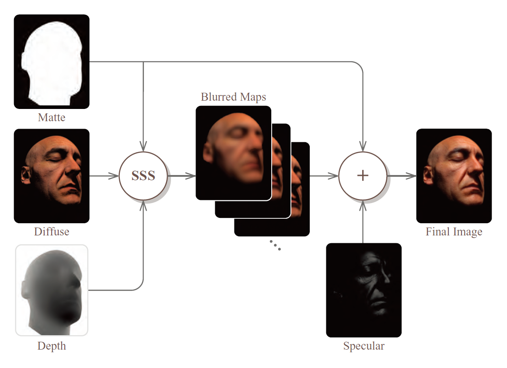

图 屏幕空间模糊（Screen Space Blur）思路概览

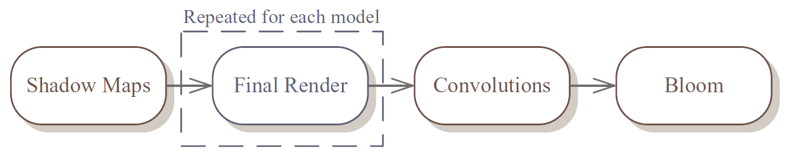

图 屏幕空间模糊（Screen Space Blur）算法流程图

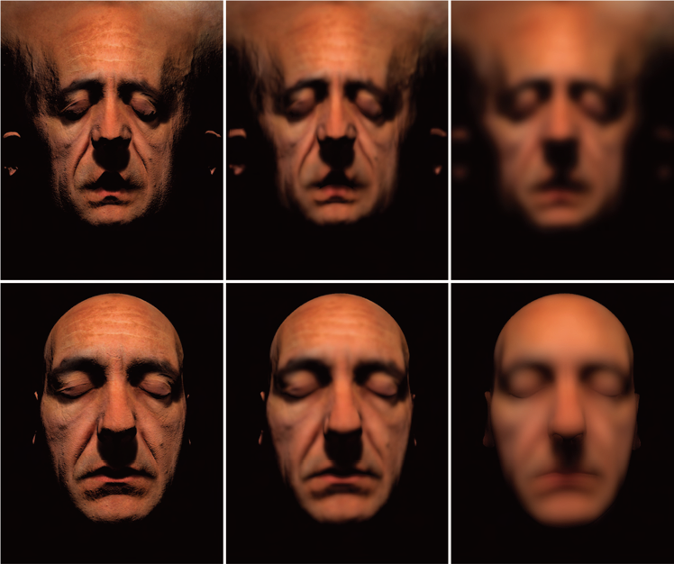

图 屏幕空间模糊（Screen Space Blur）

从原理上来说，图像空间的方法和屏幕空间的方法很大程度上都是通过周边像素对当前像素的光照贡献来实现次表面散射的效果，区别不大，方法之间的区别通常只是在于如何去近似扩散剖面（Diffusion Profile），在性能和效果上有一个较好平衡。

 

# 六、其他皮肤渲染技术

 

## 6.1 半透明阴影贴图（Translucent Shadow Maps，TSMs）

 

《GPU Gems 3》中，通过改进半透明阴影贴图（Translucent Shadow Maps，TSMs）来实现皮肤渲染中透射效果的模拟。

考虑到纹理空间漫散射（Texture-Space Diffusion）不会很好地模拟在三维空间中非常接近的表面光通过透光区域的完全透射效果（如耳朵和鼻孔处桔红色的视觉外观）。《GPU Gems 3》改进了半透明阴影贴图（Translucent Shadow Maps，TSMs）(Dachsbacher and Stamminger 2004)方法，通过重用卷积过的辐照度纹理，能非常有效地估计通过较薄区域的漫散射。

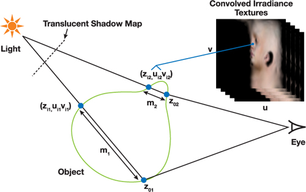

图 《GPU Gems 3》中改进的Translucent Shadow Maps思路图示

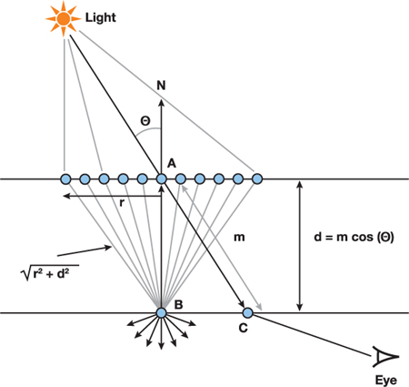

图 在阴影区域计算透射光

另外，ShaderX7中的“Real-Time Subsurface Scattering using Shadow Maps”也介绍了类似的使用阴影贴图（Shadow Maps）来进行次表面散射模拟的方法。

图 Rendering AAA-QualityCharacters of Project ‘A1’ @ NDC 2016 Programming Session

 

## 6.2 预积分的皮肤渲染（Pre-Integrated Skin Rendering）

预积分的皮肤着色（Pre-Integrated Skin Shading）在《GPU Pro 2》的” Pre-Integrated Skin Shading”一文中正式进入大家的视野。

预积分的皮肤着色（Pre-Integrated Skin Shading），其实是一个从结果反推实现的方案，具体思路是把次表面散射的效果预计算成一张二维查找表，查找表的参数分别是dot(N,L)和曲率，因为这两者结合就能够反映出光照随着曲率的变化。

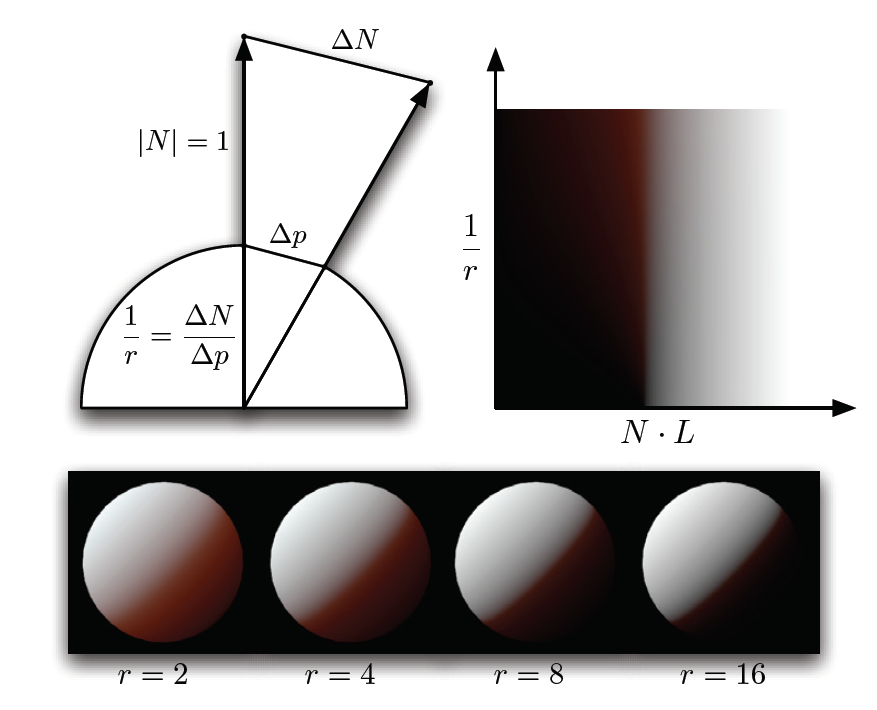

图 预积分的皮肤着色（Pre-Integrated Skin Shading）思路。

【左上：如何使用两个导数同时绘制曲率的图示。|右上：通过曲率（球面半径）和N·L索引的漫反射BRDF查找（The diffuse BRDF lookup）|下：使用该方法新的BRDF查找不同r大小，渲染渲染出的多个球体】

通过下图可以发现，预积分方法和纹理空间漫散射（Texture-Space
Diffusion）的渲染效果在肉眼观察下看不出太多差别，但预积分的方法计算量却要小很多。

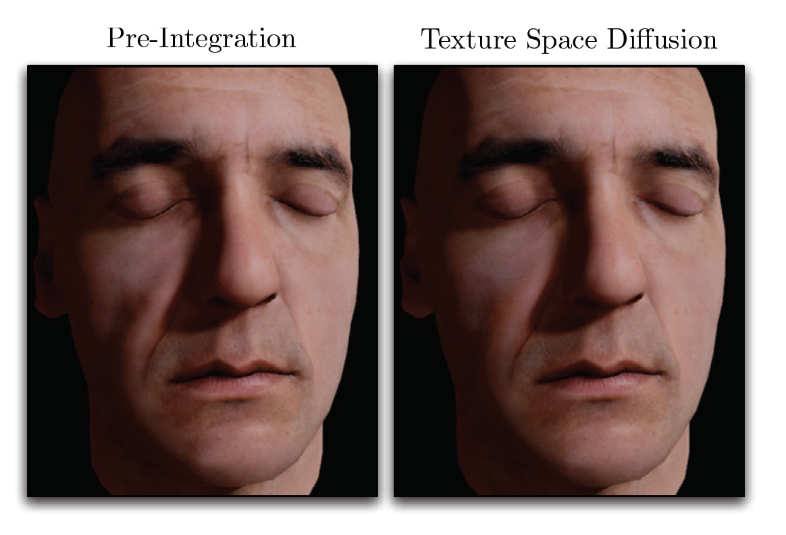

图 预积分方法对比纹理空间漫散射（Texture-Space Diffusion）方法

另外，最终幻想15中的人物皮肤渲染，大量用到了预积分的皮肤渲染，如下图中的希德妮的渲染效果：

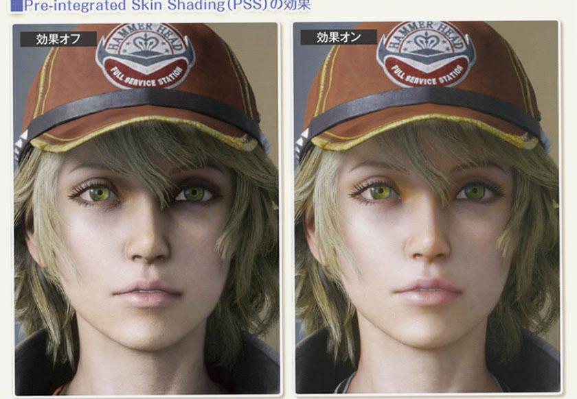

图 基于 Pre-Integrated Skin Shading的《最终幻想15》希德妮渲染图【（左图：离线渲染，右图：游戏实时渲染】

关于预积分的皮肤渲染（Pre-Integrated Skin Rendering）的更多细节，可见《GPU Pro 2》中的” Pre-Integrated Skin Shading”一文。

 

## 6.3 SSSS,可分离的次表面散射（Separable Subsurface Scattering）

次表面散射（Subsurface Scattering）被称作SSS,或3S，而可分离的次表面散射（Separable Subsurface Scattering）常被人称为SSSS，4S, Separable Subsurface Scattering，是Jimenez等人在2015年提出的新的渲染算法[Jimenez J 2015]。

上文提到，虽然屏幕空间模糊（Screen Space Blur）性能比纹理空间模糊（Texture Space Blur）好很多，但做6个高斯模糊需要12个pass(一个高斯模糊对应一个水平和垂直模糊)。

暴雪的Jorge等人，在GDC 2013,的talk“Next-Generation Character Rendering”（<http://www.iryoku.com/images/posts/next-generation-life/Next-Generation-Character-Rendering-Teaser.pptx>）中首次展示了SSSS的渲染图，并在2015年通过论文正式提出了SSSS(可分离的次表面散射,Separable Subsurface Scattering)(<http://iryoku.com/separable-sss>)其通过水平和垂直卷积2个Pass来近似，效率更进一步提升，这是目前游戏里采用的主流技术，Unreal也对其进行了集成。

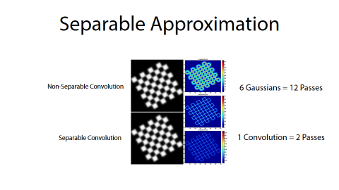

图 可分离卷积（Separable Convolution）

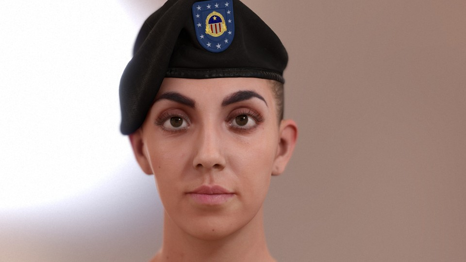

图 基于SSSS的皮肤渲染 @GDC 2013 by Activision-Blizzard

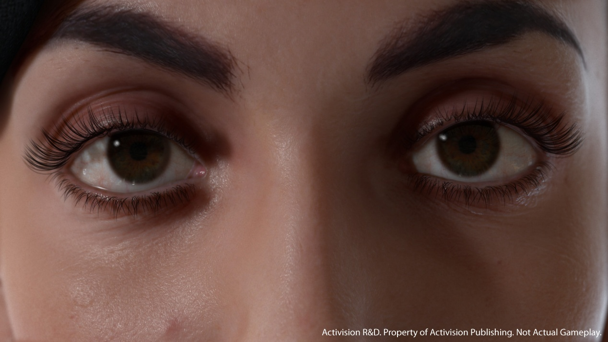

图 基于SSSS的皮肤渲染 @GDC 2013 by Activision-Blizzard

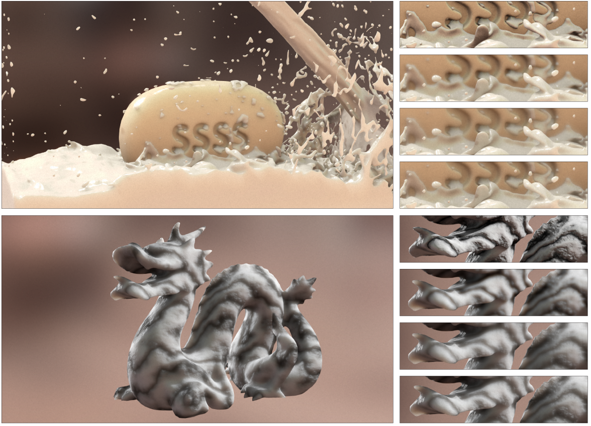

图《Separable Subsurface Scattering》论文中的SSSS渲染图 @ COMPUTER GRAPHICS forum 2015 by Jorge Jimenez @ Activision-Blizzard

 

## 6.4 路径追踪次表面散射（Path-Traced Subsurface Scattering）与光线步进（Ray Marching）

路径追踪次表面散射（Path-Traced Subsurface Scattering）也有时被称作蒙特卡洛次表面散射（Monte-Carlo Subsurface Scattering），区别于传统的光栅图形学，是光线追踪流派下模拟次表面散射的技术，主要是基于Ray Marching的实现方案。

在SIGGRAPH 2017 Course: Physically Based Shading in Theory and Practice课程系列“Volumetric Skin and Fabric Shading at Framestore”（http://blog.selfshadow.com/publications/s2017-shading-course/walster/s2017_pbs_volumetric_notes.pdf）中有一些介绍，不过需要注意，此Course有些血腥，配图中一些是异形类生物的皮肤渲染。

同样，NDC 2016 Programming Session中的Rendering AAA-QualityCharacters of Project‘A1’也有一些介绍，相关PPT页面如下：

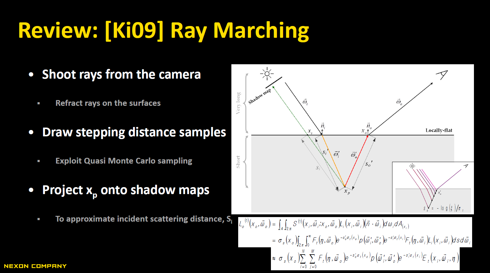

图 Rendering AAA-QualityCharacters of Project ‘A1’ @ NDC 2016 Programming Session

另外一些参考资料也包括：

<https://www.cs.rpi.edu/~cutler/classes/advancedgraphics/S11/final_projects/white.pdf>

 

## 6.5 Deferred Single Scattering

另外也有结合延迟渲染的方法，具体思路可见如下PPT:

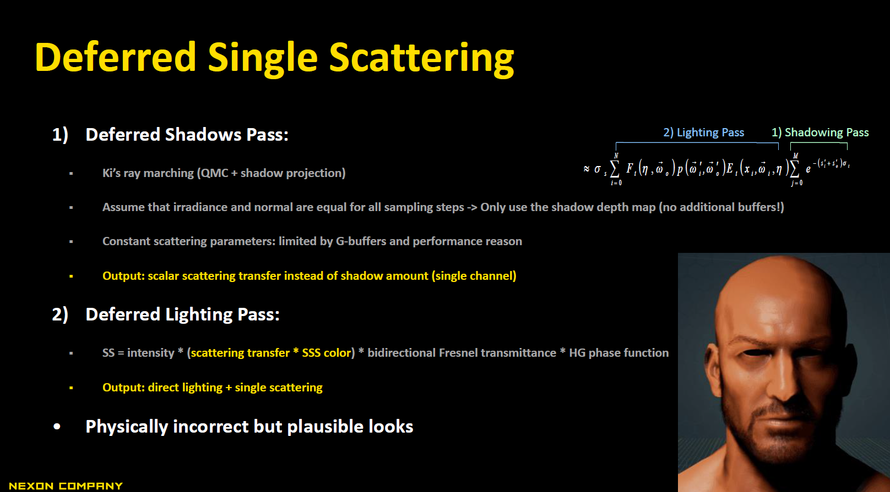

图 Rendering AAA-QualityCharacters of Project ‘A1’ @ NDC 2016 Programming Session

 

# 七、本文内容总结

 

以下是本文内容总结，即对当前业界真实感皮肤渲染技术的总结：

## 1. 皮肤渲染建模

皮肤渲染过程可由两个分量组成：

-   镜面反射（specular reflection）

-   次表面散射（subsurface scattering）

其中，次表面散射的真实感模拟，是主要难点。

## 2. 镜面反射部分

镜面反射（specular reflection）部分的光照模型可用：

-   Torrance-Sparrow

-   Kelemen and Szirmay-Kalos specular BRDF

-   基于物理其他高光模型

其中，Kelemen and Szirmay-Kalos specular BRDF在实现和Torrance-Sparrow模型一样的渲染效果时，计算量要小得多。

## 3. 次表面散射部分

### 3.1 扩散剖面（Diffusion Profile）

扩散剖面（diffusion profile）是描述光线如何在半透明物体中进行扩散和分布的函数。

与扩散剖面常一起出现的三种方法：

-   偶极子（Dipole）方法

-   多级子（Multipole）方法

-   高斯和（Sum-of-Gaussians）方法

它们都是更好地描述出扩散剖面（Diffusion Profiles）的一些策略。得到扩散剖面（diffusion profile），即光线是如何在半透明物体中进行扩散和分布之后，接下来就可以对附近的像素进行加权求和，以模拟次表面散射的效果。这个求和的过程其实是根据扩散剖面（diffusion profile）的指导，对周围像素进行模糊操作。

按操作空间划分，常规的思路有两种：

-   纹理空间模糊（Texture Space Blur）

-   屏幕空间模糊（Screen Space Blur），也称屏幕空间次表面散射（Screen Space
    SubSurfaceScattering）或SSSSS。

### 3.2 其他皮肤渲染技术

-   半透明阴影贴图（Translucent Shadow Maps，TSMs）

-   预积分的皮肤渲染（Pre-Integrated Skin Rendering）

-   可分离的次表面散射（SSSS , Separable Subsurface Scattering）

-   路径追踪次表面散射（Path-Traced Subsurface Scattering）与光线步进（Ray Marching）

-   Deferred Single Scattering

## 4. 皮肤渲染技术发展史

-   次表面光照传输模型（Subsurface Light Transport, SSLT）[2001]

-   扩散剖面（Diffusion Profile） [2001]

-   偶极子（dipole） [2001]

-   纹理空间模糊（Texture Space Blur）[2003]

-   多极子（multipole） [2005]

-   屏幕空间模糊（Screen Space Blur）或屏幕空间次表面散射（SSSSS,Screen Space SubSurface Scattering）[2009]

-   路径追踪次表面散射（Path-Traced Subsurface Scattering）与光线步进（Ray Marching）[2009]

-   预积分的皮肤着色（Pre-Integrated Skin Shading）[2010]

-   可分离的次表面散射（SSSS,Separable Subsurface Scattering）[2015]

-   等

 

# 八、参考文献
 

[1] Eugene d'Eon, David Luebke. GPU Gems 3, Chapter 14. Advanced Techniques for Realistic Real-Time Skin Rendering,2007.(<https://developer.nvidia.com/gpugems/GPUGems3/gpugems3_ch14.html>)

[2] Volumetric Skin and Fabric Shading at Framestore , SIGGRAPH 2017 Course: Physically Based Shading in Theory and Practice（<http://blog.selfshadow.com/publications/s2017-shading-course/walster/s2017_pbs_volumetric_notes.pdf>）

[3] Rendering AAA-QualityCharacters of Project ‘A1’, NDC 2016 Programming Session

[4] <https://zhuanlan.zhihu.com/p/27014447>

[5] <http://gad.qq.com/article/detail/33372>

[6] <http://gad.qq.com/article/detail/33373>

[7] <http://www.iryoku.com/next-generation-life>

[8] <https://gamingbolt.com/final-fantasy-15s-in-game-characters-are-as-impressive-as-the-pre-rendered-ones>

[9] Next-Generation-Character-Rendering ，GDC 2013 <http://www.iryoku.com/images/posts/next-generation-life/Next-Generation-Character-Rendering-Teaser.pptx>

[10] <https://en.wikipedia.org/wiki/Bidirectional_scattering_distribution_function>

[11] Jensen, Henrik Wann, Stephen R. Marschner, Marc Levoy, and Pat Hanrahan.2001. "A Practical Model for Subsurface Light Transport." In Proceedings of SIGGRAPH 2001.

[12]  Matlab online doc <https://cn.mathworks.com/help/curvefit/gaussian.html>

[13]d'Eon, Eugene."NVIDIA Demo Team Secrets–Advanced Skin Rendering." Presentation at Game Developer Conference 2007. <http://developer.download.nvidia.com/presentations/2007/gdc/Advanced_Skin.pdf>.

[14]  Jorge Jimenez, Károly Zsolnai, etc. Separable Subsurface Scattering(<http://iryoku.com/separable-sss/>)

[15]   Faceworks <https://github.com/NVIDIAGameWorks/FaceWorks>

[16]  Colin Barre-Brisebois,Marc Bouchard. 2011. Presentation at Game Developer
Conference 2011. <https://colinbarrebrisebois.com/2011/03/07/gdc-2011-approximating-translucency-for-a-fast-cheap-and-convincing-subsurface-scattering-look/>

[17] Jorge Jimenez, David Whelan, etc. Real-Time Realistic Skin Translucency(<http://iryoku.com/translucency/downloads/Real-Time-Realistic-Skin-Translucency.pdf>)

[18] orge Jimenez. Next Gen Character Rendering GDC 2013.

[19] Koki Nagano，Graham Fyffe，Oleg Alexander etc."Skin Microstructure Deformation with Displacement Map Convolution"<http://gl.ict.usc.edu/Research/SkinStretch/>

[20] RenderDoc. <https://github.com/baldurk/renderdoc>

[21] Per H. Christensen, Brent Burley. "Approximate Reflectance Profiles for Efficient Subsurface Scattering" Presentation at SIGGRAPH 2015. <https://graphics.pixar.com/library/ApproxBSSRDF/paper.pdf>

[22] Per H. Christensen, Brent Burley. "Approximate Reflectance Profiles for Efficient Subsurface Scattering" Presentation at SIGGRAPH 2015. <https://graphics.pixar.com/library/ApproxBSSRDF/paper.pdf>
