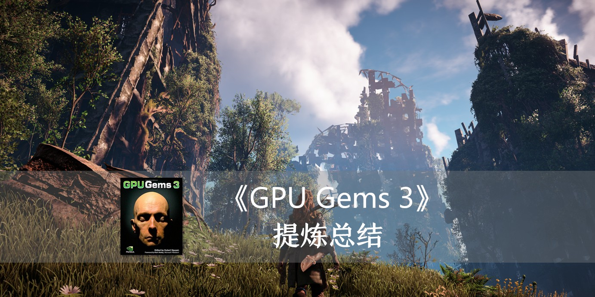
1
# 《GPU Gems 3》全书核心内容提炼总结

本文的知乎专栏版本：
https://zhuanlan.zhihu.com/p/44671434

本文是【GPU精粹与Shader编程】系列的第七篇文章。文章盘点、提炼和总结了《GPU Gems 3》全书总计28章的核心内容。

同时这篇文章，也是【GPU精粹与Shader编程】系列文章对GPU精粹三部曲中《GPU Gems》、《GPU Gems 2》、《GPU Gems 3》组成的第一部曲的完结篇，是一个短暂的里程碑。

下篇文章，将开启全新的《GPU Pro》系列。

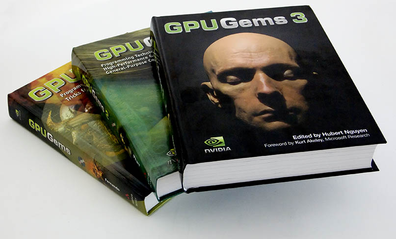

 

 # 快捷导航目录
<!-- TOC -->

- [《GPU Gems 3》全书核心内容提炼总结](#gpu-gems-3全书核心内容提炼总结)
- [《GPU Gems 3》全书核心框架脉络思维导图](#gpu-gems-3全书核心框架脉络思维导图)
- [第一部分 几何体（Geometry）](#第一部分-几何体geometry)
- [第1章 使用GPU 生成复杂的程序化地形（Generating Complex Procedural Terrains Using the GPU）](#第1章-使用gpu-生成复杂的程序化地形generating-complex-procedural-terrains-using-the-gpu)
    - [【关键词】](#关键词)
    - [【内容盘点】](#内容盘点)
- [第2章 群体动画渲染（Animated Crowd Rendering）](#第2章-群体动画渲染animated-crowd-rendering)
    - [【关键词】](#关键词-1)
    - [【内容盘点】](#内容盘点-1)
- [第3章 DirectX 10 中的混合形状（DirectX 10 Blend Shapes: Breaking the Limits）](#第3章-directx-10-中的混合形状directx-10-blend-shapes-breaking-the-limits)
    - [【关键词】](#关键词-2)
    - [【内容盘点】](#内容盘点-2)
- [第4章 下一代SpeedTree 渲染（Next-Generation SpeedTree Rendering）](#第4章-下一代speedtree-渲染next-generation-speedtree-rendering)
    - [【关键词】](#关键词-3)
    - [【内容盘点】](#内容盘点-3)
- [第5章 通用自适应网格细化（Generic Adaptive Mesh Refinement）](#第5章-通用自适应网格细化generic-adaptive-mesh-refinement)
    - [【关键词】](#关键词-4)
    - [【内容盘点】](#内容盘点-4)
- [第6章 对于树的GPU 生成程序式风动画（GPU-Generated Procedural Wind Animations for Trees）](#第6章-对于树的gpu-生成程序式风动画gpu-generated-procedural-wind-animations-for-trees)
    - [【关键词】](#关键词-5)
    - [【内容盘点】](#内容盘点-5)
- [第7章 GPU 上基于点的变形球可视化（Point-Based Visualization of Metaballs on a GPU）](#第7章-gpu-上基于点的变形球可视化point-based-visualization-of-metaballs-on-a-gpu)
    - [【关键词】](#关键词-6)
    - [【内容盘点】](#内容盘点-6)
- [第二部分 光照和阴影（Light and Shadows）](#第二部分-光照和阴影light-and-shadows)
- [第8章 区域求和的差值阴影贴图（Summed-Area Variance Shadow Maps）](#第8章-区域求和的差值阴影贴图summed-area-variance-shadow-maps)
    - [【关键词】](#关键词-7)
    - [【内容盘点】](#内容盘点-7)
- [第9章 使用全局光照交互电影级重光照（Interactive Cinematic Relighting with Global Illumination）](#第9章-使用全局光照交互电影级重光照interactive-cinematic-relighting-with-global-illumination)
    - [【关键词】](#关键词-8)
    - [【内容盘点】](#内容盘点-8)
- [第10章 在可编程GPU 上实现并行分割阴影贴图（Parallel-Split Shadow Maps on Programmable GPUs）](#第10章-在可编程gpu-上实现并行分割阴影贴图parallel-split-shadow-maps-on-programmable-gpus)
    - [【关键词】](#关键词-9)
    - [【内容盘点】](#内容盘点-9)
- [第11章 基于层次化的遮挡剔除和几何着色器的高效鲁棒阴影体（Efficient and Robust Shadow Volumes Using Hierarchical Occlusion Culling and Geometry Shaders）](#第11章-基于层次化的遮挡剔除和几何着色器的高效鲁棒阴影体efficient-and-robust-shadow-volumes-using-hierarchical-occlusion-culling-and-geometry-shaders)
    - [【关键词】](#关键词-10)
    - [【内容盘点】](#内容盘点-10)
- [第12章 高质量的环境光遮蔽（High-Quality Ambient Occlusion）](#第12章-高质量的环境光遮蔽high-quality-ambient-occlusion)
    - [【关键词】](#关键词-11)
    - [【内容盘点】](#内容盘点-11)
- [第13章 后处理特效：体积光散射（Volumetric Light Scattering as a Post-Process）](#第13章-后处理特效体积光散射volumetric-light-scattering-as-a-post-process)
    - [【关键词】](#关键词-12)
    - [【内容盘点】](#内容盘点-12)
- [第三部分 渲染（Rendering）](#第三部分-渲染rendering)
- [第14章 用于真实感实时皮肤渲染的高级技术（Advanced Techniques for Realistic Real-Time Skin Rendering）](#第14章-用于真实感实时皮肤渲染的高级技术advanced-techniques-for-realistic-real-time-skin-rendering)
    - [【关键词】](#关键词-13)
    - [【内容盘点】](#内容盘点-13)
- [第15章 可播放的全方位动作捕捉（Playable Universal Capture）](#第15章-可播放的全方位动作捕捉playable-universal-capture)
    - [【关键词】](#关键词-14)
    - [【内容盘点】](#内容盘点-14)
- [第16章 Crysis 中植被的程序化动画和着色（Vegetation Procedural Animation and Shading in Crysis）](#第16章-crysis-中植被的程序化动画和着色vegetation-procedural-animation-and-shading-in-crysis)
    - [【关键词】](#关键词-15)
    - [【内容盘点】](#内容盘点-15)
- [第17章 鲁棒的多镜面反射和折射（Robust Multiple Specular Reflections and Refractions）](#第17章-鲁棒的多镜面反射和折射robust-multiple-specular-reflections-and-refractions)
    - [【关键词】](#关键词-16)
    - [【内容盘点】](#内容盘点-16)
- [第18章 用于浮雕映射的松散式锥形步进（Relaxed Cone Stepping for Relief Mapping）](#第18章-用于浮雕映射的松散式锥形步进relaxed-cone-stepping-for-relief-mapping)
    - [【关键词】](#关键词-17)
    - [【内容盘点】](#内容盘点-17)
- [第19章 《Tabula Rasa》中的延迟着色（Deferred Shading in Tabula Rasa）](#第19章-tabula-rasa中的延迟着色deferred-shading-in-tabula-rasa)
    - [【关键词】](#关键词-18)
    - [【内容盘点】](#内容盘点-18)
- [第20章 基于GPU的重要性采样（GPU-Based Importance Sampling）](#第20章-基于gpu的重要性采样gpu-based-importance-sampling)
    - [【关键词】](#关键词-19)
    - [【内容盘点】](#内容盘点-19)
- [第四部分 图像效果（Image Effects）](#第四部分-图像效果image-effects)
- [第21章 真实Impostor（True Impostors）](#第21章-真实impostortrue-impostors)
    - [【关键词】](#关键词-20)
    - [【内容盘点】](#内容盘点-20)
- [第22章 在GPU上烘焙法线贴图（Baking Normal Maps on the GPU）](#第22章-在gpu上烘焙法线贴图baking-normal-maps-on-the-gpu)
    - [【关键词】](#关键词-21)
    - [【内容盘点】](#内容盘点-21)
- [第23章 高速的离屏粒子（High-Speed, Off-Screen Particles）](#第23章-高速的离屏粒子high-speed-off-screen-particles)
    - [【关键词】](#关键词-22)
    - [【内容盘点】](#内容盘点-22)
- [第24章 保持线性的重要性（The Importance of Being Linear）](#第24章-保持线性的重要性the-importance-of-being-linear)
    - [【关键词】](#关键词-23)
    - [【内容盘点】](#内容盘点-23)
- [第25章 在GPU 上渲染矢量图（Rendering Vector Art on the GPU）](#第25章-在gpu-上渲染矢量图rendering-vector-art-on-the-gpu)
    - [【关键词】](#关键词-24)
    - [【内容盘点】](#内容盘点-24)
- [第26章 通过颜色进行对象探测：使用 GPU 进行实时视频图像处理（Object Detection by Color: Using the GPU for Real-Time Video Image Processing）](#第26章-通过颜色进行对象探测使用-gpu-进行实时视频图像处理object-detection-by-color-using-the-gpu-for-real-time-video-image-processing)
    - [【关键词】](#关键词-25)
    - [【内容盘点】](#内容盘点-25)
- [第27章 后处理效果：运动模糊（Motion Blur as a Post-Processing Effect）](#第27章-后处理效果运动模糊motion-blur-as-a-post-processing-effect)
    - [【关键词】](#关键词-26)
    - [【内容盘点】](#内容盘点-26)
- [第28章 实用景深后期处理（Practical Post-Process Depth of Field）](#第28章-实用景深后期处理practical-post-process-depth-of-field)
    - [【关键词】](#关键词-27)
    - [【内容盘点】](#内容盘点-27)
- [【GPU精粹三部曲】 Part I • 尾声](#gpu精粹三部曲-part-i-•-尾声)

<!-- /TOC -->

 

# 《GPU Gems 3》全书核心框架脉络思维导图

以下是《GPU Gems 3》全书核心章节的思维导图：

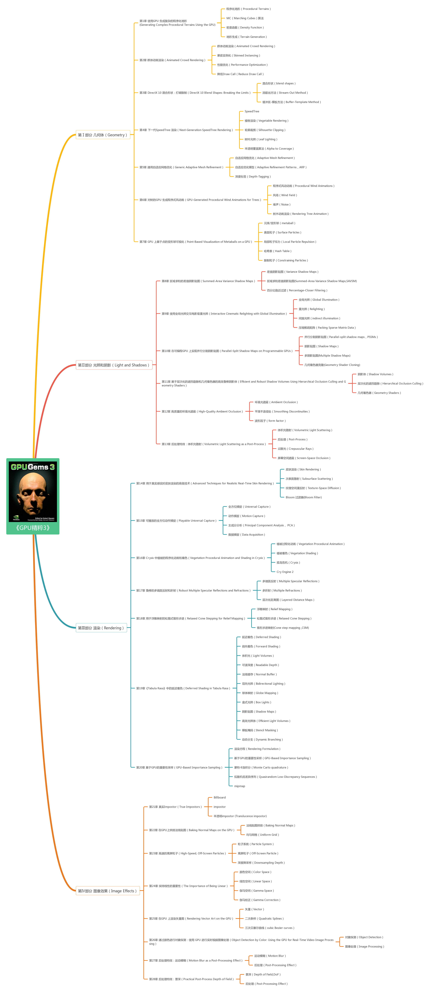

**PS:原图过大，网页端可能显示并不清晰，建议将原图另存为本地图片后查看**

另外值得注意的几点是：
- 《GPU Gems 3》出版于2007年8月12日，全书共1008页，41章。
- 《GPU Gems 3》的英文原版已经由NVIDIA开源： https://developer.nvidia.com/gpugems/GPUGems3/gpugems3_pref01.html
- 本文对《GPU Gems 3》全书渲染相关的前28章进行了盘点、提炼与总结。
- 本文正文可以作为一个文字版的索引，方便后续通过此文，对《GPU Gems 3》一书的内容进行快速分类检索与对应章节的深入阅读与研究。

OK，下面开始正文。

 

# 第一部分 几何体（Geometry）

 

# 第1章 使用GPU 生成复杂的程序化地形（Generating Complex Procedural Terrains Using the GPU）

## 【关键词】

- 程序化地形（Procedural Terrains）

- MC（Marching Cubes）算法

- 密度函数（Density Function）

- 地形生成（Terrain Generation）

## 【内容盘点】

作为《GPU精粹3》的开篇章节，这章给出了一个使用GPU在交互速率下生成复杂程序化三维地形的方法。同样也展示了如何对地形进行纹理映射和着色、如何为地形创建LOD的方案。

阅读这一章时让我想起了近年两款大作《地平线：黎明》和《幽灵行动：荒野》在GDC 2017上关于程序化地形和植被生成的分享：

-   GPU-Based Procedural Placement in Horizon Zero Dawn，GDC
    2017（https://d1z4o56rleaq4j.cloudfront.net/downloads/assets/GDC2017_VanMuijden_GPUBasedProceduralPlacementInHorizonZeroDawn.pptx?mtime=20170307152717）

-   Ghost Recon Wildlands: Terrain Tools and Technology，GDC 2017（https://666uille.files.wordpress.com/2017/03/gdc2017_ghostreconwildlands_terrainandtechnologytools-onlinevideos1.pptx）

这边是《幽灵行动：荒野》在GDC 2017程序化地形技术演示视频：

<https://www.youtube.com/watch?v=JIQ_YVwUONA>

而这边是《地平线：黎明》中Decima Engine程序化地形和植被生成的演示视频：

<https://www.youtube.com/watch?v=t258ePDlxtQ>

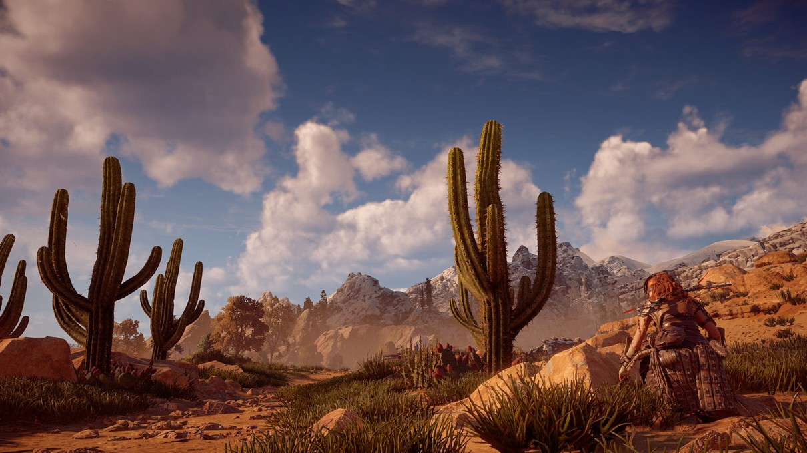

图《地平线：黎明》的地形和植被程序化生成

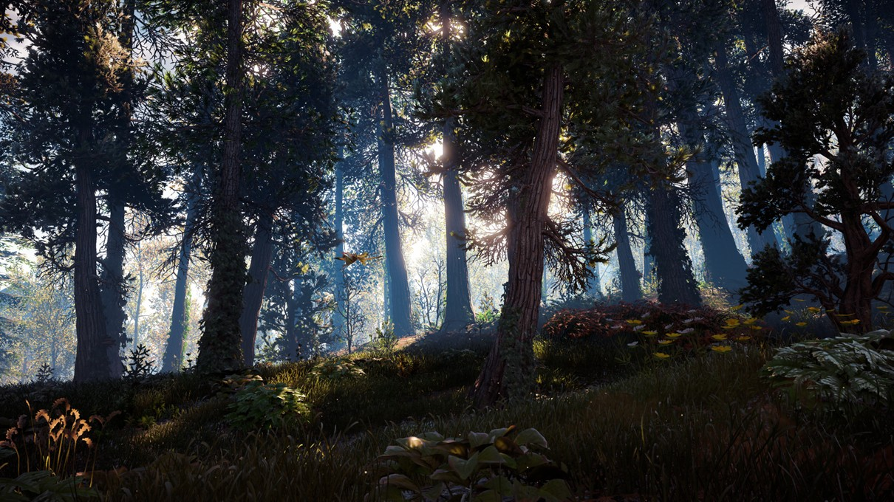

图《地平线：黎明》的地形和植被程序化生成

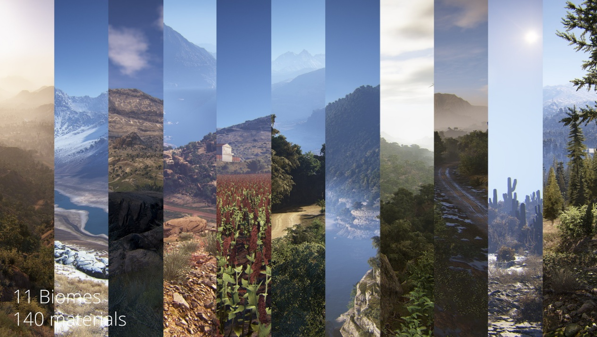

图 《幽灵行动：荒野》中程序化地形的11+种生物群系和140+种地表材质

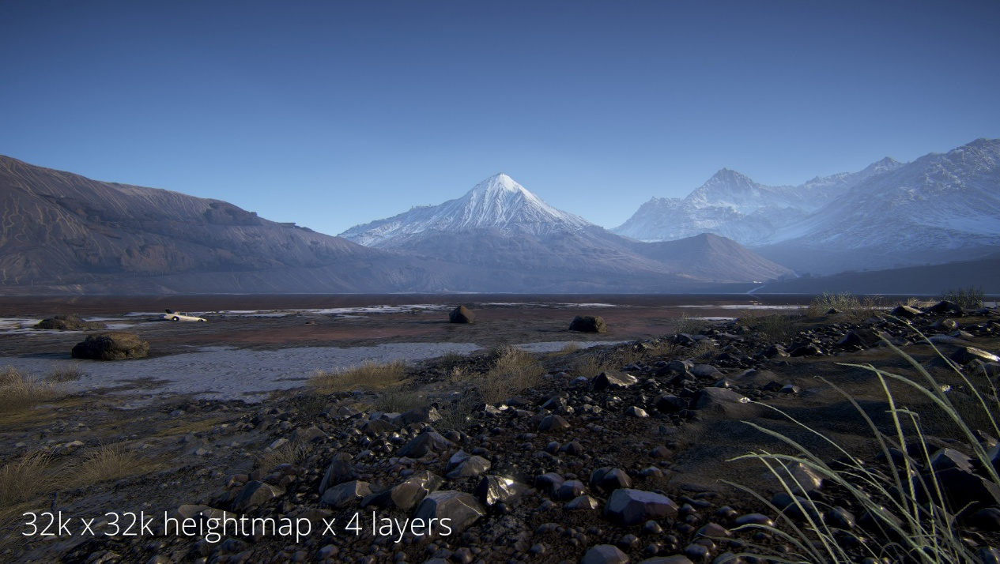

图 《幽灵行动：荒野》的 32k x 32k x 4 layer的程序化地形大世界，让其成为了育碧至今地形最大的开放世界游戏

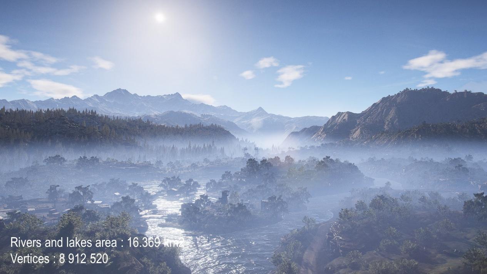

图 《幽灵行动：荒野》中基于程序化地形的16平方公里的湖面，河流和溪流面积

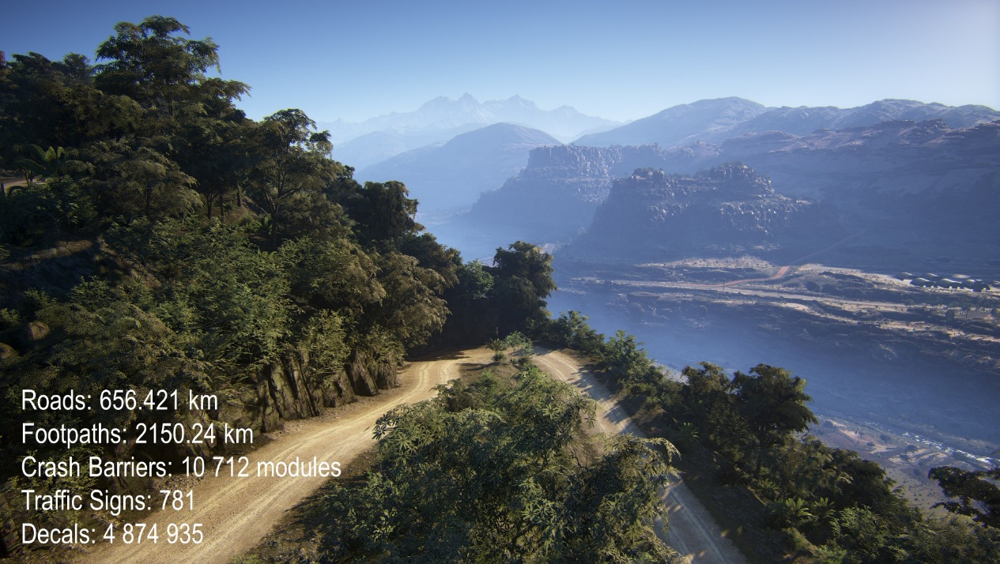

图 《幽灵行动：荒野》中基于程序化地形的超过600公里的道路

OK,回到本章内容中来。

传统上，程序化地形（Procedural Terrains）受限于CPU生成的，且用GPU进行渲染的高度场（Height Fields）。然而，生成复杂地形是一项高度并行化的任务，CPU的串行处理本质上不适合完成这项工作。此外，CPU生成高度场的方法也无法很好地提供吸引人的地形特征（如凹洞和凸起物）。为了交互级的帧率下生成高度复杂的程序化地形，文中使用GPU和来进行此项工作。

理论上，地形表面可以用单个函数完整地进行描述，这个函数被称为密度函数（Density Function）。

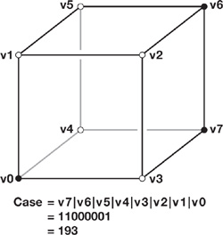

图 一个已知8个棱角密度（Density）值的体素（黑点指示了棱角处的正密度值，每个棱角为一个“位（byte）”，用于在总共8位的情况中进行判断）

使用GPU来生成地形块所需要的多边形，这个块进行进而被细分成 32 x 32 x 32的小单元，即体素（Voxel）。Marching Cubes算法允许我们在一个单独的体素中生成正确的多边形。MarchingCubes(简称MC)算法是面绘制算法中的经典算法，它是W.Lorensen等人于1987年提出来的一种体素级重建方法。MarchingCubes算法也被称为“等值面提取”(Isosurface Extraction)算法。

下图阐述了应用Marching Cube算法的一些基本案例

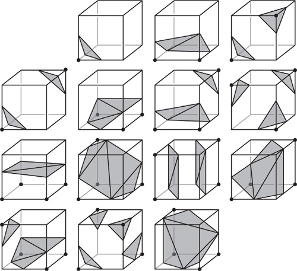

图 Marching Cubes算法的14种基本案例（而其他的240种案例仅仅是这些纪元案例的旋转或翻转的结果）

首先，将世界划分成无限数目的等大小立方体块。在世界空间坐标系中，每个立方块的大小为1 x 1 x 1。然而，每个块中有32\^3个体素可能含有多边形。为当前视锥可视的地形块动态划分一个含有大约300个顶点缓冲区的内存池，较近的块具有较高的优先权。随着用户的移动，当有新的地形块进入视锥时，视锥中被裁掉的最远或最近的顶点缓冲区便被回收，以被新的块使用。

而对每一帧的渲染思路方面，文中的思路是，根据位置从前到后对所有的顶点缓冲区进行排序（它们的包围盒已知）。然后生成所有需要的立方体块，剔除最远距离的块。最终，按照从前到后的顺序绘制各个块，以免在被遮挡的块上进行像素着色时浪费大量的时间。

本章英文原书全文传送门：

<https://developer.nvidia.com/gpugems/GPUGems3/gpugems3_ch01.html>

 

# 第2章 群体动画渲染（Animated Crowd Rendering）

## 【关键词】

- 群体动画渲染（Animated Crowd Rendering）

- 蒙皮实例化（Skinned Instancing）

- 性能优化（Performance Optimization）

- Draw Call降低（Reduce Draw Call）

## 【内容盘点】

使用实例化(instancing)方法，可以通过减少Draw Call、状态更改以及缓冲区更新的数量来减少CPU的开销。

这章中展示了如何使用顶点纹理存取的DirectX 10实例化来实现基于硬件调色板的蒙皮角色（skinned characters）。这个demo同时使用了常量缓冲区和系统变量SV_InstanceID来有效实现这项技术。在Intel Core 2 Duo GeForce 8800 GTX显卡上，能够实现大约1万个人物拥有不同的动画和蒙皮。

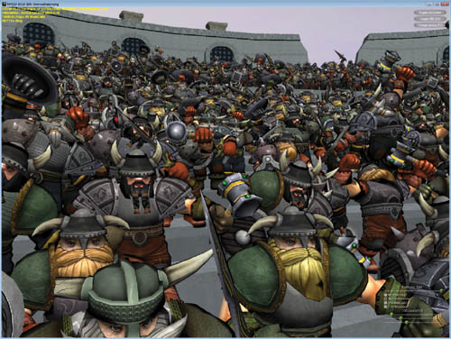

图 动画人群的特写镜头

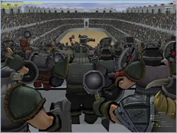

图 使用Skinned实例化的群体动画

蒙皮实例化（Skinned
instancing）这项技术适用于实时地渲染数量庞大且彼此独立的动画人物。它使用顶点纹理存取来读取存储在单一纹理中的动画数据，也使用了SV_InstanceID来索引包含了示例数据的常量缓冲区（位置和动画时间）。而配合一个简单易行的LOD系统，能在合适距离上有更高的多边形/光照细节。

图 Instancing Basics

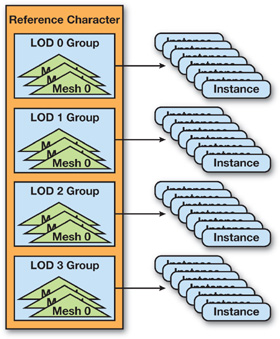

图 LOD数据的布局

本章英文原书全文传送门：

<https://developer.nvidia.com/gpugems/GPUGems3/gpugems3_ch02.html>

 

# 第3章 DirectX 10 中的混合形状（DirectX 10 Blend Shapes: Breaking the Limits）

## 【关键词】

- 混合形状（blend shapes）

- 流输出方法（Stream-Out Method）

- 缓冲区-模板方法（Buffer-Template Method）

## 【内容盘点】

本章中，作者展示了流输出方法（Stream-Out Method）和缓冲区-模板方法（Buffer-Template Method）两种方法，来突破之前基于GPU加速的混合形状的应用限制。

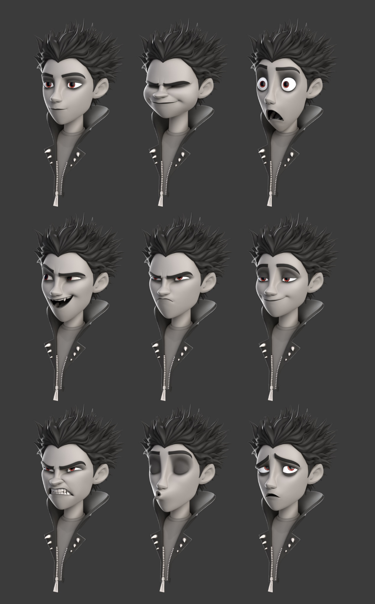

图 Little Vampire blendshapes\@ Artstation by Jimmy Levinsky

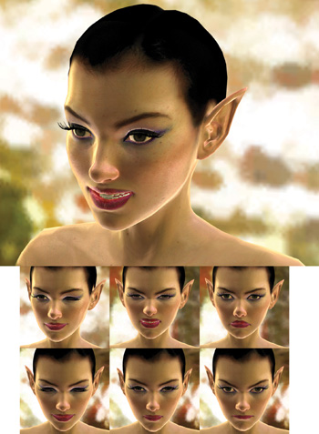

图 Dawn Demo中拥有50多个混合形状的角色

上图是基于上述两种方案在模型Dawn的脸上组合出了54种面部表情的Demo。

其中，流输出方法（Stream-Out Method）可以打破DirectX
10中属性个数限制，思路是使用迭代的方式来操作网格。通过在每个pass中组织当前活动混合形状的子集（subset），只需每个pass中少量的属性。

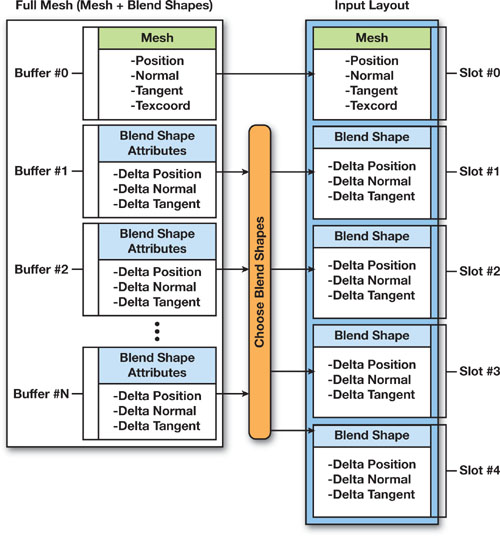

图 一次仅使用全部混合形状的一个子集

而缓冲区-模板方法（Buffer-Template Method）的思路是使用GPU来实现遍历（与流输出方法类似）。DirectX 10通过在顶点着色器中提供流控制来管理遍历，并提供了将缓冲区与着色器资源视图相绑定以存取数据的能力，进而使得GPU遍历成为可能。

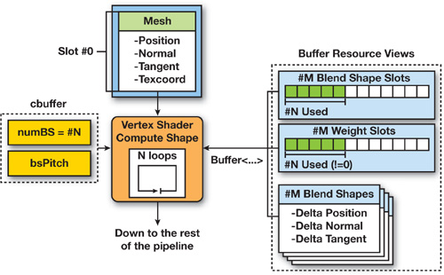

图 使用循环来减少API调用

本章英文原书全文传送门：

<https://developer.nvidia.com/gpugems/GPUGems3/gpugems3_ch03.html>

 

# 第4章 下一代SpeedTree 渲染（Next-Generation SpeedTree Rendering）

## 【关键词】

- SpeedTree

- 植物渲染（Vegatable Rendering）

- 轮廓裁剪（Silhouette Clipping）

- 树叶光照（Leaf Lighting）

- 半透明覆盖算法（Alpha to Coverage）

## 【内容盘点】

众所周知，SpeedTree是Interactive Data Visualization, Inc.(IDV)公司出品的用来实时渲染树木的中间件。

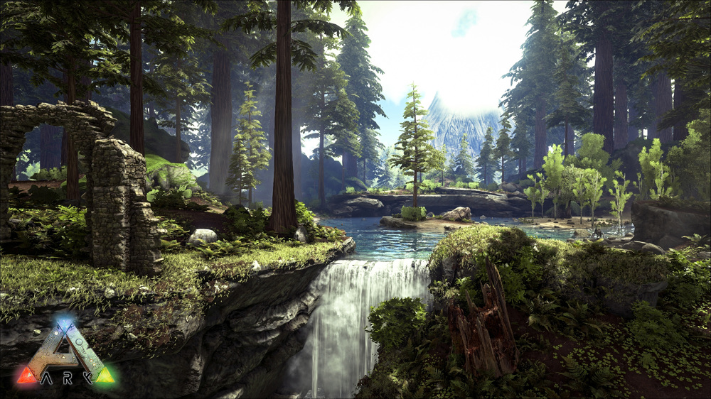

图 SpeedTree效果图 @ARK

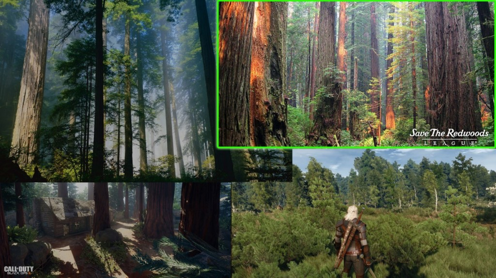

图 SpeedTree示例

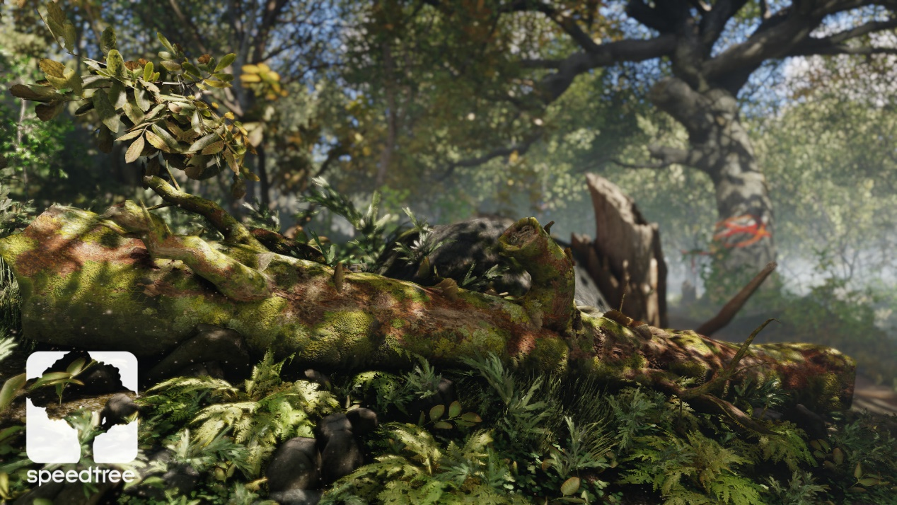

图 SpeedTree示例

文章提到，使用了SpeedTree的游戏可以对渲染方式进行更为灵活的选择。在本章中，使用了当时较新的显卡GeForce 8800的几个特性为SpeedTree生成下一代高质量的扩展。首先，轮廓剪切增加了树枝和树干外形的细节。其次，阴影贴图提供了逐树叶级的真实感自我遮挡。除此之外，我们进一步使用了双页面光照模型和高动态范围渲染来优化光照。最后，多重采样和抗锯齿和半透明覆盖（alpha to coverage）提供了非常高的视觉质量，避免了锯齿的失真。

本章英文原书全文传送门：

<https://developer.nvidia.com/gpugems/GPUGems3/gpugems3_ch04.html>

 

# 第5章 通用自适应网格细化（Generic Adaptive Mesh Refinement）

## 【关键词】

- 自适应网格优化（Adaptive Mesh Refinement）

- 自适应优化模型（Adaptive Refinement Patterns，ARP）

- 深度标签（Depth-Tagging）

## 【内容盘点】

这章给出了一个单通道的、具有普通适性的顶点程序，以对任意拓扑形状的网络进行动态的自适应优化。

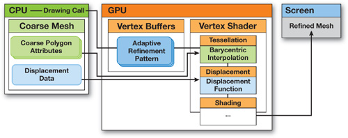

图 文中的通用自适应网格细化的工作流架构

从静态或动态的粗网格开始，该顶点程序用存储在GPU存储器中的一组预镶嵌图案中的细化三角形补丁（refined triangular patch）替换每个三角形，所述三角形补丁根据所需的局部几何细化量来选择。

通过在参数空间中对这些模式进行编码，这种一对多（one-to-many），即时的（on-the-fly）三角形替换被转换为顶点位移函数的简单重心插值，其可以由用户提供，也可以在现有的数据基础上进行计算。除了顶点位移之外，在细化过程中还可以使用相同的过程来插值任何其他每顶点属性。

该方法在某种意义上是完全通用的，即对网格拓扑，位移函数或细化级别没有任何限制。

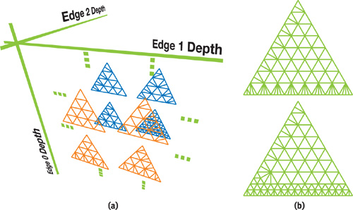

图 自适应细化的模式

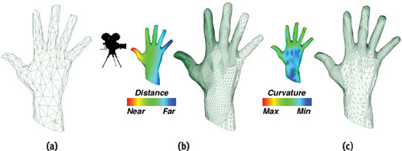

图 通过深度标记控制自适应GPU细化

本章英文原书全文传送门：

<https://developer.nvidia.com/gpugems/GPUGems3/gpugems3_ch05.html>

 

# 第6章 对于树的GPU 生成程序式风动画（GPU-Generated Procedural Wind Animations for Trees）

## 【关键词】

- 程序式风动画（Procedural Wind Animations）

- 树木动画渲染（Rendering Tree Animation）

- 噪声（Noise）

- 风场（Wind Field）

## 【内容盘点】

这章描述了一个程序式的方法，可以生成真实受风场影响的树木动画。该方法的主要目标是实现具有大量植被的大型开放环境的模拟和可视化。

具体而言，这是一种在受到诸如风场等外力影响的情况下合成树木运动的方案，基于将树木运动建模为随机过程（stochastic processes）等方法，并通过添加简单规则对其进行扩展，同时模拟树枝行为中的空气动力学特性。文中还提供了基于GPU的流体模拟与文中方法相结合的方案，以改善对风的真实感的模拟。文中还给出了在GPU上进行运动合成的详细说明，以及基于DirectX 9和DirectX 10的运动合成方法的实现。

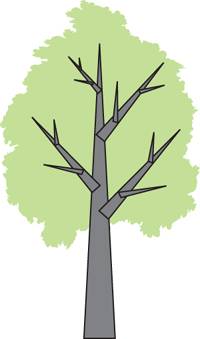

图 由三层节点深层结构表示的树结构

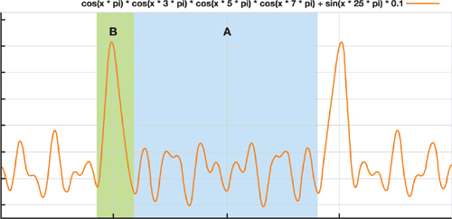

图 用于驱动树干动画的噪声函数

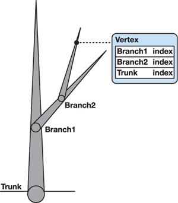

图 影响给定顶点的分支索引列表，其存储在顶点属性中

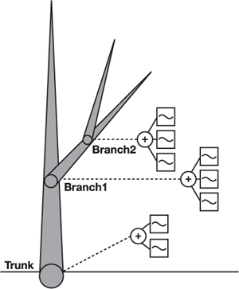

图6-8为每个分支合成角运动（Angular Motion）

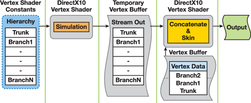

图  DirectX 10下的GPU管线

本章英文原书全文传送门：

<https://developer.nvidia.com/gpugems/GPUGems3/gpugems3_ch06.html>

 

# 第7章 GPU 上基于点的变形球可视化（Point-Based Visualization of Metaballs on a GPU）

## 【关键词】

- 元球/变形球（metaball）

- 表面粒子（Surface Particles）

- 局部粒子斥力（Local Particle Repulsion）

- 哈希表（Hash Table）

- 限制粒子（Constraining Particles）

## 【内容盘点】

变形球（metaball），又常译作元球，是计算机图形学中的 n维物体。变形球渲染技术最初由 Jim Blinn 于1980年代初提出。

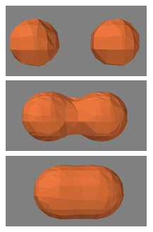

图 两个变形球的融合

这章给出了一种在GPU上以交互式速率渲染变形球的方法，其有效且高效地在GPU上实现了Withkin and Heckbert 1994的基于点的隐式表面可视化，在保持互动级帧速率的情况下渲染变形球。

该方法由三部分组成：计算受限速度、斥力及粒子密度，来实现接近一致的粒子分布。

需要注意的是，该方法并不是采用步进立方体（Marching Cubes）算法来生成多边形列表，而是通过将自由移动的粒子约束到这个表面来对元球的隐式表面进行采样。其的目标是通过渲染数千个粒子将元球可视化为光滑表面，每个粒子覆盖一个微小的表面区域。

为了在GPU上成功应用这种基于点的技术，文中解决了三个基本问题。首先，需要评估元球的隐式函数及其每个渲染粒子的梯度，以便将粒子约束到曲面。为此，文章设计了一种新颖的数据结构，用于快速评估片段着色器中的隐式函数。其次，需要将颗粒均匀地分布在表面上。对此，文章提出了一种快速方法，用于在每个粒子上执行最近邻搜索，在GPU上进行两次渲染传递。该方法用于根据平滑粒子流体动力学方法计算排斥力。第三，为了进一步加速颗粒分散，文中也提出了一种将颗粒从高密度区域转移到表面上的低密度区域的方法。

图 CPU上执行的流体模拟循环以及在GPU上执行的流体可视化循环

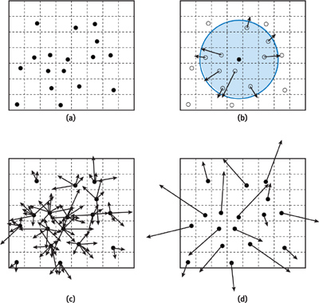

图 排斥（Repulsion）算法

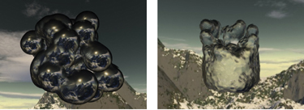

图 逐粒子光照、带有纹理和混合的流表面。
左图为无重力环境中的圆块状对象，右图为杯子中的水

本章英文原书全文传送门：

<https://developer.nvidia.com/gpugems/GPUGems3/gpugems3_ch07.html>

 

# 第二部分 光照和阴影（Light and Shadows）

 

# 第8章 区域求和的差值阴影贴图（Summed-Area Variance Shadow Maps）

## 【关键词】

- 差值阴影贴图（Variance Shadow Maps）

- 区域求和差值阴影贴图(Summed-Area Variance Shadow Maps,SAVSM)

- 百分比临近过滤（Percentage-Closer Filtering）

## 【内容盘点】

这章主要讨论了阴影贴图过滤和柔和阴影，回顾了差值阴影贴图算法，并解释了如何用它来解决很多常见的阴影贴图问题（如缩变锯齿、偏移及软阴影）。同时还介绍了一种简单且有效的技术，该技术能够显著减少差值阴影贴图（Variance Shadow Maps，VSM）中的light-bleeding失真。最后，文章介绍了一种基于差值阴影贴图（Variance Shadow Maps，VSM）和区域求和表（Summed-Area Tables,SAT）的实时阴影算法。

对任意的方波过滤器区域，该算法都能有效地计算出阴影权值，最终文章得出结论，区域求和的差值阴影贴图（Summed-Area Variance Shadow Mapping ,SAVSM）是计算没有锯齿现象的柔和阴影的理想算法。

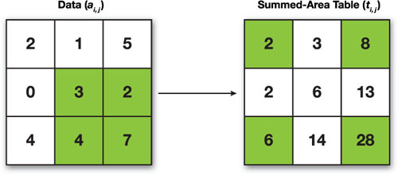

图8-10样本数据和相关的区域求和表

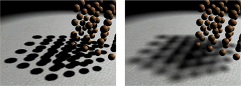

图 区域求和的基于差值阴影贴图（Summed-Area Variance Shadow Mapping ,SAVSM）算法渲染的硬边和软边阴影

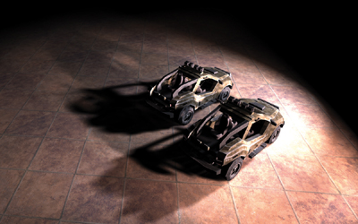

图 文中基于区域求和的差值阴影贴图技术渲染出的效果图

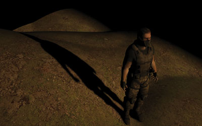

图 文中基于区域求和的差值阴影贴图技术渲染出的效果图

本章英文原书全文传送门：

<https://developer.nvidia.com/gpugems/GPUGems3/gpugems3_ch08.html>

 

# 第9章 使用全局光照交互电影级重光照（Interactive Cinematic Relighting with Global Illumination）

## 【关键词】

- 全局光照（Global Illumination）

- 重光照（Relighting）

- 间接光照（indirect illumination）

- 压缩稀疏矩阵（Packing Sparse Matrix Data）

## 【内容盘点】

这章中介绍了用于电影级光照设计的GPU重光照（Relighting）引擎。该方法对传统的帧缓存方法进行了扩展，支持多次反射的间接光照，可应用于具有高几何复杂性、光泽材质和使用程序化着色器所得到的灵活的直接光照模型的场景。

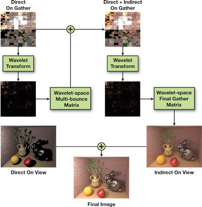

图 文中的重光照算法架构

以下是文中重光照算法的完整伪代码：

    Texture computeLighting(light, viewSamples, gatherSamples)
    {

        // Direct illumination on view and gather samples
        viewDirect = computeDirectIllumination(light, viewSamples);
        gatherDirect = computeDirectIllumination(light, gatherSamples);

        // Multibounce indirect illumination on gather samples
        gatherDirectWavelet = waveletTransform(gatherDirect);
        gatherIndirect =sparseMultiply(multiBounceWaveletMatrix, gatherDirectWavelet);
        gatherFull = gatherDirect + gatherIndirect;

        // Final bounce from gather to view samples
        gatherFullWavelet = waveletTransform(gatherFull);
        viewIndirect =sparseMultiply(finalGatherWaveletMatrix, gatherFullWavelet);

        // Combine into final image.
        viewFull = viewDirect + viewIndirect;

        return viewFull;

    }

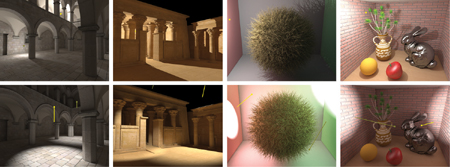

图 该文中介绍的系统中使用点光源灯和聚光灯渲染的场景

本章英文原书全文传送门：

<https://developer.nvidia.com/gpugems/GPUGems3/gpugems3_ch09.html>

 

# 第10章 在可编程GPU 上实现并行分割阴影贴图（Parallel-Split Shadow Maps on Programmable GPUs）

## 【关键词】

- 并行分割阴影贴图（Parallel-split shadow maps，PSSMs）

- 阴影贴图（Shadow Maps）

- 多阴影贴图(Multiple Shadow Maps)

- 几何着色器克隆(Geometry Shader Cloning)

## 【内容盘点】

本章提出了一种高级阴影贴图技术——“并行分割阴影贴图（Parallel-Split Shadow
Maps，PSSMs）”，可以在大型环境中提供抗锯齿和实时的光影效果，文章同样展示了在目前的可编程GPU中这种技术的实现细节，提供了多种实现方式。

在此技术中，视锥体使用平行于投影面积的多个剪辑平面被分割成多个深度层，并且每个层会被一个独立的阴影贴图所渲染。如下图所示。

该算法主要步骤有：

-   步骤1：分割视锥体（Splitting the View Frustum）

-   步骤2：计算光的变换矩阵（Calculating Light's Transformation Matrices）

-   步骤3和4：产生PSSMs和综合阴影（Generating PSSMs and Synthesizing Shadows）

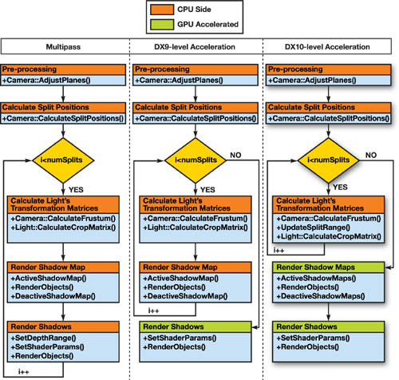

图PSSMs对三个特定于硬件实现的渲染管线的可视化

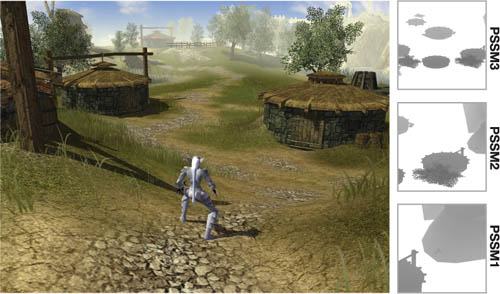

图 并行分割的阴影贴图在Dawnspire：Prelude游戏中的应用

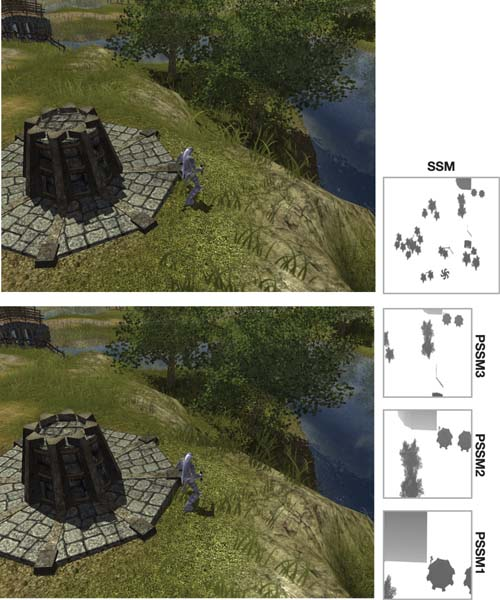

图 SSM和Multipass PSSM的比较

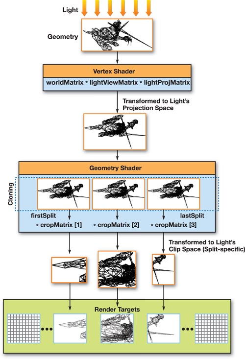

图 渲染阴影贴图基于几何着色器克隆(Geometry Shader Cloning)的GPU渲染管道

本章英文原书全文传送门：

<https://developer.nvidia.com/gpugems/GPUGems3/gpugems3_ch10.html>

 

# 第11章 基于层次化的遮挡剔除和几何着色器的高效鲁棒阴影体（Efficient and Robust Shadow Volumes Using Hierarchical Occlusion Culling and Geometry Shaders）

## 【关键词】

- 阴影体（Shadow Volumes）

- 层次化的遮挡剔除（Hierarchical Occlusion Culling）

- 几何着色器（Geometry Shaders）

## 【内容盘点】

这章通过使用非常规的生成阴影几何体的方法，实现了一种非常鲁棒的阴影体渲染技术，该技术对于复杂的网格模型同样有效。通过结合层次硬件遮挡查询（hierarchical hardware occlusion）和几何着色器，文章同样在那些之前使用模板阴影效果不太好的场景中达到了很高的性能。该方法的实现主要包括，针对低质量网络的鲁棒阴影，使用几何体着色器动态生成阴影体，使用层次化遮挡裁剪提高性能，三个部分。

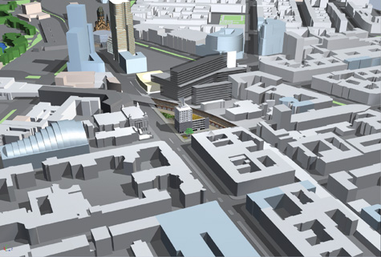

图 使用动态阴影体方法生成的实时渲染效果

本章英文原书全文传送门：

<https://developer.nvidia.com/gpugems/GPUGems3/gpugems3_ch11.html>

 

# 第12章 高质量的环境光遮蔽（High-Quality Ambient Occlusion）

## 【关键词】

- 环境光遮蔽（Ambient Occlusion）

- 平滑处理不连续（Smoothing Discontinuities）

- 波形因子（form factor）

## 【内容盘点】

Buuel在2005年提出了一种新技术来对环境光遮蔽进行近似，所采用的方法是将遮蔽整合到自适应对模型层次的遍历过程中。这种技术在模拟光滑变动的阴影方面效果很好，但对于输入模型，在高质量的应用方面不够鲁棒。

本章对该方法进行了阐述，并在实践中进行了改进，使其更实用，对更普遍的模型的更加鲁棒。思路方面，保持算法的基本骨架不变
-该章节内容自适应地对存储在树中的粗遮挡解决方案中的遮挡进行求和，而一些关键变化显着提高了结果的稳健性，最终得到了令人信服的光滑的软阴影，以及具有真实感的多样局部细节。而改进思路方面，可分为，对不连续处进行平滑滑处理（Smoothing Discontinuities），和移除尖点并加入细节（Removing Pinches and Adding Detail）两部分。

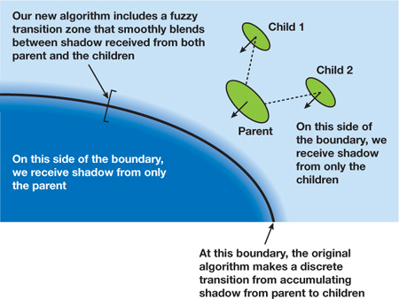

图 不连续处的平滑处理：过渡区的几何

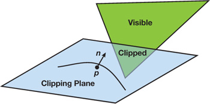

图 移除尖点并加入细节：将三角形剪切为可见的四边形

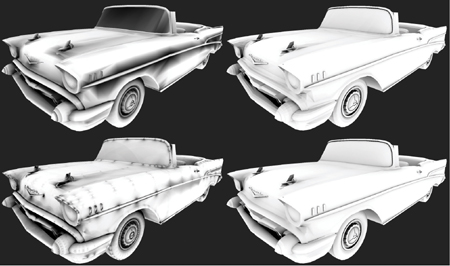

图
本章算法实现的汽车模型中环境光遮蔽的比较【左上：应用于逐顶点的原始算法；左下：应用于逐片段的原始算法；右上：应用于平面法线（flat
normals）的新算法；右下：应用于光滑着色法线的新算法】

本章英文原书全文传送门：

<https://developer.nvidia.com/gpugems/GPUGems3/gpugems3_ch12.html>

 

# 第13章 后处理特效：体积光散射（Volumetric Light Scattering as a Post-Process）

## 【关键词】

- 体积光散射（Volumetric Light Scattering）

- 后处理（Post-Process）

- 云隙光（Crepuscular Rays）

- 屏幕空间遮蔽（Screen-Space Occlusion）

## 【内容盘点】

本章中提出了一种简单的后处理方法，该方法可以产生由于大气中阴影引起的体积光散射效果。我们对已有的日光散射（daylight scattering）的分析模型进行了改进，将体遮挡效果包含在内，并且给出了其在像素着色器中的实现方法。

内容方面，包括云隙光（Crepuscular Rays）、体积光散射（Volumetric Light Scattering）、后处理像素着色器（Post-Process Pixel Shader）、屏幕空间遮蔽方法（Screen-Space Occlusion Methods）几部分。

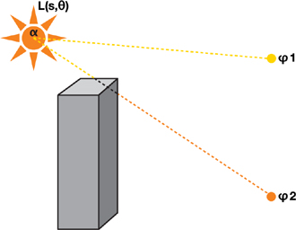

图 屏幕空间中的光线投射

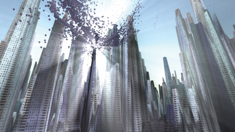

图 基于本章实现的实时动画场景中的体积光散射

本章英文原书全文传送门：

<https://developer.nvidia.com/gpugems/GPUGems3/gpugems3_ch13.html>

 

# 第三部分 渲染（Rendering）

 

# 第14章 用于真实感实时皮肤渲染的高级技术（Advanced Techniques for Realistic Real-Time Skin Rendering）

## 【关键词】

- 皮肤渲染（Skin Rendering）

- 次表面散射（Subsurface Scattering）

- 纹理空间漫反射（Texture-Space Diffusion）

- Bloom过滤器(Bloom Filter)

## 【内容盘点】

这章是《GPU Gems 3》中的核心章节，《GPU Gems 3》书的封面即是选取的本章的渲染效果图。自其问世以来，就成为了皮肤渲染领域经常会被参考到的文章，可谓皮肤渲染技术的集大成者，奠基之作。

内容方面，文章从皮肤外观开始，总结出实时皮肤渲染系统由两个分量组成：

-   镜面反射分量（specular reflection component）

-   次表面散射分量（subsurface scattering component）

文中详细描述了这两个分量的GPU实现，包括漫散射（diffuse scattering）理论的回顾和漫散射扩散剖面（diffuse scattering profiles）的新公式的呈现。

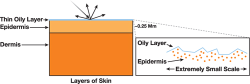

图 多层皮肤模型

散射理论（Scattering Theory）方面，文章首先讲到了扩散剖面（diffusion profile）的概念，然后是高斯和的扩散剖面（A Sum-of-Gaussians Diffusion Profile），以及适于皮肤的高斯和（A Sum-of-Gaussians Fit for Skin）。

高级次表面散射（Advanced Subsurface Scattering）方面，文章讲到了纹理空间漫反射（texture-space diffusion）[Borshukov and Lewis 2003]

通过改进透射阴影贴图（ranslucent shadow maps）[Dachsbacher and Stamminger 2004]来计算穿过表面的深度，并将阴影区域连接到面向光的表面上的位置，完成穿过如耳朵类似表面区域的透射（Transmission）效果。

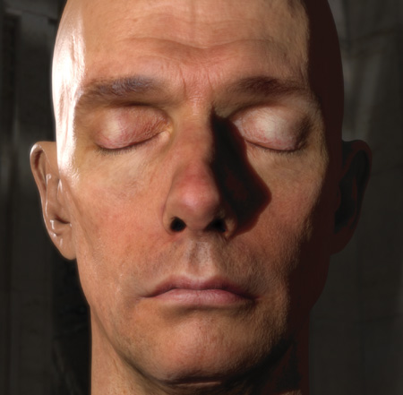

图 一个实时的皮肤渲染结果【这幅图像十分接近Donnerand Jesen 2005的渲染结果，但其生成所需的时间要少许多】

另外，关于实时皮肤渲染技术总结，可以参考本系列文章中的上一篇文章：《<GPU Gems3>：真实感皮肤渲染技术总结》<https://zhuanlan.zhihu.com/p/42433792>

本章英文原书全文传送门：
<https://developer.nvidia.com/gpugems/GPUGems3/gpugems3_ch14.html>

 

# 第15章 可播放的全方位动作捕捉（Playable Universal Capture）

## 【关键词】

- 全方位捕捉（Universal Capture）

- 动作捕捉（Motion Capture）

- 主成分分析（Principal Component Analysis， PCA）

- 数据捕捉（Data Acquisition）

## 【内容盘点】

这章讨论了一个全方位捕捉（Universal Capture）的实时实现方法，用于真实感人物角色的动作以及渲染，该方法从电影《黑客帝国》中改进而来。此方法基于对变动漫反射纹理贴图的PCA压缩以及GPU解压缩。而纹理贴图通过当时最先进的脸部特征捕捉系统得到。而结果已经通过测试并应用到高质量的实时原型系统，以及游戏开发中。

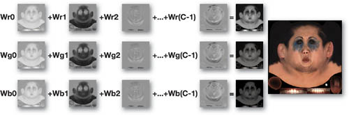

图15-11帧解压缩（Frame Decompression Algorithm）算法的图示

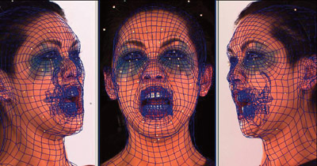

图 三个摄像机视图中的图像

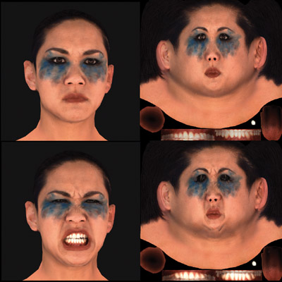

图 未最终渲染得到的“Leanne”角色

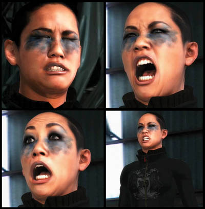

图 经过最终渲染得到的“Leanne”角色

图 E3 2006 Tigger Woods游戏demo中，伍兹标志性的笑容的出色捕捉复现

本章英文原书全文传送门：

<https://developer.nvidia.com/gpugems/GPUGems3/gpugems3_ch15.html>

 

# 第16章 Crysis 中植被的程序化动画和着色（Vegetation Procedural Animation and Shading in Crysis）

## 【关键词】

- 植被过程化动画（Vegetation Procedural Animation）

- 植被着色（Vegetation Shading）

- 孤岛危机（Crysis）

- Cry Engine 2

## 【内容盘点】

这章阐述了如何以高效且具有真实感的方法处理着色和程序化植被动画。主要介绍了《孤岛危机（Crysis）》中植被的渲染以及程序化动画如何实现（基于Cry
ENGINE 2）。本章中给出的程序化动画技术使用普通的方式实现，因此将风力实现于非植被对象（如衣服和头发）也是有可能的；唯一不同之处在于这些情况下不需要使用主弯曲（main bending）。文中的方法实现了直升机、手雷爆炸、武器火力对植被、衣服和头发的影响，在这些实现中均使用了极为高效的方法。

内容方面，分为程序化动画（Procedural Animation）和植被着色（Vegetation Shading）两部分。

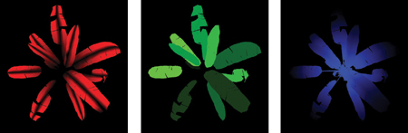

图 顶点色的使用

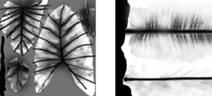

图 次表面纹理贴图

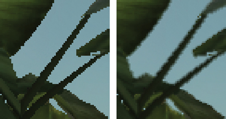

图 边缘平滑

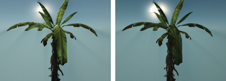

图 最终渲染结果【左：没有使用动态范围、阴影和后处理的结果；右：使用了所有技术的结果】

不得不说的是，2007年11月面世的《孤岛危机（Crysis）》，已经过了10周岁，其渲染效果放到今天，依然很能打：

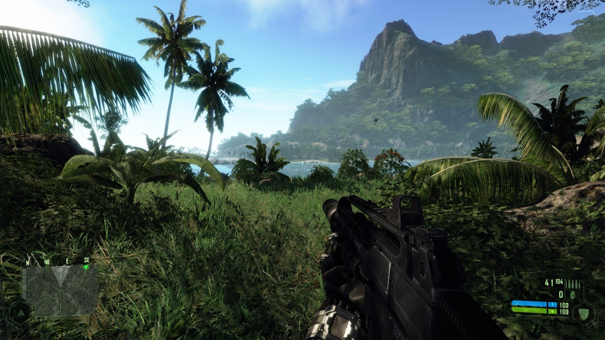

图 植被渲染效果图 @Crysis @2007

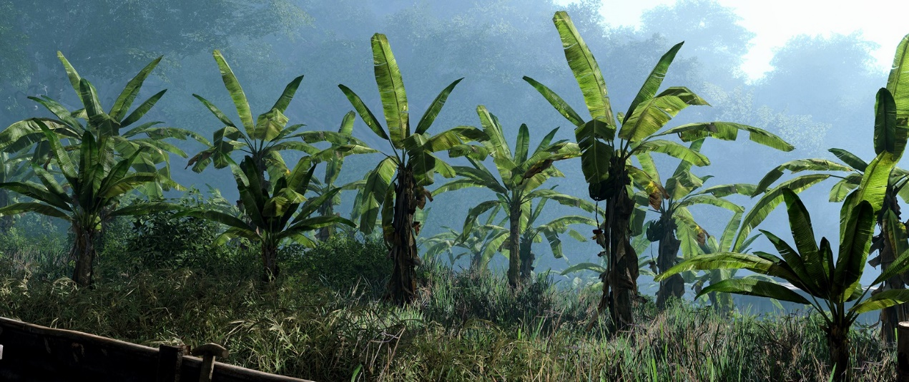

图 植被渲染效果图 @Crysis @2007

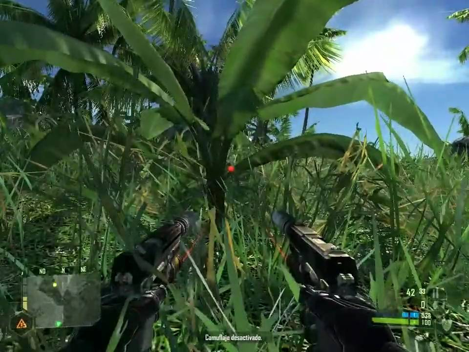

图 植被渲染效果图 @Crysis @2007

本章英文原书全文传送门：

<https://developer.nvidia.com/gpugems/GPUGems3/gpugems3_ch16.html>

 

# 第17章 鲁棒的多镜面反射和折射（Robust Multiple Specular Reflections and Refractions）

## 【关键词】

- 多镜面反射（Multiple Specular Reflections）

- 多折射（Multiple Refractions）

- 层次化距离图（Layered Distance Maps）

## 【内容盘点】

本章中，给出了一个鲁棒的算法来计算GPU中的单个和多个反射和折射。

为了使片段着色器能够在查找辅助光线的交点时访问整个场景的几何描述，文中首先将场景渲染为层次化距离图（layer distance map）。

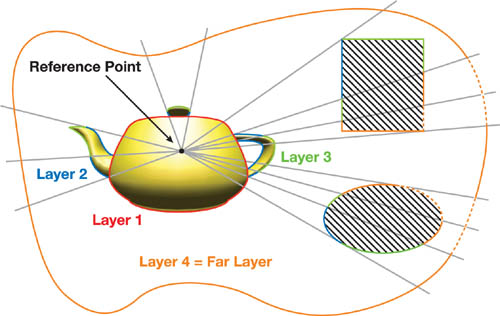

图 具有3 + 1层的分层距离图

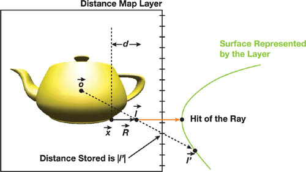

图 以方位来追踪射线

每个层在纹理内存中被存储为一个立方体贴图（cube map）。算法基于搜索来辅助光线追踪。搜索过程从光线遍历开始，这样保证不会漏掉任何光线与屏幕的交点，继而进行割线搜索（secant serch）以保证精确性。

相比于直接实现经典的光线跟踪方法，使用光栅化的几何体表示中跟踪光线方法的一个重要优点，是这些方法可以被整合到当前的游戏引擎中，可以利用游戏开发中的可见性算法，并使用当时最新显卡的全部潜能。

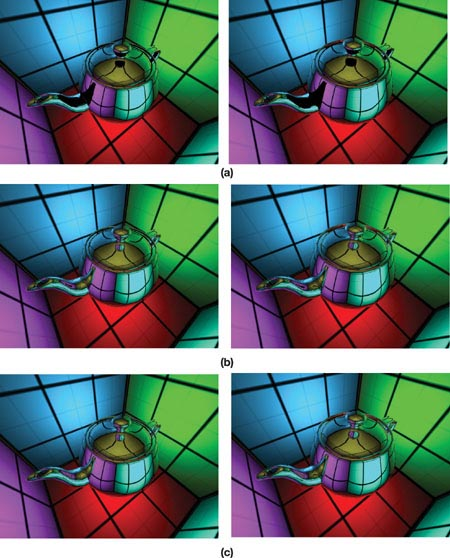

图 茶壶单次和多次反射的结果。【图(a)最多一次反射，50/100 FPS 图(b)
最多两次反射36/80 FPS，(c)最多三次反射 30/60 FPS】

本章英文原书全文传送门：

<https://developer.nvidia.com/gpugems/GPUGems3/gpugems3_ch17.html>

 

# 第18章 用于浮雕映射的松散式锥形步进（Relaxed Cone Stepping for Relief Mapping）

## 【关键词】

- 浮雕映射（Relief Mapping）

- 松散式锥形步进（Relaxed Cone Stepping）

- 锥形步进映射(Cone step mapping ,CSM)

## 【内容盘点】

本章中，描述了一个用于逐片段的置换映射的新的光线场相交(ray-height-field intersection)策略，其结合了锥形步进映射和二分查找两者的优点。

文章将这种新的空间跳跃（space-leaping）算法命名为松散式锥形步进（Relaxed Cone Stepping, RCS）,这是由于其消除了在锥形步进映射(Cone step mapping ,CSM)中对锥形半径定义的限制。而光场相交的思想是使用一个一个改进的space-leaping技术替代线性查找，其后立刻接一个二分查找。

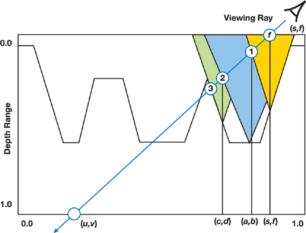

图 锥形步进映射(Cone step mapping ,CSM)

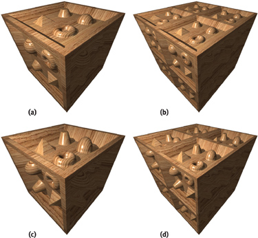

图 不同深度和tiling因子对外观的影响的图示

本章英文原书全文传送门：

<https://developer.nvidia.com/gpugems/GPUGems3/gpugems3_ch18.html>

 

# 第19章 《Tabula Rasa》中的延迟着色（Deferred Shading in Tabula Rasa）

## 【关键词】

- 延迟着色（Deferred Shading）

- 前向着色（Forward Shading）

- 体积光（Light Volumes）

- 可读深度（Readable Depth）

- 法线缓存（Normal Buffer）

- 双向光照（Bidirectional Lighting）

- 球体映射（Globe Mapping）

- 盒式光照（Box Lights）

- 阴影贴图（Shadow Maps）

- 高效光照体（Efficient Light Volumes）

- 模板掩码（Stencil Masking）

- 动态分支（Dynamic Branching）

## 【内容盘点】

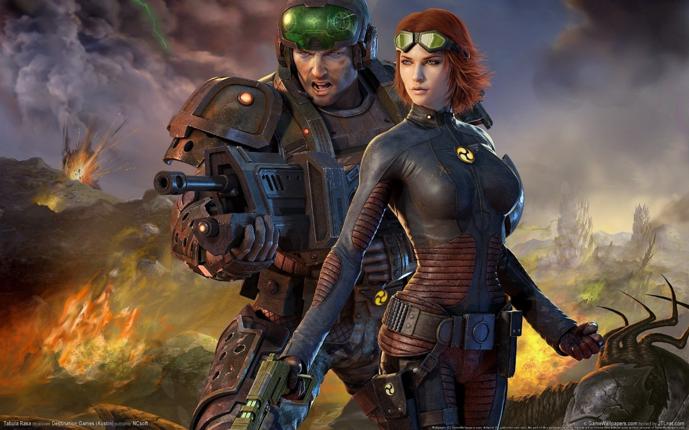

图《Tabula Rasa》封面图

这章内容关于延迟着色，承接了《GPU Gem2》中的《S.T.A.L.K.E.R中的延迟着色》一文，是对其内容的延伸。相较于《S.T.A.L.K.E.R中的延迟着色》，这章着重于介绍基于延迟渲染的引擎中所需要的高层次问题、技术以及解决方法。

文中提到延迟着色的主要缺点包括：

-   高内存带宽的使用

-   没有硬件抗锯齿

-   缺乏合适的对透明度混合的支持。

而延迟着色的主要优点包括：

-   光照计算的消耗与场景复杂度无关

-   着色器能够对深度及其他像素信息进行访问

-   每个像素仅被每个光照亮一次。即，若像素后来被其他不透明几何体所遮挡，其上便不会有光照计算。

-   清晰分布的着色器代码：材质渲染从光照计算中分开

该章中讲到了一些可以在前向或者延迟着色引擎中实现的高级光照特性，包括双向光照（Bidirectional Lighting）、球体映射（Globe Mapping），盒式光照（Box Lights）、阴影贴图（Shadow Maps）等技术。

延迟渲染的优化方面，讲到了高效光照体积（Efficient Light Volumes）、模板掩码（Stencil Masking）以及动态分支（Dynamic Branching）等内容。

本章英文原书全文传送门：

<https://developer.nvidia.com/gpugems/GPUGems3/gpugems3_ch19.html>

 

# 第20章 基于GPU的重要性采样（GPU-Based Importance Sampling）

## 【关键词】

- 渲染方程（Rendering Formulation）

- 基于GPU的重要性采样（GPU-Based Importance Sampling）

- 蒙特卡洛积分（Monte Carlo quadrature）

- 拟随机低差异序列（Quasirandom Low-Discrepancy Sequences）

- mipmap

## 【内容盘点】

高动态范围（High-Dynamic-Range ,HDR），结合环境贴图预过滤技术（Environment map prefiltering techniques）（Kautz et al. 2000），以及结合使用小波（wavelets）(Wang et al. 2006)或球面调和函数（spherical harmonics）（Ramamoorthi and Hanrahan 2002）的频空间解决方案，为实时渲染提供了可行的思路。然而，这种方式过于呆板，因为需要大量的预计算或繁多的代码用于光滑表面反射。

这章给出了上述方案的一种替代技术——基于GPU的重要性采样（GPU-Based Importance Sampling），该技术基于蒙特卡罗积分对光滑对象使用基于图像的光照，采用该技术仅需要很少的预计算，并在单个GPU着色器中运算。因此合适于几乎所有需要实时动态改变材质或光照的管线。

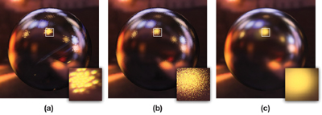

图 每像素40个样本的重要性采样

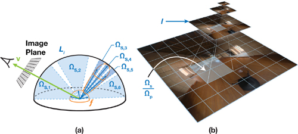

图 过滤重要性采样示意图

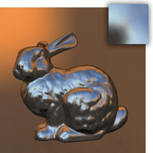

图 对斯坦福兔子使用逐像素40次采样的实时渲染效果。

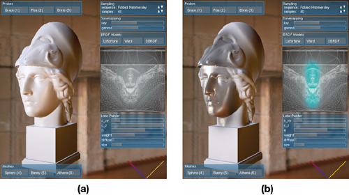

图 空间变化的BRDF（Spatially Varying BRDF）设计器

本章英文原书全文传送门：

<https://developer.nvidia.com/gpugems/GPUGems3/gpugems3_ch20.html>

 

# 第四部分 图像效果（Image Effects）

 

# 第21章 真实Impostor（True Impostors）

## 【关键词】

- Billboard

- impostor

- 半透明impostor (Translucence impostor)

## 【内容盘点】

这章给出了 “真实impostor（ture imposters）”方法，这是一种向任意场景中加入大量简单模型而不需要渲染大量多边形的方法。这种方法使用了现代着色硬件来执行光线发射到已定义的纹理体积中，且表示非高度场表面数据的多深度层与四边形相关。

如同传统的imposter方法，ture imposter方法将四边形沿其中心渲染使其总是朝向摄像机。而与传统的显示静态纹理的imposter技术不同，真实imposter技术使用像素着色器发射一个观察光线穿过四边形的纹理坐标空间，与3D模型相交并计算相交点处的颜色。而纹理坐标空间通过一个以四边形中心为原点的框架定义。

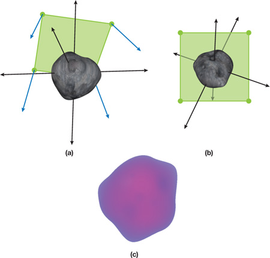

图 生成公告板

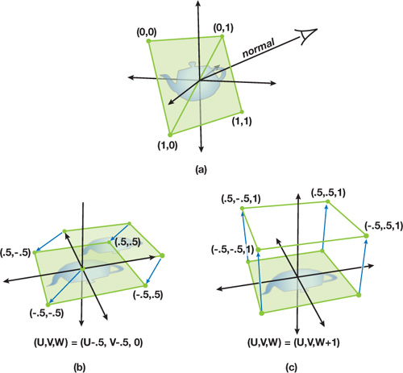

图 真实imposter投影的多边形

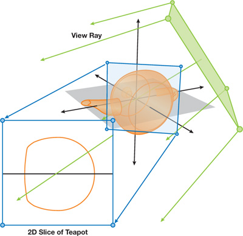

图 投射视图光线拍摄2D切片

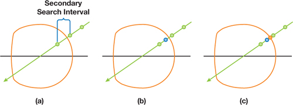

图 基于射线步进（Ray March）和二分搜索确定体积交点

真imposter支持模型上的自阴影、反射以及折射，是一个查找体积间距离的有效方法。且文中基于相交测试的扩展，也对半透明效果进行了支持。

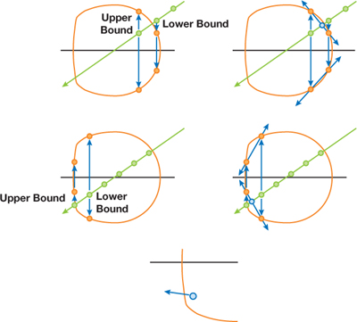

图 扩展相交测试以支持半透明

本章英文原书全文传送门：

<https://developer.nvidia.com/gpugems/GPUGems3/gpugems3_ch21.html>

 

# 第22章 在GPU上烘焙法线贴图（Baking Normal Maps on the GPU）

## 【关键词】

- 法线贴图烘焙（Baking Normal Maps）

- 均匀网格（Uniform Grid）

## 【内容盘点】

这章分析了传统的基于光线投射的法线贴图投影技术如何在GPU上成功地实现，还阐述了一些其中普遍存在的问题，例如，内存限制和反走样。

而对文中实现的技术进行一些微小的改动，就可以生成位移贴图（displacement mapping），以及视差贴图（parallax mapping）和浮雕贴图（relief
mapping）。而使用更加复杂的着色器，还可以生成局部环境光遮蔽（local ambient occlusion）或腔贴图（cavity maps）。且这种技术的一个优点是可以足够快递显式地单独渲染所有mip等级。

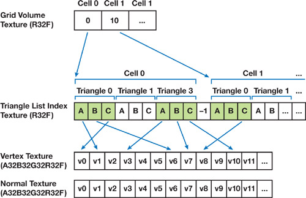

图 映射到GPU的数据的可视化表示

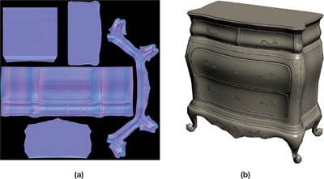

图 最终在GPU上生成的法线贴图及其对应模型

本章英文原书全文传送门：

<https://developer.nvidia.com/gpugems/GPUGems3/gpugems3_ch22.html>

 

# 第23章 高速的离屏粒子（High-Speed, Off-Screen Particles）

## 【关键词】

- 粒子系统（Particle System）

- 离屏粒子（Off-Screen Particle）

- 深度降采样（Downsampling Depth）

## 【内容盘点】

粒子效果在游戏中随处可见，大量粒子系统普遍用于烟、火、爆炸、沙尘、和雾。然而若这些粒子填满了屏幕，过度绘制（overdraw）可能几乎会达到无限，并且通常会导致帧速率问题。

文章提出的解决方案是，将昂贵的粒子渲染到离屏（off-screen）的渲染目标中，而这个渲染目标的大小是帧缓冲区大小的一小部分。这可以在过度绘制（overdraw）中产生巨大的开销节省，但是会牺牲一些图像处理的开销。

而结果显示，低分辨率的离屏渲染可以带来巨大的性能提升，它有助于使粒子系统耗费更加可控，因此帧速率并不会在过度绘制的最坏的情况下成为性能问题。

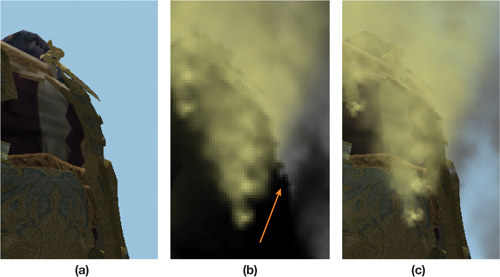

图 基本离屏算法的步骤【(a)仅固体对象 (b)仅在低分辨率、离屏渲染对象中的粒子
(c)结合后的场景】

本章英文原书全文传送门：

<https://developer.nvidia.com/gpugems/GPUGems3/gpugems3_ch23.html>

 

# 第24章 保持线性的重要性（The Importance of Being Linear）

## 【关键词】

- 颜色空间（Color Space）

- 线性空间（Linear Space）

- 伽马空间（Gamma Space）

- 伽马校正（Gamma Correction）

## 【内容盘点】

这章讲到，OpenGL、DirectX以及任何我们书写的着色器，会将所有的纹理输入、光照/材质交互，以及输出当做线性（即、光照强度和，漫反射乘积）来执行数学运算。但假如我们的纹理输入是非线性的，并且用户使用了未校准及未修正的显示器来应用非线性颜色空间变换。而这样会导致各种形式的失真和不精确等问题（如mipmap过滤错误）以及一些粗糙错误（如及不正确的光照渐变）。而适当的gamma修正可能是最简单，花费最小，也是最广泛使用的技术。而为了让读者规避这些问题，文中给出了一系列的解决方法与建议。

值得一提的是，目前流行的基于物理的渲染若要得到正确精准的渲染结果，正是需要在线性空间下进行。

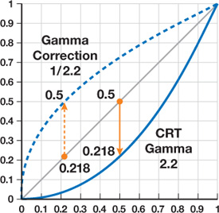

图 显示器的典型响应曲线

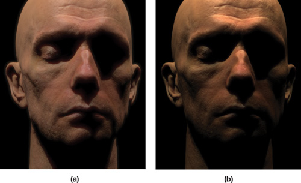

图 使用合适的gamma校正（左侧）及不进行gamma校正的渲染（右侧）图

本章英文原书全文传送门：

<https://developer.nvidia.com/gpugems/GPUGems3/gpugems3_ch24.html>

 

# 第25章 在GPU 上渲染矢量图（Rendering Vector Art on the GPU）

## 【关键词】

- 矢量（Vector）

- 二次条样（Quadratic Splines）

- 三次贝塞尔曲线（cubic Bezier curves）

## 【内容盘点】

矢量（Vector）表示为指定形状的一种分辨率无关的方法，其具有任意大小，可以对内容进行显示而不需要细化（tessellation）以及没有采样失真的优点。

这章给出了一个算法，用于渲染由封闭路径所定义的向量图形，而封闭路径可以包含二次样条（Quadratic
Splines）或三次贝塞尔曲线（cubic Bézier curves）。

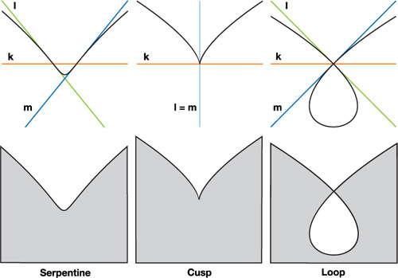

图 所有参数立方平面曲线可归类为此三种曲线类型之一的某些段的参数化

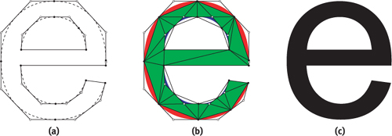

图 渲染二次样条曲线

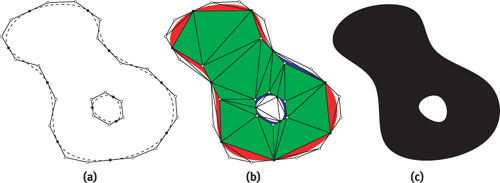

图
渲染三次样条【(a)有向的多轮廓三次样条输入、(b)每个贝塞尔凹包被局部地三角化；内侧区域被全局地三角化；(c)内部三角形被填充，曲线段使用一个特殊的像素着色器程序渲染】

本章英文原书全文传送门：

<https://developer.nvidia.com/gpugems/GPUGems3/gpugems3_ch25.html>

 

# 第26章 通过颜色进行对象探测：使用 GPU 进行实时视频图像处理（Object Detection by Color: Using the GPU for Real-Time Video Image Processing）

## 【关键词】

- 对象探测（Object Detection）

- 图像处理（Image Processing）

## 【内容盘点】

严格意义上并非游戏开发相关，略。

本章英文全文链接：

<https://developer.nvidia.com/gpugems/GPUGems3/gpugems3_ch26.html>

 

# 第27章 后处理效果：运动模糊（Motion Blur as a Post-Processing Effect）

## 【关键词】

- 运动模糊（Motion Blur）

- 后处理（Post-Processing Effect）

## 【内容盘点】

在视频游戏中，模拟速度最好的方法之一便是使用运动模糊（Motion
Blur）。这章中阐述了一种使用在深度缓存中的深度值来计算对象世界空间位置的以实现运动模糊的方法，该方法可以作为一个基础方法使用，并且可以很轻易地整合到游戏引擎中，同时提供了比传统的多路径方法更高的性能。

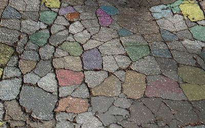

图 不具有运动模糊的场景

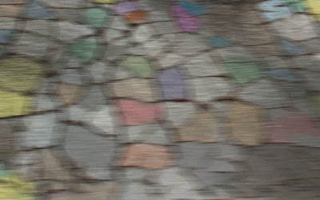

图 使用了运动模糊的场景

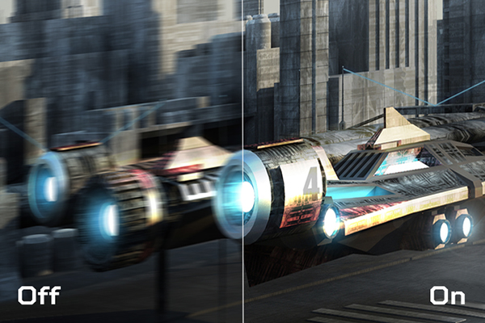

图 有无运动模糊的对比

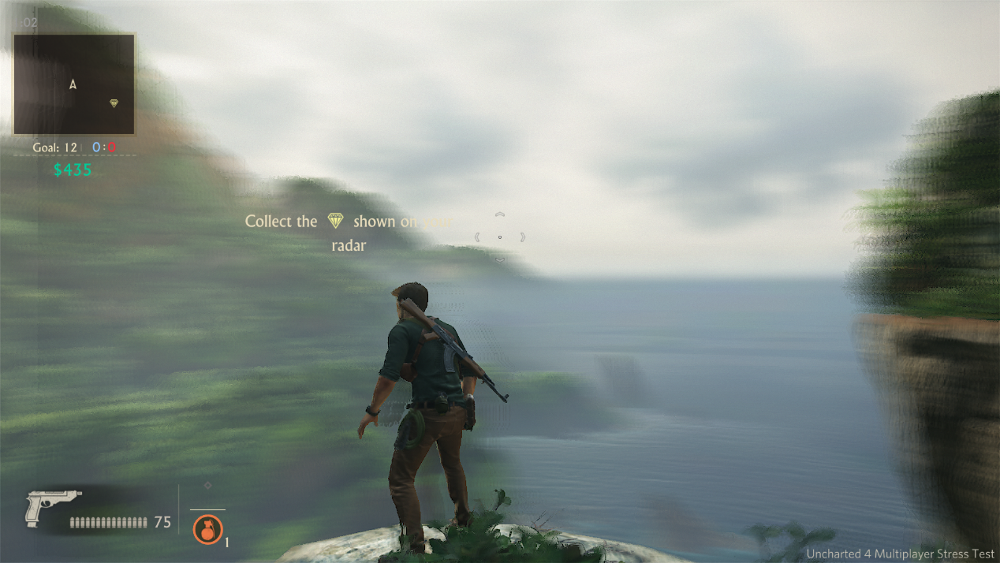

图 《神秘海域4》中的运动模糊

本章英文原书全文传送门：

<https://developer.nvidia.com/gpugems/GPUGems3/gpugems3_ch27.html>

 

# 第28章 实用景深后期处理（Practical Post-Process Depth of Field）

## 【关键词】

- 景深（Depth of Field,DoF）

- 后处理（Post-Processing Effect）

## 【内容盘点】

景深（Depth of field，DOF），也叫焦点范围（focus range）或有效焦距范围（effective focus），是指场景中最近和最远的物体之间出现的可接受的清晰图像的距离。

这章中阐述了一个景深（Depth of Field,DoF）算法，该算法主要适合于FPS游戏，最初使用于《使命召唤：现代战争》中。完整的算法包含以下4个阶段：

1、对前进对象的散光圈进行降采样。

2、模糊临近的散光圈图像。

3、通过模糊后和未模糊的图像计算实际前景散光圈。

4、在一个最后的全屏处理路径中使用可变宽度模糊，并在其中应用前景和背景散光圈图像。

几张带景深的渲染效果，取最近几年的一些引擎和游戏截图。

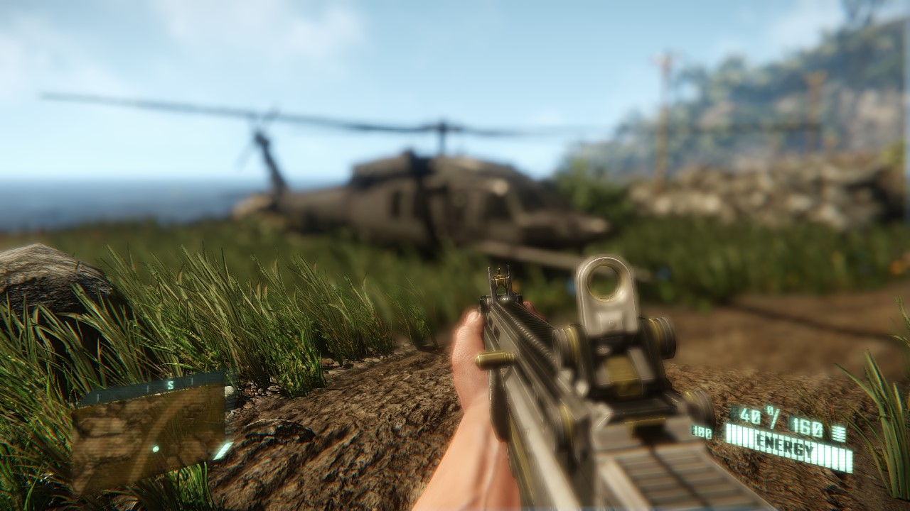

图 CryEngine3 中有无景深的渲染对比（有景深）

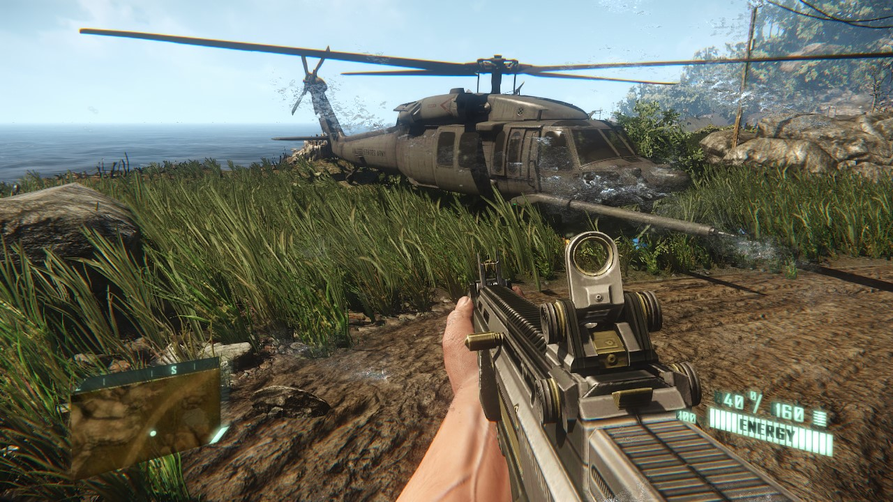

图 CryEngine3 中有无景深的渲染对比（无景深）

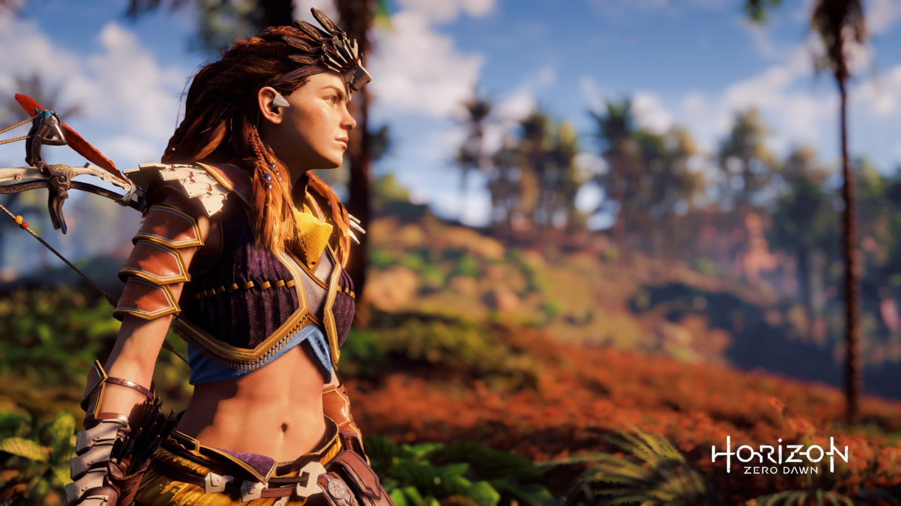

图 《地平线：黎明》中的景深

本章英文原书全文传送门：

<https://developer.nvidia.com/gpugems/GPUGems3/gpugems3_ch28.html>

 

# 【GPU精粹三部曲】 Part I • 尾声

这篇文章至此，GPU精粹三部曲中《GPU Gems》、《GPU Gems 2》、《GPU Gems3》组成的第一部曲，也就告一段落了。

通过【GPU精粹与Shader编程】系列的这前7篇文章，我们已经将这三本书中的重点内容，全都过了一遍。希望各位读者能因此有所收获。

下篇文章，将开启全新的《GPU Pro》系列。

再会。
