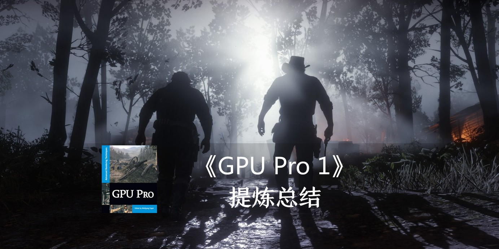

# 《GPU Pro 1》全书核心内容提炼总结

本文的知乎专栏版本：
https://zhuanlan.zhihu.com/p/47959028

本文是【GPU精粹与Shader编程】系列的第八篇文章，全文共两万余字。文章盘点、提炼和总结了《GPU Pro 1》全书总计22章的核心内容。

题图来自《荒野大镖客2》。

 

# 全文快捷导航目录

本文将对《GPU Pro 1》全书中游戏开发与渲染相关，相对更具含金量的5个部分，共22章的内容进行提炼与总结，详细列举如下：

<!-- TOC -->

- [《GPU Pro 1》全书核心内容提炼总结](#gpu-pro-1全书核心内容提炼总结)
- [全文快捷导航目录](#全文快捷导航目录)
- [《GPU Pro 1》其书](#gpu-pro-1其书)
- [《GPU Pro 1》书本配套源代码](#gpu-pro-1书本配套源代码)
- [Part I. 游戏渲染技术剖析 Game Postmortems](#part-i-游戏渲染技术剖析-game-postmortems)
    - [一、《孢子（Spore）》中的风格化渲染 | Stylized Rendering in Spore](#一孢子spore中的风格化渲染--stylized-rendering-in-spore)
        - [1.1 后处理过滤链系统的实现要点](#11-后处理过滤链系统的实现要点)
            - [1.1.1 动态参数（Dynamic parameters）](#111-动态参数dynamic-parameters)
            - [1.1.2 自定义过滤器（Custom filters）](#112-自定义过滤器custom-filters)
        - [1.2 五种屏幕后处理Shader的实现思路](#12-五种屏幕后处理shader的实现思路)
            - [1.2.1 油画后处理效果 Oil Paint Filter](#121-油画后处理效果-oil-paint-filter)
            - [1.2.2 水彩画后处理效果 Watercolor Filter](#122-水彩画后处理效果-watercolor-filter)
            - [1.2.3 8位后处理效果 8-Bit Filter](#123-8位后处理效果-8-bit-filter)
            - [1.2.4 黑色电影后处理效果 Film Noir Filter](#124-黑色电影后处理效果-film-noir-filter)
            - [1.2.5 旧电影后处理效果 Old Film Filter](#125-旧电影后处理效果-old-film-filter)
    - [二、《狂野西部：生死同盟》中的渲染技术 | Rendering Techniques in Call of Juarez: Bound in Blood](#二狂野西部生死同盟中的渲染技术--rendering-techniques-in-call-of-juarez-bound-in-blood)
    - [三、《正当防卫2》中的大世界制作经验与教训 | Making it Large, Beautiful, Fast,and Consistent: Lessons Learned](#三正当防卫2中的大世界制作经验与教训--making-it-large-beautiful-fastand-consistent-lessons-learned)
        - [3.1 光照索引 Light indexing](#31-光照索引-light-indexing)
        - [3.2 阴影系统 Shadowing System](#32-阴影系统-shadowing-system)
        - [3.3 环境光遮蔽 Ambient Occlusion](#33-环境光遮蔽-ambient-occlusion)
        - [3.4 其他内容](#34-其他内容)
    - [四、《矿工战争》中的可破坏体积地形 | Destructible Volumetric Terrain](#四矿工战争中的可破坏体积地形--destructible-volumetric-terrain)
- [Part II. 渲染技术 Rendering Techniques](#part-ii-渲染技术-rendering-techniques)
    - [五、基于高度混合的四叉树位移贴图 | Quadtree Displacement Mapping with Height Blending](#五基于高度混合的四叉树位移贴图--quadtree-displacement-mapping-with-height-blending)
        - [5.1 核心实现Shader代码](#51-核心实现shader代码)
    - [六、使用几何着色器的NPR效果 | NPR Effects Using the Geometry Shader](#六使用几何着色器的npr效果--npr-effects-using-the-geometry-shader)
        - [6.1 轮廓渲染（Silhouette Rendering）](#61-轮廓渲染silhouette-rendering)
        - [6.2 铅笔素描渲染（Pencil Rendering）](#62-铅笔素描渲染pencil-rendering)
    - [七、后处理Alpha混合 | Alpha Blending as a Post-Process](#七后处理alpha混合--alpha-blending-as-a-post-process)
        - [7.1 核心实现Shader代码](#71-核心实现shader代码)
    - [八、虚拟纹理映射简介 | Virtual Texture Mapping 101](#八虚拟纹理映射简介--virtual-texture-mapping-101)
    - [8.1 核心实现Shader代码](#81-核心实现shader代码)
        - [8.1.1 MIP 贴图计算的Shader实现 | MIP Map Calculation](#811-mip-贴图计算的shader实现--mip-map-calculation)
            - [8.1.2 图块ID 的Shader实现 | Tile ID Shader](#812-图块id-的shader实现--tile-id-shader)
            - [8.1.3 虚拟纹理查找的Shader实现 | Virtual Texture Lookup](#813-虚拟纹理查找的shader实现--virtual-texture-lookup)
- [Part III、全局光照 Global Illumination](#part-iii全局光照-global-illumination)
    - [九、基于间接光照的快速，基于模板的多分辨率泼溅 Fast, Stencil-Based Multiresolution Splatting for Indirect Illumination](#九基于间接光照的快速基于模板的多分辨率泼溅-fast-stencil-based-multiresolution-splatting-for-indirect-illumination)
        - [9.1 实现思路小结](#91-实现思路小结)
            - [9.1.1 多分辨率泼溅的实现思路 | Multiresolution Splatting Implement](#911-多分辨率泼溅的实现思路--multiresolution-splatting-implement)
            - [9.1.2 设置可接受模糊 | Setting acceptable blur](#912-设置可接受模糊--setting-acceptable-blur)
            - [9.1.3 从虚拟点光源收集光照进行泼溅 | Gathering illumination from VPLs for splatting](#913-从虚拟点光源收集光照进行泼溅--gathering-illumination-from-vpls-for-splatting)
            - [9.1.4 降采样多分辨率照明缓存 | Unsampling the multiresolution illumination buffer.](#914-降采样多分辨率照明缓存--unsampling-the-multiresolution-illumination-buffer)
            - [9.1.5 并行泼溅求精 | Parallel splat refinement](#915-并行泼溅求精--parallel-splat-refinement)
            - [9.1.6 最终基于模板的多分辨率泼溅算法](#916-最终基于模板的多分辨率泼溅算法)
    - [十、屏幕空间定向环境光遮蔽 Screen-Space Directional Occlusion （SSDO）](#十屏幕空间定向环境光遮蔽-screen-space-directional-occlusion-ssdo)
        - [10.1 核心实现Shader代码](#101-核心实现shader代码)
            - [10.1.1 屏幕空间定向环境光遮蔽SSDO 的Shader源码](#1011-屏幕空间定向环境光遮蔽ssdo-的shader源码)
            - [10.1.2 SSDO间接光计算Shader实现代码](#1012-ssdo间接光计算shader实现代码)
    - [十一、基于几何替代物技术的实时多级光线追踪 | Real-Time Multi-Bounce Ray-Tracing with Geometry Impostors](#十一基于几何替代物技术的实时多级光线追踪--real-time-multi-bounce-ray-tracing-with-geometry-impostors)
- [Part IV. 图像空间 Image Space](#part-iv-图像空间-image-space)
    - [十二、 GPU上的各项异性的Kuwahara滤波 | Anisotropic Kuwahara Filtering on the GPU](#十二-gpu上的各项异性的kuwahara滤波--anisotropic-kuwahara-filtering-on-the-gpu)
        - [12.1 Kuwahara滤波器（Kuwahara Filtering）](#121-kuwahara滤波器kuwahara-filtering)
        - [12.2 广义Kuwahara滤波器（Generalized Kuwahara Filtering）](#122-广义kuwahara滤波器generalized-kuwahara-filtering)
        - [12.3 各向异性Kuwahara滤波器（Anisotropic Kuwahara Filtering）](#123-各向异性kuwahara滤波器anisotropic-kuwahara-filtering)
    - [十三、基于后处理的边缘抗锯齿 | Edge Anti-aliasing by Post-Processing](#十三基于后处理的边缘抗锯齿--edge-anti-aliasing-by-post-processing)
    - [十四、基于Floyd-Steinberg半色调的环境映射 | Environment Mapping with Floyd-Steinberg Halftoning](#十四基于floyd-steinberg半色调的环境映射--environment-mapping-with-floyd-steinberg-halftoning)
        - [14.1 核心实现Shader代码](#141-核心实现shader代码)
    - [十五、用于粒状遮挡剔除的分层项缓冲 | Hierarchical Item Buffers for Granular Occlusion Culling](#十五用于粒状遮挡剔除的分层项缓冲--hierarchical-item-buffers-for-granular-occlusion-culling)
    - [十六、后期制作中的真实景深 | Realistic Depth of Field in Postproduction](#十六后期制作中的真实景深--realistic-depth-of-field-in-postproduction)
    - [十七、实时屏幕空间的云层光照 | Real-Time Screen Space Cloud Lighting](#十七实时屏幕空间的云层光照--real-time-screen-space-cloud-lighting)
        - [17.1 实现方案](#171-实现方案)
        - [17.2 核心实现Shader代码](#172-核心实现shader代码)
    - [十八、屏幕空间次表面散射 | Screen-Space Subsurface Scattering](#十八屏幕空间次表面散射--screen-space-subsurface-scattering)
        - [18.1 核心实现Shader代码](#181-核心实现shader代码)
- [Part V. 阴影 Shadows](#part-v-阴影-shadows)
    - [十九、快速传统阴影滤波 | Fast Conventional Shadow Filtering](#十九快速传统阴影滤波--fast-conventional-shadow-filtering)
    - [二十、混合最小/最大基于平面的阴影贴图 | Hybrid Min/Max Plane-Based Shadow Maps](#二十混合最小最大基于平面的阴影贴图--hybrid-minmax-plane-based-shadow-maps)
    - [二十一、基于四面体映射实现全向光阴影映射 | Shadow Mapping for Omnidirectional Light Using Tetrahedron Mapping](#二十一基于四面体映射实现全向光阴影映射--shadow-mapping-for-omnidirectional-light-using-tetrahedron-mapping)
    - [二十二、屏幕空间软阴影 | Screen Space Soft Shadows](#二十二屏幕空间软阴影--screen-space-soft-shadows)

<!-- /TOC -->

 

# 《GPU Pro 1》其书

《GPU Pro 1》全称为《GPU Pro : Advanced Rendering Techniques》，其作为GPU Pro系列的开山之作，出版于2010年，汇聚了当代业界前沿的图形学技术。全书共10个部分，41章。

一个有趣的细节是，《GPU Pro 1》是GPU Pro系列7本书中，页数最多的一本，共712页。

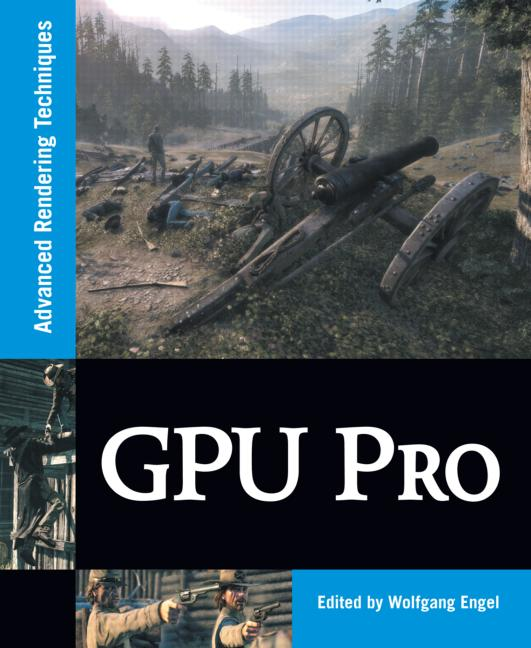

图 《GPU Pro 1》封面

 

# 《GPU Pro 1》书本配套源代码

类似之前的GPU Gems系列的源码收藏GitHub repo（<https://github.com/QianMo/GPU-Gems-Book-Source-Code>），我也维护了的一个名为“GPU-Pro-Books-Source-Code”的GitHub仓库，以备份GPU Pro系列珍贵的资源，也方便直接在GitHub Web端查看业界大牛们写的代码，链接如下：

<https://github.com/QianMo/GPU-Pro-Books-Source-Code>

 

# Part I. 游戏渲染技术剖析 Game Postmortems

 

## 一、《孢子（Spore）》中的风格化渲染 | Stylized Rendering in Spore

《孢子（Spore）》是一款非常有创意的游戏。在游戏《孢子（Spore）》中，使用了可编程过滤链系统（scriptable filter chain system）在运行时对帧进行处理，以实现游戏整体独特的风格化渲染。（注，在本文中，filter按语境，译为滤波或者过滤）。

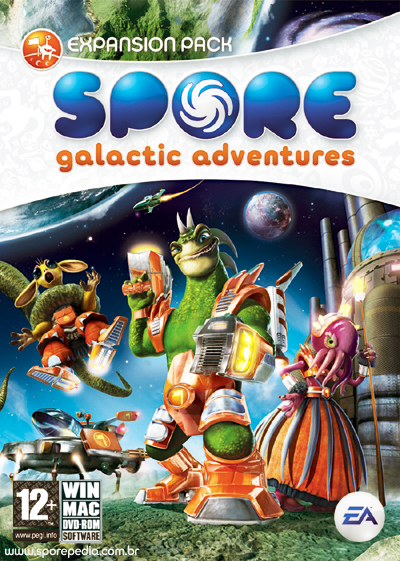

图 《孢子》封面图

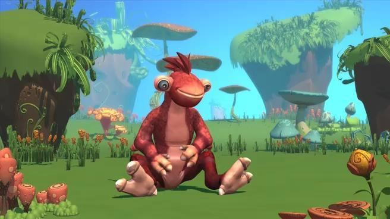

图 《孢子》中的风格化渲染

过滤器链（filter chain）可以看作一系列按顺序应用的参数化的图像处理（image processing）着色器，即后处理链。《孢子》中的每一帧都使用此系统进行处理和合成。
除了《孢子》标准的艺术导向的视觉风格外，开发人员还创建了一组特有的滤波器，为游戏产生截然不同的视觉风格。而在这章中，作者讲到了一些在开发《孢子》时生成的视觉样式，并分享了关于《孢子》过滤器链系统的设计和实现的细节。

诸如模糊（blur），边缘检测（edge detection）等图像处理技术的GPU实现在图像处理领域较为常见。《孢子》的开发目标是构建一个具有此类过滤器的调色系统，美术师可以利用这些过滤器来创作不同的视觉样式。
下图显示了该系统在渲染管线中如何进行放置。

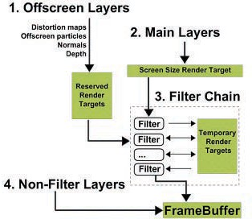

图 过滤器链系统总览

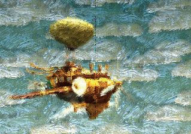

图 《孢子》中以油画方式进行渲染的飞机

下图显示了《孢子》中细胞阶段的过滤器链如何使用由渲染管线的其他阶段生成的多个输入纹理，并形成最终的合成帧。

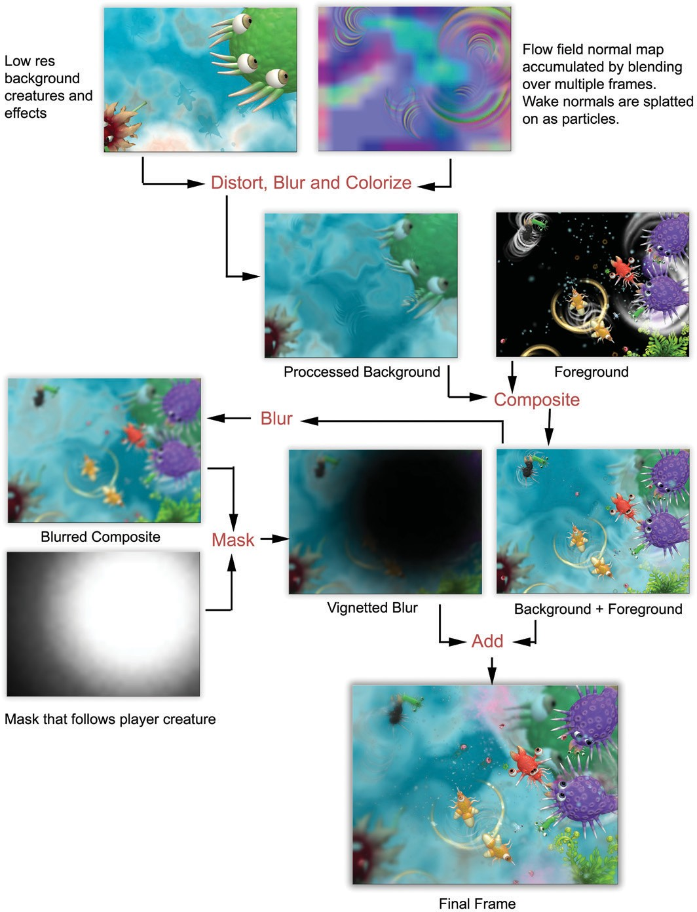

图 《孢子》中细胞阶段游戏流体环境的复杂过滤器链

 

### 1.1 后处理过滤链系统的实现要点

过滤链系统实现的方面，分为两个要点：

-   动态参数（Dynamic parameters）

-   自定义过滤器（Custom filters）

#### 1.1.1 动态参数（Dynamic parameters）

《孢子》中的动态环境需要调用按帧变化参数。所以，游戏中添加了可以通过任何过滤器访问的每帧更新的全局参数。例如，使用相机高度和当日时间作为行星大气过滤器的变化参数，如下图。

而在其他情况下，游戏需要在给定过滤器的两组不同参数值之间平滑插值。例如，每当天气系统开始下雨时，全局着色过滤器的颜色就会转换为阴天的灰色。在系统中也添加了支持游戏控制插值的参数，也添加了可以平滑改变滤波器强度的衰减器（fader）。

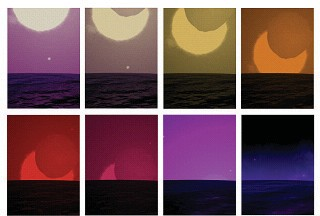

图 按当日时间驱动的颜色过滤器。这种经过彩色压缩的输出会进行模糊并以bloom的方式添加到场景中

#### 1.1.2 自定义过滤器（Custom filters）

过滤链系统的一个重要补充是自定义过滤器，可以将其着色器指定为参数。这意味着程序员可以通过向现有构建添加新着色器来轻松添加新的图像技术。此外，程序员可以通过将多个过滤器折叠到一个实现相同视觉效果的自定义过滤器中来优化艺术家生成的过滤器链。

### 1.2 五种屏幕后处理Shader的实现思路

接着，介绍五种《孢子》中比较有意思的后处理效果。

#### 1.2.1 油画后处理效果 Oil Paint Filter

对于油画过滤器（Oil Paint
Filter），首先渲染画笔描边的法线贴图，用于对传入的场景进行扭曲。
然后使用相同的法线贴图结合三个光源照亮图像空间中的笔触（Brush stroke）。
而笔触可以通过带状的粒子特效驱动，使过滤效果变得动态，并且在时间上更加连贯。

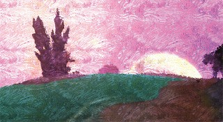

图 《孢子》中的油画后处理效果

用于油画效果的像素着色器核心代码如下：

    # Oil Paint Effect
    # kDistortionScale 0.01, kBrighten 2.0
    # kNormalScales (1.5, 2.5, 1.6)
    # Get the normal map and bring normals into [-1,1] range
    half4 pNormalMap = tex2D ( normalMap , fragIn .uv0 );
    half3 nMapNormal = 2 * pNormalMap .rgb - half3( 1, 1, 1 );

    # Distort the UVs using normals ( Dependent Texture Read!)
    half4 pIn = tex2D (sceneTex ,
    saturate (uv - nMapNormal .xy * kDistortionScale) );

    # Generate the image space lit scene
    half3 fakeTangN = nMapNormal .rbg * kNormalScales;
    fakeTangN = normalize (fakeTangN );

    # Do this for 3 lights and sum , choose different directions
    # and colors for the lights
    half NDotL = saturate (dot (kLightDir , fakeTangN ));
    half3 normalMappingComponent = NDotL * kLightColor ;

    # Combine distorted scene with lit scene
    OUT .color .rgb = pIn .rgb * normalMappingComponent * kBrighten ;

#### 1.2.2 水彩画后处理效果 Watercolor Filter

对于水彩画过滤器（watercolor filter）。首先，使用传入场景的简易Sobel边缘检测版本与原始场景相乘。
然后使用平滑滤波器（smoothing filter）的四个pass对结果进行平滑，且该平滑滤波器从四周的taps中找到每个pass的最亮值。
接着，基于边缘检测的轮廓添加一些在平滑过程中丢失的精确度。
具体核心代码如下，而offset和scales是可调的参数，允许我们改变绘制涂抹笔触的大小。

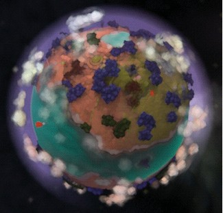

图 《孢子》中的水彩后处理效果

《孢子》中的水彩后处理效果像素着色器代码如下：

    # Water Color Smoothing
    # kScaleX = 0.5, kScaleY = 0.5
    # offsetX1 = 1.5 * kScaleX offsetY1 = 1.5 * kScaleX
    # offsetX2 = 0.5 * kScaleX offsetY2 = 0.5 * kScaleY

    # Get the taps
    tap0 = tex2D (sceneTex , uv + float2 (-offsetX1 ,-offsetY1 ));
    tap1 = tex2D (sceneTex , uv + float2 (-offsetX2 ,-offsetY2 ));
    tap2 = tex2D (sceneTex , uv + float2 (offsetX2 , offsetY2 ));
    tap3 = tex2D (sceneTex , uv + float2 (offsetX1 , offsetY1 ));

    # Find highest value for each channel from all four taps
    ret0 = step(tap1 , tap0 );
    ret1 = step(tap3 , tap2 );
    tapwin1 = tap0* ret0 + tap1 * (1.0 - ret0);
    tapwin2 = tap2* ret1 + tap3 * (1.0 - ret1);
    ret = step(tapwin2 , tapwin1 );
    OUT .color .rgb = tapwin1 * ret + (1.0 -ret) * tapwin2 ;

#### 1.2.3 8位后处理效果 8-Bit Filter

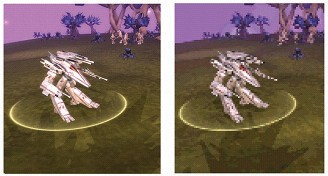

图 8-Bit Filter

要创建一个8位滤波器（8-Bit Filter），可以使用像素着色器中的round函数，并通过点采样绘制到游戏分辨率大小1/4的低分辨率缓冲区中。
这是一个非常简单的效果，使游戏看起来像一个旧式8位游戏。

《孢子》中8-bit后处理效果的像素着色器代码如下：

    # 8 Bit Filter
    # kNumBits : values between 8 and 20 look good
    half4 source = tex2D (sourceTex , fragIn .uv0 );
    OUT .color .rgb = round (source .rgb * kNumBits) / kNumBits ;

#### 1.2.4 黑色电影后处理效果 Film Noir Filter

在创建黑色电影后处理效果时，首先将传入的场景转换为黑白。 然后进行缩放和偏移。添加一些噪声，雨水颗粒效果是很好的画龙点睛。

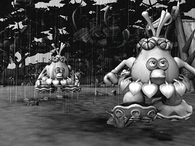

图 《孢子》中黑色电影后处理效果

《孢子》中黑色电影后处理像素着色器代码如下，其中，kNoiseTile可用于调整粒度，而kBias和kScale用作线性对比度拉伸的参数：

    # Film Noir filter
    # kNoiseTile is 4.0
    # kBias is 0.15, kScale is 1.5
    # kNoiseScale is 0.12
    pIn = tex2D (sourceTex , uv);
    pNoise = tex2D (noiseTex , uv * kNoiseTile) ;

    # Standard desaturation
    converter = half3 (0.23 , 0.66, 0.11);
    bwColor = dot (pIn .rgb , converter );

    # Scale and bias
    stretched = saturate (bwColor - kBias) * kScale ;

    # Add
    OUT .color .rgb = stretched + pNoise * kNoiseScale ;

#### 1.2.5 旧电影后处理效果 Old Film Filter

对于旧电影后处理效果，可以采用简单的棕褐色着色与锐化滤波器（sharpen filter）相结合。 且可以使用粒子效果进行划痕和渐晕的处理。

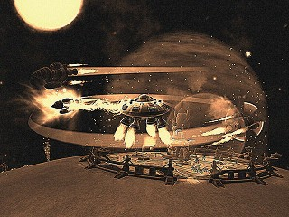

图 旧电影后处理效果

《孢子》中旧电影后处理效果像素着色器代码如下：

    # Old Film Filter
    # offsetX and offsetY are 2 pixels . With such wide taps , we
    # get that weird sharpness that old photos have.
    # kNoiseTile is 5.0, kNoiseScale is 0.18
    # kSepiaRGB is (0.8, 0.5, 0.3)
    # Get the scene and noise textures
    float4 sourceColor = tex2D (sourceTex , uv);
    float4 noiseColor = tex2D (noiseTex , uv * kNoiseTile );

    # sharpen filter
    tap0 = tex2D (sceneTex , uv + float2 (0, -offsetY ));
    tap1 = tex2D (sceneTex , uv + float2 (0, offsetY ));
    tap2 = tex2D (sceneTex , uv + float2 (-offsetX , 0));
    tap3 = tex2D (sceneTex , uv + float2 (offsetX , 0));
    sourceColor = 5 * sourceColor - (tap0 + tap1 + tap2 + tap3 );

    # Sepia colorize
    float4 converter = float4 (0.23 , 0.66, 0.11, 0);
    float bwColor = dot (sourceColor , converter );
    float3 sepia = kSepiaRGB * bwColor ;

    # Add noise
    OUT .color = sepia * kTintScale + noiseColor * kNoiseScale ;

关于《孢子》更多的风格化渲染的教程，可以在这里找到：

<http://www.spore.com/comm/tutorials>

 

## 二、《狂野西部：生死同盟》中的渲染技术 | Rendering Techniques in Call of Juarez: Bound in Blood

《狂野西部：生死同盟》（Call of Juarez: Bound in Blood）是由Techland公司开发，育碧发行，并于2009年夏季在PS3，Xbox360和PC上发布的游戏。

图《狂野西部：生死同盟》封面

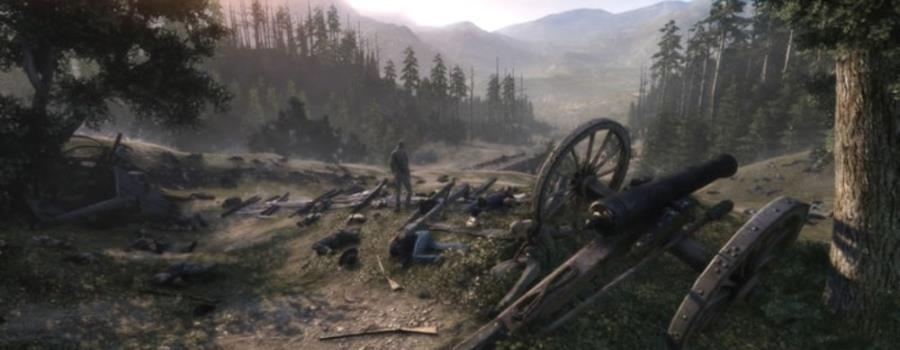

图《GPU Pro 1》的封面，即是采用的《狂野西部：生死同盟》的图片

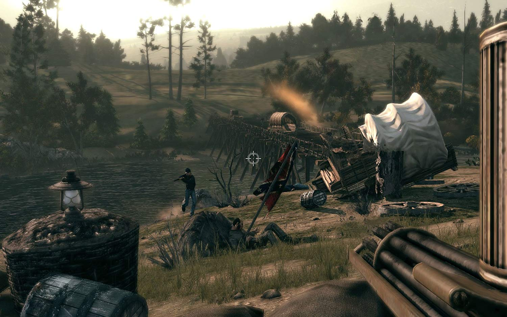

图 《狂野西部：生死同盟》游戏截图

《狂野西部：生死同盟》基于ChromeEngine 4，游戏中大量用到了延迟着色（deferred shading）技术。

众所周知，延迟着色 [Hargreaves 04]是一种在屏幕空间使用存储了诸如漫反射颜色，法向量或深度值等像素信息的中间缓冲区（G-buffer）的技术。

G-buffer是一组屏幕大小的渲染目标（MRT），可以使用现代图形硬件在单个pass中生成，可以显着降低渲染负载。然后使用G-buffer作为着色算法的输入（例如光照方程），而无需浏览原始几何体（此阶段计算所需的所有信息，如三维世界空间中的像素的位置，可以从G-buffer中提取）。以这种方式，算法仅对可见像素进行操作，这极大地降低了照明计算的复杂性。

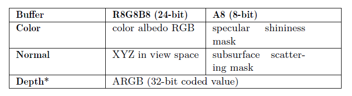

表 《狂野西部：生死同盟》中的MRT配置

延迟着色方法的主要优点是对渲染管线的简化，节省复杂着色器资源和计算的开销，以及能对复杂光照（如动态光源）进行简约而健壮的管理。

延迟着色技术在与后处理渲染效果的结合方面可以获得不错的化学反应。在《狂野西部：生死同盟》中，延迟渲染与诸如屏幕空间环境光遮蔽（SSAO），运动模糊（motion-blur），色调映射（tone mapping）以及用于改善最终图像质量的边缘抗锯齿（edge anti-aliasing）等后处理效果都可以很好的结合使用。

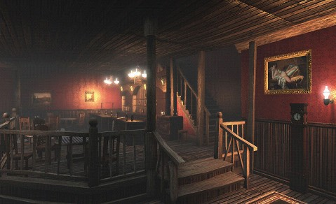

图 拥有动态光源和环境光遮蔽的室内场景

这章中还展示了不少《狂野西部：生死同盟》中自然现象效果的渲染方法，如雨滴，体积地面雾，light shafts，真实感天空和云彩，水面渲染，降雨效果，以及体积光的渲染技巧。以及色调映射相关的技术。

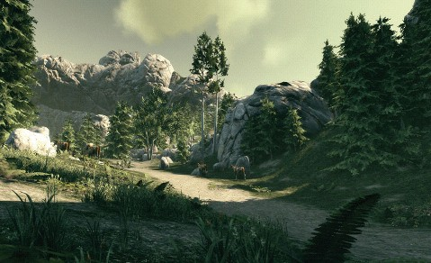

图 场景色调映射，在阴影区域和光照区域之间转换

 

## 三、《正当防卫2》中的大世界制作经验与教训 | Making it Large, Beautiful, Fast,and Consistent: Lessons Learned

《正当防卫2（Just Cause 2）》是Avalanche Studios为PC，Xbox 360和PLAYSTATION
3开发的沙盒游戏。游戏的主要风格是大世界，主要视觉特征是具有巨大渲染范围的巨型景观，森林、城市、沙漠、丛林各种环境不同的气候，以及昼夜循环技术。

图 《正当防卫2》封面

对于多动态光源的渲染，《正当防卫2》没有使用延迟渲染，而是提出了一种称作光源索引（Light indexing）的方案，该方案可以使用前向渲染渲染大量动态光源，而无需多个pass，或增加draw calls。

### 3.1 光照索引 Light indexing

光照索引（Light indexing）技术的核心思路是：通过RGBA8格式128 x 128的索引纹理将光照信息提供给着色器。

将该纹理映射到摄像机位置周围的XZ平面中，并进行点采样。 每个纹素都映射在一个4m x 4m的区域，并持有四个该正方形相关的光源索引。这意味着我们覆盖了512m × 512m的区域，且动态光源处于活动状态。

活动光源存储在单独的列表中，可以是着色器常量，也可以是一维纹理，具体取决于平台。虽然使用8位通道可以索引多达256个光源，但我们将其限制为64个，以便将光源信息拟合到着色器常量中。每个光源都有两个恒定的寄存器，保存位置（position），倒数平方半径（reciprocal squared radius）和颜色（color）这三个参数。

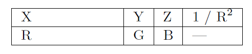

表 光源常量

此外，还有一个额外的“禁用（disabled）”光源槽位，其所有这些都设置为零。那么总寄存器计数会达到130。当使用一维纹理时，禁用的光源用边框颜色（border color）编码替代。 位置和倒数平方半径以RGBA16F格式存储，颜色以RGBA8格式存储。为了保持精度，位置存储在相对于纹理中心的局部空间中。

光源索引纹理在CPU上由全局光源列表生成。一开始，其位置被放置在使得纹理区域被充分利用的位置，最终以尽可能小的空间，放置在摄像机之后。

在启用并落入索引纹理区域内的光源中，根据优先级，屏幕上的近似大小以及其他因素来选择最相关的光源。每个光源都插入其所覆盖的纹素的可用通道中。如果纹理像素被四个以上的光源覆盖，则需要丢弃此光源。

如果在插入时纹理像素已满，程序将根据图块中的最大衰减系数检查入射光源是否应替换任何现有的光源，以减少掉光源的视觉误差。这些误差可能导致图块边框周围的光照不连续性。通常这些误差很小，但当四处移动时可能非常明显。而为了避免这个问题，可以将索引纹理对齐到纹素大小的坐标中。在实践中，光源的丢弃非常少见，通常很难发现。

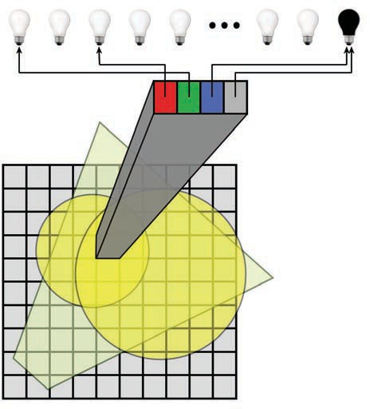

图 轴对齐世界空间中的光照索引。 放置纹理使得尽可能多的区域在视锥体内。 图示的4m x 4m区域由两个由R和G通道索引的光源相交。 未使用的插槽表示禁用的光源。

 

### 3.2 阴影系统 Shadowing System

阴影方面，《正当防卫2》中采用级联阴影映射（cascaded shadow mapping）。并对高性能PC提供软阴影（Soft shadows）选项。虽然在任何情况下都不是物理上的准确，但算法确实会产生真正的软阴影，而不仅仅是在许多游戏中使用的恒定半径模糊阴影。

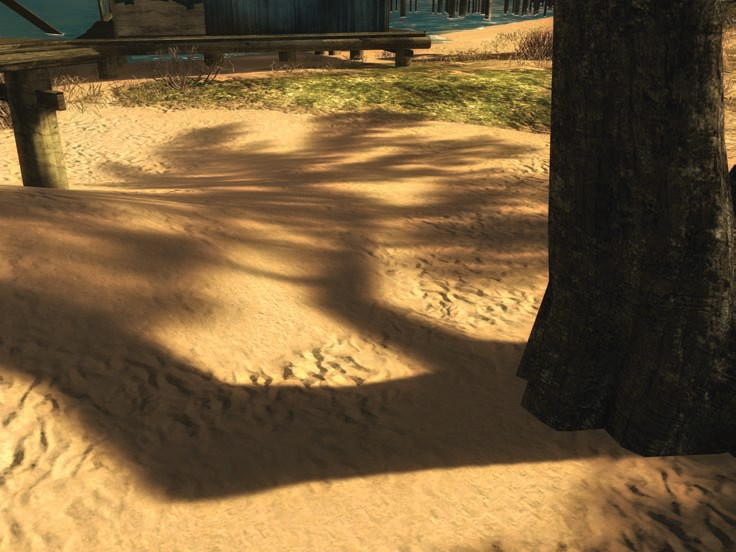

图 《正当防卫2》中的软阴影。注意树底部的锐利阴影逐渐变得柔和，以及注意，树叶投下了非常柔和的阴影。

此软阴影算法的步骤如下：

1、在阴影贴图中搜索遮挡物的邻域。

2、投射阴影的样本计为遮挡物。

3、将遮挡物中的中心样本的平均深度差用作第二个pass中的采样半径，并且在该半径内取多个标准PCF样本并取平均值。

4、为了隐藏有限数量的样本失真，采样图案以从屏幕位置产生的伪随机角度进行旋转。

实现Shader代码如下：

    // Setup rotation matrix
    float3 rot0 = float3(rot.xy, shadow_coord.x);
    float3 rot1 = float3(float2(-1, 1) * rot.yx, shadow_coord.y);
    float z = shadow_coord.z * BlurFactor;

    // Find average occluder distances .
    // Only shadowing samples are taken into account .
    [unroll] for (int i = 0; i<SHADOW_SAMPLES; i++)
    {
        coord.x = dot(rot0 , offsets[i]);
        coord.y = dot(rot1 , offsets[i]);
        float depth = ShadowMap.Sample(ShadowDepthFilter, coord).r;
        de.x = saturate(z - depth* BlurFactor);
        de.y = (de.x > 0.0);
        dd += de;
    }

    // Compute blur radius
    float radius = dd.x / dd.y + BlurBias;
    rot0.xy *= radius ;
    rot1.xy *= radius ;

    // Sample shadow with radius
    [unroll] for (int k = 0; k<SHADOW_SAMPLES; k++)
    {
        coord.x = dot(rot0 , offsets[k]);
        coord.y = dot(rot1 , offsets[k]);
        shadow += ShadowMap.SampleCmpLevelZero(
        ShadowComparisonFilter, coord, shadow_coord.z).r;
    }

### 3.3 环境光遮蔽 Ambient Occlusion

对于环境遮挡（AO），使用了三种不同的技术：

-   美术师生成的AO（artist-generated AO）
-   遮挡体（Occlusion Volumes）
-   SSAO [Kajalin 09]

其中，美术师生成的环境光遮蔽用于静态模型，由材质属性纹理中的AO通道组成。此外，美术师有时会在关键点放置环境遮挡几何。对于动态对象，使用遮挡体（OcclusionVolumes）在底层几何体上投射遮挡阴影，主要是角色和车辆下的地面。而SSAO是PC版本的可选设置，里面使用了一种从深度缓冲导出切线空间的方案。

其中，SSAO从深度缓冲区导出切线空间的实现Shader代码如下：

    // Center sample
    float center = Depth . Sample ( Filter , In. TexCoord . xy ). r;

    // Horizontal and vertical neighbors
    float  x0  =  Depth.Sample ( Filter , In. TexCoord .xy , int2 (-1 , 0)). r; 
    float  x1  =  Depth.Sample ( Filter , In. TexCoord .xy , int2 ( 1 , 0)). r; 
    float  y0  =  Depth.Sample ( Filter , In. TexCoord .xy , int2 ( 0 , 1)). r; 
    float  y1  =  Depth.Sample ( Filter , In. TexCoord .xy , int2 ( 0 , -1)). r;

    // Sample another step as well for edge detection
    float ex0 = Depth . Sample ( Filter , In. TexCoord , int2 (-2 , 0)). r; 
    float ex1 = Depth . Sample ( Filter , In. TexCoord , int2 ( 2 , 0)). r; 
    float ey0 = Depth . Sample ( Filter , In. TexCoord , int2 ( 0 , 2)). r; 
    float ey1 = Depth . Sample ( Filter , In. TexCoord , int2 ( 0 , -2)). r;

    // Linear depths
    float lin_depth = LinearizeDepth ( center , DepthParams . xy ); 
    float lin_depth_x0  =  LinearizeDepth (x0 , DepthParams .xy ); 
    float lin_depth_x1  =  LinearizeDepth (x1 , DepthParams . xy ); 
    float lin_depth_y0  =  LinearizeDepth (y0 , DepthParams . xy ); 
    float lin_depth_y1  =  LinearizeDepth (y1 , DepthParams . xy );

    //   Local   position   ( WorldPos   -   EyePosition ) float3 pos = In. Dir * lin_depth ;
    float3 pos_x0 = In. DirX0 * lin_depth_x0 ; 
    float3 pos_x1 = In. DirX1 * lin_depth_x1 ; 
    float3 pos_y0 = In. DirY0 * lin_depth_y0 ; 
    float3 pos_y1 = In. DirY1 * lin_depth_y1 ;

    //   Compute   depth   differences    in   screespace    X   and   Y float dx0 = 2.0 f * x0 - center - ex0 ;
    float dx1 = 2.0 f * x1 - center - ex1 ; 
    float dy0 = 2.0 f * y0 - center - ey0 ; 
    float  dy1  =  2.0 f  *  y1  -  center  -  ey1 ;

    // Select the direction that has the straightest
    // slope and compute the tangent vectors float3 tanX , tanY ;
    if ( abs ( dx0 ) < abs ( dx1 )) 
        tanX = pos - pos_x0 ;
    else
        tanX = pos_x1 - pos ;

    if ( abs ( dy0 ) < abs ( dy1 )) 
        tanY = pos - pos_y0 ;
    else
        tanY = pos_y1 - pos ;
    
    tanX = normalize ( tanX ); tanY = normalize ( tanY );
    float3 normal = normalize ( cross ( tanX , tanY ));

### 3.4 其他内容

这一章的其他内容包括：

-   角色阴影（Character Shadows）
-   软粒子（Soft Particles）
-   抖动错误：处理浮点精度（The Jitter Bug: Dealing with Floating-Point Precision）
-   着色器常量管理（Shader constant management）
-   伽马校正和sRGB混合相关问题
-   云层渲染优化（Cloud Rendering Optimization）
-   粒子修剪（Particle Trimming）
-   内存优化（Memory Optimizations）

由于篇幅所限，这些内容无法展开讲解。感兴趣的朋友，不妨可以找到原书对应部分进行阅读。

 

## 四、《矿工战争》中的可破坏体积地形 | Destructible Volumetric Terrain

这篇文章中，主要讲到了游戏《矿工战争（Miner Wars）》中基于体素（voxel）的可破坏体积地形技术。

《矿工战争（Miner Wars）》游戏的主要特征是多维度地形的即时破坏，并且引擎依赖预先计算的数据。
每个地形变化都会实时计算，消耗尽可能少的内存并且没有明显的延迟。

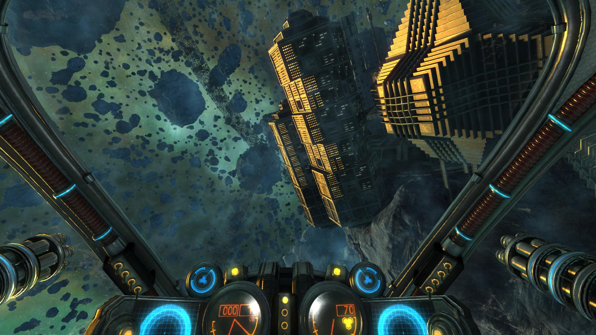

图 《矿工战争》游戏截图

在游戏的实现中，体素是具有以米为单位的实际尺寸的三维像素。
每个体素都保存有关其密度的信息 – 是否全空，是否全满，或介于空和满之间，而体素的材质类型用于贴图，破坏以及游戏逻辑中。

文中将体素贴图（voxel map）定义为一组体素（例如，256 x 512 x 256）的集合。每个体素贴图包含体素的数据单元（data cells），以及包含静态顶点缓冲区和三角形索引的渲染单元（render cells）。

《矿工战争》的引擎不会直接渲染体素，相反，是将体素多边形化，在渲染或检测碰撞之前将其转换为三角形。使用标准的行进立方体（Marching Cubes , MC）算法 [“Marching”09]进行多边形化。

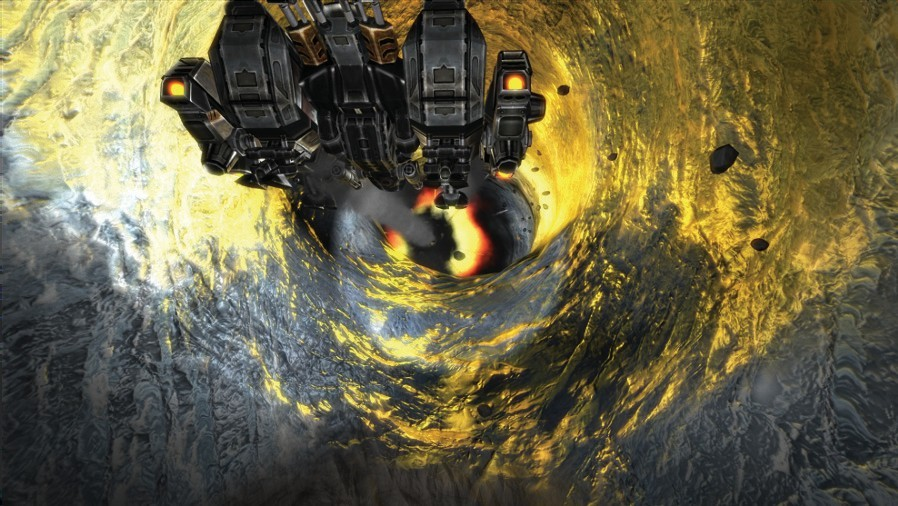

图 一艘采矿船用炸药进行隧道的挖掘

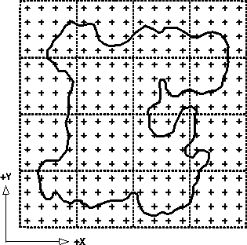

图 具有表示体素边界的虚线的体素图。 此图描绘了4 x 4个体素;

图中的小十字代表体素内的网格点; 实线代表三维模型。

 

# Part II. 渲染技术 Rendering Techniques 

## 五、基于高度混合的四叉树位移贴图 | Quadtree Displacement Mapping with Height Blending 

这章中，介绍了当前表面渲染（surface rendering）技术的概述和相关比较，主要涉及在如下几种方法：

-   Relief Mapping | 浮雕贴图

-   Cone step mapping (CSM) | 锥步映射

-   Relaxed cone step mapping (RCSM) | 宽松锥步映射

-   Parallax Occlusion Mapping(POM) | 视差遮蔽贴图

-   Quadtree Displacement Mapping（QDM）| 四叉树位移贴图

内容方面，文章围绕表面渲染技术，分别介绍了光线追踪与表面渲染、四叉树位移映射（Quadtree Displacement Mapping）、自阴影（Self-Shadowing）、环境光遮蔽（Ambient Occlusion）、表面混合（Surface Blending）几个部分。为了获得最高的质量/性能/内存使用率，文章建议在特定情况下使用视差映射，软阴影，环境遮挡和表面混合方法的组合。

此外，文中还提出了具有高度混合的四叉树位移贴图。对于使用复杂，高分辨率高度场的超高质量表面，该方法明显会更高效。此外，使用引入的四叉树结构提出了高效的表面混合，软阴影，环境遮挡和自动LOD方案的解决方案。在实践中，此技术倾向于以较少的迭代和纹理样本产生更高质量的结果。

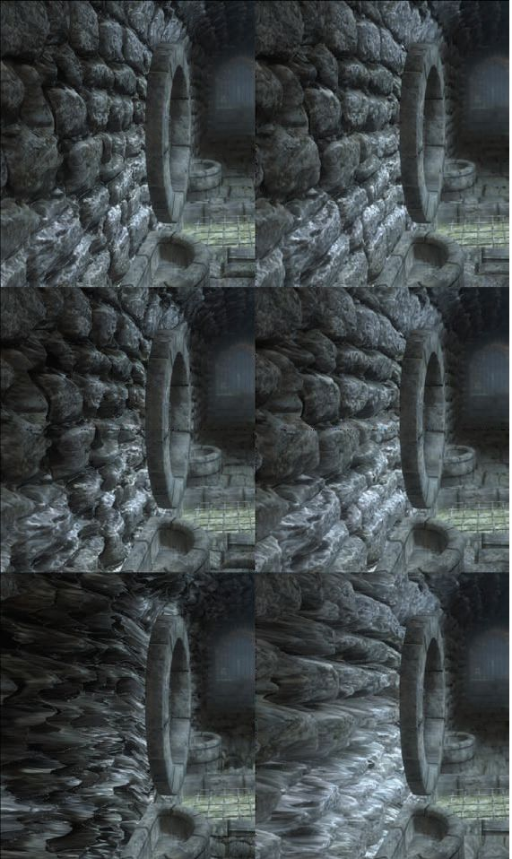

图 Parallax Occlusion Mapping(POM) 视差遮蔽贴图和Quadtree Displacement Mapping（QDM）四叉树位移贴图和的渲染质量比较。其中，左图为POM；右图为QDM。深度尺寸分别为：1.0,1.5,5.0。可以发现，在深度尺寸1.5以上时，使用POM（左图）会看到失真。

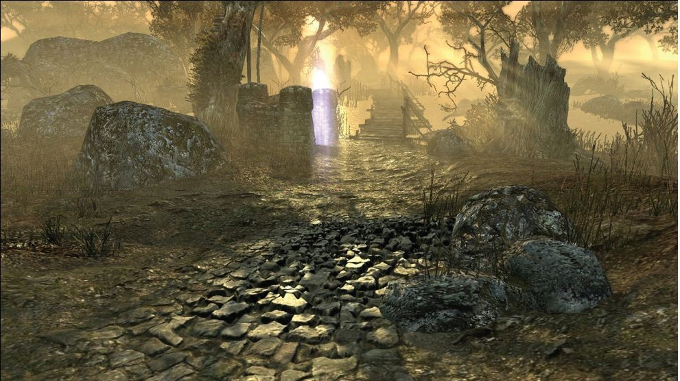

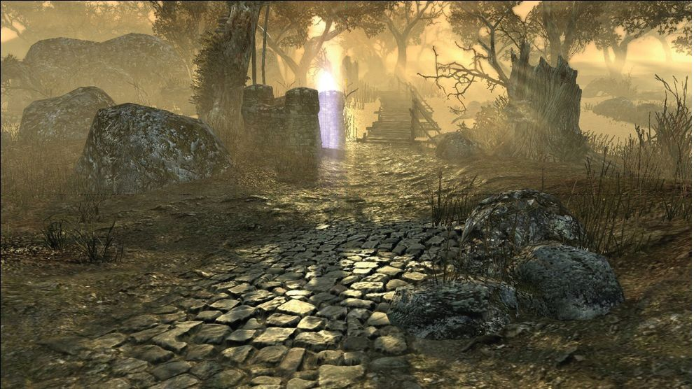

图 表面混合质量比较。上图：浮雕贴图（Relief Mapping），下图：带高度混合的视差遮蔽贴图（POM with height blending）

### 5.1 核心实现Shader代码

以下为视差遮蔽贴图（Parallax Occlusion Mapping，POM）核心代码：

    float Size = 1.0 / LinearSearchSteps;
    float Depth = 1.0;
    int StepIndex = 0;
    float CurrD = 0.0;
    float PrevD = 1.0;
    float2 p1 = 0.0;
    float2 p2 = 0.0;

    while (StepIndex < LinearSearchSteps)
    {
        Depth -= Size; // move the ray
        float4 TCoord = float2 (p+(v*Depth )); // new sampling pos
        CurrD = tex2D (texSMP , TCoord ).a; //new height
        if (CurrD > Depth ) // check for intersection
        {
            p1 = float2 (Depth , CurrD );
            p2 = float2 (Depth + Size , PrevD ); // store last step
            StepIndex = LinearSearchSteps; // break the loop
        }
        StepIndex ++;
        PrevD = CurrD ;
    }

    // Linear approximation using current and last step
    // instead of binary search , opposed to relief mapping .
    float d2 = p2.x - p2.y;
    float d1 = p1.x - p1.y;

    return (p1.x * d2 - p2.x * d1) / (d2 - d1);

四叉树位移贴图（Quadtree Displacement Mapping ，QDM）使用mipmap结构来表示密集的四叉树，在高度场的基准平面上方存储最大高度。QDM会在在交叉区域使用细化搜索，以便在需要时找到准确的解决方案。以下为四叉树位移贴图（QDM）搜索的核心代码：

    const int MaxLevel = MaxMipLvl ;
    const int NodeCount = pow (2.0, MaxLevel );
    const float HalfTexel = 1.0 / NodeCount / 2.0;
    float d;
    float3 p2 = p;
    int Level = MaxLevel ;

    //We calculate ray movement vector in inter -cell numbers .
    int2 DirSign = sign(v.xy);

    // Main loop
    while (Level >= 0)
    {
        //We get current cell minimum plane using tex2Dlod .
        d = tex2Dlod (HeightTexture , float4 (p2.xy , 0.0 , Level )). w;
        //If we are not blocked by the cell we move the ray .
        if (d > p2.z)
        {
            //We calculate predictive new ray position .
            float3 tmpP2 = p + v * d;

            //We compute current and predictive position .
            // Calculations are performed in cell integer numbers .
            int NodeCount = pow (2, (MaxLevel - Level ));
            int4 NodeID = int4((p2.xy , tmpP2 .xy) * NodeCount );

            //We test if both positions are still in the same cell.
            //If not , we have to move the ray to nearest cell boundary .
            if (NodeID .x != NodeID .z || NodeID .y != NodeID .w)
            {
                //We compute the distance to current cell boundary .
                //We perform the calculations in continuous space .
                float2 a = (p2.xy - p.xy);
                float2 p3 = (NodeID .xy + DirSign) / NodeCount ;
                float2 b = (p3.xy - p.xy);

                //We are choosing the nearest cell
                //by choosing smaller distance .
                float2 dNC = abs (p2.z * b / a);
                d = min (d, min (dNC .x, dNC .y));

                // During cell crossing we ascend in hierarchy .
                Level +=2;

                // Predictive refinement
                tmpP2 = p + v * d;
            }

            //Final ray movement
            p2 = tmpP2 ;
        }
        
        // Default descent in hierarchy
        // nullified by ascend in case of cell crossing
        Level --;
    }
    return p2;

这章也引入了一种表面混合的新方法，能更自然地适合表面混合，并且保证了更快的收敛。

文中建议使用高度信息作为额外的混合系数，从而为混合区域和更自然的外观添加更多种类，具体实现代码如下：

    float4 FinalH ;
    float4 f1 , f2 , f3 , f4;

    //Get surface sample .
    f1 = tex2D(Tex0Sampler ,TEXUV .xy).rgba;

    //Get height weight .
    FinalH .a = 1.0 - f1.a;
    f2 = tex2D(Tex1Sampler ,TEXUV .xy).rgba;
    FinalH .b = 1.0 - f2.a;
    f3 = tex2D(Tex2Sampler ,TEXUV .xy).rgba;
    FinalH .g = 1.0 - f3.a;
    f4 = tex2D(Tex3Sampler ,TEXUV .xy).rgba;
    FinalH .r = 1.0 - f4.a;

    // Modify height weights by blend weights .
    //Per -vertex blend weights stored in IN.AlphaBlends
    FinalH *= IN.AlphaBlends ;

    // Normalize .
    float Blend = dot (FinalH , 1.0) + epsilon ;
    FinalH /= Blend ;

    //Get final blend .
    FinalTex = FinalH .a * f1 + FinalH .b * f2 + FinalH .g * f3 + FinalH .r * f4;

在每个交叉点搜索（intersection search）步骤中，使用新的混合运算符重建高度场轮廓，实现代码如下所示：

    d = tex2D (HeightTexture ,p.xy).xyzw;
    b = tex2D (BlendTexture ,p.xy). xyzw;
    d *= b;
    d = max (d.x ,max (d.y,max (d.z,d.w)));

 

## 六、使用几何着色器的NPR效果 | NPR Effects Using the Geometry Shader

本章的内容关于非真实感渲染（Non-photorrealistic rendering ，NPR）。在这章中，介绍了一组利用GPU几何着色器流水线阶段实现的技术。

具体来说，文章展示了如何利用几何着色器来在单通道中渲染对象及其轮廓，并对铅笔素描效果进行了模拟。

单通道方法通常使用某种预计算来将邻接信息存储到顶点中[Card and Mitchell 02]，或者使用几何着色器 [Doss 08]，因为可能涉及到查询邻接信息。这些算法在单个渲染过程中生成轮廓，但对象本身仍需要第一个几何通道。

### 6.1 轮廓渲染（Silhouette Rendering）

轮廓渲染是大多数NPR效果的基本元素，因为它在物体形状的理解中起着重要作用。在本节中，提出了一种在单个渲染过程中检测，生成和纹理化模型的新方法。

轮廓渲染（Silhouette rendering）技术中， 两大类算法需要实时提取轮廓：

-   基于阴影体积的方法（shadow volume-based approaches）

-   非真实感渲染（non-photorealistic rendering）

而从文献中，可以提取两种不同的方法：

-   对象空间算法（object-space algorithms）

-   图像空间算法（image-space algorithms）

但是，大多数现代算法都在图像空间（image space）或混合空间（hybrid space）中工作。本章中主要介绍基于GPU的算法。GPU辅助算法可以使用多个渲染通道或单个渲染通道来计算轮廓。

为了一步完成整个轮廓渲染的过程，将会使用到几何着色器（geometry shader）。因为几何着色阶段允许三角形操作，能获取相邻三角形的信息，以及为几何体生成新的三角形。

轮廓渲染过程在流水线的不同阶段执行以下步骤：

-   顶点着色器（Vertex shader）。 顶点以通常的方式转换到相机空间。

-   几何着色器（Geometry shader）。
    在该阶段中，通过使用当前三角形及其邻接的信息来检测属于轮廓的边缘，并生成相应的几何体。

-   像素着色器（Pixel shader）。
    对于每个栅格化片段，生成其纹理坐标，并根据从纹理获得的颜色对像素进行着色。

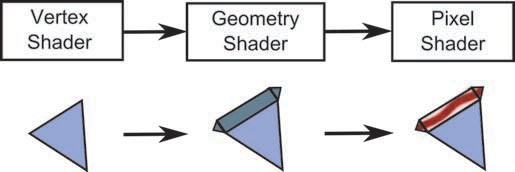

图 管线概述：顶点着色器（左）变换传入几何体的顶点坐标;第二步（几何着色器）为对象的轮廓生成新几何体。最后，像素着色器生成正确的纹理坐标。

几何着色器轮廓检测代码如下：

    [maxvertexcount (21)]
    void main( triangleadj VERTEXin input [6],
    inout TriangleStream <VERTEXout > TriStream )
    {
        // Calculate the triangle normal and view direction .
        float3 normalTrian = getNormal ( input [0].Pos .xyz ,
            input [2].Pos .xyz , input [4].Pos .xyz );
        float3 viewDirect = normalize (-input [0].Pos .xyz
            - input [2]. Pos .xyz - input [4].Pos .xyz );

        //If the triangle is frontfacing
        [branch ]if(dot (normalTrian ,viewDirect ) > 0.0f)
        {
            [loop]for (uint i = 0; i < 6; i+=2)
            {
                // Calculate the normal for this triangle .
                float auxIndex = (i+2)%6;
                float3 auxNormal = getNormal ( input [i].Pos .xyz ,
                    input[i+1].Pos .xyz , input[auxIndex ].Pos .xyz );
                float3 auxDirect = normalize (- input[i].Pos .xyz
                    - input [i+1].Pos .xyz - input[auxIndex ].Pos .xyz );

                //If the triangle is backfacing
                [branch ]if(dot (auxNormal ,auxDirect) <= 0.0f)
                {
                    // Here we have a silhouette edge.
                }
            }
        }
    }

几何着色器轮廓生成代码如下：

    // Transform the positions to screen space .
    float4 transPos1 = mul (input [i].Pos ,projMatrix );
    transPos1 = transPos1 /transPos1 .w;
    float4 transPos2 = mul (input [auxIndex ].Pos ,projMatrix );
    transPos2 = transPos2 /transPos2 .w;

    // Calculate the edge direction in screen space .
    float2 edgeDirection = normalize (transPos2 .xy - transPos1 .xy);

    // Calculate the extrude vector in screen space .
    float4 extrudeDirection = float4 (normalize (
    float2 (-edgeDirection.y ,edgeDirection.x)) ,0.0f ,0.0f);

    // Calculate the extrude vector along the vertex
    // normal in screen space.
    float4 normExtrude1 = mul (input [i].Pos + input [i]. Normal
    ,projMatrix );
    normExtrude1 = normExtrude1 / normExtrude1.w;
    normExtrude1 = normExtrude1 - transPos1 ;
    normExtrude1 = float4 (normalize (normExtrude1.xy),0.0f ,0.0f);
    float4 normExtrude2 = mul (input [auxIndex ].Pos
    + input [auxIndex ].Normal ,projMatrix );
    normExtrude2 = normExtrude2 / normExtrude2.w;
    normExtrude2 = normExtrude2 - transPos2 ;
    normExtrude2 = float4 (normalize (normExtrude2.xy),0.0f ,0.0f);

    // Scale the extrude directions with the edge size.
    normExtrude1 = normExtrude1 * edgeSize ;
    normExtrude2 = normExtrude2 * edgeSize ;
    extrudeDirection = extrudeDirection * edgeSize ;

    // Calculate the extruded vertices .
    float4 normVertex1 = transPos1 + normExtrude1;
    float4 extruVertex1 = transPos1 + extrudeDirection;
    float4 normVertex2 = transPos2 + normExtrude2;
    float4 extruVertex2 = transPos2 + extrudeDirection;

    // Create the output polygons .
    VERTEXout outVert ;
    outVert .Pos = float4 (normVertex1 .xyz ,1.0f);
    TriStream .Append (outVert );
    outVert .Pos = float4 (extruVertex1.xyz ,1.0f);
    TriStream .Append (outVert );
    outVert .Pos = float4 (transPos1 .xyz ,1.0f);
    TriStream .Append (outVert );
    outVert .Pos = float4 (extruVertex2.xyz ,1.0f);
    TriStream .Append (outVert );
    outVert .Pos = float4 (transPos2 .xyz ,1.0f);
    TriStream .Append (outVert );
    outVert .Pos = float4 (normVertex2 .xyz ,1.0f);
    TriStream .Append (outVert );
    TriStream .RestartStrip();

在像素着色器中轮廓纹理映射的实现代码：

    float4 main(PIXELin inPut ):SV_Target
    {
        // Initial texture coordinate .
        float2 coord = float2 (0.0f,inPut.UV.z);

        // Vector from the projected center bounding box to
        //the location .
        float2 vect = inPut .UV.xy - aabbPos ;

        // Calculate the polar coordinate .
        float angle = atan(vect.y/vect.x);
        angle = (vect.x < 0.0 f)? angle+PI:
        (vect.y < 0.0f)?angle +(2* PI): angle ;

        // Assign the angle plus distance to the u texture coordinate .
        coord .x = ((angle /(2* PI)) + (length (vect)* lengthPer ))* scale;

        //Get the texture color .
        float4 col = texureDiff .Sample (samLinear ,coord );

        // Alpha test.
        if(col .a < 0.1 f)
        discard ;
        
        // Return color .
        return col ;
    }

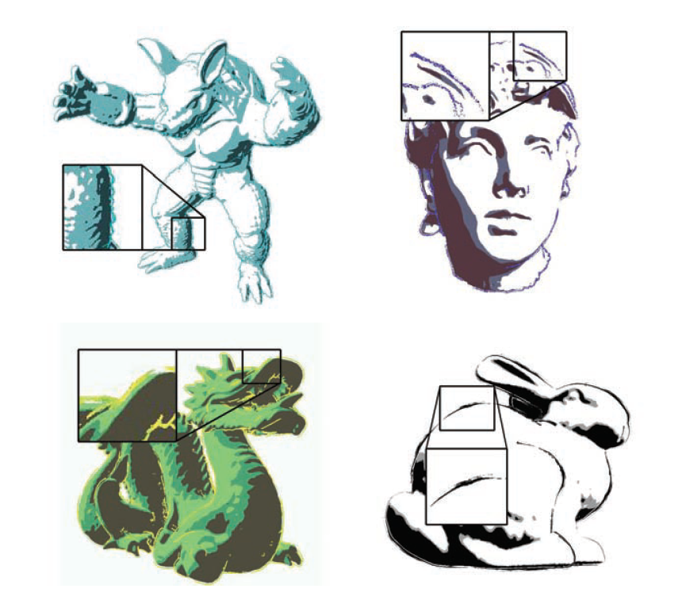

图 轮廓渲染算法的运行效果图，轮廓剪影的实时生成和纹理化。

完整的实现Shader源码可见：
<https://github.com/QianMo/GPU-Pro-Books-Source-Code/blob/master/GPU-Pro-1/03_Rendering%20Techniques/02_NPReffectsusingtheGeometryShader/NPRGS/NPRGS/Silhouette.fx>

### 6.2 铅笔素描渲染（Pencil Rendering）

基于Lee等人[Lee et al. 06]铅笔渲染思路可以概括如下。

首先，计算每个顶点处的最小曲率（curvature）。然后，三角形和其曲率值作为每个顶点的纹理坐标传入管线。
为了对三角形的内部进行着色，顶点处的曲率用于在屏幕空间中旋转铅笔纹理。该铅笔纹理会在屏幕空间中进行三次旋转，每个曲率一次，旋转后的结果进行混合结合。不同色调的多个纹理，存储在纹理阵列中，同时进行使用。最终，根据光照情况在其中选择出正确的一个。

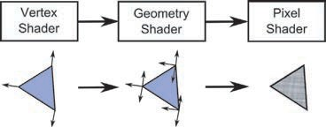

图 管线概述：顶点着色器将顶点转换为屏幕空间;几何着色器将三角形的顶点曲率分配给三个顶点。最后，像素着色器生成三个曲率的纹理坐标并计算最终颜色。

可以通过以下方式使用GPU管线实现此算法：

-   顶点着色器（Vertex shader）。 顶点转换为屏幕坐标。顶点曲率也被变换，只有x和y分量作为二维向量传递。

-   几何着色器（Geometry shader）。 将曲率值作为纹理坐标分配给每个顶点。

-   像素着色器（Pixel shader）。 计算最终颜色。

几何着色器的实现代码如下：

    [maxvertexcount (3)]
    void main( triangle VERTEXin input [3],
    inout TriangleStream <VERTEXout > TriStream )
    {
        // Assign triangle curvatures to the three vertices .
        VERTEXout outVert ;
        outVert .Pos = input [0].Pos ;
        outVert .norm = input [0]. norm;
        outVert .curv1 = input [0]. curv;
        outVert .curv2 = input [1]. curv;
        outVert .curv3 = input [2]. curv;
        TriStream .Append (outVert );
        outVert .Pos = input [1].Pos ;
        outVert .norm = input [1]. norm;
        outVert .curv1 = input [0]. curv;
        outVert .curv2 = input [1]. curv;
        outVert .curv3 = input [2]. curv;
        TriStream .Append (outVert );
        outVert .Pos = input [2].Pos ;
        outVert .norm = input [2]. norm;
        outVert .curv1 = input [0]. curv;
        outVert .curv2 = input [1]. curv;
        outVert .curv3 = input [2]. curv;
        TriStream .Append (outVert );
        TriStream . RestartStrip();
    }

像素着色器的实现代码如下：

    float4 main(PIXELin inPut ):SV_Target
    {
        float2 xdir = float2 (1.0f ,0.0f);
        float2x2 rotMat ;
        // Calculate the pixel coordinates .
        float2 uv = float2 (inPut .Pos .x/width ,inPut .Pos .y/height );

        // Calculate the rotated coordinates .
        float2 uvDir = normalize (inPut .curv1 );
        float angle = atan(uvDir .y/uvDir.x);
        angle = (uvDir .x < 0.0 f)? angle +PI:
        (uvDir .y < 0.0f)? angle +(2* PI): angle ;
        float cosVal = cos (angle );
        float sinVal = sin (angle );
        rotMat [0][0] = cosVal ;
        rotMat [1][0] = -sinVal ;
        rotMat [0][1] = sinVal ;
        rotMat [1][1] = cosVal ;
        float2 uv1 = mul (uv ,rotMat );

        uvDir = normalize (inPut.curv2 );
        angle = atan(uvDir .y/uvDir.x);
        angle = (uvDir .x < 0.0 f)? angle +PI:
        (uvDir .y < 0.0f)? angle +(2* PI): angle ;
        cosVal = cos (angle );
        sinVal = sin (angle );
        rotMat [0][0] = cosVal ;
        rotMat [1][0] = -sinVal ;
        rotMat [0][1] = sinVal ;
        rotMat [1][1] = cosVal ;
        float2 uv2 = mul (uv ,rotMat );

        uvDir = normalize (inPut .curv3 );
        angle = atan(uvDir.y/uvDir.x);
        angle = (uvDir .x < 0.0 f)? angle +PI:
        (uvDir .y < 0.0f)?angle +(2* PI): angle ;
        cosVal = cos (angle );
        sinVal = sin (angle );
        rotMat [0][0] = cosVal ;
        rotMat [1][0] = -sinVal ;
        rotMat [0][1] = sinVal ;
        rotMat [1][1] = cosVal ;
        float2 uv3 = mul (uv ,rotMat );

        // Calculate the light incident at this pixel.
        float percen = 1.0f - max (dot (normalize (inPut .norm),
        lightDir ) ,0.0);

        // Combine the three colors .
        float4 color = (texPencil .Sample (samLinear ,uv1 )*0.333 f)
        +( texPencil .Sample (samLinear ,uv2 )*0.333 f)
        +( texPencil .Sample (samLinear ,uv3 )*0.333 f);

        // Calculate the final color .
        percen = (percen *S) + O;
        color .xyz = pow (color .xyz ,float3 (percen ,percen ,percen ));
        return color;
    }

最终的渲染效果：

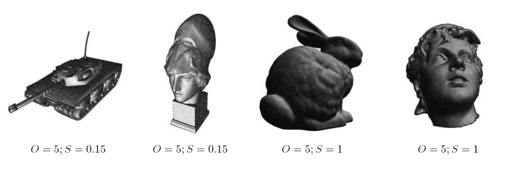

图 铅笔渲染效果图

完整的实现Shader源码可见：
<https://github.com/QianMo/GPU-Pro-Books-Source-Code/blob/master/GPU-Pro-1/03_Rendering%20Techniques/02_NPReffectsusingtheGeometryShader/NPRGS/NPRGS/Pencil.fx>

 

## 七、后处理Alpha混合 | Alpha Blending as a Post-Process

在这篇文章中提出了一种新的Alpha混合技术，屏幕空间Alpha遮罩（ Screen-Space Alpha Mask ,简称SSAM）。该技术首次运用于赛车游戏《Pure》中。《Pure》发行于2008年夏天，登陆平台为Xbox360,PS3和PC。

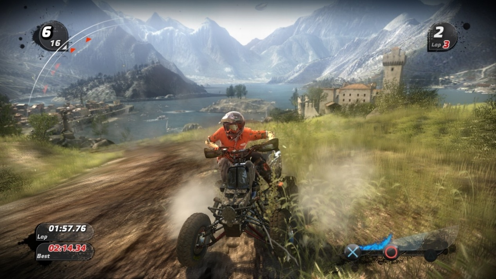

图 《Pure》中的场景（tone mapping & bloom效果）

在《Pure》的开发过程中，明显地需要大量的alpha混合（alpha blending）操作。但是众所周知，传统的计算机图形学的难题之一，就是正确地进行alpha混合操作，并且往往在性能和视觉质量之间，经常很难权衡。

实际上，由于不愿意承担性能上的风险，一些游戏会完全去避免使用alpha混合。有关alpha混合渲染所带来的问题的全面介绍，可以参考[Thibieroz 08]，以及[Porter and Duff 84]。

在这篇文章中，提出了一种新颖的（跨平台）解决方案，用于树叶的alpha混合，这种解决方案可以提高各种alpha测试级渲染的质量，为它们提供真正的alpha混合效果。

文中设计的解决方案——屏幕空间Alpha遮罩（Screen-Space Alpha Mask ,简称SSAM），是一种采用渲染技术实现的多通道方法，如下图。无需任何深度排序或几何分割。

在《Pure》中使用的SSAM技术对环境的整体视觉质量有着深远的影响。
效果呈现出柔和自然的外观，无需牺牲画面中的任何细节。

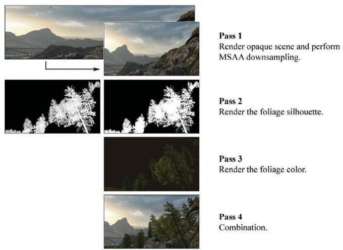

图 SSAM的技术思路图示

此解决方案可以产生与alpha混合相同的结果，同时使用alpha测试技术正确解决每个像素的内部重叠（和深度交集）。

文中使用全屏幕后处理高效地执行延迟alpha混合（deferred alpha blending），类似于将帧混合操作设置为ADD的帧缓冲混合;源和目标参数分别设置为SRCALPHA和INVSRCALPHA。

混合输入被渲染成三个单独的渲染目标（render targets），然后绑定到纹理采样器（texture samplers），由最终的组合后处理像素着色器引用。

在内存资源方面，至少需要三个屏幕分辨率的渲染目标，其中的两个至少具有三个颜色的通道（rtOpaque & rtFoliage），而另一个至少有两个通道（rtMask）和一个深度缓冲区（rtDepth） 。

下面列举一些SSAM的优点和缺点。

SSAM的优点：

-   树叶边缘与周围环境平滑融合。

-   使用alpha测试技术，在每像素的基础上对内部重叠和相互穿透的图元进行排序。

-   该效果使用简单，低成本的渲染技术实现，不需要任何几何排序或拆分（只需要原始调度顺序的一致性）。

-   无论场景复杂度和overdraw如何，最终的混合操作都是以线性成本（每像素一次）来执行运算。

-   该效果与能渲染管线中的其他alpha混合阶段（如粒子等）完美集成。

-   与其他优化（如将光照移到顶点着色器）以及优化每个通道的着色器等方法结合使用时，总体性能可能会高于基于MSAA（MultiSampling
    Anti-Aliasing，多重采样抗锯齿）的技术。

SSAM的缺点：

-   需要额外的渲染Pass的开销。

-   内存要求更高，因为需要存储三张图像。

-   该技术不能用于对大量半透明，玻璃状的表面进行排序（或横跨大部分屏幕的模糊alpha梯度），可能会产生失真。

### 7.1 核心实现Shader代码

最终后处理合成的像素着色器实现代码：

    sampler2D rtMask : register (s0);
    sampler2D rtOpaque : register (s1);
    sampler2D rtFoliage : register (s2);
    half maskLerp : register (c0); // 0.85h
    half4 main(float2 texCoord : TEXCOORD0) : COLOR
    {
        half4 maskPixel = tex2D ( rtMask , texCoord );
        half4 opaquePixel = tex2D ( rtOpaque , texCoord );
        half4 foliagePixel = tex2D (rtFoliage , texCoord );
        half mask = lerp(maskPixel .x , maskPixel .w, maskLerp );
        return lerp(opaquePixel , foliagePixel , mask * mask);
    }

## 八、虚拟纹理映射简介 | Virtual Texture Mapping 101

在这篇文章主要探讨了如何实现一个功能完备的虚拟纹理映射（Virtual Texture Mapping，VTM）系统。

首先，虚拟纹理映射（VTM）是一种将纹理所需的图形内存量减少到仅取决于屏幕分辨率的技术：对于给定的视点，我们只将纹理的可见部分保留在图形存储器中适当的MIP映射级别上，如下图。

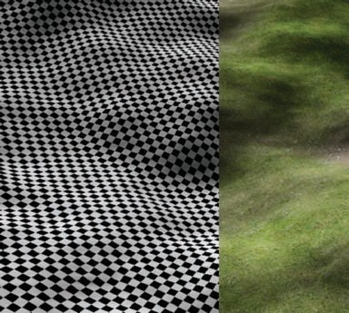

图 使用单个的虚拟纹理渲染出独特的纹理地形

早期的纹理管理方案是针对单个大纹理设计的[Tanner et al. 98],文章发表期间的VTM系统则更加灵活，模仿了操作系统的虚拟内存管理的思路：将纹理分成小的图块（tiles），或者页（pages）[Kraus and Ertl 02, Lefebvre et al.04]。这些会根据渲染当前视点的需要自动缓存并加载到GPU上。但是，有必要将对缺失数据的访问重定向（redirect）到后备纹理。这可以防止渲染中出现“空洞”（加载请求完成前的阻塞和等待的情况）。

文中的实现的灵感来源于GDC上Sean Barrett[Barret 08]的演讲。如下图所示，在每帧开始，先确定哪些图块（tiles）可见，接着识别出其中没有缓存且没有磁盘请求的图块。在图块上传到GPU上的图块缓存之后，更新一个间接纹理（indrection texture,）或者页表（page table）。最终，渲染场景，对间接纹理执行初始查找，以确定在图块缓存中采样的位置。

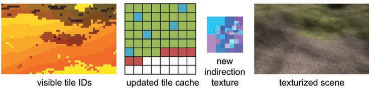

图 渲染图块ID，然后识别并更新最近可见的图块到图块缓存中（图中的红色），并可能会覆盖不再可见的图块（图中的蓝色）。更新间接纹理并渲染纹理化表面（texturized surfaces）

间接纹理（indirection texture）是完整虚拟纹理的缩小版本，其中每个纹素都指向图块缓存（tile cache）中的图块。在文中的示例中，图块缓存只是GPU上的一个大纹理，包含小的，相同分辨率的正方形图块。

这意味着来自不同mip map级别的图块（tiles）会覆盖虚拟纹理的不同大小区域，但会大大简化图块缓存的管理。

## 8.1 核心实现Shader代码

### 8.1.1 MIP 贴图计算的Shader实现 | MIP Map Calculation

    float ComputeMipMapLevel(float2 UV_pixels , float scale)
    {
        float2 x_deriv = ddx (UV_pixels );
        float2 y_deriv = ddy (UV_pixels );
        float d = max (length (x_deriv ), length (y_deriv ));
        return max (log2(d) - log2(scale ), 0);
    }

#### 8.1.2 图块ID 的Shader实现 | Tile ID Shader

    float2 UV_pixels = In.UV * VTMResolution ,

    float mipLevel = ComputeMipMapLevel(UV_pixels , subSampleFactor);
    mipLevel = floor(min (mipLevel , MaxMipMapLevel));

    float4 tileID ;
    tileID .rg = floor (UV_pixels / (TileRes * exp2(mipLevel )));
    tileID .b = mipLevel ;
    tileID .a = TextureID ;

    return tileID ;

#### 8.1.3 虚拟纹理查找的Shader实现 | Virtual Texture Lookup

    float3 tileEntry = IndTex .Sample (PointSampler , In.UV);
    float actualResolution = exp2(tileEntry .z);
    float2 offset = frac(In.UV * actualResolution) * TileRes ;
    float scale = actualResolution * TileRes ;
    float2 ddx_correct = ddx (In.UV) * scale;
    float2 ddy_correct = ddy (In.UV) * scale;
    return TileCache .SampleGrad (TextureSampler ,
    tileEntry .xy + offset ,
    ddx_correct ,
    ddy_correct );

# Part III、全局光照 Global Illumination 

## 九、基于间接光照的快速，基于模板的多分辨率泼溅 Fast, Stencil-Based Multiresolution Splatting for Indirect Illumination

本章介绍了交互式即时辐射度（radiosity）解决方案的改进，该解决方案通过使用多分辨率泼溅（multiresolution splats）技术，显着降低了填充率（fill rate），并展示了其使用模板缓冲（stencil buffer）的一种高效实现。与最原始的多分辨率泼溅[Nichols and Wyman 09]不同的是，此实现不通过几何着色器执行放大，因此能保持在GPU快速路径（GPU fast path）上。相反，这章利用了GPU的分层模板剔除（hierarchical stencil culling）和Z剔除（z culling）功能，以在合适的分辨率下高效地进行光照的渲染。

其核心实现算法如下：

    pixels ←FullScreenQuad();
    vpls ← SampledVirtualPointLights();
    for all ( v ∈ vpls ) do
        for all ( p ∈ pixels ) do
            if ( FailsEarlyStencilTest( p ) ) then
                continue; // Not part of multiresolution splat
            end if
            IlluminatePatchFromPointLight( p, v );
        end for
    end for

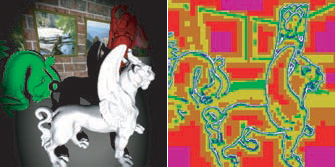

图 多分辨率光照泼溅开始于直接光照的渲染（左图）。每个VPL产生一个全屏幕的图示，允许每个VPL为每个像素提供光线。每个VPL产生一个全屏的泼溅，允许每个VPL为每个像素提供光线。但根据本地照明变化的速度，这些图层会以多种分辨率呈现。伪彩色全屏泼溅（中图）显示了不同分辨率的区域，这些区域被渲染为不同的buffer（右图）

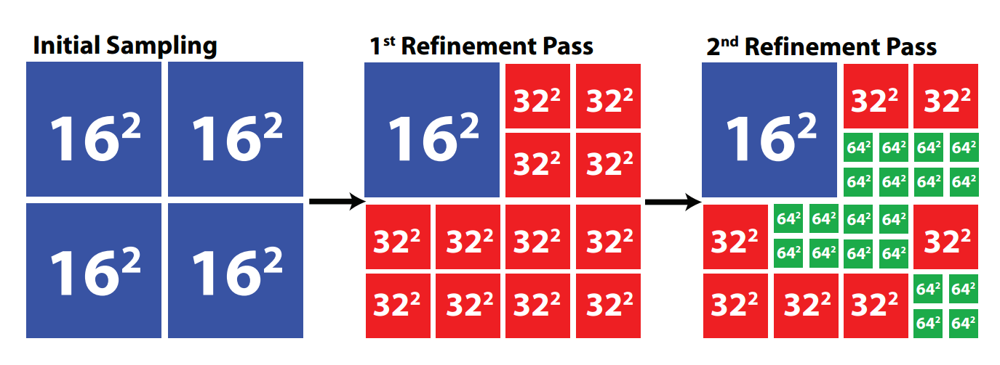

图 多分辨率片的迭代求精从统一的粗图像采样开始（例如，162个采样）。处理粗粒度片元，识别需要进一步求精的片元并创建四个更精细的分辨率片元。进一步的操作会进一步细化片元直到达到某个阈值，例如最大精度级别或超过指定的片元数量。

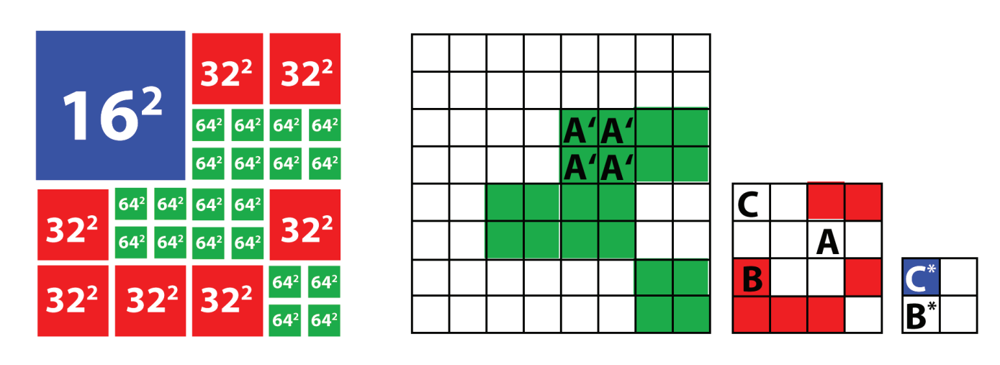

图 前一幅图中的，多分辨率泼溅可以进行并行计算而不是迭代计算（左图）。右图中的多分辨率buffer中的片元，都为并行处理。

### 9.1 实现思路小结

#### 9.1.1 多分辨率泼溅的实现思路 | Multiresolution Splatting Implement

以下是多分辨率泼溅实现思路，其中VPL的全称是虚拟点光源（virtual point light）：

    1.	Render a shadow map augmented by position, normal, and color.
    2.	Select VPLs from this shadow map.
    3.	Render from the eye using only direct light.
    4.	For each VPL:
        (a)	Draw a full-screen “splat.”
        (b)	Each splat fragment illuminates one texel (in one of the multiresolu- tion buffers in Figure 1.4) from a single VPL, though this texel may ultimately affect multiple pixels.
        (c)	Blend each fragment into the appropriate multiresolution buffer.
    5.	Combine, upsample and interpolate the multiresolution buffers.
    6.	Combine the interpolated illumination with the direct light.

#### 9.1.2 设置可接受模糊 | Setting acceptable blur

    patches ← CoarseImageSampling();
        for (i=1 to numRefinementPasses) do
            for all (p ∈ patches) do
            if ( NoDiscontinuity( p ) ) then
                continue;
            end if
            patches ← (patches − {p});
            patches ← (patches ∪ SubdivideIntoFour( p ) );
        end for
    end for

#### 9.1.3 从虚拟点光源收集光照进行泼溅 | Gathering illumination from VPLs for splatting

    patches ← IterativelyRefinedPatches();
    vpls ← SampledVirtualPointLights();
    for all ( v ∈ vpls ) do
        for all ( p ∈ patches ) do
            TransformToFragmentInMultiresBuffer( p ); // In vertex shader
            IlluminateFragmentFromPointLight( p, v ); // In fragment shader
            BlendFragmentIntoMultiresBufferIllumination( p );
        end for
    end for

#### 9.1.4 降采样多分辨率照明缓存 | Unsampling the multiresolution illumination buffer.

    coarserImage ← CoarseBlackImage();
    for all ( buffer resolutions j from coarse to fine ) do
        finerImage ← MultresBuffer( level j );
        for all ( pixels p ∈ finerImage ) do
            if ( InvalidTexel( p, coarserImage ) ) then
                continue; // Nothing to blend from lower resolution!
            end if
            p1, p2, p3, p4 ← FourNearestCoarseTexels( p, coarserImage );
            ω1, ω2, ω3, ω4 ← BilinearInterpolationWeights( p, p1, p2, p3, p4);
            for all ( i ∈ [1..4] ) do
                ωi = InvalidTexel( pi, coarserImage ) ) ? 0 : ωi;
            end for
            finerImage[p] += (ω1p1 + ω2p2 + ω3p3 + ω4p4)/(ω1 + ω2 + ω3 + ω4)
        end for
        coarserImage ← finerImage;
    end for

#### 9.1.5 并行泼溅求精 | Parallel splat refinement

    for all (fragments f ∈ image) do
        if ( _ j such that f ∈ MipmapLevel( j ) ) then
            continue; // Fragment not actually in multires buffer
        end if
        j ← GetMipmapLevel( f );
        if ( IsDiscontinuity( f, j ) ) then
            continue; // Fragment needs further subdivision
        end if
        if ( NoDiscontinuity( f, j + 1 ) ) then
            continue; // Coarser fragment did not need subdivision
        end if
        SetStencil( f );
    end for

#### 9.1.6 最终基于模板的多分辨率泼溅算法

    pixels ←FullScreenQuad();
    vpls ← SampledVirtualPointLights();
    for all ( v ∈ vpls ) do
        for all ( p ∈ pixels ) do
            if ( FailsEarlyStencilTest( p ) ) then
                continue; // Not part of multiresolution splat
            end if
            IlluminatePatchFromPointLight( p, v );
        end for
    end for

 

## 十、屏幕空间定向环境光遮蔽 Screen-Space Directional Occlusion （SSDO）

环境光遮蔽（AO）是全局光照的一种近似，由于其良好的视觉质量和简单的实现[Landis 02]，其常常用于电影和游戏中。环境光遮蔽的基本思想是预先计算网格表面几个位置的平均可见性值。然后这些值在运行时与图形硬件提供的未遮挡光照相乘。

环境光遮蔽的一个缺点是它仅适用于静态场景。如果为每个顶点或纹理元素预先计算了可见性值，则在网格变形时这些值将无效。

动态场景的一些初步想法有[Bunnell 06]和[Hoberock and Jia07]通过用层次圆盘（hierarchy of discs）近似几何体的思路。处理动态场景的最简单方法是根据帧缓冲区中的信息计算环境光遮蔽，即所谓的屏幕空间环境光遮蔽（SSAO）。这里深度缓冲区用于在运行时计算平均可见度值而不是预先计算。这章内容发表期间的GPU算力已足以实时计算SSAO。此外，该方法不需要场景的任何特殊几何的表现，因为仅使用到帧缓冲器中的信息来计算遮蔽值。甚至不需要使用由多边形组成的三维模型，因为我们可以从产生深度缓冲区的任何渲染计算遮挡。

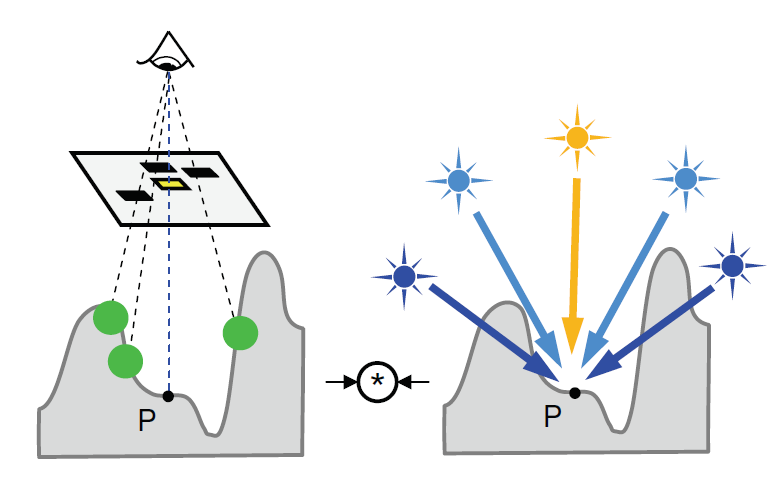
图 屏幕空间环境光遮蔽（SSAO）：对于帧缓冲器中的每个像素，检查一组相邻像素，并将一个极小的球状物体放置在相应的三维位置。为每个球体计算遮蔽值，并将所有这些值累积到一个环境遮蔽值中。最后，该值乘以来自所有方向的未被遮蔽的光照。

环境光遮蔽通常显示空腔暗化（darkening of cavities）和接触阴影（contact shadows），但忽略入射光的所有方向信息。发生这种情况是因为只有几何体用于计算环境光遮蔽，而忽略了实际光照。典型的问题情况如下图所示：在方向变化的入射光的情况下，环境光遮蔽将显示错误的颜色。因此，该章将SSAO扩展到称之为屏幕空间定向遮挡（SSDO）的更真实光照技术。

由于循环遍历片段程序中的许多相邻像素，因此可以为每个像素计算单独的可见性值，而不是将所有信息折叠为单个AO值。因此，基本思想是使用来自每个方向的入射光的可见性信息，并仅从可见方向照射，从而产生定向的光照。

为对SSDO的数据做进一步描述，假设有一个深度帧缓冲区，其中包含每像素的位置，法线和反射率值。

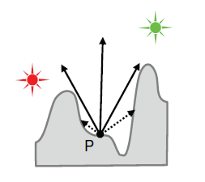

图 环境光遮蔽的典型问题示例。由于红色光源被遮挡而绿色光源照亮了点P，我们希望在这里看到一个绿色的阴影。但环境遮挡首先计算来自所有方向的光照，因此点P最初为黄色，然后通过某个平均遮挡值进行缩放，从而产生了不正确的棕色。

本章提出的SSDO算法具体可以总结如下：

-   首先，在像素的三维点周围放置一个半球，该半球沿着表面法线定向。该半球的半径r_max是用户参数，其用于决定搜索阻挡物的本地邻域的大小。

-   然后，将一些三维采样点均匀分布在半球内部。同样，采样点数N是用于时间质量平衡的用户参数。

-   接着，测试每个采样方向的光照是否被阻挡或可见。因此，我们将每个采样点反投影到深度帧缓冲区。在像素位置，可以读取表面上的三维位置，并将每个点移动到表面上。如果采样点朝向观察者移动，则它最初位于表面下方并且被分类为被遮挡。如果它远离观察者，它最初在表面上方并且被分类为可见。

在下图的示例中，点A，B和D在表面下方并被分类为遮挡物。只有样本C可见，因为它在表面上方。因此，仅从方向C计算光照。

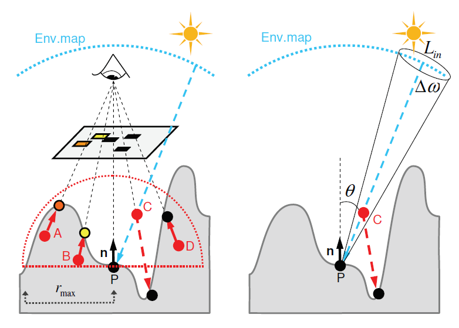

图 SSDO屏幕空间定向环境光遮蔽。左图：为了计算点P处的方向遮挡，在半球中创建一些均匀分布的采样点，并将它们反投影到深度帧缓冲区中。（最初）在表面下方的每个点被视为遮挡物。 右图：仅从可见点计算光照。在这里，假设每个采样方向的立体角，并使用模糊环境贴图传入光亮度。

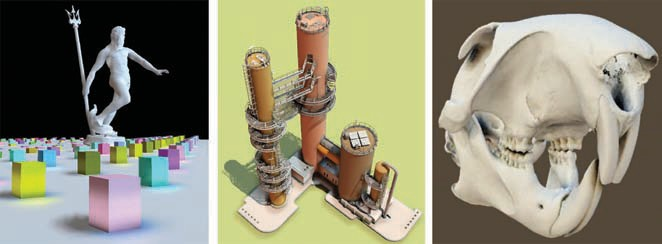

图 屏幕空间定向环境光遮蔽（Screen-Space Directional Occlusion，SSDO）效果图

### 10.1 核心实现Shader代码

#### 10.1.1 屏幕空间定向环境光遮蔽SSDO 的Shader源码

    // Read position and normal of the pixel from deep framebuffer .
    vec4 position = texelFetch2D(positionTexture ,
    ivec2 ( gl_FragCoord.xy), 0);
    vec3 normal = texelFetch2D(normalTexture ,
    ivec2( gl_FragCoord.xy), 0);

    // Skip pixels without geometry .
    if(position .a > 0.0) {
        vec3 directRadianceSum = vec3 (0.0);
        vec3 occluderRadianceSum = vec3 (0.0);
        vec3 ambientRadianceSum = vec3 (0.0);
        float ambientOcclusion = 0.0;

        // Compute a matrix that transform from the unit hemisphere .
        // along z = -1 to the local frame along this normal
        mat3 localMatrix = computeTripodMatrix(normal );

        // Compute the index of the current pattern .
        // We use one out of patternSize * patternSize
        // pre -defined unit hemisphere patterns (seedTexture ).
        // The i’th pixel in every sub -rectangle uses always
        // the same i’th sub -pattern .
        int patternIndex = int (gl_FragCoord.x) % patternSize +
        (int ( gl_FragCoord.y) % patternSize) *
        patternSize ;

        // Loop over all samples from the current pattern .
        for (int i = 0; i < sampleCount ; i++) {

            // Get the i’th sample direction from the row at
            // patternIndex and transfrom it to local space .
            vec3 sample = localMatrix * texelFetch2D(seedTexture ,
            ivec2(i, patternIndex), 0). rgb ;
            vec3 normalizedSample = normalize (sample );

            // Go sample -radius steps along the sample direction ,
            // starting at the current pixel world space location .
            vec4 worldSampleOccluderPosition = position +
            sampleRadius * vec4(sample .x, sample .y , sample .z, 0);

            // Project this world occluder position in the current
            // eye space using the modelview -projection matrix .
            // Due to the deferred shading , the standard OpenGL
            // matrix can not be used.
            vec4 occluderSamplePosition = (projectionMatrix *
            modelviewMatrix) * worldSampleOccluderPosition ;

            // Compute the pixel position of the occluder :
            // Do a division by w first (perspective projection ),
            // then scale /bias by 0.5 to transform [-1,1] -> [0 ,1].
            // Finally scale by the texure resolution .
            vec2 occluderTexCoord = textureSize2D(positionTexture ,0)
            * (vec2 (0.5) + 0.5 * ( occluderSamplePosition .xy /
            occluderSamplePosition .w));

            // Read the occluder position and the occluder normal
            // at the occluder texture coordinate .
            vec4 occluderPosition = texelFetch2D(positionTexture ,
            ivec2 (occluderTexCoord), 0);
            vec3 occluderNormal = texelFetch2D(normalTexture ,
            ivec2 (occluderTexCoord), 0);
            float depth = (modelviewMatrix *
            worldSampleOccluderPosition ).z;

            // Compute depth of corresponding (proj.) pixel position .
            float sampleDepth = (modelviewMatrix *
            occluderPosition).z + depthBias ;

            // Ignore samples that move more than a
            // certain distance due to the projection
            // (typically singularity is set to hemisphere radius ).
            float distanceTerm = abs (depth - sampleDepth) <
            singularity ? 1.0 : 0.0;

            // Compute visibility when sample moves towards viewer .
            // We look along the -z axis , so sampleDepth is
            // larger than depth in this case.
            float visibility = 1.0 - strength *
            (sampleDepth > depth ? 1.0 : 0.0) * distanceTerm;

            // Geometric term of the current pixel towards the
            // current sample direction
            float receiverGeometricTerm = max (0.0,
            dot (normalizedSample , normal ));

            // Compute spherical coordinates (theta , phi )
            // of current sample direction .
            float theta = acos(normalizedSample.y);
            float phi = atan( normalizedSample.z ,normalizedSample.x);
            if (phi < 0) phi += 2*PI;

            // Get environment radiance of this direction from
            // blurred lat /long environment map .
            vec3 senderRadiance = texture2D (envmapTexture ,
            vec2( phi / (2.0* PI), 1.0 - theta / PI ) ).rgb ;

            // Compute radiance as the usual triple product
            // of visibility , radiance , and BRDF.
            // For practical reasons , we post -multiply
            // with the diffuse reflectance color.
            vec3 radiance = visibility * receiverGeometricTerm *
            senderRadiance;

            // Accumulate the radiance from all samples .
            directRadianceSum += radiance ;
            // Indirect light can be computed here
            // (see Indirect Light Listing )
            // The sum of the indirect light is stored
            // in occluderRadianceSum
        }

        // In case of a large value of -strength , the summed
        // radiance can become negative , so we clamp to zero here.
        directRadianceSum = max (vec3(0), directRadianceSum);
        occluderRadianceSum = max (vec3 (0), occluderRadianceSum );

        // Add direct and indirect radiance .
        vec3 radianceSum = directRadianceSum + occluderRadianceSum;

        // Multiply by solid angle and output result .
        radianceSum *= 2.0 * PI / sampleCount ;
        gl_FragColor = vec4(radianceSum , 1.0);
        } else {

        // In case we came across an invalid deferred pixel
        gl_FragColor = vec4 (0.0);
    }

#### 10.1.2 SSDO间接光计算Shader实现代码

间接光计算的源代码。 此时，从SSDO计算中已知像素位置和遮挡物位置/纹理坐标。这段代码可以包含在上述SSDO实现代码的循环结尾处。

    // Read the (sender ) radiance of the occluder .
    vec3 directRadiance = texelFetch2D(directRadianceTexture ,
    ivec2( occluderTexCoord), 0);

    // At this point we already know the occluder position and
    // normal from the SSDO computation . Now we compute the distance
    // vector between sender and receiver .
    vec3 delta = position .xyz - occluderPosition.xyz ;
    vec3 normalizedDelta = normalize (delta );

    // Compute the geometric term (the formfactor ).
    float unclampedBounceGeometricTerm =
    max (0.0, dot (normalizedDelta , -normal )) *
    max (0.0, dot (normalizedDelta , occluderNormal)) /
    dot (delta , delta );

    // Clamp geometric term to avoid problems with close occluders .
    float bounceGeometricTerm = min (unclampedBounceGeometricTerm ,
    bounceSingularity);

    // Compute the radiance at the receiver .
    vec3 occluderRadiance = bounceStrength * directRadiance *
    bounceGeometricTerm ;

    // Finally , add the indirect light to the sum of indirect light .
    occluderRadianceSum += occluderRadiance;

## 十一、基于几何替代物技术的实时多级光线追踪 | Real-Time Multi-Bounce Ray-Tracing with Geometry Impostors

在实时应用中渲染反射和折射物体或它们的焦散（caustics）是一个具有挑战性的问题。其需要非局部着色，这对于光栅化渲染管线来说比较复杂，其中片段着色器只能使用局部插值顶点数据和纹理来查找曲面点的颜色。

物体的反射、折射和其焦散效果通常需要光线跟踪进行渲染，但光线跟踪通常不具备与光栅化渲染相同的性能。

而通常，使用基于纹理的特殊tricks可以将光线跟踪效果加入到实时场景中。这些技术通常假设场景中只有一个反射或折射物体，并且仅考虑一次或两次反射光就足够了。在这章中，遵循了类似的实践原理，但是除去这些限制，以便能够渲染布满玻璃碎片的完整棋盘，甚至折射物体浸没在动画液体中等场景。

这章中扩展了先前基于环境距离替代物技术（environment distance impostors）的近似光线追踪技术，以便在当时硬件条件的限制下，实时渲染具有多个反射和折射物体的场景。

有两个关键的思路。

首先，文章改为使用距离替代物（distance impostor）方法，不将内部光线（internal rays）与封闭的环境几何体相交，而是将外部光线（external rays）与物体相交。另外，这章展示了如何高效地追踪二次反射和折射光线，还研究了可以适应相同的任务的其他类型的几何替代物技术 – 如几何图像（geometry images）[Carr et al. 06]和高度场（height fields）[Oliveira et al. 00, Policarpo et al. 05]。

第二个思路是静态和动态对象的分离。经典的距离替代物（distance impostors）技术可以用于静态环境，只需要在每一帧中更新移动对象的环境替代物（environment impostors）。通过搜索几何替代物（geometry impostors）可以找到穿过移动物体的光路。

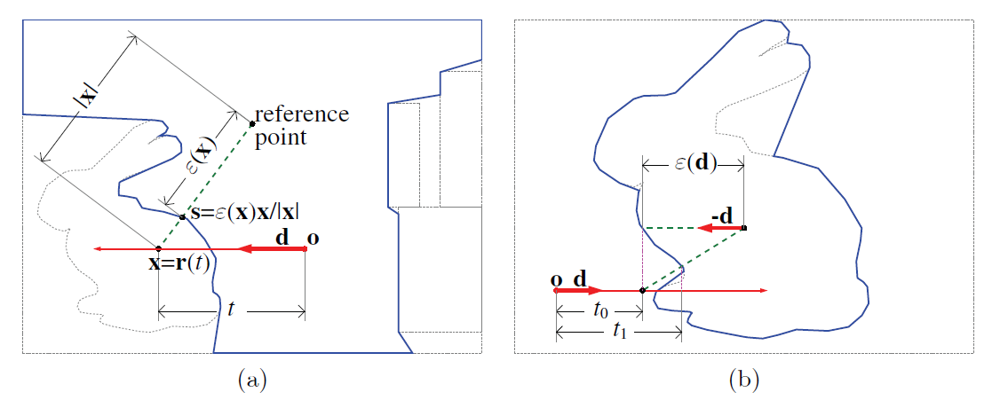

图（a）环境距离替代物技术（environment distance impostor）（b）具有搜索投影前两步策略的物体距离替代物（Object distance impostor）

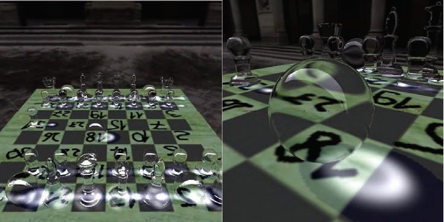
图 左：整个测试场景。 右：使用高度图替代物进行双折射。

这章中扩展了先前基于环境距离替代物技术（environment distance impostors）的近似光线追踪技术，以便在当时硬件条件的限制下，实时渲染具有多个反射和折射物体的场景。

当然，随着技术的发展，2018年已经有了RTX技术，实时光线追踪已经不在话下。以下便是一个能展现实时光线追踪魅力的NVIDIA RTX Demo：

<https://www.youtube.com/watch?v=KJRZTkttgLw>

 

# Part IV. 图像空间 Image Space 

## 十二、 GPU上的各项异性的Kuwahara滤波 | Anisotropic Kuwahara Filtering on the GPU

这章中介绍一种各向异性的Kuwahara滤波器[Kyprianidis et al. 09]。各向异性的Kuwahara滤波器是Kuwahara滤波器的一种广义上的变体，通过调整滤波器的形状，比例和方向以适应输入的局部结构，从而避免了失真。由于这种适应性，定向图像特征被更好地保存和强调，得到了整体更清晰的边缘和更具特色的绘画效果。

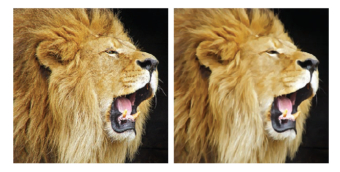

图 原始图像（左），对各向异性的Kuwahara滤波输出（右）。沿着局部特征方向产生绘画般的增强效果，同时保留形状边界。

### 12.1 Kuwahara滤波器（Kuwahara Filtering）

Kuwahara滤波器背后的一般思想是将滤波器内核分成四个重叠一个像素的矩形子区域。滤波器的响应由具有最小方差的子区域的平均值来定义。

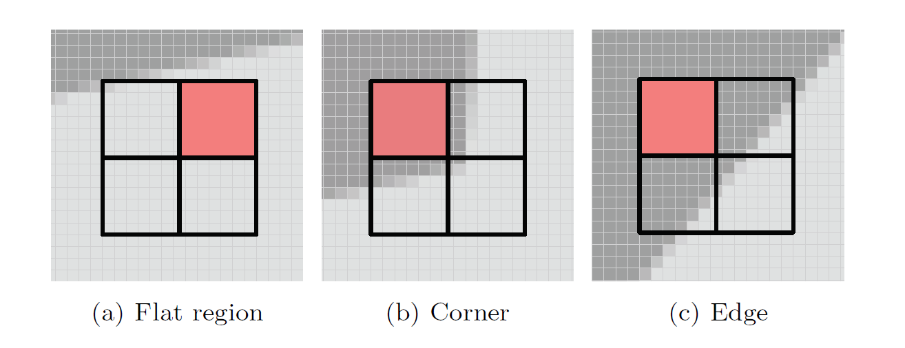

图 Kuwahara滤波器将滤波器内核分成四个矩形子区域。然后过滤器响应由具有最小方差的子区域的平均值来定义

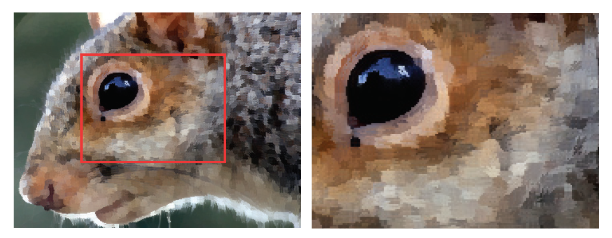

图 Kuwahara滤波器的输出效果图

### 12.2 广义Kuwahara滤波器（Generalized Kuwahara Filtering）

而广义Kuwahara滤波器，为了克服不稳定次区域选择过程的局限性，定义了一个新的标准。结果被定义为次区域平均值的加权总和，而不是选择一个单独的次区域。权重是根据子区域的差异来定义的。 这导致区域边界更平滑并且失真更少。为了进一步改善这一点，矩形子区域被扇区上的平滑权重函数所取代：

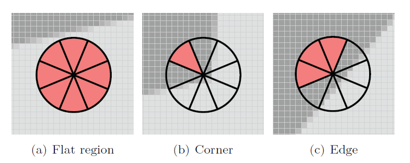

图 广义的Kuwahara滤波器使用定义在光盘扇区上的加权函数。滤波过滤器响应被定义为局部平均值的加权总和，其中对具有低标准偏差的那些平均值赋予更多的权重。

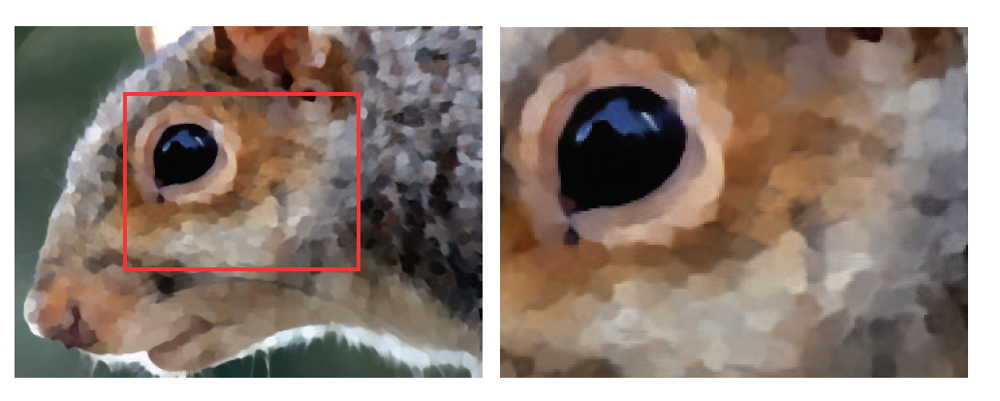

图 广义Kuwahara滤波器的输出效果图

### 12.3 各向异性Kuwahara滤波器（Anisotropic Kuwahara Filtering）

广义的Kuwahara滤波器未能捕获定向特征并会导致集群的失真。而各向异性的Kuwahara滤波器通过使滤波器适应输入的局部结构来解决这些问题。在均匀区域中，滤波器的形状应该是一个圆形，而在各向异性区域中，滤波器应该变成一个椭圆形，其长轴与图像特征的主方向一致。

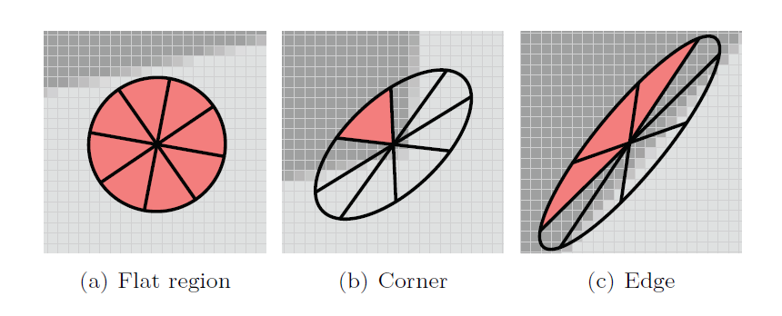

图 各向异性Kuwahara滤波器图示

## 十三、基于后处理的边缘抗锯齿 | Edge Anti-aliasing by Post-Processing 

抗锯齿是高质量渲染的关键之一。例如，高质量的CG优先考虑抗锯齿的质量，而用于打印和品宣的游戏截图通常会采用人为高水平的超级采样来提高图像质量。

硬件多采样抗锯齿（Multi-Sampled Anti-Aliasing ，MSAA) [Kirkland 99]支持的是实现抗锯齿的标准方法，但是它是实现高质量抗锯齿的一种非常昂贵的方式，并且对抗锯齿与后处理效果提供的帮助甚微。

本章介绍了一种通过选择性像素混合对边缘进行抗锯齿的新方法。其仅需要MSAA所需空间的一小部分，并且与后处理效果相兼容。此抗锯齿方法的执行分为两个阶段。

首先，图像是没有任何多采样（multisampling）方法或超采样（super-sampling）方法的作用下渲染的。作为关于邻近边缘轮廓的近似细小的渲染提示被写出到帧缓冲区。然后应用后处理的pass，该通道使用这些细小的渲染提示来更新边缘像素，以提供抗锯齿。而在延迟效果（deferred effects）之后应用后处理（post-process），表示它们会接收边缘消除锯齿。

这种方法的核心部分为像素着色器提供了一种计算最近轮廓边缘位置的高效方法。这种技术也可以应用于阴影贴图放大，并提供了保持锐利边缘的放大方法。

下图显示了该方法的实际应用。

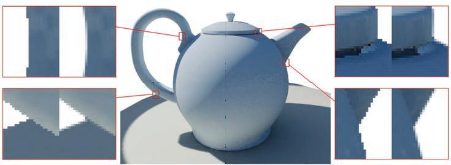

图 本章中的抗锯齿方法的效果图特写

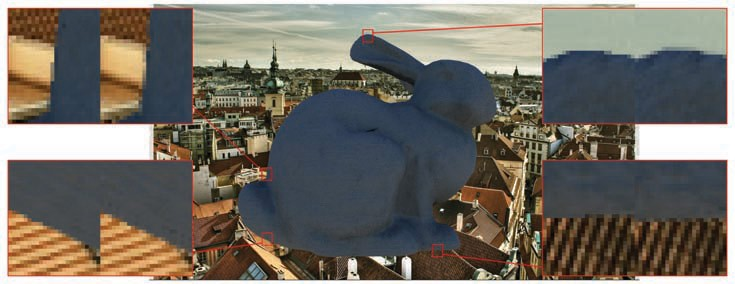

图 复杂背景的抗锯齿效果演示。每个放大部分的左侧为4 MSAA的抗锯齿效果。右侧为本章方法（edge-blur render，边缘模糊抗锯齿）

## 十四、基于Floyd-Steinberg半色调的环境映射 | Environment Mapping with Floyd-Steinberg Halftoning

这章中提出了一种使用GPU计算重要性采样的算法。该算法巧妙地应用了经典的半色调技术，可用于加速高质量环境映射照明中的重要性采样步骤。

这章想传达的最重要的信息是半色调（halftoning）算法和重要性采样（importance sampling）是等价的，因此我们可以在重要性采样中使用半色调算法。文中研究了Floyd-Steinberg半色调方法在环境映射中的应用，并得出结论认为，该方法可以比随机抽样更好地对样本进行分配，所以，对的样本计算的积分也会更准确。

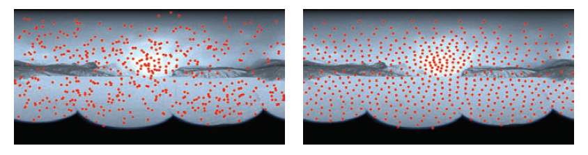

图 左图为随机采样加权环境贴图（Sampling weighted environment maps）；右图为弗洛伊德 - 斯坦伯格采样半色调环境映射（Floyd-Steinberg halftoning）

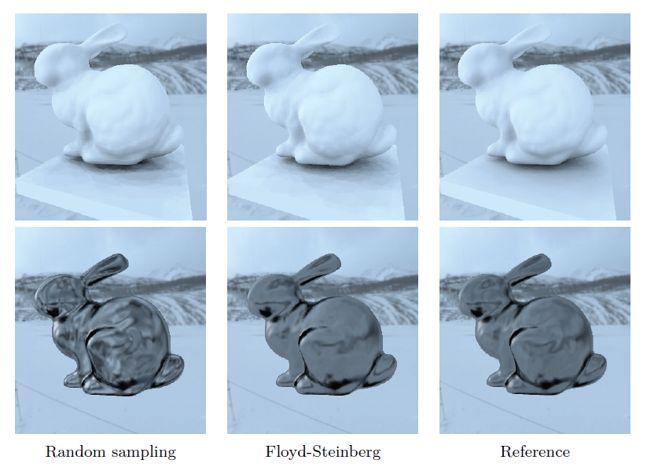

图 光源采样结果。随机采样基于Floyd-Steinberg半色调映射通过方向光源对兔子模型的漫反射和镜面光照。

### 14.1 核心实现Shader代码

在几何着色器中实现的Floyd-Steinberg采样器Shader代码：

    [maxvertexcount (32)]
    void gsSampler ( inout PointStream <float4 > samples ) {
        uint M = 32; float S = 0;
            [loop]for (uint v = 0; v < R.y; v++)
                [loop]for (uint u = 0; u < R.x; u++)
                    S += getImportance(uint2(u, v));
        float threshold = S / 2 / M;
        float4 cRow[RX4 ]={{0,0,0,0},{0 ,0 ,0 ,0},{0 ,0,0,0} ,{0,0,0 ,0}};
        float cPixel = 0, cDiagonal = 0, acc [4];
        [loop]for (uint j = 0; j < R.y; j++) {
            uint kper4 = 0;
            [loop]for (uint k = 0; k < R.x; k += 4) {
            for (uint xi = 0; xi < 4; xi++) {
                float I = getImportance(uint2 (k+xi , j));
                float Ip = I + cRow[kper4 ][xi] + cPixel ;
                if(Ip > threshold) {
                    float3 dir = getSampleDir(uint2 (k+xi , j));
                    samples .Append ( float4 (dir , I / S) );
                    Ip -= threshold * 2;
                }
                acc [xi] = Ip * 0.375 + cDiagonal ;
                cPixel = Ip * 0.375;
                cDiagonal = Ip * 0.25;
            }
            cRow[kper4 ++] = float4 (acc [0], acc [1], acc [2], acc [3]);
        }
        j++; kper4 --;
        [loop]for (int k = R.x -5; k >= 0; k -= 4) {
            for (int xi = 3; xi >= 0; xi--) {
                float I = getImportance(uint2 (k+xi , j));
                float Ip = I + cRow[kper4 ][xi] + cPixel ;
                if(Ip > threshold ) {
                    float3 dir = getSampleDir(uint2 (k+xi , j));
                    samples .Append ( float4 (dir , I / S) );
                    Ip -= threshold * 2;
                }
                acc [xi] = Ip * 0.375 + cDiagonal ;
                cPixel = Ip * 0.375;
                cDiagonal = Ip * 0.25;
            }
            cRow[kper4 --] = float4 (acc [0], acc [1], acc [2], acc [3]);
            }
        }
    }

## 十五、用于粒状遮挡剔除的分层项缓冲 | Hierarchical Item Buffers for Granular Occlusion Culling

剔除（Culling）算法是许多高效的交互式渲染技术的关键，所有剔除算法的共同目标都是从渲染管线的几乎所有阶段减少工作量。

最常用的算法是在应用阶段采用视锥剔除（frustum culling）和视口剔除（portal culling）来排除不可见的几何体，通常按层次数据结构组织。更复杂的算法会在昂贵的前期流程中预计算整个可见集，以实现高效的实时可见性计算。

这章提出了一种直接在GPU上运行的剔除方法，该方法对应用程序完全透明且实现起来非常简单，特别是在下一代硬件和图形API上。文中表明，只需很少的开销，每帧的渲染时间可以显着减少，特别是对于昂贵的着色器或昂贵的渲染技术。该方法特别针对像几何着色器这样的早期着色器阶段，且应用目标是多方面。例如，[Engelhardt and Dachsbacher 09]展示了这种技术的应用，以加速每像素位移映射，但它也为基于可见性的LOD控制和曲面细分着色器中的剔除提供了可能性。

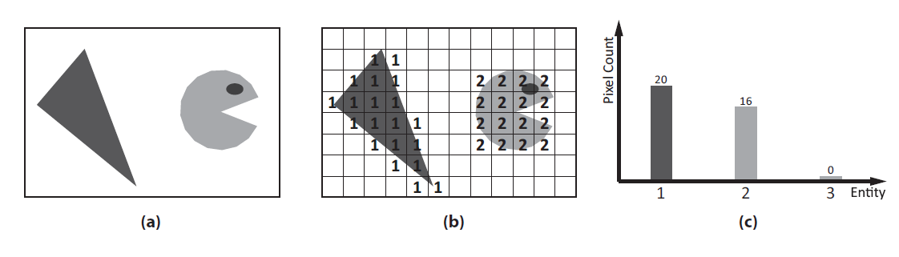

图 分层项缓冲区（Hierarchical Item Buffers）图示（a）确定可见度的实体;（b）光栅化后的项缓冲区（item buffer）;（c）项缓冲区的直方图。实体3没有计算任何内容，因此是不可见的。

## 十六、后期制作中的真实景深 | Realistic Depth of Field in Postproduction

景深（Depth of field，DOF）是一种典型的摄影效果，其结果是根据摄像机与摄像机的距离而产生不同的聚焦区域。

这章中，提出了一种交互式GPU加速的景深实现方案，其扩展了现有方法的能力，具有自动边缘改进和基于物理的参数。散焦效应通常由模糊半径控制，但也可以由物理特性驱动。此技术支持在图像和序列上使用灰度深度图图像和参数，如焦距，f-stop，subject magnitude，相机距离，以及图像的实际深度。

另外，景深实现中额外的边缘质量改进会产生更逼真和可信的图像。而局部邻域混合算法的缺点是二次计算能力，但这其实可以通过GPU进行补偿。

图 景深效果图

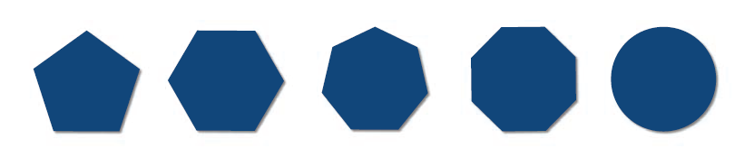

图 模拟曝光的光圈孔径形状示例

## 十七、实时屏幕空间的云层光照 | Real-Time Screen Space Cloud Lighting

在创造逼真的虚拟环境时，云是一个重要的视觉元素。实时渲染美丽的云可能非常具有挑战性，因为云在保持交互式帧率的同时会呈现出难以计算的多重散射（multiple scattering）。

目前的问题是，大多数游戏都无法承担精确计算物理上正确的云层光照的计算成本。

本章介绍了一种可以实时渲染真实感的云层的非常简单的屏幕空间技术。这种技术已经在PS3上实现，并用于游戏《大航海时代Online》（Uncharted Waters Online）中。这项技术并不关注严格的物理准确性，而是依靠重新创建云层的经验外观。另外需要注意的是，此技术适用于地面场景，玩家可以在地面上观看，并且只能从远处观看云层。

光照是创造美丽和真实感云彩最重要的方面之一。当太阳光穿过云层时，被云层中的粒子吸收，散射和反射。下图展示了一个典型的户外场景。

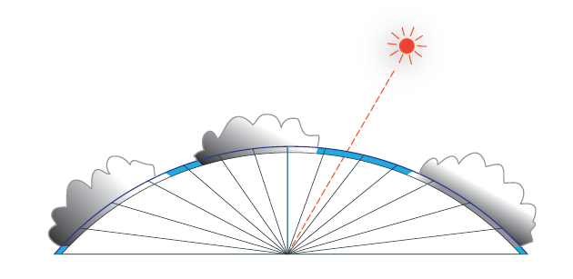

图 一个典型的户外场景。 最靠近太阳的云显示出最大的散射并且看起来最亮

如图所示，从图中所示的视图看云层时，最靠近太阳的云显得最亮。这种现象是由于太阳的光线到达云层的后方，然后通过多次散射，在云的前部（最靠近观察者）重新出现。这一观察结果是这章所介绍技术的关键部分。为了再现这种视觉提示，屏幕空间中的简单点模糊或方向模糊足以模仿通过云层的光散射。

### 17.1 实现方案

这章的云层渲染技术可以分为三个pass执行：

-   首先，渲染云密度（cloud density）为离屏渲染目标（RT），且云密度是可以由艺术家绘制的标量值。

-  其次，对密度贴图（density map）进行模糊处理。

-   最终，使用模糊的密度贴图来渲染具有散射外观的云层。

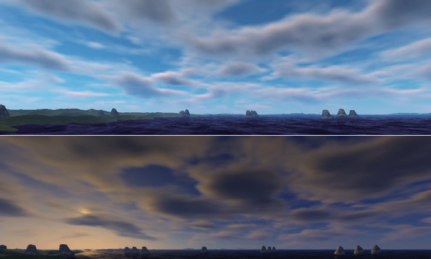

图 基于这章技术实现的demo截图

在demo中，云层被渲染为一个统一的网格。 云层纹理在每个通道中包含四个密度纹理。每个通道代表不同的云层，根据第一个通道中的天气在像素着色器中混合。并且也通过滚动纹理坐标UV来实现动画。

总之，这章提出了一种实时渲染的真实感天空的技术。由于云的形状与光源分离，程序化云的生成和程序化动画都可以支持。

需要注意的是，此方法忽略了大气的某些物理特性，以创建更高效的技术。例如，不考虑大气的密度，但这个属性对于创造逼真的日落和日出是必要的。也忽略了进入云层的光的颜色。在日落或日出的场景中，只有靠近太阳的区域应该明亮而鲜艳地点亮。有必要采取更基于物理的方法来模拟太阳和云之间的散射，以获得更自然的结果。

### 17.2 核心实现Shader代码

以下为云层光照像素着色器核心代码;注意，常数为大写。此着色器可以通过适当设置SCALE和OFFSET常量来提供平行线或点的模糊：

    // Pixel shader input
    struct SPSInput 
    {
        float2 vUV : TEXCOORD0 ;
        float3 vWorldDir : TEXCOORD1 ;
        float2 vScreenPos : VPOS;
    };

    // Pixel shader
    float4 main( SPSInput Input ) 
    {
        // compute direction of blur.
        float2 vUVMove = Input .vScreenPos * SCALE + OFFSET ;

        // Scale blur vector considering distance from camera .
        float3 vcDir = normalize ( Input .vWorldDir );
        float fDistance = GetDistanceFromDir( vcDir );
        vUVMove *= UV_SCALE / fDistance ;

        // Limit blur vector length .
        float2 fRatio = abs ( vUVMove / MAX_LENGTH );
        float fMaxLen = max ( fRatio .x, fRatio .y );
        vUVMove *= fMaxLen > 1.0 f ? 1.0 f / fMaxLen : 1.0 f;

        // Compute offset for weight .
        // FALLOFF must be negative so that far pixels affect less.
        float fExpScale = dot ( vUVMove , vUVMove ) * FALLOFF ;

        // Blur density toward the light.
        float fShadow = tex2D ( sDensity , Input.vUV ).a;
        float fWeightSum = 1.0 f;
        for ( int i = 1; i < FILTER_RADIUS; ++i ) {
        float fWeight = exp ( fExpScale * i );
        fShadow +=
        fWeight * tex2D(sDensity , Input .vUV +vUVMove *i).a;
        fWeightSum += fWeight ;
        }
        fShadow /= fWeightSum ;

        // 0 means no shadow and 1 means all shadowed pixel .
        return fShadow ;
    }

 

## 十八、屏幕空间次表面散射 | Screen-Space Subsurface Scattering

这章提出了一种能够以后处理的方式，将渲染帧的深度-模板和颜色缓冲区作为输入，来模拟屏幕空间中的次表面散射的算法。此算法开创了皮肤渲染领域的基于屏幕空间的新流派。其具有非常简单的实现，在性能，通用性和质量之间取得了很好的平衡。

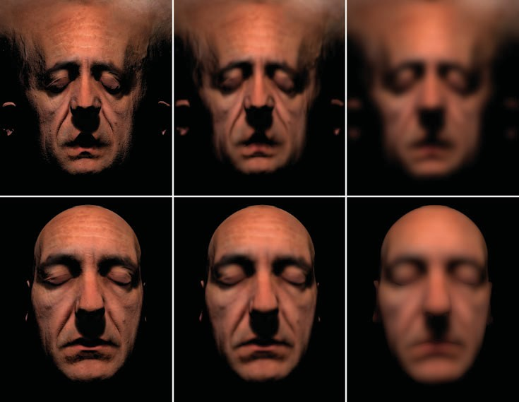

图 在纹理空间中执行模糊处理，如当前的实时次表面散射算法（上图）所做的那样，直接在屏幕空间完成模糊（下图）

该算法转换了从纹理到屏幕空间的扩散近似的计算思路。主要思想并不是计算辐照度图并将其与扩散剖面进行卷积，而是将卷积直接应用于最终渲染图像。下显示了此算法的核心思想。

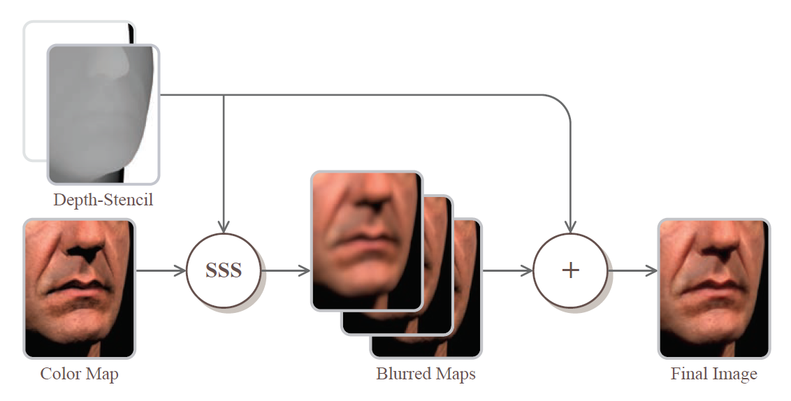

图 屏幕空间次表面散射流程图

需要注意的是，要在屏幕空间中执行此工作，需要输入渲染该帧的深度模板和颜色缓冲区。

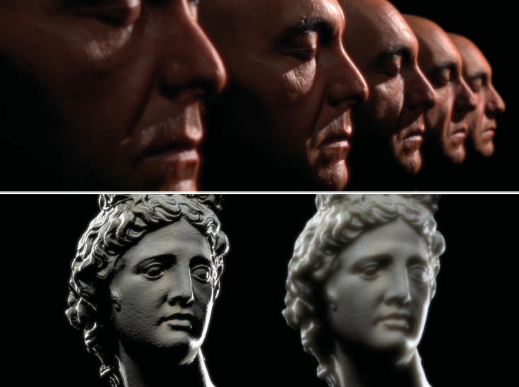

图 屏幕空间次表面散射示例。与纹理空间方法不同，屏幕空间的方法可以很好地适应场景中的对象数量（上图）。在不考虑次表面散射的情况下进行渲染会导致石头般的外观（左下图）;次表面散射技术用于创建更柔和的外观，更能好地代表次表面散射效果（右下图）。

本章提出的次表面散射算法当物体处于中等距离时，提供了与Hable等人的方法[Hable et al.09]类似的性能，并且随着物体数量的增加能更好地胜任工作。且此方法更好地推广到其他材质。在特写镜头中，其确实需要用一些性能去换取更好的质量，但它能够保持原来d'Eon方法的肉感（fleshiness）[d’Eon and Luebke 07]。但是，在这些特写镜头中，玩家很可能会密切关注角色的脸部，因此值得花费额外的资源来为角色的皮肤提供更好的渲染质量。

### 18.1 核心实现Shader代码

进行水平高斯模糊的像素着色器代码：

    float width ;
    float sssLevel , correction , maxdd;
    float2 pixelSize ;
    Texture2D colorTex , depthTex ;

    float4 BlurPS (PassV2P input) : SV_TARGET {
        float w[7] = { 0.006 , 0.061 , 0.242 , 0.382 ,
        0.242 , 0.061 , 0.006 };

        float depth = depthTex .Sample (PointSampler ,
        input .texcoord ).r;
        float2 s_x = sssLevel / (depth + correction *
        min (abs (ddx (depth )), maxdd ));
        float2 finalWidth = s_x * width * pixelSize *
        float2 (1.0, 0.0);
        float2 offset = input .texcoord - finalWidth ;
        float4 color = float4 (0.0, 0.0, 0.0, 1.0);

        for (int i = 0; i < 7; i++) {
            float3 tap = colorTex .Sample (LinearSampler , offset ).rgb ;
            color .rgb += w[i] * tap ;
            offset += finalWidth / 3.0;
        }

        return color ;
    }

 

# Part V. 阴影 Shadows 

阴影方面，作为次核心章节，仅进行更精炼的小篇幅的总结。

 

## 十九、快速传统阴影滤波 | Fast Conventional Shadow Filtering

这章介绍了如何减少常规阴影贴图过滤的硬件加速百分比邻近过滤（percentage closer filtering，PCF）纹理操作次数。现在只需要16次PCF操作就可以执行通常使用49次PCF纹理操作进行的均匀8×8过滤器。由于纹理操作的数量通常是传统阴影滤波的限制因素，因此实现的加速效果比较显著。PS:文中附带了大量的shader实现源码。

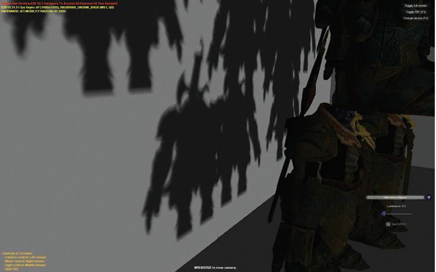
图 效果截图

 

## 二十、混合最小/最大基于平面的阴影贴图 | Hybrid Min/Max Plane-Based Shadow Maps

这章介绍了如何从常规的深度阴影贴图（depth-only shadow map）导出二次贴图。这种二次纹理可以用来大大加快昂贵的阴影滤波与过大的过滤器性能占用。它以原始阴影图中二维像素块的平面方程或最小/最大深度的形式存储混合数据。,被称为混合最小/最大平面阴影贴图（hybrid min/max plane shadow map，HPSM）。该技术特别适用于在大型过滤区域和前向渲染的情况下加速阴影过滤，例如，当阴影过滤成本随着场景的深度复杂度而增加时。

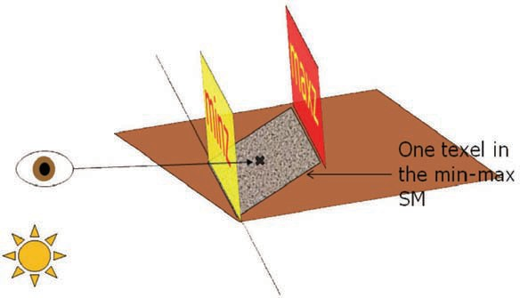

图 一个最小/最大阴影贴图像素（即有噪声的四边形）可以映射到许多屏幕上的像素。

 

## 二十一、基于四面体映射实现全向光阴影映射 | Shadow Mapping for Omnidirectional Light Using Tetrahedron Mapping

阴影映射（Shadow mapping）是用于三维场景渲染阴影的一种常用方法。William的原始Z-缓冲器阴影映射算法〔[Williams 78]是用于方向光源的，需要一种不同的方法来实现全向光（Omnidirectional Light）的阴影。

有两种流行的方法来接近全向光：一个是立方体映射（cube mapping ）[Voorhies and Foran 94]和另一个是双抛物面映射（dual-paraboloid mapping）[Heidrich and Seidel 98]。而在本章中，提出了一种全新的使用四面体映射（tetrahedron mapping）的全向光阴影映射技术。

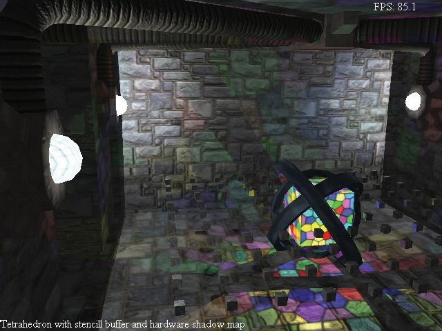

图 四个点光源，并使用四面体阴影映射与模板缓冲和硬件阴影映射得到渲染效果。二维深度纹理尺寸为1024×1024

 

## 二十二、屏幕空间软阴影 | Screen Space Soft Shadows 

这章中提出了一种基于阴影映射的半影（penumbrae）实时阴影渲染的新技术。该方法使用了包含阴影与其潜在遮挡物之间距离的屏幕对齐纹理，其用于设置在屏幕空间中应用的各向异性高斯滤波器内核的大小，从而平滑标准阴影创建半影（penumbra）。考虑到高斯滤波器是可分离的，创建半影的样本数量会远低于其他软阴影方法。因此，该方法获得了更高的性能，同时也能得到外观正确的半影。

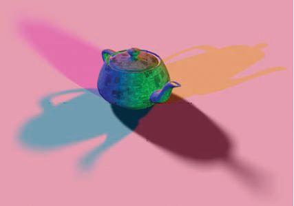

图 不同光源尺寸和不同光源颜色的半影的示例

 

The End.

下次更新，《GPU Pro 2》全书核心内容提炼总结，再见。

With best wishes.
