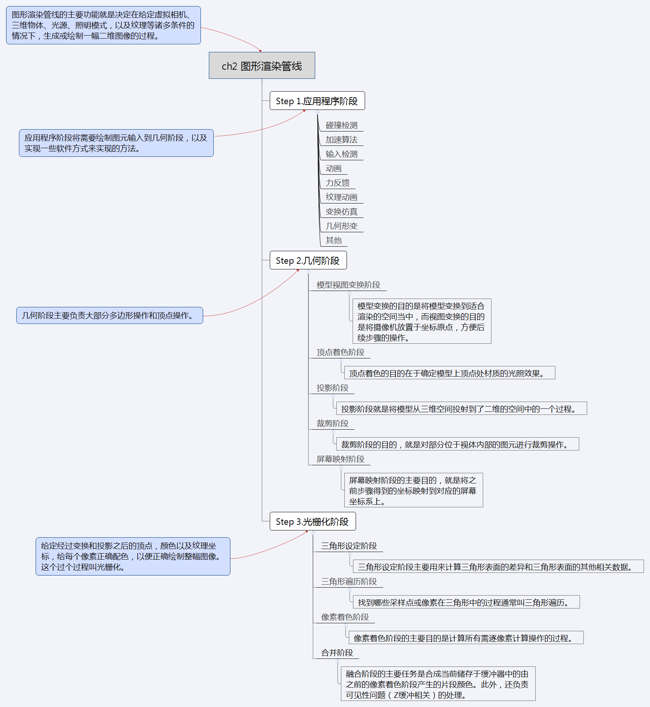
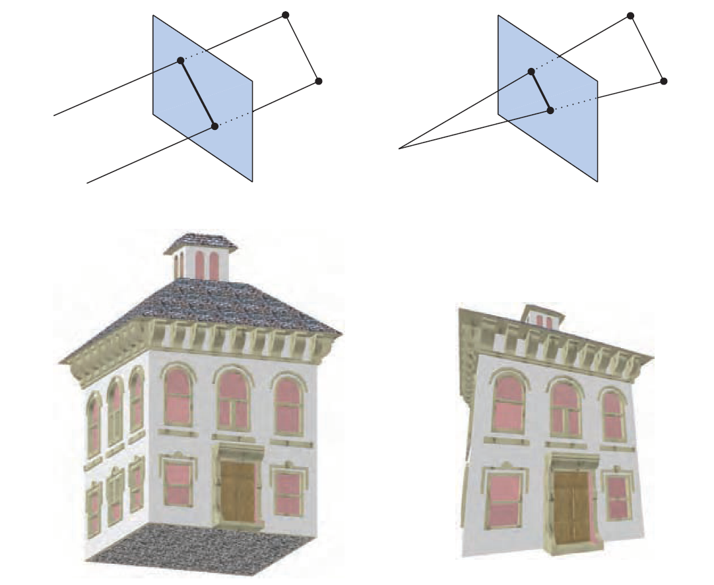

【《Real-Time Rendering 3rd》 提炼总结】(二) 第二章 · 图形渲染管线 The Graphics Rendering Pipeline
==========================================================

 

这篇文章是提炼总结计算机图形学界“九阴真经总纲”一般存在的《Real-Time Rendering
3rd》系列文章的第二篇。将带来RTR3第二章内容“Chapter 2 The Graphics Rendering
Pipeline 图形渲染管线”的总结、概括与提炼。

文章分为全文内容思维导图、核心内容分章节提炼、本章内容提炼总结三个部分来呈现，其中：

-   文章的第一部分，“全文内容思维导图”，分为“章节框架思维导图”和“知识结构思维导图”两个部分。

-   文章的第二部分，“核心内容分节提炼”，是按原书章节顺序分布的知识梳理。

-   而文章的第三部分“本章内容提炼总结”，则是更加精炼，只提炼出关键信息的知识总结。

一、全文内容思维导图
--------------------

 

### 1.章节框架思维导图

### 2.知识结构思维导图

 
 

二、核心内容分节提炼
--------------------

 

### 2.1 图像渲染管线架构概述 Architecture

 

渲染管线的主要功能就是决定在给定虚拟相机、三维物体、光源、照明模式，以及纹理等诸多条件的情况下，生成或绘制一幅二维图像的过程。对于实时渲染来说，渲染管线就是基础。因此，我们可以说，渲染管线是实时渲染的底层工具。

图2.1展示了使用渲染管线步骤。渲染出的图像的位置、形状是由它们的几何形状，环境特性，摄像机位置决定的。而物体的外观由材质特性，光源，纹理和着色模型确定。

原书图2.1
左图中，相机放在棱椎的顶端（四条线段的交汇点），只有可视体内部的图元会被渲染。

在概念上可以将图形渲染管线分为三个阶段：

-   应用程序阶段（The Application Stage）

-   几何阶段（The Geometry Stage）

-   光栅化阶段（The Rasterizer Stage）

如下图：

原书图2.2 绘制管线的基本结构包括3个阶段：应用程序、几何、光栅化。

几个要点：

-   每个阶段本身也可能是一条管线，如图中的几何阶段所示。此外，还可以对有的阶段进行全部或者部分的并行化处理，如图中的光栅化阶段。应用程序阶段虽然是一个单独的过程，但是依然可以对之进行管线化或者并行化处理。

-   最慢的管线阶段决定绘制速度，即图像的更新速度，这种速度一般用FPS来表示，也就是每秒绘制的图像数量，或者用Hz来表示。

 

### 2.2 应用程序阶段 The Application Stage

 

-   应用程序阶段一般是图形渲染管线概念上的第一个阶段。应用程序阶段是通过软件方式来实现的阶段，开发者能够对该阶段发生的情况进行完全控制，可以通过改变实现方法来改变实际性能。其他阶段，他们全部或者部分建立在硬件基础上，因此要改变实现过程会非常困难。

-   正因应用程序阶段是软件方式实现，因此不能像几何和光栅化阶段那样继续分为若干个子阶段。但为了提高性能，该阶段还是可以在几个并行处理器上同时执行。在CPU设计上，称这种形式为超标量体系（superscalar）结构，因为它可以在同一阶段同一时间做不同的几件事情。

-   应用程序阶段通常实现的方法有碰撞检测、加速算法、输入检测，动画，力反馈以及纹理动画，变换仿真、几何变形，以及一些不在其他阶段执行的计算，如层次视锥裁剪等加速算法就可以在这里实现。

-   应用程序阶段的主要任务：在应用程序阶段的末端，将需要在屏幕上（具体形式取决于具体输入设备）显示出来绘制的几何体（也就是绘制图元，rendering
    primitives，如点、线、矩形等）输入到绘制管线的下一个阶段。

-   对于被渲染的每一帧，应用程序阶段将摄像机位置，光照和模型的图元输出到管线的下一个主要阶段——几何阶段。

 

### 2.3 几何阶段 The Geometry Stage

 

几何阶段主要负责大部分多边形操作和顶点操作。可以将这个阶段进一步划分成如下几个功能阶段：

-   模型视点变换 Model & View Transform

-   顶点着色 Vertex Shading

-   投影 Projection

-   裁剪 Clipping

-   屏幕映射 Screen Mapping

如图2.3所示。

原书图2.3 几何阶段细分为的功能阶段管线

需要注意：

-   根据具体实现，这些阶段可以和管线阶段等同，也可以不等同。在一些情况下，一系列连续的功能阶段可以形成单个管线阶段（和其他管线阶段并行运行）。在另外情况下，一个功能阶段可以划分成其他更细小的管线阶段。

-   几何阶段执行的是计算量非常高的任务，在只有一个光源的情况下，每个顶点大约需要100次左右的精确的浮点运算操作。

 

#### 2.3.1 模型和视图变换 Model and View Transform

 

-   在屏幕上的显示过程中，模型通常需要变换到若干不同的空间或坐标系中。模型变换的变换对象一般是模型的顶点和法线。物体的坐标称为模型坐标。世界空间是唯一的，所有的模型经过变换后都位于同一个空间中。

-   不难理解，应该仅对相机（或者视点）可以看到的模型进行绘制。而相机在世界空间中有一个位置方向，用来放置和校准相机。

-   为了便于投影和裁剪，必须对相机和所有的模型进行视点变换。变换的目的就是要把相机放在原点，然后进行视点校准，使其朝向Z轴负方向，y轴指向上方,x轴指向右边。在视点变换后，实际位置和方向就依赖于当前的API。我们称上述空间为相机空间或者观察空间。

下图显示了视点变换对相机和模型的影响。

原书图2.4
在左图中，摄像机根据用户指定的位置进行放置和定位。在右图中，视点变换从原点沿着Z轴负方向对相机重新定位，这样可以使裁剪和投影操作更简单、更快速。可视范围是一个平截椎体，因此可以认为它是透视模式。

【总结】模型和视图变换阶段分为模型变换和视图变换。模型变换的目的是将模型变换到适合渲染的空间当中，而视图变换的目的是将摄像机放置于坐标原点，方便后续步骤的操作。

 

#### 2.3.2 顶点着色 Vertex Shading

 

为了产生逼真的场景，渲染形状和位置是远远不够的，我们需要对物体的外观进行建模。而物体经过建模，会得到对包括每个对象的材质，以及照射在对象上的任何光源的效果在内的一些描述。且光照和材质可以用任意数量的方式，从简单的颜色描述到复杂的物理描述来模拟。

确定材质上的光照效果的这种操作被称为着色（shading），着色过程涉及在对象上的各个点处计算着色方程（shading
equation）。通常，这些计算中的一些在几何阶段期间在模型的顶点上执行（vertex
shading），而其他计算可以在每像素光栅化（per-pixel
rasterization）期间执行。可以在每个顶点处存储各种材料数据，诸如点的位置，法线，颜色或计算着色方程所需的任何其它数字信息。顶点着色的结果（其可以是颜色，向量，纹理坐标或任何其他种类的阴着色数据）计算完成后，会被发送到光栅化阶段以进行插值操作。

通常，着色计算通常认为是在世界空间中进行的。在实践中，有时需要将相关实体（诸如相机和光源）转换到一些其它空间（诸如模型或观察空间）并在那里执行计算，也可以得到正确的结果。

这是因为如果着色过程中所有的实体变换到了相同的空间，着色计算中需要的诸如光源，相机和模型之间的相对关系是不会变的。

【总结】顶点着色阶段的目的在于确定模型上顶点处材质的光照效果。

 

#### 2.3.3 投影 Projection

 

在光照处理之后，渲染系统就开始进行投影操作，即将视体变换到一个对角顶点分别是(-1,-1,-1)和(1,1,1)单位立方体（unit
cube）内，这个单位立方体通常也被称为规范立方体（Canonical View Volume，CVV）。

目前，主要有两种投影方法，即：

-   正交投影（orthographic projection，或称parallel projection）。

-   透视投影（perspective projection）。

如下图所示。

原书图2.5 左边为正交投影，右边为透视投影

两种投影方式的主要异同点：

-   正交投影。正交投影的可视体通常是一个矩形，正交投影可以把这个视体变换为单位立方体。正交投影的主要特性是平行线在变换之后彼此之间仍然保持平行，这种变换是平移与缩放的组合。

-   透视投影。相比之下，透视投影比正交投影复杂一些。在这种投影中，越远离摄像机的物体，它在投影后看起来越小。更进一步来说，平行线将在地平线处会聚。透视投影的变换其实就是模拟人类感知物体的方式。

-   正交投影和透视投影都可以通过4 x
    4的矩阵来实现，在任何一种变换之后，都可以认为模型位于归一化处理之后的设备坐标系中。

虽然这些矩阵变换是从一个可视体变换到另一个，但它们仍被称为投影，因为在完成显示后，Z坐标将不会再保存于的得到的投影图片中。通过这样的投影方法，就将模型从三维空间投影到了二维的空间中。

【总结】投影阶段就是将模型从三维空间投射到了二维的空间中的过程。

 

#### 2.3.4 裁剪 Clipping

 

只有当图元完全或部分存在于视体（也就是上文的规范立方体，CVV）内部的时候，才需要将其发送到光栅化阶段，这个阶段可以把这些图元在屏幕上绘制出来。

不难理解，一个图元相对视体内部的位置，分为三种情况：完全位于内部、完全位于外部、部分位于内部。所以就要分情况进行处理：

-   当图元完全位于视体内部，那么它可以直接进行下一个阶段。

-   当图元完全位于视体外部，不会进入下一个阶段，可直接丢弃，因为它们无需进行渲染。

-   当图元部分位于视体内部，则需要对那些部分位于视体内的图元进行裁剪处理。

对部分位于视体内部的图元进行裁剪操作，这就是裁剪过程存在的意义。裁剪过程见下图。

原书图2.6
投影变换后，只对单位立方体内的图元（相应的是视锥内可见图元）继续进行处理，因此，将单位立方体之外的图元剔除掉，保留单位立方体内部的图元，同时沿着单位立方体将与单位立方体相交的图元裁剪掉，因此，就会产生新的图元，同时舍弃旧的图元。

【总结】裁剪阶段的目的，就是对部分位于视体内部的图元进行裁剪操作。

 

#### 2.3.5 屏幕映射 Screen Mapping

 

只有在视体内部经过裁剪的图元，以及之前完全位于视体内部的图元，才可以进入到屏幕映射阶段。进入到这个阶段时，坐标仍然是三维的（但显示状态在经过投影阶段后已经成了二维），每个图元的x和y坐标变换到了屏幕坐标系中，屏幕坐标系连同z坐标一起称为窗口坐标系。

假定在一个窗口里对场景进行绘制，窗口的最小坐标为（x1，y1），最大坐标为（x2，y2），其中x1\<x2，y1\<y2。屏幕映射首先进行平移，随后进行缩放，在映射过程中z坐标不受影响。新的x和y坐标称为屏幕坐标系，与z坐标一起（-1≦
z ≦ 1）进入光栅化阶段。如下图：

原书图2.8
经过投影变换，图元全部位于单位立方体之内，而屏幕映射主要目的就是找到屏幕上对应的坐标

屏幕映射阶段的一个常见困惑是整型和浮点型的点值如何与像素坐标（或纹理坐标）进行关联。可以使用Heckbert[书后参考文献第520篇]的策略，用一个转换公式进行解决。

【总结】屏幕映射阶段的主要目的，就是将之前步骤得到的坐标映射到对应的屏幕坐标系上。

 

### 2.4 光栅化阶段 The Rasterizer Stage

 

给定经过变换和投影之后的顶点，颜色以及纹理坐标（均来自于几何阶段），给每个像素（Pixel）正确配色，以便正确绘制整幅图像。这个过个过程叫光栅化（rasterization）或扫描变换（scan
conversion），即从二维顶点所处的屏幕空间（所有顶点都包含Z值即深度值，及各种与相关的着色信息）到屏幕上的像素的转换。

与几何阶段相似，该阶段细分为几个功能阶段：

-   三角形设定（Triangle Setup）阶段

-   三角形遍历（Triangle Traversal）阶段

-   像素着色（Pixel Shading）阶段

-   融合（Merging）阶段

如下图所示:

原书图2.8 光栅化阶段一般细分为三角形设定，三角形遍历，像素着色和融合四个子阶段。

 

#### 2.4.1 三角形设定 Triangle Setup

 

三角形设定阶段主要用来计算三角形表面的差异和三角形表面的其他相关数据。该数据主要用于扫描转换（scan
conversion），以及由几何阶段处理的各种着色数据的插值操作所用。
该过程在专门为其设计的硬件上执行。

 

#### 2.4.2 三角形遍历 Triangle Traversal

 

在三角形遍历阶段将进行逐像素检查操作，检查该像素处的像素中心是否由三角形覆盖，而对于有三角形部分重合的像素，将在其重合部分生成片段（fragment）。

找到哪些采样点或像素在三角形中的过程通常叫三角形遍历（TriangleTraversal）或扫描转换（scan
conversion）。每个三角形片段的属性均由三个三角形顶点的数据插值而生成（在第五章会有讲解）。这些属性包括片段的深度，以及来自几何阶段的着色数据。

【总结】找到哪些采样点或像素在三角形中的过程通常叫三角形遍历（TriangleTraversal）或扫描转换（scan
conversion）。

 

#### 2.4.3 像素着色 Pixel Shading

 

所有逐像素的着色计算都在像素着色阶段进行，使用插值得来的着色数据作为输入，输出结果为一种或多种将被传送到下一阶段的颜色信息。纹理贴图操作就是在这阶段进行的。

像素着色阶段是在可编程GPU内执行的，在这一阶段有大量的技术可以使用，其中最常见，最重要的技术之一就是纹理贴图（Texturing）。纹理贴图在书的第六章会详细讲到。简单来说，纹理贴图就是将指定图片“贴”到指定物体上的过程。而指定的图片可以是一维，二维，或者三维的，其中，自然是二维图片最为常见。如下图所示：

原书图2.9
左上角为一没有纹理贴图的飞龙模型。左下角为一贴上图像纹理的飞龙。右图为所用的纹理贴图。

【总结】像素着色阶段的主要目的是计算所有需逐像素操作的过程。

 

#### 2.4.4 融合 Merging

 

每个像素的信息都储存在颜色缓冲器中，而颜色缓冲器是一个颜色的矩阵列（每种颜色包含红、绿、蓝三个分量）。融合阶段的主要任务是合成当前储存于缓冲器中的由之前的像素着色阶段产生的片段颜色。不像其它着色阶段，通常运行该阶段的GPU子单元并非完全可编程的，但其高度可配置，可支持多种特效。

此外，这个阶段还负责可见性问题的处理。这意味着当绘制完整场景的时候，颜色缓冲器中应该还包含从相机视点处可以观察到的场景图元。对于大多数图形硬件来说，这个过程是通过Z缓冲（也称深度缓冲器）算法来实现的。Z缓冲算法非常简单，具有O(n)复杂度（n是需要绘制的像素数量），只要对每个图元计算出相应的像素z值，就可以使用这种方法，大概内容是：

Z缓冲器器和颜色缓冲器形状大小一样，每个像素都存储着一个z值，这个z值是从相机到最近图元之间的距离。每次将一个图元绘制为相应像素时，需要计算像素位置处图元的z值，并与同一像素处的z缓冲器内容进行比较。如果新计算出的z值，远远小于z缓冲器中的z值，那么说明即将绘制的图元与相机的距离比原来距离相机最近的图元还要近。这样，像素的z值和颜色就由当前图元对应的值和颜色进行更新。反之，若计算出的z值远远大于z缓冲器中的z值，那么z缓冲器和颜色缓冲器中的值就无需改变。

上面刚说到，颜色缓冲器用来存储颜色，z缓冲器用来存储每个像素的z值，还有其他缓冲器可以用来过滤和捕获片段信息。

-   比如alpha通道（alpha
    channel）和颜色缓冲器联系在一起可以存储一个与每个像素相关的不透明值。可选的alpha测试可在深度测试执行前在传入片段上运行。片段的alpha值与参考值作某些特定的测试（如等于，大于等），如果片断未能通过测试，它将不再进行进一步的处理。alpha测试经常用于不影响深度缓存的全透明片段（见6.6节）的处理。

-   模板缓冲器（stencil
    buffer）是用于记录所呈现图元位置的离屏缓存。每个像素通常与占用8个位。图元可使用各种方法渲染到模板缓冲器中，而缓冲器中的内容可以控制颜色缓存和Z缓存的渲染。举个例子，假设在模版缓冲器中绘制出了一个实心圆形，那么可以使用一系列操作符来将后续的图元仅在圆形所出现的像素处绘制，类似一个mask的操作。模板缓冲器是制作特效的强大工具。而在管线末端的所有这些功能都叫做光栅操作（raster
    operations ，ROP）或混合操作（blend operations）。

-   帧缓冲器（frame
    buffer）通常包含一个系统所具有的所有缓冲器，但有时也可以认为是颜色缓冲器和z缓冲器的组合。

-   累计缓冲器（accumulation
    buffer），是1990年，Haeberli和Akeley提出的一种缓冲器，是对帧缓冲器的补充。这个缓冲器可以用一组操作符对图像进行累积。例如，为了产生运动模糊（motion
    blur.，可以对一系列物体运动的图像进行累积和平均。此外，其他的一些可产生的效果包括景深（e
    depth of field），反走样（antialiasing）和软阴影（soft shadows）等。

而当图元通过光栅化阶段之后，从相机视点处看到的东西就可以在荧幕上显示出来。为了避免观察者体验到对图元进行处理并发送到屏幕的过程，图形系统一般使用了双缓冲（double
buffering）机制，这意味着屏幕绘制是在一个后置缓冲器（backbuffer）中以离屏的方式进行的。一旦屏幕已在后置缓冲器中绘制，后置缓冲器中的内容就不断与已经在屏幕上显示过的前置缓冲器中的内容进行交换。注意，只有当不影响显示的时候，才进行交换。

【总结】融合阶段的主要任务是合成当前储存于缓冲器中的由之前的像素着色阶段产生的片段颜色。此外，融合阶段还负责可见性问题（Z缓冲相关）的处理。

 

### 2.5 管线纵览与总结

 

在概念上可以将图形渲染管线分为三个阶段：应用程序阶段、几何阶段、光栅化阶段。

这样的管线结构是API和图形硬件十年来以实时渲染应用程序为目标进行演化的结果。需要注意的是这个进化不仅仅是在我们所说的渲染管线中，离线渲染管线（offline
rendering
pipelines）也是另一种进化的路径。且电影产品的渲染通常使用微多边形管线（micropolygon
pipelines）。而学术研究和预测渲染的（predictive
rendering）应用，比如建筑重建（architectural
previsualization）通常采用的是光线跟踪渲染器（ray tracing renderers）

 
 

三、本章内容提炼总结
--------------------

 

以下是对《Real Time Rendering 3rd》第二章“图形渲染管线”内容的文字版概括总结：

图形渲染管线的主要功能就是决定在给定虚拟相机、三维物体、光源、照明模式，以及纹理等诸多条件的情况下，生成或绘制一幅二维图像的过程。在概念上可以将图形渲染管线分为三个阶段：应用程序阶段、几何阶段、光栅化阶段。
 

### 1、应用程序阶段

 

应用程序阶段的主要任务，是将需要绘制图元输入到绘制管线的下一个阶段，以及实现一些软件方式来实现的方法。主要方法有碰撞检测、加速算法、输入检测，动画，力反馈以及纹理动画，变换仿真、几何变形，以及一些不在其他阶段执行的计算，如层次视锥裁剪等加速算法。

对于被渲染的每一帧，应用程序阶段将摄像机位置，光照和模型的图元输出到管线的下一个主要阶段，即几何阶段。

 

### 2、几何阶段

 

几何阶段主要负责大部分多边形操作和顶点操作，可以将这个阶段进一步划分成如下几个功能阶段：模型视点变换、顶点着色、投影、裁剪、屏幕映射。这些功能阶段的主要功能如下：

-   【模型和视图变换阶段】：模型变换的目的是将模型变换到适合渲染的空间当中，而视图变换的目的是将摄像机放置于坐标原点，方便后续步骤的操作。

-   【顶点着色阶段】：顶点着色的目的在于确定模型上顶点处材质的光照效果。

-   【投影阶段】：投影阶段就是将模型从三维空间投射到了二维的空间中的一个过程。投影阶段也可以理解为将视体变换到一个对角顶点分别是(-1,-1,-1)和(1,1,1)单位立方体内的过程
    。

-   【裁剪阶段】裁剪阶段的目的，就是对部分位于视体内部的图元进行裁剪操作。

-   【屏幕映射阶段】屏幕映射阶段的主要目的，就是将之前步骤得到的坐标映射到对应的屏幕坐标系上。

在几何阶段，首先，对模型的顶点和法线进行矩阵变换，并将模型置于观察空间中（模型和视图变换），然后，根据材质、纹理、以及光源属性进行顶点光照的计算（顶点着色阶段），接着，将该模型投影变换到一个单位立方体内，并舍弃所有立方体之外的图元（投影阶段），而为了得到所有位于立方体内部的图元，接下来对与单位立方体相交的图元进行裁剪（裁剪阶段），然后将顶点映射到屏幕上的窗口中（屏幕映射阶段）。在对每个多边形执行完这些操作后，将最终数据传递到光栅，这样就来到了管线中的最后一个阶段，光栅化阶段。
 

### 3、光栅化阶段

 

给定经过变换和投影之后的顶点，颜色以及纹理坐标（均来自于几何阶段），给每个像素正确配色，以便正确绘制整幅图像。这个过个过程叫光栅化，即从二维顶点所处的屏幕空间（所有顶点都包含Z值即深度值，及各种与相关的着色信息）到屏幕上的像素的转换。光栅化阶段可分为三角形设定阶段、三角形遍历阶段、像素着色阶段、融合阶段。这些功能阶段的主要功能如下：

-   【三角形设定阶段】三角形设定阶段主要用来计算三角形表面的差异和三角形表面的其他相关数据。

-   【三角形遍历阶段】找到哪些采样点或像素在三角形中的过程通常叫三角形遍历。

-   【像素着色阶段】像素着色阶段的主要目的是计算所有需逐像素计算操作的过程。

-   【融合阶段】融合阶段的主要任务是合成当前储存于缓冲器中的由之前的像素着色阶段产生的片段颜色。此外，融合阶段还负责可见性问题（Z缓冲相关）的处理。

在光栅化阶段，所有图元会被光栅化，进而转换为屏幕上的像素。首先，计算三角形表面的差异和三角形表面的其他相关数据（三角形设定阶段），然后，找到哪些采样点或像素在三角形中（三角形遍历阶段），接着计算所有需逐像素计算操作（像素着色阶段），然后，合成当前储存于缓冲器中的由之前的像素着色阶段产生的片段颜色，可见性问题可通过Z缓存算法解决，随同的还有可选的alpha测试和模版测试（融合阶段）。所有对像依次处理，而最后的图像显示在屏幕上。
