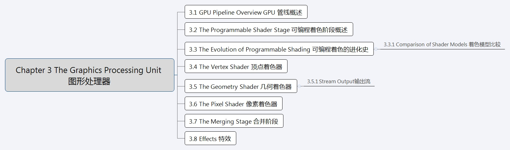
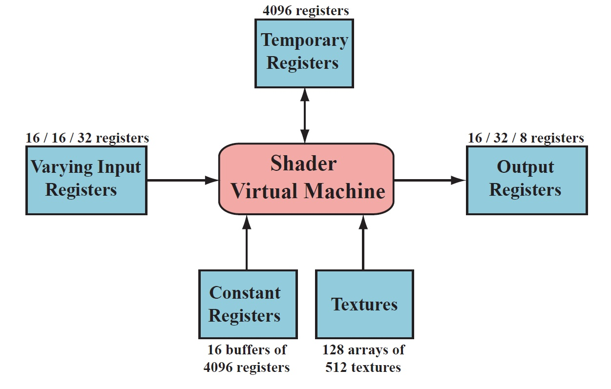

# 【《Real-Time Rendering 3rd》 提炼总结】(三) 第三章 · GPU渲染管线与可编程着色器 #

 
这篇文章是解析计算机图形学界“九阴真经总纲”一般存在的《Real-Time Rendering
3rd》系列文章的第三篇。将带来RTR3第三章内容“Chapter 3 The Graphics Processing
Unit 图形处理器”的总结、概括与提炼。

这章的主要内容是介绍GPU渲染管线的组成，以及可编程着色的进化史，顶点、几何、像素三种可编程着色器。

本文总字数7.3k，分为全文内容图示、原书核心内容分章节提炼、本章内容提炼总结三个部分来呈现。

 

# 一、全文内容图示

 

## 1.章节框架图示

## 2. GPU渲染管线流程图

其中：

-   绿色的阶段都是完全可编程的。

-   黄色的阶段可配置，但不可编程。

-   蓝色的阶段完全固定。

 

# 二、原书核心内容分节提炼

 

## 3.1 GPU管线概述

 

-   第一个包含顶点处理，面向消费者的图形芯片（NVIDIA GeForce256）发布于1999年，且NVIDIA提出了图形处理单元（Graphics Processing Unit，GPU）这一术语，将GeForce256和之前的只能进行光栅化处理的图形芯片相区分。在接下来的几年中，GPU从可配置的固定功能管线演变到了支持高度可编程的管线。直到如今，各种可编程着色器依然是控制GPU的主要手段。为了提高效率，GPU管线的一部分仍然保持着可配置，但不是可编程的，但大趋势依然是朝着可编程和更具灵活性的方向在发展。

-   GPU实现了第二章中描述的几何和光栅化概念管线阶段。其被分为一些不同程度的可配置性和可编程性的硬件阶段。如图3.1所示。

图3.1 GPU实现的渲染管线

上图中，不同颜色的阶段表示了该阶段不同属性。其中：

-   绿色的阶段都是完全可编程的。

-   黄色的阶段可配置，但不可编程。

-   蓝色的阶段完全固定。

需要注意，GPU实现的渲染管线和第二章中描述的渲染管线的功能阶段在结构上略有不同。以下是对GPU渲染管线的一个流程概览：

-   顶点着色器（The Vertex Shader）是完全可编程的阶段，顶点着色器可以对每个顶点进行诸如变换和变形在内的很多操作，提供了修改/创建/忽略顶点相关属性的功能，这些顶点属性包括颜色、法线、纹理坐标和位置。顶点着色器的必须完成的任务是将顶点从模型空间转换到齐次裁剪空间。

-   几何着色器（The Geometry Shader）位于顶点着色器之后，允许GPU高效地创建和销毁几何图元。几何着色器是可选的，完全可编程的阶段，主要对图元（点、线、三角形）的顶点进行操作。几何着色器接收顶点着色器的输出作为输入，通过高效的几何运算，将数据输出，数据随后经过几何阶段和光栅化阶段的其他处理后，会发送给片段着色器。

-   裁剪（Clipping）属于可配置的功能阶段，在此阶段可选运行的裁剪方式，以及添加自定义的裁剪面。

-   屏幕映射（Screen Mapping）、三角形设置（Triangle Setup）和三角形遍历（Triangle Traversal）阶段是固定功能阶段。

-   像素着色器（Pixel Shader，Direct3D中的叫法）常常又称为片断着色器，片元着色器(Fragment Shader，OpenGL中的叫法)，是完全可编程的阶段，主要作用是进行像素的处理，让复杂的着色方程在每一个像素上执行。

-   合并阶段（The Merger Stage）处于完全可编程和固定功能之间，尽管不能编程，但是高度可配置，可以进行一系列的操作。其除了进行合并操作，还分管颜色修改（Color Modifying），Z缓冲（Z-buffer），混合（Blend），模板（Stencil）和相关缓存的处理。

随着时间的推移，GPU管线已经远离硬编码的运算操作，而朝着提高灵活性和控制性改进。编程着色器的引入是这个进化的最重要的一步。

 

## 3.2 可编程着色模型

 

-   现代着色阶段（比如支持shader model 4.0，DirectX 10以及之后）使用了通用着色核心（common-shader core），这就表明顶点，片段，几何着色器共享一套编程模型。

-   早期的着色模型可以用汇编语言直接编程，但DX10之后，汇编就只在调试输出阶段可见，改用高级着色语言。

-   目前的着色语言都是C-like的着色语言，比如HLSL,CG和GLSL，其被编译成独立于机器的汇编语言语言，也称为中间语言（IL）。这些汇编语言在单独的阶段，通常是在驱动中，被转化成实际的机器语言。这样的安排可以兼容不同的硬件实现。这些汇编语言可以被看做是定义一个作为着色语言编译器的虚拟机。这个虚拟机是一个处理多种类型寄存器和数据源、预编了一系列指令的处理器。

-   着色语言虚拟机可以理解为一个处理多种类型寄存器和数据源、预编了一系列指令的处理器。考虑到很多图形操作都使用短矢量（最高四位），处理器拥有4路SIMD（single-instruction multiple-data，单指令多数据）兼容性。每个寄存器包含四个独立的值。32位单精度浮点的标量和矢量是其基本数据类型；也随后支持32位整型。浮点矢量通常包含数据如位置（xyzw），法线，矩阵行，颜色（rgba），或者纹理坐标（uvwq）。而整型通常用来表示，计数器，索引，或者位掩码。也支持综合数据类型比如结构体，数组，和矩阵。而为了便于使用向量，向量操作如调和（swizzling，也就是向量分量的重新排序或复制），和屏蔽（masking，只使用指定的矢量元素），也能够支持。虚拟机的输入和输出见图3.2。

图3.2 DX 10下的通用Shader核心虚拟机架构以及寄存器布局。每个资源旁边显示最大可用编号。其中，用两个斜杠分开的三个数值，分别是顶点，几何、像素着色器对应的可用最大值。

-   一个绘制调用（也就是喜闻乐见的Draw Call）会调用图形API来绘制一系列的图元，会驱使图形管线的运行。

-   每个可编程着色阶段拥有两种类型的输入：

    -   uniform输入，在一个draw call中保持不变的值（但在不同draw call之间可以更改）；

    -   varying输入，shader里对每个顶点和像素的处理都不同的值。纹理是特殊类型的uniform输入，曾经一直是一张应用到表面的彩色图片，但现在可以认为是存储着大量数据的数组。

-   在现代GPU上 ，图形运算中常见的运算操作执行速度非常快。通常情况下，最快的操作是标量和向量的乘法和加法，以及他们的组合，如乘加运算（multiply-add）和点乘 （dot-product）运算。其他操作，比如倒数（reciprocal）, 平方根（square root），正弦（sine），余弦（cosine），指数（exponentiation）、对数（logarithm）运算，往往会稍微更加昂贵，但依然相当快捷。纹理操作非常高效，但他们的性能可能受到诸如等待检索结果的时间等因素的限制。

-   着色语言表示出了大多数场常见的操作（比如加法和乘法通过运算符+和\*来表示）。其余的操作用固有的函数，比如atan() , dot() , log(),等。更复杂的操作也存在内建函数，比如矢量归一化（vector normalization）、反射（reflection）、叉乘（cross products）、矩阵的转置（matrix transpose）和行列式（determinant）等。

-   流控制（flow control）是指使用分支指令来改变代码执行流程的操作。这些指令用于实现高级语言结构，如“if”和“case”语句，以及各种类型的循环。Shader支持两种类型的流控制。静态流控制（Static flow control）是基于统一输入的值的。这意味着代码的流在调用时是恒定的。静态流控制的主要好处是允许在不同的情况下使用相同的着色器（例如，不同数量的光源）。动态流控制（Dynamic flow control）基于不同的输入值。但动态流控制远比静态流量控制更强大但同时也需更高的开销，特别是在调用shader之间，代码流不规律改变的时候。正如18.4.2节中讨论的，评估一个shader的性能，是评估其在一段时间内处理顶点或像素的个数。如果流对某些元素选择“if”分支，而对其他元素选择“else”分支，这两个分支必须对所有元素进行评估（并且每个元素的未使用分支将被丢弃）。

-   Shader程序可以在程序加载或运行时离线编译。和任何编译器一样，有生成不同输出文件和使用不同优化级别的选项。一个编译过的Shader作为字符串或者文本来存储，并通过驱动程序传递给GPU。

**3.3 可编程着色的进化史 The Evolution of Programmable Shading**

可编程着色的框架的思想可以追溯到1984年Cook的 shade
trees。一个简单的Shader以及其对应的shade tree如图3.3。

原书图3.3 一个简单的铜着色器（Cook的 shade trees）和其对应的着色语言代码

-   RenderMan 着色语言（RenderManShading Language）是从80年代中后期根据这个可编程着色的框架思想开发出来的，目前仍然广泛运用于电影制作的渲染中。在GPU原生支持可编程着色之前，有一些通过多个渲染通道实现实时可编程着色的尝试。

-   在1999年，《雷神III：竞技场》脚本语言是在这个领域上第一个成功广泛商用的语言。

-   在2000年，Peery等人，描绘了一个将RnederMan Shader翻译成在多通道上并且运行在图形硬件上的系统。

-   在2001年，NVIDIA'sGeForce 3 发布，它是第一个支持可编程顶点着色器的GPU，向DirectX
    8.0开放，并以扩展的形式提供给OpenGL。

-   2002年， DirectX 9.0发布，里面包括了Shader Model
    2.0（以及其扩展版本2.X），Shader Model 2.0 支持真正的可编程顶点和像素着色。着色编程语言 HLSL也是随着DirectX
    9.0的发布而问世。

-   2004年，Shader Model
    3.0推出。SM3.0是一个增量改进，将之前的可选功能进行了实现，进一步增加资源上限，并在顶点着色器中添加了有限的纹理读取支持。新一代主机的问世，2005(Microsofts Xbox 360)，2006 (Sony Play Station)，它们配备配备了Shader Model 3.0级别的GPU。

-   2006年底 ，任天堂发布了搭载固定功能管线GPU的Wii主机 ，固定功能管线，并没有像预想中的会完全死亡（其实一直活得很好）。

-   2007年，Shader Model4.0发布，包含于DirectX
    10.0中，OpenGL以扩展的方式支持。SM 4.0新增了几个着色器和流输出等新特性。SM
    4.0包括支持所有Shader类型（顶点、几何、像素着色器）的一套统一着色模型（uniform programming model）

图3.4 一个名为“mental
mill”的可视化着色器设计系统。各种操作都封装在功能窗中，位于左侧。每个功能窗都有可调参数，每个功能框的输入和输出彼此连接，形成最终结果。

### 3.3.1 着色模型对比 Comparison of Shader Models

下表3.1比较了各种着色模型的能力。在这个表格中，VS”代表顶点着色器和“PS”代表像素着色器（而着色模型4.0
引入了几何着色器，其能力与顶点着色相似）。如果没有出现“VS”和“PS”，那么该行适用于顶点和像素着色器。

表3.1 不同版本的着色模型能力对比，按DirectX着色模型版本列出

## 3.4 顶点着色器 Vertext Shader

-   顶点着色器（The Vertex Shader）的功能于2001年首次在DirectX
    8中引入。由于它是流水线上的第一个阶段，可选是在GPU还是CPU上实现。而在CPU上实现的话，需将CPU中的输出数据发送到GPU进行光栅化。目前几乎所有的GPU都支持顶点着色。

-   顶点着色器是完全可编程的阶段，是专门处理传入的顶点信息的着色器，顶点着色器可以对每个顶点进行诸如变换和变形在内的很多操作。顶点着色器一般不处理附加信息，也就是说，顶点着色器提供了修改，创建，或者忽略与每个多边形顶点相关的值的方式，例如其颜色，法线，纹理坐标和位置。通常，顶点着色器程序将顶点从模型空间（Model
    Space）变换到齐次裁剪空间（Homogeneous Clip
    Space），并且，一个顶点着色器至少且必须输出此变换位置。

-   值得注意的是，在这个顶点着色阶段之前发生了一些数据操作。比如在DirectX中叫做输入装配（Input
    Assembler）的阶段，会将一些数据流组织在一起，以形成顶点和基元的集合，发送到管线。

-   顶点着色器本身与前面3.2节所述的通用核心虚拟机（Common-Shader Core Virtual
    Machine）非常相似。传入的每个顶点由顶点着色器程序处理，然后输出一些在三角形或直线上进行插值后获得的值。顶点着色器既不能创建也不能消除顶点，并且由一个顶点生成的结果不能传递到另一个顶点。由于每个顶点都被独立处理，所以GPU上的任何数量的着色器处理器都可以并行地应用到传入的顶点流上。

-   顶点着色器的输出可以以许多不同的方式来使用，通常是随后用于每个实例三角形的生成和光栅化，然后各个像素片段被发送到像素着色器，以便继续处理。而在Shader
    Model 4.0中，数据也可以发送到几何着色器（Geometry Shader）或输出流（Streamed
    Output）或同时发动到像素着色器和几何着色器两者中。

如图3.5 使用顶点着色器的一些示例。

原书图3.5
左图，一个普通茶壶。中图，经过顶点着色程序执行的简单剪切（shear）操作产生的茶壶。右图，通过噪声（noise）产生的发生形变的茶壶。

## 3.5 几何着色器 The Geometry Shader

-   几何着色器（Geometry Shader）是顶点和片段着色器之间一个可选的着色器，随着2006年底DirectX10的发布被加入到硬件加速图形管线中。几何着色器作为Shader Model 4.0的一部分，不能早期着色模型（<=SM 3.0）中使用。

-   几何着色器的输入是单个对象及对象相关的顶点，而对象通常是网格中的三角形，线段或简单的点。另外，扩展的图元可以由几何着色器定义和处理。如图3.6。

  
原书图3.6
几何着色器程序的输入是一个单独的类型：点，线段，三角形。两个最右边的图元，包括与线和三角形对象相邻的顶点也可被使用。

-   几何着色器可以改变新传递进来的图元的拓扑结构，且几何着色器可以接收任何拓扑类型的图元，但是只能输出点、折线（line
    strip）和三角形条（triangle strips）。

-   几何着色器需要图元作为输入，在处理过程中他可以将这个图元整个丢弃或者输出一个或更多的图元（也就是说它可以产生比它得到的更多或更少的顶点）。这个能力被叫做几何增长（growing
    geometry）。如上所述，几何着色器输出的形式只能是点，折线和三角形条。

-   当我们未添加几何着色器时，默认的行为是将输入的三角形直接输出。我们添加了几何着色器之后，可以在几何着色器中修改输出的图形，我们可以输出我们想要输出的任何图形。

图
3.7.一些几何着色器的应用。左图，使用几何着色器实现元球的等值面曲面细分（metaball
isosurface
tessellation）。中图，使用了几何着色器和流输出进行线段细分的分形（fractal
subdivision of line
segments）。右图，使用顶点和几何着色器的流输出进行布料模拟。（图片来自NVIDIA SDK
10的示例）

### 3.5.1 流输出 Stream Output

-   GPU的管线的标准使用方式是发送数据到顶点着色器，然后对所得到的三角形进行光栅化处理，并在像素着色器中处理它们。
    数据总是通过管线传递，无法访问中间结果。流输出的想法在Shader Model
    4.0中被引入。在顶点着色器（以及可选的几何着色器中）处理顶点之后，除了将数据发送到光栅化阶段之外，也可以输出到流，也就是一个有序数组中进行处理。事实上，可以完全关掉光栅化，然后管线纯粹作为非图形流处理器来使用。以这种方式处理的数据可以通过管线回传，从而允许迭代处理。如原书的第10.7节所述，这种操作特别适用于模拟流动的水或其他粒子特效。

## 3.6 像素着色器 Pixel Shader

-   像素着色器(Pixel
    Shader，Direct3D中的叫法)，常常又称为片断着色器,片元着色器(Fragment Shader,
    OpenGL中的叫法)，用于进行逐像素计算颜色的操作，让复杂的着色方程在每一个像素上执行。如图3.1
    GPU渲染管线所示，像素着色器是光栅化阶段的主要步骤之一。在顶点和几何着色器执行完其操作之后，图元会被裁剪、屏幕映射，结束几何阶段，到达光栅化阶段，在光栅化阶段中先经历三角形设定和三角形遍历，之后来到像素着色阶段。

-   像素着色器常用来处理场景光照和与之相关的效果，如凸凹纹理映射和调色。名称片断着色器似乎更为准确，因为对于着色器的调用和屏幕上像素的显示并非一一对应。举个例子，对于一个像素，片断着色器可能会被调用若干次来决定它最终的颜色，那些被遮挡的物体也会被计算，直到最后的深度缓冲才将各物体前后排序。

-   需要注意，像素着色程序通常在最终合并阶段设置片段颜色以进行合并，而深度值也可以由像素着色器修改。模板缓冲（
    stencil buffer ）值是不可修改的，而是将其传递到合并阶段（merge stage）。在SM
    2.0以及以上版本，像素着色器也可以丢弃（discard
    ）传入的片段数据，即不产生输出。这样的操作会消耗性能，因为通常在这种情况下不能使用由GPU执行的优化
    。详见第18.3.7节。 诸如雾计算和alpha测试的操作已经从合并操作转移到SM 4.0
    中的像素着色器里计算。

-   可以发现，顶点着色程序的输出，在经历裁剪、屏幕映射、三角形设定、三角形遍历后，实际上变成了像素着色程序的输入。在Shader
    Model
    4.0中，共有16个向量（每个向量含4个值）可以从顶点着色器传到像素着色器。当使用几何着色器时，可以输出32个向量到像素着色器中。像素着色器的追加输入是在Shader
    Model
    3.0中引入的。例如，三角形的哪一面是可见的是通过输入标志来加入的。这个值对于在单个通道中的正面和背面渲染不同材质十分重要。而且像素着色器也可以获得片段的屏幕位置。

## 3.7 合并阶段 The Merging Stage

作为光栅化阶段名义上的最后一个阶段，合并阶段（The Merging
Stage）是将像素着色器中生成的各个片段的深度和颜色与帧缓冲结合在一起的地方。这个阶段也就是进行模板缓冲（Stencil-Buffer）和Z缓冲（Z-buffer）操作的地方。最常用于透明处理（Transparency）和合成操作（Compositing）的颜色混合（Color
Blending）操作也是在这个阶段进行的。

虽然合并阶段不可编程，但却是高度可配置的。在合并阶段可以设置颜色混合来执行大量不同的操作。最常见的是涉及颜色和Alpha值的乘法，加法，和减法的组合。其他操作也是可能的，比如最大值，最小值以及按位逻辑运算。

## 3.8 效果 Effect

-   GPU渲染管线中的可编程阶段有顶点、几何和像素着色器三个部分，他们需要相互结合在一起使用。正因如此，不同的团队研发出了不同的特效语言，例如HLSL
    FX，CgFX，以及COLLADA FX，来将他们更好的结合在一起。

-   一个效果文件通常会包含所有执行一种特定图形算法的所有相关信息，而且通常定义一些可被应用程序赋值的全局参数。例如，一个单独的effect
    file可能定义渲染塑料材质需要的vs(顶点着色器)和ps（像素着色器），它可能暴露一些参数例如塑料颜色和粗糙度，这样渲染每个模型的时候可以改变效果而仅仅使用同一个特效文件。一个效果文件中能存储很多techniques。这些techniques通常是一个相同effect的变体，每种对应于一个不同的Shader
    Model（SM2.0，SM3.0等等）。如图3.9，使用Shader实现的效果。

原书图3.9 可编程着色器可以实现各种材料和后处理效果

 

# 三、本章内容提炼总结

以下是对《Real Time Rendering 3rd》第三章“The Graphics Processing Unit
图形处理器”内容概括总结，有必要再次放出这张图：

图3.1 GPU实现的渲染管线

上图中，不同颜色的阶段表示了该阶段不同属性。其中：

-   绿色的阶段都是完全可编程的。

-   黄色的阶段可配置，但不可编程。

-   蓝色的阶段完全固定。

对每个阶段的分别概述：

-   顶点着色器（The Vertex
    Shader）是完全可编程的阶段，顶点着色器可以对每个顶点进行诸如变换和变形在内的很多操作，提供了修改/创建/忽略顶点相关属性的功能，这些顶点属性包括颜色、法线、纹理坐标和位置。顶点着色器的必须完成的任务是将顶点从模型空间转换到齐次裁剪空间。

-   几何着色器（The Geometry
    Shader）位于顶点着色器之后，允许GPU高效地创建和销毁几何图元。几何着色器是可选的，完全可编程的阶段，主要对图元（点、线、三角形）的顶点进行操作。几何着色器接收顶点着色器的输出作为输入，通过高效的几何运算，将数据输出，数据随后经过几何阶段和光栅化阶段的其他处理后，会发送给片段着色器。

-   裁剪（Clipping）属于可配置的功能阶段，在此阶段可选运行的裁剪方式，以及添加自定义的裁剪面。

-   屏幕映射（Screen Mapping）、三角形设置（Triangle
    Setup）和三角形遍历（Triangle Traversal）阶段是固定功能阶段。

-   像素着色器（Pixel
    Shader，Direct3D中的叫法）常常又称为片断着色器，片元着色器(Fragment
    Shader，OpenGL中的叫法)，是完全可编程的阶段，主要作用是进行像素的处理，让复杂的着色方程在每一个像素上执行。

-   合并阶段（The Merger
    Stage）处于完全可编程和固定功能之间，尽管不能编程，但是高度可配置，可以进行一系列的操作。其除了进行合并操作，还分管颜色修改（Color
    Modifying），Z缓冲（Z-buffer），混合（Blend），模板（Stencil）和相关缓存的处理。
