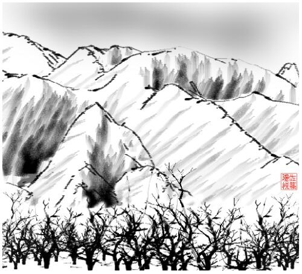
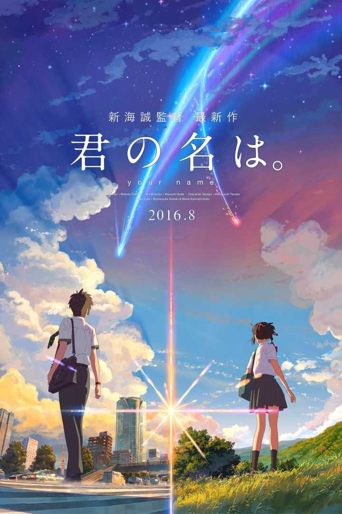
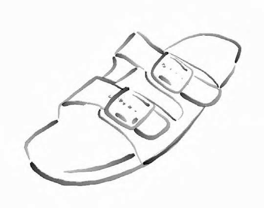
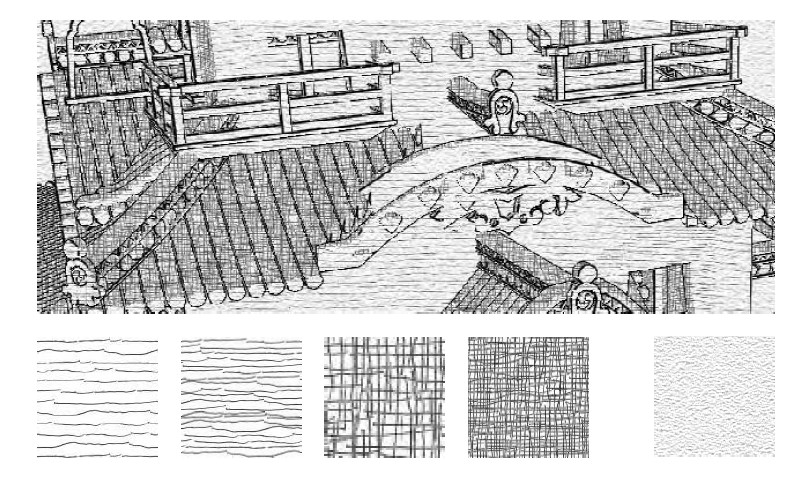
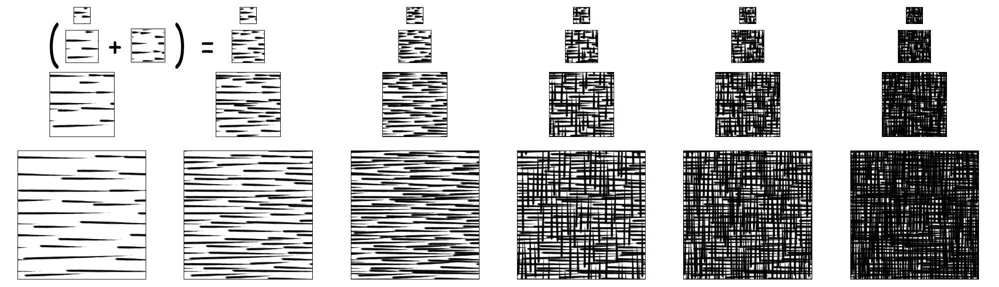

# 【《Real-Time Rendering 3rd》 提炼总结】(十) 第十一章 · 非真实感渲染(NPR)相关技术总结

与传统的追求照片真实感的真实感渲染不同，非真实感渲染（Non-Photorealistic
Rendering，NPR）旨在模拟艺术式的绘制风格，常用来对绘画风格和自然媒体（如铅笔、钢笔、墨水、木炭、水彩画等）进行模拟。而卡通渲染（Toon
Rendering）作为一种特殊形式的非真实感渲染方法，近年来倍受关注。

通过阅读这篇文章，你将对非真实感渲染技术的以下要点有所了解：

-   非真实感渲染的基本思想和相关领域

-   卡通渲染

-   轮廓描边的几种实现流派

-   1）基于视点方向的描边

-   2）基于过程几何方法的描边

-   3）基于图像处理生成的描边

-   4）基于轮廓边缘检测的描边

-   5）混和轮廓描边

-   其他风格的NPR渲染技术

-   1）纹理调色板（Palette of Textures）

-   2）色调艺术图（Tonal Art Maps，TAM）

-   3）嫁接（Graftals）

-   水彩风格的NPR

一、非真实感渲染
================

正如变化的字体会给人不一样的感觉，不同的渲染风格会带给人们不同的心情，感受与意境。

非真实感渲染（Non-Photorealistic Rendering，NPR），
亦被称为风格化渲染（Stylistic
Rendering），是致力于为数字艺术提供多种表达方式的一种渲染流派。与传统的追求照片真实感的真实感渲染（Photorealistic
Rendering）计算机图形学不同，非真实感渲染旨在模拟艺术式的绘制风格，也用于尝试新的绘制风格。

图1 真实感渲染 vs. 非真实感渲染 @ruben3d

NPR的目的之一就是创建类似技术示意图、技术图纸相关的图像，而另一个应用领域便是对绘画风格和自然媒体（如铅笔、钢笔、墨水、木炭、水彩画等）进行模拟。这是一个涉及内容非常之多的应用领域，为了捕捉各种媒体的真实效果，人们已经提出了各种不同的算法。

图2 基于NPR渲染出的水墨画 @suiboku

图3 基于NPR渲染出的铅笔素描\@ Real-Time Hatching . SIGGRAPH 2001

非真实感渲染与我们并不遥远，它早以“卡通着色（Toon
Shading）”的形式出现在各式动漫和电影中。

图4 基于卡通着色的2016年高分动漫电影《你的名字》

在游戏制作方面，各种涉及到非真实感渲染的作品数不胜数，《Ōkami(大神)》，《The
Legend of
Zelda（塞尔达传说）》系列，甚至到现在的《Dota2》、《英雄联盟》、《守望先锋》，都多多少少涉及到了NPR。

图5 非真实感渲染风格强烈的《塞尔达传说：荒野之息》

图6 非真实感渲染风格强烈的《塞尔达传说：荒野之息》

二、卡通渲染
============

上文提到，一直以来，有一种特殊形式的NPR倍受关注，且和我们的生活息息相关，那就是卡通渲染（Toon
Rendering，又称Cel Rendering）。这种渲染风格能够给人以独特的感染力与童趣。

这种风格很受欢迎的原因之一是McCloud的经典著作《Understanding
Comics》中所讲述到的“通过简化进行增强（Amplification Through
Simplification）”。通过简化并剔除所包含的混杂部分，可以突出于主题相关的信息，而大部分观众都会认同那些用简单风格描绘出来的卡通形象。

在计算机图形学领域，大约在20世纪90年代就开始使用toon渲染风格来实现三维模型和二维cel动画之间的结合。而且和其他NPR风格相比，这种绘制方法比较简单，可以很容易地利用计算机进行自动生成。

可以将最卡通着色基本的三个要素概括为：

-   锐利的阴影（Sharp shadows）

-   少有或没有高亮的点（Little or no highlight）

-   对物体轮廓进行描边（Outline around objects）

关于toon渲染，有很多不同的实现方法。

-   对于含有纹理但没有光照的模型来说，可以通过对纹理进行量化来近似具有实心填充颜色的卡通风格。

-   对于明暗处理，有两种最为常见的方法，一种是用实心颜色填充多边形区域。但这种方式实用价值不大。另一种是使用2-tone方法来表示光照效果和阴影区域。也称为硬着色方法（Hard
    Shading），可以通过将传统光照方程元素重新映射到不同的调色板上来实现。此外，一般用黑色来绘制图形的轮廓，可以达到增强卡通视觉效果的目的。

图7 真实感光照模型和卡通着色模型

具体的着色方法，可以理解为在Fragment
shader中测试每个像素漫反射diffuse中的NdotL值，让漫反射形成一个阶梯函数，不同的NdotL区域对应不同的颜色。下图显示了不同的漫反射强度值的着色部分阶梯指定了不同的像素颜色。

图8 不同的漫反射强度值的着色部分阶梯指定不同的像素颜色

图9 不同的卡通着色细节效果

三、轮廓描边的渲染方法小结
==========================

轮廓描边的渲染方法可以分为以下五种：

1）基于视点方向的描边

2）基于过程几何方法的描边

3）基于图像处理的描边

4）基于轮廓边缘检测的描边

5）混和轮廓描边

下面分别进行介绍。

3.1 基于视点方向的描边
----------------------

基于视点方向的描边方法，即表面角描边（Surface Angle
Silhouetting），其基本思想是使用视点方向（view point）和表面法线（surface
normal）之间的点乘结果得到轮廓线信息。如果此点乘结果接近于零，那么可以断定这个表面极大概率是侧向（Edge-on）的视线方向，而我们就将其视做轮廓边缘，进行描边。

这种方法相当于用一个边缘为黑色圆环的环境贴图（Environment
Map），对物体表面进行着色处理，如图所示。

图10
使用球形图来绘制边缘轮廓，如果沿着球形图的边缘对圆进行加宽，即可产生较粗的轮廓

在实际应用中，通常使用一张一维纹理（一般我们称其为ramp图）来代替环贴图。也就是使用视角方向与顶点法向的点乘对该纹理进行采样。

需要注意，这种技术仅适用于一些特定的模型，这些模型必须保证法线与轮廓边缘之间存在一定关系。诸如立方体这样的模型，此方法并不太适用，因为往往无法得到轮廓边缘。但我们可以通过显式地绘制出折缝边缘，来正确地表现出这类比较明显的特征。

3.2 基于过程几何方法的描边
--------------------------

基于过程几何方法生成的描边，即过程几何描边（Procedural Geometry
Silhouetting），基本思想是先渲染正向表面（frontfaces），再渲染背向表面（backfaces），从而使得轮廓边缘可见，达到描边的目的。

有多种方法用来渲染背向表面，且各有优缺点。但它们都是先渲染正向表面，然后打开正向表面裁剪（culling）开关，同时关闭背向裁剪开关。这样这个pass中的渲染结果便只会显示出背向表面。

一种基于过程几何方法生成的描边的方法是仅仅渲染出背向表面的边界线（而不是面），使用偏置（Biasing）或者其他技术来确保这些线条恰好位于正向表面之前。这样就可以将除轮廓边缘之外的其他所有线条全部隐藏起来。这种方法非常适合单像素宽的线条，但如果线条的宽度超过这个值，那么通常会出现无法连接独立线段的情况，从而造成明显的缝隙。

另一种渲染较宽描边线条的方法是直接将背面表面本身渲染成黑色。但没有任何偏置操作，背向表面就会保持不可见，所以需要做的就是通过偏置将这些背向表面沿屏幕Z方向向前移动，这样，便只有背向表面的三角形边缘是可见的。

如下图，可以使用背向表面的斜率对对多边形进行向前偏置，但是线条宽度依然依赖于正向表面的角度。

图11
描边的z偏置方法，可以通过对背向表面进行向前平移来实现。如果正向表面的角度不同，那么背向表面的可见量也不同。

3.3 基于图像处理的描边
----------------------

基于图像处理生成轮廓描边（Silhouetting by Image
Processing），即通过在各种缓冲区上执行图像处理技术，来实现非真实渲染的方法。可以将其理解为一种后处理操作。通过寻找相邻Z缓冲数值的不连续性，就可以确定大多数轮廓线的位置。同样，借助邻接表面法线向量的不连续性，可以确定出分界线（往往也是轮廓线）边缘的位置。此外，利用环境色对场景进行绘制，也可以用来检测前两种方法可能会漏掉的边缘。

图12 基于图像处理的描边

图13
通过对场景的法线图和z深度值就行处理来进行边缘检测，右图所示为经过加粗的合成结果。注意，在这种情况下，使用法线图就主义检测出所有的边缘。

3.4 基于轮廓边缘检测的描边
--------------------------

上文提到的大多数渲染描边的方法都存在一个缺点，那就是他们都需要两个通道才能完成物体轮廓描边的渲染。

基于轮廓边缘检测的描边，通过检测出轮廓边缘（Silhouette
EdgeDetection）），并直接对它们进行绘制，这种形式的描边，可以很好地控制线条绘制的过程。由于边缘独立于模型，因此这种方法还有另外一个优点，就是能够生成一些特殊的效果。例如，在网格密集的地方可以突现出轮廓边缘。

可以将轮廓边缘理解为朝向相反的相邻三角形的交接。也就是说，其中的一个三角形是朝向视点，另一个三角形背向视点。具体测试方法如下：

其中n0和n1分别表示两个三角形的表面法线向量，v表示从视点到这条边缘（也就是其中任何一个端点）的视线方向向量。而为了确保这种测试的准确性，必须保证表面的取向一致。

3.5 混和轮廓描边
----------------

混和轮廓描边（Hybrid
Silhouetting），即结合了图像处理方法和几何要素方法，来渲染轮廓的方法。

这种方法的具体思想是：首先，找到一系列轮廓边缘的列表。其次，渲染出所有物体的三角形和轮廓边缘，同时为他们指定一个不同的ID值（也就是说，赋予不同的颜色）。接着读取该ID缓冲器并从中判断出可见的轮廓边缘，随之对这些可见线段进行重叠检测，并将它们连接起来形成平滑的笔划路径。最后就可以对这些重建起来的路径进行风格化笔划渲染，其中，这些笔划本身可以用很多方法来进行风格化处理，包括变细、火焰、摆动、淡化等效果，同时还有深度和距离信息。如下图。

图14
使用混合轮廓描边方法生成的图像，其中可以将找到的轮廓边缘连接起来作为笔划进行渲染。

四、其他风格的NPR渲染技术小结
=============================

除了toon渲染这种比较受欢迎的模拟风格之外，还存在其他各式各样的风格。NPR效果涵盖的范围非常广泛，从修改具有真实感效果的纹理，到使用算法一幅幅画面的几何修饰。RTR3中主要谈了3种不同的其他风格的NPR渲染技术：

-   纹理调色板（Palette of Textures）

-   色调艺术图（Tonal Art Maps，TAM）

-   嫁接（Graftals）

下面分别进行介绍。

4.1 纹理调色板（Palette of Textures）
-------------------------------------

纹理调色板（palette of
textures）由Lake等人讨论提出，基本思想是通过反射着色项（diffuse shading
term）的不同，来选择应用于物体表面上的不同纹理。随着漫反射项逐渐变暗，可以选用相应更暗的纹理，而为了能够产生手绘的效果，可以使用屏幕空间坐标来采样纹理。同时，为了增强绘制效果，可以在屏幕空间上的所有表面上运用纸纹理。随着物体的运动，他们就可以在纹理之间进行穿梭。原因在于这个纹理是在屏幕空间中实现的。此外，也可以在世界空间中运用这个纹理，这样就能够得到一个与屏幕空间完全不同的效果。

图15 使用纹理调色板（paletteof
textures）、纸纹理，以及轮廓边缘绘制生成的一幅图像。

4.2 色调艺术图（Tonal Art Maps，TAM）
-------------------------------------

通过在纹理之间进行切换形成的硬着色效果和toon着色效果之间的一种混合，Praun等人（[https://www.dimap.ufrn.br/\~motta/dim102/Projetos/p581-praun.pdf](https://link.zhihu.com/?target=https%3A//www.dimap.ufrn.br/%7Emotta/dim102/Projetos/p581-praun.pdf)）提出了一种可以实时生成笔划纹理分级细化图的方法，并可以将其以平滑的方式运用到物体表面上。第一步是生成即时使用的纹理，称为色调艺术图（Tonal
Art Maps，TAM）,主要思想是将笔划绘制为分级细分图层次，如图。

图16
TAM将笔划绘制到细分图层次中，每个分级细化图层次包含图中左边和上边纹理中的所有笔划，这样，在细化图层次之间和相邻纹理之间的插值就比较平滑

图17 使用TAM渲染一副素描图的过程

图18 6种不同的TAM渲染出的6组不同模型

4.3 嫁接（Graftals）
--------------------

嫁接（Graftals）的基本思想，是将几何或者贴花纹理应用到物体表面，从而产生某种特殊效果。可以通过所需要的细节层次，物体表面相对视点的方位或者其他因素，对纹理进行控制。这种方法可以用来模拟钢笔或者画刷的笔刷，如下图。

图19 使用两种不同的嫁接（Graftals）风格绘制出来的Standord小兔

五、关于水彩风格的NPR
=====================

在写这篇文章查阅NPR相关资料的过程中，发现了非常酷的一个水彩风格化渲染的框架，Maya
Non-photorealistic Rendering
Framework，简称MNPR.[http://artineering.io/docs/mnprDocsWC/](https://link.zhihu.com/?target=http%3A//artineering.io/docs/mnprDocsWC/)。

MNPR在SIGGRAPH
2017有亮相，可以实现非常棒的水彩（Watercolor）渲染效果。有兴趣的朋友可以了解一下。以下是相关的一些精彩的图示。

图20 一个典型水彩风格渲染流程图

图21 水彩风格的NPR建模过程

图22 水彩风格的NPR效果图

图23 真实感渲染 vs. 水彩风格NPR渲染

图24 水彩NPR的渲染过程

六、NPR相关著作
===============

如下两本书从技术和NPR绘画算法两个方面，对非真实感渲染有了一个系统的涵盖，可谓NPR界的泰斗之作，有兴趣的朋友不妨进一步深入阅读。

-   Gooch, Bruce or Amy, and Amy or Bruce Gooch, Non-Photorealistic Rendering,A
    K Peters Ltd., 2001.

-   Strothotte, Thomas, and Stefan Schlechtweg ,Non-Photorealistic Computer
    Graphics: Modeling, Rendering, and Animation, Morgan Kaufmann, 2002.

七、NPR相关延伸资料推荐
=======================

-   链接（[http://kesen.realtimerendering.com/](https://link.zhihu.com/?target=http%3A//kesen.realtimerendering.com/)）中的Non-Photorealistic
    Animation and Rendering Proceedings
    一栏里可以找到NPR业界前沿的一些发展近况，即NPAR会议相关的资源。

-   SIGGRAPH 2010 上Stylized Rendering in Games 课程（[Stylized Rendering in
    Games](https://link.zhihu.com/?target=http%3A//stylized.realtimerendering.com/)）里有不少值得了解的NPR的内容。

-   NPR resources
    page（[http://www.red3d.com/cwr/npr/](https://link.zhihu.com/?target=http%3A//www.red3d.com/cwr/npr/)）里的材料也值得一看。

Reference
=========

[1] [http://www.gatheryourparty.com/2013/05/30/crash-course-cel-shading-in-video-games/](https://link.zhihu.com/?target=http%3A//www.gatheryourparty.com/2013/05/30/crash-course-cel-shading-in-video-games/)

[2] [http://www-cg.cis.iwate-u.ac.jp/lab/suiboku.html](https://link.zhihu.com/?target=http%3A//www-cg.cis.iwate-u.ac.jp/lab/suiboku.html)

[3] <https://zhuanlan.zhihu.com/p/26409746>

[4] <https://www.zhihu.com/question/32078473>

[5] [http://www.valvesoftware.com/publications/2007/NPAR07_IllustrativeRenderingInTeamFortress2.pdf](https://link.zhihu.com/?target=http%3A//www.valvesoftware.com/publications/2007/NPAR07_IllustrativeRenderingInTeamFortress2.pdf)

[6] [http://www.4gamer.net/games/216/G021678/20140703095/](https://link.zhihu.com/?target=http%3A//www.4gamer.net/games/216/G021678/20140703095/)

[7] [http://www.4gamer.net/games/216/G021678/20140714079/](https://link.zhihu.com/?target=http%3A//www.4gamer.net/games/216/G021678/20140714079/)

[8] [http://www.4gamer.net/games/216/G021678/20150317055/](https://link.zhihu.com/?target=http%3A//www.4gamer.net/games/216/G021678/20150317055/)

[9][https://en.wikipedia.org/wiki/Cel_shading](https://link.zhihu.com/?target=https%3A//en.wikipedia.org/wiki/Cel_shading)

[10] Praun E, Hoppe H, Webb M, et al.Real-time hatching[C]//Proceedings of the
28th annual conference on Computergraphics and interactive techniques. ACM,
2001:
581. [http://gfx.cs.princeton.edu/proj/hatching/](https://link.zhihu.com/?target=http%3A//gfx.cs.princeton.edu/proj/hatching/)

[11] [http://blog.csdn.net/silangquan/article/details/17184807](https://link.zhihu.com/?target=http%3A//blog.csdn.net/silangquan/article/details/17184807)

[12] [http://blog.csdn.net/candycat1992/article/details/45577749](https://link.zhihu.com/?target=http%3A//blog.csdn.net/candycat1992/article/details/45577749)

[13] [http://blog.csdn.net/thenile/article/details/8858702](https://link.zhihu.com/?target=http%3A//blog.csdn.net/thenile/article/details/8858702)

[14] [http://www.cs.duke.edu/courses/compsci344/spring15/classwork/16_npr/cmu.pdf](https://link.zhihu.com/?target=http%3A//www.cs.duke.edu/courses/compsci344/spring15/classwork/16_npr/cmu.pdf)

[15] [http://libregraphicsworld.org/blog/entry/freestyle-jot-and-the-future-of-non-photorealistic-rendering](https://link.zhihu.com/?target=http%3A//libregraphicsworld.org/blog/entry/freestyle-jot-and-the-future-of-non-photorealistic-rendering)

[16] [http://www.cartoonbrew.com/tag/non-photorealistic-rendering](https://link.zhihu.com/?target=http%3A//www.cartoonbrew.com/tag/non-photorealistic-rendering)

[17] Art-directed watercolor stylization of3D animations in real-time

[http://artineering.io/articles/Art-directed-watercolor-stylization-of-3D-animations-in-real-time/](https://link.zhihu.com/?target=http%3A//artineering.io/articles/Art-directed-watercolor-stylization-of-3D-animations-in-real-time/)

[18] [https://expressivesymposium.com/](https://link.zhihu.com/?target=https%3A//expressivesymposium.com/)

