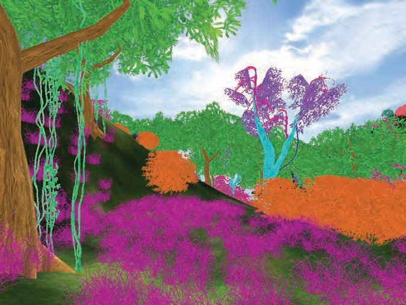

# 【《Real-Time Rendering 3rd》 提炼总结】(十二) 渲染管线优化方法论：从瓶颈定位到优化策略

 

导读
====

这篇文章约1万8千字，构成主要分为上篇（渲染管线瓶颈定位策略），下篇（渲染管线优化策略），以及常用的性能分析工具的列举三部分，详细目录如下。

-   一、渲染管线的构成

-   二、渲染管线优化策略概览

-   三、上篇：渲染管线的瓶颈定位

    -   3.1 光栅化阶段的瓶颈定位

        -   3.1.1 光栅化操作的瓶颈定位

        -   3.1.2 纹理带宽的瓶颈定位

        -   3.1.3 片元着色的瓶颈定位

    -   3.2 几何阶段的瓶颈定位

        -   3.2.1 顶点与索引传输的瓶颈定位

        -   3.2.2 顶点变换的瓶颈定位

    -   3.3 应用程序阶段的瓶颈定位

-   四、下篇：渲染管线的优化策略

    -   4.1 对CPU的优化策略

        -   4.1.1 减少资源锁定

        -   4.1.2 批次的尺寸最大化

    -   4.2 应用程序阶段的优化策略

        -   4.2.1 内存层面的优化

        -   4.2.2 代码层面的优化

    -   4.3 API调用的优化策略

    -   4.4 几何阶段的优化策略

        -   4.4.1 减少顶点传输的开销

        -   4.4.2 顶点处理的优化

    -   4.5 光照计算的优化策略

    -   4.6 光栅化阶段的优化策略

        -   4.6.1 加速片元着色

        -   4.6.2 减少纹理带宽

        -   4.6.3 优化帧缓冲带宽

-   五、主流性能分析工具列举

-   六、更多性能优化相关资料

文中列举了渲染管线各个阶段中用到的几十种主流的优化策略。其中，个人印象比较深刻的优化方法有使用实例（Instance）结合层次细节和impostors方法来对多人同屏场景的渲染进行优化，以及使用纹理页（Texture
Pages）来进行批次的尺寸最大化。

这篇文章会是《Real-Time Rendering 3rd》第十五章“Pipeline Optimization”和《GPU
Gem I》第28章“Graphics Pipeline
Performance”的一个结合，而不是之前一贯的《Real-Time Rendering
3rd》的单篇章节为主线。

需要吐槽的是，如果你对照阅读《GPU Gem
I》的英文原版和中文翻译版，会发现中文翻译版中有一些不合理甚至曲解英文原文意思的地方，在第五部分性能与实这一部分尤其明显。

OK，正文开始。

一、渲染管线的构成
==================

通常，可以将渲染管线的流程分为CPU和GPU两部分。下图显示了图形渲染管线的流程，可以发现，在GPU中存在许多并行运算的功能单元，本质上它们就像独立的专用处理器，其中存在许多可能产生瓶颈的地方。包括顶点和索引的取得、顶点着色（变换和照明，Transform
& Lighting，即T&L）、片元着色和光栅操作( Raster Operations ，ROP)。

图1 图形渲染管线

如《Real-Time Rendering 3rd》第二章所述，
图形的渲染过程基于由三个阶段组成的管线架构：

-   应用程序阶段（The Application Stage）

-   几何阶段（The Geometry Stage）

-   光栅化阶段（The Rasterizer Stage）

基于这样的管线架构，其中的任意一个阶段，或者他们之间的通信的最慢的部分，都可能成为性能上的瓶颈。瓶颈阶段会限制渲染过程中的整个吞吐量，从而影响总结渲染的性能，所以不难理解，瓶颈的部分便是进行优化的主要对象。

图2 渲染管线架构

若有对这个过程不太熟悉的朋友，具体可以移步回看这个系列的第二篇文章《[【《Real-TimeRendering
3rd》 提炼总结】(二) 第二章 · 图形渲染管线 The Graphics Rendering
Pipeline](https://zhuanlan.zhihu.com/p/26527776)》

二、渲染管线的优化概览
======================

准确定位瓶颈是渲染管线优化的关键一步。若没有很好确认瓶颈就进行盲目优化，将造成大量开发的工作的无谓浪费。

根据以往的优化经验，可以把优化的过程归纳为以下基本的确认和优化的循环：

-   Step 1.
    定位瓶颈。对于管线的每个阶段，改变它的负载或计算能力（即时钟速度）。如果性能发生了改变，即表示发现了一个瓶颈。

-   Step 2.
    进行优化。指定发生瓶颈的阶段，减小这个阶段的负载，直到性能不再改善，或者达到所需要的性能水平。

-   Step 3. 重复。重复第1步和第2步，直到达到所需要的性能水平。

需要注意的是，在经过一次优化步骤后，瓶颈位置可能依然在优化前的位置，也可能不在。比较好的想法是，尽可能对瓶颈阶段进行优化，保证瓶颈位置能够转移到另外一个阶段。在这个阶段再次成为瓶颈之前，必须对其他阶段进行优化处理，这也是为什么不能在一个阶段上进行过多优化的原因。

同一帧画面中，瓶颈位置也有可能改变。由于某个时候要渲染很多细小的三角形，这个时候，几何阶段就可能是瓶颈；在画面后期，由于要覆盖屏幕的大部分三角形单元进行渲染，因此这时光栅阶段就可能成为瓶颈。因此，凡涉及渲染瓶颈问题，即是指画面中花费时间最多的阶段。

在使用管线结构的时候应该意识到，如果不能对最慢的阶段进行进一步优化，就要使其他阶段与最慢阶段的工作负载尽可能一样多（也就是既然都要等瓶颈阶段，不妨给其他阶段分配更多任务来改善最终的表现，反正是要等）。由于没有改变最慢阶段的速度，因此这样做并没有改变最终的整个性能。例如，假定应用程序阶段成为瓶颈，需要花费50ms，而其他阶段仅需要花费25ms。这意味着，在不改变管线渲染速度(50ms，即每秒20帧)的情况下，几何阶段和光栅化阶段可以在50ms内完成各自任务。这时，可以使用一个更高级的光照模型或者使用阴影和反射来提高真实感（在不增加应用程序阶段工作负载的前提下）。

管线优化的一种大致思路是，先将渲染速度最大化，然后使得非瓶颈部分和瓶颈部分消耗同样多的时间（如上文所述，这里的思想是，既然要等，不等白不等，不妨多给速度快的部分分配更多工作量，来达到更好的画面效果）。但这种想法已经不适于不少新架构，如XBOX
360，因其为自动加载平衡计算资源。

因为优化技术对于不同的架构有很大的不同，且不要过早地进行优化。在优化时，请牢记如下三句格言：

-   “KNOW YOUR ARCHITECTURE（**了解你所需优化的架构**）”

-   “Measure（**去测量，用数据说话**）”

-   “We should forget about small efficiencies, say about 97% of the time:
    Premature optimization is the root of all
    evil.”（我们应该忘记一些小的效率，比如说97%的时间：**过早的优化是万恶之源。**）-
    Donald Knuth

OK，下面开始，本文的上篇，渲染管线的瓶颈定位。

三、上篇：渲染管线的瓶颈定位策略
================================

正确定位到了瓶颈，优化工作就已完成了一半，因为可以针对管线上真正需要优化的地方有的放矢
。

提到瓶颈定位，很多人都会想到Profiler工具。Profiler工具可以提供API调用耗时的详细信息，由此可以知道哪些API调用是昂贵费时的，但不一定能准确地确定管道中哪些阶段正在减慢其余部分的速度。（PS:本文文末提供了一系列常用的profiler工具的列表）

确定瓶颈的方法除了用Profiler查看调用耗时的详细信息这种众所周知的方法外，也可以采用基于工作量变化的控制变量法。**设置一系列测试，其中每个测试减少特定阶段执行的工作量。如果其中一个测试导致每秒帧数增加，则已经找到瓶颈阶段。**

而上述方法的排除法也同样可行，即在不降低测试阶段的工作量的前提下减少其他阶段的工作量。如果性能没有改变，瓶颈就是工作负载没有改变的此阶段。

下图显示了一个确认瓶颈的流程图，描述了在应用程序中精确定位瓶颈所需要的一系列步骤。

图3 确认渲染管线瓶颈流程图 \@ 《GPU GEMS I》

整个确认瓶颈的过程从渲染管线的尾端，光栅化阶段开始，经过帧缓冲区的操作（也称光栅操作），终于CPU（应用程序阶段）。虽然根据定义，某个图元（通常是一个三角形）只有一个瓶颈，但在帧的整个流程中瓶颈有可能改变。因此，修改流水线中多个节点的负载常常会影响性能。例如，少数多边形的天空包围盒经常受到片元着色或帧缓冲区存取的限制：只映射为屏幕上几个像素的蒙皮网络时常受到CPU或顶点处理的约束。因此，逐个物体地改变负载，或逐个材质地改变负载时常是有帮助的。

另外，管线的每个阶段都依赖于GPU频率（分为GPU Core Clock ，GPU核心频率，以及GPU
Memory Lock，GPU显存频率），这个信息可以配合工具 PowerStrip（EnTech Taiwan
2003），减小相关的时钟速度，并在应用中观察性能的变化。

下文将按照按照优化定位的一般顺序（即上述图中的流程），按光栅化阶段、几何阶段、应用程序阶段的的顺序来依次介绍瓶颈定位的方法与要点。

3.1 光栅化阶段的瓶颈定位
------------------------

众所周知，光栅化阶段由三个独立的阶段组成：
三角形设置，像素着色器程序，和光栅操作。

其中三角形设置阶段几乎不会是瓶颈，因为它只是将顶点连接成三角形。**而测试光栅化操作是否是瓶颈的最简单方法是将颜色输出的位深度从32（或24）位减少到16位**。如果帧速率大幅度增加，那么此阶段为瓶颈所在。

一旦光栅化操作被排除，**像素着色器程序的是否是瓶颈所在可以通过改变屏幕分辨率来测试**。如果较低的屏幕分辨率导致帧速率明显上升，像素着色器则是瓶颈，至少在某些时候会是这样。当然，如果是渲染的是LOD系统，就需斟酌一下是否瓶颈确实是像素着色器了。

另一种方法与顶点着色器程序所采用的方法相同，可以添加更多的指令来查看对执行速度的影响。当然，也要确保这些额外的指示不会被编译器优化。

下文将对光栅化阶段三个常常可能是瓶颈的地方进行进一步论述。

### 3.1.1 光栅化操作的瓶颈定位

光栅化操作的瓶颈主要与帧缓冲带宽（Frame-Buffer
Bandwidth）相关。众所周知，位于管线末端的光栅化操作（Raster  
Operations，常被简称为ROP），用于深度缓冲和模板缓冲的读写、深度缓冲和模板缓冲比较，读写颜色，以及进行alpha
混合和测试。而光栅化操作中许多负载都加重了帧缓冲带宽负载。

**测试帧缓冲带宽是否是瓶颈所在，比较好的办法是改变颜色缓冲的位深度，或深度缓冲的位深度（也可以同时改变两者）。**如果此操作（比如将颜色缓冲或深度缓冲的深度位从32位减少到16位）明显地提高了性能，那么帧缓冲带宽必然是瓶颈所在。

另外，帧缓冲带宽也与GPU显存频率（GPU memory
clock）有关，因此，修改该频率也可以帮助识别瓶颈。

### 3.1.2 纹理带宽的瓶颈定位

在内存中出现纹理读取请求时，就会消耗纹理带宽(Texture
Bandwidth)。尽管现代GPU的纹理高速缓存设计旨在减少多余的内存请求，但纹理的存取依然会消耗大量的内存带宽。

在确认光栅化操作阶段是否是瓶颈所在时，修改纹理格式比修改帧缓冲区的格式更麻烦。所以，**比较推荐使用大量正等级mipamap细节层次(LOD)的偏差，让纹理获取访问非常粗糙的mipmap金字塔级别，来有效地减小纹理尺寸。**同样，如果此修改显著地改善性能，则意味着纹理带宽是瓶颈限制。

纹理带宽也与GPU显存频率相关。

### 3.1.3 片元着色的瓶颈定位

片元着色关系到产生一个片元的实际开销，与颜色和深度值有关。这就是运行”像素着色器（Pixel
Shader ）“或”片元着色器（Fragment Shader ）“的开销。片元着色（Fragment
shading）和帧缓冲带宽（Frame-Buffer Bandwidth）由于填充率（Fill
Rate）的关系，经常在一起考虑，因为他们都与屏幕分辨率相关。尽管它们在管线中位于两个截然不同的阶段，区分两者的差别对有效优化至关重要。

在可编程片元处理的高级GPU出现之前，片元着色几乎没有什么局限性，时常是帧缓冲带宽引起的屏幕分辨率和性能之间不可避免的瓶颈。但随着开发者利用新的灵活性制造出一些新奇的像素，片元着色的性能问题也就出现了。

改变分辨率是确定片元着色是否为瓶颈的第一步。因为在上述光栅化操作步骤中，已经通过改换不同的深度缓冲位，排除了帧缓冲区带宽是瓶颈的可能性。所以，**如果调整分辨率使得性能改变，片元着色就可能是瓶颈所在**。而辅助的鉴别方法可以是修改片元长度，看这样是否会影响性能。但是要注意，不要添加可以被一些“聪明”的设备驱动轻松优化的指令。

片元着色的速度与GPU核心频率有关。

3.2 几何阶段的瓶颈定位
----------------------

几何阶段是最难进行瓶颈定位的阶段。这是因为如果在这个阶段的工作负载发生了变化，那么其他阶段的一个或两个阶段的工作量也常常发生变化。为了避免这个问题，Cebenoyan
[1] 提出了一系列的试验工作从光栅化阶段后的管线。

在几何阶段有两个主要区域可能出现瓶颈：顶点与索引传输( Vertex and  
Index Transfer)和顶点变换阶段（Vertex Transformation
Stage）。要看瓶颈是否是由于顶点数据传输的原因，可以增加顶点格式的大小。这可以通过每个顶点发送几个额外的纹理坐标来实现，例如。如果性能下降，这个部分就是瓶颈。

顶点变换是由顶点着色器或固定功能管线的转换和照明功能完成的。对于顶点着色器瓶颈，
测试包括使着色器程序更长。为了确保编译器没有优化这些附加指令，必须采取一些注意事项。对于固定功能管线，可以通过打开附加功能（如镜面高光）或将光源转换成更复杂的形式（例如聚光灯）来提高处理负荷。

下文将对几何阶段两个常可能是瓶颈的阶段的定位方法进行进一步论述。

### 3.2.1 顶点与索引传输的瓶颈定位

GPU渲染管线的第一步，是让GPU获取顶点和索引。而GPU获取顶点和索引的操作性能取决于顶点和索引的实际位置。其位置通常是在系统内存中（通过AGP或PCI
Express总线传送到GPU），或在局部帧缓冲内存中。通常，在PC平台上，这取决于设备驱动程序而不是应用程序，而现代图形API允许应用程序提供使用提示，以帮助驱动程序选择正确的内存类型。

**可以通过调整顶点格式的大小，来确定得到顶点或索引传输是否是应用程序的瓶颈。**

如果数据放在系统内存内，得到顶点或索引的性能与AGP或PCI
Express总线传输速率有关；如果数据位于局部缓冲内存，则与内存频率有关。

如果上述测试对性能都没有明显影响，那么顶点与索引传输阶段的瓶颈也可能位于CPU上。我们可以通过对CPU降频来确认这一事实，如果性能按比例进行变化，那么CPU就是瓶颈所在。

### 3.2.2 顶点变换的瓶颈定位

渲染管线中的顶点变换阶段（Vertex Transformation
Stage）负责输入一组顶点属性（如模型空间位置、顶点法线、纹理坐标等等），以及生产一组适合裁剪和光栅化的属性（如齐次裁剪空间位置，顶点光照结果，纹理坐标等等）。当然，这个阶段的性能与每个顶点完成的工作，以及正在处理的顶点数量有关。

**对于可编程的顶点变换，只要简单地改变顶点程序的长度，就能确定顶点处理是否是瓶颈。**如果此时发生性能的变化，就可以判定顶点处理阶段是瓶颈所在。如上文提到过的，如果要增加指令，在添加富有意义的指令时需要留心，  
以防止被编译器或驱动将指令优化掉。例如，因为驱动程序通常不知道程序编译时常量的值，没有被常量寄存器引用的空操作指令（no-ops）不能被优化（如加入一个含有值为零的常量寄存器）。

**对于固定功能的顶点变换，判定瓶颈则有点麻烦。试着通过改变顶点的工作，例如修改镜面光照或纹理坐标生成的状态来修改负载。**

另外需要注意，顶点处理的速度与GPU核心频率有关。

3.3 应用程序阶段的瓶颈定位
--------------------------

以下是应用程序阶段的瓶颈定位的一些策略的总结：

-   **可以用Profiler工具查看CPU的占用情况。**主要是看当前的程序是否使用了接近100%的CPU占用。比如AMD出品的Code  
    Analyst代码分析工具，可以对运行在CPU上的代码进行分析和优化。Intel也出品了一个称为Vtune的工具，可以分析在应用程序或驱动器（几何处理阶段）中时间花费的位置情况。

-   **一种巧妙的方法是发送一些其他阶段工作量极小甚至根本不工作的数据。**对于某些API而言，可以通过简单地使用一个空驱动器（就是指可以接受调用但不执行任何操作）来取代真实驱动器来完成。这就有效地限制了整个程序运行的速度，因为我们没有使用图形硬件，因此CPU始终是瓶颈。通过这个测试，您可以了解在应用阶段没有运行的阶段有多大的改进空间。也就是说，请注意，使用空驱动程序还隐藏了由于驱动程序本身和阶段之间的通信所造成的瓶颈。

-   **另一个更直接的方法是对CPU 进行降频(
    Underclock）。**如果性能与CPU速率成正比，则应用程序的瓶颈与CPU相关。但需要注意，降频的方法可以帮助识别瓶颈，也有可能导致一个之前不是瓶颈的阶段成为瓶颈。

-   另外，则是排除法，**如果GPU阶段没有瓶颈，那么CPU就一定是瓶颈所在。**

四、下篇：渲染管线的优化策略
============================

一旦确定了瓶颈位置，就可以对瓶颈所处阶段进行优化，以改善我们游戏的性能。下面根据解决问题的不同阶段，对一些优化策略进行了分类整理，将分为六个部分来进行呈现：

-   对CPU的优化策略

-   应用程序阶段的优化策略

-   API调用的优化策略

-   几何阶段的优化策略

-   光照计算的优化策略

-   光栅化阶段的优化策略

4.1 对CPU的优化策略
-------------------

许多应用的瓶颈都位于CPU，有的是正当理由（如复杂的物理或AI运算）导致，有的是因为不好的批处理或资源管理导致。如果已经发现应用程序受到CPU限制，可以试行下列建议，以对渲染管线中CPU的性能进行优化。

### 4.1.1 减少资源锁定

每当执行一个需要访问GPU的同步操作，就可能严重堵塞GPU管线，这将消耗CPU和GPU两者的周期。CPU必须保持在一个循环中，等待GPU管线工作，直到它闲下来并返回所请求的资源，这种等待会造成CPU周期的浪费。然后GPU等待对管线的再填充，这种等待又造成GPU周期的浪费。

上述的锁定发生在以下情况下：

-   对前面正在渲染的表面进行锁定或读出时

-   对GPU正在读的表面进行写入，例如纹理或顶点缓冲区

**而减少资源锁定的方法，可以尝试避免访问渲染期间GPU正在使用的资源。**

### 4.1.2 批次的尺寸最大化

这个策略也可以称为“将批次的数量减到最小”。

批次（batch）是调用单个API渲染所做的一组基本渲染。用来绘制几何体的每个API函数调用，都有对应的CPU消耗。因此最大限度地增加每次调用所提交的三角形的数量，CPU渲染给定数目三角形的消耗就可以减到最小。也即批次的尺寸乘以批次数量得到的工作总量一定，此消彼长。

使批次最大化的技巧列举如下：

-   **若使用了三角形带（Triangle Strips），则使用退化三角形（Degenerate
    Triangles）将不相交的条带拼接起来**。这样就能够一次发送多条三角形带，以便能在单个Draw
    Call中共享材质。

-   **使用纹理页（Texture
    Pages）**。不同物体使用不同纹理时，批次时常会被打破，若通过把多个纹理安排进单个的2D纹理内并适当设定纹理坐标，就能在单个Draw
    Call中发送使用了多个纹理的几何体。此技术可能存在mipmapping和反走样的问题，而回避大部分这类问题的技术是，把单个的2D纹理打包到一个立方体贴图的各个面内。

-   **使用Shader分支来增加单个批次大小从而合批。**现代GPU具有灵活的顶点和片元处理管线。允许Shader里有分支。例如，若两个分开的批次，因为其中一个需要四个骨骼蒙皮顶点着色器，而另一个需要两个骨骼蒙皮顶点着色器，你可以编写一个顶点着色器来遍历所需的骨骼数量，累积混合权重，然后在权重相加为一个时跳出循环。这样两个批次就可以合并为一个。在不支持shader分支的架构上，可以实现相似的功能，方法是上述两种情况都使用4块骨骼的顶点着色器，对骨骼数量不足4块的顶点，将其骨骼权重因子设置为0。

-   **将顶点着色器常量内存（vertex shader constant
    memory）作为矩阵查找表（Lookup Table of
    matrices）使用**。通常，当许多小对象共享所有的属性，但仅矩阵状态不同时（例如，含相似树木的森林，或一个粒子系统），批次就会遭到破坏。这时，可以把n个不同的矩阵加载到顶点着色器常量内存中，并将索引以每个对象的顶点格式存储在常量内存中。然后使用此索引查询顶点shader的常量内存，并使用正确的变换矩阵，从而一次渲染n个对象。

-   **尽可能远地往管线下端推迟决策。**若要速度更快，应该使用纹理的alpha通道作为发光值，而不是打破批次，为光泽设定一个像素shader常量。同样地，把着色数据放入纹理和顶点可以使单个批次的提交量更大。

4.2 应用程序阶段的优化策略
--------------------------

对应用程序阶段的优化，可以通过提高代码的执行速度，以及提到程序的存储访问速度（或者减少存储访问的次数）来实现。下面将给出一些通用的优化技术，适用于大多数的CPU。

最基本的代码优化策略包括为编译器打开优化标志。通常有很多不同的标志，一般需要检查哪些标志可以应用于程序代码中，而且对所使用的优化选项一般不做任何假设。例如，可以将编译器的开关设置为“最小代码大小（minimize
code size）”而不是“速度优化（optimizing for
speed）”，这样可以导致代码执行速度的提高，因为缓冲性能提高了。此外，如果可能的话，可以尝试不同的编译器，因为不同编译器一般是按照不同的方式进行优化的。

对于代码优化来说，定位大部分时间花在哪部分代码是很关键的。一个好的代码profiler是找到大部分运行时间都花费在代码哪里的关键。然后在这些地方进行优化工作。而这些位置通常是内部循环，或是每帧执行多次的代码片段。（PS:本文文末提供了一系列常用的profiler工具的列表）

优化的基本原则是尝试多种策略，包括重新检查算法，假设，以及代码语法等，也就是尽可能多的尝试各种变化情况。

下文将从内存层面和代码层面进一步说明。

### 4.2.1 内存层面的优化

对于存储层次结构来说，如何在各种不同的CPU体系结构上编写执行速度较快的代码变得越来越重要。在编写程序时，应该注意下列准则：

-   **在代码中连续访问的存储内容在内存中也应保持连续存储。**例如，当渲染一个三角形网格的时候，如果访问的顺序是：纹理坐标\#0、法线\#0、颜色\#0、顶点\#0、纹理坐标\#1、法线\#1等，那么在内存中也应该按这个顺序连续存储。**尽量避免指针的间接、跳转，以及函数调用，因为它们很容易显著降低CPU中缓冲的性能。**比如当一个指针指向另一个指针，而这个指针又指向其他指针时，以此类推，类似典型的链表和树结构，而这将导致数据缓存未命中（cache
    misses for data）。为了避免这种情况，应该尽可能使用数组来代替。

PS: 上述条准则的思想有点类似《Game Programming
Patterns》书中讲到的数据局部性模式（Data Locality pattern），具体可以参考《Game
Programming
Patterns》这本书的web版关于数据局部性模式的讲解：[http://gameprogrammingpatterns.com/data-locality.html](http://link.zhihu.com/?target=http%3A//gameprogrammingpatterns.com/data-locality.html)

-   **某些系统中，默认的内存分配和删除功能可能比较慢，因此，在启动时最好为相同大小的对象分配一个大的内存池，然后使用自己分配或空闲部分来处理该池的内存。**

-   **尽量尝试去避免在渲染循环中分配或释放内存**。例如，可以单次分配暂存空间(scratch
    space)，并且使用栈、数组等其他仅增长的数据结构（也可以使用标志位来标识哪些元素应该被视为已删除）。

-   **对数据结构尝试用不同的组织形式。**例如，Hecker[2]指出，对于一个简单的矩阵乘法器而言，通过不同的矩阵结构可以节省大量的计算开销。例如，一个结构数组如下：

**struct** Vertex {**float** x,y,z;}

Vertex myvertices[1000];

或者为：

**struct** VertexChunk {**float** x[1000],y[1000],z[1000];}

VertexChunk myvertices;

对于给定的体系结构而言，上述第二种结构对于SIMD命令来说要更好一些。但是随着顶点数目的增多，高速缓存的命中失误率也会随之增多。当数组大小增加到一定程度时，下面这种混合方案可能是最好的一种选择：

**struct** Vertex4 {**float** x[4],y[4],z[4];}

Vertex4 myvertices[250];

### 4.2.2 代码层面的优化

下面的会列出编写与计算机图形相关的高效代码的一些技术。这些方法随着编译器和不断发展的CPU而有所不同，但大多数已经保存了很多年（主要是针对C/C++而言）：

-   **善用SIMD。**单指令多数据流（Single Instruction Multiple
    Data，SIMD），例如Intel的MMX或SSE，以及AMD的3D
    Now!指令集，在很多情形下能获得很好的性能，可以并行计算多个单元，且比较适合用于顶点操作。

-   **使用float转long转换在奔腾系列处理器上速度较慢。**如果可以请尽量避免。

-   **尽可能避免使用除法。**相对于其他大多数指令而言，执行除法指令所需要的时间大约是执行其他指令所需时间的2.5倍或更多。

-   **许多数学函数，如sin、cos、tan、exp、arcsin等，计算开销较高，使用的时候必须小心。如果可以接受低精度，那么只需要使用麦克劳林（MacLaurin）或泰勒（Taylor）级数的前几项即可。**由于现代CPU对内存的访问的代价依然很高，因此使用级数的前几项比使用查找表（Lookup
    Tables）强得多。

-   **条件分支会有一定的开销，Shader中的条件分支开销尤甚。**尽管大多数处理器都有分支预测功能，但是这意味着只有准确地进行分支预测，才有可能降低计算开销。错误的分支预测对一些体系结构、特别是对于具有深管线的体系结构来说，计算开销通常会较高。

-   **对于经常调用的小函数使用内联（Inline）。**

-   **在合理的情况下减少浮点精度，比如用float代替double。**而当选用float型来代替double型数据时，需要在常数末尾加上一个f。否则，整个表达式就会被强制转换为double型；因此，语句float
    x =2.42f；要比float x = 2.42；执行得更快。

-   **尽可能使用低精度数据，让发送到图形管线的数据量更少。**

-   **虚函数方法、动态转换、（继承）构造，以及按值传递结构体（passing structs by
    value）都会对效率造成一定影响。**据了解，一帧画面中大约有40%的时间花费在用于模型管理的虚拟继承层次结构上。Blinn提出了一种技术[3]，可以避免计算C++中向量表方面的一部分开销。

4.3 API调用的优化策略
---------------------

上文已经提到，批次（batch）是调用单个API渲染所做的一组基本渲染。用来绘制几何体的每个API函数调用，都有对应的CPU消耗。改进批次过小问题的方法有很多种，且它们都有共同的目标——更少的API调用。以下是一些要点。

-   **一种减少API调用的方法是使用某种形式的实例（Instance）**。大多数API都支持在一次调用中拥有一个对象并进行多次绘制。因此，与其为森林中的每一棵树单独调用API，不如使用单次调用来渲染树模型的许多副本。如下图。

图4 植被实例（Vegetation instancing）。所有同样颜色的物体在一个Draw
Call中进行渲染。

PS: 此思想有点类似设计模式中的享元模式（flyweight pattern）。具体可以参考《Game
Programming
Patterns》这本书的web版关于享元模式的精彩讲解：[http://gameprogrammingpatterns.com/flyweight.html](http://link.zhihu.com/?target=http%3A//gameprogrammingpatterns.com/flyweight.html)

-   **进行批处理（batching）**。批处理的基本思想是将多个对象合并成一个对象，因此只需要一个API调用便可以渲染整个集合。批处理中的合并可以一次性完成，且缓冲区对静态对象集合都能每帧进行重用。对于动态对象，可以使用多个网格填充单个缓冲区。但这种基本方法的局限性是，网格中的所有对象都需要使用一组相同的着色器程序，即相同的材质。

-   **可以用不同的颜色来合并对象，例如，通过用标识符对每个对象的顶点进行标记。**着色器程序可以根据此标识符，查找使用什么颜色来遮挡物体。同样的想法可以扩展到其他表面属性。类似地，附于表面的纹理也可以用于标识使用哪种材质。而单独物体的光照贴图需合并成纹理图集（texture
    atlases）或纹理数组（texture array）。

-   **多人同屏的场景很适合使用实例进行渲染，其中每个角色都拥有独特的一套外表。**而进一步的变化可以添加随机的肤色和贴花。这种基于实例的方法也可以结合LOD技术进行。如下图。

图5 多人同屏场景（crowd scene）。使用实例（instancing）来减少Draw
Call，也可以结合LOD技术使用，比如对于远处的模型，使用 impostors进行渲染。

-   **提高性能的另一种方法是通过将具有类似渲染状态的对象（顶点和像素着色器、纹理、材质、光照、透明度等）分组并将它们按顺序渲染，从而最小化状态更改**。

-   改变状态时，有时需要完全或部分地清理管线。出于这个原因，改变着色器程序或材质参数可能非常昂贵。**对使用共享材质（shared
    material）的节点可以进行分组，以获得更好的性能，而采用共享纹理（shared
    texture）绘制多边形可以减小纹理缓存的抖动。**另外，正如上文提到的，一种减少纹理改变的变化的方法便是把一些纹理图像到一个大的纹理图集或纹理数组中。

-   **理解对象缓冲（object
    buffer）在渲染时的分配和存储方式也同样重要。**对于一个含CPU和GPU的系统，GPU和CPU有各自的内存，而图形驱动程序通常控制对象所在的位置，它也可以给出存储在何处是更优的建议。一个常见的类型分类是静态与动态缓冲区。如果一个物体不形变，或者形变可以完全由着色器程序（如蒙皮）完成，那么在GPU内存中存储对象的数据是较为合适的。而该对象的不变属性可以通过将其存储在为静态缓冲区中。通过这种方式，不必在渲染的每帧在总线上发送这些不变的数据，从而避免在管线的这一阶段出现瓶颈。

4.4 几何阶段的优化策略
----------------------

几何阶段主要负责变换、光照、裁剪、投影，以及屏幕映射。其中，变换和光照过程比较容易优化，其他几个部分的优化稍显困难。以下是一些要点：

-   变换、光照、裁剪、投影，以及屏幕映射操作可以使用较低精度的数据，以减小开销。

-   合理地使用索引和顶点缓冲区可以帮助几何阶段减小计算量。

-   **可以简化模型来减小整个管线的顶点和绘制图元的数量，以降低顶点数据传输和顶点变换成本。**而诸如视锥裁剪和遮挡剔除之类的技术避免了将全部的图元发送到管线。

-   可以使用缓存感知（cache-oblivious）布局算法，其中顶点以某种形式排列，以最大限度地提高缓存重用性，从而节省处理时间。（具体可见RTR3原文
    12.4.4节）

-   同理，**为了节省内存和访问时间，尽可能在顶点、法线、颜色和其他着色参数上，选择更低精度的数据格式。**有时我们会在half、single、double。float精度之间做选择，需要注意，除了其中因为精度更低带来的速度提升外，有些格式也会因为是硬件内部使用的原生格式（native
    format）而更快。

-   **减少内存使用的另一种方法是将顶点数据存储在压缩格式中。**对此，Deering
    [4]深入讨论了这种技术. Calver
    [5]提出了各种方案，使用顶点着色器进行解压。zarge [ 6
    ]也指出，数据压缩也有助于调整顶点格式缓存线。而Purnomo等人[ 7
    ]结合简化方法和顶点的量化技术，使用图像空间的度量，提出了为一个给定的目标网格尺寸优化网格的方案。

### 4.4.1 减少顶点传输的开销

顶点传递是瓶颈的可能性很小，但也偶有发生。假如顶点或索引（索引是瓶颈的可能性更小）的传递是应用瓶颈，可以试着使用下列各项策略：

-   **在顶点格式中使用尽可能少的位。**位数足够即可，不需要对所有数据都使用浮点格式（例如对颜色）。

-   **在顶点程序中产生可推导的顶点属性，而不是把他们存储在输入顶点格式中。**例如，正切线(tangent)、法线(normal)和副法线(binormal)通常不需要都存储。给出任意两个，能用Vertex-program简单叉积推导出第三个。这项技术，即为用顶点处理速度去换取顶点传输速率。

-   **使用16位的索引代替32位的索引。**16位索引更容易查找。移动起来更轻量，而且占用的内存更少。

-   **以相对连续的方式访问顶点数据。**当访问顶点数据时现代GPU可以进行缓存。因为在任意内存层次中，引用的空间局部性有助于最大化缓存的命中率，这可以减少对带宽的要求。

### 4.4.2 顶点处理的优化

顶点处理是现代GPU的瓶颈可能性很小，但是也偶有发生，这取决于所使用的模式和目标硬件。如果发现顶点处理是瓶颈所在，可以试用如下列举的各项策略：

-   **对变换和照明(T&L)后的顶点存储进行优化。**现代GPU有一个小的先入先出(FIFO)的缓存，用于存储最近所转换的顶点结果：命中这个高速缓冲器可以保存所有的变换和照明，以及所有流水线早先完成的工作。为了利用这个缓存的优势，必须使用经过索引的图元，而且必须对顶点进行排序，以最大化网格上的引用局部性。可以帮助完成这个任务的工具有D3DX和NVTriStrip等。

-   **减少所处理的顶点数。**这是能想到的很基本的解决方案。但是使用简单的层次细节方案，例如一组静态的LOD，确实有助于减少顶点处理的负担。

-   **使用顶点处理LOD。**在使用层次细节减少所处理的顶点数时，可以试着把层次细节用于顶点计算本身。例如，对远处的任务没必要完全做4块骨骼的蒙皮，或许可以使用更轻量的光照近似。而如果当前材质的shader是多通道的，那么减少位于远处低LOD级别的渲染通道数量，也会减少顶点处理的成本。

-   **把每个物体的计算留给CPU去做。**每个物体或每帧都改变的计算时常在顶点着色器中进行。例如，将方向光矢量转换到视点空间的通常在顶点shader中进行，虽然计算结果只是每帧改变一次。

-   **使用正确的坐标空间。**坐标空间的选择时常影响计算视点程序值所需的指令数。例如，计算顶点光照时，如果顶点法线存储在物体空间中，而方向光矢量存储在视图空间中，就须在顶点shader中转换其中之一，将两者转换到统一空间下。而如果改为在CPU上对每个物体一次性地把光矢量转换到物体空间，再进行逐个顶点的转换就没有必要了，这样就节省了GPU顶点处理的运算量。

-   **使用顶点分支来“提前结束”计算**。例如，若在顶点着色器中循环多个光源，然后进行法线、[0，1]低动态范围的光照，你可以判断饱和度到1，或者远离光源的顶点，来break掉，避免进一步无用的计算。对于蒙皮阶段有一个类似的优化，当权重之和达到1时，停止计算（因此所有后来加权的值是0）。需要注意，这个方法是否生效，依赖于GPU如何实现顶点分支，无法在所有架构上保证性能的改善。

4.5 光照计算的优化策略
----------------------

考虑光照的影响可以每顶点，每像素的进行计算，光照计算可以通过多种方式进行优化：

-   **首先，应该考虑使用的光源类型，以及可以考虑是否所有的多边形都需要光照。**有时模型只需纹理贴图，或者在顶点使用纹理，或只需要顶点颜色。那么很多多边形就无需进行光照计算。

-   **如果光源是静态的，且照明对象是几何体，那么漫反射光照和环境光可以预先计算并存储在顶点颜色中。**这样做通常被称为烘焙照明（baking
    lighting）。一个预光照（prelighting）更复杂的形式是使用辐射度（Radiosity）方法预先计算场景中的漫反射全局光照，而这样的光照可以存储在顶点颜色或光照贴图（lightmaps）中。

-   **控制光源的数量。**光源的数量影响几何阶段的性能，更多的光源意味着更少的速度。此外，双面的光照可以比单面光照更为昂贵。当对光源使用固定功能距离衰减时，根据物体与光源的距离来关闭/打开光源是有较为有用，且几乎不会被察觉。而距离足够大时，可以关掉光源。

-   **一种常见的优化方法是根据光源的距离来进行剔除，只渲染受本地光源影响的对象。**

-   **另一种减少工作的方法是禁用光源，取而代之的是使用环境贴图（environment
    map）**

-   **如果场景拥有大量光源，可以使用延迟着色技术来限制计算量和避免状态的变化。**

4.6 光栅化阶段的优化策略
------------------------

光栅化阶段可以以多种方式进行优化。现将主流的优化策略列举如下：

-   **善用背面裁剪**。对封闭（实心）的物体和无法看到背面的物体（例如，房间内墙的背面）来说，应该打开背面裁剪开关。这样对于封闭的物体来说，可以将需光栅化处理的三角形数量减少近50%。但需要注意的是，虽然背面裁剪可以减少不必要的图元处理，但需要花费一定的计算量来判断图元是否朝向视点。例如，如果所有的多边形都是正向的，那么背向裁剪计算就会降低几何阶段的处理速度。

-   **一种光栅化阶段的优化技术是在特定时期关闭Z缓冲（Z-buffering）。**例如，在清楚帧缓冲之后，必须要进行深度测试也可以直接渲染出任何背景图像。如果屏幕上的每个像素保证被某些对象覆盖（如室内场景，或正在使用背景天空图），则不需要清楚颜色缓冲区。同样，确保只有在需要时才使用混合模式（blend
    modes）。

-   **值得一提的是，如果在使用Z缓冲，在一些系统上使用模板缓冲不需要额外的时间开销。**这是因为8位的模板缓冲的值是存储为24位z深度值的同一个word中。

-   **优先使用原生的纹理和像素格式。**即使用显卡内部使用的原生格式，以避免可能会有的从一种格式到另一种格式的昂贵转换。

-   **另一种适用于光栅化阶段的优化技术是进行合适的纹理压缩。**如果在送往图形硬件之前已经将纹理压缩好，那么将它发送到纹理内存中的速度将会非常迅速。压缩纹理的另一个优点是可以提高缓存使用率，因为经过压缩的纹理会使用更少的内存。

-   **另一种有用的相关优化技术是基于物体和观察者之间的距离，使用不同的像素着色器。**例如，在场景中有三个飞碟模型，最接近摄像机的飞碟的可能用详细的凹凸贴图来进行渲染，而另外两个较远的对象则不需要渲染出细节。此外，对最远的飞碟可以使用简化的镜面高光，或者直接取消高光，来简化了计算量以及减少采样次数。

-   **理解光栅化阶段的行为。**为了很好地理解光栅阶段的负荷，可以对深度复杂度进行可视化，所谓的深度复杂度就是指一个像素被接触的次数。生成深度复杂度图像的一种简单方法就是，使用一种类似于OpenGL的glBlendFunc(GL
    ONE,GL
    ONE)调用，且关闭Z缓冲。首先，将图像清除成黑色；然后，对场景中所有的物体，均使用颜色(0,0,1)进行渲染。而混合函数（blend
    function）设置的效果即是对每个渲染的图元来说，可以将写入的像素值增加(0,0,1)。那么，深度复杂度为0的像素是黑色，而深度复杂度为255的像素为全蓝色（0,
    0, 255）。

-   **可以通过计数得到通过Z缓冲与否的像素进行计数，从而确定需进一步优化的地方。**使用双通道的方法对那些通过或没通过Z缓冲深度测试的像素进行计数。在第一个通道中，激活Z缓冲，并对那些通过深度测试的像素进行计数。而对那些没有通过深度测试的像素进行计数，可以通过增加模板缓冲的方式。另一种方法是关闭Z缓冲进行渲染来获得深度复杂度，然后从中减去第一个通道的结果。

通过上述方法得到结果后，可以确认：

（1）场景中深度复杂度的平均值、最小值和最大值

（2）每个图元的像素数目（假定已知场景中图元的数目）;

（3）通过或没有通过深度测试的像素数目。

而上述这些像素数量对理解实时图形应用程序的行为、确定需要进一步优化处理的位置都非常有用。

通过深度复杂度可以知道每个像素覆盖的表面数量，重复渲染的像素数量与实际绘制的表面的多少是相关的。假设两个多边形覆盖了一个像素，那么深度复杂度就是2。如果开始绘制的是远处的多边形，那么近处的多边形就会重复绘制整个远处的多边形，重绘数量也就为1。如果开始绘制的是近处的多边形，那么远处的多边形就不会通过深度测试，从而也就没有重绘问题。假设有一组不透明的多边形覆盖了一个像素，那么平均绘制数量就是调和级数：

上式背后所包含的逻辑是：第一个绘制的多边形是一次绘制：第2个多边形在第一个多边形之前绘制的概率是1/2：第三个多边形在前两个多边形前绘制的概率是1/3。依次类推，当n取极极限时：

其中，γ=0.57721…是Euler-Mascheroni常量。当深度复杂度很低时，重绘量会急剧增加，但增加速度也会逐渐减少。深度复杂度为4，平均绘制2.08次，深度复杂度为11，平均绘制3.02次，但深度复杂度为12367，平均绘制10次。

通过进行粗排序，并从前向后场景的渲染对性能提升会有帮助。这是因为后面绘制的被遮挡物体无需写入颜色缓冲区或Z缓冲区中。此外，在到达像素着色器程序之前，像素片元也可以被遮挡剔除硬件丢弃掉。

-   **另一种称为“early z
    pass”的技术对带复杂片元着色器的表面很有用**。即首先渲染z缓冲，然后再对整个场景进行渲染。此方法对于避免不必要的像素着色器的计算非常有用，因为只有可见的表面才会进行像素着色的计算。而通过BSP树遍历或显式地排序提供了一个粗略的前后顺序，可以提供很多优势，而不需要额外的Pass。

### 4.6.1 加速片元着色

如果你正在使用长而复杂的片元着色器，那么往往瓶颈就处于片元着色器中。若果真如此，那么可以试试如下这些建议：

-   **优先渲染深度。**在渲染主要着色通道（Pass）前，先进行仅含深度的通道（depth-only
    (no-color)
    pass）的渲染，能显著地提高性能，尤其是在高深度复杂性的场景中。因为这样可以减少需要执行的片元着色量，以及帧缓冲存储器的存取量，从而提高性能。而为了发挥仅含深度的通道的全部优势，仅仅禁用颜色写入帧缓冲是远远不够的，同时也应该禁用所有向片元的着色，甚至禁用影响到深度以及颜色的着色（比如
    alpha test）。

-   **帮助early-z优化（即Z缓冲优化），来避免多余片元处理** 。现代GPU配有设计良好的芯片，以避免对被遮挡片元的着色，但是这些优化依赖场景知识。而以粗略地从前向后的顺序进行渲染，可以明显提高性能。以及，先在单独的pass中先渲染深度（见前一条tip），通过将着色深度复杂度减少到1，可以有效地帮助之后的pass（主要的昂贵的shader计算的位置）进行加速。

-   **在纹理中存储复杂功能。**纹理作为查找表( lookup
    tables)其实非常好用，而且可以无消耗地过滤它们的结果。一个典型例子便是单位立方体贴图，它仅允许以一个单一纹理查找的代价来高精度地对任意向量进行标准化。

-   **将更多每片元的工作移到顶点着色器。**对于优化的大方向而言，正如顶点着色器中的每个物体的计算量工作应该尽可能地移到CPU中一样，每顶点的计算也应该尽量被移到顶点着色器（连同在屏幕空间中线性插值计算）。常见的例子包括计算向量和坐标系之间的变换向量。

-   **使用必需的最低精度。**诸如DirectX之类的API允许您在着色器代码中指定精度，以减少精度高所带来的额外计算量。很多GPU都可以利用这些提示来减少内部精度以及提高性能。

-   **避免过度归一化（Normalization）。**在写shader时，对每个步骤的每个矢量都进行归一化的习惯，常常被调侃为“以归一化为乐（Normalization-Happy）”。这个习惯通常来说其实是不太好的习惯。我们应该意识到不改变长度的变换（例如标准正交基上的变换）和不依赖矢量长度的计算（例如正方体贴图的查询）是完全没必要进行归一化后再进行的。

-   **考虑使用片元着色器的LOD层次细节。**虽然片元着色器的层次细节不像顶点着色器的层次细节影响那么大（由于投射，在远处物体本身的层次细节自然与像素处理有关），但是减少远处着色器的复杂性和表面的通道数，可以减少片元处理的负载。

-   **在不必要的地方禁用三线性过滤**。在现代GPU结构的片元着色器中计算三线性过滤(Trilinear
    filtering)，即使不消耗额外的纹理带宽，也要消耗额外的循环。在mip级别转换不容易辨别的纹理上，关掉三线性过滤，可以节省填充率。

-   **使用尽可能简单的Shader类型。**在Direct3D和OpenGL中，对片元进行着色都有多种方法。举例来说，在Direct3D
    9中，可以指定片元着色的使用，随着复杂性和功率的增加，有纹理阶段、像素shader版本
    1.x、像素 shader版本 2.x，以及像素shader
    3.0等。一般而言，应该使用最简单的着色器版本来创建预期的效果。更简单的着色版本提供了更多的一些隐式编译选项，通常可以用来让它们更快地被GPU驱动程序编译成处理像素的原生代码。

### 4.6.2 减少纹理带宽

如果发现内存带宽是瓶颈，但是大部分结果又要从纹理中取得，那么可以考虑以下方面的优化。

-   **减少纹理尺寸。**考虑目标分辨率和纹理坐标。如果玩家是不是真的会看到最高级别的mip级别，如果不是，就应该考虑缩减纹理大小。此方法在超载的帧缓冲存储器从非本地存储器（例如系统存储器，通过AGP或PCI
    Express总线）强制进行纹理化时会非常有用。一个NVIDIA在2003年出品的名叫NVPerfHUD的工具可以帮助诊断这个问题，其显示了各个堆（heaps）中由驱动所分配的内存量。

-   **压缩所有的彩色纹理**。应该压缩作为贴花或细节的一切纹理，根据特定纹理alpha的需要，选用DXT1、DXT3或DXT5进行压缩。这个步骤将会减少内存使用，减少纹理带宽需求，并提高纹理缓存效率。

-   **避免没必要的昂贵纹理格式。**64位或128位浮点纹理格式，显然要花费更多带宽，仅在不得已时才可以使用它们。

-   **尽可能地在缩小的表面上使用mipmapping**。mipmapping除了可以通过减少纹理走样改善质量外，还可以通过把纹理内存访问定位在缩小的纹理上来改善纹理缓存效用。如果发现某个mipmapping使表面看起来很模糊，不要禁用mipmapping，或增加大的LOD级别的基准偏移，而是使用各向异性过滤（anisotropic
    filtering），并适当调整每个批次各向异性的级别。

### 4.6.3 优化帧缓冲带宽

管线的最后阶段，光栅化操作，与帧缓冲存储器直接衔接，是消耗帧缓冲带宽的主要阶段。因此如果带宽出了问题，经常会追踪到光栅化操作。下面几条技巧将讲到如何优化帧缓冲带宽。

-   **首先渲染深度。**这个步骤不但减少片元着色的开销(见上文)，也会减少帧缓冲带宽的消耗。

-   **减少alpha混合。**当alpha混合的目标混合因子非0时，则要求对帧缓冲区进行读取和写入操作，因此可能消耗双倍的带宽。所以只有在必要时才进行alpha混合，并且要防止高深度级别的alpha混合复杂性。

-   **尽可能关闭深度写入。**深度写入会消耗额外的带宽，应该在多通道的渲染中被禁用（且多通道渲染中的最终深度已经在深度缓冲区中了）。比如在渲染alpha混合效果（例如粒子）时，也比如将物体渲染进阴影映射时，都应该关闭深度写入。另外，渲染进基于颜色的阴影映射也可以关闭深度读取。

-   **避免无关的颜色缓冲区清除**。如果每个像素在缓冲区都要被重写，那么就不必清除颜色缓冲区，因为清除颜色缓冲区的操作会消耗昂贵的带宽。但是，只要是可能就应该清除深度和模板缓冲区，这是因为许多早期z值优化都依赖被清空的深度缓冲区的内容。

-   **默认大致上从前向后进行渲染。**除了上文提到的片元着色器会从默认大致上从前向后进行渲染这个方法中受益外，帧缓冲区带宽也会得到类似的好处。早期z值硬件优化能去掉无关的帧缓冲区读出和写入。实际上，没有优化功能的老硬件也会从此方法中受益。因为通不过深度测试的片元越多，需要写入帧缓冲区的颜色和深度就越少。

-   **优化天空盒的渲染。**天空盒经常是帧缓冲带宽的瓶颈，因此必须决定如何对其进行优化，以下有两种策略：

（1）最后渲染天空盒，读取深度，但不写入深度，而且允许和一般的深度缓冲一起进行早期early-z优化，以节省带宽。

（2）首先渲染天空盒，而且禁用所有深度读取和写入。

以上两种策略，究竟哪一种会节省更多开端，取决于目标硬件的功能和在最终帧中有多大部分的天空盒可见。如果大部分的天空盒被遮挡，那么策略（1）更好，否则，策略（2）可以节省更多带宽。

-   **仅在必要时使用浮点帧缓冲区。**显然，这种格式比起较小的整数格式来说，会消耗更多的带宽，所以，能不用就不用。对多渲染目标(
    Multiple Render Targets，MRT)也同样如此。

-   **尽可能使用16为的深度缓冲区**。深度处理会消耗大量带宽，因此使用16位代替32位是极有好处的，且16位对于小规模、不需要模板操作的室内场景往往就足够了。对于需要深度的纹理效果，16位深度缓冲区也常常足够渲染，如动态的立方体贴图。

-   **尽可能使用16位的颜色**。这个建议尤其适用于对纹理的渲染效果，因为这些工作的大多数，用16位的颜色能工作得很好，例如动态立方体贴图和彩色投射阴影贴图。

综上，现代GPU能力和可编程性的增强，使得改善机器性能变得更复杂。无论是打算加速应用程序的性能，还是希望无成本地改善图像质量，都需要对渲染管线的内部工作原理有深刻理解。而GPU管线优化的基本思路是，通过改变每个单位的负荷或计算能力来识别瓶颈，然后运用每个传递单元工作原理的理解，系统地解决那些瓶颈。

五、主流性能分析工具列举
========================

有很多不错的分析图形加速器和CPU使用的的工具，以及性能优化相关的Profiling工具，在这里，将主流的工具进行列举：

-   Adreno Profiler

-   GPA

-   Tegra Graphics Debuger

-   Xcode Profiler

-   Xcode Instruments

-   PIX for Windows (for DirectX)

-   gDEBugger (for OpenGL)

-   NVIDIA’s NVPerfKit suite of tools

-   ATI’s GPU PerfStudio

-   Apple’s OpenGL Profiler

-   Linux
    上的Valgrind [http://valgrind.org/](http://link.zhihu.com/?target=http%3A//valgrind.org/)

-   NVIDIA出品的Nsight系列性能优化套件

-   [https://developer.nvidia.com/gameworks-tools-overview](http://link.zhihu.com/?target=https%3A//developer.nvidia.com/gameworks-tools-overview)

-   CPU端内循环优化工具
    Vtune [https://software.intel.com/en-us/intel-vtune-amplifier-xe](http://link.zhihu.com/?target=https%3A//software.intel.com/en-us/intel-vtune-amplifier-xe)

-   AQTime - 代码
    profilers工具 [https://smartbear.com/product/aqtime-pro/overview/](http://link.zhihu.com/?target=https%3A//smartbear.com/product/aqtime-pro/overview/)

现今主流游戏引擎提供的Profiler有：

-   Unreal Engine
    的一列系列Profiler工具集 [https://docs-origin.unrealengine.com/latest/INT/Engine/Performance/](http://link.zhihu.com/?target=https%3A//docs-origin.unrealengine.com/latest/INT/Engine/Performance/)

-   Unity的Profiler和后续新加入的Frame Debugger

    -   Unity –
        Profiler [https://docs.unity3d.com/Manual/ProfilerWindow.html](http://link.zhihu.com/?target=https%3A//docs.unity3d.com/Manual/ProfilerWindow.html)

    -   Unity - Frame
        Debugger [https://docs.unity3d.com/Manual/FrameDebugger.html](http://link.zhihu.com/?target=https%3A//docs.unity3d.com/Manual/FrameDebugger.html)

图6 Unreal Engine的GPU Visualizer

图7 Unity的Profiler

六、更多性能优化相关资料
========================

-   虽然有点过时，Cebenoyan的文章[1]概述了如何找到提高效率的瓶颈和技术。

-   《NVIDIA's extensive guide》[8]包含了相关的各种主题。

-   一些很赞的C++优化指南包括Fog的文章[9]和Isensee的文章[10]。

Reference
=========

[1] Cebenoyan, Cem, “Graphics Pipeline Performance,” in Randima Fernando,
ed.,GPU Gems, Addison-Wesley, pp. 473–486,2004. Cited on p. 681, 699, 701,
716,722

[2] Hecker, Chris, “More Compiler Results, and What To Do About It,” Game
Developer, pp. 14–21, August/September 1996. Cited on p. 705

[3] Blinn, Jim, “Optimizing C++ Vector Expressions,” IEEE Computer Graphics
&Applications, vol. 20, no. 4, pp. 97–103, 2000. Also collected in [110],
Chapter 18.Cited on p. 707

[4] Deering, Michael, “Geometry Compression,” Computer Graphics (SIGGRAPH 95
Proceedings), pp. 13–20, August 1995. Cited on p. 555, 713

[5] Calver, Dean, “Vertex Decompression Using Vertex Shaders,” in Wolfgang
Engel, ed., ShaderX, Wordware, pp. 172–187, May 2002. Cited on p. 713

[6] Zarge, Jonathan, and Richard Huddy, “Squeezing Performance out of your Game
with ATI Developer Performance Tools and Optimization Techniques,”Game
Developers Conference, March
2006. [http://ati.amd.com/developer/gdc/2006/GDC06-ATI](http://link.zhihu.com/?target=http%3A//ati.amd.com/developer/gdc/2006/GDC06-ATI) Session-Zarge-PerfTools.pdf  
Cited on p. 270, 699, 700, 701,702, 712, 713, 722, 847

[7] Purnomo, Budirijanto, Jonathan Bilodeau, Jonathan D. Cohen, and Subodh
Kumar,“Hardware-Compatible Vertex Compression Using Quantization and
Simplification,”Graphics Hardware, pp. 53–61, 2005. Cited on p. 713

[8] NVIDIA Corporation, “NVIDIA GPU Programming Guide,” NVIDIA developer
website, 2005. [http://developer.nvidia.com/object/gpu programming
guide.html](http://link.zhihu.com/?target=http%3A//developer.nvidia.com/object/gpu%2520programming%2520guide.html)Cited
on p. 38, 282, 699, 700, 701, 702, 712, 722

[9] Fog, Agner, Optimizing software in C++, 2007. Cited on p. 706, 722

[10] Isensee, Pete, “C++ Optimization Strategies and Techniques,” 2007. Cited on
p.706, 722
