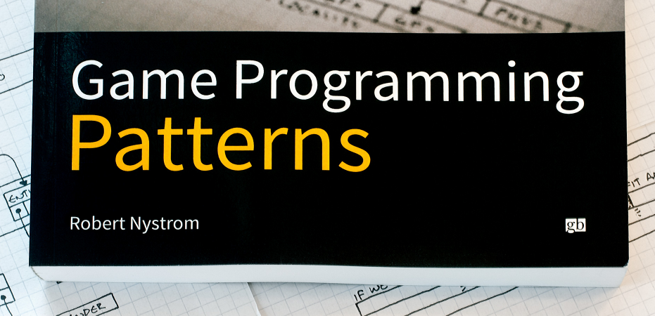

# 《游戏编程模式》全书内容梗概总结

这是一篇超过万字读书笔记，总结了《游戏编程模式》一书中所有章节与内容的知识梗概。

 
 

# 目录与说明

《游戏编程模式》一书中总共介绍了19种设计模式，权当目录，现列举如下：

* [零、全书内容思维导图](#00)
* [一、常用GOF设计模式](#01)
	* [1.命令模式](#1)
	* [2.享元模式](#2)
	* [3.观察者模式](#3)
	* [4.原型模式](#4)
	* [5.单例模式](#5)
	* [6.状态模式](#6)
* [二、序列型模式](#02)
	* [7.双缓冲模式](#7)
	* [8.游戏循环模式](#8)
	* [9.更新方法](#9)
* [三、行为型模式](#03)
	* [10.字节码模式](#10)
	* [11.子类沙箱模式](#11)
	* [12.类型对象模式](#12)
* [四、解耦型模式](#04)
	* [13.组件模式](#13)
	* [14.事件队列模式](#14)
	* [15.服务定位器模式](#15) 
* [五、优化型模式](#05)
	* [16.数据局部性模式](#16)
	* [17.脏标识模式](#17)
	* [18.对象池模式](#18)
	* [19.空间分区模式](#19) 
* [六、更多参考与学习资源](#06) 

本文对以上19种模式进行分别进行了总结，对每种模式分以下三个方面进行了介绍：

-   要点

-   使用场合

-   引申与参考

依次介绍完19种模式之后，最终给出了一些更多的参考与学习资源。

以下是全书内容的知识导图：

 

<h1 id="01">零、全书内容思维导图</h1>

以下开始正文。
 
 

<h1 id="01">一、常用GOF设计模式</h1>
这一部分介绍了游戏开发中较为常用的六种GOF设计模式。

<h2 id="1">1. 命令模式 Command Pattern</h2>

命令模式将“请求”封装成对象，以便使用不同的请求、队列或者日志来参数化其他对象，同时支持可撤消的操作。

### 要点

-   将一组行为抽象为对象，这个对象和其他对象一样可以被存储和传递，从而实现行为请求者与行为实现者之间的松耦合，这就是命令模式。

-   命令模式是回调机制的面向对象版本。

-   命令模式的本质是对命令进行封装，将发出命令的责任和执行命令的责任分割开。

-   命令模式的优点有：对类间解耦、可扩展性强、易于命令的组合维护、易于与其他模式结合，而缺点是会导致类的膨胀。

-   命令模式有不少的细分种类，实际使用时应根据当前所需来找到合适的设计方式。

### 使用场合

-   命令模式很适合实现诸如撤消，重做，回放，时间倒流之类的功能。

-   基于命令模式实现录像与回放等功能，也就是执行并解析一系列经过预录制的序列化后的各玩家操作的有序命令集合。

### 引申与参考

-   最终你可能会得到很多不同的命令类。为了更容易实现这些类，定义一个具体的基类，包含一些能定义行为的高层方法，往往会有帮助。可以将命令的主体execute()转到子类沙箱中。

-   对象可以响应命令，或者将命令交给它的从属对象。 如果我们这样实现了，就完成了一个职责链模式。

-   对于等价的实例，可以用享元模式提高内存利用率。

-   命令模式的Unity版本实现：<https://github.com/QianMo/Unity-Design-Pattern/tree/master/Assets/Behavioral%20Patterns/Command%20Pattern>

-   本节内容相关的英文原文：<http://gameprogrammingpatterns.com/command.html>

-   本节内容相关的中文翻译：<http://gpp.tkchu.me/command.html>

 

<h2 id="2"> 2. 享元模式 Flyweight Pattern</h2>

享元模式，以共享的方式高效地支持大量的细粒度的对象。通过复用内存中已存在的对象，降低系统创建对象实例的性能消耗。

### 要点

-   享元模式中有两种状态。内蕴状态（Internal State）和外蕴状态（External
    State）。

    -   内蕴状态，是不会随环境改变而改变的，是存储在享元对象内部的状态信息，因此内蕴状态是可以共享的。对任何一个享元对象而言，内蕴状态的值是完全相同的。

    -   外蕴状态，是会随着环境的改变而改变的。因此是不可共享的状态，对于不同的享元对象而言，它的值可能是不同的。

-   享元模式通过共享内蕴状态，区分外蕴状态，有效隔离系统中的变化部分和不变部分。

### 使用场合

在以下情况都成立时，适合使用享元模式：

1.  当系统中某个对象类型的实例较多的时候。

2.  由于使用了大量的对象，造成了很大的存储开销。

3.  对象的大多数状态都可变为外蕴状态。

4.  在系统设计中，对象实例进行分类后，发现真正有区别的分类很少的时候。

### 引申与参考

-   为了返回一个已经创建的享元，需要和那些已经实例化的对象建立联系，我们可以配合对象池来进行操作。

-   当使用状态模式时，很多时候可以配合使用享元模式，在不同的状态机上使用相同的对象实例。

-   享元模式的Unity版本实现：<https://github.com/QianMo/Unity-Design-Pattern/tree/master/Assets/Structural%20Patterns/Flyweight%20Pattern>

-   本节内容相关的英文原文：<http://gameprogrammingpatterns.com/flyweight.html>

-   本节内容相关的中文翻译：<http://gpp.tkchu.me/flyweight.html>

 

<h2 id="3">3. 观察者模式 Observer Pattern</h2>
观察者模式定义了对象间的一种一对多的依赖关系，当一个对象的状态发生改变时，所有依赖于它的对象都得到通知并被自动更新。

### 要点

-   观察者模式定义了对象间的一种一对多的依赖关系，当一个对象的状态发生改变时，所有依赖于它的对象都得到通知并被自动更新。

-   我们知道，将一个系统分割成一个一些类相互协作的类有一个不好的副作用，那就是需要维护相关对象间的一致性。我们不希望为了维持一致性而使各类紧密耦合，这样会给维护、扩展和重用都带来不便。观察者就是解决这类的耦合关系的。

-   目前广泛使用的MVC模式，究其根本，是基于观察者模式的。

-   观察者模式应用广泛，Java甚至将其放到了核心库之中（java.util.Observer），而C\#直接将其嵌入了语法（event关键字）中。

### 使用场合

-   当一个抽象模式有两个方面，其中一个方面依赖于另一个方面，需要将这两个方面分别封装到独立的对象中，彼此独立地改变和复用的时候。

-   当一个系统中一个对象的改变需要同时改变其他对象内容，但是又不知道待改变的对象到底有多少个的时候。

-   当一个对象的改变必须通知其他对象作出相应的变化，但是不能确定通知的对象是谁的时候。

### 引申与参考

-   观察者模式的Unity版本实现：<https://github.com/QianMo/Unity-Design-Pattern/tree/master/Assets/Behavioral%20Patterns/Observer%20Pattern>

-   本节内容相关的英文原文：<http://gameprogrammingpatterns.com/observer.html>

-   本节内容相关的中文翻译：<http://gpp.tkchu.me/observer.html>

 

<h2 id="4">4.原型模式 Prototype Pattern</h2>

用原型实例指定创建对象的种类，并且通过拷贝这些原型创建新的对象。

### 要点

-   原型模式：用原型实例指定创建对象的种类，并且通过拷贝这些原型创建新的对象。

-   原型模式是一种比较简单的模式，也非常容易理解，实现一个接口，重写一个方法即完成了原型模式。在实际应用中，原型模式很少单独出现。经常与其他模式混用，他的原型类Prototype也常用抽象类来替代。

-   使用原型模式拷贝对象时，需注意浅拷贝与深拷贝的区别。

-   原型模式可以结合JSON等数据交换格式，为数据模型构建原型。

### 使用场合

-   产生对象过程比较复杂，初始化需要许多资源时。

-   希望框架原型和产生对象分开时。

-   同一个对象可能会供其他调用者同时调用访问时。

### 参考与引申

-   原型模式的Unity版本实现：<https://github.com/QianMo/Unity-Design-Pattern/tree/master/Assets/Creational%20Patterns/Prototype%20Pattern>

-   本节内容相关的英文原文：<http://gameprogrammingpatterns.com/prototype.html>

-   本节内容相关的中文翻译： <http://gpp.tkchu.me/prototype.html>

 

<h2 id="5">5.单例模式 Singleton Pattern</h2>

保证一个类只有一个实例，并且提供了访问该实例的全局访问点。

### 要点

-   单例模式因其方便的特性，在开发过程中的运用很多。

-   单例模式有两个要点，保证一个类只有一个实例，并提供访问该实例的全局访问点。

-   尽量少用单例模式。单例模式作为一个全局的变量，有很多全局的变量的弊病。它会使代码更难理解，更加耦合，并且对并行不太友好。

### 使用场合

-   当在系统中某个特定的类对象实例只需要有唯一一个的时候。

-   单例模式要尽量少用，无节制的使用会带来各种弊病。
-   证实例是单一的，可以简单的使用静态类。还可以使用静态标识位，在运行时检测是不是只有一个实例被创建了。

### 参考与引申

-   下文中介绍的子类沙箱模式通过对状态的分享，给实例以类的访问权限而无需让其全局可用。

-   下文中介绍的服务定位器模式不但让一个对象全局可用，还可以带来设置对象的一些灵活性。

-   单例模式的Unity版本实现：<https://github.com/QianMo/Unity-Design-Pattern/tree/master/Assets/Creational%20Patterns/Singleton%20Pattern>

-   本节内容相关的英文原文：<http://gameprogrammingpatterns.com/singleton.html>

-   本节内容相关的中文翻译：<http://gpp.tkchu.me/singleton.html>

 

<h2 id="6">6.状态模式 State Pattern</h2>

允许对象在当内部状态改变时改变其行为，就好像此对象改变了自己的类一样。

### 要点

-   状态模式用来解决当控制一个对象状态转换的条件表达式过于复杂的情况，它把状态的判断逻辑转移到表示不同的一系列类当中，可以把复杂的逻辑判断简单化。

-   状态模式的实现分为三个要点：

    -   为状态定义一个接口。

    -   为每个状态定义一个类。

    -   恰当地进行状态委托。

-   通常来说，状态模式中状态对象的存放有两种实现存放的思路：

    -   静态状态。初始化时把所有可能的状态都new好，状态切换时通过赋值改变当前的状态。

    -   实例化状态。每次切换状态时动态new出新的状态。

### 使用场合

在游戏开发过程中，涉及到复杂的状态切换时，可以运用状态模式以及状态机来高效地完成任务。

有限状态机的实现方式，有两种可以选择：

-   用枚举配合switch case语句。

-   用多态与虚函数（即状态模式）。

有限状态机在以下情况成立时可以使用：

-   有一个行为基于一些内在状态的实体。

-   状态可以被严格的分割为相对较少的不相干项目。

-   实体可以响应一系列输入或事件。

### 参考与引申

-   Hierarchical State Machines分层状态机：<http://www.eventhelix.com/RealtimeMantra/HierarchicalStateMachine.htm#.WAHM3Y996Uk>

-   Pushdown Automata下推自动机：<https://en.wikipedia.org/wiki/Pushdown_automaton>

-   状态模式的Unity版本实现：<https://github.com/QianMo/Unity-Design-Pattern/tree/master/Assets/Behavioral%20Patterns/State%20Pattern>

-   本节内容相关的英文原文：<http://gameprogrammingpatterns.com/state.html>

-   本节内容相关的中文翻译：<http://gpp.tkchu.me/state.html>

 

<h1 id="02">二、序列型模式 Sequencing Patterns</h1>

本章的三种模式都是游戏开发中的常客：

-   游戏循环是游戏运行的主心骨。

-   游戏对象通过更新方法来进行每帧的更新。

-   我们可以用双缓冲模式存储快照，来隐藏计算机的顺序执行，从而使得游戏世界能够同步更新。

<h2 id="7">7.双缓冲模式 Double Buffer</h2>

双缓冲模式，使用序列操作来模拟瞬间或者同时发生的事情。

### 要点

-   一个双缓冲类封装了一个缓冲：一段可改变的状态。这个缓冲被增量的修改，但我们想要外部的代码将其视为单一的元素修改。为了实现这点，双缓冲类需保存两个缓冲的实例：下一缓存和当前缓存。

-   当信息从缓冲区中读取，我们总是去读取当前的缓冲区。当信息需要写到缓存，我们总是在下一缓冲区上操作。当改变完成后，一个交换操作会立刻将当前缓冲区和下一缓冲区交换，这样新缓冲区就是公共可见的了。旧的缓冲区则成为了下一个重用的缓冲区。

-   双缓冲模式常用来做帧缓冲区交换。

### 使用场合

双缓冲模式是那种你需要它时自然会想起来的模式。以下情况都满足时，使用这个模式很合适：

-   我们需要维护一些被增量修改的状态

-   在修改过程中，状态可能会被外部请求。

-   我们想要防止请求状态的外部代码知道内部是如何工作的。

-   我们想要读取状态，而且不想在修改的时候等待。

### 引申与参考

-   我们几乎可以在任何一个图形API中找到双缓冲模式的应用。如OpenGl中的swapBuffers() 函数, Direct3D中的“swap chains”,微软XNA框架的 endDraw() 方法。

-   本节内容相关的英文原文：<http://gameprogrammingpatterns.com/double-buffer.html>

-   本节内容相关的中文翻译： <http://gpp.tkchu.me/double-buffer.html>

 

<h2 id="8">8.游戏循环模式 Game Loop</h2>

游戏循环模式，实现游戏运行过程中对用户输入处理和时间处理的解耦。

### 要点

-   游戏循环模式：游戏循环在游戏过程中持续运转。每循环一次，它非阻塞地处理用户的输入，更新游戏状态，并渲染游戏。它跟踪流逝的时间并控制游戏的速率。

-   游戏循环将游戏的处理过程和玩家输入解耦，和处理器速度解耦，实现用户输入和处理器速度在游戏行进时间上的分离。

-   游戏循环也许需要与平台的事件循环相协调。如果在操作系统的高层或有图形UI和内建事件循环的平台上构建游戏，那就有了两个应用循环在同时运作，需要对他们进行相应的协调。

### 使用场合

任何游戏或游戏引擎都拥有自己的游戏循环，因为游戏循环是游戏运行的主心骨。

### 引申与参考

-   讲述游戏循环模式的一篇经典文章是来自Glenn Fiedler的“Fix Your Timestep“。<http://gafferongames.com/game-physics/fix-your-timestep/>

-   Witters的文章 game loops 也值得一看。<http://www.koonsolo.com/news/dewitters-gameloop/>

-   Unity的框架具有一个复杂的游戏循环，这里有一个对其很详尽的阐述。<https://docs.unity3d.com/Manual/ExecutionOrder.html>

-   本节内容相关的英文原文：<http://gameprogrammingpatterns.com/game-loop.html>

-   本节内容相关的中文翻译：<http://gpp.tkchu.me/game-loop.html>

 

<h2 id="9">9.更新方法 Update Method</h2>

更新方法，通过每次处理一帧的行为来模拟一系列独立对象。

### 要点

-   更新方法模式：在游戏中保持游戏对象的集合。每个对象实现一个更新方法，以处理对象在一帧内的行为。每一帧中，游戏循环对集合中的每一个对象进行更新。

-   当离开每帧时，我们也许需要存储下状态，以备不时之需。

### 使用场合

更新方法和游戏循环模式一般一起使用。更新方法适应以下情况：

-   游戏中有很多对象或系统需要同时运行。

-   每个对象的行为都与其他的大部分独立。

-   游戏中的对象需要随时间模拟。

### 引申与参考

-   更新方法模式，以及游戏循环模式和组件模式，是构建游戏引擎核心的铁三角。

-   Unity引擎在多个类中使用了这个模式，包括MonoBehaviour。

-   微软的XNA框架在 Game 和 GameComponent 类中使用了这个模式。

-   当你关注在每帧中更新实体或组件的缓存性能时，数据局部性模式可以帮上忙。

-   本节内容相关的英文原文：<http://gameprogrammingpatterns.com/update-method.html>

-   本节内容相关的中文翻译：<http://gpp.tkchu.me/update-method.html>

 

<h1 id="03">三、行为型模式 Behavioral Patterns</h1>

本章的模式可以帮助我们快速定义和完善多种多样的行为：

-   类型对象模式定义行为的类别而无需完成真正的类。

-   子类沙盒模式定义各种行为的安全原语。

-   字节码模式将行为从代码中拖出，放入数据。

 

<h2 id="10">10. 字节码模式 Bytecode</h2>

字节码模式，将行为编码为虚拟机器上的指令，来赋予其数据的灵活性。从而让数据易于修改，易于加载，并与其他可执行部分相隔离。

### 要点

-   字节码模式：指令集定义了可执行的底层操作。 一系列的指令被编码为字节序列。虚拟机使用中间值堆栈 依次执行这些指令。通过组合指令，可以定义复杂的高层行为。

-   可以理解为项目中的转表工具，将excel中的数据转为二进制数据，并读取到工程中，如在项目中使用google protobuf或json。

-   字节码类似GOF的解释器模式，这两种方式都能让我们将数据与行为相组合。其实很多时候都是两者一起使用。用来构造字节码的工具会有内部的对象树，而为了编译到字节码，我们需要递归回溯整棵树，就像用解释器模式去解释它一样。唯一的不同在于，并不是立即执行一段行为，而是生成整个字节码再执行。

### 使用场合

这是GPP一书中最复杂的模式，不能轻易的加入到游戏中。
当我们需要定义很多行为，而游戏实现语言因为以下原因不能很好地完成任务时，就可以使用字节码模式：

-   这些行为过于底层，繁琐易错。

-   这些行为遍历起来很缓慢，导致编译时间长。

-   这些行为太受依赖。如果想保证行为不会破坏游戏，你需要将其与代码的其他部分隔开。

如果是上述的这些情况，就比较适合使用字节码模式。

但需要注意，字节码比本地代码慢，所以最好不要用于引擎对性能敏感的部分。

### 引申与参考

-   Lua的内部实现就是一个非常紧凑的，基于寄存器的字节码虚拟机。

-   Kismet是个可视化脚本编辑工具，应用于Unreal引擎的编辑器UnrealEd。（<https://udn.epicgames.com/Three/KismetHome.html>）

-   本节内容相关的英文原文：<http://gameprogrammingpatterns.com/bytecode.html>

-   本节内容相关的中文翻译：<http://gpp.tkchu.me/bytecode.html>

 

<h2 id="11">11. 子类沙箱模式 Subclass Sandbox</h2>

用一系列由基类提供的操作定义子类中的行为。

### 要点

子类沙箱模式：基类定义抽象的沙箱方法和几个提供操作的实现方法，将他们设为protected，表明它们只为子类所使用。每个推导出的沙箱子类用提供的操作实现了沙箱方法。

### 使用场合

子类沙箱模式是潜伏在编程日常中简单常用的模式，哪怕是在游戏之外的地方。
如果有一个非虚的protected方法，你可能早已在用类似的技术了。

沙箱方法在以下情况适用：

-   你有一个能推导很多子类的基类。

-   基类可以提供子类需要的所有操作。

-   在子类中有行为重复，你想要更容易的在它们间分享代码。

-   你想要最小化子类和程序的其他部分的耦合。

### 引申与参考

-   当你使用上文中介绍到的更新模式时，你的更新函数通常也是沙箱方法。

-   这个模式与GOF模板方法正好相反。两种模式中，都使用了一系列受限操作实现方法。使用子类沙箱时，方法在推导类中，受限操作在基类中。使用模板方法时，基类有方法，而受限操作在推导类中。

-   你也可以认为这个模式是GOF外观模式的变形。外观模式将一系列不同系统藏在简化的API后。使用子类沙箱，基类起到了在子类前隐藏整个游戏引擎的作用。

-   子类沙箱模式的Unity版本实现：<https://github.com/QianMo/Unity-Design-Pattern/tree/master/Assets/Game%20Programming%20Patterns/SubclassSandbox%20Pattern>

-   本节内容相关的英文原文：<http://gameprogrammingpatterns.com/subclass-sandbox.html>

-   本节内容相关的中文翻译：<http://gpp.tkchu.me/subclass-sandbox.html>

 

<h2 id="12">12. 类型对象模式 Type Object</h2>

创造一个类A来允许灵活的创造新的类，而类A的每个实例都代表了不同类型的对象。

### 要点

-   类型对象模式：定义类型对象类与有类型的对象类。每个类型对象实例代表一种不同的逻辑类型。每种有类型的对象保存描述它类型的对类型对象的引用。

-   类型对象的基本思想就是给基类一个品种类（breed类），而不是用一些子类继承自这个基类。所以我们在做种类区分的时候就可以只有两个类，怪物类monster和品种类breed，而不是monster，dragon，troll等一堆类。所以在此种情况下，游戏中的每个怪物都是怪物类的一个实例，而实例中的breed类包含了所有同种类型怪物共享的信息。

### 使用场合

这个模式在任何你需要定义不同“种”事物，使用不当会让你的系统过于僵硬。而下面两者之一成立时，就非常适合使用：

-   不知道后续还需什么新类型。（举个例子，如果你的游戏需要支持增量更新，让用户下载后续新包含进来的怪物品种）

-   想要不改变代码或不重新编译就能修改或添加新类型。

### 引申与参考

-   这个模式引出的进阶问题是如何在不同对象之间共享数据。以不同的方式解决同一个问题的是GOF设计模式中的原型模式（prototype pattern）。

-   类型对象是GOF设计模式中享元模式的亲兄弟。两者都让你在实例间分享代码。使用享元，意图是节约内存，而分享的数据也许不代表任何概念上对象的“类型”。而使用类型对象模式，焦点在组织性和灵活性。

-   这个模式和GOF设计模式中状态模式有很多相似之处，两者都是委托了对象的部分定义给另外一个对象。

-   本节内容相关的英文原文：<http://gameprogrammingpatterns.com/type-object.html>

-   本节内容相关的中文翻译：<http://gpp.tkchu.me/type-object.html>

 

<h1 id="04">四、解耦型模式 Decoupling Patterns</h1>

这一部分的三种模式，专注于解耦：

-   组件模式将一个实体拆成多个，解耦不同的领域。

-   事件队列解耦了两个互相通信的事物，稳定而且实时。

-   服务定位器让代码使用服务而无需绑定到提供服务的代码上。

 

<h2 id="13">13. 组件模式 Component</h2>

允许单一的实体跨越多个领域，无需这些领域彼此耦合。

### 要点

-   组件模式：在单一实体跨越了多个领域时，为了保持领域之间相互解耦，可以将每部分代码放入各自的组件类中，将实体简化为组件的容器。

-   Unity引擎在设计中频繁使用了这种设计方法，从而让其易于使用。

### 使用场合

组件通常在定义游戏实体的核心部分中使用，当然，它们在其他地方也适用。这个模式在如下情况下可以很好的适用：

-   有一个涉及了多个领域的类，而你想保持这些领域互相隔离。

-   一个类正在变大而且越来越难以使用。

-   想要能定义一系列分享不同能力的类，但是使用接口不足以得到足够的重用部分。

### 引申与参考

-   Unity核心架构中GameObject类完全根据此模式来进行设计。

-   这种模式与GOF设计模式中的策略模式类似。两种模式都是将对象的行为取出，委派到一个单独的从属对象中。两者的不同点在于：

-   策略模式中分离出的策略对象通常是无状态的——它封装的是算法，而不是数据。策略模式定义了对象的行为，而不是该对象是什么。

-   而组件模式就更加复杂。组件经常保存了对象的状态，这有助于确定其真正的身份。但是，其界限往往很模糊。有些情况下组件也许根本没有任何状态。在这种情况下，你可以在不同的容器对象中使用相同的组件实例。这样看来，它的行为确实更像一种策略。

-   本节内容相关的英文原文：<http://gameprogrammingpatterns.com/component.html>

-   本节内容相关的中文翻译：<http://gpp.tkchu.me/component.html>

 

<h2 id="14">14. 事件队列模式 Event Queue</h2>

事件队列模式，对消息或事件的发送与处理进行时间上的解耦。

### 要点

-   事件队列：在先入先出的队列中存储一系列通知或请求。发送通知时，将请求放入队列并返回。处理请求的系统在稍晚些的时候从队列中获取请求并进行处理。这样就解耦了发送者和接收者，既静态又及时。

-   事件队列很复杂，会对游戏架构引起广泛影响。中心事件队列是一个全局变量。这个模式的通常方法是一个大的交换站，游戏中的每个部分都能将消息送过这里。

-   事件队列是基础架构中很强大的存在，但有些时候强大并不代表好。事件队列模式将状态包裹在协议中，但是它还是全局的，仍然存在全局变量引发的一系列危险。

### 使用场合

-   如果你只是想解耦接收者和发送者，像观察者模式和命令模式都可以用较小的复杂度来进行处理。在需要解耦某些实时的内容时才建议使用事件队列。

-   不妨用推和拉来的情形来考虑。有一块代码A需要另一块代码B去做些事情。对A自然的处理方式是将请求推给B。同时，对B自然的处理方式是在B方便时将请求拉入。当一端有推模型另一端有拉模型时，你就需要在它们间放一个缓冲的区域。这就是队列比简单的解耦模式多出来的那一部分。队列给了代码对拉取的控制权——接收者可以延迟处理，合并或者忽视请求。发送者能做的就是向队列发送请求然后就完事了，并不能决定什么时候发送的请求会受到处理。

-   而当发送者需要一些回复反馈时，队列模式就不是一个好的选择。

### 引申与参考

-   很大程度上， 事件队列模式就是广为人知的GOF设计模式中观察者模式的异步实现。

-   就像其他很多模式一样，事件队列有很多别名。 其中一个是“消息队列”。消息队列通常指代一个更高层次的实现。可以这样理解，事件队列在应用中进行交流，而消息队列通常在应用间进行交流。另一个别名是“发布/提交”，有时被缩写为“pubsub”，这个别名通常指代更大的分布式系统中的应用。

-   在有限状态机与状态模式中，往往需要一个输入流。如果想要异步响应，可以考虑用队列模式来存储它们。

-   Go语言内建的“Channel”机制，其本质上就是事件队列。

-   本节内容相关的英文原文：<http://gameprogrammingpatterns.com/event-queue.html>

-   本节内容相关的中文翻译：<http://gpp.tkchu.me/event-queue.html>

 

<h2 id="15">15. 服务定位模式 Service Locator</h2>

提供服务的全局接入点，而不必让用户和实现它的具体类耦合。

### 要点

-   服务定位模式：服务类定义了一堆操作的抽象接口。具体的服务提供者实现这个接口。 分离的服务定位器提供了通过查询合适的提供者，获取服务的方法，同时隐藏了提供者的具体细节和需要定位它的进程。

-   一般通过使用单例或者静态类来实现服务定位模式，提供服务的全局接入点。

-   服务定位模式可以看做是更加灵活，更加可配置的单例模式。如果用得好，它能以很小的运行时开销，换取很大的灵活性。相反，如果用得不好，它会带来单例模式的所有缺点以及更多的运行时开销。

-   使用服务定位器的核心难点是它将依赖，也就是两块代码之间的一点耦合，推迟到运行时再连接。这有了更大的灵活度，但是代价是更难在阅读代码时理解其依赖的是什么。

### 使用场合

-   服务定位模式在很多方面是单例模式的亲兄弟，在应用前应该考虑看看哪个更适合你的需求。

-   让大量内容在程序的各处都能被访问时，就是在制造混乱。对何时使用服务定位模式的最简单的建议就是：尽量少用。

-   与其使用全局机制让某些代码直接接触到它，不妨先考虑将对象传过来。因为这样可以明显地保持解耦，而且可以满足我们大部分的需求。当然，有时候不方便手动传入对象，也可以使用单例的方式。

### 引申与参考

-   Unity引擎在它的GetComponent()方法中使用了这个模式，协助组件模式的使用，方便随时获取到指定的组件。

-   Microsoft的 XNA框架将这个模式内嵌到它的核心类Game中。每个实例有一个GameServices 对象，能够用来注册和定位任何类型的服务。

-   本节内容相关的英文原文：<http://gameprogrammingpatterns.com/service-locator.html>

-   本节内容相关的中文翻译：<http://gpp.tkchu.me/service-locator.html>

 

<h1 id="05">五、优化型模式 Optimization Patterns</h1>

这一部分，描述了几个优化和加速游戏的中间层模式:

-   数据局部性介绍了计算机的存储层次以及如何使用其以获得优势。

-   脏标识帮我们避开不必要的计算。

-   对象池帮我们避开不必要的分配。

-   空间分区加速了虚拟世界和其中内容的空间布局。

<h2 id="16">16. 数据局部性模式 Data Locality</h2>

合理组织数据，充分使用CPU的缓存来加速内存读取。

### 要点

现代的CPU有缓存来加速内存读取，其可以更快地读取最近访问过的内存毗邻的内存。
基于这一点，我们通过保证处理的数据排列在连续内存上，以提高内存局部性，从而提高性能。

为了保证数据局部性，就要避免的缓存不命中。也许你需要牺牲一些宝贵的抽象。你越围绕数据局部性设计程序，就越放弃继承、接口和它们带来的好处。没有银弹，只有权衡。

### 使用场合

-   使用数据局部性的第一准则是在遇到性能问题时使用。不要将其应用在代码库不经常使用的角落上。优化代码后其结果往往更加复杂，更加缺乏灵活性。

-   就本模式而言，还得确认你的性能问题确实由缓存不命中而引发的。如果代码是因为其他原因而缓慢，这个模式自然就不会有帮助。

-   简单的性能评估方法是手动添加指令，用计时器检查代码中两点间消耗的时间。而为了找到糟糕的缓存使用情况，知道缓存不命中有多少发生，又是在哪里发生的，则需要使用更加复杂的工具 ——profilers。

-   组件模式是为缓存优化的最常见例子。而任何需要接触很多数据的关键代码，考虑数据局部性都是很重要的。

### 引申与参考

-   Tony Albrecht的[《Pitfalls of Object-Oriented Programming》](http://harmful.cat-v.org/software/OO_programming/_pdf/Pitfalls_of_Object_Oriented_Programming_GCAP_09.pdf)[PDF]是传播广泛的内存友好设计游戏指南。

-   Noel Llopis一篇博客<http://gamesfromwithin.com/data-oriented-design>，也分析了内存友好的游戏设计。

-   本节内容相关的英文原文：<http://gameprogrammingpatterns.com/data-locality.html>

-   本节内容相关的中文翻译： <http://gpp.tkchu.me/data-locality.html>

 

<h2 id="17">17. 脏标识模式 Dirty Flag</h2>

将工作延期至需要其结果时才去执行，以避免不必要的工作。

### 要点

-   脏标记，就是用来表示被标记的内容是否有被修改过的一个标志位。

-   脏标识模式：考虑情况，当前有一组原始数据随着时间变化而改变。由这些原始数据计算出目标数据需要耗费一定的计算量。这个时候，可以用一个脏标识，来追踪目前的原始数据是否与之前的原始数据保持一致，而此脏标识会在被标记的原始数据改变时改变。那么，若这个标记没被改变，就可以使用之前缓存的目标数据，不用再重复计算。反之，若此标记已经改变，则需用新的原始数据计算目标数据。

### 使用场合

-   就像其他优化模式一样，此模式会增加代码复杂度。只在有足够大的性能问题时，再考虑使用这一模式。

-   脏标记在这两种情况下适用：

    -   当前任务有昂贵的计算开销

    -   当前任务昂贵的同步开销。

>   若满足这两者之一，也就是两者从原始数据转换到目标数据会消耗很多时间，都可以考虑使用脏标记模式来节省开销。

-   若原始数据的变化速度远高于目标数据的使用速度，此时数据会因为随后的修改而失效，此时就不适合使用脏标记模式。

### 引申与参考

-   脏标记模式在游戏外的领域也是常见的，比如像Angular这种browser-side web框架，其利用赃标记来跟踪浏览器中变动的数据以及需要提交到服务端的数据。

-   本节内容相关的英文原文：<http://gameprogrammingpatterns.com/dirty-flag.html>

-   本节内容相关的中文翻译： <http://gpp.tkchu.me/dirty-flag.html>

 

<h2 id="18">18. 对象池模式 Object Pool</h2>

放弃单独地分配和释放对象，从固定的池中重用对象，以提高性能和内存使用率

### 要点

-   对象池模式：定义一个包含了一组可重用对象的对象池。其中每个可重用对象都支持查询“使用中”状态，说明它是不是“正在使用”。对象池被初始化时，就创建了整个对象集合（通常使用一次连续的分配），然后初始化所有对象到“不在使用中”状态。

-   当我们需要新对象时，就从对象池中获取。从对象池取到一个可用对象，初始化为“使用中”然后返回给我们。当不再需要某对象时，将其设置回“不在使用中”状态。通过这种方式，便可以轻易地创建和销毁对象，而不必每次都分配内存或其他资源。

### 使用场合

-   这个模式广泛使用在可见事物上，比如游戏物体和特效。但是它也可在不那么视觉化的数据结构上使用，比如正在播放的声音。

-   满足以下情况可以使用对象池：

    -   需要频繁创建和销毁对象。

    -   对象大小相仿。

    -   在堆上分配对象缓慢或者会导致内存碎片。

    -   每个对象都封装了像数据库或者网络连接这样很昂贵又可以重用的资源。

#### 引申与参考

-   对象池模式与GOF设计模式中享元模式类似。两者都控制了一系列可重用的对象。不同在于重用的含义。

    -   享元对象分享实例间同时拥有的相同部分。享元模式在不同上下文中使用相同对象避免了重复内存使用。

    -   对象池中的对象也被重用了，但是是在不同的时间点上被重用的。重用在对象池中意味着对象在原先的对象用完之后再分配内存。对象池的对象不会在它的生命周期中与其他对象共享数据。

-   将内存中同样类型的对象进行整合，能确保在遍历对象时CPU缓存是满载的。这便是数据局部性模式中介绍的内容。

-   本节内容相关的英文原文：<http://gameprogrammingpatterns.com/object-pool.html>

-   本节内容相关的中文翻译： <http://gpp.tkchu.me/object-pool.html>

<h2 id="19">19. 空间分区模式Spatial Partition</h2>

将对象存储在基于位置组织的数据结构中，来有效的定位对象。

### 要点

-   对于一系列对象，每个对象都有空间上的位置。将它们存储在根据位置组织对象的空间数据结构中，让我们有效查询在某处或者附近的对象。当对象的位置改变时，更新空间数据结构，这样它可以继续找到对象。

-   最简单的空间分区：固定网格。想象某即时战略类游戏，一改在单独的数组中存储我们的游戏对象的常规思维，我们将它们存到网格的格子中。每个格子存储一组单位，它们的位置在格子的边界内部。当我们处理战斗时，一般只需考虑在同一格子或相邻格子中的单位，而不是将每个游戏中的单位与其他所有单位比较，这样就大大节约了计算量。

### 使用场合

-   空间分区模式在需要大量存储活跃、移动的游戏物体，和静态的美术模型的游戏中比较常用。因为复杂的游戏中不同的内容有不同的空间划分。

-   这个模式的基本适用场景是你有一系列有位置的对象，当做了大量通过位置寻找对象的查询而导致性能下降的时候。

-   空间分区的存在是为了将O(n)或者O(n²) 的操作降到更加可控的数量级。你拥有的对象越多，此模式就越好用。相反的，如果n足够小，也许就不需要使用此模式。

### 引申与参考

-	了解了空间分区模式，下一步应该是学习一下常见的结构。常见的有：

	-   [Grid](http://en.wikipedia.org/wiki/Grid_(spatial_index))
	
	-   [Quadtree](http://en.wikipedia.org/wiki/Quad_tree)
	
	-   [BSP](http://en.wikipedia.org/wiki/Binary_space_partitioning)
	
	-   [k-d tree](http://en.wikipedia.org/wiki/Kd-tree)
	
	-   [Bounding volume hierarchy](http://en.wikipedia.org/wiki/Bounding_volume_hierarchy)

-	每种空间划分数据结构基本上都是将一维数据结构扩展成更高维度的数据结构。知道它的直系子孙有助于分辨它是否适合解决当前的问题：

	-   网格其实是持续的[桶排序](http://en.wikipedia.org/wiki/Bucket_sort)。
	
	-   BSP，k-d tree，和层次包围盒是[线性搜索树](http://en.wikipedia.org/wiki/Binary_search_tree)。
	
	-   四叉树和八叉树是[多叉树](http://en.wikipedia.org/wiki/Trie)。

-	本节内容相关的英文原文：<http://gameprogrammingpatterns.com/spatial-partition.html>

-	本节内容相关的中文翻译： <http://gpp.tkchu.me/spatial-partition.html>

<h1 id="06">六、更多参考与学习资源</h1>

[1] 本书的英文Web原版目录：

<http://gameprogrammingpatterns.com/contents.html>

[2] 本书的中文翻译web版目录：<http://gpp.tkchu.me/>

[3] <https://www.youtube.com/playlist?list=PLF206E906175C7E07>

[4] <https://github.com/Naphier/unity-design-patterns>

[5] <http://www.dofactory.com/net/design-patterns>

[6] <https://sourcemaking.com/design_patterns>

[7] 《设计模式:可复用面向对象软件的基础》
