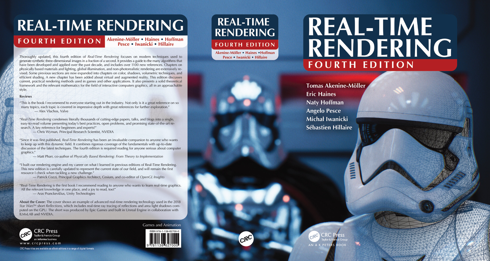
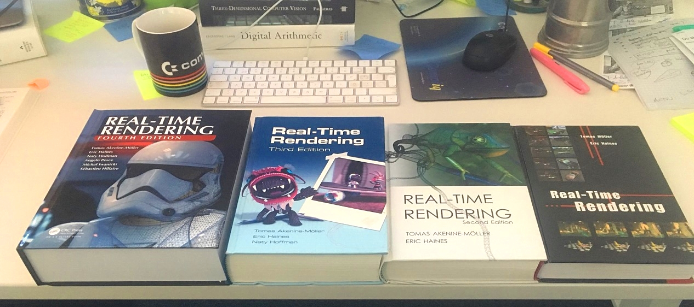
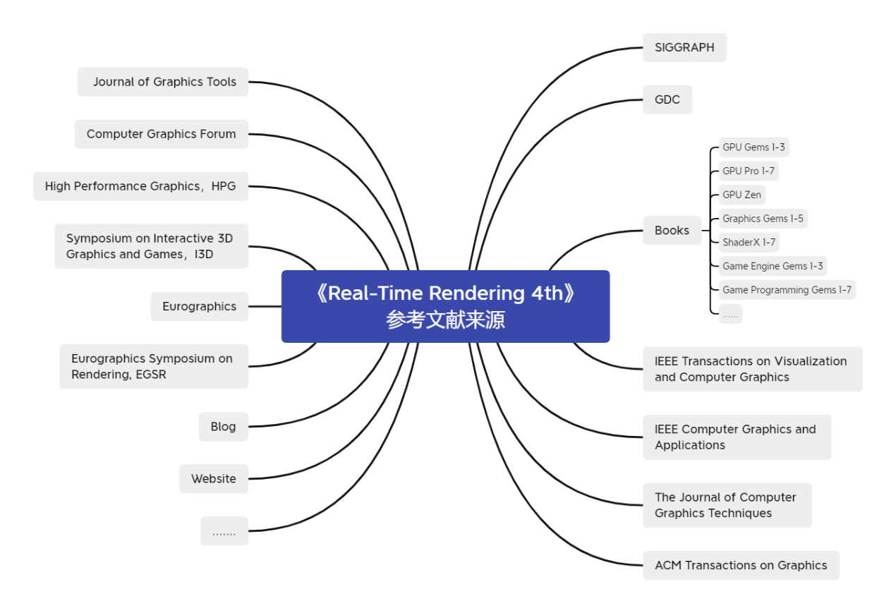
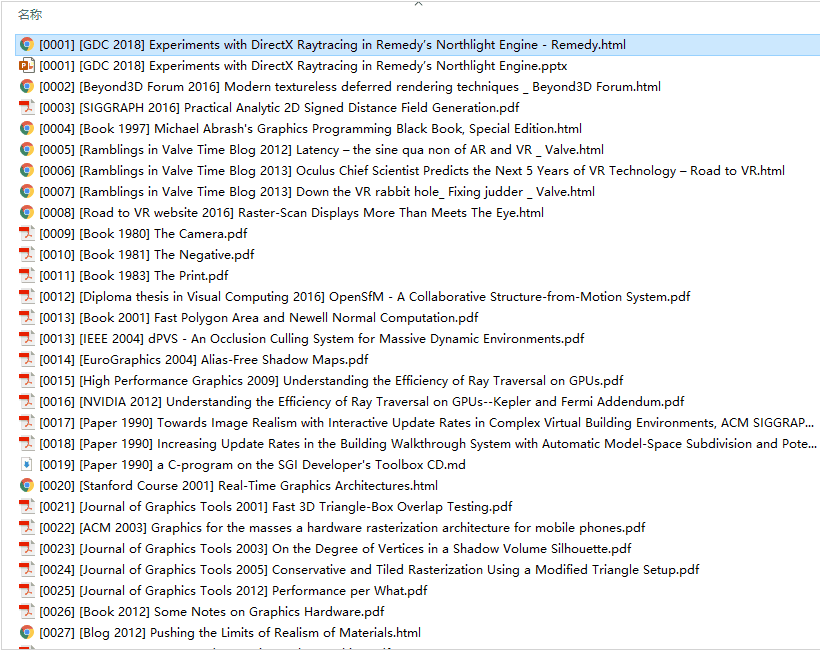
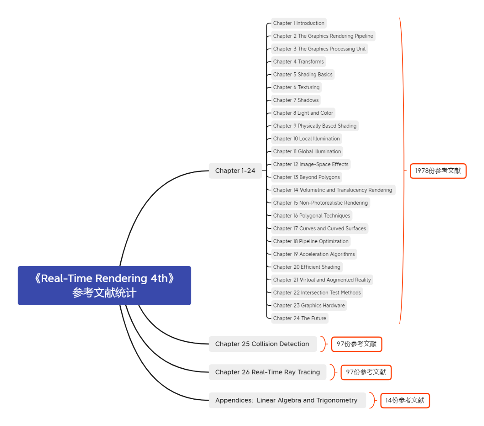
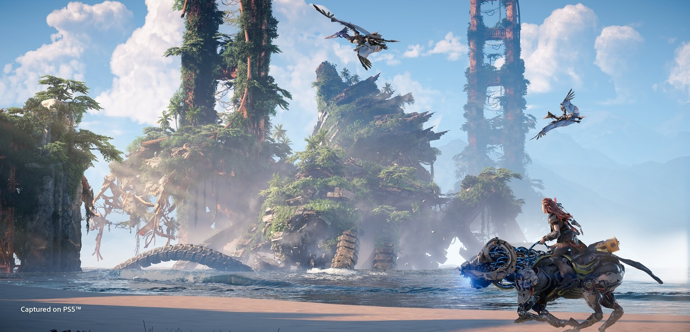

 

本文的知乎专栏版本：https://zhuanlan.zhihu.com/p/418196347

本文提供了图形学全网学习资料的“半壁江山”——《Real-Time Rendering 4th》2000多份参考文献合集的开源Github Repo地址，以及更新了RTR4中译版的预期出版时间。

 

# 引言

“在游戏开发、实时渲染以及计算机图形学领域，《Real-Time Rendering》系列书籍一直备受推崇。有人说，它是实时渲染的圣经。也有人说，它是绝世武功的目录。”

众所周知，《Real-Time Rendering》之所以是“绝世武功的目录”，除了其精炼、综述式的行文方式，百科大全般的知识体系广度之外，主要在于其引用的丰富而事无巨细的参考文献。这些包含了详细技术细节的参考文献，才是“绝世武功秘籍的本体”所在。

《Real-Time Rendering》系列全家福（图片来自RTR系列作者之一Tomas Akenine-Möller）

时间来到2018年，《Real-Time Rendering》系列的第四版《Real-Time Rendering 4th》的参考文献的数量已经超过了2000条之多。这些参考文献散落于互联网各地，如果你有查阅过RTR4官网上放出的参考文献的链接（Real-Time Rendering Bibliography - 4th Edition），你会发现其中有不少链接已经失效。如果没有做及时的备份，且对应的文献没有其他提供源，则这些文献会面临着永久失传的风险。

所幸，本人在阅读以及翻译《Real-Time Rendering 4th》期间，花了不少业余时间，几乎详细地完全收集整理了《Real-Time Rendering 4th》2000多条的参考文献，将不少已经失效绝版的参考文献，提前备份保存了下来，构成了具有收藏价值的“绝世武功秘籍的本体”—— RTR4 2000多篇参考文献的典藏合集。

这2000多篇文献与paper，包含了大量近年来SIGGRAPH，GDC等顶会与行业盛会的核心技术paper与技术分享材料，可谓是图形学全网学习资料的“半壁江山”。

孟子有云，“独乐乐不如众乐乐”。

在这篇文章中，本人将个人收集整理的《Real-Time Rendering 4th》2000多条参考文献，即大家熟知的游戏开发与图形学业界“绝世武功秘籍的本体”，以GitHub开源的形式分享给每一位热爱游戏开发与图形学的朋友们，助力大家更好的学习和研究图形学知识，也希望能对游戏开发与图形学业界的蓬勃发展有所帮助。

 

#  RTR4参考文献典藏合集下载

首先，直接放出“绝世武功秘籍的本体”, 《Real-Time Rendering 4th》参考文献合集典藏的Github Repo地址:

​github.com/QianMo/Real-Time-Rendering-4th-Bibliography-Collection

以及部分内容的预览：

这份RTR4参考文献典藏合集的特点：

几乎完全收集整理了RTR4 26章以及附录章节总计2000多项参考文献的全部内容。
其中收录了部分用常规方式无法获取的，几乎已经全网绝版的珍稀资料。
已包含《Real-Time Rendering 4th》所引用的部分IEEE，ACM Digital Library等付费文献库中的文献。
每条文献已按序号进行清晰地排序和分类，方便快捷地进行检索查阅。
每条文献都按照发表年份，以及发表的媒介对文件名进行标注，以方便快捷的辨识文献年份与参考价值。
已进行了较为完善的文件尺寸精简，将所有单个文件都控制于100M以内，方便更快地下载与本地存储。
已按照原书正文、补充章节第25章、补充章节第26章、附录四个主要部分进行文献的分类，便于查阅。
以下是《Real-Time Rendering 4th》参考文献典藏版的文件构成以及内容统计：

一些说明：

互联网的记忆有时十分短暂。随着时间的流逝，越来越多的资料的原始链接会失效。而这个Github Repo会作为一个图形学系列资料留存和备份的大本营。
还有极个别文献还未在此Github Repo中收录，也欢迎大家的Pull Request。
建议大家下载后离线查阅，当然，Github对pdf等文件也有在线预览功能，也可以方便地进行在线浏览。
RTR4的行文有一个非常地道的地方，那便是除了第1章和第24之外，每章都提供了“延伸阅读与参考资料 Further Reading and Resources”，如果你希望在某一细分领域专研得比RTR4的某章节正文所讲述的内容更加深入，那这些被重点提名的文献和书籍，将是绝佳的进阶学习材料。对此，此Github Repo也额外分章节专门收集整理了RTR4每章结尾的“延伸阅读与参考资料 Further Reading and Resources”中的书籍和文献，方便大家对RTR4每章的进阶内容进行更深入的学习与研究。具体可见链接：

https://github.com/QianMo/Real-Time-Rendering-4th-Bibliography-Collection/tree/main/Further%20Reading

这一节末尾，为方便大家阅读，这里再一次贴出《Real-Time Rendering 4th》参考文献合集典藏的Github Repo地址:

https://github.com/QianMo/Real-Time-Rendering-4th-Bibliography-Collection
​github.com/QianMo/Real-Time-Rendering-4th-Bibliography-Collection

以及对应的下载链接：

https://codeload.github.com/QianMo/Real-Time-Rendering-4th-Bibliography-Collection/zip/refs/heads/main

正如上文提到的，这2000多篇参考资料，可谓是图形学全网学习资料的“半壁江山”。希望这一Github开源版本的《Real-Time Rendering 4th》参考文献合集，能对游戏开发与图形学业界的蓬勃发展有所裨益。

 

# 关于RTR4中译版的出版时间的Update

在之前的文章《两件 Big Thing：天美跨平台3A大作全球招聘令 & RTR4中译版出版时间预告》中，有提到过，“如果没有特殊的不可抗因素，《Real-Time Rendering 4th》的中译版会在年底与大家正式见面”。

而目前而言，还真有一些不可抗因素的发生，所以《Real-Time Rendering 4th》中译版可能需要到明年上半年再与大家见面。

最后，同样是感谢大家对《Real-Time Rendering 4th》中译版的热爱与关注。接下来的时间，我们依然会继续努力，将《Real-Time Rendering 4th》中译版的翻译品质在时间与能力范围内做到尽善尽美。

以上。

图片来自 Horizon Forbidden West

 

# 招聘信息

对了，天美开放世界3A的全球热招依然在进行中，尤其是图形研发岗。
简历请发送至williammao#tencent.com

具体细节可见：
https://zhuanlan.zhihu.com/p/353527484

