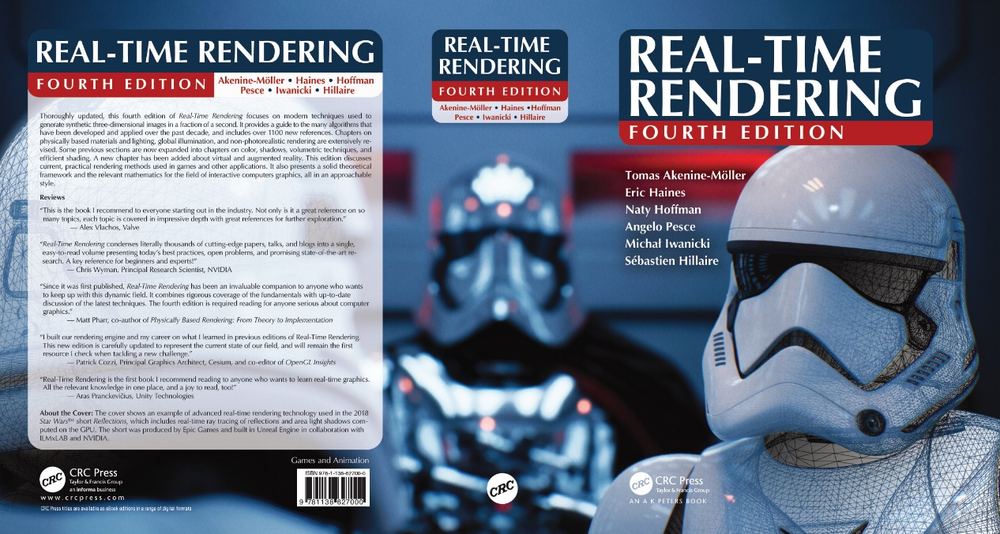

# 两件 Big Thing：天美跨平台3A大作全球招聘令 & RTR4中译版出版时间预告

本文的知乎专栏版本：https://zhuanlan.zhihu.com/p/353527484

 

题图来自电影《头号玩家》。

这篇文章由两件Big Thing组成：

-   天美战略级跨平台3A大作全球招聘令

-   《Real-Time Rendering 4th》中译版预计将在年内出版

 

# 第一件 Big Thing：天美战略级跨平台3A大作全球招聘令

是的，**天美工作室正在筹备3A主机游戏的研发**，而且是包括主机平台在内的跨平台战略级3A大作。

不妨先看看这款刚立项不久的产品的定位。

## 关于产品定位 

-   定位：天美战略级3A开放世界大作，包含射击在内的众多玩法元素

-   策略：多平台全球发行

    -   面向平台：Console/PC/移动端/下一代终端

-   架构：全球多地协同研发

    -   广纳全球范围内3A人才

-   引擎：Unreal Engine

    -   在充分挖掘Unreal Engine 5实力的同时，做引擎架构的进一步深度定制

-   画风：写实风格

 

对于这款产品，电影《头号玩家》中的绿洲（Oasis），是比较远期的对标方向。

图片来自电影《头号玩家》

图片来自电影《头号玩家》

 

## 关于薪酬待遇

薪酬体系的细节在这里没办法详细透露，但可以简单提几点：

-   天美工作室可能是全球范围内薪酬待遇最好的工作室之一。

-   在天美，成功的团队以及潜力巨大的团队会获得丰厚的回报。

-   天美的姚老板在年会上提到过，“只要好好工作，买房买车都只是生活琐事”，一直被我们所津津乐道。

-   如果你有过硬的综合实力，或许我们可以开出让你无法拒绝的薪酬待遇。

 

## 国产3A最好的时代可能已经来临

我们知道，在这之前，国内的3A游戏市场环境并不乐观，不受资本市场看好。很多怀揣3A大作开发梦想的同学，因为国内工作机会少、国外3A工作室的待遇一般等原因，被迫选择了其他工作岗位。

西游题材的国产3A《黑神话：悟空》的研发团队游戏科学可能就是一个极好的例子。在创业之初，他们为了团队能够生存下去，选择了开发手游，保持团队稳定的盈利能力。在解决团队温饱问题之后，我们才欣慰地看到了《黑神话：悟空》的问世。

图片来自《黑神话：悟空》

现在，走过十二周年的天美，也选择了包括主机平台在内的跨平台3A大作的研发。有大量岗位虚位以待，一次就能够为业界提供几百个3A大作的工作岗位。

这一次，我们不仅可以追寻自己内心的声音，从事心仪的3A大作的研发，而且能在实现人生理想的同时，获得丰厚的物质回报，让家人衣食无忧，过上幸福美满的生活。就像天美的姚老板所说的，“只要好好工作，买房买车都只是生活琐事”。

国内的3A大作的研发环境正在渐入佳境，这是值得我们游戏行业的每一位从业者开心的事情。也期待更多国内的团队能加入3A游戏的研发当中，一起促进中国游戏行业的蓬勃发展。

是的，国产3A最好的时代，可能已经来临。

 

### 关于列强雄踞的3A游戏领域 

在国际范围内，Console/PC端的原创3A大作基本上还处于被日韩欧美大厂所垄断的情形。最终幻想系列、上古卷轴系列、使命召唤系列、孤岛惊魂系列、战地系列、战争机器系列、GTA系列等大量的3A系列作品，无一不印证了这一点。

图片来自《使命召唤17：黑色行动 冷战》

而原创IP的国产游戏在Console/PC端还鲜有能与“欧美列强”抗衡的3A级产品。

天美的这款产品，剑指列强雄踞的Console/PC平台在内的诸多平台，将正面与日韩欧美列强交锋，希望能为国产3A在全球战场扳回一城，让世界对中国在3A游戏开发领域的实力刮目相看。

 

## 招聘岗位JD

这里贴一个我负责跟进的招聘岗位的JD，可以作为参考：

### 工作内容

-   负责图形渲染管线及具体特性的技术研发，和技术美术紧密合作，增强画面品质，分析并解决相关性能问题；

-   帮助Gameplay程序员、美术、策划规范有效地使用引擎相关功能；

-   跟进业界技术发展，预研前沿方案，争取在项目落地并产生实际价值。

### 任职要求

-   三年以上C/C++及游戏引擎研发经验，对游戏研发相关技术有较为全面的掌握并保持学习和关注；

-   扎实的算法和数学基础，系统的软件研发领域知识(计算机系统、OS、数据结构等)；

-   熟悉图形渲染理论及常用实现技术, 对GPU的架构和特性有比较深入的理解;

-   有UE4引擎实践经验，掌握相关技术实现原理者优先；

-   出色的学习和技术研究应用能力，良好的问题分析与解决能力；

-   责任心强，有较好的团队协作和任务跟进能力，善于沟通，使命必达；

-   热爱游戏，关注用户体验(包括策划/运营/美术等内部用户体验)，有Geek精神，懂得以螺旋上升的方式追求极致。

以上的任职要求只是一个样例。如果你在某方面能力特别突出，这里列出的所有要求都不重要。英雄不问出处，只看能力。

**有意愿的同学，简历请发送至：williammao#tencent.com (#替换城@)**。我会在看到简历的第一时间进行处理。HC虽多，但也有限，所以如果可以请尽快。

 

## 一些补充说明

-   我们十分欢迎有着日韩欧美3A大厂工作经历同学的加入。大家为国外3A产品工作多年，是时候回到祖国的怀抱，为国产3A贡献自己的薪火之力了。而且，如果你的能力符合岗位要求，我们应该能给出让你无法拒绝的薪酬待遇。：）

-   我们也十分欢迎想做出业界领先的产品，以及研发出引领游戏业界的技术成果，技术能力过硬或者拥有较好的数学基础，或在图形/通用引擎/物理/动画/AI/PCG等方向有深厚积累的同学的加入。

-   社招/校招/实习生均可。只要你有过硬的技术实力，英雄不问出处。

-   我们也会在全球范围内招聘大量日韩欧美等国籍，拥有3A大厂工作经历的员工，实施全球多地协同开发。如果你希望与这些全球范围内的顶尖人才共事，相互学习进步，我们也十分欢迎你的加入。

-   这款天美跨平台3A作为全球多地协作研发的产品，工作地点包括了国内（深圳、上海等）与海外多地。入职深圳腾讯天美总部自然是最佳的选择。这样我们就能够面对面，一起携手完成这款产品。而且理论上在深圳总部的待遇也会更优。

-   **招聘不限于引擎技术岗位，程序方向的GamePlay、系统开发等所有岗位，TA/策划/美术等3A大作必备的职能体系，都有大量岗位虚位以待。**简历请发送至邮箱williammao#tencent.com (#替换城@)。如果不是我负责跟进的岗位方向，也会第一时间推送给负责相关方向的同学**。**

-   当然，已经在鹅厂的小伙伴们如果有兴趣一起做国产3A大作，正面与日韩欧美列强交锋，我们也十分欢迎你的活水。具体可以内部通过企业微信联系到我。

- **本文的招聘信息长期有效。**

-   大家如果觉得用邮件发简历的形式太正式，也可以先通过在这篇文章的评论、或者知乎私信的方式做相关咨询和了解。

-   如果有什么疑问，也欢迎大家在评论区留言，一起讨论。

 

## 结语

就像歌手Bob Dylan所写，《黑神话：悟空》团队也引用过的歌词所说的：

“曾经我如此苍老，如今才风华正茂。”

加入我们一起做国产3A，或许正是风华正茂的开始。

期待着这一天，我们一起研发出的产品能取得世界范围内的巨大成功，获得Console/PC/移动端/下一代终端在内所有平台全球玩家的认可，让曾经3A游戏界的日韩欧美列强们，都能对中国在3A领域的实力刮目相看。

也期待着这一天，我们可以一起出席SIGGRAPH，GDC等技术盛会，共同将研发出的先进游戏开发技术分享给全世界，重塑游戏行业的技术格局，为中国游戏行业在世界范围内的技术影响力添砖加瓦。

希望这一天，能够早日到来。

 

# 第二件Big Thing：RTR4中译版将在年内出版

《Real-Time Rendering 4th》，豆瓣评分9.6，作为游戏开发和实时渲染领域的圣经级别的存在，相信很多同学都明白这本书之于高品质游戏开发的意义，也期望这本著作的中文版能早日出版，能为国内游戏开发领域提供宝贵的中文版进阶资料。

距《Real-Time Rendering 4th》英文原版出版时间2018年8月6日，已经过去了两年半，至今都没有中文版出版的确切消息。究其原因，其实是因为《Real-Time Rendering 4th》中文版的翻译权，曾经被默默“雪藏“了近两年。

2020年6月5日，《Real-Time Rendering 4th》中译版的责任编辑、清华大学出版社的文老师浏览到了我在知乎问题“如何评价《Real–time Rendering》第四版?”（<https://www.zhihu.com/question/290566100/answer/471199400>）下的回答。随后，我收到了文老师的知乎私信，她希望我能接手RTR4的翻译工作，并在一年左右的时间内完成，尽力挽回这两年时间的损失。收到文老师的私信时，出于对《Real-Time Rendering》系列书籍本身的热爱，我还来不及仔细思考，就接受了文老师的邀约。

读过《Real-Time Rendering 4th》的同学都应该知道，这本书旁征博引，信息量密集，需要海量的知识储备才能顺利完成阅读，要达到较高的翻译质量，难度可谓十分之高。而加之全书多达1000多页体量的巨大翻译工作量，一年之内难以一个人完成。所以，文老师随后还邀请到了另外两位小伙伴，并以我作为带头人，三人合力完成本书主体的翻译工作。

正式签订翻译合同之后，接下来就是工作之余夜以继日，争分夺秒地进行这本书的翻译工作。为了保证每天的翻译进度，在工作日晚上回家之后，我常常会翻译到凌晨1点半，每天晚上只能保证5个半小时的睡眠时间。

这大概是我出生以来，最夜以继日的一段时间，可能更甚于当年高三的备考冲刺阶段。2021年春节期间也几乎无休，每天都在电脑前起早贪黑地完成这天的翻译计划。这也是为什么本专栏已经8个月没有新增文章的原因。

比较令人欣慰的是，截止这篇文章发表的2021年2月28日，《Real-Time Rendering 4th》中译版的主体部分的全部26章（包括纸质版没有收录的第25章碰撞检测（Collision Detection），以及第26章实时光线追踪（Real-Time Ray Tracing）），共1129页的正文内容，已经完成了全书的初稿翻译工作，并已经完成了两轮的Refine，目前按计划正常处于全书的第三轮Refine阶段。

如果没有特殊的不可抗因素，《Real-Time Rendering 4th》的中译版会在年底与大家正式见面。

更多细节暂时可能还不方便透露。后续有进一步消息会及时与大家分享。大家如果有想知道的细节，也可以在本文评论区下方留言。

最后，感谢大家对《Real-Time Rendering 4th》中译版的热爱与关注。我们会继续努力，将《Real-Time Rendering 4th》中译版的翻译品质在时间与能力范围内做到尽善尽美。希望这本书的出版，能为国内的游戏行业与实时渲染领域的进步献上绵薄之力。

 

# 尾声

OK，两件Big Thing说完了。还是回到最初的话题，天美战略级跨平台3A大作的全球招聘已经正式拉开序幕，所有3A大作必备的职能体系，都有大量岗位虚位以待，欢迎各位人才的加入。简历请发送至邮箱williammao#tencent.com (#替换城@)。

文章末尾，再引用一次歌手Bob Dylan所写，《黑神话：悟空》团队也引用过的歌词吧：

“曾经我如此苍老，如今才风华正茂。”

是的，加入我们，一起做国产3A，或许正是风华正茂的开始。

