# 真实感水体渲染技术总结


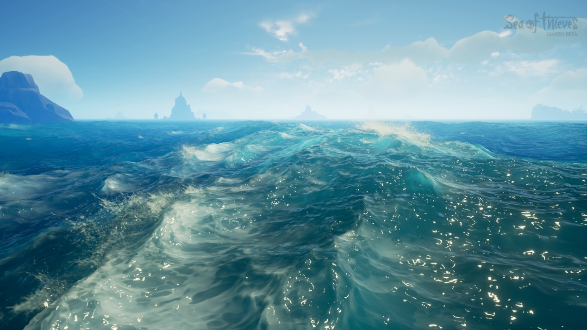


本文的知乎专栏版本：https://zhuanlan.zhihu.com/p/95917609

之前在【GPU精粹与Shader编程】系列中写过一篇[《真实感皮肤渲染技术总结》](media/https://zhuanlan.zhihu.com/p/42433792)，这篇文章则是它的番外篇，主要关注于真实感水体渲染技术。

本文将对游戏开发以及电影业界的真实感水体渲染技术从发展史、知识体系、波形模拟技术以及着色技术等多个方面进行较为系统的总结，文末也对业界优秀的水体实时渲染开源库进行了盘点。


<br>

# 一、总览：水体渲染技术发展史


真实感水体的渲染和模拟，一直是计算机图形学和游戏开发领域的核心难点之一。而在水体渲染中，最核心的部分为波形的渲染技术，即如何模拟出逼真的水面波浪的流动变化。按时间分布，近50年水体波形渲染的主流技术发展可以总结列举如下：

1.  凹凸纹理贴图（Bump Mapping） [Schachters 1980]

2.  正弦波（Sinusoids Wave）[Max 1981]

3.  分形噪声（Fractal noise）[Perlin 1985]

4.  Gerstner 波（Gerstner Wave）[Fournier 1986]

5.  快速傅立叶变换（Fast Fourier Transform）[Mastin 1987]

6.  欧拉方法（Eulerian approaches）[Kass 1990]

7.  拉格朗日方法（Lagrangian approaches）[Stam 1995]

8.  欧拉-拉格朗日混合方法（Hybrid approaches）[Brien 1995]

9.  分形布朗运动（Fractal Brownian Motion，FBM）[Addison 1996]

10. 程序化形状（Procedural Shape）[Ebert 1999]

11. 空间-频谱混合方法（Spatial -Spectral Approaches） [Thon 2000]

12. 基于体素的方法（Voxel-Based NSE Solutions） [Yann 2003]

13. 顶点高度位移贴图（Vertex Height Map Displacement）[Yuri 2005]

14. 二维波动方程（2D Wave Equation）[Nishidate 2005]

15. 屏幕空间网格（Screen Space Mesh）[Muller 2007]

16. 波动粒子（Wave Particles）[Yuksel 2007]

17. 矢量位移贴图(Vector Displacement Map) [2009]

18. 流型图（Flow Map）[Vlachos 2010]

19. 离线FFT贴图烘焙（Offline FFT Texture）[Torres 2012]

20. 离线流体帧动画烘焙（bake to flipbook）[Bowles 2017]

21. 水波小包方法（Water Wave Packets）[Jeschke 2017]

22. 水面小波方法（（Water Surface Wavelets）[Jeschke 2018]

23. 浅水波浪模拟（Water Wave Simulation）[Grenier 2018]

需要注意的是，上面列出的时间点，可能并不是严格意义上的该技术提出的时间点，而是该技术在论文或会议上被提出，被大众熟知，被引入到水体渲染技术中的时间点。

接下来，先看一些近年游戏中的真实感水体渲染画面，然后对这里列出的水体主流渲染技术中的主要方法，按流派和内容分别进行总结。

<br>


# 二、近年游戏业界的真实感水体的渲染画面


首先是《神秘海域4》中清澈的海岛浅滩：

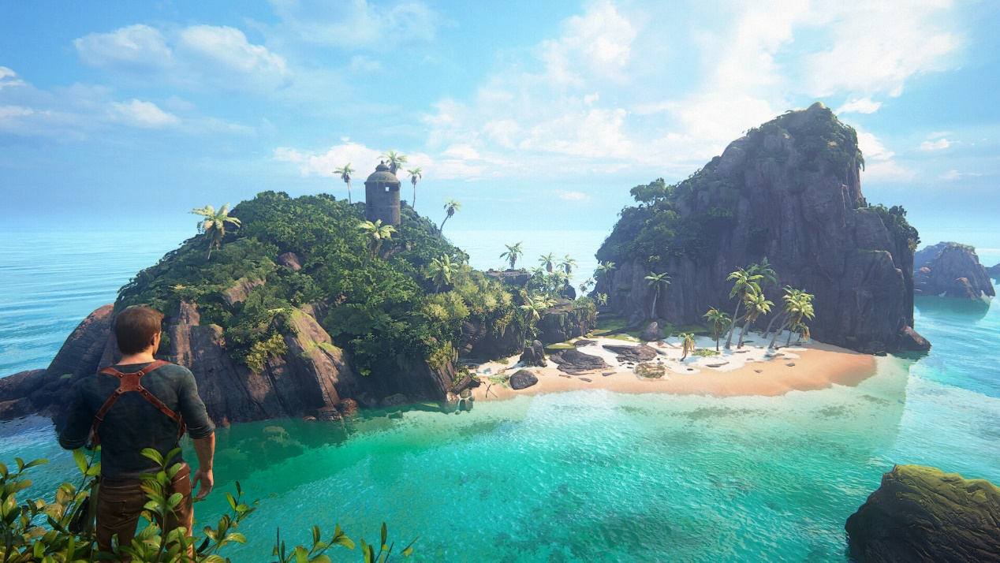

然后是《盗贼之海》中波涛汹涌的海洋：


接着是《孤岛惊魂5》中阴天的池塘：

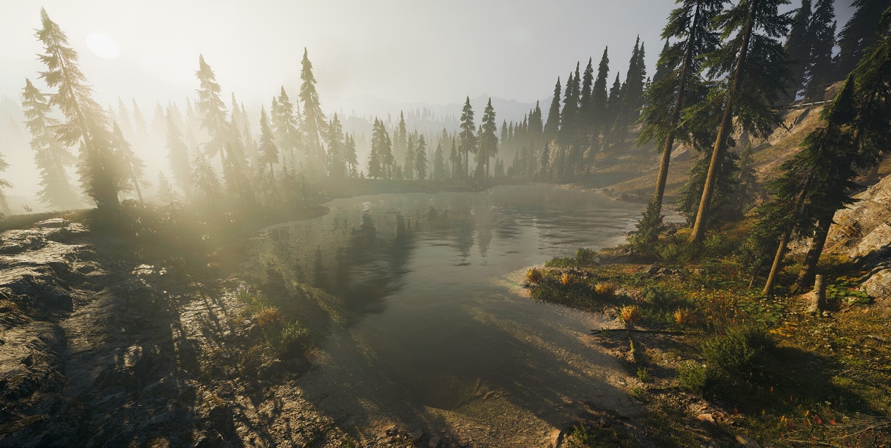

还有《战神4》中深邃的海面：

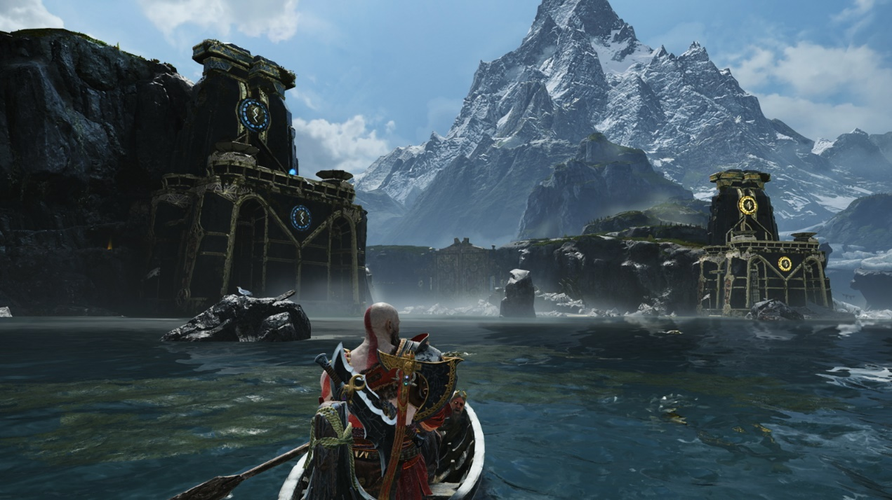

以及《刺客信条：奥德赛》中平静的海滩：

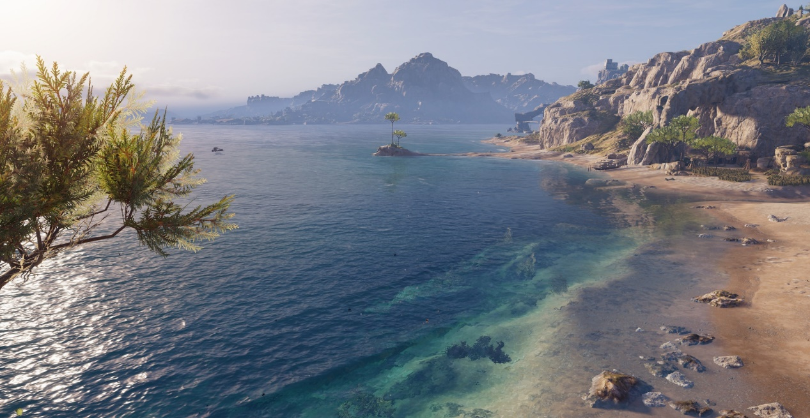

这边也放一个继承了《刺客信条》系列水体渲染技术的《怒海战记（Skull & Bones）》的gameplay视频：

<https://youtu.be/fCgYA65tAYY?t=125>

要实现如上3A游戏级别的水体渲染，其实是有章可循的，对应的核心方法在本文以及下面的这张思维导图中都有进行总结。


<br>

# 三、水体渲染的知识体系思维导图


本文配套的水体渲染的知识体系思维导图如下：

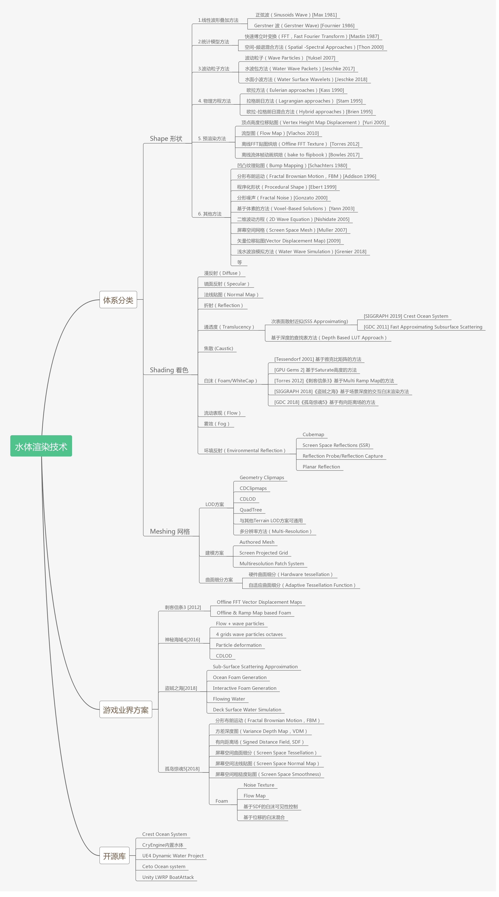

OK，下面开始正文。


<br>

# 四、水体渲染的波形模拟技术


按照流派进行分类，可将上文总结的水体渲染波形模拟的二十三种方法分为如下几类：

**1.线性波形叠加方法**

1. 正弦波（Sinusoids Wave）[Max 1981]

2.  Gerstner 波 （Gerstner Wave） [Fournier 1986]

**2.统计模型方法**

1.  快速傅立叶变换（Fast Fourier Transform）[Mastin 1987]

2.  空间-频谱混合方法（Spatial -Spectral Approaches）[Thon 2000]

**3.波动粒子方法**

1.  波动粒子方法（（Wave Particles） [Yuksel 2007]

2.  水波小包方法（Water Wave Packets）[Jeschke 2017]

3.  水面小波方法（Water Surface Wavelets）[Jeschke 2018]

**4. 基于物理的方法**

1.  欧拉方法（Eulerian approaches）[Kass 1990]

2.  拉格朗日方法（Lagrangian approaches） [Stam 1995]

3.  欧拉-拉格朗日混合方法（Hybrid approaches）[Brien 1995]

**5.预渲染方法**

1.  顶点高度位移贴图（Vertex Height Map Displacement） [Yuri 2005]

2.  流型图（Flow Map）[Vlachos 2010]

3.  离线FFT贴图烘焙（Offline FFT Texture） [Torres 2012]

4.  离线流体帧动画烘焙（bake to flipbook）[Bowles 2017]

**6.其他方法**

1.  凹凸纹理贴图（Bump Mapping）[Schachters 1980]

2.  分形噪声（Fractal Noise）[Perlin 1985]

3.  分形布朗运动（Fractal Brownian Motion，FBM）[Addison 1996]

4.  程序化形状（Procedural Shape）[Ebert 1999]

5.  基于体素的方法（Voxel-Based Solutions） [Yann 2003]

6.  二维波动方程（2D Wave Equation）[Nishidate 2005]

7.  屏幕空间网格（Screen Space Mesh）[Muller 2007]

8.  浅水波浪模拟（Water Wave Simulation）[Grenier 2018]

<br>

下面将对其中比较常见的方案进行盘点。

<br>

## 4.1 线性波形叠加方法


线性波形叠加方法的主要思路是累加不同的线性波形函数以构造波浪表面。可以将其理解为波动现象在深水中引起水颗粒运动的一种解析解。

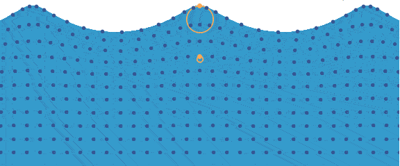

图 水颗粒运动的图示。波浪中的任何点都沿圆形轨迹移动，靠近表面的半径较大，而在水中更深的半径呈指数减小。突出显示了两个橙色点，可以发现他们的运动轨迹都是圆形。（图片来自<https://wikischool.org/divided_light>）

业界主流的波形函数主要分为正弦波（Sinusoids Wave）和Gerstner波(Gerstner Wave)两种，下面分别进行说明。

<br>

### 4.1.1 正弦波（Sinusoids Wave）[Max 1981]

作为比较早期的水面波形模拟方案，正弦波（Sinusoids Wave）的特点是平滑，圆润，适合表达如池塘一样平静的水面。


图 Unity下实现的基于正弦波（Sinusoids Wave）的水体

1981年，Max[Max 1981]首先提出了采用高低振幅的正弦波曲线的序列组合来模拟水面起伏的想法。将水体表面采用高度进行建模，则基于正弦波（Sinusoids Wave）的方法在时间t的每个点（x，z）上计算的高度y = h（x，z，t）的通用公式为：

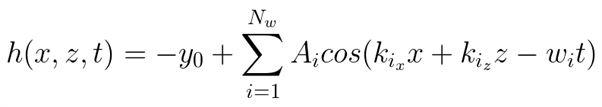

-   其中Nw是波的总数

-   Ai是第i个波的振幅 

-  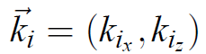是波矢量

- 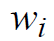 是其脉冲值（pulsation）

-   y0是自由表面的高度

正弦波（Sinusoids Wave）目前在水体渲染领域已经很少直接使用，业界往往青睐于使用它的进化版Gerstner波。

<br>

### 4.1.2 Gerstner 波（Gerstner Wave） [Fournier 1986]

作为正弦波的进化版，Gerstner 波（Gerstner Wave）的特点是波峰尖锐，波谷宽阔，适合模拟海洋等较粗犷的水面。


图 Unity下实现的基于Gerstner波的水体

Gerstner 波(Gerstner Wave)也常被称为Trochoidal Wave，在流体动力学中，其为周期表面重力波（periodic surface gravity waves）的欧拉方程的精确解，由Gerstner在1802 年初次发现，并在1863年由Ranine独立重新发现。在1986年由Fournier等人引入水体渲染领域。


图 Gerstner Waves波形

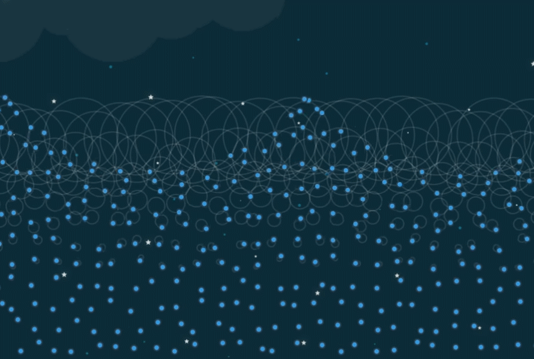

图 Gerstner Waves水颗粒的运动轨迹为圆形

选择一组波矢量ki，振幅Ai，频率ωi和相位φi，对于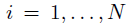，Gerstner Waves的通用公式为：

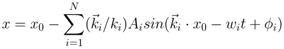


Gerstner Waves由于计算量可控，性价比高，在游戏水体渲染领域的应用较为广泛。不少3A游戏了采用Gerstner Wave作为水体渲染的基础实现。如下文Wave Particles部分也会提到的《神秘海域3》，即是采用了Gerstner Wave + Wave Particles的水体渲染方案组合。

<br>

## 4.2 统计模型方法

<br>

### 4.2.1 快速傅立叶变换（Fast Fourier Transform , FFT）[Mastin 1987]

作为目前电影业界广泛采用的海洋表面渲染解决方案，基于快速傅立叶变换（Fast Fourier Transform , FFT）的水体渲染方法的特点是真实感出色，全局可控，细节丰富，但计算量相对较大。

自1986年[Mastin 1987]将基于FFT的水体渲染方法引入水体渲染领域，以及2001年Tessendorf著名的水体总结文章《Simulating Ocean Water》[Tessendorf 2001]对其的推广之后，至今其仍然是电影工业模拟海洋表面的标准解决方案。


图 Unity下实现的基于FFT的水体


傅里叶变换（Fourier transform）是一种线性积分变换，用于信号在时域和频域之间的变换。而快速傅里叶变换 （Fast Fourier Transform，FFT）, 是一种可在O（nlogn）时间内完成离散傅里叶变换（Discrete Fourier transform，DFT）的高效、快速计算方法集的统称。最初的快速傅里叶变换方法早在1805年就已由高斯推导出来，并于1965年由Cooley和Tukey重新提出，并渐渐被大众所熟知。从此，对快速傅里叶变换（FFT）算法的研究便不断深入，数字信号处理这门新兴学科也随FFT的出现和发展而迅速发展。根据对序列分解与选取方法的不同而产生了FFT的多种算法。

FFT的基本思想是把原始的N点序列，依次分解成一系列的短序列。充分利用DFT计算式中指数因子 所具有的对称性质和周期性质，进而求出这些短序列相应的DFT并进行适当组合，达到删除重复计算，减少乘法运算和简化结构的目的。

关于FFT的算法细节这里就不展开讲了，放两张经典的总结图：
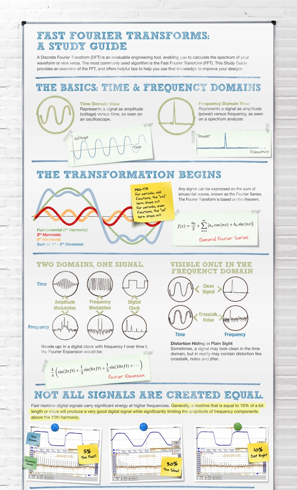

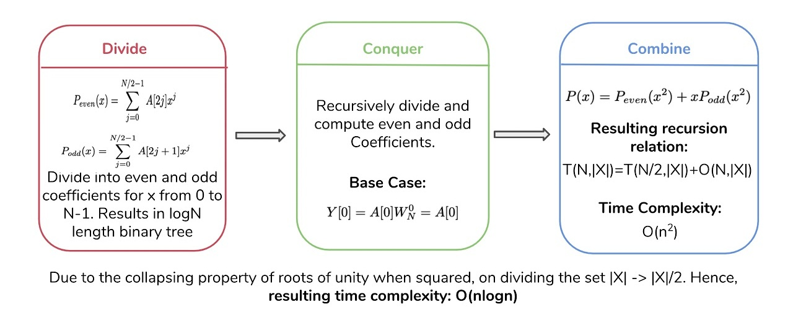

基于FFT的水体渲染方法，也常被各类文献称为基于频谱（spectrum-based）的方法，其核心思想是基于FFT构造出水体的表面高度。具体而言，该方法使用从理论或测量统计数据获得的海浪频谱（最常见的频谱为[Tessendorf 2001]使用的Phillips频谱）来描述海洋表面，结合大量的正弦波的叠加在频域中生成波型的分布，然后执行逆FFT，将数据转到空间域，经过运算生成位移贴图（displacement map）。最终，由位移贴图导出表面法线贴图，以及其他相关数据，如代表白沫区域的Folding Map。

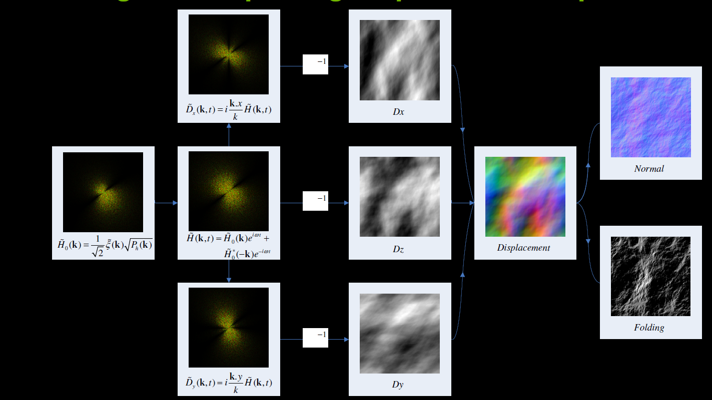

图 基于FFT的水体渲染流程 [NVIDIA 2004]


采用FFT的水体渲染方法从90年代开始广泛用于电影制作（离线渲染），从2000年代开始广泛用于游戏（实时渲染）。离线渲染和实时渲染的选择，主要在于当时硬件计算能力可以承受多少分辨率的高度图的实时运算。早期的游戏，如Crysis，由于硬件计算量的限制，采用了64 x 64的高度图分辨率。而由于硬件的发展，目前512 x 512的分辨率的计算量已经在实时渲染中较为普遍。而电影工业中采用FFT生成的高度图，由于可以采用离线渲染，以及品质的要求，分辨率一般较大，如早在1997年的《泰坦尼克号》的海洋渲染的渲染，就已经采用了2048 x 2048分辨率的高度图。

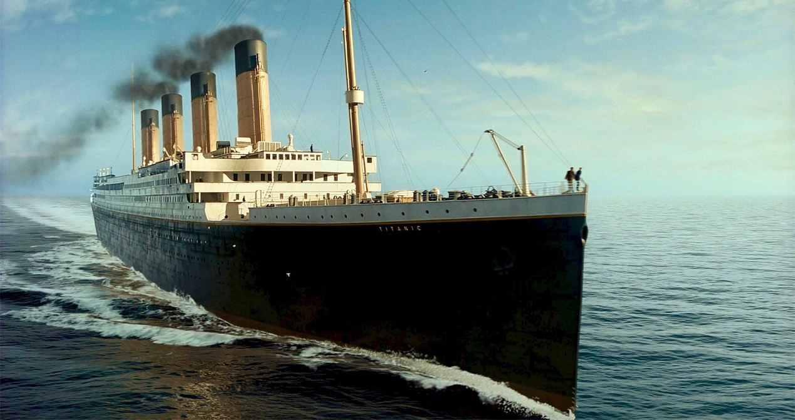

图 著名电影《泰坦尼克号》中，基于FFT方法离线渲染的海洋，采用2048 x 2048分辨率的高度图

<br>

## 4.3 波动粒子方法

<br>

### 4.3.1 波动粒子（Wave Particle） [2007]

波动粒子（Wave Particle）方法最初由Yuksel于2007年[Yuksel 2007]提出，该方法的核心思想是采用粒子代表每一个水波，并允许波反射以及与动态对象的相互作用。这种方法将动态模拟三维水波的复杂度降维到模拟在平面上运动的粒子系统的级别。

波动粒子（Wave Particle）方法结合了线性叠加方法的灵活性和基于FFT方法的稳定性和视觉细节，其可控制性和性能，以及出色的交互表现，是模拟实时水体交互的不错方案。


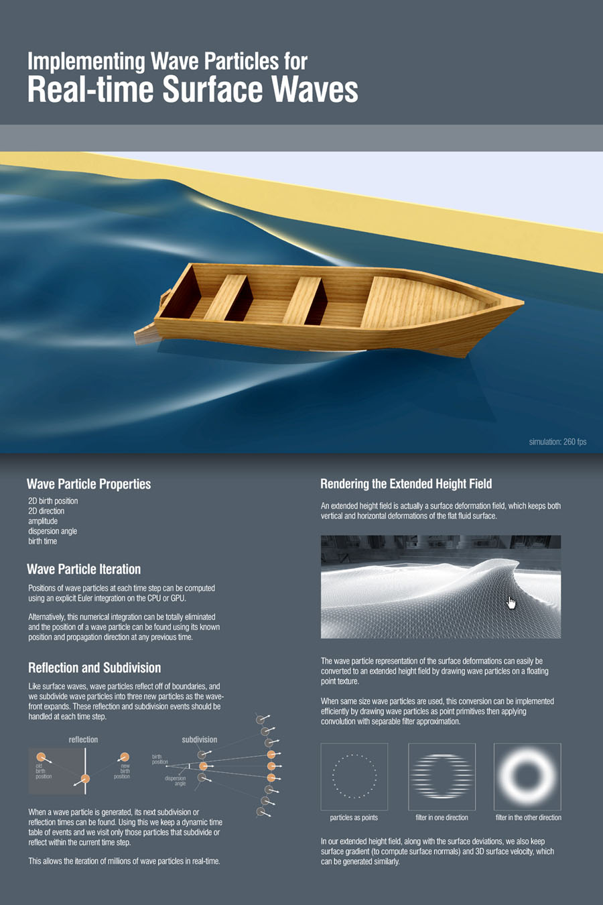

图 Wave Particle （图片来自[Yuksel 2007]）

需要注意的是，波动粒子（Wave particles）的作用不只是代表波浪的位置。它们还可以带有描述其形状和行为的其他属性，例如振幅（amplitude）和半径（radius）。

当相邻波动粒子之间的距离大于半径的一半时，该方法会将一个波动粒子转换为三个新的波动粒子。新的波动粒子直接从现有波动粒子中吸收能量（即振幅）。从而减小了现有波动粒子的振幅，而整体波峰的总振幅保持不变。三个子粒子的振幅和扩散角度变为父粒子的三分之一，而新粒子的半径与父波动粒子保持相同。如下图所示。

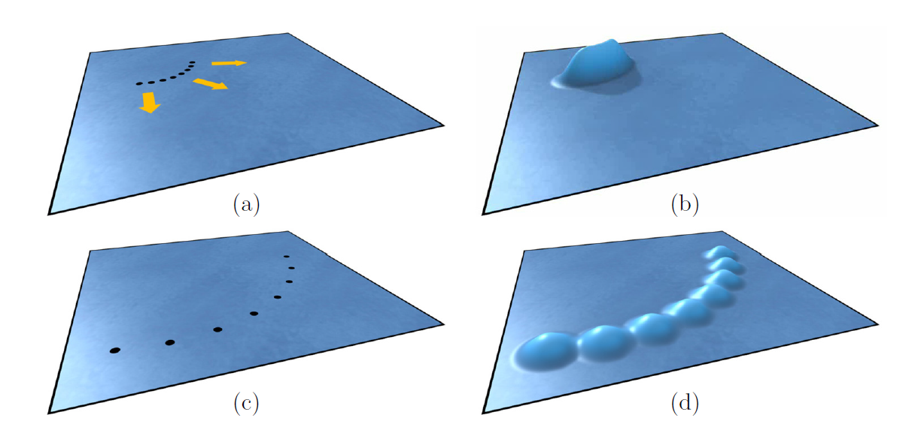

图 （a）和（b）分别是波动粒子的初始位置和它们形成的波峰（c）和（d）是波粒经过一定距离后的位置和波动粒子形状（图片来自[Yuksel 2010]）

因为在波动粒子系统中，假设每个波动粒子在两侧都具有两个相同的相邻粒子，所以当一个波动粒子细分时，其会在两侧产生两个新的波动粒子，如下图所示。

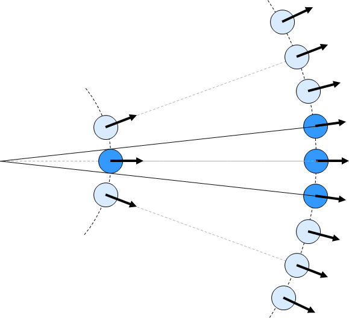

图 具有相同扩散角度的两个相邻波动粒子之间的距离（图片来自[Yuksel 2010]）

另外，Wave Particles方法还可以与现有各种方案进行结合和改进。

2007年Yuksel提出的原版Wave Particles的波动粒子的生成源来自点状的粒子波源。对此，《神秘海域3》对其进行了改进方案。在《神秘海域3》中，并没有使用点状粒子波源，而是在环形区域中放置随机分布的粒子源，以近似开放水域的混沌运动，从而产生一个可平铺的向量位移场（vector displacement field）。


图 《神秘海域3》中基于随机分布wave particles粒子源的波浪模拟方法


《神秘海域4》中则采用了多分辨率Wave Particles方案，从另一个角度对Wave Particles方法进行了改进。

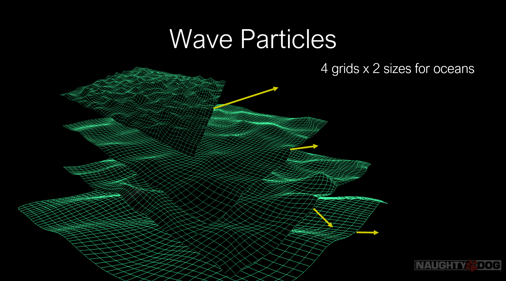

图 《神秘海域4》中的多分辨率wave particles

<br>

### 4.3.2 水波小包方法（Water Wave Packets）[SIGGRAPH 2017]

在波动粒子（Wave Particles）的基础上， Jeschke和Wojtan[2017]于SIGGRAPH 2017引入了以理论群速度（theoretical group speed）传播的水波小包（Water wave packets ）方法。该方法继承了基于频谱的方法的优点，如数值稳定性和理论上准确的波速。同时，他们通过将全局余弦波分解成一系列更短的波分量，从而避免了基于频谱的方法的复杂性。


图 水波小包方法（Water Wave Packets）的paper demo [SIGGRPAPH 2017]

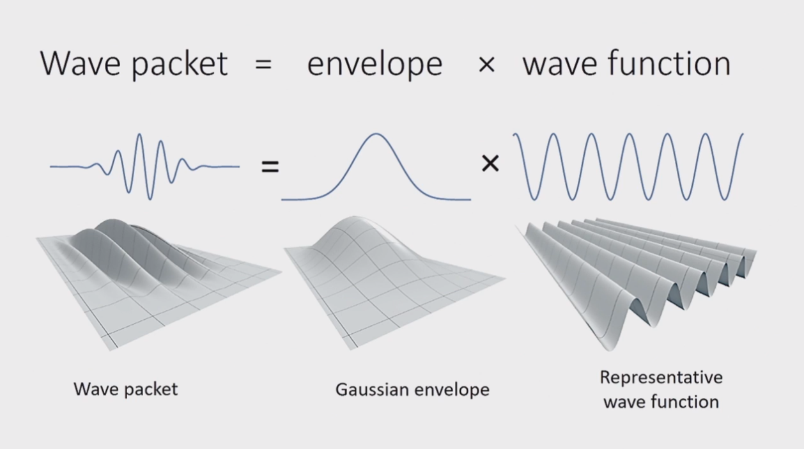

图 水波小包方法（Water Wave Packets）的原理图示


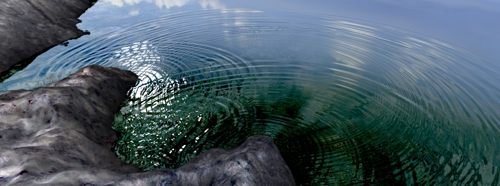
图 水波小包方法（Water Wave Packets）渲染效果图

<br>

### 4.3.3 水面小波方法（Water Surface Wavelets） [SIGGRAPH 2018]

随后的[SIGGRAPH 2018]，Jeschke等人对Water Wave Packets进行了改进，提出了新的水面小波方法（Water Surface Wavelets）。水面小波方法（Water Surface Wavelets）基于欧拉方法，自由度与空间区域有关，与波动本身无关。因此，该方法可以和GPU更好的结合，因为计算复杂度是恒定的，因为不随粒子的数量而变化。不过该方法由于提出时间较新，性能也没有太大优势，所以目前还没有听说有实际的实时渲染项目在使用。


图 Water Surface Wavelets paper Demo [SIGGRPAPH 2018]


图 水面小波方法（Water Surface Wavelets）渲染效果图 [SIGGRPAPH 2018]


<br>

# 4.4 基于物理的方法


基于物理的水体模拟方法一般比较昂贵，由于可以离线渲染，所以在电影工业中具有很好的运用。由于现阶段很难用于实时渲染，这边仅进行一个综述性的总结。

基于物理模型的水体模拟方法的核心是对Navier-Stokes方程（Navier-Stokes Equations,NS方程）进行求解。Navier-Stokes方程是一组描述液体和空气之类的流体物质的方程，描述作用于液体任意给定区域的力的动态平衡。除了水体模拟之外，其还可以用于模拟天气，水流，气流，恒星的运动。

Navier-Stokes方程如下：

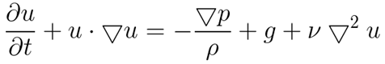

-   u为流体速度矢量（fluid velocity vector）

-   p为流体压力（fluid pressure）

-   ρ为流体密度（fluid density）

-   ν为运动粘度系数（kinematic viscosity coefficient）

-   ∇为梯度微分（gradient differential）

-   ∇2为拉普拉斯算子（Laplacian operators）

常用的求解NS 方程的方法有欧拉方法（Eularian Method）和拉格朗日方法（Lagrangian Method）两种：

-   欧拉方法（Eularian Method）是一种基于网格的方法。它从研究流体所占据的空间中各个固定点处的运动着手，分析被运动流体所充满的空间中每一个固定点上流体的速度、压强、密度等参数随时间的变化，以及由某一空间点转到另一空间点时这些参数的变化。

-   拉格朗日方法（Lagrangian Method）是一种基于粒子的方法。它从分析流体各个微粒的运动着手，即研究流体中某一指定微粒的速度、压强、密度等参数随时间的变化，以及研究由一个流体微粒转到其他流体微粒时参数的变化，以此来研究整个流体的运动。最常用的拉格朗日方法是光滑粒子流体力学(Smoothed Particle Hydrodynamics，SPH)方法，其核心渲染思想为流体模拟产生粒子，然后多边形化粒子以产生波。


图 基于SPH方法的水体渲染表现


图 Houdini下的流体模拟 

除了独立的两种方法之外，还有结合两者的欧拉-拉格朗日混合方法（Eularian-Lagrangian Hybrid approaches），其主要思想是使用欧拉方法来模拟流体的主体，并使用拉格朗日方法来模拟诸如泡沫，喷雾或气泡之类的细小细节。

FX Guide上有一篇关于电影业界使用流体模拟方法的不错文章，感兴趣的朋友可以了解一下：https://www.fxguide.com/fxfeatured/the-science-of-fluid-sims/

另外，也可以采用bake to flipbook方法，将离线的流体模拟，烘焙成flipbook帧动画，用于实时渲染。

<br>

## 4.5 预渲染方法


### 4.5.1 流型图（Flow Map）

流型图（Flow Map），也常被称为矢量场图（Vector Field Map），本质上是一种基于矢量场平移法线贴图的着色技术，或者可以理解为一种UV动画，由VALVE的Vlachos在SIGGRAPH 2010上的talk《Water Flow in Portal 2》被大众所熟知。值得一提的是，VALVE在2010年就超前地使用了Houdini来制作flow map。

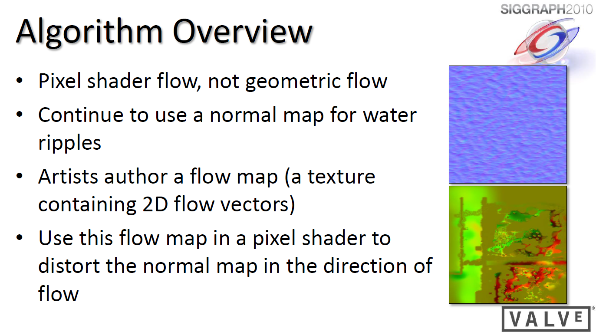
图 原版Flow Map的算法原理[SIGGRAPH 2010]

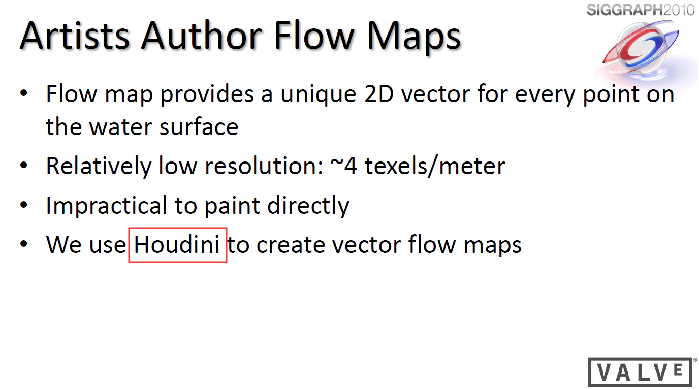
图 基于Houdini的Flow Map创作工作流[SIGGRAPH 2010]

Flow Map除了用于水体的渲染以外，任何和流动相关的效果都可以采用Flow Map，如沙流，以及云的运动等效果。


图 基于Flow Map的水体渲染 @Unity


图 基于Flow Map的水体渲染 @UDK

Flow Map的核心思想是预烘焙2D方向信息到纹理，以在运行时基于UV采样，对流动感进行模拟。


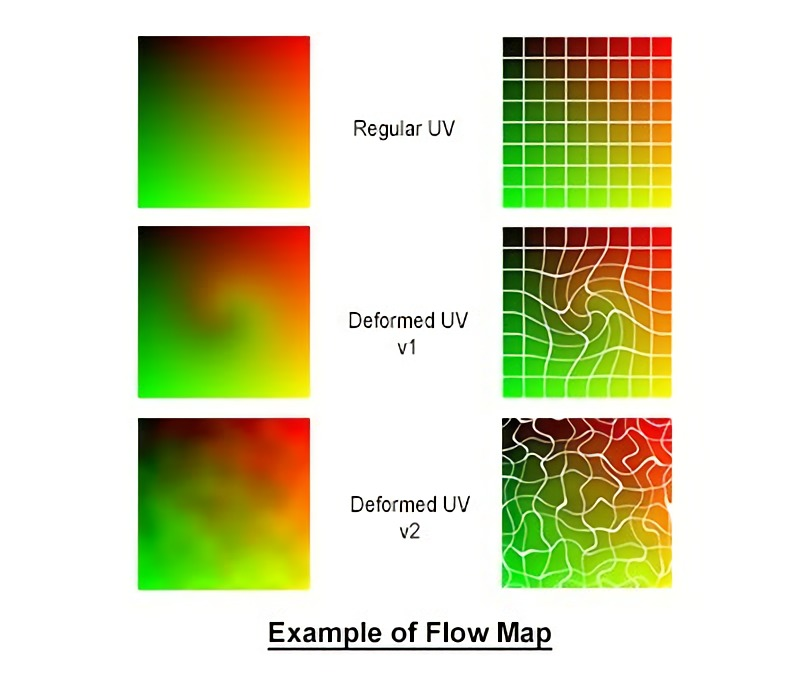
图 基于Flow Map的形变

Flow Map的典型使用代码如下所示：
```
//get and uncompress the flow vector for this pixel
float2 flowmap = tex2D( FlowMapS, tex0 ).rg * 2.0f - 1.0f;
float cycleOffset = tex2D( NoiseMapS, tex0 ).r;
float phase0 = cycleOffset * .5f + FlowMapOffset0;
float phase1 = cycleOffset * .5f + FlowMapOffset1;

// Sample normal map.
float3 normalT0 = tex2D(WaveMapS0, ( tex0 * TexScale ) + flowmap * phase0 );
float3 normalT1 = tex2D(WaveMapS1, ( tex0 * TexScale ) + flowmap * phase1 );
float flowLerp = ( abs( HalfCycle - FlowMapOffset0 ) / HalfCycle );
float3 offset = lerp( normalT0, normalT1, flowLerp );
```

<br>

#### 4.5.1.1 Flow Map变体：《神秘海域3》Flow Map + Displacement

另外，Flow Map可以和其他渲染技术结合使用，比如《神秘海域3》中的Flow Map + Displacement：

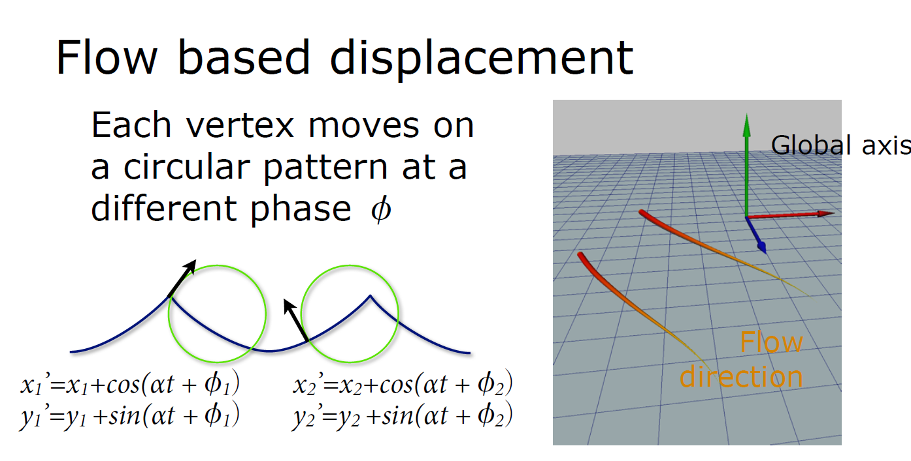

<br>

#### 4.5.1.2 Flow Map变体：《堡垒之夜》Flow Map + Distance Fields + Normal Maps

以及《堡垒之夜》中的Flow Map + Distance Fields + Normal Maps [GDC 2019, Technical Artist Bootcamp Distance Fields and Shader Simulation Tricks]
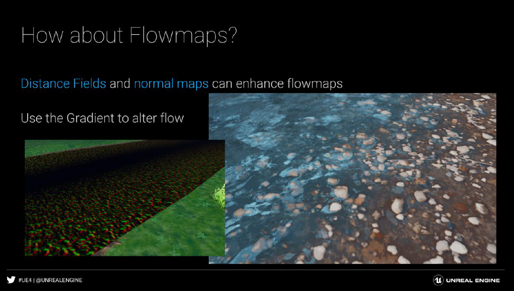

<br>

#### 4.5.1.3 Flow Map变体：《神秘海域4》Flow Map + Wave Particles

或者《神秘海域4》中的Flow Map + Wave Particles[SIGGRAPH 2016, Rendering Rapids in Uncharted 4]，都是进阶模拟水体表面流动与起伏效果的不错选择。

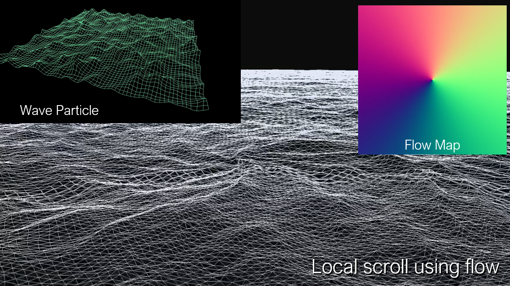

图 《神秘海域4》中的Flow Map + Wave Particles。通过将flow map与波浪粒子（wave particle grids）网格配合使用，可以非常精确地控制波浪的方向。在此示例中，采用一个循环的flow map来构成漩涡

如下为《神秘海域4》中Flow + Wave Particles的伪代码：

```
timeInt = time / (2.0 * interval)  
float2 fTime = frac(float2(timeInt, timeInt * .5)  
posA = pos.xz - (flowDir/2) * fTime.x * flowDir  
posB = pos.xz - (flowDir/2) * fTime.y * flowDir  
gridA0 = waveParticles(posA.xz, freq0,scale0)  
gridA1 = waveParticles(posA.xz, freq1,scale1)  
…  
gridB0 = waveParticles(posB.xz, freq2,scale0)  
gridB1 = waveParticles(posB.xz, freq3,scale1)  
…

float3 pos0 = gridA0 + gridA1 + gridA2 + gridA3  
float3 pos1 = gridB0 + gridB1 + gridB2 + gridB3  
pos = blend(pos0, pos1, abs((2*frac(timeInt)-1)))  
pos.y += heightMap.eval(uv)
```

<br>

### 4.5.2 离线FFT贴图烘焙（Offline FFT Texture）

离线FFT烘焙（Offline FFT Texture）方法最初由《刺客信条3》团队开始采用[Torres 2012]而进入大众视野，思路为基于离线FFT预渲染出一系列高度图，烘焙得出一系列法线贴图或矢量位移贴图（vector displacement maps），并在运行时进行采样。FFT的周期性质可以让烘焙得出的贴图非常适合做tiling。

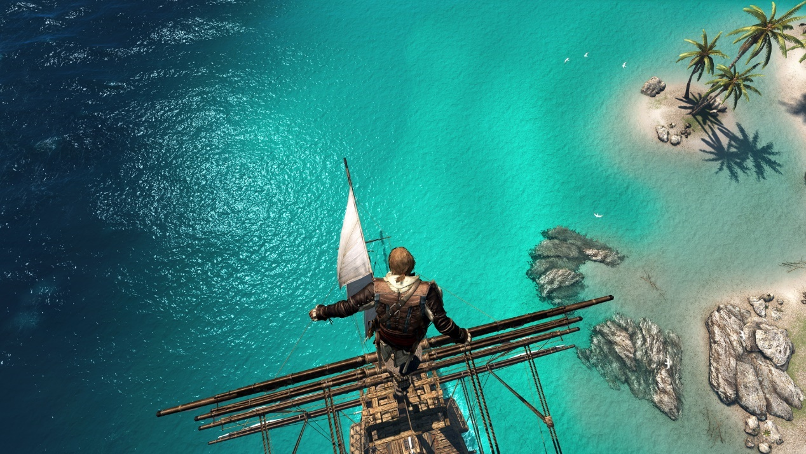

图 基于离线FFT烘焙的《刺客信条4》的水面表现


图 基于离线FFT烘焙的《刺客信条3》的水面表现

<br>

## 4.6 其他方法


除了上述5大类方法之外，还有一些其他的常见水体渲染方法，可以总结如下：

-   凹凸纹理贴图（Bump Mapping）[Schachters 1980]

-   分形布朗运动（Fractal Brownian Motion，FBM）[Addison 1996]

-   程序形状（Procedural Shape）[Ebert 1999]

-   分形噪声（Fractal Noise）[Gonzato 2000]

-   基于体素的方法（Voxel-Based Solutions） [Yann 2003]

-   屏幕空间方法（Screen Space Mesh）[Muller 2007]

-   矢量位移贴图（Vector Displacement Map）[2009]

其中，凹凸纹理贴图（Bump Mapping）比较早期的水体模拟方案，主要思想是扰动参与光照计算的法向量，并通过凹凸纹理的连续移动来模拟海浪的随机运动。目前凹凸纹理贴图几乎是实时水体渲染的必备贴图之一。

而分形噪声（Fractal Noise）方法核心思想是基于不同频率Perlin噪声的叠加，混合出分形噪声，以构建海面高度场。

矢量位移贴图（Vector Displacement Map）的核心思想则是使用空间中的向量的颜色通道在方向与大小上置换对应几何体的顶点。

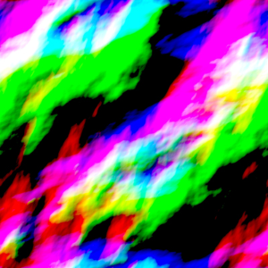

图 一个标准的矢量位移贴图（Vector Displacement Map） @Arnold Render

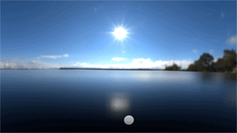

图 基于矢量位移贴图（Vector Displacement Map）的水体渲染 @Arnold Render


其他的方案相对而言比较小众，都有对应paper，篇幅原因这里就不展开总结了。

这边放一个令人印象深刻的SIGGRAPH 2017上 ,Crest Ocean System基于动态程序化形状（Procedural Shape）的水体渲染demo，可以允许玩家和海洋进行互动：


<br>
<br>

# 五、水体渲染的着色技术


关于水体渲染的Shading部分，首先要提到的是，目前游戏业界的主流方案都不是基于物理的。


到达水面的光线除了在水体表面发生反射之外，还有部分光线进入水体内部，经过吸收和散射后再次从水体表面射出，即水体的次表面散射现象（Sub-Surface Scattering, SSS）。基于物理的渲染中，求解次表面散射最标准的方法是求解BSSRDF（Bidirectional Surface Scattering Reflectance Distribution Function，双向表面散射反射分布函数）。
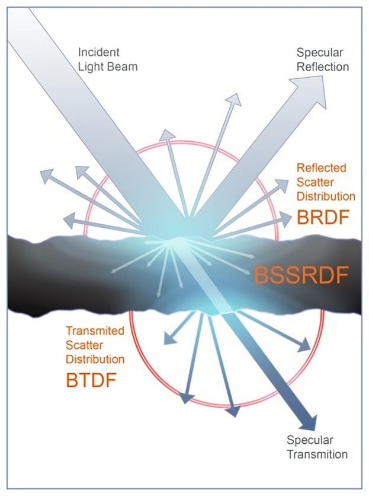

但在光栅图形学中，求解BSSRDF需要很大的计算量，所以实时渲染业界大多数的水体渲染，依旧是非基于物理的经验型渲染方法。


《神秘海域3》在2012年SIGGRAPH上的技术分享中有一张分析水体渲染技术非常经典的图，如下。

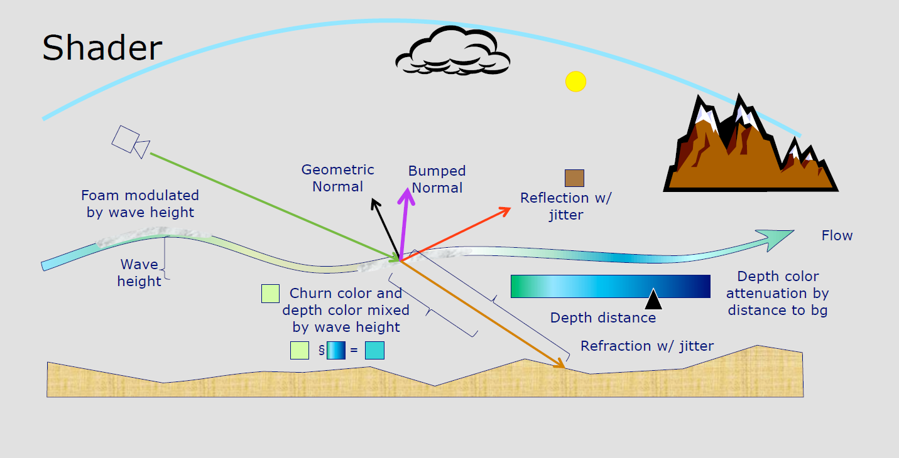

对此，我们可以将水体渲染的要点总结为：

-   漫反射（Diffuse）

-   镜面反射（Specular）

-   法线贴图（Normal Map）

-   折射（Reflection）

-   通透感（Translucency）

    -   基于深度的查找表方法（Depth Based LUT Approach）

    -   次表面散射（Subsurface Scattering）

-   白沫（Foam/WhiteCap）

-   流动表现（Flow）

-   水下雾效（Underwater Haze）

其中，漫反射，镜面反射，法线贴图，折射等都是比较常见的技术，而流动表现（Flow）上文已有涉及，这里都不再赘述。

下文将对水体渲染的难点，通透感（Translucency），白沫（Foam/WhiteCap）渲染分别进行总结。

<br>


## 5.1 水体通透感（Translucency）的表现方案

关于水体通透感（Translucency）的表现方案，可以将业界主流方案总结为如下三个流派：

-   **LUT方法（Look-Up-Table Approach）**

-   **次表面散射近似方法（Sub-Surface Scattering,SSS Approximation Approach）**。

-   **混合型方案。** 即同时将LUT与次表面散射近似两种方案结合使用的方法。典型的例子如《刺客信条3》

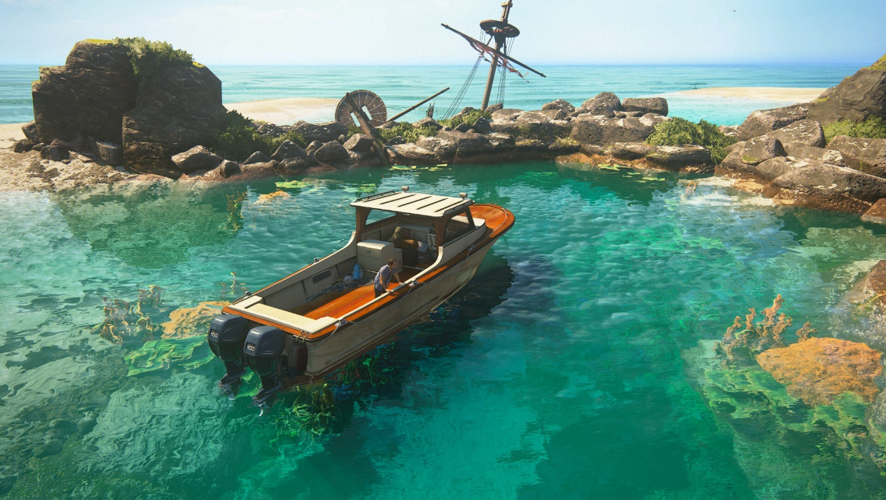

<br>

### 5.1.1 基于深度的查找表方法（Depth Based LUT Approach）

Depth Based-LUT方法的思路是，计算视线方向的水体像素深度，然后基于此深度值采样吸收/散射LUT（Absorb/Scatter LUT）纹理，以控制不同深度水体的上色，得到通透的水体质感表现。

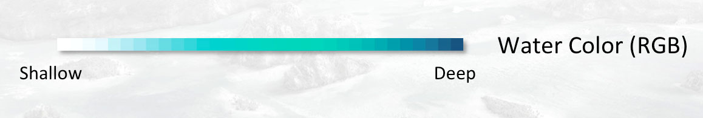

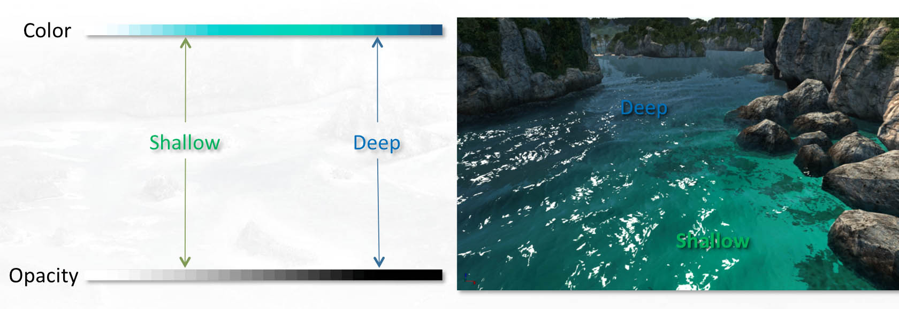

其中，视线方向的水体像素深度值计算思路如下图中的蓝色箭头所示的橘褐色区间：

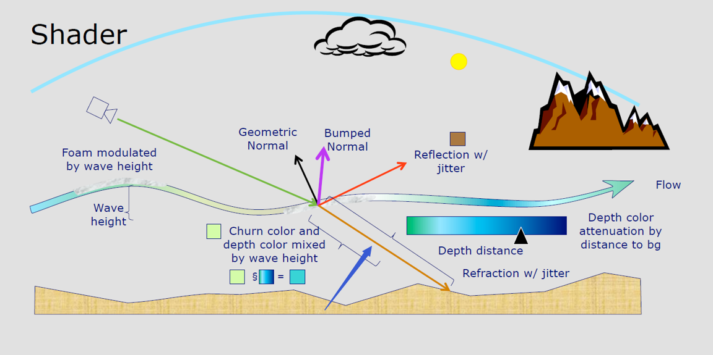

图 蓝色箭头所示的橘褐色区间为视线方向的水体像素深度

<br>

### 5.1.2 次表面散射近似方法（Sub-Surface Scattering Approximation Approach）

可用于水体通透感表现的次表面散射（Sub-Surface Scattering，SSS）的近似方案有很多种，这边推荐两种：

-   [SIGGRAPH 2019] Crest Ocean System改进的《盗贼之海》SSS方案。

-   [GDC 2011] 寒霜引擎的Fast SSS方案。


图 有无次表面散射的水体表现对比

<br>

#### 5.1.2.1 [SIGGRAPH 2019] Crest Ocean System改进的《盗贼之海》SSS方案

经过Crest Ocean System改进的《盗贼之海》的SSS方案可以总结如下：

-   假设光更有可能在波浪的一侧被水散射与透射。

-   基于FFT模拟产生的顶点偏移，为波的侧面生成波峰mask

-   根据视角，光源方向和波峰mask的组合，将深水颜色和次表面散射水体颜色之间进行混合，得到次表面散射颜色。

-   将位移值（Displacement）除以波长，并用此缩放后的新的位移值计算得出次表面散射项强度。

对应的核心实现代码如下：

```
float v = abs(i_view.y);

half towardsSun = pow(max(0., dot(i_lightDir, -i_view)),_SubSurfaceSunFallOff);

half3 subsurface = (_SubSurfaceBase + _SubSurfaceSun * towardsSun) *_SubSurfaceColour.rgb * _LightColor0 * shadow;

subsurface *= (1.0 - v * v) * sssIndensity;

col += subsurface;
```

其中，sssIndensity，即散射强度，由采样位移值计算得出。

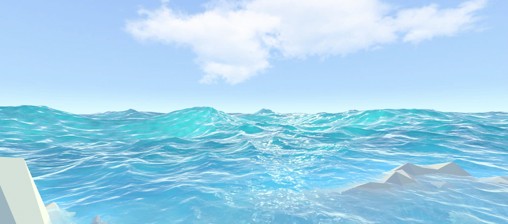

图 《Crest Ocean System》中基于次表面散射近似的水体表现

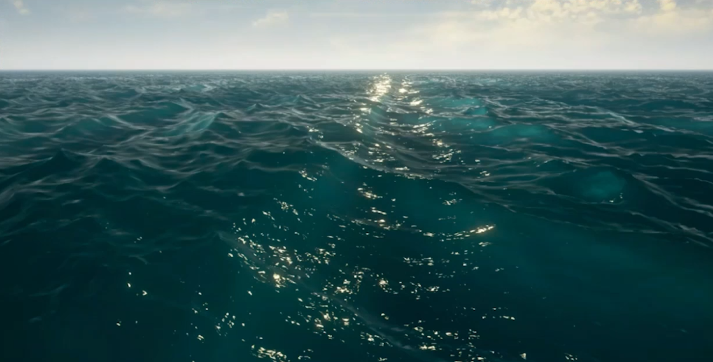

图 《盗贼之海（Sea of Thieves）》中基于次表面散射近似的水体表现


图 《盗贼之海（Sea of Thieves）》中基于次表面散射近似的水体表现

<br>

#### 5.1.2.2 [GDC 2011] 寒霜引擎的Fast SSS方案

[GDC 2011]上，Frostbite引擎提出的Fast Approximating Subsurface Scattering方案，也可以用于水体渲染的模拟。

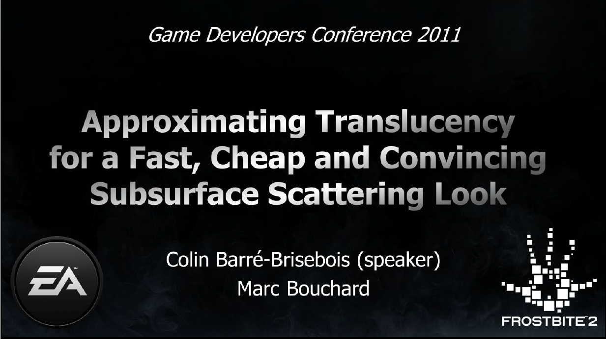

具体方案和代码如下所示：

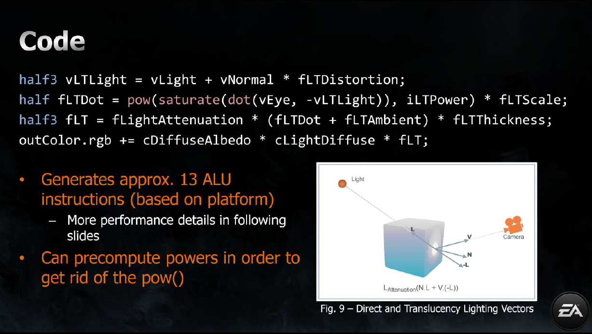


<br>

## 5.2 白沫的渲染方案


白沫（Foam），在有些文献中也被称为Whitecap，White Water，是一种复杂的现象。即使白沫下方的材质具有其他颜色，白沫也通常看起来是白色的。出现这种现象的原因是因为白沫是由包含空气的流体薄膜组成的。随着每单位体积薄膜的数量增加，所有入射光都被反射而没有任何光穿透到其下方。这种光学现象使泡沫看起来比材质本身更亮，以至于看起来几乎是白色的。

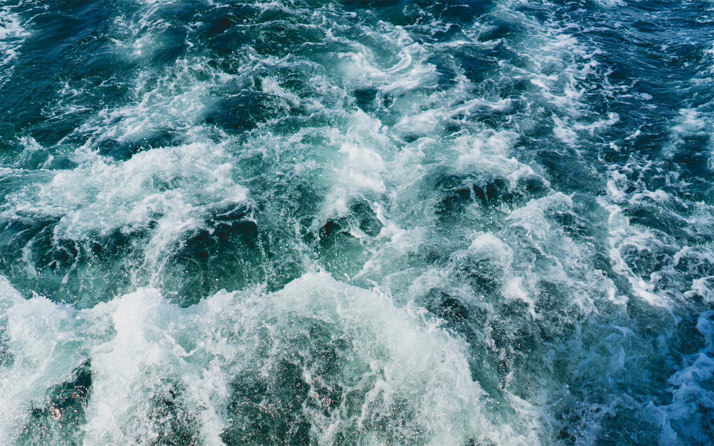

图 海洋中的白沫

对于白沫的渲染而言，白沫可被视为水面上的纹理，其可直接由对象交互作用，浪花的飞溅，或气泡与水表面碰撞而产生。

白沫的渲染方案，按大的渲染思路而言，可以分为两类：

-   基于动态纹理（dynamic texture）

-   基于粒子系统（particle system）

按照类型，可以将白沫分为三种：

-   浪尖白沫

-   岸边白沫

-   交互白沫

而按照渲染方法，可将白沫渲染的主流方案总结如下：

-   基于粒子系统的方法[Tessendorf 2001]

-   基于Saturate高度的模拟方法 [GPU Gems 2]

-   基于雅可比矩阵的方法 [Tessendorf 2001]

-   屏幕空间方法 [Akinci 2013]

-   基于场景深度的方法 [Kozin 2018][Sea of Thieves]

-   基于有向距离场的方法 [GDC 2018][Far Cry 5]


这边对其中比较典型的几种进行说明。

<br>

### 5.2.1 浪尖白沫：[Tessendorf 2001] 基于雅克比矩阵的方法

Tessendorf在其著名的水体渲染paper《Simulating Ocean Water》[Tessendorf 2001]中提出了可以基于雅克比矩阵（Jacobian）为负的部分作为求解白沫分布区域的方案。据此，即可导出一张或多张标记了波峰白沫区域的Folding Map贴图。

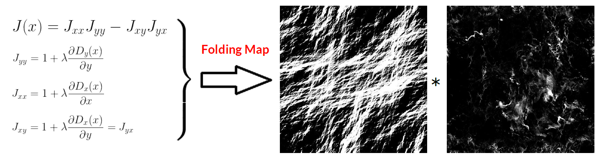

《战争雷霆（War Thunder）》团队在CGDC 2015上对此的改进方案为，取雅克比矩阵小于M的区域作为求解白沫的区域，其中M~0.3...05。

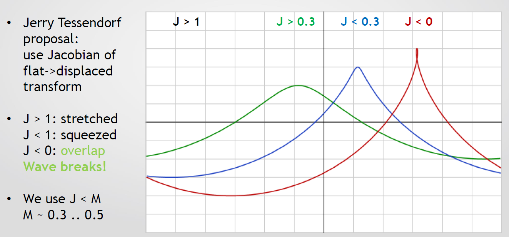

另外，《盗贼之海（Sea of Thieves）》团队在SIGGRPAPH 2018上提出，可以对雅可比矩阵进行偏移，以获得更多白沫。且可以采用渐进模糊（Progressive Blur）来解决噪点（noisy）问题以及提供风格化的白沫表现。

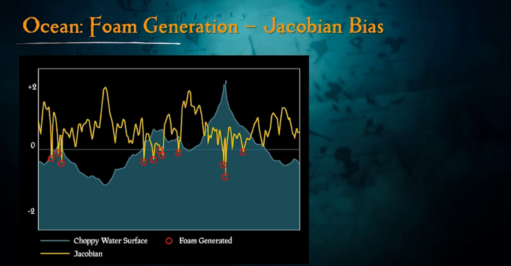


图 《盗贼之海》基于雅可比矩阵偏移 + 渐进模糊（Progressive Blur）的风格化白沫表现

<br>

### 5.2.2 浪尖白沫：[GPU Gems 2] 基于Saturate高度的方法

《GPU Gems 2》中提出的白沫渲染方案，思路是将一个预先创建的泡沫纹理在高于某一高度H0的顶点上进行混合。泡沫纹理的透明度根据以下公式进行计算：

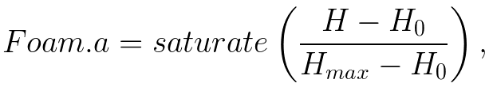

-   其中，H_max是泡沫最大时的高度，H_0是基准高度，H是当前高度。

-   泡沫纹理可以做成序列帧来表示泡沫的产生和消失的演变过程。这个动画序列帧既可以由美术师进行制作，也可以由程序生成。

-   将上述结果和噪声图进行合理的结合，可以得到更真实的泡沫表现。

<br>

### 5.2.3 岸边白沫：[2012]《刺客信条3》基于Multi Ramp Map的方法

《刺客信条3》中的岸边白沫的渲染方案可以总结为：

-   以规则的间距对地形结构进行离线采样，标记出白沫出现的区域。

-   采用高斯模糊和Perlin噪声来丰富泡沫的表现形式，以模拟海岸上泡沫的褪色现象。

-   由于白沫是白色的，因此在R，G和B通道中的每个通道中都放置三张灰度图，然后颜色ramp图将定义三者之间的混合比率，来实现稠密、中等、稀疏三个级别的白沫。要修改白沫表现，美术师只需对ramp图进行颜色校正即可。如下图所示：

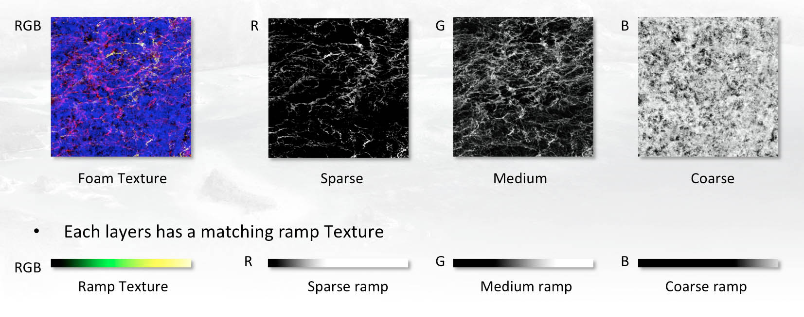

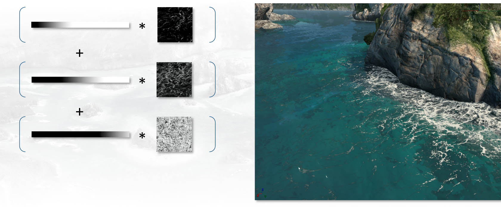

<br>


### 5.2.4 交互白沫：[SIGGRAPH 2018]《盗贼之海》基于场景深度的交互白沫渲染

《盗贼之海（Sea of Thieves）》团队在SIGGRPAPH 2018的talk上也提到了白沫的渲染方案，可以总结如下：

-   放置一个top-down的相机，用于渲染场景深度，通过比较场景深度和水深来得到白沫mask，即：
half4 foamMask =1 - saturate(_FoamThickness* (depth - i.screenPos.w ) ) ;

-   最终，将foamMask和基础texture做blend。

-   盗贼之海中，得到相对深度后，还会对白沫mask做渐进模糊（progressively blur），以得到风格化的白沫表现。

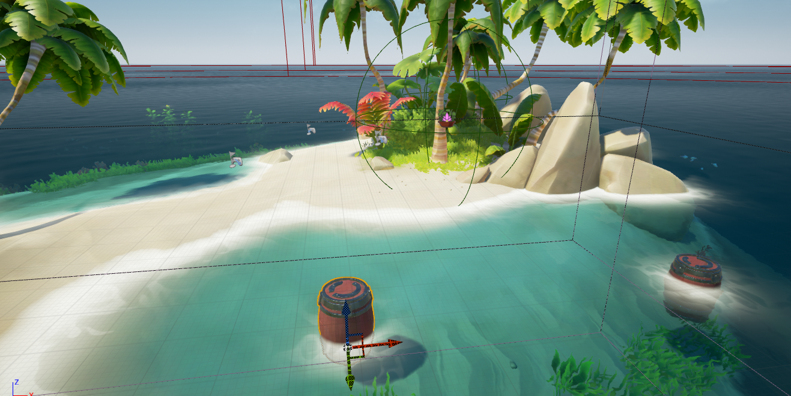

图 《盗贼之海（Sea of Thieves）》中的交互白沫

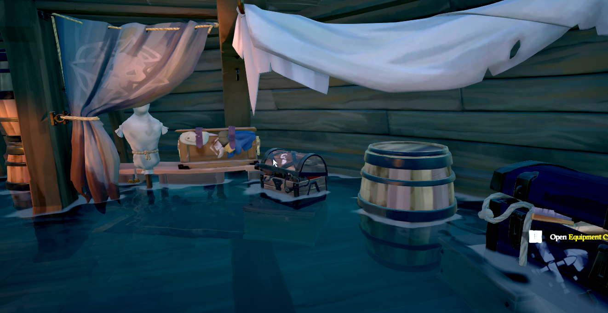

图 《盗贼之海（Sea of Thieves）》中的交互白沫

<br>

### 5.2.5 浪尖白沫&岸边白沫：[GDC 2018]《孤岛惊魂5》基于有向距离场的方法

GDC 2018上《孤岛惊魂5》团队分享的白沫渲染技术也不失为一种优秀的方案，主要思路是基于单张Noise贴图控制白沫颜色，结合两个offset采样Flow Map控制白沫的流动，并基于有向距离场（Signed Distance Field，SDF）控制岩石和海岸线处白沫的出现，然后根据位移对白沫进行混合。

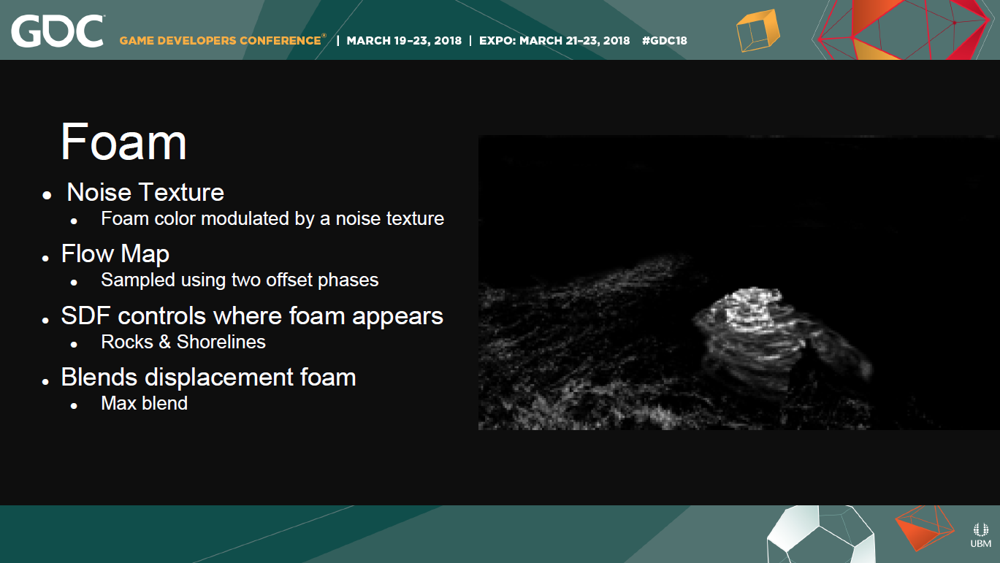


<br>
<br>

# 六、业界优秀水体渲染开源库盘点

时间来到2019年，已有不少3A级别的水体渲染技术以免费&开源的方式涌现了出来，这里将进行一个盘点。

如果要实现一个高品质的水体实时渲染解决方案，以下的这六个开源库会让你事半功倍。

<br>

# 6.1 Crest Ocean System


Crest Ocean System是Unity下开源的高品质海洋渲染框架，已经在两届SIGGRAPH（SIGGRAPH 2017、SIGGRAPH 2019）上进行了技术分享。

源代码传送门：<https://github.com/crest-ocean/crest>

demo视频：<https://www.youtube.com/watch?v=ekng3c43Y1E>
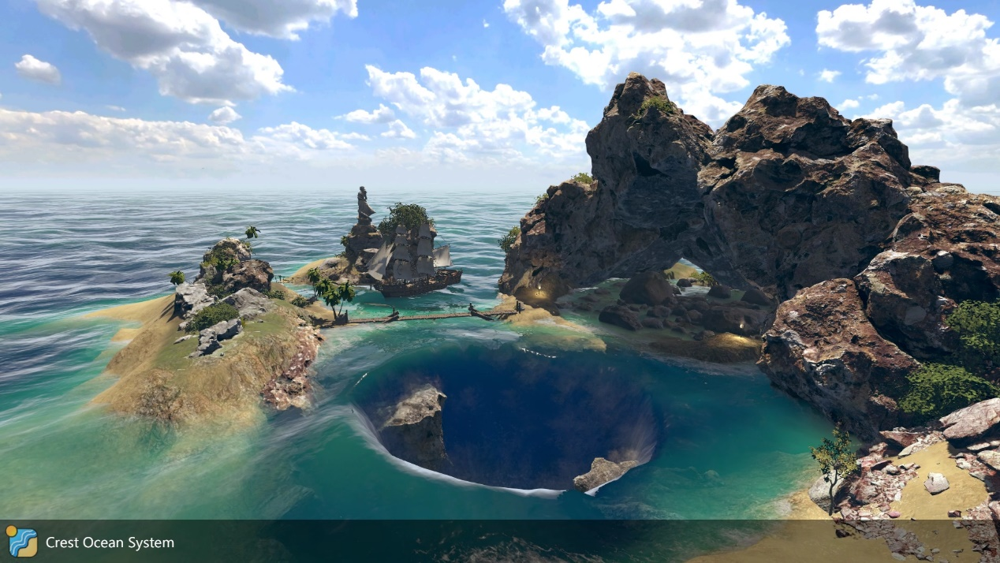

除了开源免费版，Crest Ocean System目前也已推出LWRP的付费版：<https://assetstore.unity.com/packages/tools/particles-effects/crest-ocean-system-lwrp-urp-141674>


<br>

## 6.2 CryEngine内置水体

之前在【GPU精粹】系列文章中也提到过，CryEngine作为比较老牌的引擎，其内置的水体渲染表现在各大游戏引擎的内置水体中，可谓是顶尖级别的。CryEngine现在也已经开源。

源代码传送门：

<https://github.com/CRYTEK/CRYENGINE/blob/26524289c15a660965a447dcb22628643917c820/Engine/Shaders/HWScripts/CryFX/Water.cfx>

demo视频：<https://www.youtube.com/watch?v=tZthI6M07iM>

<br>

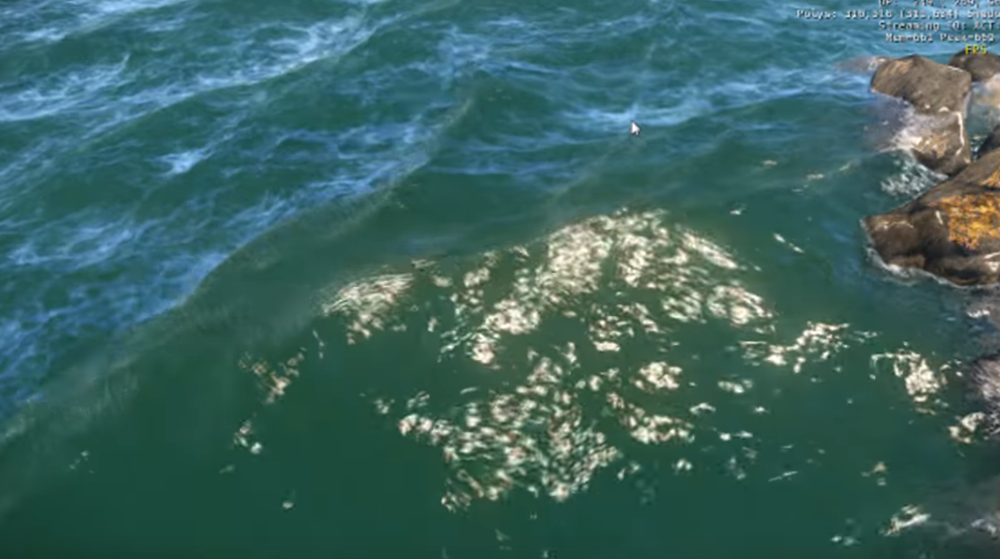

<br>

## 6.3 UE4 Dynamic Water Project


Dynamic Water Project 是Unreal引擎下一款不错的开源水面交互解决方案，对于可交互水体而言是不错的参考。

源代码传送门：

<https://github.com/marvelmaster/UE4_Dynamic_Water_Project/tree/master/Reactive_Water_V3_4-20>


<br>

## 6.4 Ceto Ocean system

Ceto也是Unity引擎下的另一个不错的水体渲染开源库。

源代码传送门：<https://github.com/Scrawk/Ceto>

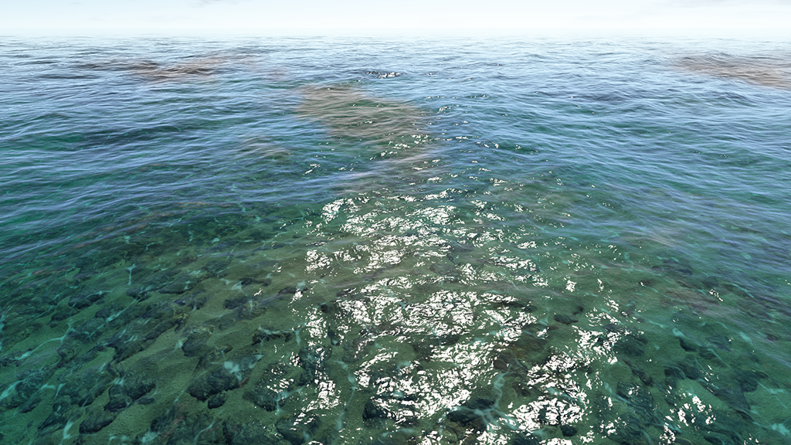

<br>

## 6.5 NVIDIA UE4 WaveWorks 

GDC 2017上，NVIDIA和Unreal Engine合作推出了WaveWorks，以集成到Unreal Engine 4.15引擎中的形式放出。

源代码传送门：<https://github.com/NvPhysX/UnrealEngine/tree/WaveWorks>

demo视频：<https://www.youtube.com/watch?v=DhrNvZLPBGE&list=PLN8o8XBheMDxCCfKijfZ3IlTP3cUCH6Jq&index=11&t=0s>


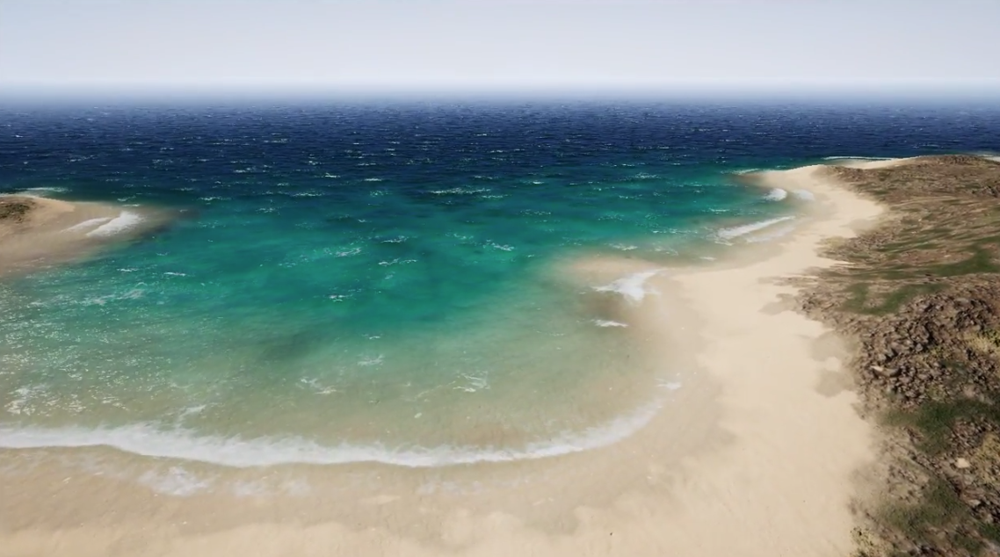


<br>

## 6.6 Unity LWRP BoatAttack


BoatAttack是Unity在2018年5月13日开源的基于LWRP的项目，经历了几个版本的开发周期，具有令人印象深刻的水体表现，可谓是Unity引擎下非常优质的水体渲染参考。

源代码传送门：<https://github.com/Verasl/BoatAttack>

demo视频：<https://www.youtube.com/watch?v=7v9gZK9HqqI>


<br>
<br>


# 七、总结


本文对游戏以及电影业界的真实感水体渲染技术从发展史、知识体系等多个方面进行了较为系统的总结，文末也对业界优秀的水体实时渲染开源库进行了盘点。

不妨用配套的思路导图作为本文的收尾：


<br>
<br>

# Reference


[1] FX Guide 2012, Assassins Creed III The tech behind or beneath the action,
<https://www.fxguide.com/fxfeatured/assassins-creed-iii-the-tech-behind-or-beneath-the-action/>

[2] SIGGRAPH 2001, Tessendorf J. Simulating ocean water[J]. Simulating nature:
realistic and interactive techniques.

[3] SIGGPRAPH 2019, Multi-resolution Ocean Rendering in Crest Ocean System

[4] GDC 2008, Fast Water Simulation for Games

[5] GDC 2012, Water Technology of Uncharted

[6] GDC 2018, Water Rendering in FarCry 5

[7] Jeschke S, Wojtan C. Water wave packets[J]. ACM Transactions on Graphics(TOG), 2017

[8] 2010, Yuksel C. Real-time water waves with wave particles[M]. Texas A&M University

[9] SIGGRAPH 2016, Rendering rapids in Uncharted 4

[10] GDC 2019, Technical Artist Bootcamp Distance Fields and Shader Simulation Tricks

[11] <https://zhuanlan.zhihu.com/p/21573239>

[12] SIGGRAPH 2010, Water Flow in Portal 2

[13] GPU Gems2, Using Vertex Texture Displacement for Realistic Water Rendering

[14] SIGGRAPH 2013, Oceans on a Shoestring Shape Representation, Meshing and Shading

[15] SIGGRAPH 2018, The Technical Art of Sea of Thieves

[16] GDC 2015, An Introduction to Realistic Ocean Rendering through FFT

[17] CGDC 2015, Ocean simulation and rendering in War Thunder

[18] NVIDIA 2004, Ocean Surface Simulation nvidia

[19] SIGGRAPH Asia 2012, Real-time Animation and Rendering of Ocean Whitecaps

[20] TOG 2017, Water Wave Packets

[21] NVIDIA 2004, Ocean Surface Simulation nvidia

[22] GDC 2017, From Shore to Horizon Creating a Practical Tessellation Based Solution

[23] https://www.tek.com/fft

[24] https://www.youtube.com/watch?v=hzw-NOKeSRY

[25] https://www.youtube.com/watch?v=iBBQzs-7Ac4

[26] https://www.fxguide.com/fxfeatured/the-science-of-fluid-sims/

[27] https://graphicsrunner.blogspot.com/2010/08/water-using-flow-maps.html

[28] 题图来自《盗贼之海》
