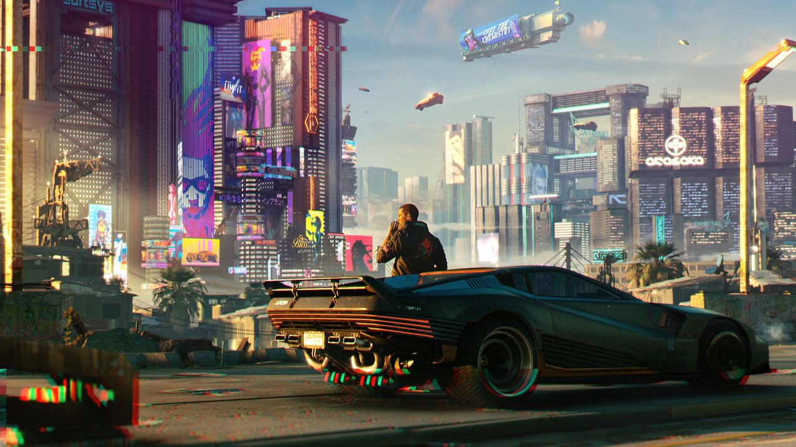

# 高品质后处理：十种故障艺术（Glitch Art）算法的总结与实现

 

故障艺术（Glitch Art），作为赛博朋克（Cyberpunk）艺术风格的核心元素之一，是一种是将数字设备的软硬件故障引起的破碎变形图像，经过艺术加工而成的一种先锋视觉艺术表现形式。近年来，故障艺术已经成为了赛博朋克风格的电影和游戏作品中主要的艺术风格之一。

图 《赛博朋克 2077》 带有强烈故障艺术风格的Logo @ CD Projekt @2019 E3展

 

而本文，对十种主流故障艺术（Glitch Art）系列后处理算法的原理和实现方式进行了总结，对故障艺术风格的算法实现要点进行了提炼，并提供了对应算法在Unity引擎下的一个或多个版本的实现源码。

这十种故障艺术（Glitch Art）后处理特效分别为：

1. RGB颜色分离故障（RGB Split Glitch）

2. 错位图块故障（Image Block Glitch）

3. 错位线条故障（Line Block Glitch）

4. 图块抖动故障（Tile Jitter Glitch）

5. 扫描线抖动故障（Scan Line Jitter Glitch）

6. 数字条纹故障（Digital Stripe Glitch）

7. 模拟噪点故障（Analog Noise Glitch）

8. 屏幕跳跃故障（Screen Jump Glitch）

9. 屏幕抖动故障（Screen Shake Glitch）

10. 波动抖动故障（Wave Jitter Glitch）

 

# 关于XPL : Unity引擎的高品质后处理库

另外，本文涉及的十种故障艺术（Glitch Art）后处理的实现源码，都收录于本人开源的后处理算法库XPL中。

X-PostProcessing Libray，简称XPL，是本人开发的Unity引擎下的高品质开源后处理算法库，旨在提供业界主流的高品质后处理特效的完整解决方案，目前已完美支持Unity Post-processing Stack v2。后续也将提供对Unity引擎URP/LWRP/HDRP的兼容支持。

**【GitHub地址】**： <https://github.com/QianMo/X-PostProcessing-Library>

截止本文发表，目前已以开源的形式放出了17种图像模糊型后处理算法、10种像素化型后处理算法、9种边缘检测型后处理算法、17种故障艺术型后处理算法。而随着后续更多内容的公开，X-PostProcessing
Libray将成型为一个具有100+种后处理特效的高品质后处理开源算法库。

 

在开始正文之前，不妨先简单认识一下赛博朋克与故障艺术这两种带有强烈科技感的艺术风格,以及他们在电影和游戏行业中的应用情况。

 

# 零、赛博朋克与故障艺术

**赛博朋克（Cyberpunk）**，最早起源于上世纪六七十年代，作为未来主义科幻小说/电影/游戏的一个品类，核心理念在于低端生活与高等科技的结合。人工智能、虚拟现实、基因工程、黑客技术、反乌托邦、电脑生化、都市与贫民窟、故障艺术、霓虹灯等都是赛博朋克的主流艺术表现形式。

**故障艺术（Glitch Art）**，一种是将数字设备的软硬件故障引起的破碎变形图像，经过艺术加工而成的一种先锋视觉艺术表现。故障艺术的艺术表现核心形式在于图像的失真、破碎、错位、形变，以及颜色的失真、错位，并伴有条纹图形的辅助。

无论是电影领域的《黑客帝国》、《银翼杀手》、《银翼杀手2077》、《攻壳机动队》等作品，还是游戏领域的《赛博朋克2077》，《杀出重围》等作品，都带有非常浓厚的赛博朋克风格。而在这些作品中，都能找到故障艺术的身影。

图 电影《攻壳机动队》中的故障艺术表现形式

图 电影《银翼杀手2049》中的故障艺术表现形式

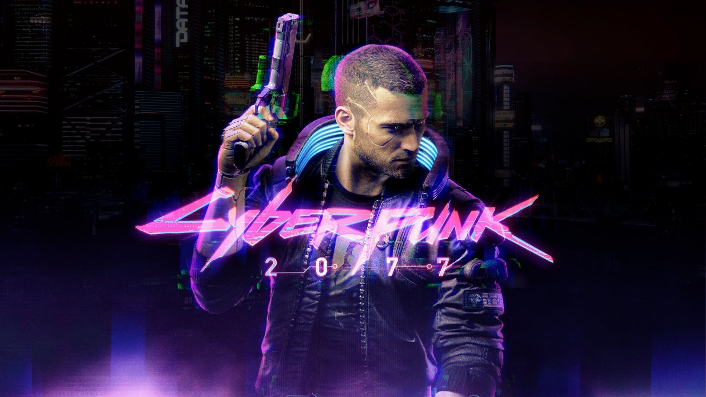

图《赛博朋克2077》中的故障艺术表现形式 @ CD Projekt

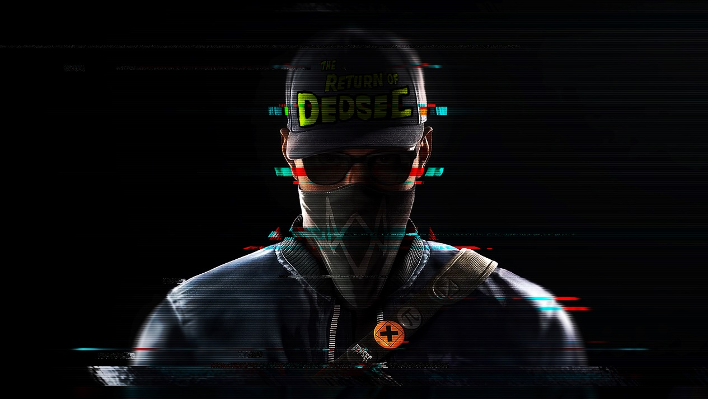

图 《看门狗2》中的故障艺术表现形式 @ Ubisoft

这里也放一段包含多种故障艺术（Glitch Art）元素的《赛博朋克2077》 2019 E3展预告片段：

【《赛博朋克2077》 2019 E3展预告片段】 <https://www.youtube.com/watch?v=qIcTM8WXFjk>

以及一个发布于2013年的《赛博朋克2077》早期宣传片：

【《赛博朋克2077》 2013预告片】 <https://www.youtube.com/watch?v=P99qJGrPNLs>

 
 

OK，下面开始正文，对10种主流故障艺术（Glitch Art）后处理的算法以及原理进行总结。

 

# 一、RGB颜色分离故障（RGB Split Glitch）

RGB颜色分离故障（RGB Split Glitch），也称颜色偏移故障（Color Shift Glitch），是故障艺术中比较常见的表达形式之一。例如，抖音短视频App的Icon，即是RGB颜色分离故障艺术风格影响下的作品，给整体产品带来了潮流与年轻的气息：

RGB颜色分离故障（RGB Split Glitch），实现算法的主要要点在于红绿蓝三个通道采用不同的uv偏移值进行分别采样。一般而言，会在RGB三个颜色通道中，选取一个通道采用原始uv值，另外两个通道进行uv抖动后再进行采样。一个经过性能优化的实现版本Shader代码如下：

	float randomNoise(float x, float y)
	{
		return frac(sin(dot(float2(x, y), float2(12.9898, 78.233))) * 43758.5453);
	}

	half4 Frag_Horizontal(VaryingsDefault i) : SV_Target
	{
		float splitAmount = _Indensity * randomNoise(_TimeX, 2);

		half4 ColorR = SAMPLE_TEXTURE2D(_MainTex, sampler_MainTex, float2(i.texcoord.x + splitAmount, i.texcoord.y));
		half4 ColorG = SAMPLE_TEXTURE2D(_MainTex, sampler_MainTex, i.texcoord);
		half4 ColorB = SAMPLE_TEXTURE2D(_MainTex, sampler_MainTex, float2(i.texcoord.x - splitAmount, i.texcoord.y));

		return half4(ColorR.r, ColorG.g, ColorB.b, 1);
	}

上述代码中的randomNoise函数在之前的文章[《高品质后处理：十种图像模糊算法的总结与实现》](https://zhuanlan.zhihu.com/p/125744132)的粒状模糊（Grainy Blur）中有提到一个简化版的实现。本文在则采用了基于frac方法（返回输入数值的小数部分）和三角函数，配合dot方法的封装实现。

上述代码，得到的渲染表现如下：

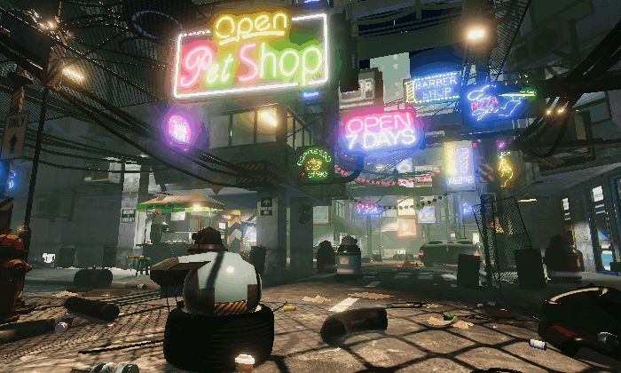

详细实现源码可见：

<https://github.com/QianMo/X-PostProcessing-Library/tree/master/Assets/X-PostProcessing/Effects/GlitchRGBSplitV4>

另外，可以基于三角函数和pow方法控制抖动的间隔、幅度，以及抖动的曲线：

	half4 Frag_Horizontal(VaryingsDefault i): SV_Target
	{
		float splitAmout = (1.0 + sin(_TimeX * 6.0)) * 0.5;
		splitAmout *= 1.0 + sin(_TimeX * 16.0) * 0.5;
		splitAmout *= 1.0 + sin(_TimeX * 19.0) * 0.5;
		splitAmout *= 1.0 + sin(_TimeX * 27.0) * 0.5;
		splitAmout = pow(splitAmout, _Amplitude);
		splitAmout *= (0.05 * _Amount);
		
		half3 finalColor;
		finalColor.r = SAMPLE_TEXTURE2D(_MainTex, sampler_MainTex, fixed2(i.texcoord.x + splitAmout, i.texcoord.y)).r;
		finalColor.g = SAMPLE_TEXTURE2D(_MainTex, sampler_MainTex, i.texcoord).g;
		finalColor.b = SAMPLE_TEXTURE2D(_MainTex, sampler_MainTex, fixed2(i.texcoord.x - splitAmout, i.texcoord.y)).b;
		
		finalColor *= (1.0 - splitAmout * 0.5);
		
		return half4(finalColor, 1.0);
	}

得到的渲染表现如下：

此版本的实现源码可见：

<https://github.com/QianMo/X-PostProcessing-Library/tree/master/Assets/X-PostProcessing/Effects/GlitchRGBSplitV2>

另外，在XPL（X-PostProcessing-Library）中供实现了5种不同版本的Glitch RGB
Split后处理特效，以满足不同情形下RGB颜色抖动风格的需要。除了上文提到了两种，剩余三种的更多细节，篇幅原因这里就不展开了。以下整理了一个汇总列表，若有需要，可以直接转到XPL查看具体渲染表现以及源码:

-  **GlitchRGBSplitV1：**
<https://github.com/QianMo/X-PostProcessing-Library/tree/master/Assets/X-PostProcessing/Effects/GlitchRGBSplit>

-  **GlitchRGBSplitV2:**
<https://github.com/QianMo/X-PostProcessing-Library/tree/master/Assets/X-PostProcessing/Effects/GlitchRGBSplitV2>

-  **GlitchRGBSplitV3:**
<https://github.com/QianMo/X-PostProcessing-Library/tree/master/Assets/X-PostProcessing/Effects/GlitchRGBSplitV3>

-  **GlitchRGBSplitV4:**
<https://github.com/QianMo/X-PostProcessing-Library/tree/master/Assets/X-PostProcessing/Effects/GlitchRGBSplitV4>

-  **GlitchRGBSplitV5:**
<https://github.com/QianMo/X-PostProcessing-Library/tree/master/Assets/X-PostProcessing/Effects/GlitchRGBSplitV5>

其中GlitchRGBSplitV1和GlitchRGBSplitV3具有相对而言较丰富可调参数：

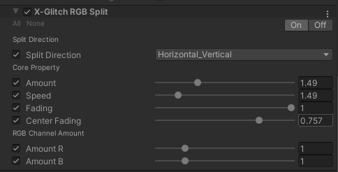

以下是其中的一些效果图：

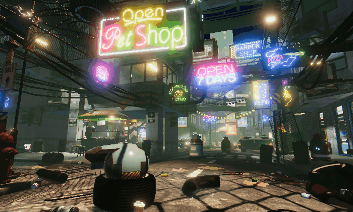

 

# 二、错位图块故障（Image Block Glitch）

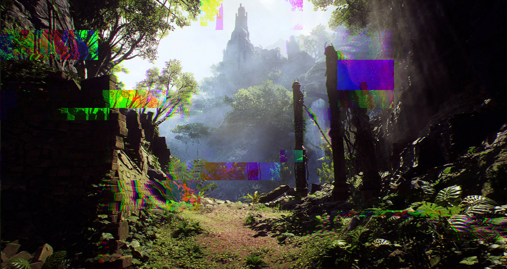

错位图块故障（Image Block Glitch）的核心要点在于生成随机强度且横纵交错的图块，随后基于图块的强度，进行uv的抖动采样，并可以加上RGB Split等元素提升渲染表现。

 

## 2.1 基础版本的错位图块故障（Image Block Glitch）

对于基础版本的实现，第一步，基于uv和噪声函数生成方格块。可以使用floor方法（对输入参数向下取整）以及低成本的噪声生成函数randomNoise进行实现，代码仅需一句：

	half2 block = randomNoise(floor(i.texcoord * _BlockSize));

基于这句代码可以生成随机强度的均匀Block图块：

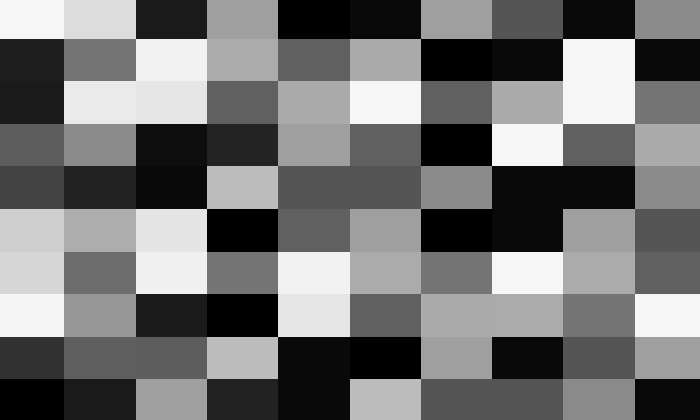

第二步，基于第一步得到的均匀Block图块强度值做强度的二次筛选，增加随机性，代码如下：

half displaceNoise = pow(block.x, 8.0) * pow(block.x, 3.0);

得到的图块强度值如下：

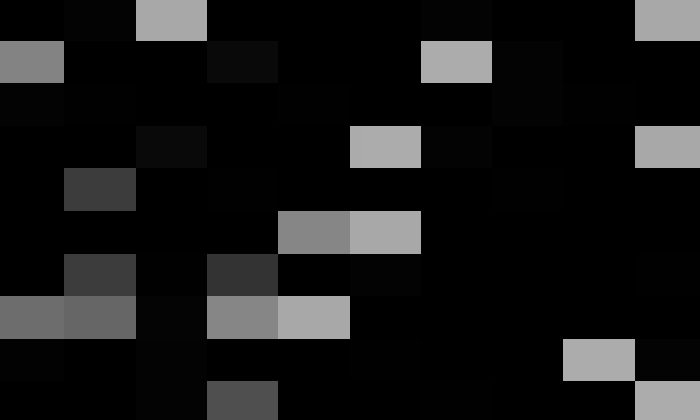

第三步，将经过强度二次筛选的Block图块强度值，作为噪声强度的系数，分别对G和B颜色通道进行采样。实现如下：

	half ColorR = SAMPLE_TEXTURE2D(_MainTex, sampler_MainTex, i.texcoord).r;
	half ColorG = SAMPLE_TEXTURE2D(_MainTex, sampler_MainTex, i.texcoord + float2(displaceNoise * 0.05 * randomNoise(7.0), 0.0)).g;
	half ColorB = SAMPLE_TEXTURE2D(_MainTex, sampler_MainTex, i.texcoord - float2(displaceNoise * 0.05 * randomNoise(13.0), 0.0)).b;

	return half4(ColorR, ColorG, ColorB, 1.0);

可以得到如下基础的错位图块故障（Image Block Glitch）的渲染表现：

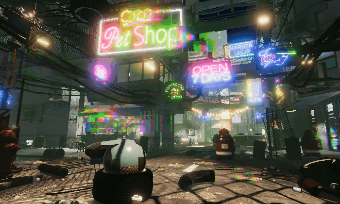

以上基础版本的错位图块故障（Image Block Glitch）实现的完整源代码可见：

<https://github.com/QianMo/X-PostProcessing-Library/tree/master/Assets/X-PostProcessing/Effects/GlitchImageBlockV3>

 

## 2.2 结合RGB Split的错位图块故障（Image Block Glitch）

另外，也可以加上RGB Split的元素，得到更丰富的渲染表现，实现代码如下：

	inline float randomNoise(float2 seed)
	{
		return frac(sin(dot(seed * floor(_Time.y * _Speed), float2(17.13, 3.71))) * 43758.5453123);
	}

	inline float randomNoise(float seed)
	{
		return randomNoise(float2(seed, 1.0));
	}

	half4 Frag(VaryingsDefault i) : SV_Target
	{
		half2 block = randomNoise(floor(i.texcoord * _BlockSize));

		float displaceNoise = pow(block.x, 8.0) * pow(block.x, 3.0);
		float splitRGBNoise = pow(randomNoise(7.2341), 17.0);
		float offsetX = displaceNoise - splitRGBNoise * _MaxRGBSplitX;
		float offsetY = displaceNoise - splitRGBNoise * _MaxRGBSplitY;

		float noiseX = 0.05 * randomNoise(13.0);
		float noiseY = 0.05 * randomNoise(7.0);
		float2 offset = float2(offsetX * noiseX, offsetY* noiseY);

		half4 colorR = SAMPLE_TEXTURE2D(_MainTex, sampler_MainTex, i.texcoord);
		half4 colorG = SAMPLE_TEXTURE2D(_MainTex, sampler_MainTex, i.texcoord + offset);
		half4 colorB = SAMPLE_TEXTURE2D(_MainTex, sampler_MainTex, i.texcoord - offset);

		return half4(colorR.r , colorG.g, colorB.z, (colorR.a + colorG.a + colorB.a));
	}

对应的渲染表现如下：

实现的完整源代码可见：

<https://github.com/QianMo/X-PostProcessing-Library/tree/master/Assets/X-PostProcessing/Effects/GlitchImageBlockV4>

 

## 2.3 进阶版的错位图块故障（Image Block Glitch）

进阶版的Image Block Glitch，核心要点在于双层blockLayer的生成，以及配合噪声生成函数randomNoise进行双层强度的二次筛选，对应的实现代码如下：

		float2 blockLayer1 = floor(uv * float2(_BlockLayer1_U, _BlockLayer1_V));
		float2 blockLayer2 = floor(uv * float2(_BlockLayer2_U, _BlockLayer2_V));
		
		float lineNoise1 = pow(randomNoise(blockLayer1), _BlockLayer1_Indensity);
		float lineNoise2 = pow(randomNoise(blockLayer2), _BlockLayer2_Indensity);
		float RGBSplitNoise = pow(randomNoise(5.1379), 7.1) * _RGBSplit_Indensity;
		float lineNoise = lineNoise1 * lineNoise2 * _Offset  - RGBSplitNoise;

上述代码可以得到更加丰富的Block图块强度：

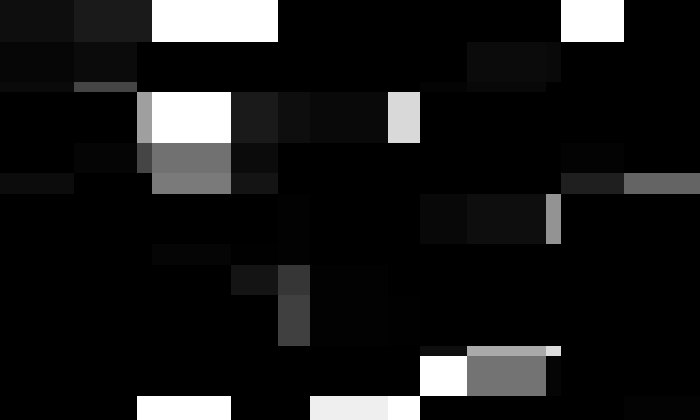

最后，基于此Block强度进行RGB通道的分别采样，可以得到更加多样的错位图块故障（Image Block Glitch）渲染表现：

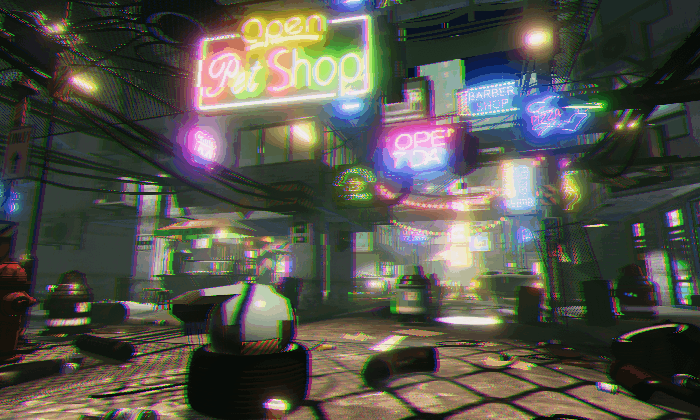

上述完整的实现代码可见：

<https://github.com/QianMo/X-PostProcessing-Library/tree/master/Assets/X-PostProcessing/Effects/GlitchImageBlock>

此版本的Image Block Glitch参数较为丰富，可以根据需要，调出各种风格的Image Block渲染表现：

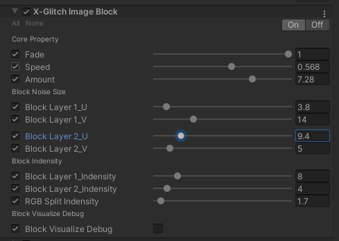

同样，在XPL（X-PostProcessing-Library）中分别实现了4种不同版本的Glitch Image Block后处理特效，以满足不同情形下的需要。部分算法的源码实现链接上文中已经有贴出一部分，这里是一个汇总列表:

- **Glitch Image Block V1**：<https://github.com/QianMo/X-PostProcessing-Library/tree/master/Assets/X-PostProcessing/Effects/GlitchImageBlock>

- **Glitch Image Block V2**：<https://github.com/QianMo/X-PostProcessing-Library/tree/master/Assets/X-PostProcessing/Effects/GlitchImageBlockV2>

- **Glitch Image Block V3**：<https://github.com/QianMo/X-PostProcessing-Library/tree/master/Assets/X-PostProcessing/Effects/GlitchImageBlockV3>

- **Glitch Image Block V4**：<https://github.com/QianMo/X-PostProcessing-Library/tree/master/Assets/X-PostProcessing/Effects/GlitchImageBlockV4>

 

# 三、错位线条故障（Line Block Glitch）

错位线条故障（Line Block Glitch）具有较强的表现力，在Glitch系列特效中的出镜率也较高。

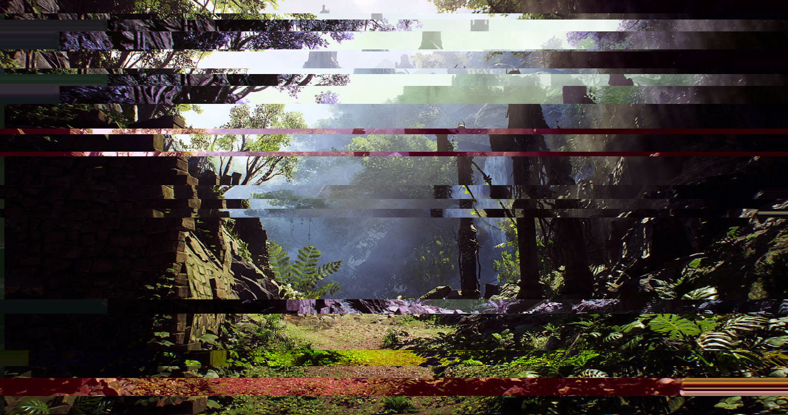

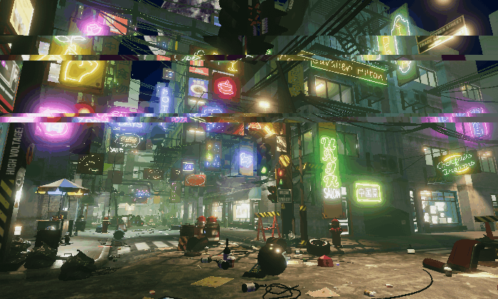

该算法的实现思路在于随机宽度线条的生成。我们一步一步来，先从生成均匀宽度线条开始：

    float trunc(float x, float num_levels)
    {
        return floor(x * num_levels) / num_levels;
    }

    //生成随机强度梯度线条
    float truncTime = trunc(_TimeX, 4.0);		
    float uv_trunc = randomNoise(trunc(uv.yy, float2(8, 8)) + 100.0 * truncTime);

基于trunc函数以及randomNoise函数，配合上述调用代码，即可得到如下均匀宽度线条：

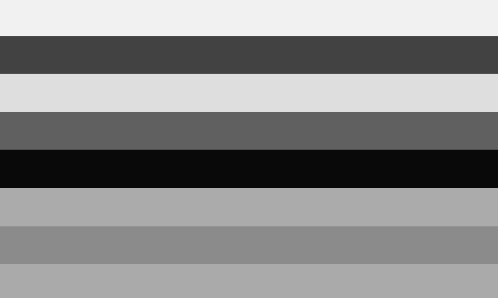

接着，使用如下代码，将均匀渐变线条转为随机梯度的等宽线条：

	float uv_randomTrunc = 6.0 * trunc(_TimeX, 24.0 * uv_trunc);

然后，将随机梯度的等宽线条，经过多次randomNoise操作，转换为随机梯度的非等宽线条：

    //生成随机梯度的非等宽线条
    float blockLine_random = 0.5 * randomNoise(trunc(uv.yy + uv_randomTrunc, float2(8 * _LinesWidth, 8 * _LinesWidth)));
    blockLine_random += 0.5 * randomNoise(trunc(uv.yy + uv_randomTrunc, float2(7, 7)));
    blockLine_random = blockLine_random * 2.0 - 1.0;	
    blockLine_random = sign(blockLine_random) * saturate((abs(blockLine_random) - _Amount) / (0.4));
    blockLine_random = lerp(0, blockLine_random, _Offset);	

可以得到如下的渲染表现：

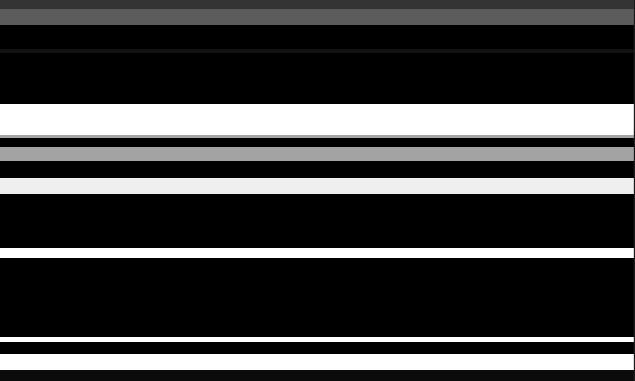

接着，通过随机梯度的非等宽线条，去抖动uv采样生成源色调的blockLine Glitch：

		// 生成源色调的blockLine Glitch
		float2 uv_blockLine = uv;
		uv_blockLine = saturate(uv_blockLine + float2(0.1 * blockLine_random, 0));
		float4 blockLineColor = SAMPLE_TEXTURE2D(_MainTex, sampler_MainTex, abs(uv_blockLine));

对应的渲染表现如下：

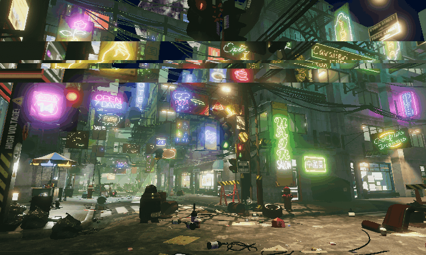

最终，将RGB颜色转换到YUV空间，进行色度（Chrominance）和浓度（Chroma）的偏移，得到最终的渲染表现：

	    // 将RGB转到YUV空间，并做色调偏移
		// RGB -> YUV
		float3 blockLineColor_yuv = rgb2yuv(blockLineColor.rgb);
		// adjust Chrominance | 色度
		blockLineColor_yuv.y /= 1.0 - 3.0 * abs(blockLine_random) * saturate(0.5 - blockLine_random);
		// adjust Chroma | 浓度
		blockLineColor_yuv.z += 0.125 * blockLine_random * saturate(blockLine_random - 0.5);
		float3 blockLineColor_rgb = yuv2rgb(blockLineColor_yuv);

		// 与源场景图进行混合
		float4 sceneColor = SAMPLE_TEXTURE2D(_MainTex, sampler_MainTex, i.texcoord);
		return lerp(sceneColor, float4(blockLineColor_rgb, blockLineColor.a), _Alpha);

最终的渲染表现如下：

除了水平方向的Line Block，竖直方向的表现也独具特色:

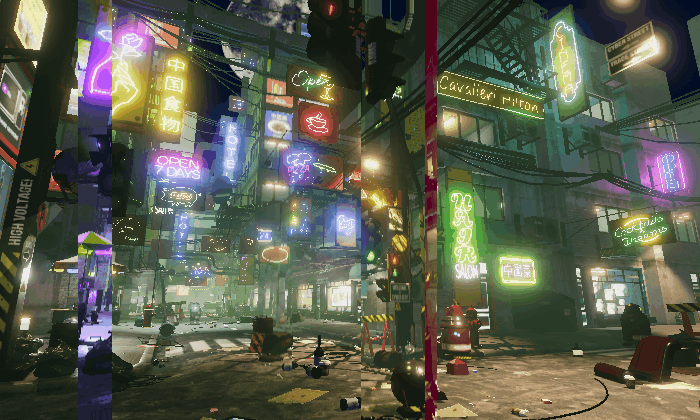

当然，也可以将上述渲染效果与原始场景图进行插值混合，得到不同强度的渲染表现。

XPL中实现的错位线条故障（Line Block Glitch）后处理，有7个可供定制调节的参数：

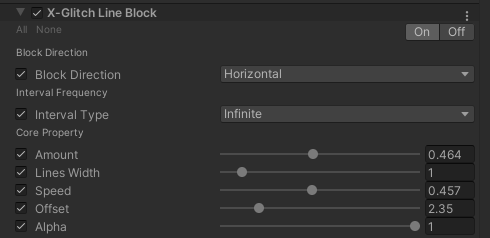

错位线条故障（Line Block Glitch）的完整的源代码实现可见：

<https://github.com/QianMo/X-PostProcessing-Library/tree/master/Assets/X-PostProcessing/Effects/GlitchLineBlock>

 

# 四、图块抖动故障（Tile Jitter Glitch）

图块抖动故障 (Tile Jitter Glitch)模拟了屏幕信号的块状抖动传输故障。

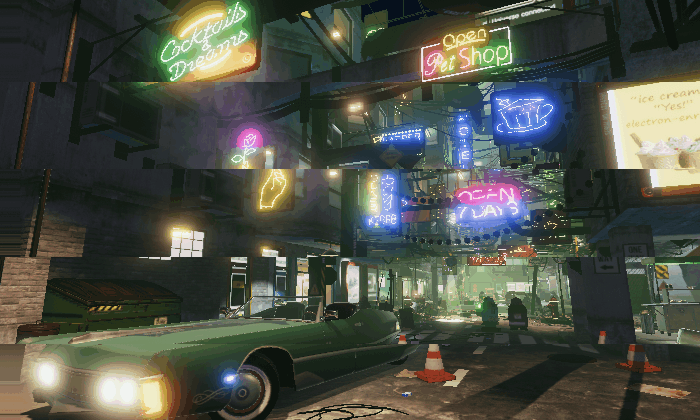

其核心算法思路在于基于uv的分层抖动。可以采用取余数的形式（fmod(x,y)方法可返回x/y的余数）来对uv进行分层，且对于层内的uv数值，进行三角函数形式的抖动。

核心实现Shader代码如下：

		#if USING_FREQUENCY_INFINITE
			strength = 1;
		#else
			strength = 0.5 + 0.5 * cos(_Time.y * _Frequency);
		#endif
		if(fmod(uv.y * _SplittingNumber, 2) < 1.0)
		{
			#if JITTER_DIRECTION_HORIZONTAL
				uv.x += pixelSizeX * cos(_Time.y * _JitterSpeed) * _JitterAmount * strength;
			#else
				uv.y += pixelSizeX * cos(_Time.y * _JitterSpeed) * _JitterAmount * strength;
			#endif
		}

上述代码经过计算后，得到的uv强度值如下：

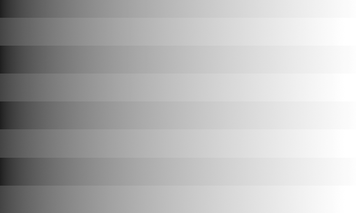

得到上述分块抖动的uv后，便可以作为uv输入，对最终的场景图进行采样：

    half4 sceneColor = SAMPLE_TEXTURE2D(_MainTex, sampler_MainTex, uv);

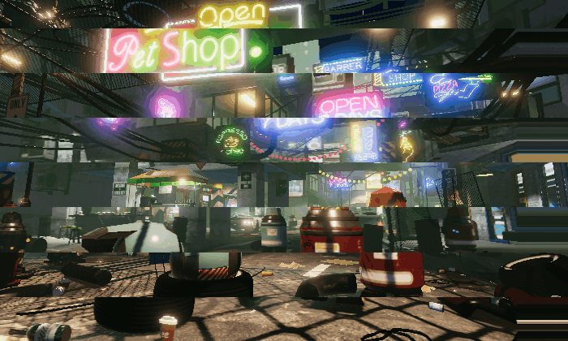

上图为左右抖动的表现，这边也有上下抖动的表现，以及左右分层+上下抖动，左右分层+左右抖动的各种不同表现：

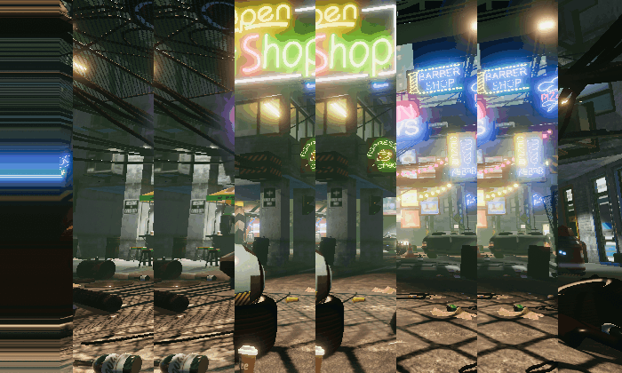

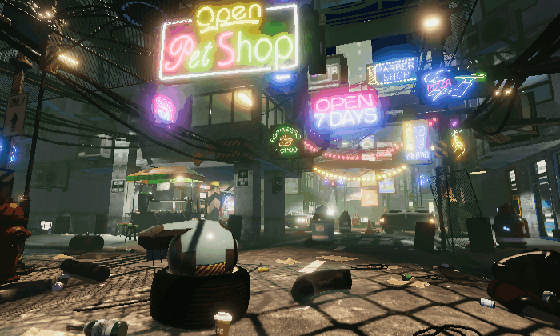

图块抖动故障 ( Glitch Tile Jitter) 后处理特效可调的参数同样也比较丰富，XPL内实现的此特效的可调参数面板如下：

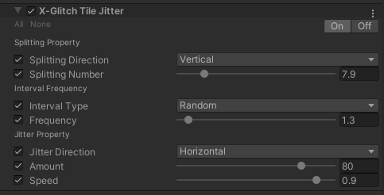

图块抖动故障 ( Glitch Tile Jitter)完整的实现源代码可见：

<https://github.com/QianMo/X-PostProcessing-Library/tree/master/Assets/X-PostProcessing/Effects/GlitchTileJitter>

 

# 五、扫描线抖动故障（Scan Line Jitter Glitch）

扫描线抖动故障（Scan Line Jitter Glitch）算法较简单，但是得到的渲染表现却非常具有冲击力：

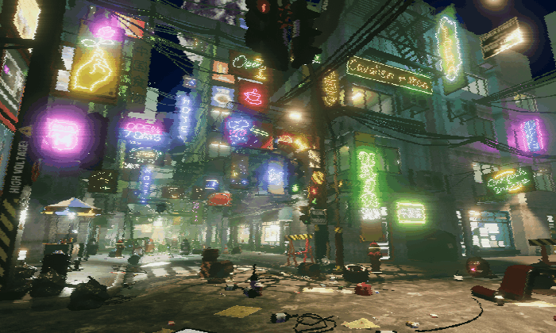

一个比较直接的实现是直接对横向或者纵向UV进行基于noise的抖动，Shader实现代码如下：

	float randomNoise(float x, float y)
	{
		return frac(sin(dot(float2(x, y), float2(12.9898, 78.233))) * 43758.5453);
	}

	half4 Frag_Horizontal(VaryingsDefault i): SV_Target
	{
		
		float jitter = randomNoise(i.texcoord.y, _Time.x) * 2 - 1;
		jitter *= step(_ScanLineJitter.y, abs(jitter)) * _ScanLineJitter.x;
		
		half4 sceneColor = SAMPLE_TEXTURE2D(_MainTex, sampler_MainTex, frac(i.texcoord + float2(jitter, 0)));
		
		return sceneColor;
	}

得到的渲染表现如下：

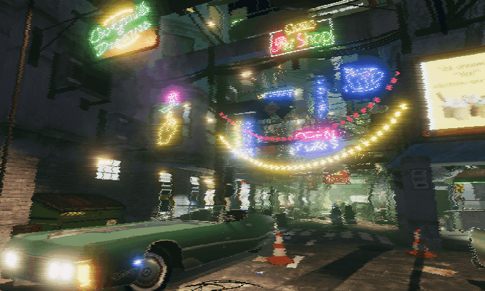

也可以从竖直方向进行uv的抖动：

扫描线抖动故障（Scan Line Jitter Glitch）完整的实现源代码可见:

<https://github.com/QianMo/X-PostProcessing-Library/tree/master/Assets/X-PostProcessing/Effects/GlitchScanLineJitter>

 

# 六、数字条纹故障（Digital Stripe Glitch）

数字条纹故障（Digital Stripe Glitch）同样是出镜率较高的Glitch系后处理特效之一。例如在《赛博朋克2077》的gameplay中，就可以到它的身影：

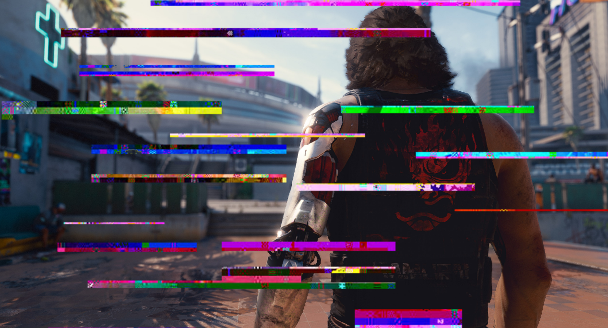

图 《赛博朋克2077》中的数字条纹故障（Digital Stripe Glitch）特效 @ CD Projekt

数字条纹故障（Digital Stripe Glitch）需在Runtime层完成noise Texture的生成，然后传入GPU中进行最终的运算和渲染呈现。

Runtime的核心思路为基于随机数进行随机颜色条纹贴图的生成，实现代码如下：

    for (int y = 0; y < _noiseTexture.height; y++)
    {
        for (int x = 0; x < _noiseTexture.width; x++)
        {
            //随机值若大于给定strip随机阈值，重新随机颜色
            if (UnityEngine.Random.value > stripLength)
            {
                color = XPostProcessingUtility.RandomColor();
            }
            //设置贴图像素值
            _noiseTexture.SetPixel(x, y, color);
        }
    }

生成的图片如下：

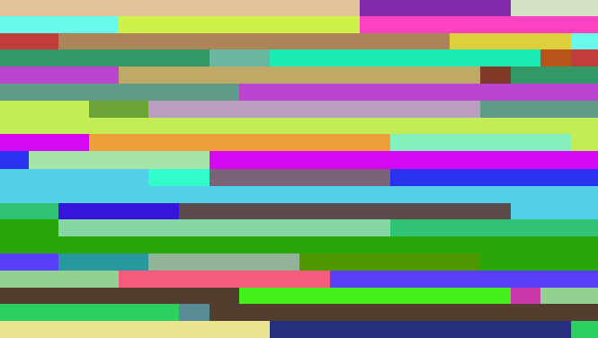

Shader层面的实现则分为两个主要部分，分别是uv偏移，以及可选的基于废弃帧的插值不足：

	half4 Frag(VaryingsDefault i): SV_Target
	{
		// 基础数据准备
		 half4 stripNoise = SAMPLE_TEXTURE2D(_NoiseTex, sampler_NoiseTex, i.texcoord);
		 half threshold = 1.001 - _Indensity * 1.001;

		// uv偏移
		half uvShift = step(threshold, pow(abs(stripNoise.x), 3));
		float2 uv = frac(i.texcoord + stripNoise.yz * uvShift);
		half4 source = SAMPLE_TEXTURE2D(_MainTex, sampler_MainTex, uv);

        #ifndef NEED_TRASH_FRAME
		    return source;
        #endif 	

		// 基于废弃帧插值
		half stripIndensity = step(threshold, pow(abs(stripNoise.w), 3)) * _StripColorAdjustIndensity;
		half3 color = lerp(source, _StripColorAdjustColor, stripIndensity).rgb;
		return float4(color, source.a);
	}

得到的不进行废弃帧插值的渲染表现如下：

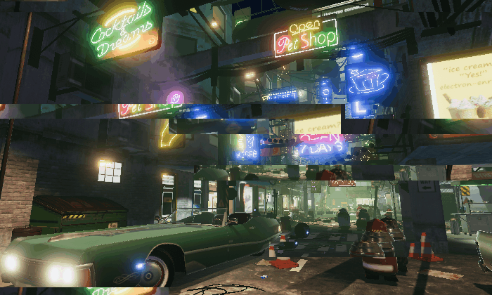

进行废弃帧插值的渲染表现如下。除了下图中采用的类似反色的偏移颜色，也可以实现出基于RGB颜色随机，或者进行颜色空间转换后的色度校正后的偏移颜色：

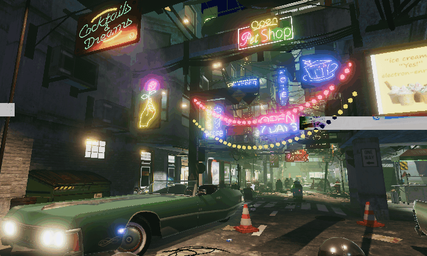

数字条纹故障（Digital Stripe Glitch）后处理完整的实现源码可见：

<https://github.com/QianMo/X-PostProcessing-Library/tree/master/Assets/X-PostProcessing/Effects/GlitchDigitalStripe>

 

# 七、模拟噪点故障（Analog Noise Glitch）

模拟噪点故障（Analog Noise
Glitch）的主要思路，在于用noise去扰动原先场景图的颜色值。一种常规实现的核心代码如下：

    float noiseX = randomNoise(_TimeX * _Speed + i.texcoord / float2(-213, 5.53));
    float noiseY = randomNoise(_TimeX * _Speed - i.texcoord / float2(213, -5.53));
    float noiseZ = randomNoise(_TimeX * _Speed + i.texcoord / float2(213, 5.53));

    sceneColor.rgb += 0.25 * float3(noiseX,noiseY,noiseZ) - 0.125;

需要注意，0.25 * float3(noiseX,noiseY,noiseZ) - 0.125这句代码中的系数0.25和-0.125的作用，是让noise扰动后的画面的平均亮度和原先场景场景图相同，不能省略。但0.25和0.125两个系数可以进行合适的等幅度缩放，相对比例不变即可。

通过以上代码，可以得到如下带非均匀噪声的渲染表现：

另外，还可以加入greyScale灰度抖动，当某一刻的随机强度值大于亮度抖动阈值时，将原先的RGB颜色对应的luminance强度，呈现出黑白灰度的表现：

    half luminance = dot(noiseColor.rgb, fixed3(0.22, 0.707, 0.071));
    if (randomNoise(float2(_TimeX * _Speed, _TimeX * _Speed)) > _LuminanceJitterThreshold)
    {
        noiseColor = float4(luminance, luminance, luminance, luminance);
    }

最终，将noise扰动和随机灰度抖动两个特性相结合，得到Glitch Analog Noise最终的渲染表现：

模拟噪点故障（Analog Noise Glitch）完整的实现源码可见：

<https://github.com/QianMo/X-PostProcessing-Library/tree/master/Assets/X-PostProcessing/Effects/GlitchAnalogNoise>

 

# 八、屏幕跳跃故障（Screen Jump Glitch）

屏幕跳跃故障（Screen Jump Glitch）的算法原理在于取经过时间校正后的uv数值的小数部分，并于原始uv插值，得到均匀梯度式扰动屏幕空间uv，再用此uv进行采样即可得到跳动画面的表现。核心实现Shader代码如下：

	half4 Frag_Vertical(VaryingsDefault i): SV_Target
	{
		
		float jump = lerp(i.texcoord.y, frac(i.texcoord.y + _JumpTime), _JumpIndensity);		
		half4 sceneColor = SAMPLE_TEXTURE2D(_MainTex, sampler_MainTex, frac(float2(i.texcoord.x, jump)));	
		return sceneColor;
	}

其中，扰动后的uv强度分布，随时间变化的数值如下：

基于此uv进行采样，得到的渲染表现如下：

以上为竖直方向的阶梯式uv采样，当然，我们也可以进行水平方向的阶梯式采样：

	half4 Frag_Horizontal(VaryingsDefault i): SV_Target
	{		
		float jump = lerp(i.texcoord.x, frac(i.texcoord.x + _JumpTime), _JumpIndensity);	
		half4 sceneColor = SAMPLE_TEXTURE2D(_MainTex, sampler_MainTex, frac(float2(jump, i.texcoord.y)));		
		return sceneColor;
	}

得到的渲染表现如下：

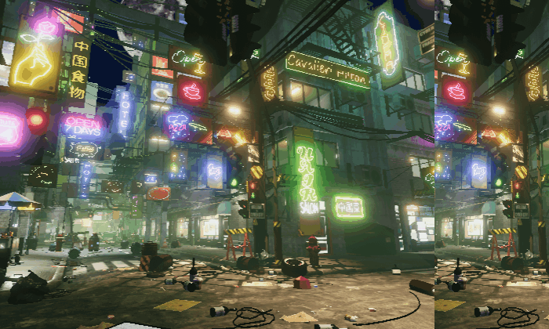

屏幕跳跃故障（Screen Jump Glitch）完整的实现源码可见：

<https://github.com/QianMo/X-PostProcessing-Library/tree/master/Assets/X-PostProcessing/Effects/GlitchScreenJump>

 

# 九、屏幕抖动故障（Screen Shake Glitch）

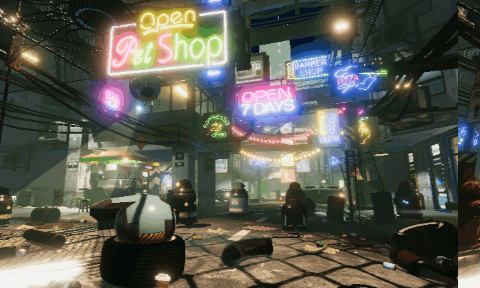

类似上文的Screen Jump，Screen Shake屏幕抖动的算法原理也在于对屏幕空间uv的抖动，但不同的是，Screen Shake屏幕抖动需采用noise噪声函数来随机扰动uv，而不是均匀梯度式的形式。核心实现代码如下：

	half4 Frag_Horizontal(VaryingsDefault i): SV_Target
	{
		float shake = (randomNoise(_Time.x, 2) - 0.5) * _ScreenShake;
		
		half4 sceneColor = SAMPLE_TEXTURE2D(_MainTex, sampler_MainTex, frac(float2(i.texcoord.x + shake, i.texcoord.y)));
		
		return sceneColor;
	}

得到扰动uv的可视化强度值如下：

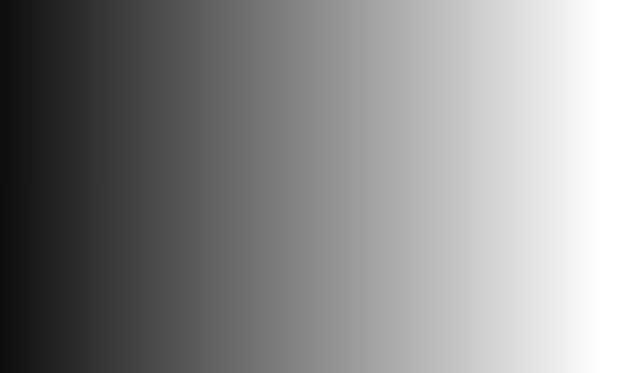

渲染表现则如下：

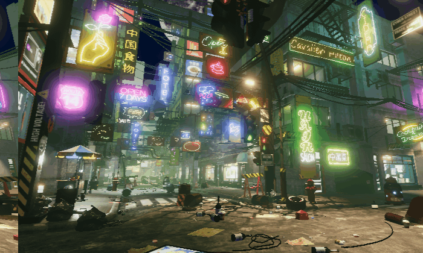

同样，也可以做竖直方向的抖动：

	half4 Frag_Vertical(VaryingsDefault i): SV_Target
	{
		
		float shake = (randomNoise(_Time.x, 2) - 0.5) * _ScreenShake;
		
		half4 sceneColor = SAMPLE_TEXTURE2D(_MainTex, sampler_MainTex, frac(float2(i.texcoord.x, i.texcoord.y + shake)));
		
		return sceneColor;
	}

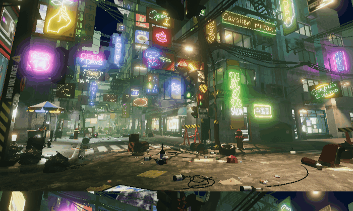

屏幕抖动故障（Screen Shake Glitch）完整的实现源码可见：

<https://github.com/QianMo/X-PostProcessing-Library/tree/master/Assets/X-PostProcessing/Effects/GlitchScreenShake>

 

# 十、波动抖动故障（Wave Jitter Glitch）

波动抖动故障（Wave Jitter Glitch）相较于上述的9种Glitch算法而言，用到了更为复杂的噪声生成函数。

## 10.1 噪声生成函数库 XNoiseLibrary

对此，XPL参考了[paper《Simplex noise demystified 》](http://www.itn.liu.se/\~stegu/simplexnoise/simplexnoise.pdf)、[webgl-noise库](https://github.com/ashima/webgl-noise)和[NoiseShader库](https://github.com/keijiro/NoiseShader)，实现一个单文件版的多维度噪声生成库 **[[XNoiseLibrary](https://github.com/QianMo/X-PostProcessing-Library/blob/master/Assets/X-PostProcessing/Shaders/XNoiseLibrary.hlsl)]**。

XNoiseLibrary具有如下三种类型的Noise噪声生成函数：

-   2D/3D/4D Simplex Noise

-   2D/3D textureless classic Noise

-   Re-oriented 4 / 8-Point BCC Noise

XNoiseLibrary的优势在于使用较为方便，直接include单个文件XNoiseLibrary.hlsl即可进行其中封装的多版本噪声函数的调用。

XNoiseLibrary的实现源码可见：

<https://github.com/QianMo/X-PostProcessing-Library/blob/master/Assets/X-PostProcessing/Shaders/XNoiseLibrary.hlsl>

 

# 10.2 波动抖动故障（Wave Jitter Glitch）的实现算法

OK，回到我们的波动抖动故障（Wave Jitter Glitch）后处理中来。

波动抖动故障（Wave Jitter Glitch）后处理的核心思路是用双层的noise实现波浪形扭动uv，核心代码如下：

    float uv_y = i.texcoord.y * _Resolution.y;
    float noise_wave_1 = snoise(float2(uv_y * 0.01, _Time.y * _Speed * 20)) * (strength * _Amount * 32.0);
    float noise_wave_2 = snoise(float2(uv_y * 0.02, _Time.y * _Speed * 10)) * (strength * _Amount * 4.0);
    float noise_wave_x = noise_wave_1 / _Resolution.x;
    float uv_x = i.texcoord.x + noise_wave_x;

    float4 color = SAMPLE_TEXTURE2D(_MainTex, sampler_MainTex, float2(uv_x, i.texcoord.y));

若是单层的noise波浪，表现力会稍弱，具体表现如下：

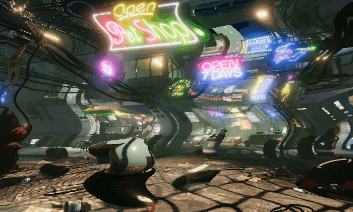

而双层的noise波浪，表现力更强，具体表现如下：

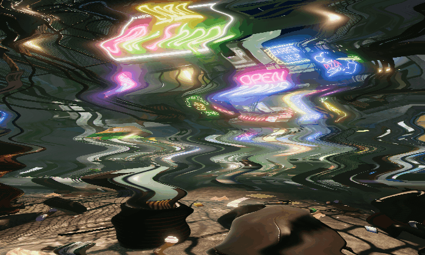

所以XPL中的Wave Jitter实现，采用了双层的形式。

有了基于双层noise的Wave Jitter Glitch表现，还可以加上RGB Split算法，进一步提升表现力：

	float4 Frag_Horizontal(VaryingsDefault i): SV_Target
	{
		half strength = 0.0;
		#if USING_FREQUENCY_INFINITE
			strength = 1;
		#else
			strength = 0.5 + 0.5 *cos(_Time.y * _Frequency);
		#endif
		
		// Prepare UV
		float uv_y = i.texcoord.y * _Resolution.y;
		float noise_wave_1 = snoise(float2(uv_y * 0.01, _Time.y * _Speed * 20)) * (strength * _Amount * 32.0);
		float noise_wave_2 = snoise(float2(uv_y * 0.02, _Time.y * _Speed * 10)) * (strength * _Amount * 4.0);
		float noise_wave_x = noise_wave_1 * noise_wave_2 / _Resolution.x;
		float uv_x = i.texcoord.x + noise_wave_x;

		float rgbSplit_uv_x = (_RGBSplit * 50 + (20.0 * strength + 1.0)) * noise_wave_x / _Resolution.x;

		// Sample RGB Color
		half4 colorG = SAMPLE_TEXTURE2D(_MainTex, sampler_MainTex, float2(uv_x, i.texcoord.y));
		half4 colorRB = SAMPLE_TEXTURE2D(_MainTex, sampler_MainTex, float2(uv_x + rgbSplit_uv_x, i.texcoord.y));
		
		return  half4(colorRB.r, colorG.g, colorRB.b, colorRB.a + colorG.a);
	}

得到的渲染表现如下：

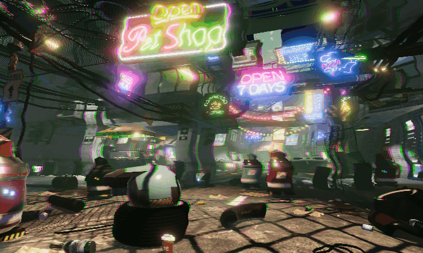

当然，除了横向的Wave Jitter，纵向的Wave Jitter也具有不错的效果：

波动抖动故障（Wave Jitter Glitch） 后处理特效可调参数也比较丰富，XPL内实现的此特效的可调参数面板如下：

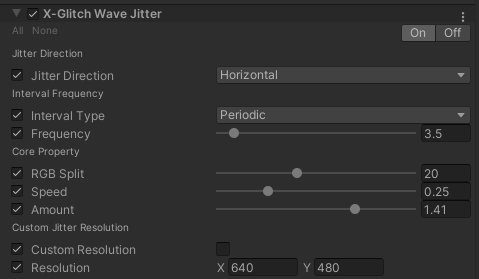

波动抖动故障（Wave Jitter Glitch）详细的实现源码，可见：

<https://github.com/QianMo/X-PostProcessing-Library/tree/master/Assets/X-PostProcessing/Effects/GlitchWaveJitter>

 

# 总结

故障艺术追求“故障”带来的独特美感。近年来，故障艺术已经成为了赛博朋克风格电影和游戏作品中的核心艺术风格之一。而随着各种相关影视作品和游戏作品的不断发布，故障艺术的表现风格也引起了电商、综艺、快消等行业的广泛效仿。

在看完上述十种不同的故障艺术算法后，我们可以提炼一下，若要在屏幕空间实现故障艺术风格的渲染表现，算法核心在于四点：

-   **噪声函数的选择**：噪声函数是生成各式的干扰信号的源头。

-   **uv抖动方式的选择**：将噪声函数作用于屏幕空间uv后，基于新的uv进行采样，以产生故障的抖动表现。

-   **采样通道的选择**：对RGB分别采样，或者选取特定通道进行采样，以实现多种风格的故障表现。

-   **颜色空间的转换**：善用YUV、CMY、HSV、YIQ、YCbCr
    、YC1C2等空间与RGB空间之间的转换，以实现多种风格的故障表现。

熟知上述四种故障艺术的算法要点，加上一点创意，配合周边算法，则可以创造出更多富有表现力的故障艺术特效。

 

# Reference

[1] Jackson R. The Glitch Aesthetic[J]. 2011.
https://scholarworks.gsu.edu/cgi/viewcontent.cgi?article=1081&context=communication_theses

[2] den Heijer E. Evolving glitch art[C]//International Conference on
Evolutionary and Biologically Inspired Music and Art. Springer, Berlin,
Heidelberg, 2013: 109-120.

[3] https://zh.wikipedia.org/wiki/%E8%B5%9B%E5%8D%9A%E6%9C%8B%E5%85%8B

[4] https://github.com/keijiro/KinoGlitch

[5] https://github.com/ashima/webgl-noise

[6] https://github.com/keijiro/NoiseShader

[7] https://wallpaperswise.com/new-20-blade-runner-wallpapers/

[8] http://www.itn.liu.se/\~stegu/simplexnoise/simplexnoise.pdf

[9] 题图来自《Cyberpunk 2077》
