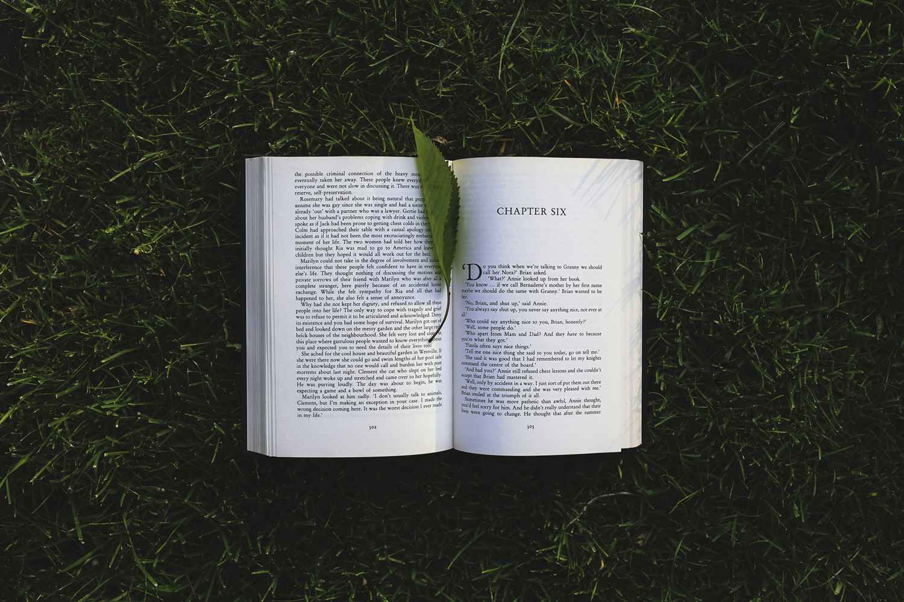

这是一个收集了我个人在阅读游戏开发相关经典著作过程中所做的读书笔记的repo。涉及图形学、实时渲染、GPU编程、设计模式、软件工程等内容。

# 目录

## 01、渲染与图形学相关
- [《Real-Time Rendering 3rd》读书笔记](https://github.com/QianMo/Programming-Reading-Notes/tree/master/%E3%80%8AReal-Time%20Rendering%203rd%E3%80%8B%E8%AF%BB%E4%B9%A6%E7%AC%94%E8%AE%B0)
-《Real-Time Rendering
3rd》可谓图形学界“九阴真经总纲”一般的存在，当世武功的心法口诀，尽数记载。此读书笔记是对这本神作一个系统而有特色的总结提炼。
- [《GPU 编程与CG 语言之阳春白雪下里巴人》读书笔记](https://github.com/QianMo/Game-Dev-Reading-Notes/tree/master/%E3%80%8AGPU%20%E7%BC%96%E7%A8%8B%E4%B8%8ECG%20%E8%AF%AD%E8%A8%80%E4%B9%8B%E9%98%B3%E6%98%A5%E7%99%BD%E9%9B%AA%E4%B8%8B%E9%87%8C%E5%B7%B4%E4%BA%BA%E3%80%8B%E8%AF%BB%E4%B9%A6%E7%AC%94%E8%AE%B0)
-GPU 编程与Shader、CG编程的入门良书。
 

## 02、设计模式与架构相关

- [《游戏编程模式》读书笔记](https://github.com/QianMo/Reading-Notes/tree/master/%E3%80%8A%E6%B8%B8%E6%88%8F%E7%BC%96%E7%A8%8B%E6%A8%A1%E5%BC%8F%E3%80%8B%E8%AF%BB%E4%B9%A6%E7%AC%94%E8%AE%B0)
-一篇超过万字读书笔记，总结了《游戏编程模式》一书中所有章节与内容的知识梗概。
 

## 03、编程实践与软件工程相关

- [《代码整洁之道（Clean Code)》读书笔记](https://github.com/QianMo/Reading-Notes/tree/master/%E3%80%8A%E4%BB%A3%E7%A0%81%E6%95%B4%E6%B4%81%E4%B9%8B%E9%81%93%E3%80%8B%E8%AF%BB%E4%B9%A6%E7%AC%94%E8%AE%B0)
-代码的整洁之道。
- [《Effective C# 第二版》读书笔记](https://github.com/QianMo/Reading-Notes/tree/master/%E3%80%8AEffective%20C%23%20%E7%AC%AC%E4%BA%8C%E7%89%88%E3%80%8B%E8%AF%BB%E4%B9%A6%E7%AC%94%E8%AE%B0)
-更好的使用C#。

 
 
持续更新中。

