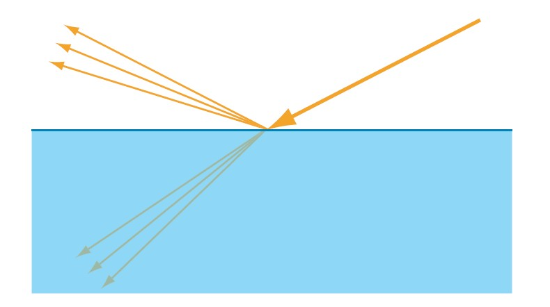
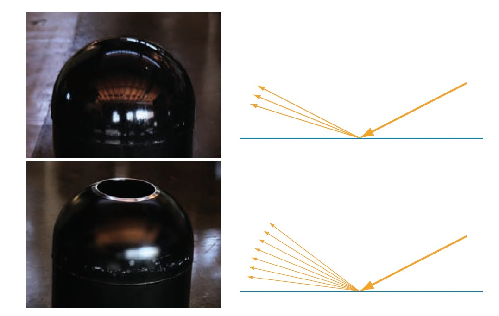
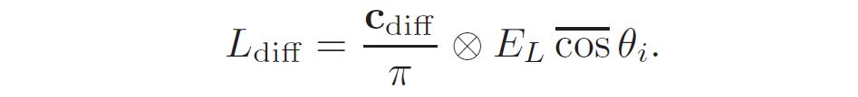
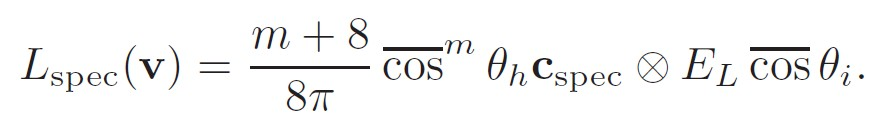
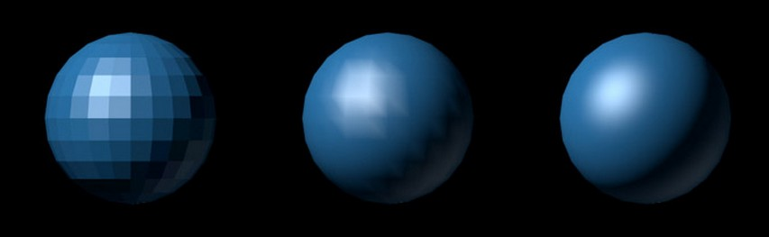

# 【《Real-Time Rendering 3rd》 提炼总结】(四) 第五章 · 图形渲染与视觉外观 The Visual Appearance

这篇文章将总结和提炼《Real-Time Rendering 3rd》（实时渲染图形学第三版）的第五章“Visual Appearance（视觉外观）”的内容。

# 壹·导读

当我们渲染三维模型的图像时，模型不仅要有适当的几何形状，还应该有所需的视觉外观。《Real-Time
Rendering
3rd》第五章内容，讨论光照和材质在现实世界的表现，关于光照和表面模型，着色方程，以及渲染出真实外观的一些额外技术。

简而言之，通过阅读这篇总结式文章，你将对图形渲染中的以下要点有所了解：

-   渲染与视觉物理现象

-   光照与材质

-   着色原理

-   抗锯齿

-   透明渲染

-   伽玛校正

当然，本文作为总结式文章，知识点会相对密集，很多地方对细节并不可能展开描述，对一些地方不太理解的朋友，自然还是推荐是去阅读《Real-Time
Rendering 3rd》的对应原文与相应文献。

 

# 贰·渲染与视觉物理现象

当渲染类似图1中的逼真场景时，可以帮助了解渲染相关的物理现象。一般情况，这些物理现象分为三种：

-   太阳光与其他光源（天然或人造光）发出光。

-   光与场景中的物体相互作用。部分被吸收；部分散射开来，向新的方向传播。

-   最终，光被传感器（人眼，电子传感器）吸收。

图1 光源与各种物体交互的卧室照片

而在图1中，我们可以看到所有的如上三种物理现象：

-   光线从灯光发出并直接传播给房间里其他物体。

-   物体表面吸收一些物体，并将一些物体散射到新的方向。没有被吸收的光线继续在环境中移动，遇到其他物体。

-   通过场景的光一小部分光进入用于捕获图像的传感器（如摄像机）。

叁·光照与材质

-   关于光源的特性。光被不同地模拟为几何光线，电磁波或光子（具有一些波特性的量子粒子）。无论如何处理，光都是电磁辐射能-通过空间传播的电磁能。光源发光，而不是散射或吸收光。根据渲染目的，光源可以以许多不同的方式来表示。光源可以分为三种不同类型：平行光源、点光源和聚光灯。

-   关于材质的特性。在渲染中，通过将材质附加到场景中的模型来描绘对象外观。每个材质都和一系列的Shader代码，纹理，和其他属性联系在一起，用来模拟光与材质相互作用。

## 3.1 光照现象：散射与吸收

-   从根本上来说，所有的光物质相互作用都是两种现象的结果：
    散射（scattering）和吸收（absorption）。

-   散射（scattering）发生在当光线遇到任何种类的光学不连续性（optical
    discontinuity）时，可能存在于具有不同光学性质的两种物质分界之处，晶体结构破裂处，密度的变化处等。散射不会改变光量，它只是使其改变方向。光的散射（scattering）一般又分为反射（reflection）和折射（refraction）。

图2 光的散射（scattering）——反射（reflection）和折射（refraction）

-   吸收（absorption）发生在物质内部，其会导致一些光转变成另一种能量并消失。
    吸收会减少光量，但不会影响其方向。

图3 反射（reflected light）和透射光（transmitted light）的相互作用

-   镜面反射光表示在表面反射的光。而漫反射光表示经历透射（transmission），吸收（absorption）和散射（scattering）
    的光。

-   入射光（Incoming
    illumination）通过表面辉度（irradiance）来度量。而出射光（outgoing
    light）通过出射率（exitance）来度量，类似于辉度是每单位面积的能量。光物质相互作用是线性的;
    使辉度加倍将会使出射率增加一倍。出射率除以辉度可以作为材质的衡量特性。对于不发光的表面，该比率为0到1之间。出射率和辉度的比率对于不同的光颜色是不同的，所以其表示为RGB矢量或者颜色，也就是我们通常说的表面颜色c。

 

## 3.2 表面粗糙度

-   镜面反射项的方向分布取决于表面粗糙度（smoothness，又译作光滑度）。反射光线对于更平滑的表面更加紧密，并且对于较粗糙的表面更加分散。我们可以看到下图中的这种依赖关系，它显示了不同粗糙度的两个表面的反射效果。

图4 光在粗糙度不同表面的反射

 

# 肆·着色

## 4.1 着色与着色方程

着色（Shade）是使用方程式根据材质属性和光源，计算沿着视线v的出射光亮度*Lo*的过程。我们使用的着色方程具有漫反射和镜面反射分量。

### 4.1.1 着色方程的漫反射分量

其中漫反射分量较为简单，书中推导出的对Ldiff的着色方程如下：
 
 

    

这种类型的漫反射着色也被叫做兰伯特（Lambertian）着色。兰伯特定律指出，对于理想的漫反射表面，出射光亮度与cosθi成正比。注意，这种夹紧型cos因子（clamped
dot product，可写作max(n·l,
0)，通常称为n点乘l因子），不是兰伯特表面的特征;正如我们所见，它一般适用于辉度（irradiance）的度量。兰伯特表面的决定性特征是出射光亮度（radiance）和辉度（irradiance）成正比。

#### 4.1.2 着色方程的镜面反射分量

原书中推导出的镜面反射项的着色方程：

    

#### 4.1.3 着色方程

组合漫反射和镜面反射两个项，得到完整的着色方程，总出射光亮度Lo：

    

这个着色方程与“Blinn-Phong”方程类似，“Blinn-Phong”方程是Blinn在1977年首次提出的。主要形式如下：

    

## 4.2 三种着色处理方法

着色处理是计算光照并由此决定像素颜色的过程，存在3种常见的着色处理方法：平滑着色、高洛德着色与冯氏着色。

-   平滑着色（Flat
    shading）：简单来讲，就是一个三角面用同一个颜色。如果一个三角面的代表顶点(也许是按在index中的第一个顶点)，恰好被光照成了白色，那么整个面都会是白的。

-   高洛德着色（Gouraud
    shading）：每顶点求值后的线性插值结果通常称为高洛德着色。在高洛德着色的实现中，顶点着色器传递世界空间的顶点法线和位置到Shade(
    )
    (首先确保法线矢量长度为1），然后将结果写入内插值。像素着色器将获取内插值并将其直接写入输出。
    高洛德着色可以为无光泽表面产生合理的结果，但是对于强高光反射的表面

-   冯氏着色（Phong
    shading）：冯氏着色是对着色方程进行完全的像素求值。在冯氏着色实现中，顶点着色器将世界空间法线和位置写入内插值，此值通过像素着色器传递给Shade(
    )函数。而将Shade(
    )函数返回值写入到输出中。请注意，即使表面法线在顶点着色器中缩放为长度1，插值也可以改变其长度，因此可能需要在像素着色器中再次执行此归一化操作。

图5 从左到右，平面着色（Flat shading），高洛德着色（ Gouraud shading）,
和冯氏着色（Phong shading）

-   注意Phong Shading和Phong Lighting
    Model的区别，前者是考虑如何在三个顶点中填充颜色，而后者表示的是物体被光照产生的效果。

-   注意冯氏着色可以说是三者中最接近真实的着色效果，当然开销也是最大的。因为高洛德着色是每个顶点(vertex)计算一次光照，冯氏着色是每个片元(fragment)或者说每像素计算一次光照，点的法向量是通过顶点的法向量插值得到的。所以说不会出现高洛德着色也许会遇到的失真问题。

 

# 伍·抗锯齿与常见抗锯齿类型总结

抗锯齿（英语：anti-aliasing，简称AA），也译为边缘柔化、消除混叠、抗图像折叠有损，反走样等。它是一种消除显示器输出的画面中图物边缘出现凹凸锯齿的技术，那些凹凸的锯齿通常因为高分辨率的信号以低分辨率表示或无法准确运算出3D图形坐标定位时所导致的图形混叠（aliasing）而产生的，抗锯齿技术能有效地解决这些问题。

下面将常见的几种抗锯齿类型进行总结介绍，也包括RTR3中没有讲到的，最近几年新提出的常见抗锯齿类型。

## 5.1 超级采样抗锯齿（SSAA）

超级采样抗锯齿（Super-Sampling
Anti-Aliasing，简称SSAA）是比较早期的抗锯齿方法，比较消耗资源，但简单直接。这种抗锯齿方法先把图像映射到缓存并把它放大，再用超级采样把放大后的图像像素进行采样，一般选取2个或4个邻近像素，把这些采样混合起来后，生成的最终像素，令每个像素拥有邻近像素的特征，像素与像素之间的过渡色彩，就变得近似，令图形的边缘色彩过渡趋于平滑。再把最终像素还原回原来大小的图像，并保存到帧缓存也就是显存中，替代原图像存储起来，最后输出到显示器，显示出一帧画面。这样就等于把一幅模糊的大图，通过细腻化后再缩小成清晰的小图。如果每帧都进行抗锯齿处理，游戏或视频中的所有画面都带有抗锯齿效果。
超级采样抗锯齿中使用的采样法一般有两种：

-   OGSS，顺序栅格超级采样（Ordered Grid
    Super-Sampling，简称OGSS），采样时选取2个邻近像素。

-   RGSS，旋转栅格超级采样（Rotated Grid
    Super-Sampling，简称RGSS），采样时选取4个邻近像素。

另外，作为概念上最简单的一种超采样方法，全场景抗锯齿（Full-Scene
Antialiasing,FSAA）以较高的分辨率对场景进行绘制，然后对相邻的采样样本进行平均，从而生成一幅新的图像。

## 5.2 多重采样抗锯齿（MSAA）

多重采样抗锯齿（Multi Sampling
Anti-Aliasing，简称MSAA），是一种特殊的超级采样抗锯齿（SSAA）。MSAA首先来自于OpenGL。具体是MSAA只对Z缓存（Z-Buffer）和模板缓存(Stencil
Buffer)中的数据进行超级采样抗锯齿的处理。可以简单理解为只对多边形的边缘进行抗锯齿处理。这样的话，相比SSAA对画面中所有数据进行处理，MSAA对资源的消耗需求大大减弱，不过在画质上可能稍有不如SSAA。

## 5.3 覆盖采样抗锯齿（CSAA）

覆盖采样抗锯齿（Coverage Sampling
Anti-Aliasing，简称CSAA）是NVIDIA在G80及其衍生产品首次推向实用化的AA技术，也是目前NVIDIA
GeForce
8/9/G200系列独享的AA技术。CSAA就是在MSAA基础上更进一步的节省显存使用量及带宽，简单说CSAA就是将边缘多边形里需要取样的子像素坐标覆盖掉，把原像素坐标强制安置在硬件和驱动程序预先算好的坐标中。这就好比取样标准统一的MSAA，能够最高效率的执行边缘取样，效能提升非常的显著。比方说16xCSAA取样性能下降幅度仅比4xMSAA略高一点，处理效果却几乎和8xMSAA一样。8xCSAA有着4xMSAA的处理效果，性能消耗却和2xMSAA相同。

## 5.4 高分辨率抗锯齿（HRAA）

高分辨率抗锯齿方法(High Resolution
Anti-Aliasing，简称HRAA)，也称Quincunx方法，也出自NVIDIA公司。“Quincunx”意思是5个物体的排列方式，其中4个在正方形角上，第五个在正方形中心，也就是梅花形，很像六边模型上的五点图案模式。此方法中，采样模式是五点梅花状，其中四个样本在像素单元的角上，最后一个在中心。

## 5.5 可编程过滤抗锯齿（CFAA）

可编程过滤抗锯齿（Custom Filter
Anti-Aliasing，简称CFAA）技术起源于AMD-ATI的R600家庭。简单地说CFAA就是扩大取样面积的MSAA，比方说之前的MSAA是严格选取物体边缘像素进行缩放的，而CFAA则可以通过驱动和谐灵活地选择对影响锯齿效果较大的像素进行缩放，以较少的性能牺牲换取平滑效果。显卡资源占用也比较小。

## 5.6 形态抗锯齿（MLAA）

形态抗锯齿（Morphological
Anti-Aliasing，简称MLAA），是AMD推出的完全基于CPU处理的抗锯齿解决方案。与MSAA不同，
MLAA将跨越边缘像素的前景和背景色进行混合，用第2种颜色来填充该像素，从而更有效地改进图像边缘的变现效果。

## 5.7 快速近似抗锯齿（FXAA）

快速近似抗锯齿(Fast Approximate Anti-Aliasing，简称FXAA)
，是传统MSAA(多重采样抗锯齿)效果的一种高性能近似。它是一种单程像素着色器，和MLAA一样运行于目标游戏渲染管线的后期处理阶段，但不像后者那样使用DirectCompute，而只是单纯的后期处理着色器，不依赖于任何GPU计算API。正因为如此，FXAA技术对显卡没有特殊要求，完全兼容NVIDIA、AMD的不同显卡(MLAA仅支持A卡)和DirectX
9.0、DirectX 10、DirectX 11。

## 5.8 时间性抗锯齿（TXAA）

时间性抗锯齿（Temporal Anti-Aliasing，简称TXAA），将
MSAA、时间滤波以及后期处理相结合，用于呈现更高的视觉保真度。与CG电影中所采用的技术类似，TXAA集MSAA的强大功能与复杂的解析滤镜于一身，可呈现出更加平滑的图像效果。此外，TXAA还能够对帧之间的整个场景进行抖动采样，以减少闪烁情形，闪烁情形在技术上又称作时间性锯齿。目前，TXAA有两种模式：TXAA
2X和TXAA 4X。TXAA 2X可提供堪比8X MSAA的视觉保真度，然而所需性能却与2X
MSAA相类似；TXAA 4X的图像保真度胜过8XMSAA，所需性能仅仅与4X MSAA相当。

## 5.9 多帧采样抗锯齿（MFAA）

多帧采样抗锯齿（Multi-Frame Sampled Anti-Aliasing，MFAA）是
NVIDIA公司根据MSAA改进出的一种抗锯齿技术。目前仅搭载 Maxwell
架构GPU的显卡才能使用。可以将MFAA理解为MSAA的优化版，能够在得到几乎相同效果的同时提升性能上的表现。MFAA与MSAA最大的差别就在于在同样开启4倍效果的时候MSAA是真正的针对每个边缘像素周围的4个像素进行采样，MFAA则是仅仅只是采用交错的方式采样边缘某个像素周围的两个像素。

 

# 陆·透明渲染与透明排序

## 6.1 透明渲染

透明渲染是是图形学里面的常见问题之一，可以从《Real-Time Rendering
3rd》中总结出如下两个算法：

-   Screen-Door
    Transparency方法。基本思想是用棋盘格填充模式来绘制透明多边形，也就是说，以每隔一个像素绘制一点方式的来绘制一个多边形，这样会使在其后面的物体部分可见，通常情况下，屏幕上的像素比较紧凑，以至于棋盘格的这种绘制方式并不会露馅。同样的想法也用于剪切纹理的抗锯齿边缘，但是在子像素级别中的，这是一种称为alpha覆盖（alpha
    to coverage）的特征。screen-door
    transparency方法的优点就是简单，可以在任何时间任何顺序绘制透明物体，并不需要特殊的硬件支持（只要支持填充模式）。缺点是透明度效果仅在50%时最好，且屏幕的每个区域中只能绘制一个透明物体。

-   Alpha混合（Alpha
    Blending）方法。这个方法比较常见，其实就是按照Alpha混合向量的值来混合源像素和目标像素。当在屏幕上绘制某个物体时，与每个像素相关联的值有RGB颜色和Z缓冲深度值，以及另外一个成分alpha分量，这个alpha值也可以根据需要生成并存储，它描述的是给定像素的对象片段的不透明度的值。
    alpha为1.0表示对象不透明，完全覆盖像素所在区域;
    0.0表示像素完全透明。为了使对象透明，在现有场景的上方，以小于1的透明度进行绘制即可。每个像素将从渲染管线接收到一个RGBA结果，并将这个值和原始像素颜色相混合。

 

## 6.2 透明排序

要将透明对象正确地渲染到场景中，通常需要对物体进行排序。下面分别介绍两种比较基本的透明排序方法（深度缓存和油画家算法）和两种高级别的透明排序算法（加权平均值算法和深度剥离）。

### 6.2.1 深度缓存（Z-Buffer）

Z-Buffer也称深度缓冲。在计算机图形学中，深度缓冲是在三维图形中处理图像深度坐标的过程，这个过程通常在硬件中完成，它也可以在软件中完成，它是可见性问题的一个解决方法。可见性问题是确定渲染场景中哪部分可见、哪部分不可见的问题。

Z-buffer的限制是每像素只存储一个对象。如果一些透明对象与同一个像素重叠，那么单独的Z-buffer就不能存储并且稍后再解析出所有可见对象的效果。这个问题是通过改变加速器架构来解决的，比如用A-buffer。A-buffer具有“深度像素（deep
pixels）”，其可以在单个像素中存储一系列呈现在所有对象之后被解析为单个像素颜色的多个片段。但需注意，Z-buffer是市场的主流选择。

### 6.2.2 画家算法（Painter's Algorithm）

画家算法也称优先填充算法，效率虽然较低，但还是可以有效处理透明排序的问题。其基本思想是按照画家在绘制一幅画作时，首先绘制距离较远的场景，然后用绘制距离较近的场景覆盖较远的部分的思想。画家算法首先将场景中的多边形根据深度进行排序，然后按照顺序进行描绘。这种方法通常会将不可见的部分覆盖，这样就可以解决可见性问题。

### 6.2.3 加权平均值算法（Weighted Average）

使用简单的透明混合公式来实现无序透明渲染的算法，它通过扩展透明混合公式，来实现无序透明物件的渲染，从而得到一定程度上逼真的结果。

### 6.2.4 深度剥离算法（Depth Peeling）

深度剥离是一种对深度值进行排序的技术。它的原理比较直观，标准的深度检测使场景中的Z值最小的点输出到屏幕上，就是离我们最近的顶点。但还有离我们第二近的顶点，第三近的顶点存在。要想显示它们，可以用多遍渲染的方法。第一遍渲染时，按照正常方式处理，这样就得到了离我们最近的表面中的每个顶点的z值。在第二遍渲染时，把现在每个顶点的深度值和刚才的那个深度值进行比较，凡是小于等于第一遍得到的z值，把它们剥离，后面的过程依次类推即可。

图6
每个深度剥离通道渲染特定的一层透明通道。左侧是第一个Pass，直接显示眼睛可见的层，中间的图显示了第二层，显示了每个像素处第二靠近透明表面的像素。右边的图是第三层，每个像素处第三靠近透明表面的像素。

 

# 柒·伽玛校正

伽马校正（Gamma correction） 又叫伽马非线性化（gamma
nonlinearity），伽马编码（gamma encoding）
或直接叫伽马（gamma），是用来对光线的辉度（luminance）或是三色刺激值（tristimulus
values）所进行非线性的运算或反运算的一种操作。为图像进行伽马编码的目的是用来对人类视觉的特性进行补偿，从而根据人类对光线或者黑白的感知，最大化地利用表示黑白的数据位或带宽。

 

# 捌·其他参考

[1] <https://zh.wikipedia.org/wiki/%E5%8F%8D%E9%8B%B8%E9%BD%92>

[2] [如何在Unity中分别实现Flat Shading(平面着色)、Gouraud
Shading(高洛德着色)、Phong
Shading(冯氏着色)](http://www.cnblogs.com/z12603/p/6860730.html)

[3] <http://blog.csdn.net/wang15061955806/article/details/50564035>

[4] <http://blog.csdn.net/xoyojank/article/details/3918091>

[5] [Gouraud shading - Wikipedia](http://en.wikipedia.org/wiki/Gouraud_shading)

[6] [Phong shading - Wikipedia](http://en.wikipedia.org/wiki/Phong_shading)

[7] <http://www.nbb.cornell.edu/neurobio/land/OldStudentProjects/cs490-95to96/guo/report.html>

[8] <https://zh.wikipedia.org/wiki/%E6%B7%B1%E5%BA%A6%E7%BC%93%E5%86%B2>

[9] <https://zh.wikipedia.org/wiki/%E4%BC%BD%E7%91%AA%E6%A0%A1%E6%AD%A3>

[10] 题图来自《刺客信条：枭雄》

The end.
