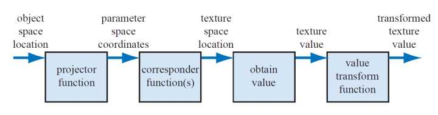
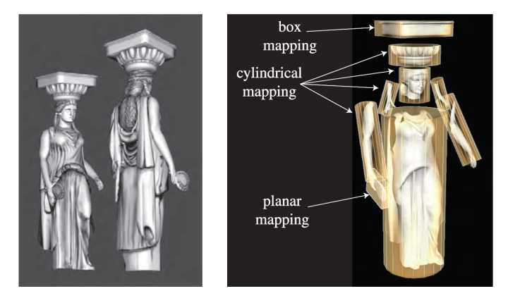
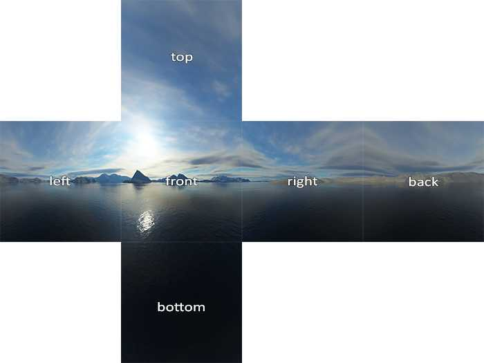
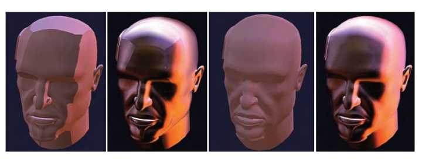
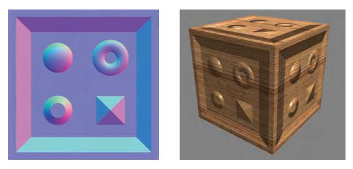
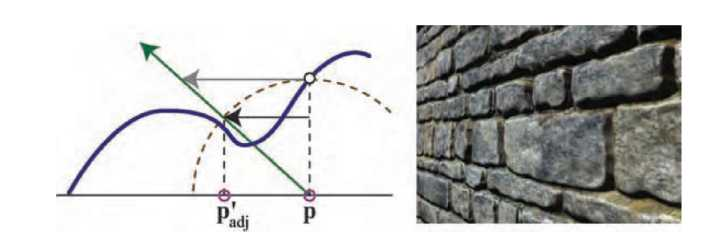
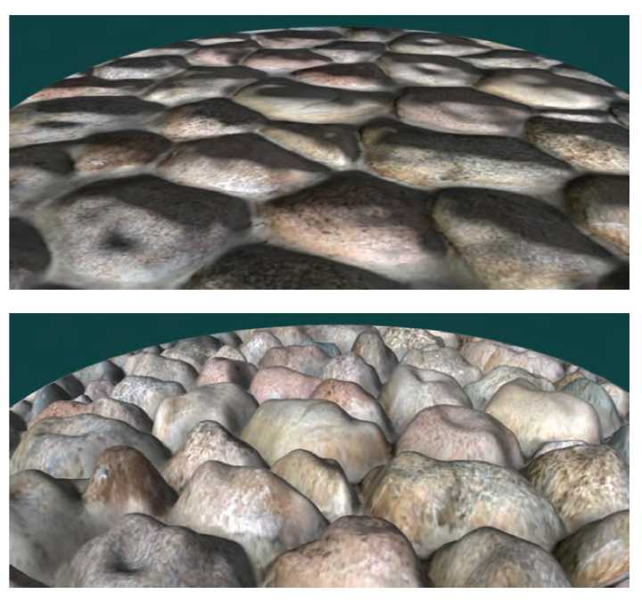

【《Real-Time Rendering 3rd》 提炼总结】(五) 第六章 · 纹理贴图及相关技术
========================================================================

在计算机图形学中，纹理贴图（Texturing）是使用图像、函数或其他数据源来改变物体表面外观的技术。这篇文章，将总结和提炼《Real-Time
Rendering
3rd》（实时渲染图形学第三版）的第六章“Texturing（纹理贴图）”的内容，讲述纹理贴图与其相关技术的方方面面。

简而言之，通过阅读这篇总结式文章，你将对纹理贴图技术中的以下要点有所了解：

-   纹理管线 The Texturing Pipeline

-   投影函数 The Projector Function

-   映射函数 The Corresponder Function

-   体纹理 Volume Texture

-   立方体贴图 Cube Map

-   纹理缓存 Texture Caching

-   纹理压缩 Texture Compression

-   程序贴图纹理 Procedural Texturing

-   Blinn凹凸贴图 Blinn Bump Mapping

-   移位贴图 Displacement Mapping

-   法线贴图 Normal Mapping

-   视差贴图 Parallax Mapping

-   浮雕贴图 Relief Mapping

壹 · 导读
=========

《Real-Time Rendering 3rd》第六章内容“Chapter 6
Texturing”，讨论了纹理贴图的方方面面。在计算机图形学中，纹理贴图是使用图像、函数或其他数据源来改变物体表面外观的技术。例如，可以将一幅砖墙的彩色图像应用到一个多边形上，而不用对砖墙的几何形状进行精确表示。当观察这个多边形的时候，这张彩色图像就出现在多边形所在位置上。只要观察者不接近这面墙，就不会注意到其中几何细节的不足（比如其实砖块和砂浆的图像是显示在光滑的表面上的事实）。通过这种方式将图像和物体表面结合起来，可以在建模、存储空间和速度方面节省很多资源。

图1
一幅使用了纹理颜色贴图、凹凸贴图和视差贴图等方法来增加画面复杂性和真实感的游戏截图（来自《黑暗之魂3》）

贰 · 纹理管线 The Texturing Pipeline
====================================

简单来说，纹理（Texturing）是一种针对物体表面属性进行“建模”的高效技术。图像纹理中的像素通常被称为纹素（Texels），区别于屏幕上的像素。根据Kershaw的术语，通过将投影方程（projector
function）运用于空间中的点
，从而得到一组称为参数空间值（parameter-spacevalues）的关于纹理的数值。这个过程就称为贴图（Mapping，也称映射
）,也就是纹理贴图（Texture Mapping，也称纹理映射
）这个词的由来。纹理贴图可以用一个通用的纹理管线来进行描述。纹理贴图过程的初始点是空间中的一个位置。这个位置可以基于世界空间，但是更常见的是基于模型空间。因为若此位置是基于模型空间的，当模型移动时，其纹理才会随之移动。

如图2 为一个纹理管线（The Texturing
Pipeline），也就是单个纹理应用纹理贴图的详细过程，而此管线有点复杂的原因是每一步均为用户提供了有效的控制。

图2 单个纹理的通用纹理管线

下面是对上图中描述的纹理管线的分步概述：

-   第一步。通过将投影方程（projector function）运用于空间中的点
    ，从而得到一组称为参数空间值（parameter-space values）的关于纹理的数值。

-   第二步。在使用这些新值访问纹理之前，可以使用一个或者多个映射函数（corresponder
    function）将参数空间值（parameter-space values ）转换到纹理空间。

-   第三步。使用这些纹理空间值（texture-space
    locations）从纹理中获取相应的值（obtain
    value）。例如，可以使用图像纹理的数组索引来检索像素值。

-   第四步。再使用值变换函数（value transform
    function）对检索结果进行值变换，最后使用得到的新值来改变表面属性，如材质或者着色法线等等。

而如下这个例子应该对理解纹理管线有所帮助。下例将描述出使用纹理管线，一个多边形在给定一张砖块纹理时在其表面上生成样本时（如图3）发生了哪些过程。

图3 一个砖墙的纹理管线过程

如图3所示，在具体的参考帧画面中找到物体空间中的位置(x,y,z)，如图中点（-2.3,7.1,88.2），然后对该位置运用投影函数。这个投影函数通常将向量(x,y,z)转换为一个二元向量(u,v)。在此示例中使用的投影函数是一个正交投影，类似一个投影仪，将具有光泽的砖墙图像投影到多边形表面上。再考虑砖墙这边，其实这个投影过程就是将砖墙平面上的点变换为值域为0到1之间的一对(u,v)值，如图，(0.32,0.29)就是这个我们通过投影函数得到的uv值。而我们图像的分辨率是256
x 256，所以，将256分别乘以(0.32,0.29)，去掉小数点，得到纹理坐标(81,
74)。通过这个纹理坐标，可以在纹理贴图上查找到坐标对应的颜色值，所以，我们接着找到砖块图像上像素位置为(81,74)处的点，得到颜色(0.9,0.8,0.7)。而由于原始砖墙的颜色太暗，因此可以使用一个值变换函数，给每个向量乘以1.1，就可以得到我们纹理管线过程的结果——颜色值(0.99,0.88,0.77)。

随后，我们就可以将此值用于着色方程，作为物体的漫反射颜色值，替换掉之前的漫反射颜色。

下面对纹理管线中主要的两个组成，投影函数（The Projector
Function）和映射函数（The Corresponder Function）进行概述。

2.1 投影函数 The Projector Function
------------------------------------------------

作为纹理管线的第一步，投影函数的功能就是将空间中的三维点转化为纹理坐标，也就是获取表面的位置并将其投影到参数空间中。

在常规情况下，投影函数通常在美术建模阶段使用，并将投影结果存储于顶点数据中。也就是说，在软件开发过程中，我们一般不会去用投影函数去计算得到投影结果，而是直接使用在美术建模过程中，已经存储在模型顶点数据中的投影结果。但有一些特殊情况，例如：

1、OpenGL的glTexGen函数提供了一些不同的投影函数，包括球形函数和平面函数。利用空闲时间可以让图形加速器来执行投影过程，而这样做的优点是不需要将纹理坐标送往图形加速器，从而可以节省带宽。

2、更一般的情况，
可以在顶点或者像素着色器中使用投影函数，这可以实现各种效果，包括一些动画和一些渲染方法（比如如环境贴图，environment
mapping，有自身特定的投影函数，可以针对每个顶点或者每个像素进行计算）。

通常在建模中使用的投影函数有球形、圆柱、以及平面投影，也可以选其他一些输入作为投影函数。

图4
不同的纹理坐标，上面一行从左到右分别为球形、圆柱、平面，以及自然uv投影：下面一行所示为把不同的投影运用于同一个物体的情形。

非交互式渲染器（Noninteractive
renderers）通常将这些投影方程称为渲染过程本身的一部分。一个单独的投影方程就有可能适用于整个模型，但其实实际上，美术同学不得不使用各种各样的工具将模型进行分割，针对不同的部分，分别使用不同的投影函数。如图5所示。

图5 使用不同的投影函数将纹理以不同的方式投射到同一个模型上

各种常见投影的不同要点：

-   球形投影（The spherical
    projection）。球形投影将点投射到一个中心位于某个点的虚拟球体上，这个投影与Blinn与Newell的环境贴图方法相同。

-   圆柱投影（Cylindrical
    projection）。与球体投影一样，圆柱投影计算的是纹理坐标u，而计算得到的另一个纹理坐标v是沿该圆柱轴线的距离。这种投影方法对具有自然轴的物体比较适用，比如旋转表面，如果表面与圆柱体轴线接近垂直时，就会出现变形。

-   平面投影（The planar
    projection）。平面投影非常类似于x-射线幻灯片投影，它沿着一个方向进行投影，并将纹理应用到物体的所有表面上。这种方法通常使用正交投影，用来将纹理图应用到人物上，其把模型看作一个用纸做的娃娃，将不同的纹理粘贴到该模型的前后。

    

    图6
    雕塑模型上的多个较小纹理，保存在两个较大的纹理上。右图显示了多边形网格如何展开并显示在纹理上的。

2.2 映射函数 The Corresponder Function
------------------------------------------------

映射函数（The Corresponder Function）的作用是将参数空间坐标（parameter-space
coordinates）转换为纹理空间位置（texture space locations）。

我们知道图像会出现在物体表面的(u,v)位置上，且uv值的正常范围在[0,1)范围内。超出这个值域的纹理，其显示方式便可以由映射函数（The
Corresponder Function）来决定。

在OpenGL中，这类映射函数称为“封装模式（Warapping
Mode）”，在Direct3D中，这类函数叫做“寻址模式（Texture Addressing
Mode）”。最常见的映射函数有以下几种：

-   重复寻址模式，wrap (DirectX), repeat (OpenGL)。图像在表面上重复出现。

-   镜像寻址模式，mirror。图像在物体表面上不断重复，但每次重复时对图像进行镜像或者反转。

-   夹取寻址模式，clamp (DirectX) ,clamp to edge
    (OpenGL)。夹取纹理寻址模式将纹理坐标夹取在[0.0，1.0]之间，也就是说，在[0.0，1.0]之间就是把纹理复制一遍，然后对于[0.0，1.0]之外的内容，将边缘的内容沿着u轴和v轴进行延伸。

-   边框颜色寻址模式，border (DirectX) ,clamp to border
    (OpenGL)。边框颜色寻址模式就是在[0.0，1.0]之间绘制纹理，然后[0.0，1.0]之外的内容就用边框颜色填充。

图7 图像寻址模式，从左到右分别是重复寻址、镜像寻址、夹取寻址、边框颜色寻址

另外，每个纹理轴可以使用不同的映射函数。例如在u轴使用重复寻址模式，在v轴使用夹取寻址模式。

叁 · 体纹理 Volume Texture
==========================

三维纹理（3D texture），即体纹理（volume texture），是传统二维纹理（2D
texture）在逻辑上的扩展。二维纹理是一张简单的位图图片，用于为三维模型提供表面点的颜色值；而一个三维纹理，可以被认为由很多张
2D 纹理组成，用于描述三维空间数据的图片。三维纹理通过三维纹理坐标进行访问 。

虽然体纹理具有更高的储存要求，并且滤波成本更高，但它们具有一些独特的优势：

-   使用体纹理，可以跳过为三维网格确定良好二维参数的复杂过程，因为三维位置可以直接用作纹理坐标，从而避免了二维参数化中通常会发生的变形和接缝问题。

-   体纹理也可用于表示诸如木材或大理石的材料的体积结构。使用三维纹理实现出的这些模型，看起来会很逼真，浑然天成。

劣势：

-   使用体纹理作为表面纹理会非常低效，因为三维纹理中的绝大多数样本都没起到作用。

肆 · 立方体贴图 Cube Map
========================

立方体纹理（cube texture）或立方体贴图（cube
map）是一种特殊的纹理技术，它用6幅二维纹理图像构成一个以原点为中心的纹理立方体，这每个2D纹理是一个立方体（cube）的一个面。对于每个片段，纹理坐标(s,
t, r)被当作方向向量看待，每个纹素(texel)都表示从原点所看到的纹理立方体上的图像。

图8 Cube Map图示1

图9 Cube Map图示2

可以使用三分量纹理坐标向量来访问立方体贴图中的数据，该矢量指定了从立方体中心向外指向的光线的方向。选择具有最大绝对值的纹理坐标对应的相应的面。（例如：对于给定的矢量(−3.2,
5.1, −8.4)，就选择-Z面），而对剩下的两个坐标除以最大绝对值坐标的绝对值，即8.4。
那么就将剩下的两个坐标的范围转换到了-1到1，然后重映射到[0，1]范围，以方便纹理坐标的计算。例如，坐标（-3.2,5.1）映射到（（-3.2
/ 8.4 + 1）/ 2，（5.1/ 8.4 + 1）/ 2）≈（0.31,0.80）。

立方体贴图支持双线性滤波以及mip
mapping，但问题可以可能会在贴图接缝处出现。有一些处理立方体贴图专业的工具在滤波时考虑到了可能的各种因素，如ATI公司的CubeMapGen，采用来自其他面的相邻样本创建mipmap链，并考虑每个纹素的角度范围，可以得到比较不错的效果。如图10。

图10 立方体贴图过滤。最左边两个图像使用2 x 2和4 x
4的立方体贴图的纹理层次，采用标准立方体贴图生成mipmap链。因接缝显而易见，除了极端细化的情况，这些mipmap级别并不可用。两个最右边的图像使用相同分辨率的mipmap级别，通过在立方体面和采用角度范围进行采样生成。
由于没有接缝，不易失真，这些mipmap甚至可以用于显示在很大的屏幕区域的对象。

伍 · 纹理缓存 Texture Caching
=============================

一个复杂的应用程序可能需要相当数量的纹理。快速纹理存储器的数量因系统而异，但你会发现它们永远不够用。有各种各样的纹理缓存（texture
caching）技术，但我们一直在上传纹理到内存的开销和纹理单次消耗的内存量之间寻求一个好的平衡点。比如，一个由纹理贴图的多边形对象，初始化在离相机很远的位置，程序也许会只加载mipmap中更小的子纹理，就可以很完美的完成这个对象的显示了。

一些基本的建议是——保持纹理在不需要放大再用的前提下尽可能小，并尝试基于多边形将纹理分组。即便所有纹理都一直存储在内存中，这种预防措施也可能会提高处理器的缓存性能。

以下是一些常见的纹理缓存使用策略。

5.1 最近最少使用策略（Least Recently Used ,LRU）
------------------------------------------------

最近最少使用（Least Recently Used
,LRU）策略是纹理缓存方案中常用的一种策略，其作用如下。加载到图形加速器的内存中的每个纹理都被给出一个时间戳，用于最后一次访问以渲染图像时。当需要空间来加载新的纹理时，首先卸载最旧时间戳的纹理。一些API还允许为每个纹理设置一个优先级：如果两个纹理的时间戳相同，则优先级较低的纹理首先被卸载。
设置优先级可以帮助避免不必要的纹理交换。

5.2 最近最常使用策略（Most Recently Used，MRU）
-----------------------------------------------

如果开发自己的纹理管理器，Carmack（就是那个游戏界大名鼎鼎的卡马克）提出了一种非常有用的策略，也就是对交换出缓冲器的纹理进行核查
[具体可见原书参考文献374]。大概思想是这样：鉴于如果在当前帧中载入纹理，会发生抖动（Thrashing）的情况。这种情况下，LRU策略是一种非常不好的策略，因为在每帧画面中会对每张纹理图像进行交换。在这种情况下，可以采用最近最常使用（Most
Recently Used，MRU）策略，直到在画面中没有纹理交换时为止，再然后切换回LRU。

5.3 预取策略（Prefetching）
---------------------------

加载纹理花费显着的时间，特别是在需将纹理转换为硬件原生格式时。
纹理加载在每个框架可以有很大的不同。在单个帧中加载大量纹理使得难以保持恒定的帧速率。一种解决方案是使用预取（prefetching），在将来需要预期的情况下，预计未来的需求然后加载纹理，将加载过程分摊在多帧中。

5.4 裁剪图策略（Clipmap）
-------------------------

对于飞行模拟和地型模拟系统，图像数据集可能会非常巨大。传统的方法是将这些图像分解成更小的硬件可以处理的瓦片地图（tiles）。Tanner等人提出了一种一种称为裁剪图（clipmap）的改进数据结构。其思想是，将整个数据集视为一个mipmap，但是对于任何特定视图，只需要mipmap的较低级别的一小部分即可。支持DirectX
10的GPU就能够实现clipmap技术。用这种技术制作的图像如图11所示。

图11
高分辨率地形图访问海量图像数据库。使用clipmapp技术可以减少在同一时间所需数据量。

陆 · 纹理压缩 Texture Compression
=================================

直接解决内存和带宽问题和缓存问题的一个解决方案是固定速率纹理压缩（Fixed-rate
Texture
Compression）。通过硬件解码压缩纹理，纹理可以需要更少的纹理内存，从而增加有效的高速缓存大小。至少这样的纹理使用起来更高效，因为他们在访问时消耗更少的内存带宽。

有多种图像压缩方法用于图像文件格式，如JPEG和PNG，但在硬件上对其实现解码会非常昂贵。S3公司开发一种名为S3纹理压缩（S3
Texture
Compression，S3TC）的方法，目前已经被选为DirectX中的标准压缩模式，称为DXTC。在DirectX
10中，这种方法称为BC (Block
Compression)。其优点是创建了一个固定大小，具有独立的编码片段，并且解码简单，同时速度也很快。每个压缩部分的图像可以独立处理，没有共享查找表（look-up
tables）或其他依赖关系，这同样地简化了解码过程。

还有几种S3/DXTC/BC压缩方案的变种存在，他们有一些共同的特征。把纹理按4x4个单元（纹素）大小划分为块。每个块对应一张四色查找表，表中存有两个标准RGB565格式表示的16位颜色，另外使用标准插入算法在插入两个新的颜色值，由此构成四色查找表。4x4大小的纹理块中每个单元（像素点）用两个bit表示，每一个都代表四色查找表中的一种颜色。可以看出，实质上是利用每个单元（像素点）中的两个bit来索引四色查找表中的颜色值。

这些压缩技术可以应用于立方体或体积图，以及二维纹理。而其主要缺点是它们是有损的压缩。
也就是说，原始图像通常不能从压缩版本检索。
仅使用四个或八个内插值来表示16个像素。
如果一个瓦片贴图有更大的数值，相较压缩前就会有一些损失。
在实践中，如果正常使用这些压缩方案，一般需给出可接受的图像保真度。

DXTC的一个问题是用于块的所有颜色都位于RGB空间的直线上。例如，DXTC不能在一个块中同时表示红色，绿色和蓝色。

下面对几种不同纹理压缩变体(S3/DXTC/BC以及ETC)在编码上的异同点分节概述。

6.1 DXT1
--------

DXT1（DirectX 9.0）或BC1（DirectX 10.0及更高版本） -
每个块具有两个16位参考RGB值（5位红，6绿，5蓝）的纹素，而每个纹素具有2位插值因子，以便从一个参考值或两个中间值之间选择。DXT1作为五种变体中最精简的版本，块占用为8个字节，即每个纹素占用4位。
与未压缩的24位RGB纹理相比，有着6：1的纹理压缩率。

6.2 DXT3
--------

DXT3（DirectX 9.0）或BC2（DirectX 10.0及更高版本） -
每个块都具有与DXT1块相同的RGB数据编码。另外，每个纹素都具有单独存储4位alpha值（这是唯一的直接存储数据的形式，而不是用插值的形式）。DXT3块占用16个字节，或每个纹理元素8位。与未压缩的32位RGBA纹理相比，有着4：1的纹理压缩率。

6.3 DXT5
--------

DXT5（DirectX 9.0）或BC3（DirectX 10.0及更高版本） -
每个块都具有与DXT1块相同的RGB数据编码。此外，alpha数据使用两个8位参考值和一个每纹素3位的插值因子进行编码。每个纹素可以选择参考alpha值之一或六个中间值之一作为其值。DXT5块具有与DXT3块相同的存储要求，也就是DXT3块占用16个字节，即每个纹理元素8位。与未压缩的32位RGBA纹理相比，有着4：1的纹理压缩率。

6.4 ATI1
--------

ATI1（ATI公司的特定扩展名）或BC4（DirectX 10.0及更高版本）-
每个块存储单个颜色的数据通道，以与DXT5中的alpha数据相同的方式进行编码。
BC4块占用8个字节，即每个纹素占用4位。与未压缩的8位单通道纹理相比，有着4：1的纹理压缩率。仅在较新的ATI的硬件或任意供应商的DirectX
10.0硬件上才支持此格式。

6.5 ATI2
--------

ATI2（ATI公司的特定扩展名，也称为3Dc）或BC5（DirectX10.0及更高版本） -
每个块存储两个颜色通道的数据，以与BC4块或DXT5中的alpha数据相同的方式进行编码。
BC5块占用16个字节，即每个纹理元素8位。与未压缩的16位双通道纹理相比，有着4：1的纹理压缩率。也仅在较新的ATI的硬件或任意供应商的DirectX
10.0硬件上才支持此格式。

6.6 ETC
-------

对于OpenGL ES，选择了另一种称为ETC（Ericsson texture
compression，ETC）的压缩算法。方案与S3TC具有相同的特点，即快速解码，随机访问，无间接查找，速率固定。ETC算法将4×4纹素的块编码为64位，即每个纹理元素4位。基本思想如图12所示。

图12 ETC算法对像素块的颜色进行编码，然后修改每像素的亮度以创建最终的纹理颜色

每个2×4块（或4×2，取决于哪个质量更佳）存储基本颜色。每个块还从一个小的静态查找表中选择一组四个常量，并且块中的每个纹素可以选择在选定的查找表中添加一个值，添加的这个值就可以是每像素的亮度。

也可以这样理解：ETC压缩算法将图像中的chromatic和luminance分开存储的方式，而在解码时使用luminance对chromatic进行调制进而重现原始图像信息。

两个要点：

-   ETC的图片压缩的质量和DXTC相当。

-   ETC也主要有两种方法：ETC1和改进后的ETC2。

柒 · 程序贴图纹理 Procedural Texturing
======================================

程序贴图纹理（Procedural
Texturing，也可译为过程纹理）是用计算机算法生成的，旨在创建用于纹理映射的自然元素（例如木材，大理石，花岗岩，金属，石头等）的真实表面或三维物体而创建的纹理图像。通常，会使用分形噪声（fractal
noise）和湍流扰动函数（turbulence
functions）这类“随机性”的函数来生成程序贴图纹理。

给定纹理空间位置，进行图像查找是生成纹理值的一种方法。另一种方法是对函数进行求值，从而得到一个程序贴图纹理（procedural
texture）。

过程纹理主要用于模拟自然界中常见的Marble,Stone,Wood,Cloud等纹理。大多数的过程纹理都是基于某类噪声函数（Noise
Function），比如说perlin
noise。在过去，由于过程纹理计算量很大，在实时绘制中很少使用。但是GPU的出现，促进了过程纹理在实时渲染中的广泛应用。

图13 程序贴图纹理示例

程序贴图纹理通常用于离线渲染应用程序，而图像纹理在实时渲染中更为常见。这是由于在现代GPU中的图像纹理硬件有着极高效率，其可以在一秒钟内执行数十亿个纹理访问。然而，GPU架构正在朝着更便宜的计算能力和（相对）更昂贵的存储器访问而发展。这将使程序纹理在实时应用程序中更常见，尽管它们不可能完全替代图像纹理。

考虑到体积图像纹理的高存储成本，体积纹理是用于程序贴图纹理是一项特别有吸引力的应用。这样的纹理可以通过各种技术来合成，最常见的是使用一个或多个噪声函数来产生纹理的值。

捌 · 凹凸贴图与其改进
=====================

凹凸贴图（Bump Mapping）思想最早是由图形学届大牛中的大牛Jim
Blinn提出，后来的Normal Mapping，Parallax Mapping，Parallax Occulision
Mapping，Relief
Mapping等等，均是基于同样的思想，只是考虑得越来越全面，效果也越来越逼真。

以下是几种凹凸贴图与其改进方法的总结对比。

除了Displacement
Mapping方法以外，其他的几种改进一般都是通过修改每像素着色方程来实现，关键思想是访问纹理来修改表面的法线，而不是改变光照方程中的颜色分量。物体表面的几何法线保持不变，我们修改的只是照明方程中使用的法线值。他们比单独的纹理有更好的三维感官，但是显然还是比不上实际的三维几何体。

以下是各个方法分别的原理和特性说明。

8.1 凹凸贴图 Bump Mapping
-------------------------

凹凸贴图是指计算机图形学中在三维环境中通过纹理方法来产生表面凹凸不平的视觉效果。它主要的原理是通过改变表面光照方程的法线，而不是表面的几何法线，或对每个待渲染的像素在计算照明之前都要加上一个从高度图中找到的扰动，来模拟凹凸不平的视觉特征，如褶皱、波浪等等。

Blinn于1978年提出了凹凸贴图方法。使用凹凸贴图，是为了给光滑的平面，在不增加顶点的情况下，增加一些凹凸的变化。他的原理是通过法向量的变化，来产生光影的变化，从而产生凹凸感。实际上并没有顶点（即Geometry）的变化。

表示凹凸效果的另一种方法是使用高度图来修改表面法线的方向。每个单色纹理值代表一个高度，所以在纹理中，白色表示高高度区域，黑色是低高度的区域（反之亦然）。示例如图14。

图14 波浪高度凹凸贴图以及其在材质上的使用

8.2 移位贴图 Displacement Mapping
---------------------------------

Displacement
Mapping，移位贴图，也有人称为置换贴图，或称高度纹理贴图（Heightfield
Texturing）。这种方法类似于法线贴图，移位贴图的每一个纹素中存储了一个向量，这个向量代表了对应顶点的位移。注意，此处的纹素并不是与像素一一对应，而是与顶点一一对应，因此，纹理的纹素个数与网格的顶点个数是相等的。在VS阶段，获取每个顶点对应的纹素中的位移向量，（注意，直到3.0版本的vs才支持纹理数据的获取，之前的版本只有ps才能获取纹理数据），施加到局部坐标系下的顶点上，然后进行世界视点投影变换即可。

8.3 法线贴图 Normal Mapping
---------------------------

法线贴图（Normal mapping）是凸凹贴图（Bump
mapping）技术的一种应用，法线贴图有时也称为“Dot3（仿立体）凸凹纹理贴图”。凸凹与纹理贴图通常是在现有的模型法线添加扰动不同，法线贴图要完全更新法线。与凸凹贴图类似的是，它也是用来在不增加多边形的情况下在浓淡效果中添加细节。但是凸凹贴图通常根据一个单独的灰度图像通道进行计算，而法线贴图的数据源图像通常是从更加细致版本的物体得到的多通道图像，即红、绿、蓝通道都是作为一个单独的颜色对待。

简单来说，Normal
Map直接将正确的Normal值保存到一张纹理中去，那么在使用的时候直接从贴图中取即可。

图15 基于法线贴图的凹凸映射，每个颜色通道实际上是表面法线坐标。红色通道是x偏差;
红色越多，正常点越多。 绿色是y偏差，蓝色是z。 右边是使用法线贴图生成的图像。
请注意立方体顶部的扁平外观。

8.4 视差贴图 Parallax Mapping

视差贴图Parallax Mapping，又称为 Offset Mapping，以及virtual displacement
mapping)，于2001年由Kaneko引入，由Welsh进行了改进和推广。视差贴图是一种改进的Bump
Mapping技术，相较于普通的凹凸贴图，视差贴图技术得到凹凸效果得会更具真实感（如石墙的纹理将有更明显的深度）。视差贴图是通过替换渲染多边形上的顶点处的纹理坐标来实现的，而这个替换依赖于一个关于切线空间中的视角（相对于表面法线的角度）和在该点上的高度图的方程。简单来说，Parallax
Mapping利用Height Map进行了近似的Texture Offset。如图 6.32。

图16 视差贴图

8.5 浮雕贴图 Relief Mapping
---------------------------

关于浮雕贴图（Relief Mapping），有人把它誉为凹凸贴图的极致。我们知道，Parallax
Mapping是针对Normal Mapping的改进，利用HeightMap进行了近似的Texture
Offset。而Relief Mapping是精确的Texture Offset，所以在表现力上比较完美。

图17 法线贴图和浮雕贴图的对比。法线贴图不发生自遮挡。

图18 相较于视差贴图（左），浮雕贴图（右）可以实现更深的凹凸深度。

Parallax Mapping能够提供比Bump
Mapping更多的深度,尤其相比于小视角下,但是如果想提供更深的深度,Parallax
Mapping就无能为力了，Relief Mapping则可以很好的胜任。相较于Parallax
Mapping，浮雕贴图（Relief
Mapping）可以实现更深的凹凸深度。浮雕贴图方法不仅更容易提供更深的深度,还可以做出自阴影和闭塞效果,当然算法也稍稍有点复杂，具体细节可以参考这篇中文文献：[Relief
mapping:凹凸贴图的极致](https://link.zhihu.com/?target=http%3A//www.ixueshu.com/document/3dc4369a761ca0d6318947a18e7f9386.html)，而如果要用一句话概括Relief
Mapping，将会是：“在Shader里做光线追踪”。

图19 浮雕贴图，使石块看起来更逼真

玖·其他参考
===========

[1] [Learn OpenGL, extensive tutorial resource for learning Modern
OpenGL](https://link.zhihu.com/?target=https%3A//learnopengl.com/%23%21Advanced-OpenGL/Cubemaps)

[2] [体绘制（Volume
Rendering）概述](https://link.zhihu.com/?target=http%3A//blog.csdn.net/pizi0475/article/details/6650855)

[3] [几种主流贴图压缩算法的实现原理 - BugRunner的专栏 - 博客频道 -
CSDN.NET](https://link.zhihu.com/?target=http%3A//blog.csdn.net/bugrunner/article/details/50538770)

[4] [过程纹理(Procedural Texture) [2005-11-20
update]](https://link.zhihu.com/?target=http%3A//www.cnblogs.com/szlongman/archive/2005/11/17/278955.html)

[5] [https://zh.wikipedia.org/wiki/%E6%B3%95%E7%BA%BF%E8%B4%B4%E5%9B%BE](https://link.zhihu.com/?target=https%3A//zh.wikipedia.org/wiki/%25E6%25B3%2595%25E7%25BA%25BF%25E8%25B4%25B4%25E5%259B%25BE)

[6] [Relief
mapping:凹凸贴图的极致](https://link.zhihu.com/?target=http%3A//www.ixueshu.com/document/3dc4369a761ca0d6318947a18e7f9386.html)

[7] [Bump Mapping综述 - Just a Programer -
博客园](https://link.zhihu.com/?target=http%3A//www.cnblogs.com/cxrs/archive/2009/11/22/1608086.html)
