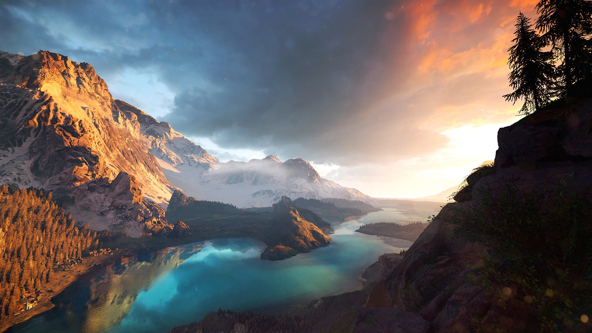
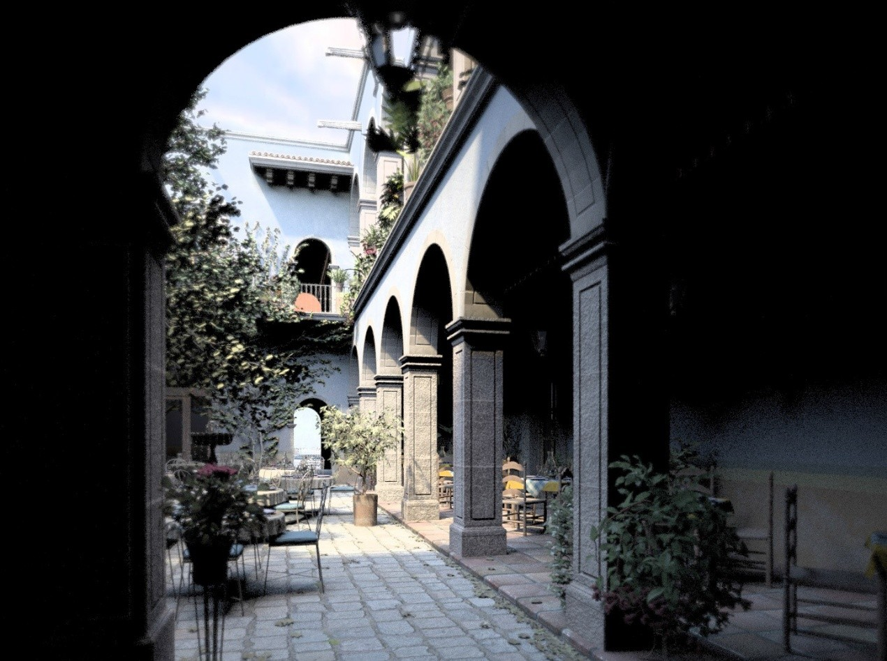
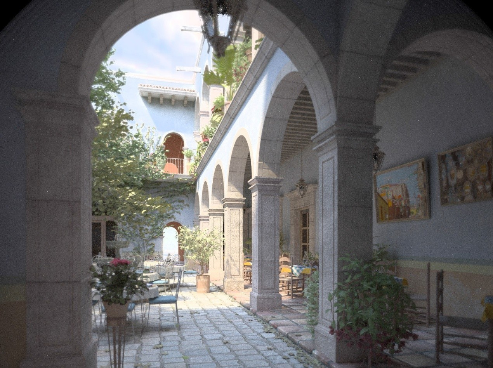
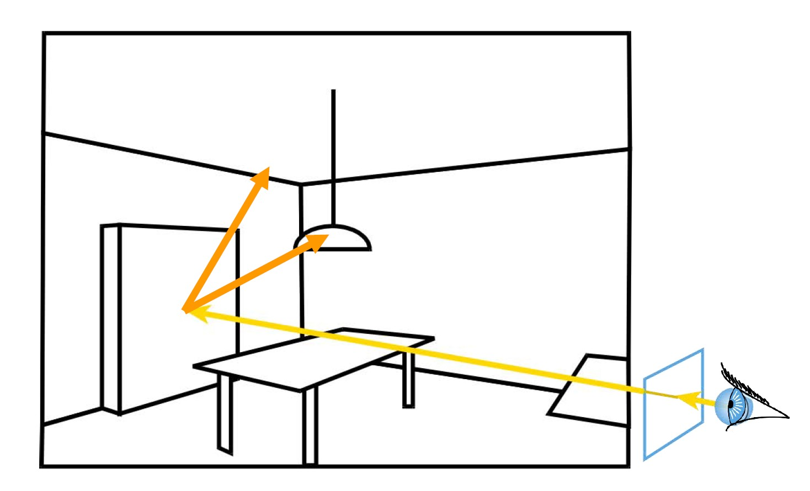
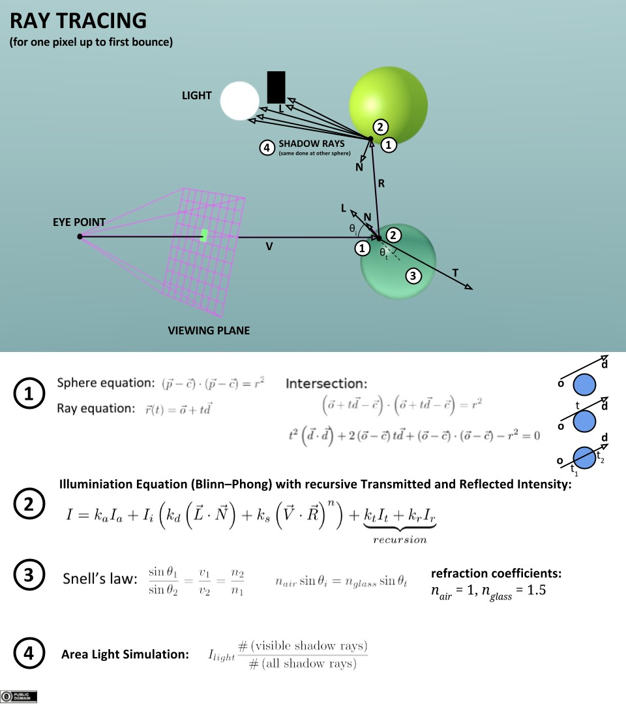
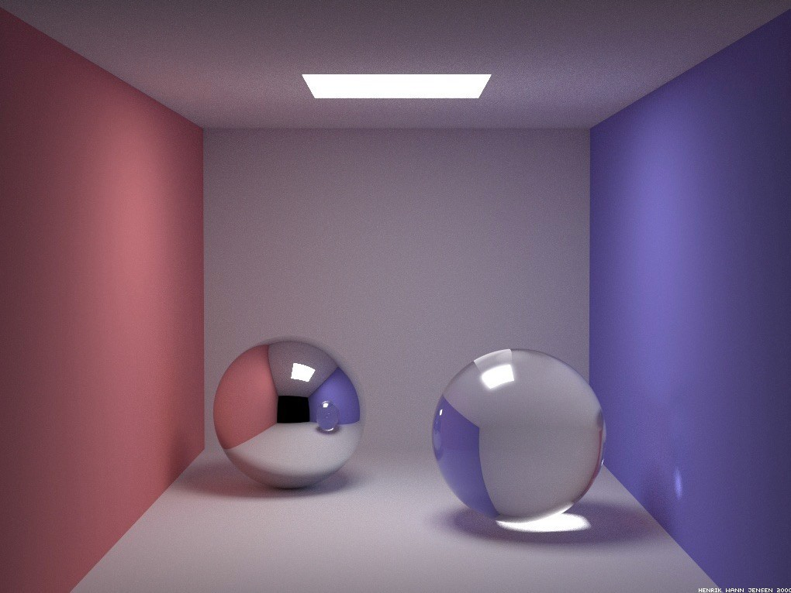
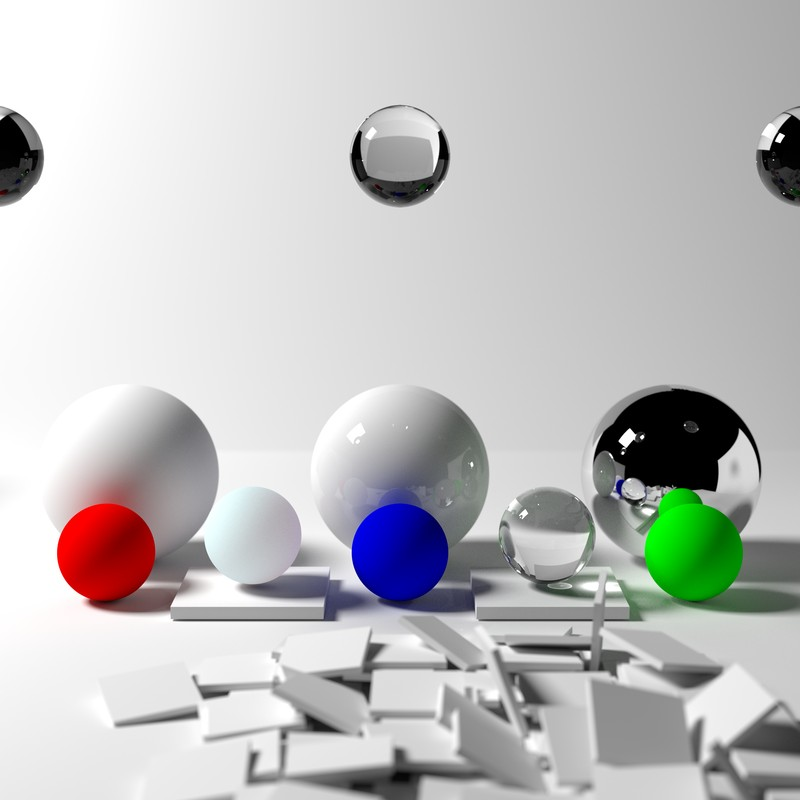
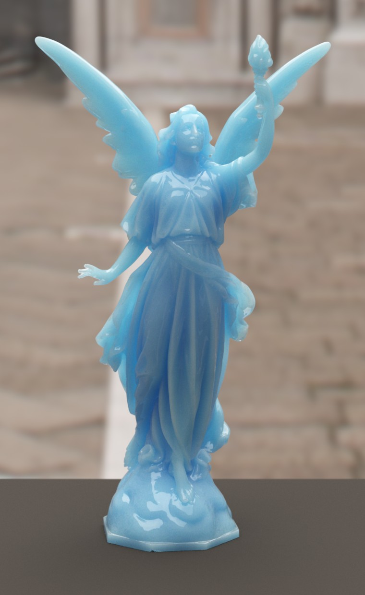
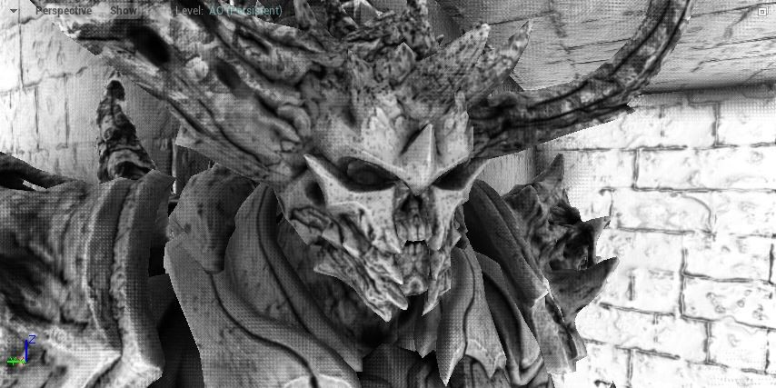
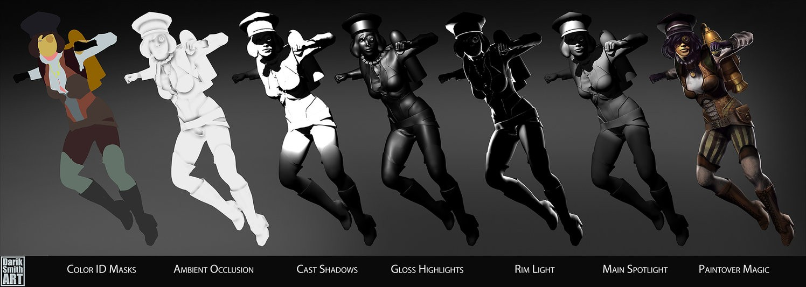

# 【《Real-Time Rendering 3rd》 提炼总结】(八) 第九章 · 全局光照:光线追踪、路径追踪与GI技术进化编年史

全局光照（Global Illumination,简称 GI），
作为图形学中比较酷的概念之一，是指既考虑场景中来自光源的直接光照，又考虑经过场景中其他物体反射后的间接光照的一种渲染技术。

大家常听到的光线追踪，路径追踪等同样很酷的概念，都是全局光照中人气较高的算法流派。

而这篇文章将围绕全局光照技术，介绍的要点有：

-   全局光照的基本概念

-   全局光照的算法主要流派

-   全局光照技术进化编年史

-   光线追踪 Ray Tracing

-   路径追踪 Path Tracing

-   光线追踪、路径追踪、光线投射的区别

-   环境光遮蔽 Ambient Occlusion

一、行文思路说明
================

阅读过《Real-Time Rendering
3rd》第九章的读者们都会发现，作为一章关于全局光照的章节，作者讲了不少在严格意义上全局光照主线以外的内容，如Reflections、Refractions、Shadow等节，而这些内容在《Real-Time
Rendering 2nd》中，其实是放在Chapter 6 Advanced Lighting and Shading一节的。

既然《Real-Time Rendering
3rd》第九章标题就叫全局光照，核心内容也是全局光照，本文即决定脱离原书安排的100来页的多余内容，以全局光照的主线内容为主，构成一篇包含全局光照基本概念，主要算法流派，以及全局光照技术进化编年史，和全局光照算法中人气较高的光线追踪、路径追踪等算法的综述式文章。

二、全局光照
============

全局光照，(Global Illumination,简称 GI), 或被称为Indirect Illumination,
间接光照，是指既考虑场景中直接来自光源的光照（Direct
Light）又考虑经过场景中其他物体反射后的光照（Indirect
Light）的一种渲染技术。使用全局光照能够有效地增强场景的真实感。

即可以理解为：全局光照 = 直接光照(Direct Light) + 间接光照(Indirect Light)

图1 Direct illumination

图2 Global illumination = Direct illumination +Indirect illumination

上述两幅图片来自CMU 15-462/15-662, Fall 2015 Slider，Lecture 14: Global
Illumination,当然，细心的朋友也可以发现，它也被《Physically Based
Rendering,Second Edition From Theory To Implementation》选作封面。

同样可以看到，加入了Indirect
illumination的图2，在直接光源（阳光）照射不到的地方，得到了更好的亮度和细节表现，从而使整张渲染效果更具真实感。

虽说实际应用中只有漫反射全局照明的模拟算法被称为全局照明算法，但其实理论上说反射、折射、阴影都属于全局光照的范畴，因为模拟它们的时候不仅仅要考虑光源对物体的直接作用还要考虑物体与物体之间的相互作用。也是因为，镜面反射、折射、阴影一般不需要进行复杂的光照方程求解，也不需要进行迭代的计算。因此，这些部分的算法已经十分高效，甚至可以做到实时。不同于镜面反射，光的漫反射表面反弹时的方向是近似“随机”，因此不能用简单的光线跟踪得到反射的结果，往往需要利用多种方法进行多次迭代，直到光能分布达到一个基本平衡的状态。

三、全局光照的主要算法流派
==========================

经过几十年的发展，全局光照现今已有多种实现方向，常见的全局光照主要流派列举如下：

-   Ray tracing 光线追踪

-   Path tracing 路径追踪

-   Photon mapping 光子映射

-   Point Based Global Illumination 基于点的全局光照

-   Radiosity 辐射度

-   Metropolis light transport 梅特波利斯光照传输

-   Spherical harmonic lighting 球谐光照

-   Ambient occlusion 环境光遮蔽

-   Voxel-based Global Illumination 基于体素的全局光照

-   Light Propagation Volumes Global Illumination

-   Deferred Radiance Transfer Global Illumination

-   Deep G-Buffer based Global Illumination

-   等。

而其中的每种流派，又可以划分为N种改进和衍生算法。

如光线追踪（Ray
Tracing）派系，其实就是一个框架，符合条件的都可称为光线追踪，其又分为递归式光线追踪（Whitted-style
Ray Tracing），分布式光线追踪（DistributionRay
Tracing），蒙特卡洛光线追踪（Monte Carlo Ray Tracing）等。

而路径追踪（Path tracing）派系，又分为蒙特卡洛路径追踪（Monte Carlo Path
Tracing），双向路径追踪（Bidirectional Path
Tracing），能量再分配路径追踪（Energy Redistribution Path Tracing）等。

其中有些派系又相互关联，如路径追踪，就是基于光线追踪，结合了蒙特卡洛方法而成的一种新的派系。

四、全局光照技术进化编年史
==========================

这节以光线追踪和路径追踪派系为视角，简单总结一下全局光照技术发展早期（1968-1997）的重要里程碑。

4.1 光线投射 Ray Casting [1968]
-------------------------------

光线投射（Ray
Casting），作为光线追踪算法中的第一步，其理念起源于1968年，由Arthur
Appel在一篇名为《 Some techniques for shading machine rendering of
solids》的文章中提出。其具体思路是从每一个像素射出一条射线，然后找到最接近的物体挡住射线的路径，而视平面上每个像素的颜色取决于从可见光表面产生的亮度。

图3 光线投射：每像素从眼睛投射射线到场景

4.2 光线追踪 Ray Tracing [1979]
-------------------------------

1979年，Turner
Whitted在光线投射的基础上，加入光与物体表面的交互，让光线在物体表面沿着反射，折射以及散射方式上继续传播，直到与光源相交。这一方法后来也被称为经典光线跟踪方法、递归式光线追踪（Recursive
Ray Tracing）方法，或 Whitted-style 光线跟踪方法。

光线追踪方法主要思想是从视点向成像平面上的像素发射光线，找到与该光线相交的最近物体的交点，如果该点处的表面是散射面，则计算光源直接照射该点产生的颜色；如果该点处表面是镜面或折射面，则继续向反射或折射方向跟踪另一条光线，如此递归下去，直到光线逃逸出场景或达到设定的最大递归深度。

图4 经典的光线追踪： 每像素从眼睛投射射线到场景，并追踪次级光线（(shadow,
reflection, refraction），并结合递归

4.3 分布式光线追踪 Distributed Ray Tracing [1984]
-------------------------------------------------

Cook于1984年引入蒙特卡洛方法（Monte Carlo
method）到光线跟踪领域，将经典的光线跟踪方法扩展为分布式光线跟踪算法（Distributed
Ray Tracing），又称为随机光线追踪（stochasticray
tracing），可以模拟更多的效果，如金属光泽、软阴影、景深（ Depthof
Field）、运动模糊等等。

4.4 渲染方程 The Rendering Equation [1986]
------------------------------------------

在前人的研究基础上，Kajiya于1986年进一步建立了渲染方程的理论，并使用它来解释光能传输的产生的各种现象。这一方程描述了场景中光能传输达到稳定状态以后，物体表面某个点在某个方向上的辐射率（Radiance）与入射辐射亮度等的关系。

可以将渲染方程理解为全局光照算法的基础，Kajiya在1986年第一次将渲染方程引入图形学后，随后出现的很多全局光照的算法，都是以渲染方程为基础，对其进行简化的求解，以达到优化性能的目的。渲染方程根据光的物理学原理，以及能量守恒定律，完美地描述了光能在场景中的传播。很多真实感渲染技术都是对它的一个近似。渲染方程在数学上的表示如下：

图5 渲染方程描述了从x点沿某一方向看的光放射的总额。

4.5 路径追踪 Path Tracing [1986]
--------------------------------

Kajiya也于1986年提出了路径追踪算法的理念，开创了基于蒙特卡洛的全局光照这一领域。根据渲染方程，
Kajiya
提出的路径追踪方法是第一个无偏（Unbiased）的渲染方法。路径追踪的基本思想是从视点发出一条光线，光线与物体表面相交时根据表面的材质属性继续采样一个方向，发出另一条光线，如此迭代，直到光线打到光源上（或逃逸出场景），然后用蒙特卡洛的方法，计算其贡献，作为像素的颜色值。

4.6 双向路径追踪 Bidirectional Path Tracing [1993，1994]
--------------------------------------------------------

双向路径追踪（Bidirectional Path
Tracing）的基本思想是同时从视点、光源打出射线，经过若干次反弹后，将视点子路径（
eye path） 和光源子路径（ light path）
上的顶点连接起来（连接时需要测试可见性），以快速产生很多路径。这种方法能够产生一些传统路径追踪难以采样到的光路，所以能够很有效地降低噪声。
进一步的， [Veach
1997]将渲染方程改写成对路径积分的形式，允许多种路径采样的方法来求解该积分。

4.7 梅特波利斯光照传输 Metropolis Light Transport [1997]
--------------------------------------------------------

Eric Veach等人于1997年提出了梅特波利斯光照传输（Metropolis Light
Transport，常被简称为MLT）方法。路径追踪（ Path
Tracing）中一个核心问题就是怎样去尽可能多的采样一些贡献大的路径，而该方法可以自适应的生成贡献大的路径，简单来说它会避开贡献小的路径，而在贡献大的路径附近做更多局部的探索，通过特殊的变异方法，生成一些新的路径，这些局部的路径的贡献往往也很高。
与双向路径追踪相比， MLT
更加鲁棒，能处理各种复杂的场景。比如说整个场景只通过门缝透进来的间接光照亮，此时传统的路径追踪方法因为难以采样到透过门缝的这样的特殊路径而产生非常大的噪声。

五、光线追踪 Ray Tracing
========================

光线追踪（Ray
tracing）是三维计算机图形学中的特殊渲染算法，跟踪从眼睛发出的光线而不是光源发出的光线，通过这样一项技术生成编排好的场景的数学模型显现出来。这样得到的结果类似于光线投射与扫描线渲染方法的结果，但是这种方法有更好的光学效果，例如对于反射与折射有更准确的模拟效果，并且效率非常高，所以当追求高质量的效果时经常使用这种方法。

上文已经提到过，Whitted于1979年提出了使用光线跟踪来在计算机上生成图像的方法，这一方法后来也被称为经典光线跟踪方法、递归式光线追踪方法，或
Whitted-style
光线跟踪方法。其主要思想是从视点向成像平面上的像素发射光线，找到与该光线相交的最近物体的交点，如果该点处的表面是散射面，则计算光源直接照射该点产生的颜色；如果该点处表面是镜面或折射面，则继续向反射或折射方向跟踪另一条光线，如此递归下去，直到光线逃逸出场景或达到设定的最大递归深度。

以下这张图示可以很好的说明光线追踪方法的思路：

图6 Ray Tracing Illustration First Bounce

图7 基于光线追踪渲染出的效果图1

图8 基于光线追踪渲染出的效果图2

图9 基于光线追踪渲染效果图 \@Caustic-Graphics，Inc

图10 典型的光线追踪渲染效果图

光线跟踪的一个最大的缺点就是性能，需要的计算量非常巨大，以至于目前的硬件很难满足实时光线追踪的需求。传统的光栅图形学中的算法，利用了数据的一致性从而在像素之间共享计算，而光线跟踪通常是将每条光线当作独立的光线，每次都要重新计算。但是，这种独立的做法也有一些其它的优点，例如可以使用更多的光线以抗混叠现象，并且在需要的时候可以提高图像质量。尽管它正确地处理了相互反射的现象以及折射等光学效果，但是传统的光线跟踪并不一定是真实效果图像，只有在非常近似或者完全实现渲染方程的时候才能实现真正的真实效果图像。由于渲染方程描述了每个光束的物理效果，所以实现渲染方程可以得到真正的真实效果，但是，考虑到所需要的计算资源，这通常是无法实现的。于是，所有可以实现的渲染模型都必须是渲染方程的近似，而光线跟踪就不一定是最为可行的方法。包括光子映射在内的一些方法，都是依据光线跟踪实现一部分算法，但是可以得到更好的效果。

用一套光线追踪的伪代码，结束这一节的内容：

    for each pixel of the screen
	{
		Final color = 0;
	      	Ray = { starting point, direction };
	      	Repeat
		{
			for each object in the scene
	          	{
	                 	determine closest ray object/intersection;
	          	}
		        if intersection exists
	      	        {
	             		for each light inthe scene
	             		{
	                    		if the light is not in shadow of anotherobject
	                    		{
	                           			addthis light contribution to computed color;
	                    		}
			        }
		       }
	      	       Final color = Final color + computed color * previous reflectionfactor;
	      	       reflection factor = reflection factor * surface reflectionproperty;
	      	       increment depth;
	      } until reflection factor is 0 or maximumdepth is reached
	}

六、路径追踪 Path Tracing
=========================

路径追踪（Path
Tracing）方法由Kajiya在1986年提出，该方法的基本思想是从视点发出一条光线，光线与物体表面相交时根据表面的材质属性继续采样一个方向，发出另一条光线，如此迭代，直到光线打到光源上（或逃逸出场景），然后用蒙特卡洛方法，计算光线的贡献，作为像素的颜色值。而使用蒙特卡洛方法对积分的求解是无偏的，只要时间足够长，最终图像能收敛到一个正确的结果。

简单来说，路径追踪 = 光线追踪+ 蒙特卡洛方法。

这边有一个用99行代码实现路径追踪算法的一个简易全局光照渲染器，有兴趣的朋友可以进行了解：

[http://www.kevinbeason.com/smallpt/](https://link.zhihu.com/?target=http%3A//www.kevinbeason.com/smallpt/)

图11 基于路径追踪渲染的效果图

图12 基于路径追踪实现的次表面散射渲染效果图 ©Photorealizer

图13 基于路径追踪渲染的效果图
©[http://www.pathtracing.com](https://link.zhihu.com/?target=http%3A//www.pathtracing.com)

图14 基于路径追踪渲染的效果图 ©NVIDIA

七、Ray Casting ，Ray Tracing，Path Tracing区别
===============================================

初学者往往会弄不明白光线投射（Ray Casting ），光线追踪（Ray
Tracing），路径追踪（Path
Tracing）三者的的区别，龚大 [\@叛逆者](https://www.zhihu.com/people/0b21747b1fec79ad8af7e68a2b1ff681) 在<https://www.zhihu.com/question/29863225>这个答案中的回答已经很精辟，本文就直接引用了过来：

-   Ray
    Tracing：这其实是个框架，而不是个方法。符合这个框架的都叫raytracing。这个框架就是从视点发射ray，与物体相交就根据规则反射、折射或吸收。遇到光源或者走太远就停住。一般来说运算量不小。

-   Ray Casting：其实这个和volumetric可以脱钩。它就是ray
    tracing的第一步，发射光线，与物体相交。这个可以做的很快，在Doom
    1里用它来做遮挡。

-   Path Tracing：是ray tracing +
    蒙特卡洛法。在相交后会选一个随机方向继续跟踪，并根据BRDF计算颜色。运算量也不小。还有一些小分类，比如Bidirectional
    path tracing。

文末，简单聊一下环境光遮蔽，AO。

八、环境光遮蔽 Ambient Occlusion
================================

环境光遮蔽（Ambient
Occlusion，简称AO）是全局光照明的一种近似替代品，可以产生重要的视觉明暗效果，通过描绘物体之间由于遮挡而产生的阴影，
能够更好地捕捉到场景中的细节，可以解决漏光，阴影漂浮等问题，改善场景中角落、锯齿、裂缝等细小物体阴影不清晰等问题，增强场景的深度和立体感。

可以说，环境光遮蔽在直观上给玩家的主要感觉体现在画面的明暗程度上，未开启环境光遮蔽特效的画面光照稍亮一些；而开启环境光遮蔽特效之后，
局部的细节画面尤其是暗部阴影会更加明显一些。

Ambient Occlusion的细分种类有：

-   SSAO-Screen space ambient occlusion

-   SSDO-Screen space directional occlusion

-   HDAO-High Definition Ambient Occlusion

-   HBAO+-Horizon Based Ambient Occlusion+

-   AAO-Alchemy Ambient Occlusion

-   ABAO-Angle Based Ambient Occlusion

-   PBAO

-   VXAO-Voxel Accelerated Ambient Occlusion

一般而言，Ambient Occlusion最常用方法是SSAO，如Unreal Engine
4中的AO，即是用SSAO实现。

最后，贴一些和AO相关的，较经典的渲染效果图，结束这篇文章。

图15 Scene without Ambient Occlusion ©Unreal

图16 Ambient Occlusion Only ©Unreal

图17 Scene with Ambient Occlusion ©Unreal

图18 使用环境光遮蔽制作人物的步骤

图19 一张典型的环境光遮蔽的渲染图

图20 有无环境光遮蔽渲染效果对比图示

九、其他参考
============

[1] [http://15462.courses.cs.cmu.edu/fall2015/lecture/globalillum](https://link.zhihu.com/?target=http%3A//15462.courses.cs.cmu.edu/fall2015/lecture/globalillum)

[2] [https://docs.unrealengine.com/latest/INT/Engine/Rendering/LightingAndShadows/AmbientOcclusion/](https://link.zhihu.com/?target=https%3A//docs.unrealengine.com/latest/INT/Engine/Rendering/LightingAndShadows/AmbientOcclusion/)

[3] [https://en.wikipedia.org/wiki/Ambient_occlusion](https://link.zhihu.com/?target=https%3A//en.wikipedia.org/wiki/Ambient_occlusion)

[4] [https://www.ics.uci.edu/\~gopi/CS211B/RayTracing%20tutorial.pdf](https://link.zhihu.com/?target=https%3A//www.ics.uci.edu/%7Egopi/CS211B/RayTracing%2520tutorial.pdf)

[5] [http://www.cnblogs.com/hielvis/p/6371840.html](https://link.zhihu.com/?target=http%3A//www.cnblogs.com/hielvis/p/6371840.html)

[6] [http://blog.csdn.net/thegibook/article/details/53058206](https://link.zhihu.com/?target=http%3A//blog.csdn.net/thegibook/article/details/53058206)

[7] [http://www.di.ubi.pt/\~agomes/cig/teoricas/02-raycasting.pdf](https://link.zhihu.com/?target=http%3A//www.di.ubi.pt/%7Eagomes/cig/teoricas/02-raycasting.pdf)

[8] [https://ocw.mit.edu/courses/electrical-engineering-and-computer-science/6-837-computer-graphics-fall-2012/](https://link.zhihu.com/?target=https%3A//ocw.mit.edu/courses/electrical-engineering-and-computer-science/6-837-computer-graphics-fall-2012/)

[9] [Crytek on DX12, Vulkan, Async Compute, Global Illumination, Ray-tracing,
Physically-based Rendering & E3
Demos](https://link.zhihu.com/?target=http%3A//www.dsogaming.com/interviews/crytek-dx12-vulkan-async-compute-global-illumination-ray-tracing-physically-based-rendering-e3-demos/)
