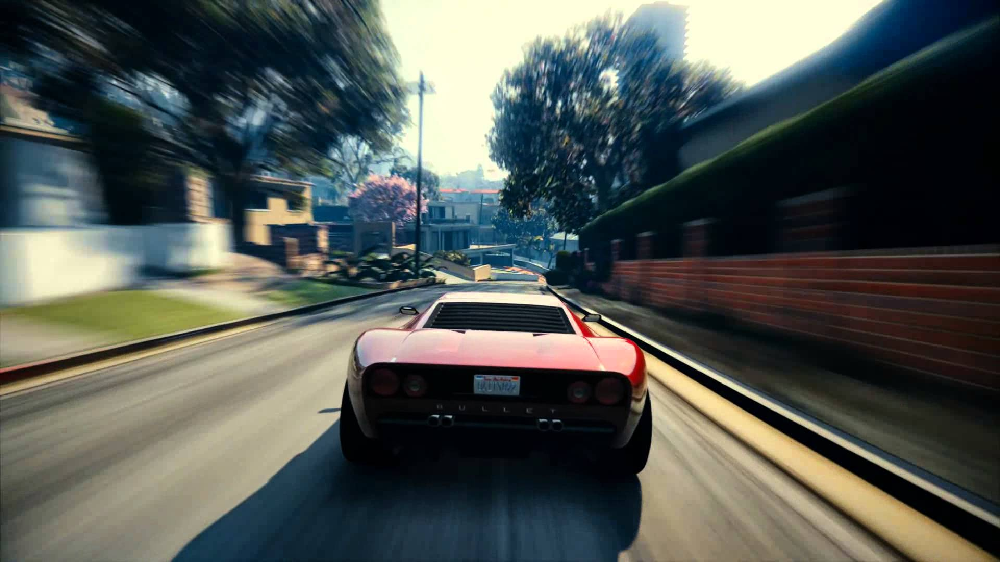

# 【《Real-Time Rendering 3rd》 提炼总结】(九) 第十章 · 游戏开发中基于图像的渲染技术总结

这是一篇近万字的总结式文章，关于游戏开发中基于图像的渲染（Image-Based
Rendering，简称IBR）技术的方方面面，将总结《RTR3》书中第十章提到的16种常用的IBR渲染技术。

他们包括：

-   渲染谱 The Rendering Spectrum

-   固定视角的渲染 Fixed-View Rendering

-   天空盒 Skyboxes

-   光场渲染 Light Field Rendering

-   精灵与层 Sprites and Layers

-   公告板 Billboarding

-   粒子系统 Particle System

-   替代物 Impostors

-   公告板云 Billboard Clouds

-   图像处理 Image Processing

-   颜色校正 Color Correction

-   色调映射 Tone Mapping

-   镜头眩光和泛光 Lens Flare and Bloom

-   景深 Depth of Field

-   运动模糊 Motion Blur

-   体渲染 Volume Rendering

在过去很多年里，基于图像的渲染（Image-Based Rendering
，简称IBR），已经自成一派，逐渐发展成了一套广泛的渲染理念。正如其字面所表示的，图像是用于渲染的主要数据来源。用图像表示一个物体的最大好处在于渲染消耗与所要绘制的像素数量成正比，而不是几何模型的顶点数量。因此，使用基于图像的渲染是一种有效的渲染模型的方法。除此之外，IBR技术还有其他一些更为广泛的用途，比如云朵，皮毛等很多很难用多边形来表示的物体，却可以巧妙运用分层的半透明图像来显示这些复杂的表面。

OK，下面开始正文，对这16种常见的基于图像的渲染技术，分别进行介绍。

一、渲染谱 The Rendering Spectrum
=================================

众所周知，渲染的目的就是在屏幕上渲染出物体，至于如何达到结果，主要依赖于用户的选择，白猫黑猫，抓到老鼠的就是好猫。而用多边形将三维物体显示在屏幕上，并非是进行三维渲染的唯一方法，也并非是最合适的方法。多边形具有从任何视角以合理的方式表示对象的优点，当移动相机的时候，物体的表示可以保持不变。但是，当观察者靠近物体的时候，为了提高显示质量，往往希望用比较高的细节层次来表示模型。与之相反，当物体位于比较远的地方时，就可以用简化形式来表示模型。这就是细节层次技术(Level
Of Detail,LOD)。使用LOD技术主要目的是为了加快场景的渲染速度。

还有很多技术可以用来表示物体逐渐远离观察者的情形，比如，可以用图像而不是多边形来表示物体，从而减少开销，加快渲染速度。另外，单张图片可以很快地被渲染到屏幕上，用来表示物体往往开销很小。

如《地平线：黎明》远处的树木，即是采用公告板技术（Billboard）替换3D树木模型进行渲染。（关于公告板技术的一些更具体的总结，详见本文第六节）。

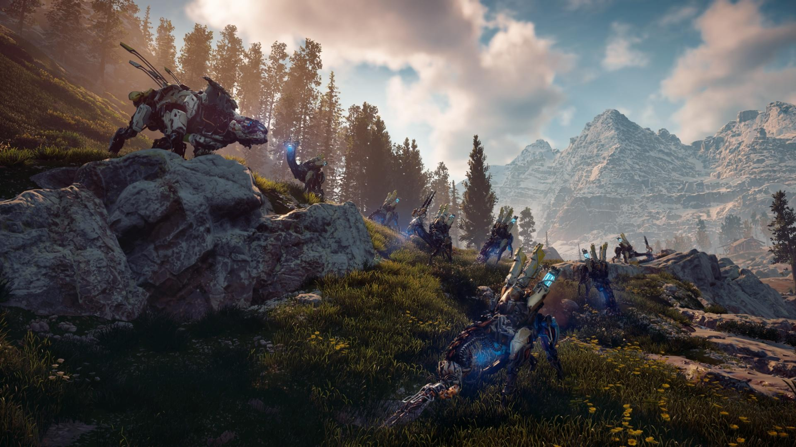

图1 《地平线：黎明》中利用了Billboard进行画面的渲染

Lengyel于1998在《The Convergence of Graphics and
Vision》一文中提出了一种表示渲染技术连续性的方法，名为The Rendering Spectrum
渲染谱，如下图所示。

图2 渲染谱 The Rendering Spectrum（RTR3书中版本）

图3 渲染谱 The Rendering Spectrum（Lengyel 1998论文版本）

可以将渲染谱理解为渲染的金字塔。从左到右，由简单到复杂，由二维图像到几何模型，从外观特征到物理渲染。

二、固定视角的渲染 Fixed-View Rendering
=======================================

固定视角的渲染（Fixed-View
Rendering）技术，通过将复杂几何模型转换为可以在多帧中重复使用的一组简单的buffer来节省大量渲染时间与性能。

对于复杂的几何和着色模型，每帧去重新渲染整个场景很可能是昂贵的。可以通过限制观看者的移动能力来对渲染进行加速。
最严格的情况是相机固定在位置和方位，即根本不移动。而在这种情况下，很多渲染可以只需做一次。

例如，想象一个有栅栏的牧场作为静态场景，一匹马穿过它。牧场和栅栏渲染仅一次，存储其颜色和Z缓冲区。每帧将这些buffer复制到可显示的颜色和Z缓冲中。为了获得最终的渲染效果，马本身是需要渲染的。如果马在栅栏后面，存储和复制的z深度值将把马遮挡住。请注意，在这种情况下，马不能投下阴影，因为场景无法改变。可以进行进一步的处理，例如，可以确定出马影子的区域，根据需求进行处理。关键是对于要显示的图像的颜色何时或如何设置这点上，是没有限制的。固定视角的特效（Fixed-View
Effects），可以通过将复杂几何模型转换为可以在多帧中重复使用的一组简单的buffer来节省大量时间。

在计算机辅助设计（CAD）应用程序中，所有建模对象都是静态的，并且在用户执行各种操作时，视图不会改变。一旦用户移动到所需的视图，就可以存储颜色和Z缓冲区，以便立即重新使用，然后每帧绘制用户界面和突出显示的元素。
这允许用户快速地注释，测量或以其他方式与复杂的静态模型交互。通过在G缓冲区中存储附加信息，类似于延迟着色的思路，可以稍后执行其他操作。
例如，三维绘画程序也可以通过存储给定视图的对象ID，法线和纹理坐标来实现，并将用户的交互转换为纹理本身的变化。

一个和静态场景相关的概念是黄金线程(Golden Thread)或自适应（Adaptive
Refinement）渲染。其基本思想是，当视点与场景不运动时，随着时间的推移，计算机可以生成越来越好的图像，而场景中的物体看起来会更加真实，这种高质量的绘制结果可以进行快速交换或混合到一系列画面中。这种技术对于CAD或其他可视化应用来说非常有用。而除此之外，还可以很多不同的精化方法。一种可能的方法是使用累积缓冲器（accumulation
buffer）做抗锯齿（anti-
aliasing），同时显示各种累积图像。另外一种可能的方法是放慢每像素离屏着色（如光线追踪，环境光遮蔽，辐射度）的速度，然后渐进改进之后的图像。

在RTR3书的7.1节介绍一个重要的原则，就是对于给定的视点和方向，给定入射光，无论这个光亮度如何计算或和隔生成这个光亮度的距离无关。眼睛没有检测距离，仅仅颜色。在现实世界中捕捉特定方向的光亮度可以通过简单地拍一张照片来完成。

QuickTime
VR是由苹果公司在1995年发布的VR领域的先驱产品，基本思路是用静态图片拼接成360度全景图。QuickTime
VR中的效果图像通常是由一组缝合在一起的照片，或者直接由全景图产生。随着相机方向的改变，图像的适当部分被检索、扭曲和显示。虽然这种方法仅限于单一位置，但与固定视图相比，这种技术具有身临其境的效果，因为观看者的头部可以随意转动和倾斜。

Kim，Hahn和Nielsen提出了一种有效利用GPU的柱面全景图，而且通常，这种全景图也可以存储每个纹素的距离内容或其他值，以实现动态对象与环境的交互。

如下的三幅图，便是是基于他们思想的全景图（panorama），使用QuickTime
VR来渲染出的全景视野范围。其中，第一幅是全景图原图，后两幅图是从中生成的某方向的视图。注意观察为什么这些基于柱面全景图的视图，没有发生扭曲的现象。

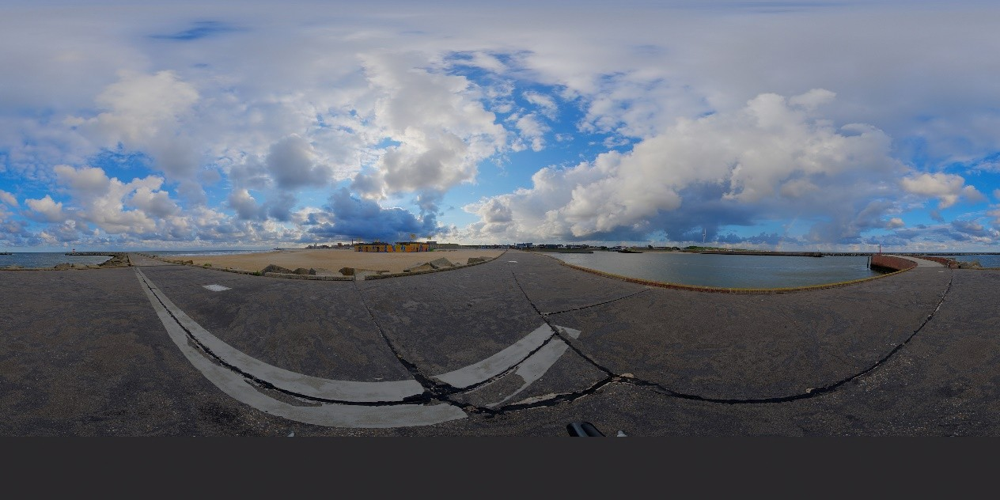

图4 全景图原图

图5 通过全景图得到的视图1

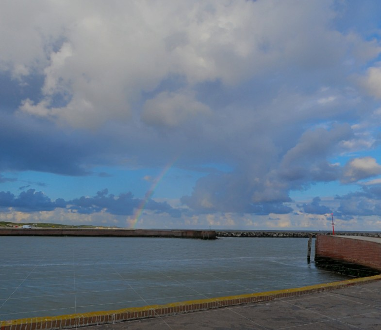

图6 通过全景图得到的视图2

三、天空盒 Skyboxes
===================

对于一些远离观众的物体，观众移动时几乎没有任何视差效果。换言之，如果你移动一米，甚至一千米，一座遥远的山本身看起来通常不会有明显的不同。当你移动时，它可能被附近的物体挡住视线，但是把那些物体移开，山本身看起来也依旧一样。天空盒就属于这种类型的物体。

图7 基于天空盒渲染的场景 @mad max

环境贴图（environment
map）可以代表本地空间入射光亮度。虽然环境贴图通常用于模拟反射，但它们也可以直接用来表示环绕环境的远处物体。任何独立于视图的环境地图表示都可以用于此目的；立方体贴图（cubic
maps）是最为常见的一种环境贴图。环境贴图放置在围绕着观察者的网格上，并且足够大以包含场景中所有的对象。且网格的形状并不重要，但通常是立方体贴图。如下图，在该图所示的室内环境更像是一个QuickTime
VR全景的无约束版本。观众可以在任何方向观察这个天空盒，得到很好的真实体验。但同样，任何移动都会破坏这个场景产生的真实感错觉，因为移动的时候，并不存在视差。

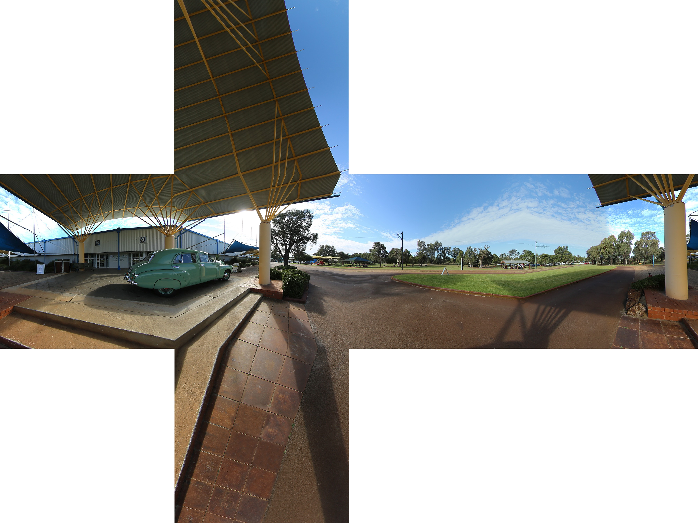

图8 一个典型的立方体环境贴图

环境贴图通常可以包含相对靠近反射对象的对象。因为我们通常并没有多精确地去在乎反射的效果，所以这样的效果依然非常真实。而由于视差在直接观看时更加明显，因此天空盒通常只包含诸如太阳，天空，远处静止不动的云和山脉之类的元素。

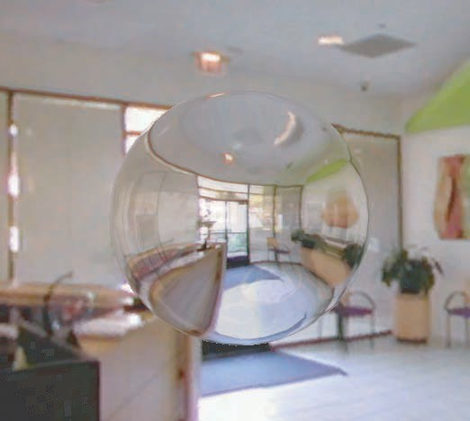

图9 玻璃球折射和反射效果的一个立方体环境贴图，这个map本身用可作天空盒。

为了使天空盒看起来效果不错，立方体贴图纹理分辨率必须足够，即每个屏幕像素的纹理像素。
必要分辨率的近似值公式：

其中，fov表示视域。该公式可以从观察到立方体贴图的表面纹理必须覆盖90度的视域（水平和垂直）的角度推导出。并且应该尽可能隐藏好立方体的接缝处，最好是能做到无缝的衔接，使接缝不可见。一种解决接缝问题的方法是，使用六个稍微大一点的正方形，来形成一个立方体，这些正方形的每个边缘处彼此相互重叠，相互探出。这样，可以将邻近表面的样本复制到每个正方形的表面纹理中，并进行合理插值。

图10 基于天空盒渲染的场景 \@rage

四、光场渲染 Light Field Rendering
==================================

所谓光场（Light Field），可以理解为空间中任意点发出的任意方向的光的集合。

而光场渲染（Light Field
Rendering），可以理解为在不需要图像的深度信息或相关性的条件下，通过相机阵列或由一个相机按设计的路径移动，把场景拍摄下来作为输出图像集。对于任意给定的新视点，找出该视点邻近的几个采样点进行简单的重新采样和插值，就能得到该视点处的视图。

magic leap公司目前的原型产品，Nvidia 公司的near-eye light field
display，Lytro公司发布的光场相机，都是基于Light Field技术。

图11 Lytro公司的光场相机

图12 SIGGRAPH 2014会议上，MIT’s Camera
CultureGroup介绍了一种基于开普勒望远镜中投影机和光学技术的无眼镜3D的新方法。
他们提出的“压缩光场投影（Compressive Light Field
Projection）”新方法由单个设备组成，并没有机械移动的物件。

五、精灵与层 Sprites and Layers
===============================

最基本的基于图像的渲染的图元之一便是精灵（sprite）。精灵（sprite）是在屏幕上移动的图像，例如鼠标光标。精灵不必具有矩形形状，而且一些像素可以以透明形式呈现。对于简单的精灵，屏幕上会显示一个一对一的像素映射。存储在精灵中的每个像素将被放在屏幕上的像素中。可以通过显示一系列不同的精灵来生成动画。

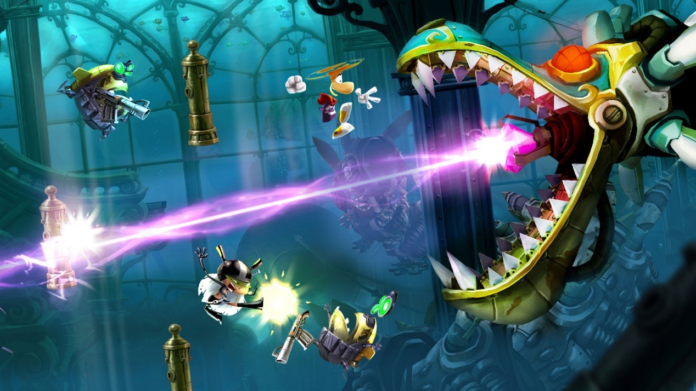

图13 基于Sprite层级制作的《雷曼大冒险》@UBISOFT

更一般的精灵类型是将其渲染为应用于总是面向观看者的多边形的图像纹理。图像的Alpha通道可以为sprite的各种像素提供全部或部分透明度。这种类型的精灵可以有一个深度，所以在场景本身，可以顺利地改变大小和形状。一组精灵也可以用来表示来自不同视图的对象。对于大型物体，这种用精灵来替换的表现效果会相当弱，因为从一个精灵切换到另一个时，会很容易穿帮。也就是说，如果对象的方向和视图没有显着变化，则给定视图中的对象的图像表示可以对多个帧有效。而如果对象在屏幕上足够小，存储大量视图，即使是动画对象也是可行的策略。

考虑场景的一种方法是将其看作一系列的层（layers），而这种思想也通常用于二维单元动画。每个精灵层具有与之相关联的深度。通过这种从前到后的渲染顺序，我们可以渲染出整个场景而无需Z缓冲区，从而节省时间和资源。

图14 基于Sprite层级制作的《雷曼大冒险》@UBISOFT

六、公告板 Billboarding
=======================

我们将根据观察方向来确定多边形面朝方向的技术叫做公告板（Billboarding，也常译作布告板）。而随着观察角度的变化，公告板多边形的方向也会根据需求随之改变。与alpha纹理和动画技术相结合，可以用公告板技术表示很多许多不具有平滑实体表面的现象，比如烟，火，雾，爆炸效果，能量盾（Energy
Shields），水蒸气痕迹，以及云朵等。如下文中贴图的，基于公告板渲染出的云朵。

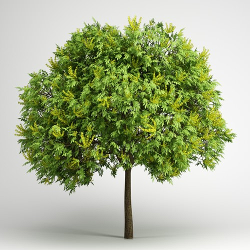

图15 一棵由公告板技术渲染出的树木

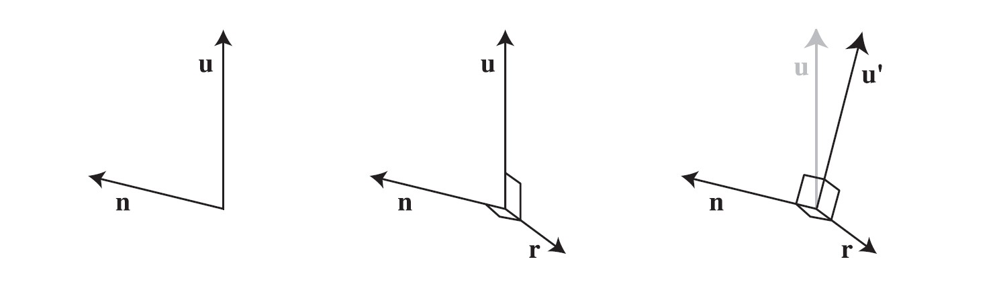

图16
给定表面的法线向量n和近似向上方向的向量u，通过创建一组由三个相互垂直的向量，就可以确定公告板的方向。其中，左图是互相垂直的u和n。中图是r向量通过u和n的叉乘得到，因此同时垂直于u和n，而在右图中，对固定向量n和r进行叉乘就可以得到与他们都垂直的的向上向量u’

有三种不同类型的Billboard，分别是：

-   Screen-Aligned Billboard 对齐于屏幕的公告板

-   World-Oriented Billboard 面向世界的公告板

-   Axial Billboard 轴向公告板

其中：

-   Screen-Aligned Billboard的n是镜头视平面法线的逆方向,u是镜头的up。

-   Axial Billboard的u是受限制的Axial, r = u\*
    n,(n是镜头视平面法线的逆方向,或,视线方向的逆方向),最后再计算一次n' = r \*
    u,即n'才是最后可行的代入M的n,表达了受限的概念。

-   World-orientedbillboard就不能直接使用镜头的up做up,因为镜头roll了,并且所画的billboard原本是应该相对世界站立的,按Screen-Aligned的做法就会随镜头旋转,所以此时应该r
    = u \* n(u是其在世界上的up,n是镜头视线方向的逆方向),最后再计算一次u = r \*
    n,即u'才是最后的up,即非物体本身相对世界的up,亦非镜头的up。

所以公告板技术是一种看似简单其实较为复杂的技术,它的实现变种较多。归其根本在于：

-   View Oriented / View plane oriented的不同

-   Sphere/ Axial的不同

-   Cameraup / World up的不同

如View Oriented 和View plane oriented的不同，得到的公告板效果就完全不同：

图17 两种公告板对其技术的顶视图，左图为view
plane-aligned（视图平面对齐），右图为viewpoint-oriented（视点对齐），其面向的方向根据算法的不同而有所不同。

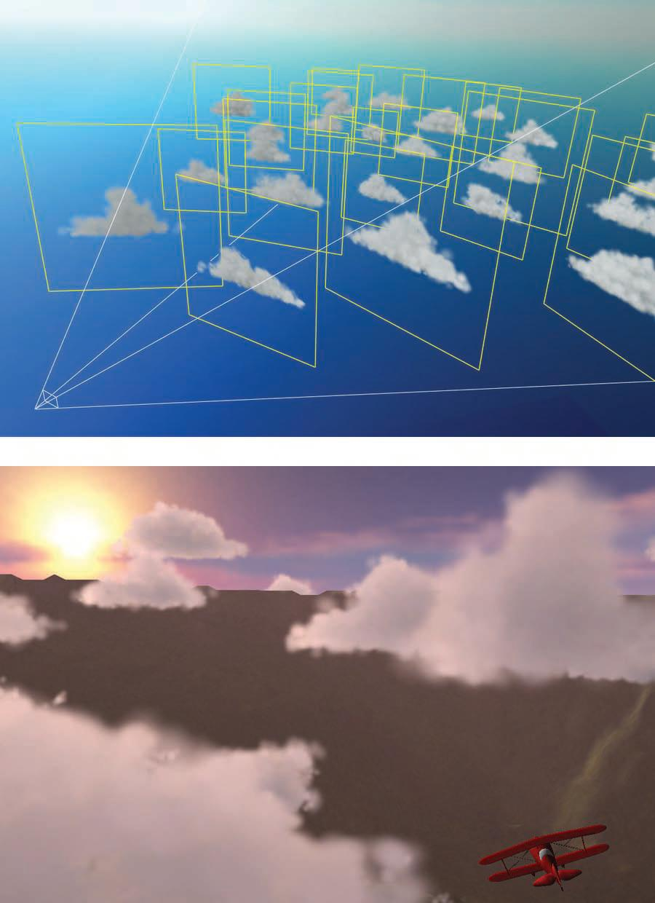

图18 使用world-oriented Billboard创建的云层

在Unreal 4 Engine中，使用Axial Billboard作为树木LOD中的一级的一些图示 ：

图19 使用Axialbillboard作为树木LOD中的一级 @Unreal 4 Engine

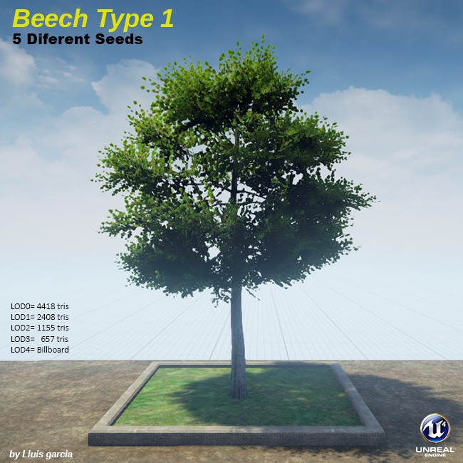

图20 使用Axialbillboard作为树木LOD中的一级 @Unreal 4 Engine

七、粒子系统 Particle System
============================

粒子系统（Particle
System）是一组分散的微小物体集合，其中这些微小物体按照某种算法运动。粒子系统的实际运用包括模拟火焰，烟，爆炸，流水，树木，瀑布，泡沫，旋转星系和其他的一些自然现象。粒子系统并不是一种渲染形式，而是一种动画方法，这种方法的思想是值粒子的生命周期内控制他们的产生，运动，变化和消失。

可以用一条线段表示一个实例，另外，也可以使用轴向公告板配合粒子系统，显示较粗的线条。

除了爆炸，瀑布，泡沫以及其他现象以外，还可以使用粒子系统进行渲染。例如，可以使用粒子系统来创建树木模型，也就是表示树木的几何形状，当视点距离模型较近时，就会产生更多的粒子来生成逼真的视觉效果。

以下是一幅用粒子系统渲染树木的示例：

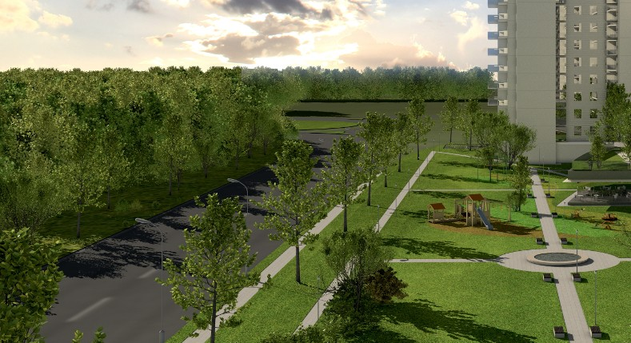

图21 基于粒子系统渲染的树木

八、替代物 Impostors
====================

作为一种公告板技术，替代物（Impostors）是通过从当前视点将一个复杂物绘制到一幅图像纹理上来创建的，其中的图像纹理用于映射到公告板上，渲染过程与替代物在屏幕上覆盖的像素点数成正比，而不是与顶点数或者物体的复杂程度成正比。替代物可以用于物体的一些实例上或者渲染过程的多帧上，从而使整体性能获得提升。

图22
一幅树的视图和一个Impostors（Impostors的黑色背景是透明通道，在渲染时可以处理）

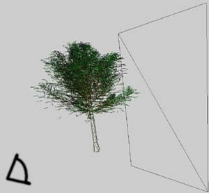

图23 一幅相同的树和Impostors的线框视图

另外，Impostors和Billboard的纹理还可以结合深度信息（如使用深度纹理和高度纹理）进行增强。如果对Impostors和Billboard增加一个深度分量，就会得到一个称为深度精灵（depth
sprite）或者nailboard（译作钉板，感觉很奇怪）的相关绘制图元。也可以对Impostors和Billboard的纹理做浮雕纹理映射（relief
texture mapping）。

关于Impostors，一篇很好的文章是William Damon的《Impostors Made
Easy》，有进一步了解兴趣的朋友可以进行延伸阅读：

[https://software.intel.com/en-us/articles/impostors-made-easy](http://link.zhihu.com/?target=https%3A//software.intel.com/en-us/articles/impostors-made-easy)

九、公告板云 Billboard Clouds
=============================

使用Imposters的一个问题是渲染的图像必须持续地面向观察者。如果远处的物体正在改变方向，则必须重新计算Imposters的朝向。而为了模拟更像他们所代表的三角形网格的远处物体，D´ecoret等人提出了公告板云（Billboard
Clouds）的想法，即一个复杂的模型通常可以通过一系列的公告板集合相互交叉重叠进行表示。我们知道，一个真实物体可以用一个纸模型进行模拟，而公告板云可以比纸模型更令人信服，比如公告板云可以添加一些额外的信息，如法线贴图、位移贴图和不同的表面材质。另外，裂纹沿裂纹面上的投影也可以由公告板进行处理。而D´ecoret等人也提出了一种在给定误差容限内对给定模型进行自动查找和拟合平面的方法。

如下是在UNIGINE Engine（注意这不是虚幻引擎，经常会被看错）中基于Billboard
Clouds技术创建云层效果的一个示例：

图24 Billboard Clouds技术创建云层示例图 \@UNIGINE Engine

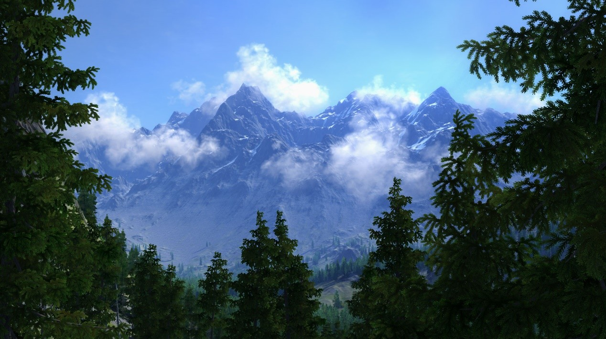

图25 Billboard Clouds技术创建云层的最终效果图 \@UNIGINE Engine

十、图像处理 Image Processing
=============================

图像处理的过程，一般在像素着色器中进行，因为在像素着色器中，可以很好地将渲染过程和纹理结合起来，而且在GPU上跑像素着色器，速度和性能都可以满足一般所需。

一般而言，首先需要将场景渲染成2D纹理或者其他图像的形式，再进行图像处理，这里的图像处理，往往指的是后处理（post
effects）。而下文将介绍到的颜色校正（Color Correction）、色调映射（Tone
Mapping）、镜头眩光和泛光（Lens Flare and Bloom）、景深（Depth of
Field）、运动模糊（Motion Blur），一般而言都是后处理效果。

图26
使用像素着色器进行图像处理。左上为原始图像；右上角显示高斯差分操作，左下边缘显示检测，右下混合的边缘检测与原图像混合。

十一、颜色校正 Color Correction
===============================

色彩校正(Color
correction)是使用一些规则来转化给定的现有图像的每像素颜色到其他颜色的一个过程。颜色校正有很多目的，例如模仿特定类型的电影胶片的色调，在元素之间提供一致的外观，或描绘一种特定的情绪或风格。一般而言，通过颜色校正，游戏画面会获得更好的表现效果。

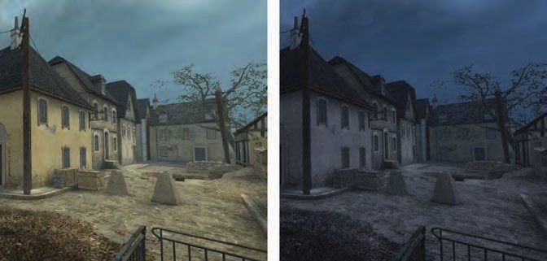

图27 左图是准备进行颜色校正的原图。右图是通过降低亮度，使用卷积纹理（Volume
Texture），得到的夜间效果。\@Valve

颜色校正通常包括将单个像素的RGB值作为输入，并向其应用算法来生成一个新的RGB。颜色校正的另一个用途是加速视频解码，如YUV色彩空间到RGB色彩空间的转换。基于屏幕位置或相邻像素的更复杂的功能也可行，但是大多数操作都是使用每像素的颜色作为唯一的输入。

对于一个计算量很少的简单转换，如亮度的调整，可以直接在像素着色器程序中基于一些公式进行计算，应用于填充屏幕的矩形。

而评估复杂函数的通常方法是使用查找表（Look-Up
Table，LUT）。由于从内存中提取数值经常要比复杂的计算速度快很多，所以使用查找表进行颜色校正操作，速度提升是很显著的。

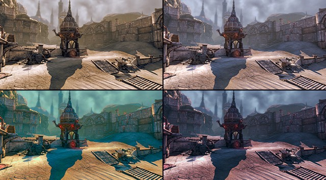

图28 原图和经过色彩校正后的几幅效果图 \@Unreal 4 Engine

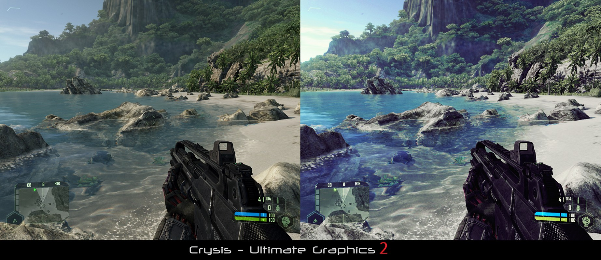

图29 原图和经过颜色校正的效果图 @Crysis

十二、色调映射 Tone Mapping
===========================

计算机屏幕具有特定的亮度范围，而真实图像具有更巨大的亮度范围。色调映射（Tonemapping），也称为色调复制（tone
reproduction），便是将宽范围的照明级别拟合到屏幕有限色域内的过程。色调映射与表示高动态范围的HDR和HDRI密切相关：

-   HDR，是High-Dynamic
    Range（高动态范围）的缩写，可以理解为一个CG的概念，常出现在计算机图形学与电影、摄影领域中。

-   HDRI是High-Dynamic Range Image的缩写，即HDR图像，高动态范围图像。

-   而实际过程中，HDR和HDRI两者经常会被混用，都当做高动态范围成像的概念使用，这也是被大众广泛接受的。

本质上来讲，色调映射要解决的问题是进行大幅度的对比度衰减将场景亮度变换到可以显示的范围，同时要保持图像细节与颜色等表现原始场景的重要信息。

根据应用的不同，色调映射的目标可以有不同的表述。在有些场合，生成“好看”的图像是主要目的，而在其它一些场合可能会强调生成尽可能多的细节或者最大的图像对比度。在实际的渲染应用中可能是要在真实场景与显示图像中达到匹配，尽管显示设备可能并不能够显示整个的亮度范围。

图30 经过色调映射得到的高动态范围图像 \@新西兰惠灵顿圣保罗教堂

十三、镜头眩光和泛光 Lens Flare and Bloom
=========================================

镜头眩光（Lens
flare）是由于眼睛的晶状体或者相机的透镜直接面对强光所产生的一种现象，由一圈光晕（halo）和纤毛状的光环（ciliary
corona）组成。光晕的出现是因为透镜物质（如三棱镜）对不同波长光线折射数量的不过而造成的，看上去很像是光周围的一个圆环，外圈是红色，内圈是紫红色。纤毛状的光环源于透镜的密度波动，看起来像是从一个点发射出来的光线。Lens
flare是近来较为流行的一种图像效果，自从我们认识到它是一种实现真实感效果的技术后，计算机便开始模拟此效果。

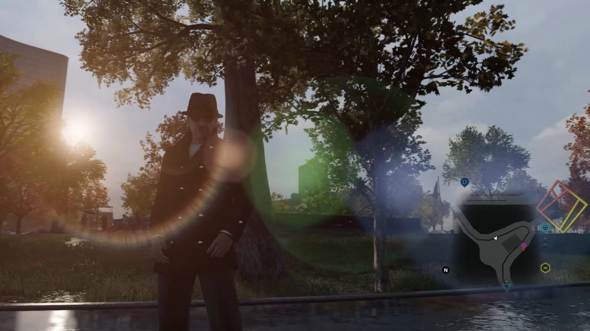

图31 镜头眩光效果 @WatchDogs

泛光（Bloom）效果，是由于眼睛晶状体和其他部分的散光而产生，在光源附近出现的一种辉光。在现实世界中，透镜无法完美聚焦是泛光效果的物理成因；理想透镜也会在成像时由于衍射而产生一种名为艾里斑的光斑。

常见的一个误解便是将HDR和Bloom效果混为一谈。Bloom可以模拟出HDR的效果，但是原理上和HDR相差甚远。HDR实际上是通过映射技术，来达到整体调整全局亮度属性的，这种调整是颜色，强度等都可以进行调整，而Bloom仅仅是能够将光照范围调高达到过饱和，也就是让亮的地方更亮。不过Bloom效果实现起来简单，性能消耗也小，却也可以达到不错的效果。

图32 Bloom效果 @ Battlefield3

图33 《Battlefield 3》中的渲染效果，同时包含镜头眩光（Lens
flare），泛光（Bloom）和Dirty Lens

十四、景深 Depth of Field
=========================

在光学领域，特别是摄影摄像领域，景深（Depth of field，DOF），也叫焦点范围（focus
range）或有效焦距范围（effective
focus），是指场景中最近和最远的物体之间出现的可接受的清晰图像的距离。换言之，景深是指相机对焦点前后相对清晰的成像范围。在相机聚焦完成后，在焦点前后的范围内都能形成清晰的像，这一前一后的距离范围，便叫做景深。

图34 摄影中典型的景深效果

虽然透镜只能够将光聚到某一固定的距离，远离此点则会逐渐模糊，但是在某一段特定的距离内，影像模糊的程度是肉眼无法察觉的，这段距离称之为景深。当焦点设在超焦距处时，景深会从超焦距的一半延伸到无限远，对一个固定的光圈值来说，这是最大的景深。

景深通常由物距、镜头焦距，以及镜头的光圈值所决定（相对于焦距的光圈大小）。除了在近距离时，一般来说景深是由物体的放大率以及透镜的光圈值决定。固定光圈值时，增加放大率，不论是更靠近拍摄物或是使用长焦距的镜头，都会减少景深的距离；减少放大率时，则会增加景深。如果固定放大率时，增加光圈值（缩小光圈）则会增加景深；减小光圈值（增大光圈）则会减少景深。

景深的效果在计算机图形学中应用广泛，电影，游戏里面经常会利用景深特效来强调画面重点。相应的，已经有了很多成熟的算法在不同的渲染方法，而光栅化可以很高效的实现现有的景深算法。

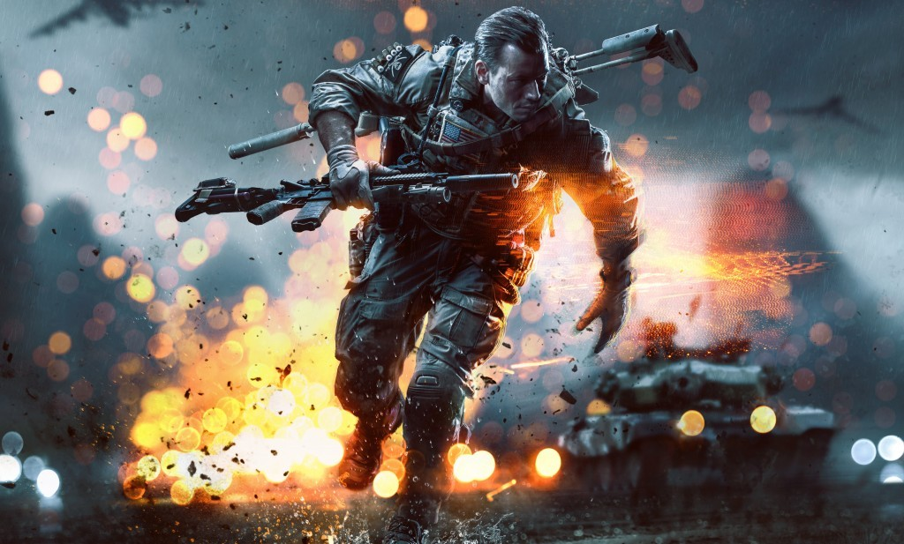

图35 景深效果 @Battlefield 4

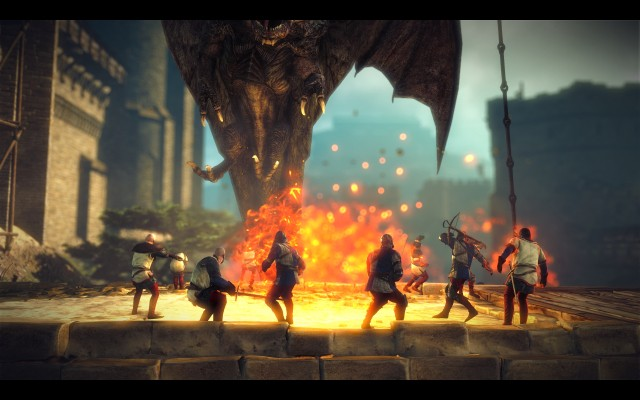

图36 景深效果 @ Witcher 2

十五、运动模糊 Motion Blur
==========================

现实世界中，运动模糊（Motion
Blur，或译为动态模糊)，是因为相机或者摄影机的快门时间内物体的相对运动产生的。在快门打开到关上的过程中，感光材料因为受到的是物体反射光持续的照射成像。即在曝光的这个微小时间段内，对象依然在画面中移动，感光材料便会记录下这段时间内物体运动的轨迹，产生运动模糊。

我们经常在电影中看到这种模糊，并认为它是正常的，所以我们期望也可以在电子游戏中看到它，以带给游戏更多的真实感。

若无运动模糊，一般情况下，快速移动的物体会出现抖动，在帧之间的多个像素跳跃。这可以被认为是一种锯齿，但可以理解为基于时间的锯齿，而不是基于空间的锯齿。在这个意义上，运动模糊可以理解为是一种时间意义上的抗锯齿。

正如更高的显示分辨率可以减少但不能消除锯齿，提高帧速率并不能消除运动模糊的需要。而视频游戏的特点是摄像机和物体的快速运动，所以运动模糊可以大大改善画面的视觉效果。而事实表明，带运动模糊的30
FPS画面，通常看起来比没有带运动模糊的60 FPS画面更出色。

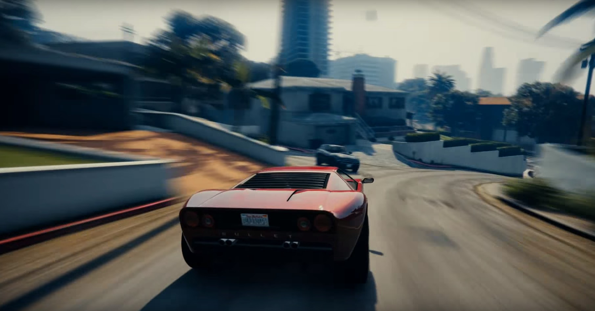

图37 Motion Blur效果 @GTA5

在计算机绘制中产生运动模糊的方法有很多种。一个简单但有限的方法是建模和渲染模糊本身。

实现运动模糊的方法大致分3种：

1、直接渲染模糊本身。通过在对象移动之前和之后添加几何体来完成，并通过次序无关的透明，避免Alpha混合。

2、基于累积缓冲区（accumulationbuffer），通过平均一系列图像来创建模糊。

3、基于速度缓冲器（velocity
buffer）。目前这个方法最为主流。创建此缓冲区，需插入模型三角形中每个顶点的屏幕空间速度。通过将两个建模矩阵应用于模型来计算速度，一个用于最后一个帧，一个用于当前模型。顶点着色器程序计算位置的差异，并将该向量转换为相对的屏幕空间坐标。图10.34显示了速度缓冲器及其结果。

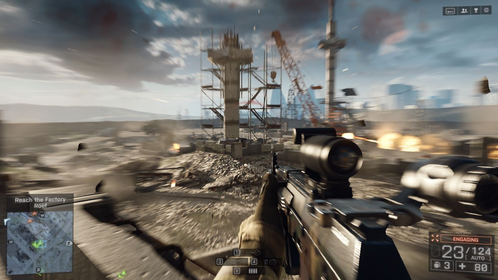

图38 Motion Blur效果 @Battlefield4

运动模糊对于由摄像机运动而变得模糊的静态物体来说比较简单，因为往往这种情况下不需要速度缓冲区。如果需要的是摄像机移动时的运动感，可以使用诸如径向模糊（radial
blur）之类的固定效果。如下图。

图39 径向模糊可以增强运动感 @《刺客信条》Ubisoft

十六、体渲染 Volume Rendering
=============================

体渲染（Volume
Rendering），又称立体渲染，体绘制，是一种用于显示离散三维采样数据集的二维投影的技术。体渲染技术中的渲染数据一般用体素（Volumeric
Pixel，或Voxel）来表示，每个体素表示一个规则空间体。例如，要生成人头部的医学诊断图像（如CT或MRI），同时生成256
x256个体素的数据集合，每个位置拥有一个或者多个值，则可以将其看做三维图像。因此，体渲染也是基于图像的渲染技术中的一种。

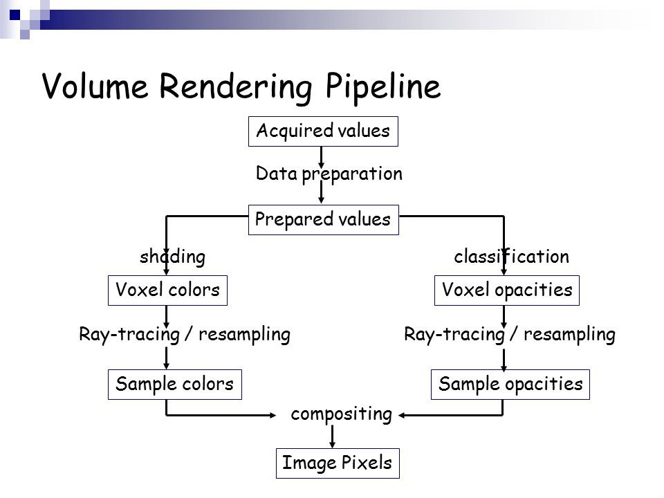

图40 一个典型的体渲染Pipeline

体渲染技术流派众多，常见的流派有：

-   体光线投射Volume ray casting

-   油彩飞溅技术Splatting

-   剪切变形技术Shear warp

-   基于纹理的体绘制Texture-based volume rendering

-   等。

图41 基于Splatting和voxel在Unreal 4中进行的体渲染

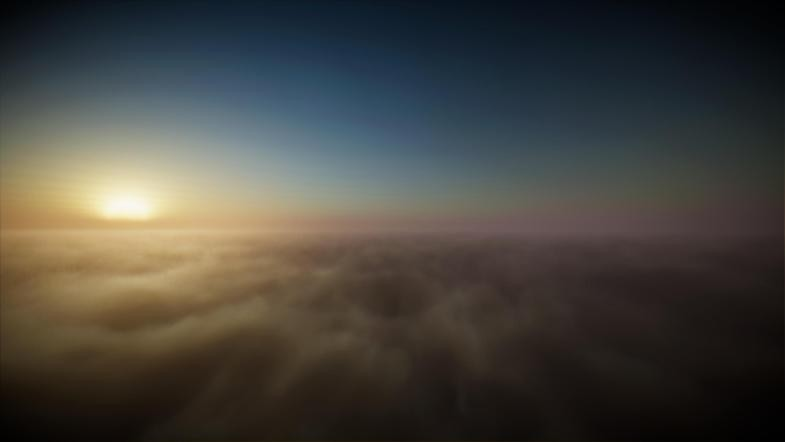

图42 Volume Cloud（体积云）效果 @Unity 5

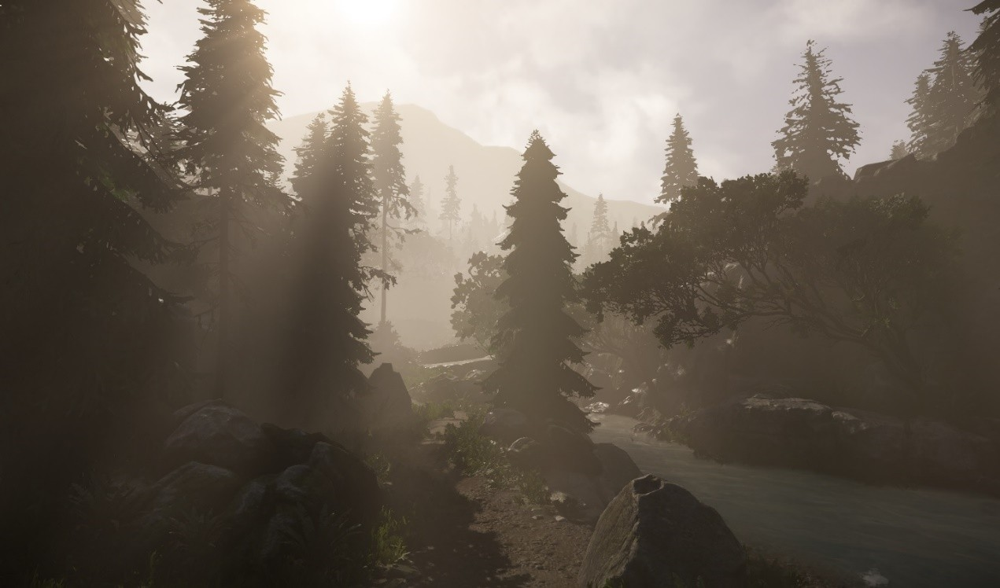

图43 Volume Fog（体积雾）效果 @CRY ENGINE 3
