# 【《Real-Time Rendering 3rd》 提炼总结】(十一) 第十四章 : 游戏开发中的渲染加速算法总结
 

导读
====

这是一篇1万3千余字的总结式文章，通过阅读，你将对游戏开发与实时渲染中加速渲染算法的以下要点有所了解：

-   常用空间数据结构（Spatial Data Structures）

    -   层次包围盒（BVH ,Bounding Volume Hierarchies）

    -   BSP树（BSP Trees）

    -   八叉树（Octrees）

    -   场景图（Scene Graphs）

-   各种裁剪技术（Culling Techniques）

    -   背面裁剪（Backface Culling）

    -   视锥裁剪（View Frustum Culling）

    -   遮挡剔除（Occlusion Culling）

    -   层次视锥裁剪（Hierarchical View Frustum Culling）

    -   入口裁剪（Portal Culling）

    -   细节裁剪（Detail Culling）

-   各种层次细节（LOD，Level of Detail）技术

    -   几种LOD切换技术（Discrete Geometry LODs、Blend LODs、Alpha LODs、CLODs
        and Geomorph LODs）

    -   几种LOD的选取技术（Range-Based、Projected Area-Based、Hysteresis）

-   大型模型的渲染（Large Model Rendering）

-   点渲染（Point Rendering）

引言
====

《Real-Time Rendering
3rd》书中提到，实时渲染领域有四大目标，激励着游戏开发者们不断进步，它们是：

-   更高的每秒帧数

-   更高的分辨率

-   渲染更多的物体与更具真实感的场景

-   实现更高的复杂度

而要不断地追逐这四大目标，需要持续不断的优化算法，进行技术革新和硬件的升级。其中，加速渲染相关的算法一直是追逐这四大目标的重要一环。

这篇文章将基于《Real-Time Rendering 3rd》第十四章“Acceleration
Algorithms”的内容，介绍计算机图形学和游戏开发中常用的对渲染进行加速的算法，尤其是对大量几何体的渲染，而很多这类算法的核心都是基于空间数据结构（Spatial
Data
Structures）。所以，本文将先介绍一些游戏开发中常用的空间数据结构，再进行各种加速算法，不同种类的裁剪算法，LOD相关的介绍。

一、空间数据结构 \| Spatial Data Structures
===========================================

空间数据结构（Spatial Data
Structures）是将几何体组织在N维空间中的一系列数据结构，而且我们可以很容易地将二维和三维的一些概念扩展到高维之中。这些空间数据结构可以用于很多实时渲染相关操作的加速查询中，如场景管理，裁减算法、相交测试、光线追踪、以及碰撞检测等。

空间数据结构的组织通常是层次结构的。宽泛地说，即最顶层包含它之下的层次，后者又包含更下层的层次，以此类推。因此，这种结构具有嵌套和递归的特点。用层次结构的实现方式对访问速度的提升很有帮助，复杂度可以从O(n)提升到O(log
n)。但同时，使用了层次结构的大多数空间数据结构的构造开销都比较大，虽然也可以在实时过程中进行渐进更新，但是通常需要作为一个预处理的过程来完成。

一些常见的空间数据结构包括：

-   层次包围盒（Bounding Volume Hierachy，BVH）

-   二元空间分割树（Binary Space Partitioning，BSP），

-   四叉树 （QuadTree）

-   kd树（k-dimensional tree）

-   八叉树（Octree）

-   场景图 （Scene Graphs）

其中，BSP树和八叉树都是基于空间细分（Space
Subdivision）的数据结构，这说明它们是对整个场景空间进行细分并编码到数据结构中的。例如，所有叶子节点的空间集合等同于整个场景空间，而且叶子节点不相互重叠。

BSP树的大多数变种形式都是不规则的，而松散地意味着空间可以被任意细分。

八叉树是规则的，意味着空间是以一种均匀的形式进行分割，虽然这种均匀性限制比较大，但这种均匀性常常是效率的源泉。另外值得注意的是，八叉树是四叉树的三维空间推广。

另一方面，层次包围盒不是空间细分结构，它仅将几何物体周围的空间包围起来，所以包围层次不需要包围所有的空间。

下文将对其中的层次包围盒、二元空间分割树、八叉树进行近一步介绍，并还将简单提到场景图(SceneGraph)，这是一种比较高层次的，相较渲染性能更关注模型关系的数据结构。

当然，限于篇幅原因，这里的每种数据结构都无法介绍得事无巨细，但已在每种数据结构介绍的最后备好了一些延伸的阅读材料，方便希望进一步了解的朋友们进行延伸阅读。

1.1 层次包围盒 \| Bounding Volume Hierarchies , BVH
---------------------------------------------------

层次包围盒（Bounding Volume Hierarchies,
BVH）方法的核心思想是用体积略大而几何特征简单的包围盒来近似地描述复杂的几何对象，从而只需对包围盒重叠的对象进行进一步的相交测试。此外，通过构造树状层次结构，可以越来越逼近对象的几何模型，直到几乎完全获得对象的几何特征。

对于三维场景的实时渲染来说，层次包围体（Bounding Volume
Hierarchy，BVH）是最常使用的一种空间数据结构。例如，层次包围体经常用于层次视锥裁减。场景以层次树结构进行组织，包含一个根节点（root）、一些内部节点（internal
nodes），以及一些叶子节点（leaves）。顶部的节点是根，其无父节点。叶子节点（leaf
node）包含需渲染的实际几何体，且其没有子节点。

相比之下，内部节点包含指向它子节点的指针。因此，只要根节点不是这颗树唯一的一个节点，那么它就是一个内部节点。树中的每一个节点，包括叶子节点，都有一个包围体可以将其子树中的所有几何体包围起来，这就是包围体层次的命名来源，同时，也说明了根节点有一个包含整个场景的包围体。

图1
左图为一个包含6个物体的简单场景，每个物体由一个包围的球体封闭起来，其中可以将包围球体归组为一个更大的包围球体，如此内推，直到所有的物体被最大的球体包围，右图所示为层次包围体（树），可以用来表示左图的物体层次、根节点的包围体包含场景中的所有物体。

图2 层次包围盒的实现
\@[http://thomasdiewald.com/blog/?p=1488](https://link.zhihu.com/?target=http%3A//thomasdiewald.com/blog/%3Fp%3D1488)

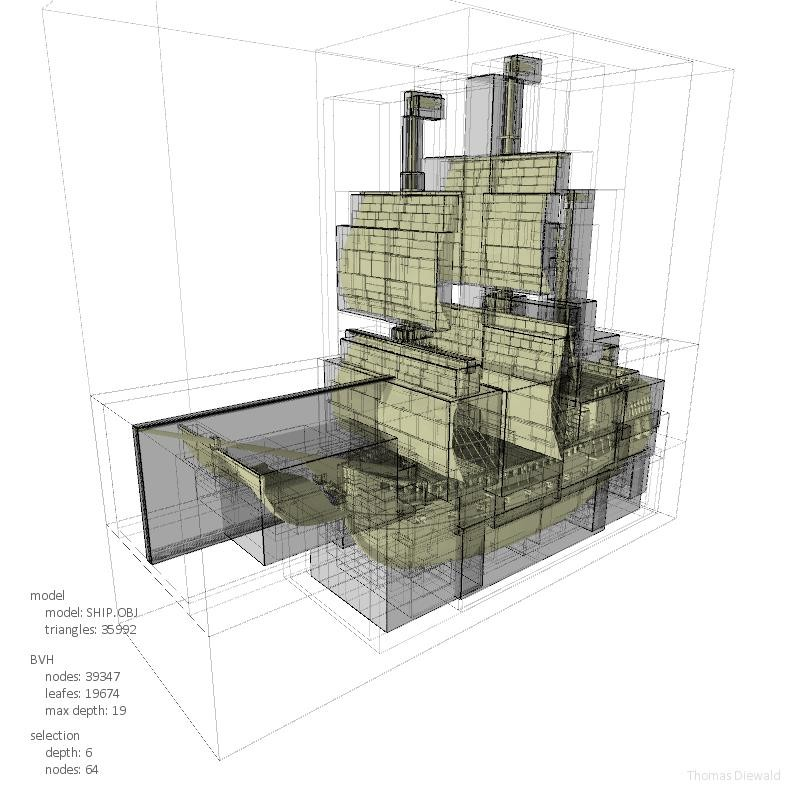

图3 层次包围盒的实现
\@[http://thomasdiewald.com/blog/?p=1488](https://link.zhihu.com/?target=http%3A//thomasdiewald.com/blog/%3Fp%3D1488)

### 1.1.1 BVH的延伸阅读材料

[1] [https://hal.inria.fr/inria-00537446/file/bounding_volume_hierarchies.pdf](https://link.zhihu.com/?target=https%3A//hal.inria.fr/inria-00537446/file/bounding_volume_hierarchies.pdf)

[2] [https://www.codeproject.com/Articles/832957/Dynamic-Bounding-Volume-Hiearchy-in-Csharp](https://link.zhihu.com/?target=https%3A//www.codeproject.com/Articles/832957/Dynamic-Bounding-Volume-Hiearchy-in-Csharp)

[3] Wald I, Boulos S, Shirley P. Raytracing deformable scenes using dynamic
bounding volume hierarchies[J]. ACM Transactions on Graphics (TOG), 2007, 26(1):
6.

1.2 BSP树 \| BSP Trees
----------------------

BSP树(二叉空间分割树，全称Binary Space Partitioning
Tree)是一种常用于判别对象可见性的空间数据结构。类似于画家算法，BSP树可以方便地将表面由后往前地在屏幕上渲染出来，特别适用于场景中对象固定不变，仅视点移动的情况。

其中，BSP是Binary
SpacePartitioning（二叉空间划分法）的缩写。这种方法递归地将空间使用超平面划分为凸面体集合。而这种子划分引出了借助于称之为BSP树的树形数据结构的场景表示。

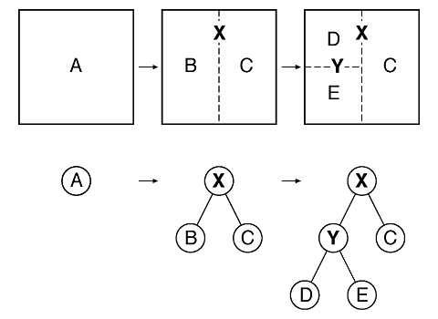

图4 一个BSP树的构造

BSP
树是一棵二叉树，每个节点表示一个有向超平面，其将当前空间划分为前向（front）和背向（back）两个子空间，分别对应当前节点的左子树和右子树。且BSP
树已经在游戏工业上应用了许多年（Doom是第一个使用BSP树的商业游戏）。尽管在现今BSP树已经没像过去那么受欢迎了，但使用依然广泛。

BSP树的一个有趣特性是，如果用一种特定的方式遍历，树的几何内容可以从任何角度进行前后排序。这个排序可以近似轴对齐，精确对齐多边形BSP。与BVH不同的是，BVH通常不包含任何形式的排序。

### 1.2.1 BSP树的构造

-   从空树开始，每次选择一个面片作为节点插入树中

-   每次插入一个新节点，从树的根节点开始遍历

    -   如果新节点面片与当前结点片面相交，将新面片分割成两个面片

    -   新节点在当前节点前向空间，插入左子树

    -   新节点在当前节点背向空间，插入右子树

    -   当前节点为空，直接插入新节点

-   直到所有面片都被插入树中

简单来说，若要创建BSP树，需递归将一个平面空间一分为二，并将几何体归类到这两个空间中来完成。

### 1.2.2 BSP树的遍历

从根节点开始，判断输入位置与当前分割平面的“前”、“后”关系，

“前”则遍历左子树，“后”则遍历右子树，递归到叶子节点终止。

用平面方程 Ax + By + Cz + D = 0判断前后位置，可用 D(x0, y0, z0 ) = Ax0 + By0
+Cz0 +D 进行判别，其中：

-   D \> 0：在平面前面

-   D = 0：在平面上

-   D \< 0：在平面后面

这里贴出从后向前遍历BSP的示例代码：

    traverse_tree(bsp_tree* tree,point eye)  
	{  
	    location = tree->find_location(eye);  
	  
	    if(tree->empty())  
	        return;  
	  
	    if(location > 0)      // if eyeinfront of location  
	    {  
	        traverse_tree(tree->back,eye);  
	        display(tree->polygon_list);  
	        traverse_tree(tree->front,eye);  
	    }  
	    else if(location < 0) // eye behind location  
	    {  
	        traverse_tree(tree->front,eye);  
	        display(tree->polygon_list);  
	        travers_tree(tree->back,eye);  
	    }  
	    else                  // eyecoincidental with partition hyperplane  
	    {  
	        traverse_tree(tree->front,eye);  
	        traverse_tree(tree->back,eye);  
	    }  
	}  

### 1.2.3 BSP树的种类

在计算机图形学中，BSP树有两大类别，分别是为轴对齐（Axis-Aligned）BSP树和多边形对齐（Polygon-Aligned）BSP树。下面分别进行介绍。

### 1.2.4 轴对齐BSP树 \| Axis-aligned BSP tree

轴对齐BSP树可以按如下方式来创建。首先，将整个场景包围在一个AABB（轴对齐包围盒，Axis-Aligned
Bounding Box）中，然后以递归的方式将这个包围盒分为若干个更小的盒子。

现在，考虑一下任何递归层次的盒子。选取盒子的一个轴，生成一个与之垂直的平面，将盒子一分为二。有一些方法可以将这个分割平面固定，从而将这个盒子分为完全相同的两部分，而也有其他的一些方法，允许这个平面在位置上有一些变化。与分割平面相交的物体，要么存储在这个层次上，成为两个子集中的一员，要么被这个平面分割为两个不同的物体。经过这个过程，每个子集就处于一个比较小的盒子中，重复这个平面分割的过程，就可以对每个AABB进行递归细分，直到满足某个标准才终止这个分割过程。而这个标准，通常是用户定义的树最大深度，或者是盒子里面所包含的几何图元数量，需低于用户定义的某个值。

分割平面的轴线和位置对提高效率至关重要。一种分割包围盒的方法就是轴进行循环。即在根节点，沿着x轴对盒子进行分割，然后再沿着y轴对其子盒子进行分割，最后沿z轴对其孙盒子进行分割。这样，就完成了一个循环周期。使用这种分割策略的BSP树常被称为k-d树。而另一种常见策略是找到盒子的最长边，沿着这条边的方向对盒子进行分割。

下图展示了一种轴对齐BSP树的分割过程。

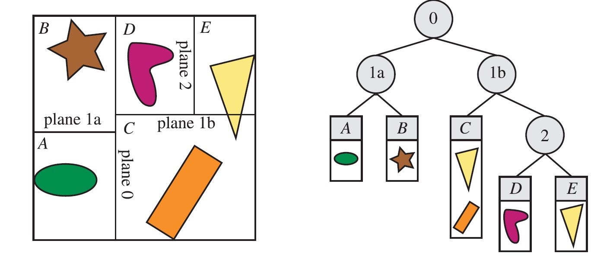

图5 轴对齐
BSP树。在这个示例中，允许空间分割位于轴上的任意位置，不一定必须在中点位置，形成的空间体分别用A\~E来标志。右图所示的树是当前的BSP树数据结构，每个叶子节点表示一个区域，区域内容显示在下方。注意，黄色三角形在物体列表中含有C和E两个区域，因为它同时覆盖了这两个区域。

值得一提的是，从前到后的粗排序（Rough Front-to-Back
Sorting）是轴对齐BSP树的一种应用示例，这种方法对于遮挡剔除算法非常有用。而在视点的另一侧进行遍历，可以得到从后向前的粗排序（Rough
Fack-to-Gront
Sorting）,这对于透明排序非常有用。且还可以用来测试射线和场景几何体相交的问题，只需将视点位置换为射线原点即可，另外还可以用于视锥裁剪。

### 1.2.5 多边形对齐BSP树 | Polygon-aligned BSP tree

多边形对齐BSP树（Polygon-aligned BSP
tree）是BSP树的另一大类型，其中将多边形作为分隔物，对空间进行平分。也就是说，在根节点处，选取一个多边形，用这个多边形所在平面将场景中剩余多边形分为两组。对于与分割平面相交的多边形来说，沿着其中的交线将这个多边形分为两部分。然后，在分割平面的每个半空间中，选取另外一个多边形作为分隔物，只对这个分隔物所在平面的多边形进行继续分割，直到所有的多边形都在BSP树中为止。

需要注意，多边形对齐BSP树的创建是一个非常耗时的过程，这些树通常只需计算一次，可以存储起来进行重用。

下图是一个多边形对齐BSP树的图示。

图6
多边形对齐BSP树。左图中，多边形分别用A\~G表示。首先，用多边形A对空间进行分割，生成的两个半空间分别由多边形B和C分割，由B形成的分割平面与左下角的多边形相交，将其分割为多边形D和E。最后形成的BSP书如右图所示。

因为完全不平衡树的效率非常低，所以多边形对齐BSP树分割时最好是形成平衡树，即每个叶子节点的深度相同或者相差一个层次的树。

多边形对齐BSP树的一个典型性质就是对于一个给定的视点来说，可以对该结构按照从后往前（或者从前往后）的顺序进行严格遍历，而轴对齐的BSP通常只能给出粗略的排序顺序。所以，基于多边形对齐BSP树的此性质，建立了严格的前后顺序，可以配合画家算法来绘制整个场景，而无需Z缓冲。

多边形对齐BSP树的其他应用也包括相交测试和碰撞检测等。

### 1.2.6 BSP树的延伸阅读材料推荐

[1] [http://web.cs.wpi.edu/\~matt/courses/cs563/talks/bsp/bsp.html](https://link.zhihu.com/?target=http%3A//web.cs.wpi.edu/%7Ematt/courses/cs563/talks/bsp/bsp.html)

[2] [https://pdfs.semanticscholar.org/90e4/c4a65b4b04d9e2374e5753659c102de4c0eb.pdf](https://link.zhihu.com/?target=https%3A//pdfs.semanticscholar.org/90e4/c4a65b4b04d9e2374e5753659c102de4c0eb.pdf)

[3] [https://en.wikipedia.org/wiki/Binary_space_partitioning](https://link.zhihu.com/?target=https%3A//en.wikipedia.org/wiki/Binary_space_partitioning)

[4] [http://archive.gamedev.net/archive/reference/programming/features/bsptree/bsp.pdf](https://link.zhihu.com/?target=http%3A//archive.gamedev.net/archive/reference/programming/features/bsptree/bsp.pdf)

1.3 八叉树 \| Octrees
---------------------

八叉树（octree），或称八元树，是一种用于描述三维空间的树状数据结构。八叉树的每个节点表示一个正方体的体积元素，每个节点有八个子节点，这八个子节点所表示的体积元素加在一起就等于父节点的体积。一般中心点作为节点的分叉中心。

简单来说，八叉树的空间划分方式很简单，即递归地进行规整地1分为8的操作。如下图，把一个立方体分割为八个同样大小的小立方体，然后递归地分割出更的小立方体。这个就是八叉树的命名来源。这种分割方式可以得到比较规则的结构，从而使得查询变得高效。

图7 八叉树的构成 \@wiki

相似地，四叉树是把一个二维的正方形空间分割成四个小正方形。而八叉树是四叉树的三维空间推广。

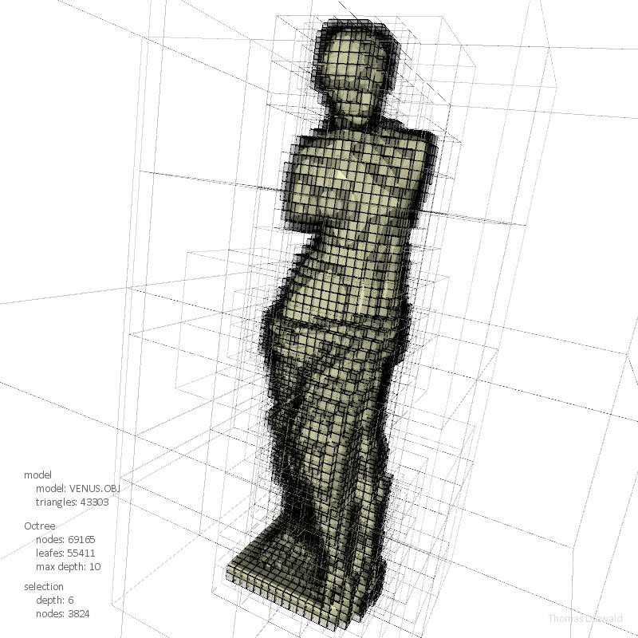

图8 八叉树的实现
\@[http://thomasdiewald.com/blog/?p=1488](https://link.zhihu.com/?target=http%3A//thomasdiewald.com/blog/%3Fp%3D1488)

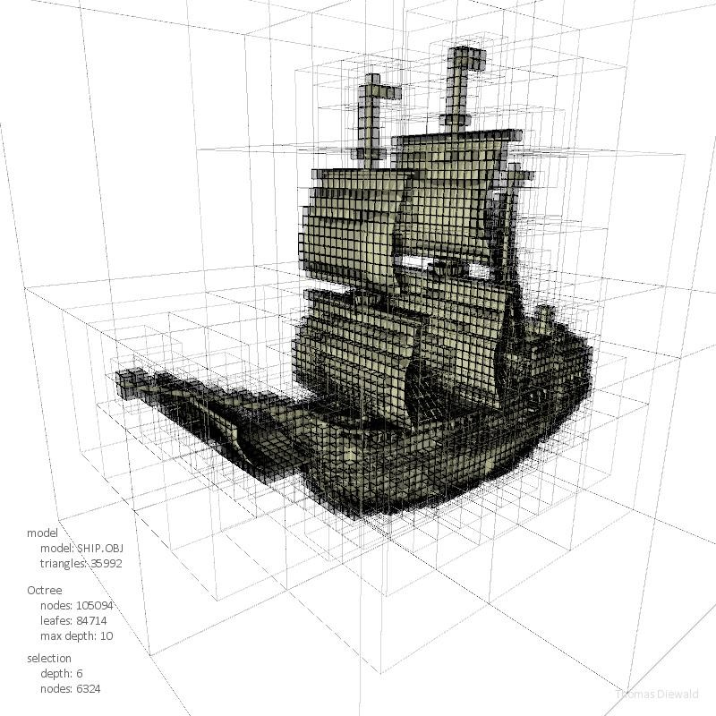

图9 八叉树的实现
\@[http://thomasdiewald.com/blog/?p=1488](https://link.zhihu.com/?target=http%3A//thomasdiewald.com/blog/%3Fp%3D1488)

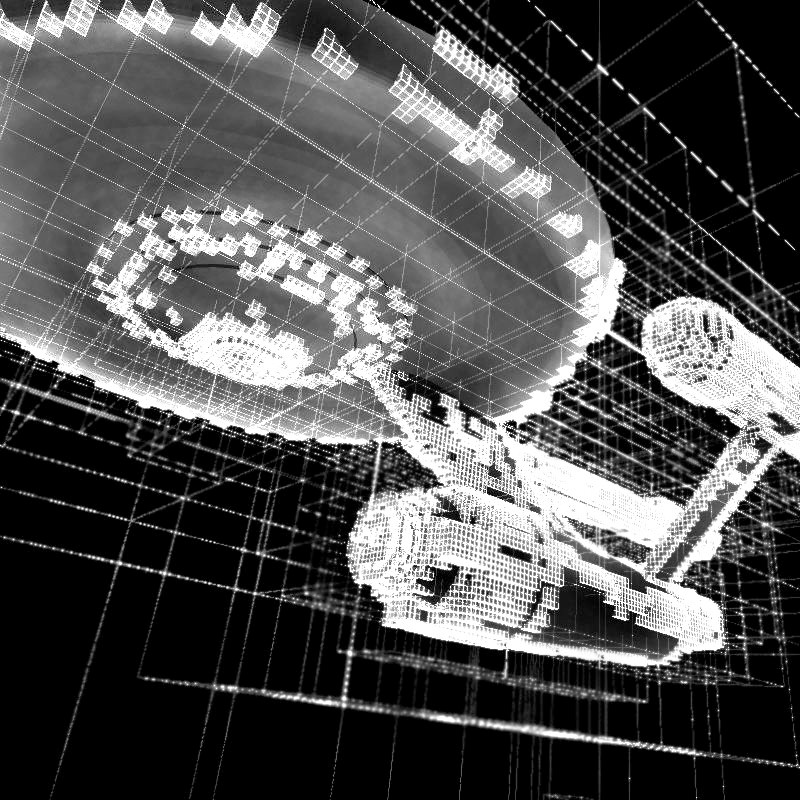

图10 八叉树的实现
\@[http://thomasdiewald.com/blog/?p=1488](https://link.zhihu.com/?target=http%3A//thomasdiewald.com/blog/%3Fp%3D1488)

上述三幅图也均来自《Space Partitioning: Octree
vs.BVH》[http://thomasdiewald.com/blog/?p=1488](https://link.zhihu.com/?target=http%3A//thomasdiewald.com/blog/%3Fp%3D1488)一文，这是一篇比较八叉树和BVH的有趣的文章，有兴趣的朋友可以阅读一下。

### 1.3.1 松散八叉树 Loose Octrees

松散八叉树的基本思想和普通八叉树一样，但是每个长方体的大小选中比较宽松。而如果一个普通长方体的边长为l，那么可以用kl来代替，其中k\>1，如下图所示。

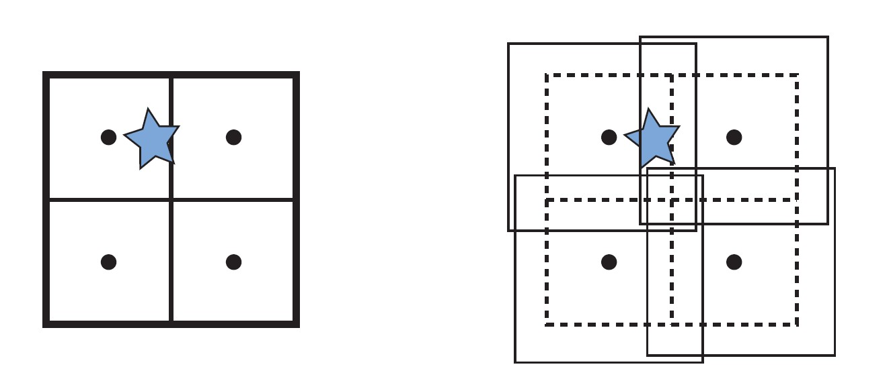

图11
一个普通八叉树和松散八叉树的比较。图中黑色的原点表示长方形的中心点（第一次细分）。在左图中，星形物体刺穿了一个普通八叉树的一个分割平面。，这样，一种选择就是将这个星型物体放在最大的长方形中（根节点的长方体）。而右图所示为一个k=1.5的松散八叉树，也就是将长方体放大了50%，如果将这些长方体稍微移动，就可以保证区分出它们。这样，这个星型多边形就完全位于左上角的长方形之中。

### 1.3.2 八叉树延伸阅读材料

[1] [http://web.cs.wpi.edu/\~matt/courses/cs563/talks/color_quant/CQoctree.html](https://link.zhihu.com/?target=http%3A//web.cs.wpi.edu/%7Ematt/courses/cs563/talks/color_quant/CQoctree.html)

[2] [https://en.wikipedia.org/wiki/Octree](https://link.zhihu.com/?target=https%3A//en.wikipedia.org/wiki/Octree)

[3] Losasso F, Gibou F, Fedkiw R.Simulating water and smoke with an octree data
structure[C]//ACM Transactionson Graphics (TOG). ACM, 2004, 23(3): 457-462.

1.4 场景图 | Scene Graphs
--------------------------

BVH、BSP树和八叉树都是使用某种形式的树来作为基本的数据结构，它们的具体区别在于各自是如何进行空间分割和几何体的存储，且他们均是以层次的形式来保存几何物体。然而三维场景的绘制不仅仅是几何体。

然而，渲染三维场景不仅仅只是渲染出几何图形，对动画，可见性，以及其他元素的控制，往往需要通过场景图（Scene
Graphs）来完成。

场景图被誉为“当今最优秀且最为可重用的数据结构之一。”Wiki中的对场景图的定义是“场景图（Scene
Graph）是组织和管理三维虚拟场景的一种数据结构，是一个有向无环图（Directed
Acyclic Graph， DAG）。”

场景图是一个面向用户的树结构，可以通过纹理、变换、细节层次、渲染状态（例如材质属性）、光源以及其他任何合适的内容进行扩充。它由一棵以深度优先遍历来渲染整个场景的树来表示。

图12 通过创建场景图来表示对象

另外提一句，开源的场景图有Open Scene
Graph和OpenSG等，有兴趣的朋友们可以进行进一步了解。

### 1.4.1 场景图的延伸阅读材料

[1] [http://www.openscenegraph.org/index.php/documentation/knowledge-base/36-what-is-a-scene-graph](https://link.zhihu.com/?target=http%3A//www.openscenegraph.org/index.php/documentation/knowledge-base/36-what-is-a-scene-graph)

[2] [https://en.wikipedia.org/wiki/Scene_graph](https://link.zhihu.com/?target=https%3A//en.wikipedia.org/wiki/Scene_graph)

[3] [http://archive.gamedev.net/archive/reference/programming/features/scenegraph/index.html](https://link.zhihu.com/?target=http%3A//archive.gamedev.net/archive/reference/programming/features/scenegraph/index.html)

二、裁剪技术 \| Culling Techniques
==================================

裁剪（Culling）的字面意思是“从大量事物中进行删除”。在计算机图形学中，相对应的就是裁剪技术（Culling
Techniques）所要做的工作——“从大量游戏事物中进行删除”。所谓的“大量事物”就是需要绘制的整个场景，删除的是对最终图像没有贡献的场景部分，然后将剩余场景发送到渲染管线。因此，在渲染方面通常使用“可见性裁剪（Visibility
Culling）”这个术语。但其实，裁剪也可以用于程序的其他部分，如碰撞检测（对不可见物体进行不十分精确的计算）、物理学计算，以及人工智能（AI）领域。

与渲染相关的裁剪技术，常见的有背面裁剪（Backface Culling），视锥裁剪（View
Frustum Culling），以及遮挡裁剪（Occlusion Culling，也常常称作遮挡剔除）：

-   背面裁剪即是将背向视点的物体删除，是一种非常简单直观的操作，只能一次一对个单一多边形进行操作。

-   视锥裁剪是将视锥之外的多边形删除，相对而言，这种操作比背面裁剪稍微复杂。

-   遮挡裁剪，是将被其他物体遮挡的物体进行删除，这种操作在三者中最为复杂，因为其需要聚集一个或者多个物体，同时还需使用其他物体的位置信息。

理论上，裁剪操作可以发生在渲染管线的任何一个阶段，而且对于一些遮挡裁剪算法来说，甚至可以预先计算出来。对于在硬件中实现的裁剪算法来说，有时只需启动/禁止或者设置一些裁剪函数即可。而为了进行完全控制，我们可以在应用程序阶段在（CPU上）实现一些裁剪算法。假设瓶颈位置不在CPU上，渲染最快的多边形就是没有送到图形加速器管线上的多边形，裁剪通常可以使用几何计算来实现，但也不局限于此。例如，某算法也可以使用帧缓冲中的内容。而理想的裁剪算法预期是只发送所有图元中通过管线的精确可见集(Exact
Visible Set, EVS)。

下图是三种裁剪技术的对比图示。

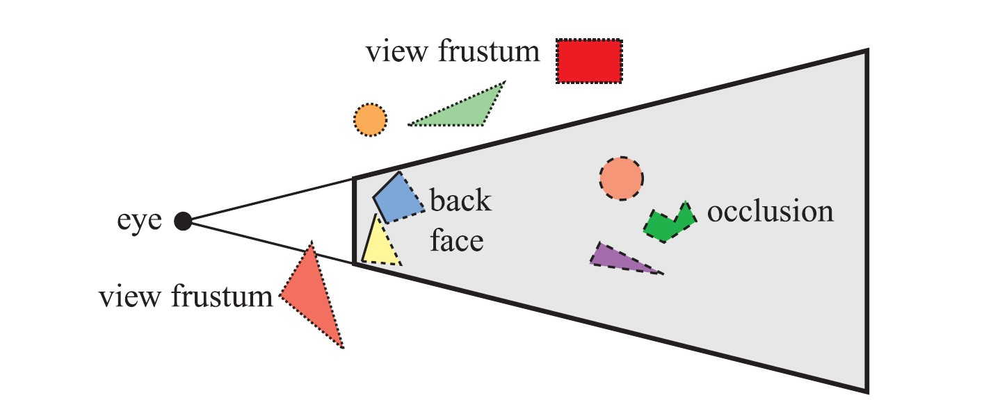

图13 三种裁剪技术的对比，其中被裁剪掉的几何体用虚线表示

下文接下来将分别介绍背面裁剪、层次视锥裁剪、入口裁剪、细节裁剪、遮挡剔除等几种裁剪技术。

三、背面裁剪 \| Backface Culling
================================

假设你正在观察一个场景中不透明的球体。大约有一半的球体是不可见的。那么，可以从中这个例子里得到一个众所周知的结论，那就是，对不可见的内容不需要进行渲染，因为它们对最终的渲染图像没有贡献。不需要对球体的背面进行处理，这就是背面裁剪的基本思想。对于一组物体来说，还可以一次性地进行背面裁剪，这也称为聚集背面裁剪（Clustered
Backface Culling）。

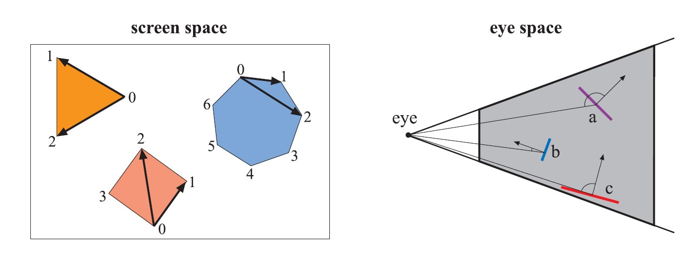

图14
确定多边形是否背向的两种不同测试。左图所示为屏幕空间的测试情形，三角形和四边形是正向，而七边形是背向。对背向的七边形，无需进行光栅化。

右图为视点空间中背面测试情形，多边形A是背向的，而B和C是正向的。多背向的多边形A，无需进行光栅化。

四、层次视锥裁剪 \| Hierarchical View Frustum Culling
=====================================================

如上文所示，只需对完全或者部分在视锥中的图元进行渲染。一种加快渲染速度的方法便是将每个物体的包围体与视锥进行比较，如果包围体位于视锥之外，那么便不需要渲染包围体中的几何体。由于这些计算在CPU上进行，因此包围体中的几何体不需要通过管线中的几何和光栅阶段。相反，如果包围体在视锥内或者与视锥相交，那么包围体中的内容就是可见的，所以必须发送到渲染管线中去。

利用空间数据结构，可以分层地来应用这种裁剪。例如，对于层次包围体BVH来说，从根节点进行先序遍历（Preorder
Transversal），就可以完成这一任务。

图15
左图所示为一组几何体和相应的包围体（球体），从视点位置使用视锥裁剪来渲染场景。右图所示为层次包围体，视节点的包围体与视锥相交，对子包围体进行遍历测试，左子树的包围体与视锥相交，而其中只有一个子节点与视锥相交，另外一个子包围体体外边，无需发送到管线。根节点中间子树的包围体完全位于视锥内部，可以立即进行渲染，右边的子树的包围体也完全位于视锥内部，所以不需要进一步测试就可以渲染整个子树。

视锥裁剪操作位于应用程序阶段（CPU），这意味着几何阶段和光栅阶段都可以从中受益，对于大场景或者一定的相机视线来说，场景只有一小部分是可见的，只需要将这部分发送到渲染管线。可期望获得一定的加速效果，视锥裁剪技术利用了场景中的空间相关性，因为可以将彼此靠近的物体包围在一个包围体中，而且几乎所有包围体都是以层次形式聚集在一起。

除了层次包围体，其他的空间数据结构同样也可以用于视锥裁剪，包括上文提到的八叉树和BSP树。但是当渲染动态场景时，这些方法便会显得不够灵活,不如层次包围体。

五、入口裁剪 \| Portal Culling
==============================

对建筑物模型来说，很多裁剪方面的算法可以归结为入口裁剪（Protal
Culling）。在这个方向，最早的算法由Airey提出，随后Teller和Sequin，以及Teller和Hanrahan构造出了更高效，更复杂的算法。

入口裁剪算法的基本思想是，在室内场景中，建筑物墙面通常充当大的遮挡物，通过每个入口（如门或者窗户）进行视锥裁剪。当遍历入口的时候，就减小视锥。

使得与入口尽可能紧密贴合。因此，可以将入口裁减算法看作是视锥裁剪算法的一种扩展，且需将位于视锥之外的入口丢弃。

入口裁剪方法以某种方式对场景进行预处理，可以是自动形式，也可以是手动形式，可以将场景分割为一系列单元（Cells），其通常对应于建筑物中的房间或者走廊；链接进阶房间的门和窗口称为入口（Protals）。单元中的每个物体和单元的墙面可以存储在一个与单元关联的数据结构中，还可以将邻接单元和链接这些单元的入口信息保存在一个临接图中。

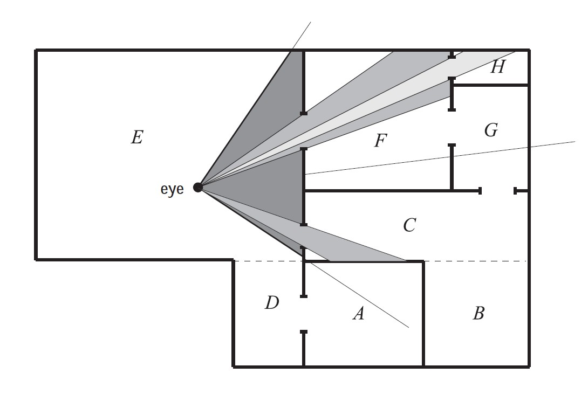

图16
入口裁剪。单元分别从A到H，入口是连接单元的通路，只对穿过入口能看到的几何体进行渲染。

图17
入口裁剪，左图为房间顶视图，白线表示每一个入口的截锥体减少的方式。红线是在镜子上反射圆台来产生的。实际视图显示在右侧的图像中。

六、细节裁剪 \| Detail Culling
==============================

细节裁剪（Detail
Culling）是一种通过牺牲质量换取速度的技术。其基本原理是，当视点处于运动的时候，场景中的微小细节对渲染出的图像贡献甚微。且当视点停下来的时候，通常禁止细节裁剪。

考虑一个具有包围体的问题，将这个包围体投射到投影平面，然后以像素为单位来估算投影面积，如果像素的数量小于用户定义的阈值，那么不对这个物体进行进一步处理。基于这个原因，细节裁剪也往往被称为屏幕尺寸裁剪（Screen-Size
Culling）。另外，细节裁剪也可以在场景图上以层次形式来实现，几何阶段和光栅阶段都可以从这个算法中受益。

细节裁剪还可以作为一种简化的LOD技术来实现，其中一个LOD是整个模型，另外一个LOD是空物体。

七、遮挡剔除 \| Occlusion Culling
=================================

遮挡裁剪（Occlusion Culling），也常被称作遮挡剔除。

聊一聊遮挡剔除必要性。不难理解，可见性问题可以通过Z缓冲器的硬件构造来实现，即使可以使用Z缓冲器正确解决可见性问题，但其中Z缓冲并不是在所有方面都不是一个很“聪明”的机制。例如，假设视点正沿着一条直线观察，其中，在这条直线上有10个球体，虽然这10个球体进行了扫描转换，同时与Z缓冲器进行了比较并写入了颜色缓冲器和Z缓冲器，但是这个从这个视点渲染出的图像只会显示一个球体，即使所有10个球体都将被光栅化并与Z缓冲区进行比较，然后可能写入到颜色缓冲区与Z缓冲区。

下图中间部分显示了在给定视点处场景的深度复杂度，深度复杂度指的是对每个像素重写的次数。对于有10个球体的情形，最中间的位置，深度复杂度为10，因为在这个地方渲染了10个球体（假设背面裁剪是关闭的），而且这意味着其中有9次像素写入是完全没有必要的。

图18 展示遮挡剔除必要性的图示

像上图这样无聊极端的场景，现实生活中很难找到，但其描述的这种密集性很高的模型的情形，在现实生活中却很常见，如热带雨林，发动机，城市，以及摩天大楼的内部。下图显示了曼哈顿式城市的示例。

图19
城市鸟瞰图，左图为视锥裁剪后的图示，中图为视锥裁剪后的图示，右图所示为遮挡剔除和视锥裁剪后的图示

从上面给出的示例可以看出，这种用来避免低效率的算法可以带来速度上的补偿，具体可以将这些方法归类为遮挡剔除算法（Occlusion
Culling
Algorithms），因为它们都试图裁剪掉被遮挡的部分，也就是被场景中其他物体遮挡的物体，最优的遮挡裁剪算法只选择其中可见得的部分。

有两种主要形式的遮挡裁剪算法，分别是基于点的遮挡裁剪和基于单元的遮挡裁剪。如下图所示。

图20
左图所示为基于点的可见性，右图所示为基于单元的可见性，其中单元是一个长方形，从中可以看出，从视点左边看上去，有些圆被遮挡了，但是从右边看上去，这些圆却是可见的，因为可以从单元的某个位置到这些圆画一些射线，这些射线没有和任何遮挡物相交

下图所示为一种遮挡剔除算法的伪代码。

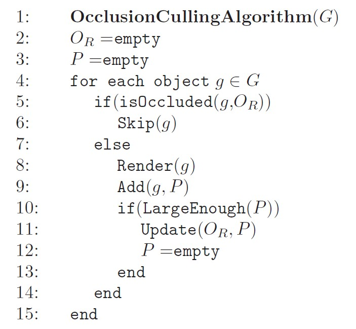

前人在遮挡剔除方面已经做了大量的工作，有多种不同种类的遮挡剔除算法：

-   Hardware Occlusion Queries 硬件遮挡查询

-   Hierarchical Z-Buffering 层次Z缓冲

-   Occlusion Horizons 遮挡地平线

-   Occluder Shrinking 遮挡物收缩

-   Frustum Growing视锥扩张

-   Virtual occluder 虚拟遮挡物算法

-   Shaft Occlusion Culling 轴遮挡裁剪

-   The HOM algorithm 层次遮挡映射算法

-   Ray Space Occlusion Culling 射线空间遮挡剔除

下面将对其中的常见几种介绍。

7.1 硬件遮挡查询 \| Hardware Occlusion Queries
----------------------------------------------

现代GPU可以以一种特殊的渲染模式来支持遮挡剔除。通过硬件遮挡查询（Hardware
Occlusion Queries），我们能够直接获得所提交的物体是否被绘制到场景中。

简单来说，硬件遮挡查询的基本思想是，当和Z缓冲器中内容进行比较时，用户可以通过查询硬件来找到一组多边形是否可见的，且这些多边形通常是复杂物体的包围体（如长方体或者k-DOP）。如果其中没有多边形可见，那么便可将这个物体裁剪掉。硬件实现对查询的多边形进行光栅化，并且将其深度和Z缓冲器进行比较。

更多细节，可以参考这篇论文：

Bittner J, Wimmer M, Piringer H, et al. Coherent hierarchical culling: Hardware
occlusion queries made useful[C]//Computer Graphics Forum. Blackwell Publishing,
Inc, 2004, 23(3): 615-624.

7.2 层次Z缓冲 \| Hierarchical Z-Buffering
-----------------------------------------

层次Z-缓冲算法（Hierarchical Z-Buffering
，HZB）是由Greene等人提出的一种算法，对遮挡剔除的研究有着显著的影响。尽管其在CPU上很少使用，但该算法是GPU上做Z-Culling（深度裁剪）的基础。

层次Z-缓冲算法用八叉树来维护场景模型，并将画面的Z缓冲器作为图像金字塔（也称为Z-金字塔（Z-pyramid）），该算法因此在图像空间中进行操作。其中，八叉树能够对场景的遮挡区域进行层次剔除，而Z-金字塔则可以对单个基元和边界体积进行层次Z缓冲。
因此Z-金字塔可以作为此算法的遮挡表示。

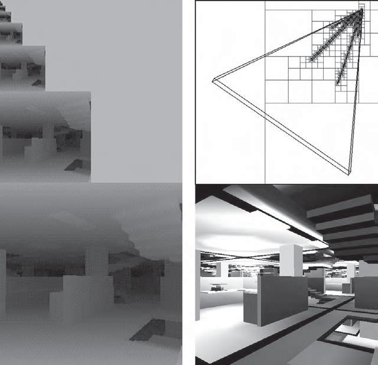

图21
使用HZB算法的遮挡裁剪示例，显示了一个复杂的场景（右下），相应的Z-pyramid(左图)，以及八叉树细分（右上）。通过从前到后遍历八叉树并裁剪遇到的八叉树节点，此算法可以仅访问可见的八叉树节点及其子节点（右上角的节点），的容器只对可见包围体中的多边形进行渲染。在这个例子中，遮挡八叉树节点的裁剪可以将深度复杂度从84，降低到了2.5。

更多细节，可以参考这篇论文：

Greene N, Kass M, Miller G. Hierarchical Z-buffer visibility[C]//Proceedings of
the 20th annual conference on Computer graphics and interactive techniques. ACM,
1993: 231-238.

7.3 其他遮挡剔除技术 \| Other Occlusion Culling Techniques
----------------------------------------------------------

前人在遮挡剔除方面已经做了大量的工作，但由于GPU的性能早已超过了CPU，所以这些算法中的大部分已经不再受青睐。因此这边只对一些常见的方案做一些简单介绍，至少他们还是值得传递下去的一些知识，因为架构和硬件的不断发展。

而随着多核系统的崛起，CPU端有了额外的资源，但难以直接给渲染本身带来提升，但同时使用单核或多核来执行基于单元的可见性测试或者其他进行方案，也已变得可以想象。

### 7.3.1 层次遮挡映射算法 \| Hierarchical Occlusion Map

层次遮挡映射（Hierarchical Occlusion Map
，HOM)）算法，类似层次Z缓冲算法，是一种启用分层图像空间剔除的方法。但其也不同于层次Z缓冲，因为它提供了使用近似遮挡剔除的能力。
HOM算法的基本思想是，每帧建立一个分层深度缓冲区，用于遮挡测试。并且在每个级别使用不透明度阈值来确定是否有足够的要渲染的对象是可见的。如果只有一小部分的对象是可见的，那么该对象被剔除。但作为一个基于CPU的算法系统，这个算法已经不受欢迎了。

对此算法感兴趣的朋友，可以进一步参考这篇论文：

Zhang H, Manocha D, Hudson T, et al. Visibility culling using hierarchical
occlusion maps[C]//Proceedings of the 24th annual conference on Computer
graphics and interactive techniques. ACM Press/Addison-Wesley Publishing Co.,
1997: 77-88.

### 7.3.2 遮挡地平线算法 \| Occlusion Horizons

遮挡地平线（Occlusion
Horizons）算法是一种非常简单的、基于点的可见性算法，可以对遮挡物进行融合，在基于点的可见性算法演示方面非常有用。由Wonka和Schmalstieg等人首先提出，并通过图形硬件将其进行了实现，随后Downs等人使用几何计算的方法将其独立开发实现，最早于1995年在电脑游戏中使用。

顾名思义，遮挡地平线算法的基本思想是裁剪掉位于地平线之间和之下的物体。
这种类型的算法经常被用来高效绘制如城市和村庄一样的城市环境。

通过从前到后渲染一个场景，我们可以定位到地平线在哪里进行渲染，而任何在当前地平线之后和之下的物体都可以被裁剪掉。

对此算法感兴趣的朋友，可以进一步参考这篇论文：

Downs L, Möller T, Séquin CH. Occlusion horizons for driving through urban
scenery[C]//Proceedings of the2001 symposium on Interactive 3D graphics. ACM,
2001: 121-124.

### 7.3.3 遮挡物收缩与视锥扩张算法 \| Occluder Shrinking and Frustum Growing

上文给出的遮挡地平线算法是基于点的可见性来判断的。有些时候采用基于单元的可见性方法更合适，但基于单元通常比基于点的可见性计算复杂度要高得多。Wonka等人提出了一种称为遮挡物收缩（Occluder
Shrinking）的方法，可以使用基于点的遮挡算法来生成基于单元的可见性，根据给定的量来缩小场景中所有遮挡物来达到延伸有效可见点的目的。他们也提出了一种视锥扩张（Frustum
Growing）技术，通常与Occluder Shrinking算法一起配合使用。

对此算法感兴趣的朋友，可以进一步参考如下三篇论文：

[1] Wonka P, Wimmer M, Schmalstieg D. Visibility preprocessing with occluder
fusion for urban walk throughs[M]//Rendering Techniques 2000. Springer, Vienna,
2000: 71-82.

[2] Wonka P, Wimmer M, Sillion F X. Instantvisibility[C]//Computer Graphics
Forum. Blackwell Publishers Ltd, 2001, 20(3):411-421.

[3] Wonka, Peter, Occlusion Culling for Real-Time Rendering of Urban
Environments,Ph.D. Thesis, The Institute of Computer Graphics and Algorithms,
Vienna University of Technology, June, 2001. Cited on p. 679

八、层次细节 \| LOD，Level of Detail
====================================

细节层次（Level of
Detail,LOD）的基本思想是当物体对渲染出图像贡献越少，使用越简单的形式来表达该物体。这是一个已经在各种游戏中广泛使用的基本优化技术。

例如，考虑一个包含1万个三角形的汽车，其中所包含的细节信息比较丰富。当视点靠近物体时，可以使用详细的细节表示，而当视点远离物体时，比如仅需覆盖200个像素，则完全无需渲染出1百万个三角形，相反，我可以使用诸如只有1000个三角形的简化模型。而由于距离的原因，简化后的模型与细节较丰富的模型看上去其实很接近。以这种方式，可以显著地提高渲染的性能开销。

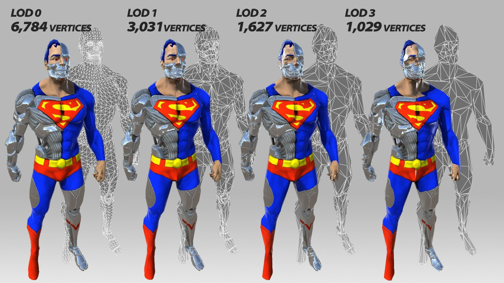

图22 LOD图示

图23 LOD图示

NVIDIA提供了一个非常有趣的网站，可以在网页上自己拖动分界线进行交互，查看《古墓丽影:崛起》的游戏画面不同级别的LOD显示情况，可以对LOD有一个很直观的认识，感兴趣的同学不妨试试：

[http://images.nvidia.com/geforce-com/international/comparisons/rise-of-the-tomb-raider/alt/rise-of-the-tomb-raider-level-of-detail-interactive-comparison-001-very-high-vs-low-alt.html](https://link.zhihu.com/?target=http%3A//images.nvidia.com/geforce-com/international/comparisons/rise-of-the-tomb-raider/alt/rise-of-the-tomb-raider-level-of-detail-interactive-comparison-001-very-high-vs-low-alt.html)

图24 《古墓丽影:崛起》不同LOD的在线对比网站 \@NVIDIA

通常情况下，雾效会与LOD一起使用。这样我们可以完全跳过对一些物体的渲染，直接用不透明的雾来进行遮挡。另外，雾效的机制可以实现下文所介绍到的时间临界LOD渲染（Time-Critical
LOD
Rendering）。通过将元平面移近观察者，可以更早地剔除对象，并且可以实现更快速的渲染以保持帧速率。

一般情况下，完整的LOD算法包含3个主要部分：

-   生成 Generation

-   选择 Selection

-   切换 Switching

其中，LOD的生成就是生成不同细节的模型表示。RTR3书中12.5节中讨论的简化方法可用于生成所需数量的LOD。另一种方法是手工制作具有不同数量的三角形模型。选择机制就是基于某种准则选取一个层次细节模型，比如屏幕上的评估面积。最后，我们还需要从一个细节层次转换到另一个细节层次，而这个过程便称为LOD切换。

下面对LOD的切换和选取相关的算法进一步说明。

8.1 LOD的切换 \| LOD Switching
------------------------------

当从一个LOD切换到另一个LOD的时候，忽然的模型替换往往会引起观察者的注意。这种现象被称为突越（Poping）。这里有几种不同的LOD切换方法，有着不同的特性：

-   离散几何LOD \| Discrete Geometry LODs

-   混合LOD \| Blend LODs

-   透明LOD \| Alpha LODs

-   连续LOD和几何形变LOD \| CLODs and Geomorph LODs

### 8.1.1 离散几何LOD \| Discrete Geometry LODs

离散几何LOD是最简单的LOD算法，不同的表示是不同图元数量的同一模型，但这种方法突越现象严重。

### 8.1.2 混合LOD \| Blend LODs

在概念上，完全可能存在一种直观的方法，从一个LOD切换到另一个LOD，只需要在较短的时间内在两个LOD之间执行一个线性混合，这种方法无疑可以得到一种比较平滑的切换，但是这种混合操作的代价较高。渲染两个LOD要比一个LOD需要更大开销，因此也就违背了LOD的初衷。但LOD切换通常发生在较短时间内容，在同一时间也不是对场景中所有物体进行切换，所以依然可以从中获益。

Giegl等人在《Unpopping: Solvingthe Image-Space Blend Problem for Smooth Discrete
LOD Transition
》这篇文章中提出了一种方法，实际应用的效果较为出色。思路是在两个LOD之间有一个alpha值的过渡，有兴趣的朋友可以进一步了解。

### 8.1.3 透明LOD \| Alpha LODs

完全避免突越现象的一种简单方法便是使用alpha
LOD。其中并没有使用同一物体很多不同细节的实例，而且每个物体只有一个实例。

随着LOD选取度量值（如与物体之间的距离）的增大，物体整体透明度也随之增大（也就是alpha值减小），当完全透明时，物体最终就会消失。

这种方法的优点是，比离散几何LOD方法上感觉更连续一些，可以避免突跃现象。此外，由于物体最终会完全消失而不需要进行渲染，可以得到很好的加速效果。

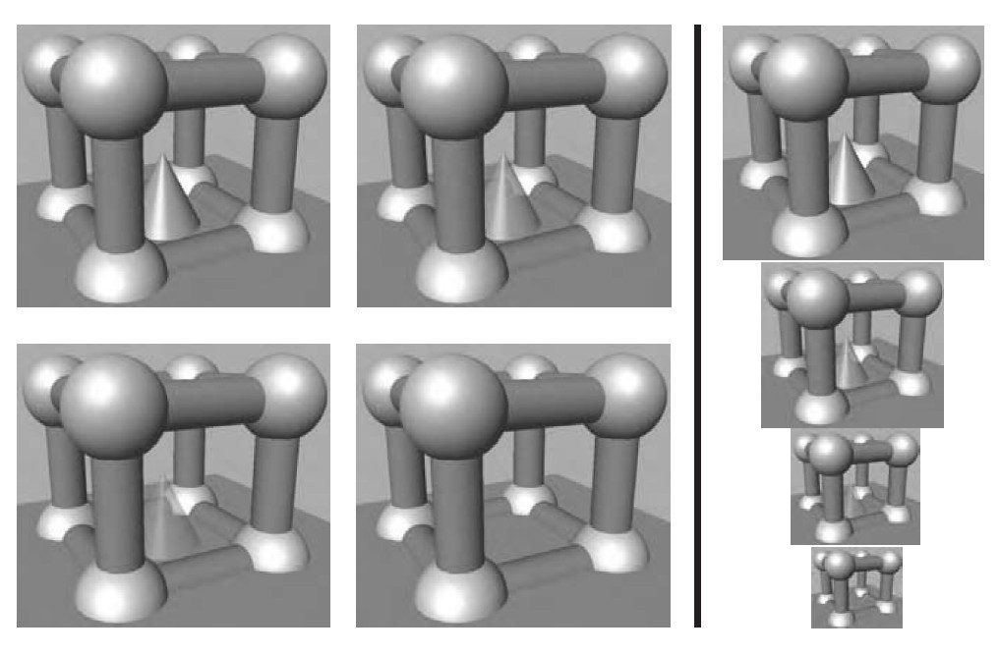

图25 使用Alpha
LOD对图中的圆锥体进行渲染，当距离圆锥体较远时，就提高它的透明度，直到最后消失。直线左边的图像是从同一距离处进行的观察，而直线右边的图像是左边图像不同尺寸的情形。

### 8.1.4 连续LOD和几何形变LOD \| CLODs and Geomorph LODs

连续细节层次（Continuous Level of Detail ,
CLOD）的基本思想是基于LOD选取值来精确决定可见多边形的数量。在100m远处，模型包含1000个多边形，当移动的到101m的地方时，模型减少到998个多边形。

几何形变层次细节（Geomorph
LODs）是基于简化生成的一组离散模型，且其中模型顶点之间的链接关系保持不变。而网格简化的过程可以从一个复杂的物体中创建各种不同的LOD模型，具体做法可以参见《Real-Time
Rendering
3rd》12.5.1一节，一种方法就是创建一组离散的LOD，然后按照上文中提到的方法来使用。这里的边塌陷（Edge
Collapse Methods）方法有一个有趣的性质，即允许在不同的LOD之间采用其他过渡方法。

图26
几何形变LOD的简化模型图示。左边和右边的图像所示分为为低细节层次和高细节层次的模型，中间的图像是在左右模型中间进行插值生成的几何变形模型。注意。中间的牛模型和右边的模型具有相同数量的顶点和三角形。

8.2 LOD的选取 \| LOD Selection
------------------------------

给定一个物体不同细节层次，必须做一个选择，决定渲染或者混合其中的哪一个层次，这就是LOD选择（LOD
selection）的任务。有几种不同的LOD选择方案，这些方案也可以用于遮挡裁剪算法。

常见的三种LOD选取技术是：

-   基于距离的LOD选取( Range-Based )

-   基于投影面积的LOD选取( Projected Area-Based )

-   基于滞后的LOD选取(Hysteresis)

依然是分别进行简要概述。

### 8.2.1 基于距离的LOD选取 \|Range-Based

选取LOD的一种常用方法是将物体的不同LOD于不同距离联系起来。细节最丰富的LOD的距离从0到一个用户定义值r1之间，下次层次的LOD的距离位于r1\~r2之间，以此类推，如下图：

图27
左图为基于距离的LOD的原理示例图。其中，LOD3是一个空物体，也就是表示当物体大于r3时，就不渲染任何物体，因为物体对图像的贡献度不够。右图为场景中的一个LOD节点，它只有一个子节点基于r。

### 8.2.2 基于投影面积的LOD选取 \| Projected Area-Based

基于投影面积的LOD选取，顾名思义，即投影面积越大，就选取细节越丰富的LOD。

### 8.2.3 基于滞后的LOD选取 \| Hysteresis

若用于确定LOD度量标准围绕某个值ri在画面之间是变化的，那么就会出现不必要的突跃现象，也就会在不同的LOD之间来回快速切换。对此，可以引入一个围绕ri值的滞后来解决这个问题。如下图，这是一个基于距离的LOD，可以应用于任何类型，当r增大时，使用上一行的LOD距离；当r减小时，使用下面一行的LOD距离。

图28 灰色区域表示的是基于滞后的LOD选取方法的滞后区域

### 8.2.4 其他LOD选取方法

基于距离和基于投影面积的LOD选取最常用。除了投影面积，Funk houser等人《Adaptive
Display Algorithm for Interactive Frame Rates During Visualization of Complex
Virtual
Environments》一文中还提出了使用物体的重要程度，运动，以及焦点等方法来作为LOD的选取方案。

观察者的注意力是一个重要的因素。例如，在一个体育游戏中，控制球的图像是用户最注意的地方，那么其他的部分就可以相对来说低的层次细节，具体可以参见论文《Never
Let ’Em See You Pop — Issues in Geometric Level of Detail Selection,”》。

另外，也可以使用整体的可见性，如通过密集的叶子看到的附近对象可以用较低的LOD呈现。以及限制整体高级别LOD的数量以控制渲染的三角形总数的开销。其他的一些LOD选取的因素有颜色、以及纹理等。此外，也可以使用感知尺度来选择LOD。

8.3 时间临界LOD渲染 \| Time-Critical LOD Rendering
--------------------------------------------------

我们通常希望渲染系统有一个固定的帧率，实际上这就是通常所说的“硬实时（Hard Real
Time）”或者时间临界（Time-Critical）。通常给定这类系统一个特定时间段（如30ms），必须在这段时间内完成相应的任务（如图像渲染）；当时间到的时候，必须停止处理。如果场景中的物体用LOD来表示，则可以实现硬实时渲染算法。

Funk houser等人在《Adaptive display algorithm for interactive frame rates during
visualization of complex virtual
environments》一文中提出了一种启发式算法（heuristic
algorithm），对于场景中的所有可见物体，可以自适应选取细节层次，从而满足固定帧率的要求。这个算法在场景中具有预测性，因为可见物体的LOD选取基于预期帧率和可见物体。这种启发式算法与对应的反应性算法（reactive
algorithm）形成了鲜明对比，后者的LOD选取基于前一帧画面的渲染时间。

九、 大型模型的渲染 \| Large Model Rendering
============================================

人们一直都认为所渲染的模型是适合存放到计算机主内存中的，但通常的情况其实并非如此。一个简单的例子便是渲染一个地球模型。这是一个非常复杂的话题，《Real-Time
Rendering 3rd》中也仅提了一下，然后列了一些相关文献，这里也仅简单说一下。

为了简单起见，大型模型的渲染通常会使用多个嵌套的数据结构，使用一个四叉树形式的数据结构来覆盖地球表面。而在每个叶节点内部可以根据具体内容使用不同的数据结构。此外，为了保持合适的帧率，即将进入视野中的模型区域，在需要之前从磁盘中分页，而四叉树也可以在这里使用的。

值得一提的是，在RTR3书中6.2.5节(对应本系列文章第五篇的5.4
节)讨论了裁剪图（clip-mapping）策略，便是管理大型纹理的一种技术。

将不同的加速算法进行结合是不容易的事情。Aliaga等人将几种算法结合起来，用于非常大型的场景，具体可以参考如下3篇文章：

[1] Akeley, K., and T. Jermoluk, “High-Performance Polygon Rendering,” Computer
Graphics (SIGGRAPH ’88 Proceedings), pp. 239–246, August 1988. Cited on p.22

[2] Akeley, K., P. Haeberli, and D. Burns, tomesh.c, a C-program on the SGI
Developer’s Toolbox CD, 1990. Cited on p. 543, 553, 554

[3] Akeley, Kurt, “RealityEngine Graphics,” Computer Graphics (SIGGRAPH 93
Proceedings), pp. 109–116, August 1993. Cited on p. 126

而关于大型模型的渲染，有兴趣的朋友可以近一步参考这篇SIGGRAPH笔记：

Manocha D, Aliaga D. Interactive walkthroughs of large geometric datasets[J].
SIGGRAPH 00 Course notes, 2000.

十、点渲染 \| Point Rendering
=============================

在1985年，Levoy 和 Whitted写了一篇具有开创性的技术报告《The use of points asa
display
primitive》。在这篇报告中，他们提出点作为一种新的图元来进行渲染，基本思想是用一个大的点集来表示物体表面并予以渲染。在随后的通道中，使用高斯滤波来填充渲染点之间的间隙。而高斯滤波器的半径取决于表面上点的密度和屏幕上的投影密度。有朋友的同学可以进一步了解。PDF地址在这里：

[https://www.cs.princeton.edu/courses/archive/spring01/cs598b/papers/levoy85.pdf](https://link.zhihu.com/?target=https%3A//www.cs.princeton.edu/courses/archive/spring01/cs598b/papers/levoy85.pdf)

图29 根据点渲染的方法渲染出来的模型，使用原型油彩（circular
splats）。左图为名为Lucy的天使模型，拥有10万个顶点。但在渲染中只用到了300万个油彩，中图、和右图是对左边图的放大。在渲染中，中间的图像使用4万个油彩，当视点停止移动时，就变成了右图，使用了60万个油彩（此图由Szymon
Rusinkiewicz的QSPlat program产生，Lucy的模型来自斯坦福图形实验室）

Reference
=========

[1] Bittner J, Wimmer M, Piringer H, et al. Coherent hierarchical culling:
Hardware occlusion queries made useful[C]//Computer Graphics Forum. Blackwell
Publishing, Inc, 2004, 23(3): 615-624.

[2] Zhang H, Manocha D, Hudson T, et al. Visibility culling using hierarchical
occlusion maps[C]//Proceedings of the 24th annual conference on Computer
graphics and interactive techniques. ACM Press/Addison-Wesley Publishing Co.,
1997: 77-88.

[3] 实时计算机图形学第二版[J]. 2004.

[4] Wonka P, Wimmer M, Schmalstieg D. Visibility preprocessing with occluder
fusion for urban walkthroughs[M]//Rendering Techniques 2000. Springer, Vienna,
2000: 71-82.

[5] [http://thomasdiewald.com/blog/?p=1488](https://link.zhihu.com/?target=http%3A//thomasdiewald.com/blog/%3Fp%3D1488)

[6] [http://blog.csdn.net/skybreaker/article/details/1828104](https://link.zhihu.com/?target=http%3A//blog.csdn.net/skybreaker/article/details/1828104)

[7] [https://en.wikipedia.org/wiki/Bounding_volume_hierarchy](https://link.zhihu.com/?target=https%3A//en.wikipedia.org/wiki/Bounding_volume_hierarchy)

[8] Wonka P, Wimmer M, Sillion F X. Instant visibility[C]//Computer Graphics
Forum. Blackwell Publishers Ltd, 2001, 20(3):  
411-421.

[9] Wonka, Peter, Occlusion Culling for Real-Time Rendering of Urban
Environments,Ph.D. Thesis, The Institute of Computer Graphics and Algorithms,
Vienna University of Technology, June, 2001. Cited on p. 679

[10] [http://insaneguy.me/attachments/spatial_ds--bsp_tree-octree-kd-tree.pdf](https://link.zhihu.com/?target=http%3A//insaneguy.me/attachments/spatial_ds--bsp_tree-octree-kd-tree.pdf)

[11] [http://book.51cto.com/art/201008/220506.htm](https://link.zhihu.com/?target=http%3A//book.51cto.com/art/201008/220506.htm)

[12] [http://blog.csdn.net/silangquan/article/details/17386353](https://link.zhihu.com/?target=http%3A//blog.csdn.net/silangquan/article/details/17386353)

[13] Akeley, K., and T. Jermoluk, “High-Performance Polygon Rendering,”Computer
Graphics (SIGGRAPH ’88 Proceedings), pp. 239–246, August 1988. Cited on p.22

[14] Akeley, K., P. Haeberli, and D. Burns, tomesh.c, a C-program on the SGI
Developer’s Toolbox CD, 1990. Cited on p. 543, 553, 554

[15] Akeley, Kurt, “RealityEngine Graphics,” Computer Graphics (SIGGRAPH 93
Proceedings),pp. 109–116, August 1993. Cited on p. 126

[16] 题图来自《最终幻想XV》
