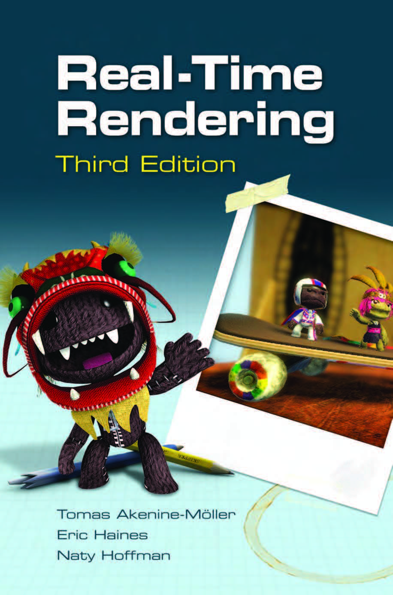
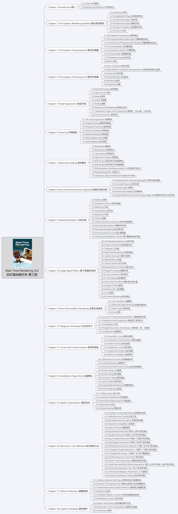

【《Real-Time Rendering 3rd》 提炼总结】 (一) 全书知识点总览
====================

 

一、《Real-Time Rendering 3rd》其书
-----------------------------------

在实时渲染和计算机图形学领域，《Real-Time Rendering
3rd》这本书一直备受推崇。有人说，它实时渲染的圣经。也有人说，它是绝世武功的目录。

诚然，《Real-Time Rendering
3rd》这本书的世界观架构宏大，基本涵盖了计算机图形学的方方面面，可谓包罗万象。概念讲得清楚明了，有丰富的论文引用，可供作为工具书查阅，深入某细分领域继续学习使用。

当然，如果我们吹毛求疵，那么也可以说，正因这本书包罗万象，由于篇幅受限，就会拥有一个缺点，就是大而不精。由于篇幅，很多知识点到为止，无法展开讲解，缺少更多范例，这就会让初学者读起来理解坡度稍为陡峭。但我们知道，图形学和实时渲染领域的知识浩如烟海，就算是写个字典式的总览，这本书的篇幅也已经达到了惊人的1047页，要是再写详细一些，估计至少得3000页了。

总之，《Real-Time Rendering
3rd》这本书，可谓图形学界“九阴真经总纲”一般的存在，当世武功的心法口诀，尽数记载。它涵盖了计算机图形和实时渲染的方方面面，可做论文综述合集了解全貌，也可作案头工具书日后查用。
 
 

二、相关背景
------------

《Real-Time Rendering
3rd》出版于2008年，至今已经9年之久，但丝毫不能减弱它作为实时渲染界泰斗之作的重量。

另外，《Real-Time Rendering
4th》的出版遥遥无期，据了解，作者目前似乎没有出第四版的计划。

这本书第三版目前没有中译版，只有第二版（英文原版出版于2002年）的中译版。网络上有一些第三版的翻译，但大多翻译到第四章后就没有下文。
 
 

三、《Real-Time Rendering 3rd》全书知识点总览
---------------------------------------------

上文已经说到，《Real-Time Rendering
3rd》这本书，可谓图形学界“九阴真经总纲”一般的存在，当世武功的心法口诀，尽数记载。

而当我画完这张思维导图的时候，仔细看了看，还真有点“九阴真经总纲”图解的感觉。（建议另存为后放大查看）

 
 

四、包含宝藏的书本主页
----------------------

当然不能忘记书本主页，里面有一大堆图形学和渲染的书籍推荐，也有不少丰富的博文与资源。相信喜欢图形学和实时渲染的你，一定会爱不释手的。

地址在这里：[Real-Time Rendering
Resources](http://www.realtimerendering.com/)

 
 
 